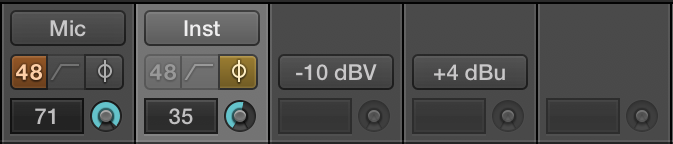

> 导航：[总目录](../../README.md) · [technotes](../../_indexes/technotes.md)

Technical Note TN2332

# Logic Pro X - Core Audio Device Properties Supported by Logic Pro X 10.1

With the release of Logic Pro X 10.1 the Logic Mixer allows control of microphone and other input settings for compatible audio interfaces. To support this functionality, a Core Audio device driver may support the following Audio device properties related to microphone inputs.

[Introduction](#apple-f4xwc4dqnrsv64tfmyxwi33df52wszbpirkfgnbqgaytkmjwgewugsbrfvke4vcbi4yq)[Header File](#apple-f4xwc4dqnrsv64tfmyxwi33df52wszbpirkfgnbqgaytkmjwgewugsbrfvke4vcbi4za)[Input Type](#apple-f4xwc4dqnrsv64tfmyxwi33df52wszbpirkfgnbqgaytkmjwgewugsbrfveu4ucvkrpviwkqiu)[Phantom Power](#apple-f4xwc4dqnrsv64tfmyxwi33df52wszbpirkfgnbqgaytkmjwgewugsbrfvieqqkokrhu2x2qj5lukuq)[High Pass Filter](#apple-f4xwc4dqnrsv64tfmyxwi33df52wszbpirkfgnbqgaytkmjwgewugsbrfveesr2il5iecu2tl5destcuivja)[Phase Invert](#apple-f4xwc4dqnrsv64tfmyxwi33df52wszbpirkfgnbqgaytkmjwgewugsbrfvieqqktivpustswivjfi)[Input Gain](#apple-f4xwc4dqnrsv64tfmyxwi33df52wszbpirkfgnbqgaytkmjwgewugsbrfveu4ucvkrpuoqkjjy)[Reference](#apple-f4xwc4dqnrsv64tfmyxwi33df52wszbpirkfgnbqgaytkmjwgewugsbrfvjekrsfkjcu4q2f)[Document Revision History](#apple-f4xwc4dqnrsv64tfmyxwi33df52wszbpirkfgnbqgaytkmjwgewvezlwnfzws33ojbuxg5dpoj4s2rdpnz2ey2lonncwyzlnmvxhiskel4yq)

## Introduction

The Logic Pro X 10.1 Mixer allows for setting and displaying Core Audio device property values and listens to notifications when the value of a certain property has changed; for example, if a user turns the input gain knob on the audio device. This document contains a list of Core Audio device properties currently supported by the Logic Pro X Mixer.

Your Core Audio device driver may support the following device properties to gain this functionality from the Logic Pro X Mixer or any other audio application that also supports these hardware device properties.

__Note:__ If a device driver does not support one or more of these properties, the Logic Mixer will automatically hide or disable the corresponding controls.

__Figure 1__  Phantom Power, HPF & Phase Support.

[Back to Top](#)

## Header File

The `AudioHardware.h` header file is part of the `CoreAudio.framework` and defines the HAL's object model for interacting with audio device objects including the properties, types, and constants that describe the property values. An audio device object represents an external device in the HAL.

For a further discussion of the audio HAL, Audio Objects and the Audio Device class, see the __Overview__ section in `AudioHardware.h`.

[Back to Top](#)

## Input Type

Pop-up button providing entries like: Mic, Instrument, -10dBV, +4dBu.

`kAudioObjectPropertyElementName` - A `CFString` that contains a human readable name for the given element in the given scope. The caller is responsible for releasing the returned `CFObject`.

`kAudioDevicePropertyChannelNominalLineLevel` - An array of `UInt32s` whose values are the item IDs for the currently selected nominal line levels. This property is implemented by an `AudioControl` object that is a subclass of `AudioLineLevelControl`.

`kAudioDevicePropertyChannelNominalLineLevels` - An array of `UInt32s` that represent all the IDs of all the nominal line levels currently available. This property is implemented by an `AudioControl` object that is a subclass of `AudioLineLevelControl`.

`kAudioDevicePropertyChannelNominalLineLevelNameForIDCFString` - This property translates the given nominal line level item ID into a human readable name using an `AudioValueTranslation` structure. The input data is the `UInt32` containing the item ID to be translated and the output data is a `CFString`. The caller is responsible for releasing the returned `CFObject`. This property is implemented by an `AudioControl` object that is a subclass of `AudioLineLevelControl`.

[Back to Top](#)

## Phantom Power

Toggle button to switch on/off phantom power.

`kAudioDevicePropertyPhantomPower` - A `UInt32` where a value of 1 means that the `AudioDevice` has enabled phantom power for the given element. The property is implemented by an `AudioControl` object that is a subclass of `AudioPhantomPowerControl`.

[Back to Top](#)

## High Pass Filter

Toggle button to switch on/off a high pass filter.

`kAudioDevicePropertyHighPassFilterSetting` - An array of `UInt32s` whose values are the item IDs for the currently selected high pass filter setting. This property is implemented by an `AudioControl` object that is a subclass of `AudioHighPassFilterControl`.

`kAudioDevicePropertyHighPassFilterSettings` - An array of `UInt32s` that represent all the IDs of all the high pass filter settings currently available. This property is implemented by an `AudioControl` object that is a subclass of `AudioHighPassFilterControl`.

`kAudioDevicePropertyHighPassFilterSettingNameForIDCFString` - This property translates the given high pass filter setting item ID into a human readable name using an `AudioValueTranslation` structure. The input data is the `UInt32` containing the item ID to be translated and the output data is a `CFString`. The caller is responsible for releasing the returned `CFObject`. This property is implemented by an `AudioControl` object that is a subclass of `AudioHighPassFilterControl`.

[Back to Top](#)

## Phase Invert

Toggle button to switch on/off phase invert.

`kAudioDevicePropertyPhaseInvert` - A `UInt32` where a value of 1 means that phase of the signal for the given element has been flipped 180 degrees. The property is implemented by an `AudioControl` object that is a subclass of `AudioPhaseInvertControl`.

[Back to Top](#)

## Input Gain

Display and knob to change the input gain.

`kAudioDevicePropertyVolumeScalar` - A `Float32` that represents the value of the volume control. The range is between 0.0 and 1.0 (inclusive). Note that the set of all `Float32` values between 0.0 and 1.0 inclusive is much larger than the set of actual values that the hardware can select. This means that the `Float32` range has a many to one mapping with the underlying hardware values. As such, setting a scalar value will result in the control taking on the value nearest to what was set. This property is implemented by an `AudioControl` object that is a subclass of `AudioVolumeControl`.

`kAudioDevicePropertyVolumeDecibels` - A `Float32` that represents the value of the volume control in dB. Note that the set of all `Float32` values in the dB range for the control is much larger than the set of actual values that the hardware can select. This means that the `Float32` range has a many to one mapping with the underlying hardware values. As such, setting a dB value will result in the control taking on the value nearest to what was set. This property is implemented by an `AudioControl` object that is a subclass of `AudioVolumeControl`.

[Back to Top](#)

## Reference

[Logic Pro X 10.1 Release Notes](http://support.apple.com/en-us/HT203718)

[Core Audio User-Space Driver Examples](https://developer.apple.com/library/mac/samplecode/AudioDriverExamples/Introduction/Intro.html#//apple_ref/doc/uid/DTS40013590)

[Back to Top](#)

---

#### Document Revision History

| __Date__ | __Notes__ |
| 2015-02-11 | New document that discusses the Logic Pro X 10.1 mixer which now allows remote control of microphone and other input settings for compatible audio interfaces. |

