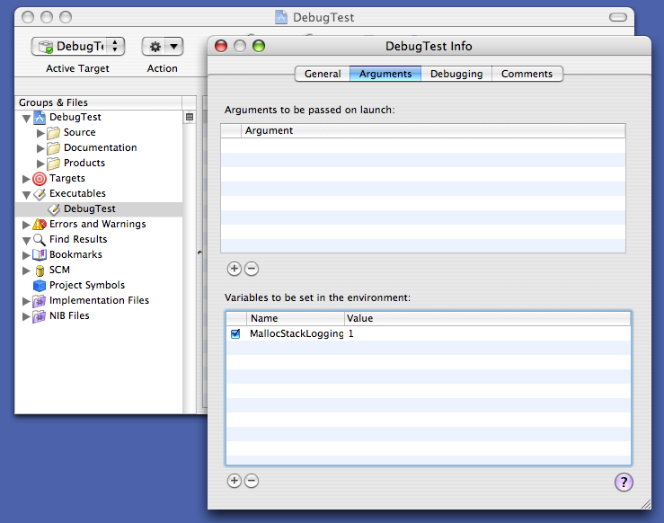
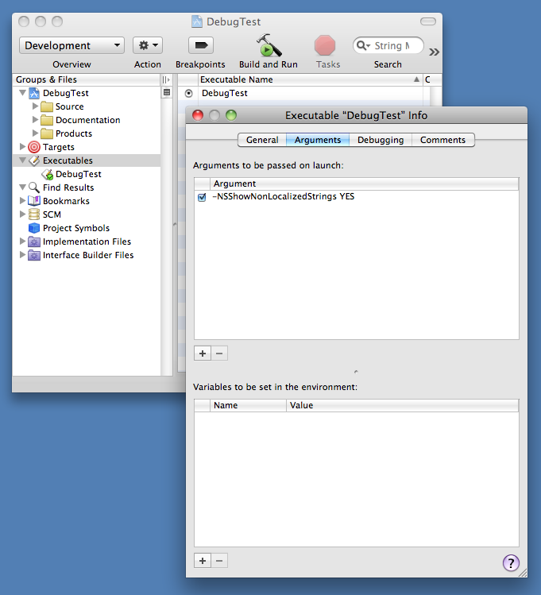
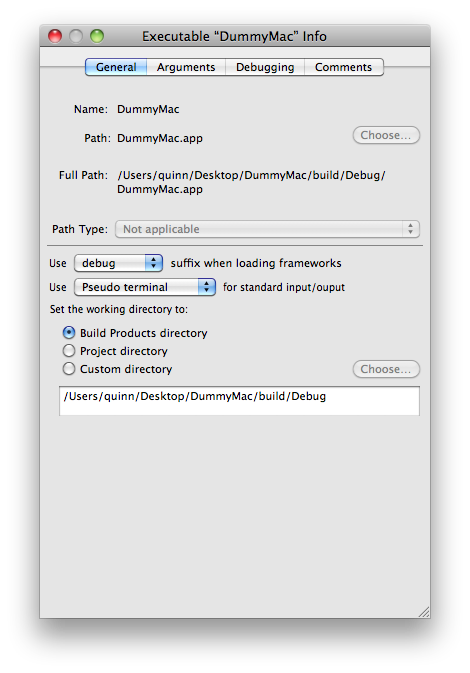
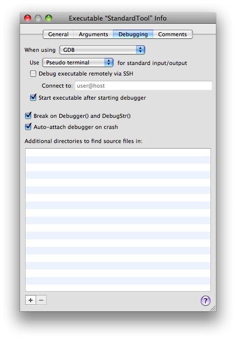
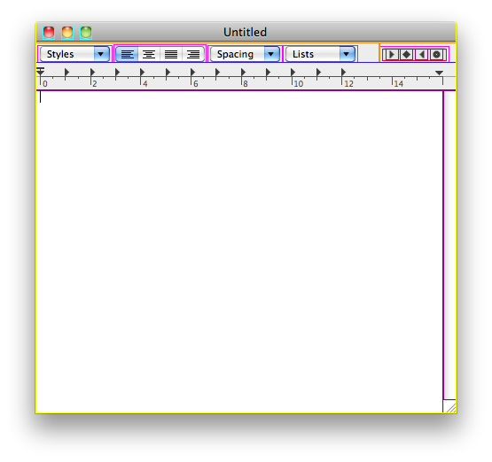
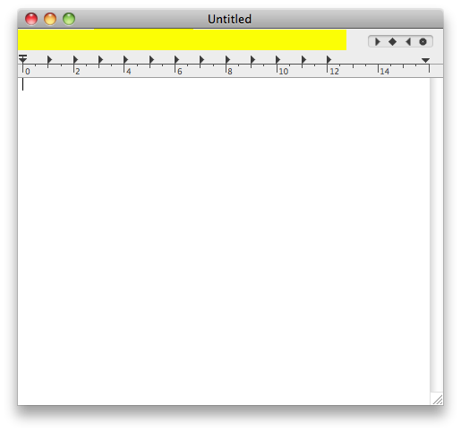

> 导航：[总目录](../../README.md) · [technotes](../../_indexes/technotes.md)


Technical Note TN2124

# Mac OS X Debugging Magic

Mac OS X contains a number of 'secret' debugging facilities, including environment variables, preferences, routines callable from GDB, and so on. This technotes describes these facilities. If you're developing for Mac OS X, you should look through this list to see if you're missing out on something that will make your life easier.

[Introduction](#apple-f4xwc4dqnrsv64tfmyxwi33df52wszbpirkfgmjqgaydgmzzgewugsbrfvjukq2jjzkfety)[Basics](#apple-f4xwc4dqnrsv64tfmyxwi33df52wszbpirkfgmjqgaydgmzzgewugsbrfvjukq2cifjusq2t)[Enabling Debugging Facilities](#apple-f4xwc4dqnrsv64tfmyxwi33df52wszbpirkfgmjqgaydgmzzgewugsbrfvjukq2fjzauetcf)[Seeing Debug Output](#apple-f4xwc4dqnrsv64tfmyxwi33df52wszbpirkfgmjqgaydgmzzgewugsbrfvjukq2tivcustshj5kviucvkq)[Some Assembly Required](#apple-f4xwc4dqnrsv64tfmyxwi33df52wszbpirkfgmjqgaydgmzzgewugsbrfvjukq2tj5gukqktkncu2qsmle)[Intel 64-Bit](#apple-f4xwc4dqnrsv64tfmyxwi33df52wszbpirkfgmjqgaydgmzzgewugsbrfvjukq2jjzkektbwgq)[Intel 32-Bit](#apple-f4xwc4dqnrsv64tfmyxwi33df52wszbpirkfgmjqgaydgmzzgewugsbrfvjukq2jjzkektbtgi)[PowerPC](#apple-f4xwc4dqnrsv64tfmyxwi33df52wszbpirkfgmjqgaydgmzzgewugsbrfvjukq2qj5lukusqim)[Architecture Gotchas](#apple-f4xwc4dqnrsv64tfmyxwi33df52wszbpirkfgmjqgaydgmzzgewugsbrfvjukq2bkjbuqskuivbvivksivdu6vcdjbavg)[Controlled Crash](#apple-f4xwc4dqnrsv64tfmyxwi33df52wszbpirkfgmjqgaydgmzzgewugsbrfvjukq2dj5hfiuspjrgekrcdkjavgsa)[Instruments](#apple-f4xwc4dqnrsv64tfmyxwi33df52wszbpirkfgmjqgaydgmzzgewugsbrfvjukq2jjzjviusvjvcu4vct)[CrashReporter](#apple-f4xwc4dqnrsv64tfmyxwi33df52wszbpirkfgmjqgaydgmzzgewugsbrfvjukq2dkjavgscsivie6usuivja)[BSD](#apple-f4xwc4dqnrsv64tfmyxwi33df52wszbpirkfgmjqgaydgmzzgewugsbrfvjukq2cknca)[Memory Allocator](#apple-f4xwc4dqnrsv64tfmyxwi33df52wszbpirkfgmjqgaydgmzzgewugsbrfvjukq2nifgeyt2d)[Standard C++ Library](#apple-f4xwc4dqnrsv64tfmyxwi33df52wszbpirkfgmjqgaydgmzzgewugsbrfvjukq2dkbgfku2qjrkvg)[Dynamic Linker (dyld)](#apple-f4xwc4dqnrsv64tfmyxwi33df52wszbpirkfgmjqgaydgmzzgewugsbrfvjukq2elfgei)[Core Dumps](#apple-f4xwc4dqnrsv64tfmyxwi33df52wszbpirkfgmjqgaydgmzzgewugsbrfvjukq2dj5jekrcvjvifg)[MallocDebug and ObjectAlloc](#apple-f4xwc4dqnrsv64tfmyxwi33df52wszbpirkfgmjqgaydgmzzgewugsbrfvjukq2nifgeyt2dircuevkh)[Guarded Memory Allocator](#apple-f4xwc4dqnrsv64tfmyxwi33df52wszbpirkfgmjqgaydgmzzgewugsbrfvjukq2hjvauytcpim)[Command Line Tools](#apple-f4xwc4dqnrsv64tfmyxwi33df52wszbpirkfgmjqgaydgmzzgewugsbrfvjukq2uj5huyuy)[Debug Libraries](#apple-f4xwc4dqnrsv64tfmyxwi33df52wszbpirkfgmjqgaydgmzzgewugsbrfvjukq2eivbfkr2mjfba)[Escaping the Window Server](#apple-f4xwc4dqnrsv64tfmyxwi33df52wszbpirkfgmjqgaydgmzzgewugsbrfvjukq2oj5lustsej5lvgrkskzcve)[DTrace](#apple-f4xwc4dqnrsv64tfmyxwi33df52wszbpirkfgmjqgaydgmzzgewugsbrfvjukq2ekrjecq2f)[DTrace-based Tools](#apple-f4xwc4dqnrsv64tfmyxwi33df52wszbpirkfgmjqgaydgmzzgewugsbrfvjukq2ekrjecq2fkrhu6tct)[Daemons](#apple-f4xwc4dqnrsv64tfmyxwi33df52wszbpirkfgmjqgaydgmzzgewugsbrfvjukq2eifcu2t2okm)[launchd](#apple-f4xwc4dqnrsv64tfmyxwi33df52wszbpirkfgmjqgaydgmzzgewugsbrfvjukq2mifku4q2iiq)[Directory Services](#apple-f4xwc4dqnrsv64tfmyxwi33df52wszbpirkfgmjqgaydgmzzgewugsbrfvjukq2ejfjekq2uj5jfsu2fkjlesq2f)[mDNSResponder](#apple-f4xwc4dqnrsv64tfmyxwi33df52wszbpirkfgmjqgaydgmzzgewugsbrfvjukq2nirhfgusfknie6tseivja)[notifyd](#apple-f4xwc4dqnrsv64tfmyxwi33df52wszbpirkfgmjqgaydgmzzgewugsbrfvjukq2oj5kesrsziq)[lookupd](#apple-f4xwc4dqnrsv64tfmyxwi33df52wszbpirkfgmjqgaydgmzzgewugsbrfvjukq2mj5huwvkqiq)[Printing (CUPS)](#apple-f4xwc4dqnrsv64tfmyxwi33df52wszbpirkfgmjqgaydgmzzgewugsbrfvjukq2qkjeu4vcjjzdq)[Core Services](#apple-f4xwc4dqnrsv64tfmyxwi33df52wszbpirkfgmjqgaydgmzzgewugsbrfvjukq2dj5jeku2fkjlesq2fkm)[Core Foundation](#apple-f4xwc4dqnrsv64tfmyxwi33df52wszbpirkfgmjqgaydgmzzgewugsbrfvjukq2diy)[Apple Events](#apple-f4xwc4dqnrsv64tfmyxwi33df52wszbpirkfgmjqgaydgmzzgewugsbrfvjukq2biu)[Code Fragment Manager (CFM)](#apple-f4xwc4dqnrsv64tfmyxwi33df52wszbpirkfgmjqgaydgmzzgewugsbrfvjukq2dizgq)[Component Manager](#apple-f4xwc4dqnrsv64tfmyxwi33df52wszbpirkfgmjqgaydgmzzgewugsbrfvjukq2dj5gvat2oivhfi)[File Manager](#apple-f4xwc4dqnrsv64tfmyxwi33df52wszbpirkfgmjqgaydgmzzgewugsbrfvjukq2dknde2)[Folder Manager](#apple-f4xwc4dqnrsv64tfmyxwi33df52wszbpirkfgmjqgaydgmzzgewugsbrfvjukq2gj5geirkskm)[Gestalt](#apple-f4xwc4dqnrsv64tfmyxwi33df52wszbpirkfgmjqgaydgmzzgewugsbrfvjukq2hivjviqkmkq)[Pasteboard](#apple-f4xwc4dqnrsv64tfmyxwi33df52wszbpirkfgmjqgaydgmzzgewugsbrfvjukq2qifjvirkcj5avera)[Threading](#apple-f4xwc4dqnrsv64tfmyxwi33df52wszbpirkfgmjqgaydgmzzgewugsbrfvjukq2ujbjekqkejfheo)[Web Services](#apple-f4xwc4dqnrsv64tfmyxwi33df52wszbpirkfgmjqgaydgmzzgewugsbrfvjukq2xivbfgrkskzeugrkt)[Disks and Discs](#apple-f4xwc4dqnrsv64tfmyxwi33df52wszbpirkfgmjqgaydgmzzgewugsbrfvjukq2ejfjuwuy)[Disk Arbitration](#apple-f4xwc4dqnrsv64tfmyxwi33df52wszbpirkfgmjqgaydgmzzgewugsbrfvjukq2ejfjuwqksii)[Disc Recording](#apple-f4xwc4dqnrsv64tfmyxwi33df52wszbpirkfgmjqgaydgmzzgewugsbrfvjukq2ejfjugusfinhvercjjzdq)[Disk Utility](#apple-f4xwc4dqnrsv64tfmyxwi33df52wszbpirkfgmjqgaydgmzzgewugsbrfvjukq2ejfjuwvkujfgesvcz)[Application Services](#apple-f4xwc4dqnrsv64tfmyxwi33df52wszbpirkfgmjqgaydgmzzgewugsbrfvjukq2bkbieyskdifkest2okncvevsjincvg)[Core Graphics](#apple-f4xwc4dqnrsv64tfmyxwi33df52wszbpirkfgmjqgaydgmzzgewugsbrfvjukq2dj5jekr2sifieqskdkm)[Process Manager](#apple-f4xwc4dqnrsv64tfmyxwi33df52wszbpirkfgmjqgaydgmzzgewugsbrfvjukq2qkjhugrktknguctsbi5cve)[QuickDraw](#apple-f4xwc4dqnrsv64tfmyxwi33df52wszbpirkfgmjqgaydgmzzgewugsbrfvjukq2rkveugs2ekjavo)[Services](#apple-f4xwc4dqnrsv64tfmyxwi33df52wszbpirkfgmjqgaydgmzzgewugsbrfvjukq2tivjfmskdivjq)[Quick Look](#apple-f4xwc4dqnrsv64tfmyxwi33df52wszbpirkfgmjqgaydgmzzgewugsbrfvjukq2rkveugs2mj5huw)[Carbon (HIToolbox)](#apple-f4xwc4dqnrsv64tfmyxwi33df52wszbpirkfgmjqgaydgmzzgewugsbrfvjukq2difjeet2o)[HIToolbox Object Printing Routines](#apple-f4xwc4dqnrsv64tfmyxwi33df52wszbpirkfgmjqgaydgmzzgewugsbrfvjukq2ijrkeeucsjfhfirkskm)[HIToolbox Region Flashing](#apple-f4xwc4dqnrsv64tfmyxwi33df52wszbpirkfgmjqgaydgmzzgewugsbrfvjukq2ijrkeersmifjuqrkskm)[HIToolbox Event Debugging](#apple-f4xwc4dqnrsv64tfmyxwi33df52wszbpirkfgmjqgaydgmzzgewugsbrfvjukq2ijrkeerkwivhfircfijkuo)[HIToolbox Event Statistics](#apple-f4xwc4dqnrsv64tfmyxwi33df52wszbpirkfgmjqgaydgmzzgewugsbrfvjukq2ijrkeerkwivhfiu2uifkfg)[Other HIToolbox Debugging Facilities](#apple-f4xwc4dqnrsv64tfmyxwi33df52wszbpirkfgmjqgaydgmzzgewugsbrfvjukq2ijrkeet2ujbcve)[Cocoa and Cocoa Touch](#apple-f4xwc4dqnrsv64tfmyxwi33df52wszbpirkfgmjqgaydgmzzgewugsbrfvjukq2dj5bu6qi)[Objective-C](#apple-f4xwc4dqnrsv64tfmyxwi33df52wszbpirkfgmjqgaydgmzzgewugsbrfvjukq2pijfekq2ujflekqy)[Garbage Collection](#apple-f4xwc4dqnrsv64tfmyxwi33df52wszbpirkfgmjqgaydgmzzgewugsbrfvjukq2him)[Foundation](#apple-f4xwc4dqnrsv64tfmyxwi33df52wszbpirkfgmjqgaydgmzzgewugsbrfvjukq2gj5ku4rcbkreu6tq)[Core Data](#apple-f4xwc4dqnrsv64tfmyxwi33df52wszbpirkfgmjqgaydgmzzgewugsbrfvjukq2dj5jekrcbkraq)[AppKit](#apple-f4xwc4dqnrsv64tfmyxwi33df52wszbpirkfgmjqgaydgmzzgewugsbrfvjukq2bkbiewsku)[Sync Services](#apple-f4xwc4dqnrsv64tfmyxwi33df52wszbpirkfgmjqgaydgmzzgewugsbrfvjukq2tlfhegu2fkjlesq2fkm)[Networking](#apple-f4xwc4dqnrsv64tfmyxwi33df52wszbpirkfgmjqgaydgmzzgewugsbrfvjukq2oivkfot2sjneu4ry)[Document Revision History](#apple-f4xwc4dqnrsv64tfmyxwi33df52wszbpirkfgmjqgaydgmzzgewvezlwnfzws33ojbuxg5dpoj4s2rdpnz2ey2lonncwyzlnmvxhiskel4yq)

## Introduction

All Apple systems include debugging facilities added by Apple engineering teams to help develop and debug specific subsystems. Many of these facilities remain in released system software and you can use them to debug your code. This technote describes some of the more broadly useful ones. In cases where a debugging facility is documented in another place, there's a short overview of the facility and a link to the existing documentation.

__Important:__ This is not an exhaustive list: not all debugging facilities are, or will be, documented.

Many of the details covered in this technote vary from platform to platform and release to release. As such, you may encounter minor variations between platforms, and on older or newer systems. Known significant variations are called out in the text.

This technote was written with reference to Mac OS X 10.6.

__Warning:__ The debugging facilities described in this technote are unsupported. Apple reserves the right to change or eliminate each facility as dictated by the evolution of the OS; this has happened in the past, and is very likely to happen again in the future. __These facilities are for debugging only: you must not ship a product that relies on the existence or functionality of the facilities described in this technote.__

__Note:__ If you also develop for iOS, you may want to read [Technical Note TN2239, 'iOS Debugging Magic'](https://developer.apple.com/technotes/tn2010/tn2239.html).

This technote covers advanced debugging techniques. If you're just getting started, you should consult the following material:

- GDB is the system's primary debugging tool. For a full description of GDB, see [Debugging with GDB](https://developer.apple.com/library/mac/#documentation/DeveloperTools/gdb/gdb/gdb_toc.html).
- Xcode is Apple's integrated development environment (IDE). It includes a sophisticated graphical debugger, implemented as a wrapper around GDB. For more information about Xcode, see the "Tools & Languages" section of the Apple developer [Reference Library](https://developer.apple.com/library/mac/navigation/).

This technote does not cover performance debugging. If you're trying to debug a performance problem, the best place to start is the [Getting Started with Performance](https://developer.apple.com/library/mac/#referencelibrary/GettingStarted/GS_Performance/index.html) document.

[Back to Top](#)

## Basics

The later sections of this technote describe the debugging facilities in detail. Many of these facilities use similar techniques to enable and disable the facility, and to see its output. This section describes these common techniques.

### Enabling Debugging Facilities

Some debugging facilities are enabled by default. However, most facilities must be enabled using one of the techniques described in the following sections.

#### Environment Variables

In many cases you can enable a debugging facility by setting a particular environment variable. You can do this using the executable inspector in Xcode. Figure 1 shows an example of this.

__Figure 1__  Setting environment variables in Xcode



In addition, there are a numerous other ways to set an environment variable. The first involves running your application from Terminal and specifying the environment variable on the command line. Listing 1 shows how to set an environment variable in the `sh` shell; Listing 2 shows the equivalent in `csh`.

__Listing 1__  Setting an environment variable in an sh-compatible shell

```shell
$ MallocScribble=1 /Applications/TextEdit.app/Contents/MacOS/TextEdit  TextEdit(13506) malloc: enabling scribbling to detect mods to free blocks […]
```

__Listing 2__  Setting an environment variable in a csh-compatible shell

```
% env MallocScribble=1 /Applications/TextEdit.app/Contents/MacOS/TextEdit TextEdit(13512) malloc: enabling scribbling to detect mods to free blocks […]
```

__Note:__ The default shell in Mac OS X 10.3 and later is `bash`, an `sh`-compatible shell. The default shell in Mac OS X 10.2.x and earlier was `tcsh`, a `csh`-compatible shell. Unless otherwise noted, the remainder of this technote assumes that you're using `bash`.

In addition, you can set environment variables in GDB, as shown in Listing 3.

__Listing 3__  Setting an environment variable in GDB

```shell
$ gdb /Applications/TextEdit.app GNU gdb 6.3.50-20050815 […] (gdb) set env MallocScribble 1 (gdb) r Starting program: /Applications/TextEdit.app/Contents/MacOS/TextEdit  bash(13587) malloc: enabling scribbling to detect mods to free blocks […]
```

[Technical Q&A QA1067, 'Setting environment variables for user processes'](https://developer.apple.com/qa/qa2001/qa1067.html) describes a mechanism for setting environment variables for all processes launched by a specific user.

Finally, you can use `launchctl` to set environment variables inherited by all processes run by `launchd`; see [launchd](#apple-f4xwc4dqnrsv64tfmyxwi33df52wszbpirkfgmjqgaydgmzzgewugsbrfvjukq2mifku4q2iiq) for details.

#### Preferences

Some debugging facilities are enabled by setting a special preference. You can set such a debugging preference by configuring a command line argument in Xcode. Figure 2 shows how this is done.

__Figure 2__  Setting command line arguments in Xcode



You can also do this by running your program from the command line, and supplying the preference in the arguments. Listing 4 shows an example.

__Listing 4__  Temporarily setting a preference

```
$ /Applications/TextEdit.app/Contents/MacOS/TextEdit -NSTraceEvents YES 2004-10-25 17:28:41.143 TextEdit[5774] timeout = 62993575878.857864 seco… 2004-10-25 17:28:41.179 TextEdit[5774] got apple event of class 61657674… […]
```

In addition to the temporary techniques described above, you can set preferences permanently using the `defaults` command line tool. Listing 5 shows how to do this. This listing sets the `NSTraceEvents` preference for the TextEdit application (whose bundle identifier is `com.apple.TextEdit`) to YES.

__Listing 5__  Setting a preference using defaults

```shell
$ defaults write com.apple.TextEdit NSTraceEvents YES $ /Applications/TextEdit.app/Contents/MacOS/TextEdit  2010-02-01 13:32:36.260 TextEdit[18687:903] timeout = 62827180043.739540 seconds[…] 2010-02-01 13:32:36.273 TextEdit[18687:903] got apple event of class 61657674, I[…] […]
```

Once you're finished debugging, you should delete the preference, also using `defaults`, as shown in Listing 6.

__Listing 6__  Deleting a preference using defaults

```shell
$ defaults delete com.apple.TextEdit NSTraceEvents
```

For more information about `defaults`, consult its [man page](x-man-page://1/defaults).

#### Callable Routines

Many system frameworks include routines that print debugging information to `stderr`. These routines may be specifically designed to be callable from within GDB, or they may just be existing API routines that are useful while debugging. Listing 7 shows an example of how to call a debugging routine from GDB; specifically, it calls `CFBundleGetAllBundles` to get a list of all the bundles loaded in the application, and then prints that list by calling the `CFShow` routine.

__Listing 7__  Calling a debugging routine from GDB

```
(gdb) call (void)CFShow((void *)CFBundleGetAllBundles()) <CFArray 0x10025c010 [0x7fff701faf20]>{type = mutable-small, count = 59, values = (     0 : CFBundle 0x100234d00 </System/Library/Frameworks/CoreData.framework> …     […]     12 : CFBundle 0x100237790 </System/Library/Frameworks/Security.framework> …     […]     23 : CFBundle 0x100194eb0 </System/Library/Frameworks/CoreFoundation.framework> …     […] )}
```

If you don't see the output from the routine, you may need to look at the console log, as described in the [Seeing Debug Output](#apple-f4xwc4dqnrsv64tfmyxwi33df52wszbpirkfgmjqgaydgmzzgewugsbrfvjukq2tivcustshj5kviucvkq) section.

__Important:__ If you use this technique for your own code, be warned that it doesn't always work for routines that are declared `static`. The compiler's interprocedural optimizations may cause a `static` routine to deviate from the standard function call [ABI](http://en.wikipedia.org/wiki/Application_binary_interface). In that case, it can't be reliably called by GDB.

In practice, this only affects Intel 32-bit code.

#### Files

Certain debugging facilities are enabled by the existence of specific files within the file system. Listing 8 shows an example of this: creating the file `/var/log/do_dnserver_log` causes the CFNotificationCenter server ([distnoted](x-man-page://8/distnoted)) to record information about all notifications to the system log.

__Listing 8__  Create a specific file to enable debugging

```
$ # IMPORTANT: This example is for Mac OS X 10.6 and later. $ # See the "CFNotificationCenter" section for details on how  $ # to do this on earlier systems. $ $ sudo touch /var/log/do_dnserver_log  [… now restart …]  $ tail -f /var/log/system.log Virtual-Victim:~ quinn$ tail -f /var/log/system.log […] distnoted[16]: checking_client "quicklookd" [43] […] distnoted[16]: checking_client "Dock" [43] […] distnoted[16]: checking_client "mds" [1] […] distnoted[16]: checking_client "mDNSResponder" [1] […] distnoted[16]: checking_client "fontd" [43] […]
```

For more information about this specific example, see [CFNotificationCenter](#apple-f4xwc4dqnrsv64tfmyxwi33df52wszbpirkfgmjqgaydgmzzgewugsbrfvjukq2dizhe6vcjizeugqkujfhu4).

#### Signals

Many Mac OS X subsystems, especially those with a BSD heritage, implement debugging facilities that you access via signals. For example, if you send the `SIGINFO` signal to `mDNSResponder`, it will dump its current state to the system log.

You can send signals programmatically or from the command line. To send a signal programmatically, use the [kill](x-man-page://2/kill) routine. To send a signal from the command line, use either the [kill](x-man-page://1/kill) command (if you know the process ID) or the [killall](x-man-page://1/killall) command (if you know the process name).

When using these commands line tools, be aware that this technote uses the signal identifier (for example, `SIGINFO`) whereas these commands line tools use the signal name (`INFO`). So, to send a `SIGINFO` to `mDNSResponder`, you would use the command shown in Listing 9.

__Listing 9__  Sending a signal

```shell
$ sudo killall -INFO mDNSResponder
```

### Seeing Debug Output

Programs that generate debug output generally do so using one of following mechanisms:

- `NSLog`
- printing to `stderr`
- system log
- kernel trace facility

`NSLog` is a high-level API for logging which is used extensively by Objective-C code. The exact behaviour of `NSLog` is surprisingly complex, and has changed significantly over time, making it beyond the scope of this document. However, it's sufficient to know that `NSLog` prints to `stderr`, or logs to the system log, or both. So, if you understand those two mechanisms, you can see anything logged via `NSLog`.

Printing to `stderr` is one of the most commonly used output mechanism. Given this topic's importance, it is covered in depth in the [next section](#apple-f4xwc4dqnrsv64tfmyxwi33df52wszbpirkfgmjqgaydgmzzgewugsbrfvjukq2dj5hfgt2miu).

You can view the system log using the Console application (in `/Applications/Utilities`). You can learn more about the system log facility in the syslog man pages ([asl](x-man-page://3/asl), [syslog](x-man-page://3/syslog), [syslog.conf](x-man-page://5/syslog.conf), and [syslogd](x-man-page://8/syslogd)).

The kernel trace facility is a specialized low-latency, high-availability logging mechanism. In most cases a program that logs to the kernel trace facility also includes a way to view the log (for example, the [fs_usage](x-man-page://1/fs_usage) tool both enables file system usage logging and prints the results).

#### Console Output

Many programs, and indeed many system frameworks, print debugging messages to `stderr`. The destination for this output is ultimately controlled by the program: it can redirect `stderr` to whatever destination it chooses. However, in most cases a program does not redirect `stderr`, so the output goes to the default destination inherited by the program from its launch environment. This is typically one of the following:

- If you launch a GUI application as it would be launched by a normal user, the system redirects any messages printed on `stderr` to the system log. You can view these messages using the techniques described earlier.
- If you run a program from within Xcode, you can see its `stderr` output in Xcode's debugger Console window (choose the Console menu item from the Run menu to see this window).
- Finally, if you run a program (be it GUI or non-GUI) from within Terminal, its `stderr` is connected to your Terminal window; anything the program prints will appear in this window. This also applies to programs run from GDB within a Terminal window.

Console messages (that is, system log records created in response to an application printing to `stderr`) are specially tagged to make them easy to find in the system log. There are two techniques for viewing these messages:

- In the Console application (in `/Applications/Utilities`), there's a side bar item labelled Console Messages. If you select that item, the window displays only this type of message.
- You can query ASL for console messages with the command shown in Listing 10.

__Listing 10__  Querying ASL for console messages

```
$ # This command just does a query and prints the results. $ syslog -C […] […].com.apple.TextEdit[4373] <Notice>: Hello Cruel World! $ # This command does the query, prints the results, and then waits  $ # for any new results. Press ^C to stop it. $ syslog -w -C […] […].com.apple.TextEdit[4373] <Notice>: Hello Cruel World! […].com.apple.TextEdit[4373] <Notice>: Goodbye Cruel World! ^C
```

__Note:__ Prior to Mac OS X 10.5, console messages were recorded in a file. You can view these messages using the Console application, or using the commands shown in Listing 11.

__Listing 11__  Viewing console messages prior to Mac OS X 10.5

```
$ # This command prints the entire console log. $ cat /Library/Logs/Console/`id -u`/console.log […] Hello Cruel World! $ # This command prints the last few lines of the console log  $ # and then waits for any new results. Press ^C to stop it. $ tail -f /Library/Logs/Console/`id -u`/console.log […] Hello Cruel World! Goodbye Cruel World! ^C
```

Attaching to a running program (using Xcode's Attach to Process menu, or the `attach` command in GDB) does not automatically connect the program's `stderr` to your GDB window. You can do this from within GDB using the trick described in the "Seeing stdout and stderr After Attaching" section of [Technical Note TN2030, 'GDB for MacsBug Veterans'](https://developer.apple.com/technotes/tn/tn2030.html).

[Back to Top](#)

## Some Assembly Required

While it's very unusual to write a significant amount of code in assembly language these days, it's still useful to have a basic understanding of that dark art. This is particularly true when you're debugging, especially when you're debugging crashes that occur in libraries or frameworks for which you don't have the source code. This section covers some of the most basic techniques necessary to debug programs at the assembly level. Specifically, it describe how to set breakpoints, access parameters, and access the return address on all supported architectures.

All the assembly-level debugging examples shown in this technote are from 64-bit programs running on an Intel-based Macintosh computer. However, it's relatively easy to adapt these examples to other architectures. The most significant differences are:

- accessing parameters
- getting the return address

And these are exactly the items covered by the following architecture-specific sections.

__Important:__ The following architecture-specific sections contain rules of thumb. If the routine has any non-standard parameters, or a non-standard function result, these rules of thumb do not apply, and you should consult the documentation for the details.

In this context, __standard parameters__ are integers (that fit in a single register), enumerations, and pointers (including pointers to arrays and pointers to functions). Non-standard parameters are floating point numbers, vectors, structures, integers bigger than a register, and any parameter after the last fixed parameter of a routine that takes a variable number of arguments.

For a detailed description of the calling conventions for all Mac OS X architectures, see [Mac OS X ABI Function Call Guide](https://developer.apple.com/library/mac/#documentation/DeveloperTools/Conceptual/LowLevelABI/000-Introduction/introduction.html).

Before you read the following sections, it's critical that you understand one GDB subtlety. Because GDB is, at heart, a source-level debugger, when you set a breakpoint on a routine, GDB does not set the breakpoint on the first instruction of the routine; rather, it sets the breakpoint at the first instruction after the routine's [prologue](http://en.wikipedia.org/wiki/Function_prologue). From a source-level debugging point of view this make perfect sense. In a source-level debugger you never want to step through the routine's prologue. However, when doing assembly-level debugging, it's easier to access parameters before the prologue runs. That's because the location of the parameters at the first instruction of a routine is determined by the function call [ABI](http://en.wikipedia.org/wiki/Application_binary_interface), but the prologue is allowed to shuffle things around at its discretion. Moreover, each prologue can do this in a slightly different way. So the only way to access parameters after the prologue has executed is to disassemble the prologue and work out where everything went. This is typically, but not always, quite easy, but it's still extra work.

The best way to tell GDB to set a breakpoint at the first instruction of a routine is to prefix the routine name with a "\*". Listing 12 shows an example of this.

__Listing 12__  Before and after the prologue

```shell
$ gdb GNU gdb 6.3.50-20050815 (Apple version gdb-1346) […] (gdb) attach Finder […] (gdb) b CFStringCreateWithFormat Breakpoint 1 at 0x7fff86098290 (gdb) info break Num Type        Disp Enb Address            What 1   breakpoint  keep y   0x00007fff86098290 <CFStringCreateWithFormat+32> (gdb) # The breakpoint is not at the first instruction. (gdb) # Disassembling the routine shows that GDB has skipped the prologue. (gdb) x/7i CFStringCreateWithFormat 0x7fff86098270 <CFStringCreateWithFormat>: push   %rbp 0x7fff86098271 <CFStringCreateWithFormat+1>: mov    %rsp,%rbp 0x7fff86098274 <CFStringCreateWithFormat+4>: sub    $0xd0,%rsp 0x7fff8609827b <CFStringCreateWithFormat+11>: mov    %rcx,-0x98(%rbp) 0x7fff86098282 <CFStringCreateWithFormat+18>: mov    %r8,-0x90(%rbp) 0x7fff86098289 <CFStringCreateWithFormat+25>: mov    %r9,-0x88(%rbp) 0x7fff86098290 <CFStringCreateWithFormat+32>: movzbl %al,%ecx (gdb) # So we use a "*" prefix to disable GDB's 'smarts'. (gdb) b *CFStringCreateWithFormat Breakpoint 2 at 0x7fff86098270 (gdb) info break Num Type        Disp Enb Address            What 1   breakpoint  keep y   0x00007fff86098290 <CFStringCreateWithFormat+32> 2   breakpoint  keep y   0x00007fff86098270 <CFStringCreateWithFormat>
```

Finally, if you're looking for information about specific instructions, be aware that the Help menu in Shark (included in the Xcode developer tools) has an instruction set reference for ARM, Intel and PowerPC architectures.

### Intel 64-Bit

In 64-bit Intel programs the first six parameters are passed in registers. The return address is on the stack, but keep in mind that it is a 64-bit value. Table 1 shows how to access these values from GDB when you've stopped at the first instruction of the function.

__Table 1__  Accessing parameters on Intel 64-bit

| What | GDB Syntax |
| return address | \*(long\*)$esp |
| first parameter | $rdi |
| second parameter | $rsi |
| third parameter | $rdx |
| fourth parameter | $rcx |
| fifth parameter | $r8 |
| sixth parameter | $r9 |

On return from a function the result is in register RAX (`$rax`).

Because parameters are passed in registers, there's no straightforward way to access parameters after the prologue.

Listing 13 shows an example of how to use this information to access parameters in GDB.

__Listing 13__  Parameters on Intel 64-Bit

```
$ # Use the -arch x86_64 argument to GDB to get it to run the  $ # 64-bit Intel binary. Obviously this will only work on 64-bit capable  $ # hardware. $ gdb -arch x86_64 /Applications/TextEdit.app GNU gdb 6.3.50-20050815 (Apple version gdb-1346) […] (gdb) fb CFStringCreateWithFormat Breakpoint 1 at 0x624dd2f1959290 (gdb) r Starting program: /Applications/TextEdit.app/Contents/MacOS/TextEdit  Reading symbols for shared libraries […] Breakpoint 1, 0x00007fff86098290 in CFStringCreateWithFormat () (gdb) # We've stopped after the prologue. (gdb) p/a $pc $1 = 0x7fff86098290 <CFStringCreateWithFormat+32> (gdb) # We have to check whether the prologue  (gdb) # has messed up the locations of the parameters. (gdb) x/7i $pc-32 0x7fff86098270 <CFStringCreateWithFormat>: push   %rbp 0x7fff86098271 <CFStringCreateWithFormat+1>: mov    %rsp,%rbp 0x7fff86098274 <CFStringCreateWithFormat+4>: sub    $0xd0,%rsp 0x7fff8609827b <CFStringCreateWithFormat+11>: mov    %rcx,-0x98(%rbp) 0x7fff86098282 <CFStringCreateWithFormat+18>: mov    %r8,-0x90(%rbp) 0x7fff86098289 <CFStringCreateWithFormat+25>: mov    %r9,-0x88(%rbp) 0x7fff86098290 <CFStringCreateWithFormat+32>: movzbl %al,%ecx (gdb) # Prologue hasn't messed up parameter registers,  (gdb) # so we can just print them directly. (gdb) # (gdb) # first parameter is "alloc" (gdb) p/a $rdi $2 = 0x7fff70b8bf20 <__kCFAllocatorSystemDefault> (gdb) # second parameter is "formatOptions" (gdb) p/a $rsi $3 = 0x0 (gdb) # third parameter is "format" (gdb) call (void)CFShow($rdx) %@ (gdb) # return address is at RBP+8 (gdb) p/a *(long*)($rbp+8) $4 = 0x7fff8609a474 <__CFXPreferencesGetNamedVolatileSourceForBundleID+36> (gdb) # Now clear the breakpoint and set a new one before the prologue. (gdb) del 1 (gdb) b *CFStringCreateWithFormat Breakpoint 2 at 0x7fff86098270 (gdb) c Continuing.  Breakpoint 2, 0x00007fff86098270 in CFStringCreateWithFormat () (gdb) # We're at the first instruction. We can  (gdb) # access parameters without checking the prologue. (gdb) p/a $pc $5 = 0x7fff86098270 <CFStringCreateWithFormat> (gdb) # first parameter is "alloc" (gdb) p/a $rdi $6 = 0x7fff70b8bf20 <__kCFAllocatorSystemDefault> (gdb) # second parameter is "formatOptions" (gdb) p/a $rsi $7 = 0x0 (gdb) # third parameter is "format" (gdb) call (void)CFShow($rdx) managed/%@/%@ (gdb) # return address is on top of the stack (gdb) p/a *(long*)$rsp $8 = 0x7fff8609806a <__CFXPreferencesGetManagedSourceForBundleIDAndUser+74> (gdb) # Set a breakpoint on the return address. (gdb) b *0x7fff8609806a Breakpoint 3 at 0x7fff8609806a (gdb) c Continuing.  Breakpoint 3, 0x00007fff8609806a in __CFXPreferencesGetManagedSourceForBundleIDAndUser () (gdb) # function result (gdb) p/a $rax $9 = 0x10010b490 (gdb) call (void)CFShow($rax) managed/com.apple.TextEdit/kCFPreferencesCurrentUser
```

### Intel 32-Bit

In 32-bit Intel programs, parameters are passed on the stack. At the first instruction of a routine the top word of the stack contains the return address, the next word contains the first (leftmost) parameter, the next word contains the second parameter, and so on. Table 2 shows how to access these values from GDB.

__Table 2__  Accessing parameters on Intel 32-bit

| What | GDB Syntax |
| return address | \*(int\*)$esp |
| first parameter | \*(int\*)($esp+4) |
| second parameter | \*(int\*)($esp+8) |
| ... and so on |  |

After the routine's prologue you can access parameters relative to the frame pointer (register EBP). Table 3 shows the syntax.

__Table 3__  Accessing parameters after the prologue

| What | GDB Syntax |
| previous frame | \*(int\*)$ebp |
| return address | \*(int\*)($ebp+4) |
| first parameter | \*(int\*)($ebp+8) |
| second parameter | \*(int\*)($ebp+12) |
| ... and so on |  |

On return from a function the result is in register EAX (`$eax`).

Listing 14 shows an example of how to use this information to access parameters in GDB.

__Listing 14__  Parameters on Intel 32-Bit

```
$ # Use the -arch i386 argument to GDB to get it to run the  $ # 32-bit Intel binary. $ gdb -arch i386 /Applications/TextEdit.app GNU gdb 6.3.50-20050815 (Apple version gdb-1346) […] (gdb) fb CFStringCreateWithFormat Breakpoint 1 at 0x31ec6d6 (gdb) r Starting program: /Applications/TextEdit.app/Contents/MacOS/TextEdit  Reading symbols for shared libraries […] Breakpoint 1, 0x940e36d6 in CFStringCreateWithFormat () (gdb) # We've stopped after the prologue. (gdb) p/a $pc $1 = 0x940e36d6 <CFStringCreateWithFormat+6> (gdb) # However, for 32-bit Intel we don't need to inspect  (gdb) # the prologue because the parameters are on the stack. (gdb) # We can access them relative to EBP. (gdb) # (gdb) # first parameter is "alloc" (gdb) p/a *(int*)($ebp+8) $2 = 0xa0473ee0 <__kCFAllocatorSystemDefault> (gdb) # second parameter is "formatOptions" (gdb) p/a *(int*)($ebp+12) $3 = 0x0 (gdb) # third parameter is "format" (gdb) call (void)CFShow(*(int*)($ebp+16)) %@ (gdb) # return address is at EBP+4 (gdb) p/a *(int*)($ebp+4) $4 = 0x940f59fb <__CFXPreferencesGetNamedVolatileSourceForBundleID+59> (gdb) # Now clear the breakpoint and set a new one before the prologue. (gdb) del 1 (gdb) b *CFStringCreateWithFormat Breakpoint 2 at 0x940e36d0 (gdb) c Continuing.  Breakpoint 2, 0x940e36d0 in CFStringCreateWithFormat () (gdb) # We're at the first instruction. We must access  (gdb) # the parameters relative to ESP. (gdb) p/a $pc $6 = 0x940e36d0 <CFStringCreateWithFormat> (gdb) # first parameter is "alloc" (gdb) p/a *(int*)($esp+4) $7 = 0xa0473ee0 <__kCFAllocatorSystemDefault> (gdb) # second parameter is "formatOptions" (gdb) p/a *(int*)($esp+8) $8 = 0x0 (gdb) # third parameter is "format" (gdb) call (void)CFShow(*(int*)($esp+12)) managed/%@/%@ (gdb) # return address is on the top of the stack (gdb) p/a *(int*)$esp $9 = 0x940f52cc <__CFXPreferencesGetManagedSourceForBundleIDAndUser+76> (gdb) # Set a breakpoint on the return address. (gdb) b *0x940f52cc Breakpoint 3 at 0x940f52cc (gdb) c Continuing.  Breakpoint 3, 0x940f52cc in __CFXPreferencesGetManagedSourceForBundleIDAndUser () (gdb) # function result (gdb) p/a $eax $10 = 0x1079d0 (gdb) call (void)CFShow($eax) managed/com.apple.TextEdit/kCFPreferencesCurrentUser
```

### PowerPC

In PowerPC programs, be their 32- or 64-bit, the first eight parameters are passed in registers. The return address is in register LR. Table 4 shows how to access these values from GDB when you've stopped at the first instruction of the function.

__Table 4__  Accessing parameters on PowerPC

| What | GDB Syntax |
| return address | $lr |
| first parameter | $r3 |
| second parameter | $r4 |
| third parameter | $r5 |
| fourth parameter | $r6 |
| fifth parameter | $r7 |
| sixth parameter | $r8 |
| seventh parameter | $r9 |
| eight parameter | $r10 |

On return from a function the result is in register GPR3 (`$r3`).

Because parameters are passed in registers, there's no straightforward way to access parameters after the prologue.

Listing 15 shows an example of how to use this information to access parameters in GDB. This example shows a 32-bit PowerPC; however, the 32- and 64-bit PowerPC function call [ABIs](http://en.wikipedia.org/wiki/Application_binary_interface) are so similar that the procedure is virtually identical for 64-bit programs.

__Note:__ This example is from Mac OS X 10.5.x, the last system that supported PowerPC code natively.

__Listing 15__  Parameters on PowerPC

```shell
$ gdb /Applications/TextEdit.app GNU gdb 6.3.50-20050815 (Apple version gdb-754) […] (gdb) fb CFStringCreateWithFormat Breakpoint 1 at 0x8b1bc (gdb) r Starting program: /Applications/TextEdit.app/Contents/MacOS/TextEdit  Reading symbols for shared libraries […] Breakpoint 1, 0x90e871e8 in CFStringCreateWithFormat () (gdb) # We've stopped after the prologue. (gdb) p/a $pc $1 = 0x90e871e8 <CFStringCreateWithFormat+44> (gdb) # Let's see what the prologue has done to the registers  (gdb) # holding our parameters. (gdb) x/12i $pc-44 0x90e871bc <CFStringCreateWithFormat>: mflr    r0 0x90e871c0 <CFStringCreateWithFormat+4>: stw     r0,8(r1) 0x90e871c4 <CFStringCreateWithFormat+8>: stwu    r1,-96(r1) 0x90e871c8 <CFStringCreateWithFormat+12>: addi    r0,r1,132 0x90e871cc <CFStringCreateWithFormat+16>: stw     r6,132(r1) 0x90e871d0 <CFStringCreateWithFormat+20>: mr      r6,r0 0x90e871d4 <CFStringCreateWithFormat+24>: stw     r0,56(r1) 0x90e871d8 <CFStringCreateWithFormat+28>: stw     r7,136(r1) 0x90e871dc <CFStringCreateWithFormat+32>: stw     r8,140(r1) 0x90e871e0 <CFStringCreateWithFormat+36>: stw     r9,144(r1) 0x90e871e4 <CFStringCreateWithFormat+40>: stw     r10,148(r1) 0x90e871e8 <CFStringCreateWithFormat+44>: bl      0x90e871a4 […] (gdb) # Hey, the prologue hasn't modified GPR3..5, so we're OK. (gdb) # (gdb) # first parameter is "alloc" (gdb) p/a $r3 $2 = 0xa019e174 <__kCFAllocatorSystemDefault> (gdb) # second parameter is "formatOptions" (gdb) p/a $r4 $3 = 0x0 (gdb) # third parameter is "format" (gdb) call (void)CFShow($r5) %@ (gdb) # It turns out the prologue has left LR intact as well. (gdb) # So we can get our return address. (gdb) p/a $lr $4 = 0x90ebe604 <__CFXPreferencesGetNamedVolatileSourceForBundleID+60> (gdb) # However, things aren't always this easy. If the prologue  (gbb) # has munged LR, you can the return address out of the frame. (gdb) p/a *(int*)($r1+96+8) $8 = 0x90ebe604 <__CFXPreferencesGetNamedVolatileSourceForBundleID+60> (gdb) # Now clear the breakpoint and set a new one before the prologue. (gdb) del 1 (gdb) b *CFStringCreateWithFormat Breakpoint 2 at 0x90e871bc (gdb) c Continuing.  Breakpoint 2, 0x90e871bc in CFStringCreateWithFormat () (gdb) # We're at the first instruction. The parameters are guaranteed  (gdb) # to be in the right registers. (gdb) p/a $pc $9 = 0x90e871bc <CFStringCreateWithFormat> (gdb) # first parameter is "alloc" (gdb) p/a $r3 $10 = 0xa019e174 <__kCFAllocatorSystemDefault> (gdb) # second parameter is "formatOptions" (gdb) p/a $r4 $11 = 0x0 (gdb) # third parameter is "format" (gdb) call (void)CFShow($r5) managed/%@/%@ (gdb) # return address is in LR (gdb) p/a $lr $12 = 0x90ebe938 <__CFXPreferencesGetManagedSourceForBundleIDAndUser+80> (gdb) # Set a breakpoint on the return address. (gdb) b *0x90ebe938 Breakpoint 3 at 0x90ebe938 (gdb) c Continuing.  Breakpoint 3, 0x90ebe938 in __CFXPreferencesGetManagedSourceForBundleIDAndUser () (gdb) # function result (gdb) p/a $r3 $13 = 0x10e550 (gdb) call (void)CFShow($r3) managed/com.apple.TextEdit/kCFPreferencesCurrentUser
```

### Architecture Gotchas

The following sections describe a couple of gotchas you might encounter when debugging at the assembly level.

#### Extra Parameters

When looking at parameters at the assembly level, keep in mind the following:

- If the routine is a C++ member function, there is an implicit first parameter for `this`.
- If the routine is an Objective-C method, there are two implicit first parameters (see [Objective-C](#apple-f4xwc4dqnrsv64tfmyxwi33df52wszbpirkfgmjqgaydgmzzgewugsbrfvjukq2pijfekq2ujflekqy) for details on this).
- On PowerPC, a 64-bit integer is passed in either one register (for 64-bit programs) or two registers (for 32-bit programs).
- If the compiler can find all the callers of a function, it can choose to pass parameters to that function in a non-standard way. This is very uncommon on architectures that have an efficient register-based [ABI](http://en.wikipedia.org/wiki/Application_binary_interface), but it's reasonably common for Intel 32-bit programs. So, if you set a breakpoint on a routine that isn't exported in an Intel 32-bit program, watch out for this very confusing behavior.

#### Endianness and Unit Sizes

When examining memory in GDB, things go smoother if you use the correct unit size. Table 5 is a summary of the unit sizes supported by GDB.

__Table 5__  GDB unit sizes

| Size | C Type | GDB Unit | Mnemonic |
| 1 byte | char | b | byte |
| 2 bytes | short | h | half word |
| 4 bytes | int | w | word |
| 8 bytes | long or long long | g | giant |

This is particularly important in the following cases:

- When debugging a 64-bit program, many quantities (for example, all pointers, including a routine's return address) will be 64 bits. GDB's default unit size ('w') will only show you 32 bits. You will need to specify 'g' in order to see all 64 bits.
- When debugging on a little-endian system (that is, everything except PowerPC-based Macintosh computers), you get confusing results if you specify the wrong unit size. Listing 16 shows an example of this. The second and third parameters of `CFStringCreateWithCharacters` specify an array of Unicode characters. Each element is a `UniChar`, which is a 16-bit number in native-endian format. As we're running on a little-endian system, you have to dump this array using the correct unit size, otherwise everything looks messed up.

__Listing 16__  Using the right unit size

```shell
$ gdb GNU gdb 6.3.50-20050815 (Apple version gdb-1346) […] (gdb) attach Finder Attaching to process 4732. Reading symbols for shared libraries . done Reading symbols for shared libraries […] 0x00007fff81963e3a in mach_msg_trap () (gdb) b *CFStringCreateWithCharacters Breakpoint 1 at 0x7fff86070520 (gdb) c Continuing.  Breakpoint 1, 0x00007fff86070520 in CFStringCreateWithCharacters () (gdb) # The third parameter is the number of UniChars  (gdb) # in the buffer pointed to by the first parameter. (gdb) p (int)$rdx $1 = 18 (gdb) # Dump the buffer as shorts. Everything makes sense. (gdb) # This is the string "Auto-Save Recovery". (gdb) x/18xh $rsi 0x10b7df292: 0x0041  0x0075  0x0074  0x006f  0x002d  0x0053  0x0061  0x0076 0x10b7df2a2: 0x0065  0x0020  0x0052  0x0065  0x0063  0x006f  0x0076  0x0065 0x10b7df2b2: 0x0072  0x0079 (gdb) # Now dump the buffer as words. Most confusing. (gdb) # It looks like "uAotS-va eeRocevyr"! (gdb) x/9xw $rsi 0x10b7df292: 0x00750041      0x006f0074      0x0053002d      0x00760061 0x10b7df2a2: 0x00200065      0x00650052      0x006f0063      0x00650076 0x10b7df2b2: 0x00790072 (gdb) # Now dump the buffer as bytes. This is a little less  (gdb) # confusing, but you still have to remember that it's big  (gdb) # endian data. (gdb) x/36xb $rsi 0x10b7df292: 0x41    0x00    0x75    0x00    0x74    0x00    0x6f    0x00 0x10b7df29a: 0x2d    0x00    0x53    0x00    0x61    0x00    0x76    0x00 0x10b7df2a2: 0x65    0x00    0x20    0x00    0x52    0x00    0x65    0x00 0x10b7df2aa: 0x63    0x00    0x6f    0x00    0x76    0x00    0x65    0x00 0x10b7df2b2: 0x72    0x00    0x79    0x00
```

Finally, be aware that many BSD-level routines have different variants depending on the OS that you're running on, the SDK used to link the program, and the `MACOSX_DEPLOYMENT_TARGET` build setting. This can get very confusing when debugging at the assembly level. For example, Listing 17 apparently shows [curl](x-man-page://1/curl) downloading a URL without ever calling [connect](x-man-page://2/connect)!

__Listing 17__  Download without connect

```shell
$ gdb -arch i386 /usr/bin/curl GNU gdb 6.3.50-20050815 (Apple version gdb-1346) […] (gdb) # Run it once, for reasons that are just too hard to explain. (gdb) r http://apple.com Starting program: /usr/bin/curl http://apple.com Reading symbols for shared libraries […] <head><body> This object may be found <a HREF="http://www.apple.com/">here</a> </body> Program exited normally. (gdb) # Set a breakpoint and run it again. (gdb) b *connect Breakpoint 1 at 0x94bb7583 (gdb) r Starting program: /usr/bin/curl http://apple.com <head><body> This object may be found <a HREF="http://www.apple.com/">here</a> </body> Program exited normally. (gdb) # Huh!?!  We downloaded the web page without every calling connect!
```

The reason for this is that `curl` was linked with the Mac OS X 10.6 SDK with a deployment target of 10.6 and later. Therefore it calls a decorated version of `connect`, `connect$UNIX2003`. To see `curl` call `connect`, you have a set a breakpoint on that decorated symbol, as shown in Listing 18.

__Listing 18__  Breaking on the decorated connect

```shell
$ gdb -arch i386 /usr/bin/curl GNU gdb 6.3.50-20050815 (Apple version gdb-1346) […] (gdb) # Run it once, for reasons that are just too hard to explain. (gdb) r http://apple.com Starting program: /usr/bin/curl http://apple.com Reading symbols for shared libraries […] <head><body> This object may be found <a HREF="http://www.apple.com/">here</a> </body> Program exited normally. (gdb) # Set the breakpoint on the decorated symbol. Note the user of  (gdb) # single quotes to escape the dollar sign. (gdb) b *'connect$UNIX2003' Breakpoint 1 at 0x94b5636c (gdb) r Starting program: /usr/bin/curl http://apple.com  Breakpoint 1, 0x94b5636c in connect$UNIX2003 () (gdb) # Much better.
```

__Note:__ Listing 18 runs the 32-bit version of `curl` to demonstrate the problem because this sort of decorated symbol malarkey is a compatibility feature for 32-bit code. Intel 64-bit programs don't require backward compatibility, and thus do not require separate `connect` and `connect$UNIX2003` symbols.

### Controlled Crash

In some cases it's useful to crash your program in a controlled manner. One common way to do this is to call [abort](x-man-page://3/abort). Another option is to use the `__builtin_trap` intrinsic function, which generates a machine-specific trap instruction. Listing 19 shows how this is done.

__Listing 19__  Crashing via __builtin_trap

```
int main(int argc, char **argv) {     __builtin_trap();     return 1; }
```

__Note:__ The `__builtin_trap` intrinsic function generates a `trap` instruction on PowerPC and ARM, and a `ud2a` instruction on Intel.

If you run the program in the debugger, you will stop at the line immediately before the `__builtin_trap` call. Otherwise the program will crash and generate a crash report.

__Note:__ This technique is particularly useful prior to Mac OS X 10.5, where `abort` does not generate a crash log
(r. [3909440](rdar://problem/3909440))
.

__Warning:__ We recommend that you restrict this technique to debug builds; your release builds should use `abort`.

[Back to Top](#)

## Instruments

Instruments is an application for dynamically tracing and profiling code. It runs on Mac OS X and allows you to target programs running on Mac OS X, iOS devices, and the iPhone Simulator.

While Instruments is primarily focused on performance debugging, you can also use it for debugging errors. For example, the ObjectAlloc instrument can help you track down both over- and under-release bugs.

One particularly nice feature of Instruments is that it gives you easy access to [zombies](#apple-f4xwc4dqnrsv64tfmyxwi33df52wszbpirkfgmjqgaydgmzzgewugsbrfvjukq22j5gueskfkm). See the [Instruments User Guide](https://developer.apple.com/library/mac/#DOCUMENTATION/DeveloperTools/Conceptual/InstrumentsUserGuide/Introduction/Introduction.html) for details on this and other Instruments features.

[Back to Top](#)

## CrashReporter

CrashReporter is an invaluable debugging facility that logs information about all programs that crash. It is enabled all the time; all you have to do is look at its output.

CrashReporter is described in detail in [Technical Note TN2123, 'CrashReporter'](https://developer.apple.com/technotes/tn2004/tn2123.html).

[Back to Top](#)

## BSD

The BSD subsystem implements process, memory, file, and network infrastructure, and thus is critical to all programs on the system. BSD implements a number of neat debugging facilities that you can take advantage of.

### Memory Allocator

The default memory allocator includes a number of debugging facilities that you can enable via environment variables. These are fully documented in the [manual page](x-man-page://3/malloc). Table 6 lists some of the more useful ones.

__Table 6__  Some useful memory allocator environment variables

| Variable | Summary |
| MallocScribble | Fill allocated memory with 0xAA and scribble deallocated memory with 0x55 |
| MallocGuardEdges | Add guard pages before and after large allocations |
| MallocStackLogging | Record stack logs for each memory block to assist memory debugging tools |
| MallocStackLoggingNoCompact | Record stack logs for all operations to assist memory debugging tools |

__Warning:__ Prior to Mac OS X 10.5 `MallocStackLogging` and `MallocStackLoggingNoCompact` could produce erroneous and misleading results in a multi-threaded program.

__Important:__ These environment variables do __not__ require a special memory library (unlike MallocDebug or the Guarded Memory Allocator). They are, in fact, supported by the default, non-debug memory allocator, and are, therefore, always available.

The default memory allocator also logs messages if it detects certain common programming problems. For example, if you free a block of memory twice, or free memory that you never allocated, `free` may print the message shown in Listing 20. The number inside parentheses is the process ID.

__Listing 20__  A common message printed by free

```
DummyPhone(1839) malloc: *** error for object 0x826600: double free *** set a breakpoint in malloc_error_break to debug
```

You can debug this sort of problem by running your program within GDB and putting a breakpoint on `malloc_error_break`. Once you hit the breakpoint, you can use GDB's `backtrace` command to determine the immediate caller.

__Note:__ On Mac OS X 10.4.x you should set your breakpoint on `malloc_printf`.

Finally, you can programmatically check the consistency of the heap using the `malloc_zone_check` routine (from `<malloc.h>`).

### Standard C++ Library

The standard C++ library supports a number of debugging features:

- Set the `_GLIBCXX_DEBUG` compile-time variable to enable debug mode in the standard C++ library.
- In versions prior to GCC 4.0, set the `GLIBCPP_FORCE_NEW` environment variable to 1 to disable memory caching in the standard C++ library. This allows you to debug your C++ allocations with the other [memory debugging tools](#apple-f4xwc4dqnrsv64tfmyxwi33df52wszbpirkfgmjqgaydgmzzgewugsbrfvjukq2nifgeyt2d).

  In GCC 4.0 and later this is the default behavior.

### Dynamic Linker (dyld)

The dynamic linker (dyld) supports a number of debugging facilities that you can enable via environment variables. These are fully documented in the [manual page](x-man-page://1/dyld). Table 7 lists some of the more useful variables.

__Table 7__  Dynamic linker environment variables

| Variable | Summary |
| DYLD_IMAGE_SUFFIX | Search for libraries with this suffix first |
| DYLD_PRINT_LIBRARIES | Log library loads |
| DYLD_PRINT_LIBRARIES_POST_LAUNCH | As above, but only after main has run |
| DYLD_PREBIND_DEBUG | Print prebinding diagnostics |
| DYLD_PRINT_OPTS [1] | Print launch-time command line arguments |
| DYLD_PRINT_ENV [1] | Print launch-time environment variables |
| DYLD_IGNORE_PREBINDING [1] | Disable prebinding for performance testing |
| DYLD_PRINT_APIS [1] | Log dyld API calls (for example, dlopen) |
| DYLD_PRINT_BINDINGS [1] | Log symbol bindings |
| DYLD_PRINT_INITIALIZERS [1] | Log image initialization calls |
| DYLD_PRINT_SEGMENTS [1] | Log segment mapping |
| DYLD_PRINT_STATISTICS [1] | Print launch performance statistics |

__Notes:__

1. Available on Mac OS X 10.4 and later.

On Mac OS X `DYLD_IMAGE_SUFFIX` is the most useful dyld environment variable because you can use it to enable the debug libraries, as described in [Debug Libraries](#apple-f4xwc4dqnrsv64tfmyxwi33df52wszbpirkfgmjqgaydgmzzgewugsbrfvjukq2eivbfkr2mjfba).

Finally, if you're loading code dynamically and the code fails to load, you can use the dynamic linker routine `NSLinkEditError` to get information about what went wrong error. `NSLinkEditError` works even if you're using a high-level API, like CFBundle, to load the code. Similarly, if you're loading code using [dlopen](x-man-page://3/dlopen), you can call [dlerror](x-man-page://3/dlerror) to get information about load errors.

### Core Dumps

Core dumps have an undeserved reputation as a primitive debugging facility. In reality they can be very helpful when debugging difficult problems, especially when you can't reproduce the problem locally.

You can enable core dumps on a system-wide basis by adding the line `limit core unlimited` to your `/etc/launchd.conf` file, creating it if necessary, and then restarting. For more information about this, see the [launchd.conf](x-man-page://5/launchd.conf) man page.

__Note:__ Prior to Mac OS X 10.4, you would enable core dumps on a system-wide basis by changing the line "COREDUMPS=-NO-" in `/etc/hostconfig` to "COREDUMPS=-YES-" and then restarting.

Alternatively, if you run your program from Terminal, you can simply raise the core dump size limit in the shell beforehand. Listing 21 shows an example of this.

__Listing 21__  Unlimited core dump size

```shell
$ ulimit -c unlimited $ /Applications/TextEdit.app/Contents/MacOS/TextEdit […]
```

__Note:__ If you're using a `csh`-compatible shell, the corresponding command is shown in Listing 22.

__Listing 22__  Unlimited core dump size in a csh-compatible shell

```
% limit coredumpsize unlimited
```

Core dumps are written to the directory `/cores`. On modern systems this directory is created by default. If it's not present on your system, you should create it with the commands shown in Listing 23.

__Listing 23__  Creating the /cores directory

```shell
$ sudo mkdir /cores $ sudo chown root:admin /cores $ sudo chmod 1775 /cores
```

The `/cores` must be writable by the program that's dumping core. By default, it is only writable by root and by users in the `admin` group. If you need normal users to be able to dump a core, you can make the directory world writable with the command shown in Listing 24.

__Listing 24__  Creating the /cores directory

```shell
$ sudo chmod o+w /cores
```

To test the core dump facility, send your program a `SIGABRT` signal using the `killall` command, as demonstrated by Listing 25.

__Listing 25__  Testing core dumps by sending a SIGABRT

```shell
$ killall -ABRT TextEdit
```

Your application will then quit with a "Abort trap (core dumped)" message. You can find the core dump in `/cores`. You can work out which core dump is which using the `otool` command. Finally, you can debug the core dump using GDB with the `-c` argument. Listing 26 shows an example of this process.

__Listing 26__  Using core dumps

```
Abort trap (core dumped) $ ls -lh /cores total 924200 -r-------- 1 quinn  admin   451M Feb  1 14:25 core.180 $ otool -c /cores/core.180  /cores/core.180: Argument strings on the stack at: 00007fff5fc00000     /Applications/TextEdit.app/Contents/MacOS/TextEdit      […]      /Applications/TextEdit.app/Contents/MacOS/TextEdit     TERM_PROGRAM=Apple_Terminal     TERM=xterm-color     SHELL=/bin/bash     TMPDIR=/var/folders/3y/3yhwfA4XHhCpyl9B3eaPfk+++TM/-Tmp-/     Apple_PubSub_Socket_Render=/tmp/launch-TvHq05/Render     TERM_PROGRAM_VERSION=272     USER=quinn     COMMAND_MODE=unix2003     SSH_AUTH_SOCK=/tmp/launch-xYN0cJ/Listeners     __CF_USER_TEXT_ENCODING=0x1F6:0:0     PATH=/usr/bin:/bin:/usr/sbin:/sbin:/usr/local/bin:/usr/X11/bin     PWD=/Users/quinn     LANG=en_US.UTF-8     SHLVL=1     HOME=/Users/quinn     LOGNAME=quinn     DISPLAY=/tmp/launch-NaLgZ1/:0     _=/Applications/TextEdit.app/Contents/MacOS/TextEdit $ gdb -c /cores/core.180  GNU gdb 6.3.50-20050815 (Apple version gdb-1344) […] #0  0x00007fff8071fefa in mach_msg_trap () (gdb) bt #0  0x00007fff8071fefa in mach_msg_trap () #1  0x00007fff8072056d in mach_msg () #2  0x00007fff83865ce2 in CFRunLoopRunSpecific () #3  0x00007fff8386503f in CFRunLoopRunSpecific () #4  0x00007fff80223c4e in BlockUntilNextEventMatchingListInMode () #5  0x00007fff80223a53 in BlockUntilNextEventMatchingListInMode () #6  0x00007fff8022390c in BlockUntilNextEventMatchingListInMode () #7  0x00007fff86466570 in _NSSafeOrderFront () #8  0x00007fff86465ed9 in _NSSafeOrderFront () #9  0x00007fff8642bb29 in _NSKitBundle () #10 0x00007fff86424844 in NSApplicationMain () #11 0x0000000100000fb8 in ?? ()
```

__Important:__ Core dumps are large. In the example above, TextEdit's core dump is 451 MB. If you have core dumps enabled as a matter of course, make sure that you regularly clean out `/cores` to avoid filling up your startup disk.

#### Enabling Core Dumps For Your Process

If you want to enable core dumps for your program programmatically, you can call [setrlimit](x-man-page://2/setrlimit) to change the value for `RLIMIT_CORE`. The system ships with a soft limit of zero but a hard limit of infinity. Thus, core dumps aren't generated by default, but you can enable them for your process by raising the soft limit, as shown in Listing 27.

__Listing 27__  Enabling core dumps programmatically

```c
#include <sys/resource.h>  static bool EnableCoreDumps(void) {     struct rlimit   limit;      limit.rlim_cur = RLIM_INFINITY;     limit.rlim_max = RLIM_INFINITY;     return setrlimit(RLIMIT_CORE, &limit) == 0; }
```

This does not, however, obviate the need for a writable `/cores` directory.

#### Generating a Core Dump From GDB

If you want at generate a core dump from within GDB, just turn GDB's `unwindonsignal` setting off and force GDB to call [abort](x-man-page://3/abort). Listing 28 shows an example of this.

__Listing 28__  Generating a core from within GDB

```
$ # Core dumps are enabled. $ ulimit -c unlimited $ # Look ma, no cores! $ ls -lh /cores $ gdb /Applications/TextEdit.app GNU gdb 6.3.50-20050815 (Apple version gdb-1344) […] (gdb) r Starting program: /Applications/TextEdit.app/Contents/MacOS/TextEdit  Reading symbols for shared libraries […] ^C Program received signal SIGINT, Interrupt. 0x00007fff8071fefa in mach_msg_trap () (gdb) set unwindonsignal off (gdb) call (void)abort()  Program received signal SIGABRT, Aborted. 0x00007fff8076e096 in __kill () The program being debugged was signaled while in a function called from GDB. GDB remains in the frame where the signal was received. To change this behavior use "set unwindonsignal on" Evaluation of the expression containing the function (abort) will be abandoned. (gdb) c Continuing.  Program received signal SIGABRT, Aborted. 0x00007fff8076e096 in __kill () (gdb) c Continuing.  Program terminated with signal SIGABRT, Aborted. The program no longer exists. (gdb) quit $ # And lo, we have a core. $ ls -l /cores $ ls -lh /cores total 925128 -r-------- 1 quinn  admin   452M Feb  1 14:43 core.273
```

#### Enabling Core Dumps Retroactively

You can take a core dump even if you forgot to enable core dumps when you launched your process. The trick is to use GDB to enable core dumps programmatically. Listing 29 shows how to do this.

__Listing 29__  Using GDB to enable core dumps retroactively

```shell
$ gdb GNU gdb 6.3.50-20050815 (Apple version gdb-1344) […] (gdb) # Attach to the process. (gdb) attach TextEdit.300  Attaching to process 300. Reading symbols for shared libraries […] 0x00007fff8071fefa in mach_msg_trap () (gdb) # Allocate a buffer for a (struct limit). (gdb) set $limit=(long long *)malloc(16) (gdb) # Set both rlim_cur and rlim_max to RLIM_INFINITY. (gdb) set $limit[0]=0x7fffffffffffffff (gdb) set $limit[1]=0x7fffffffffffffff (gdb) # Call setrlimit. Note that 4 is RLIMIT_CORE. (gdb) call (int)setrlimit(4, $limit) $1 = 0 (gdb) # Detach from the process. (gdb) detach Detaching from process 300. (gdb) q $ # Nothing in /cores yet. $ ls -lh /cores $ # Tell TextEdit to dump core. $ killall -ABRT TextEdit $ # And lo, we have a core. $ ls -lh /cores total 925144 -r-------- 1 quinn  admin   452M Feb  1 14:57 core.300
```

#### Generating a Core Dump of a Running Process

There are times when it's handy to generate a core dump of a running process without killing it. On other UNIX-based platforms you can do this with the `gcore` utility. Mac OS X does not currently have this utility built-in
(r. [3909440](rdar://problem/3909440))
. However, there is a [third party version](http://www.osxbook.com/book/bonus/chapter8/core/) that you might find helpful.

#### Core Dumps Prior to Mac OS X 10.5

Prior to Mac OS X 10.5 the backtrace you get from a core dump (as shown in Listing 26) contained no symbolic information. However, if you have a symbol file handy, you can tell GDB to consult it using the `add-symbol-file` command. Listing 30 shows how to do this for the system frameworks used by a TextEdit backtrace.

__Listing 30__  Adding symbols

```
(gdb) # on 10.4.x the backtrace has no symbols (gdb) bt #0  0x900075c8 in ?? () #1  0x90007118 in ?? () #2  0x901960bc in ?? () #3  0x927d5ecc in ?? () #4  0x927dc640 in ?? () #5  0x927fe6d0 in ?? () #6  0x92dd2a80 in ?? () #7  0x92de93fc in ?? () #8  0x92dfd730 in ?? () #9  0x92eb9a1c in ?? () #10 0x00007d98 in ?? () #11 0x00007c0c in ?? () (gdb) # add symbols from a bunch of frameworks (gdb) add-symbol-file /System/Library/Frameworks/AppKit.framework/AppKit  […] (gdb) add-symbol-file /System/Library/Frameworks/CoreFoundation.framework\ /CoreFoundation  […] (gdb) add-symbol-file /System/Library/Frameworks/System.framework/System […] #12 0x00007c0c in ?? () (gdb) add-symbol-file /System/Library/Frameworks/Carbon.framework/\ Frameworks/HIToolbox.framework/HIToolbox […] (gdb) # and lo, symbols! (gdb) bt #0  0x900075c8 in mach_msg_trap () #1  0x90007118 in mach_msg () #2  0x90191930 in __CFRunLoopRun () #3  0x901960bc in CFRunLoopRunSpecific () #4  0x927d5ecc in RunCurrentEventLoopInMode () #5  0x927dc640 in ReceiveNextEventCommon () #6  0x927fe6d0 in BlockUntilNextEventMatchingListInMode () #7  0x92dd2a80 in _DPSNextEvent () #8  0x92de93fc in -[NSApplication nextEventMatchingMask:untilDate:inMode:… #9  0x92dfd730 in -[NSApplication run] () #10 0x92eb9a1c in NSApplicationMain () #11 0x00007d98 in ?? () #12 0x00007c0c in ?? ()
```

This technique assumes that you're looking at the core file on the machine that create it, immediately after creating it. If the core file was created on a different machine, even an identical machine with the same system software installed, or if the system software has been updated since the core file was created, you will get inaccurate results.

Also, prior to Mac OS X 10.5, GDB had a bug in its handling of core files such that you couldn't look at a PowerPC core file on an Intel-based computer, or vice versa
(r. [4280384](rdar://problem/4280384))
. In addition, GDB had a bug that prevents you from debugging Intel core files properly
(r. [4677738](rdar://problem/4677738))
.

The aforementioned restrictions make core dumps much less useful on pre-10.5 systems. However, they can still be helpful. Keep in mind that, if your program crashes infrequently at a specific customer's site, a core dump may be the only way to discover the state of your program at the time of the crash.

### MallocDebug and ObjectAlloc

Mac OS X includes two GUI applications for memory allocation debugging, MallocDebug and ObjectAlloc. For more information about these tools, see the [Memory Usage Performance Guidelines](https://developer.apple.com/library/mac/#documentation/Performance/Conceptual/ManagingMemory/ManagingMemory.html) document.

### Guarded Memory Allocator

Mac OS X includes a guarded memory allocator, `libgmalloc`, that you can use during debugging to catch common memory problems, such as buffer overruns and use-after-free. The easiest way to enable the guarded memory allocator is by checking Enable Guard Malloc in the Run menu in Xcode.

Alternatively, if you're running the program directly from GDB, you can enable it as shown in Listing 31.

__Listing 31__  Enabling libgmalloc

```shell
$ gdb /Applications/TextEdit.app GNU gdb 6.3.50-20050815 (Apple version gdb-1344) […] (gdb) set env DYLD_INSERT_LIBRARIES /usr/lib/libgmalloc.dylib (gdb) r Starting program: /Applications/TextEdit.app/Contents/MacOS/TextEdit  GuardMalloc: Allocations will be placed on 16 byte boundaries. GuardMalloc: - Some buffer overruns may not be noticed. GuardMalloc: - Applications using vector instructions (e.g., SSE or Altivec) should work. GuardMalloc: GuardMalloc version 18 […]
```

You can learn more about `libgmalloc` from its [man page](x-man-page://3/libgmalloc).

__Note:__ In Mac OS X 10.3.x, `libgmalloc` required that you force a flat namespace (by setting the `DYLD_FORCE_FLAT_NAMESPACE` environment variable). This is not necessary on later systems.

For information about how using `libgmalloc` on Mac OS X 10.3.x, see the `libgmalloc` man page on that system.

### Command Line Tools

Mac OS X includes a number of cool command line tools for debugging. Table 8 lists some of the best.

__Table 8__  Command line tool highlights

| Tool | Documentation | Summary |
| gdb | manual page, Debugging with GDB | Command line debugger |
| dtrace | manual page | Dynamic, comprehensive and sophisticated tracing; see DTrace for more information [1] |
| fs_usage | manual page | File system trace tool |
| sc_usage | manual page | System call trace tool |
| plockstat | manual page | pthread mutex and read/write lock statistics |
| latency | manual page | Scheduling latency debugging tool |
| heap | manual page | Heap dump |
| vmmap | manual page | Address space dump |
| malloc_history | manual page | Memory allocation history |
| leaks | manual page | Leak detection |
| tcpdump | manual page, Technical Q&A QA1176, 'Getting a Packet Trace' | Network packet trace |
| netstat | manual page | Network statistics; netstat -an shows all network connections |
| lsof | manual page | List open files |
| fuser | manual page | Show processes with file open |
| PPCExplain |  | PPC mnemonics explained |
| ktrace, kdump | manual page | Kernel tracing [2] |
| otool | manual page | Displays object file |
| nm | manual page | Displays symbol table in object file |
| class-dump |  | Displays Objective-C runtime information in object file |
| dyldinfo | manual page | Displays dyld information in object file [3] |

__Notes:__

1. Available in Mac OS X 10.5 and later.
2. `ktrace` and `kdump` are not available in Mac OS X 10.5 and later; use `dtrace` or `dtruss` instead.
3. Available in Mac OS X 10.6 and later.

### Debug Libraries

__Important:__ The debug and profile libraries are not currently available for Mac OS X 10.6 and later
(r. [7432152](rdar://problem/7432152))
(r. [7289236](rdar://problem/7289236))
. The examples in this section are from Mac OS X 10.5.

Many Mac OS X frameworks include both a production and a debug variant. The debug variant has the suffix "_debug". For example, the Core Foundation framework's production variant is `/System/Library/Frameworks/CoreFoundation.framework/Versions/A/CoreFoundation` while its debug variant is `/System/Library/Frameworks/CoreFoundation.framework/Versions/A/CoreFoundation_debug`. You can force dyld to load the debug variant of a library (if such a variant exists) by setting the `DYLD_IMAGE_SUFFIX` environment variable to "_debug". Listing 32 shows an example of how to do this from within Terminal.

__Listing 32__  Using _debug libraries

```shell
$ DYLD_IMAGE_SUFFIX=_debug /Applications/TextEdit.app/Contents/MacOS/TextEdit  2010-01-29 18:25:29.780 TextEdit[960:10b] Assertions enabled […]
```

If Terminal doesn't float your boat, you can do the same using the executable inspector in Xcode. In Figure 3, you can see that the "Use … suffix when loading frameworks" popup has been set to "debug".

__Figure 3__  Enabling debug libraries in Xcode



The exact behavior of the debug library varies from framework to framework. Most debug libraries include:

- full debug symbols — This is particularly useful if the source for the framework is included in [Darwin](https://developer.apple.com/darwin/).
- extra assertions — These can help pinpoint programming errors on your part.
- extra debugging facilities — A number of the debugging facilities described later in this document are only available in the debug library.

__Note:__ Unless otherwise stated, the debugging facilities in this technote __do not__ require you to use the debug libraries.

#### Enabling Just One Debug Library

In some circumstances you might want to enable just one debug library. For example, let's say you're debugging an Apple event problem, so you want to enabled the "_debug" variant of the AE framework. However, when you set `DYLD_IMAGE_SUFFIX` to "_debug", you discover that using all the debug libraries causes a problem elsewhere in your application. At this time you just want to focus on debugging the Apple event problem. What do you do?

Fortunately there's a simple solution to this conundrum: just make a copy of the debug variant with a new unique suffix, and activate that suffix via `DYLD_IMAGE_SUFFIX`. Listing 33 shows an example of this.

__Listing 33__  Activating just the AE debug library

```shell
$ cd /System/Library/Frameworks/CoreServices.framework/Frameworks/AE.framework/Versions/A/ $ sudo cp AE_debug AE_qtest $ # Now test this by running TextEdit from GDB. $ gdb /Applications/TextEdit.app GNU gdb 6.3.50-20050815 (Apple version gdb-768) […] (gdb) set env DYLD_IMAGE_SUFFIX _qtest (gdb) r Starting program: /Applications/TextEdit.app/Contents/MacOS/TextEdit  Reading symbols for shared libraries […] ^C Program received signal SIGINT, Interrupt. 0x93cdb8e6 in mach_msg_trap () (gdb) # The info shared command reveals that the AE_qtest variant  (gdb) # was loaded. Neato! (gdb) info shared The DYLD shared library state has been initialized from the executable's […]                                           Requested State Current State Num Basename                Type Address         Reason | | Source    | |                          | |                    | | | |  […]  43 AE_qtest                   F 0x54000           dyld Y Y /System/Libra[…] […]
```

__Note:__ Prior to Mac OS X 10.5 the path to the Apple events framework was `/System/Library/Frameworks/ApplicationServices.framework/Frameworks/AE.framework/Versions/A`.

#### Debug Library Versioning

To get meaningful results __you must use the debug libraries that correspond to your production libraries__. If you use the wrong version of the debug libraries, you can run into all sorts of weird problems. For example, if you install the debug libraries on Mac OS X 10.4 and then update your system to Mac OS X 10.4.3, the debug libraries will no longer work. This is because, in Mac OS X 10.4.3, Apple added a new routine to the CoreServices framework, and updated the DesktopServicesPriv framework to use that routine. However, one of these frameworks (CoreServices) has a debug variant and the other (DesktopServicesPriv) does not. Thus, if you enable debug libraries, you get the debug variant of CoreServices from Mac OS X 10.4 and the production variant of DesktopServicesPriv from Mac OS X 10.4.3, and this combination fails to load.

#### Installing Debug Libraries

For Mac OS X 10.5 and later, you can download the debug libraries for any given OS release from the [ADC member site](http://connect.apple.com). Look in the Developer Tools section of the Downloads area for a "Debug and Profile Libraries" package that matches your OS version.

__Important:__ If you do a software update after installing the debug libraries, your debug and production libraries will be out of sync and you will have problems. You can resolve this by installing the debug libraries associated with that software update.

Prior to Mac OS X 10.5, the situation is very different. The debug libraries are installed by the Xcode installer, not by the system installer. The debug libraries are not updated when you update your system software. They are, however, updated when you update Xcode. This makes it tricky to keep your debug and production libraries in sync.

The most reliable way to use debug libraries on systems prior to Mac OS X 10.5 is to set up a dedicated debug partition. On this partition you should first clean install the desired major OS release, and then install the developer tools associated with that release. For example, clean install Mac OS X 10.4, and then install Xcode 2.0. Also remember to disable software updates for that partition, and not update Xcode. This ensures that your production and debug libraries start out in sync, and stay in synch.

#### Profile Libraries

Many libraries also support a profiling variant which has the suffix "_profile". The profile libraries have many of the same limitations as the debug libraries.

### Escaping the Window Server

Under some circumstances it can be helpful to operate without the window server. For example, if you need to modify the parameters to `loginwindow` specified in `/etc/ttys`, it's nice to be able to do it while `loginwindow` is not running. Mac OS X provides a convenient way to do this:

1. In the Accounts panel of System Preferences, click on Login Options. If the text is greyed out, you must first unlock the panel by clicking the lock icon.
2. Change the "Display login window as" setting to "Name and password".
3. Log out.
4. At the login window, enter ">console" as your user name and click the Log In button; `loginwindow` will quit and you'll be faced with a glass TTY interface displaying the "Login" prompt (you may need to press Return to cause the prompt to be displayed).
5. Log in using your standard user name and password.

When you're done working at this level, just exit from your shell (using the `exit` command) and you will return to the standard login window.

__Important:__ This environment is __not__ [single user mode](http://support.apple.com/kb/HT1492). Most system daemons are still running; only the GUI components of the system are shut down.

[Back to Top](#)

## DTrace

DTrace is a comprehensive dynamic tracing facility introduced with Mac OS X 10.5. DTrace was originally developed by Sun Microsystems (now Oracle) for their Solaris operation system, but has been integrated into Mac OS X by Apple. While a full explanation of DTrace is beyond the scope of this document, this section covers some of the highlights.

The most important thing to realise is that DTrace is not just for performance debugging. While it was originally designed to support performance debugging, and it is very strong in that area, it can also be used for other types of debugging. For example, sometimes it's useful to know what processes are opening what files, and DTrace can tell you that easily.

DTrace is also the foundation of many debugging tools on Mac OS X, including:

- [dtruss](x-man-page://1/dtruss) — This makes it easy to see what system calls being made by a process.
- Instruments — Many of the built-in instruments are actually implemented in terms of DTrace.
- numerous other tools — See [DTrace-based Tools](#apple-f4xwc4dqnrsv64tfmyxwi33df52wszbpirkfgmjqgaydgmzzgewugsbrfvjukq2ekrjecq2fkrhu6tct) for a list of tools based on DTrace.

A good place to start with DTrace is the [Oracle BigAdmin page for DTrace](http://www.oracle.com/technetwork/systems/dtrace/dtrace/index.html). Alternatively, there are many DTrace scripts built in to Mac OS X (some are described in the [next section](#apple-f4xwc4dqnrsv64tfmyxwi33df52wszbpirkfgmjqgaydgmzzgewugsbrfvjukq2ekrjecq2fkrhu6tct)), and you can just look at the source for those scripts. Finally, instruments has a nice UI for building custom Instruments based on a DTrace script.

Take the time to learn DTrace; it will pay off in the long run!

### DTrace-based Tools

The following tables list some of the DTrace-based tools built in to Mac OS X. Keep in mind that, while these scripts might not do exactly what you want, you can copy a script's source and tweak it to better suit your needs.

__Table 9__  Process-related DTrace tools

| Tool | Documentation | Summary |
| execsnoop | manual page | Traces process execution |
| newproc.d | manual page | Shows new processes as they are created |
| pidpersec.d | manual page | Shows process create count per second |
| setuids.d | manual page | Shows setuid changes as they happen |

__Table 10__  System call-related DTrace tools

| Tool | Documentation | Summary |
| dtruss | manual page | Traces process system calls |
| errinfo | manual page | Traces system call failures |
| lastwords | manual page | Shows the last system calls made by a process |
| procsystime | manual page | Shows system call execution times |
| syscallbypid.d | manual page | Shows system calls by process ID |
| syscallbyproc.d | manual page | Shows system calls by process name |
| syscallbysysc.d | manual page | Shows system call counts |
| topsyscall | manual page | Each second, shows the most common system calls |
| topsysproc | manual page | Each second, shows the processes making the most system calls |

__Table 11__  Signal-related DTrace tools

| Tool | Documentation | Summary |
| kill.d | manual page | Shows signals as they are sent |
| sigdist.d | manual page | Shows signals by process |

__Table 12__  File I/O-related DTrace tools

| Tool | Documentation | Summary |
| creatbyproc.d | manual page | Shows files created with creat |
| fddist | manual page | Shows file descriptor usage distribution |
| filebyproc.d | manual page | Traces files opened by a process |
| opensnoop | manual page | Shows files being opened |
| pathopens.d | manual page | Shows open counts by path |
| rwbypid.d | manual page | Shows read and write calls by process |
| rwbytype.d | manual page | Shows read and write calls by vnode type |
| rwsnoop | manual page | Shows read and write calls as they happen |

__Table 13__  Network I/O-related DTrace tools

| Tool | Documentation | Summary |
| httpdstat.d | manual page | Shows Apache connection statistics |
| weblatency.d | manual page | Shows HTTP request latency statistics |

__Table 14__  Disk I/O-related DTrace tools

| Tool | Documentation | Summary |
| bitesize.d | manual page | Shows disk I/O size by process |
| diskhits | manual page | Shows file access by offset |
| hotspot.d | manual page | Shows disk usage by location |
| iofile.d | manual page | Shows I/O wait times by file |
| iofileb.d | manual page | Shows transfer sizes by file |
| iopattern | manual page | Shows disk access patterns |
| iopending | manual page | Shows number of pending disk transfers |
| iosnoop | manual page | Shows disk accesses as they happen |
| iotop | manual page | Shows disk I/O per process |
| seeksize.d | manual page | Shows disk seeks by process |

__Table 15__  Scheduler-related DTrace tools

| Tool | Documentation | Summary |
| cpuwalk.d | manual page | Shows which CPUs a process runs on |
| dappprof | manual page | Profiles user space code |
| dapptrace | manual page | Traces user space code |
| dispqlen.d | manual page | Shows scheduler dispatch queue lengths |
| loads.d | manual page | Show load averages |
| priclass.d | manual page | Shows process class distribution |
| pridist.d | manual page | Shows process priority distribution |
| runocc.d | manual page | Shows scheduler run queue occupancy by CPU |
| sampleproc | manual page | Profiles which process is on which CPU |

[Back to Top](#)

## Daemons

Most system daemons include some sort of debugging facility. In many cases a daemon's debugging features are described in its man page. This section describes some of the particularly interesting ones.

### launchd

[launchd](x-man-page://8/launchd) is the first process run by the kernel (Mac OS X 10.4 and later); it is responsible for launching all other processes on the system. `launchd` has a number of useful debugging facilities, each described in a subsequent section.

#### launchctl

You can interact with `launchd` using the [launchctl](x-man-page://1/launchctl) command. `launchctl` supports a number of sub-commands; Table 16 lists the ones that are most relevant to debugging.

__Table 16__  Useful launchctl commands

| Command | Summary |
| list | Displays a list of loaded jobs, or detailed information about a specific job |
| limit | Sets the resource limits of launchd; this value will be inherited by any process launchd executes; the most common usage is limit core unlimited, which enables core dumps |
| setenv | Modifies the environment variables passed to any launched programs |
| debug | Lets you control the WaitForDebugger property of a loaded job (Mac OS X 10.6 and later) |
| bstree | Displays a tree of the Mach bootstrap namespaces being managed by launchd (Mac OS X 10.6 and later) |

For commands that change the `launchd` state (like `limit` or `setenv`), you can make a temporary change by running `launchctl` with one of these commands as an argument. This will affect `launchd` itself, and any process that `launchd` executes from then on.

__Important:__ To affect the state of the global instance of `launchd`, you must run `launchctl` as root (typically using `sudo`). If you run `launchctl` without using `sudo`, the change affects your per-user instance of `launchd`.

You can make a persistent change to the global instance of `launchd` by adding the command to [/etc/launchd.conf](x-man-page://5/launchd.conf). `launchd` adopts these settings early in the boot process, and so, upon restart, they affect every process on the system.

#### Debugging a Particular Job

Finally, `launchd` lets you debug a specific job by modifying properties in its [property list file](x-man-page://5/launchd.plist). Table 17 lists the properties that are most useful for debugging.

__Table 17__  Properties useful for debugging

| Property | Summary |
| StandardOutPath | Sets the job's stdout destination |
| StandardErrorPath | Sets the job's stderr destination |
| EnvironmentVariables | Sets environment variables for the job |
| SoftResourceLimits, HardResourceLimits | Sets resource limits for the job; most useful to enable core dumps for just one job |
| WaitForDebugger | If this is true, the job's process will wait for the debugger to attach before running any code (Mac OS X 10.5 and later) |

### Directory Services

The `DirectoryService` daemon is the central repository of directory information on Mac OS X (things like the list of users and groups). The [man page](x-man-page://8/DirectoryService) describes how you can use the `SIGUSR1` and `SIGUSR2` signals to enable two different flavours of logging. If you need to enable logging early in the boot process, you can create the `/Library/Preferences/DirectoryService/.DSLogAtStart` file before you restart. Finally, starting with Mac OS X 10.5, you can change the amount of debug logging using the `Debug Logging Priority Level` preference, as described in [Mac OS X Server v10.5, 10.6: Enabling Directory Service debug logging](http://support.apple.com/kb/HT3186).

### mDNSResponder

The `mDNSResponder` daemon is responsible for multicast DNS services on all versions of Mac OS X and, starting with Mac OS X 10.5, it also handles unicast DNS as well. The daemon maintains a lot of internal state, including a DNS resolver cache. If you send it a `SIGINFO` signal, it will dump that state to the system log.

### notifyd

If you send a `SIGUSR1` signal to [notifyd](x-man-page://8/notifyd), it will dump its state to `/var/run/notifyd_XXX.status`, where XXX is its process ID. You can also send a `SIGUSR2` signal to get a longer status report.

### lookupd

__Important:__ Mac OS X 10.5 and later do not include `lookupd`. Its core functionality has been moved to the [Directory Service daemon](#apple-f4xwc4dqnrsv64tfmyxwi33df52wszbpirkfgmjqgaydgmzzgewugsbrfvjukq2ejfjekq2uj5jfsu2fkjlesq2f). The text in this section only applies to pre-Mac OS X 10.5 systems.

If you're experiencing problems with `lookupd` (for example, DNS requests are taking a long time), you can enable `lookupd` debugging with the following steps:

1. Create the `Debug` and `Trace` properties in the local machine's `/config/lookupd` NetInfo directory.
2. Change the [syslog configuration](x-man-page://5/syslog.conf) so that NetInfo debugging information (`netinfo.debug`) is sent to the NetInfo log file (`/var/log/netinfo.log`).
3. Send a `SIGHUP` signal to `syslogd` to get it to recognize the previous change.
4. Send a `SIGHUP` signal to `lookupd` to get it to recognize the change from step 1.

Listing 34 shows an example of this. Once you've done these steps, you can look in `/var/log/netinfo.log` for the debugging output. You can also execute `lookupd -statistics` get statistics from `lookupd`.

__Listing 34__  Enabling lookupd debugging

```shell
$ sudo dscl . create /dsRecTypeStandard:Config/lookupd Debug YES $ sudo dscl . create /dsRecTypeStandard:Config/lookupd Trace YES $ sudo cp /etc/syslog.conf /etc/syslog.conf-orig $ sed 's/netinfo.err/netinfo.debug/' /etc/syslog.conf-orig | \ sudo cp /dev/stdin /etc/syslog.conf $ sudo kill -HUP `cat /var/run/syslog.pid` $ sudo kill -HUP `cat /var/run/lookupd.pid`
```

Listing 35 shows how to undo these changes.

__Listing 35__  Disabling lookupd debugging

```shell
$ sudo dscl . delete /dsRecTypeStandard:Config/lookupd $ sudo mv /etc/syslog.conf-orig /etc/syslog.conf $ sudo kill -HUP `cat /var/run/syslog.pid` $ sudo kill -HUP `cat /var/run/lookupd.pid`
```

For more information about `lookupd`, see its [man page](x-man-page://8/lookupd).

### Printing (CUPS)

Mac OS X uses [CUPS](http://cups.org/) as its core printing architecture (starting with Mac OS X 10.2). CUPS has a built-in debug logging feature, controlled by the CUPS configuration file (`/etc/cups/cupsd.conf`). Within this file the `LogLevel` directive controls the level of logging, while the `ErrorLog` directive controls the log destination (the default is `/var/log/cups/error_log`). For more information about this file, see the [man page](x-man-page://5/cupsd.conf).

__Important:__ If you change these preferences you must signal the CUPS daemon to get it to recognise the changes. Prior to Mac OS X 10.5, you could do this by sending a `SIGHUP` signal to the daemon. In Mac OS X 10.5 and later you can just ask `launchd` to stop the daemon (it will then relaunch on demand). Listing 36 shows both techniques.

__Listing 36__  Restarting the CUPS daemon

```
$ # Prior to Mac OS X 10.5, use this command: $ $ sudo /System/Library/StartupItems/PrintingServices/PrintingServices \ restart $ $ # In Mac OS X 10.5 and later, use this command: $ $ sudo launchctl stop org.cups.cupsd
```

Starting with Mac OS X 10.5, you can use the [cupsctl](x-man-page://8/cupsctl) tool to control debug logging, as shown in Listing 37.

__Listing 37__  Enabling and disabling CUPS debug logging

```
$ # Enable CUPS debug logging. $ cupsctl --debug-logging $ # Disable CUPS debug logging. $ cupsctl --no-debug-logging
```

You can get general CUPS help from the built-in [Online Help](http://localhost:631/help). Also, the [Filter and Backend Programming](http://localhost:631/help/api-filter.html) document has a bunch of useful debugging information.

If you're writing a CUPS driver or filter, you can add entries to this log by printing them to `stderr`. You must start each line with the logging level of the message, as illustrated by Listing 38.

__Listing 38__  Logging to CUPS

```
// Debug message  fprintf(stderr, "DEBUG: page_width = %.0f\n", page_width);   // Warning message  fprintf(stderr, "WARNING: Printer not responding\n");   // Error message  fprintf(stderr, "ERROR: Lost connection with printer\n");
```

[Back to Top](#)

## Core Services

Core Services includes a number of routines (for example, `Debugger`, `DebugStr`, and `SysBreak`) that enter the debugger with a message. If you set the `USERBREAK` environment variable to 1, these routines will send a `SIGINT` signal to the current process, which causes you to break into GDB. Xcode has GUI to enabled this facility (the "Break on Debugger() and DebugStr()" checkbox in the Debugging panel of the executable inspector, as shown in Figure 4).

__Figure 4__  Setting USERBREAK in Xcode



### Core Foundation

The Core Foundation (CF) framework exports the `CFShow` routine, which prints a description of any CF object to `stderr`. You can make this call from your own code, however, it's particularly useful when [called from GDB](#apple-f4xwc4dqnrsv64tfmyxwi33df52wszbpirkfgmjqgaydgmzzgewugsbrfvjukq2difgeyrsvjzbq). Listing 39 shows an example of this.

__Listing 39__  Calling CFShow from GDB

```shell
$ gdb /Applications/TextEdit.app GNU gdb 6.3.50-20050815 (Apple version gdb-1346) […] (gdb) fb CFRunLoopAddSource Breakpoint 1 at 0x624dd2f195cfa8 (gdb) r Starting program: /Applications/TextEdit.app/Contents/MacOS/TextEdit  Reading symbols for shared libraries […] Breakpoint 1, 0x00007fff8609bfa8 in CFRunLoopAddSource () (gdb) # Check that the prologue hasn't changed $rdi. (gdb) p/a 0x00007fff8609bfa8 $1 = 0x7fff8609bfa8 <CFRunLoopAddSource+24> (gdb) p/a $pc $2 = 0x7fff8609bfa8 <CFRunLoopAddSource+24> (gdb) x/8i $pc-24 0x7fff8609bf90 <CFRunLoopAddSource>: push   %rbp 0x7fff8609bf91 <CFRunLoopAddSource+1>: mov    %rsp,%rbp 0x7fff8609bf94 <CFRunLoopAddSource+4>: mov    %rbx,-0x20(%rbp) 0x7fff8609bf98 <CFRunLoopAddSource+8>: mov    %r12,-0x18(%rbp) 0x7fff8609bf9c <CFRunLoopAddSource+12>: mov    %r13,-0x10(%rbp) 0x7fff8609bfa0 <CFRunLoopAddSource+16>: mov    %r14,-0x8(%rbp) 0x7fff8609bfa4 <CFRunLoopAddSource+20>: sub    $0x40,%rsp 0x7fff8609bfa8 <CFRunLoopAddSource+24>: mov    %rdi,%r12 (gdb) # Nope. Go ahead and CFShow it. (gdb) call (void)CFShow($rdi) <CFRunLoop 0x100115540 [0x7fff70b8bf20]>{     locked = false,      wakeup port = 0x1e07,      stopped = false,     current mode = (none),     common modes = <CFBasicHash 0x1001155a0 [0x7fff70b8bf20]>{         type = mutable set,          count = 1,         entries =>             2 : <CFString 0x7fff70b693d0 [0x7fff70b8bf20]>{                 contents = "kCFRunLoopDefaultMode"             }     },     common mode items = (null),     modes = <CFBasicHash 0x1001155d0 [0x7fff70b8bf20]>{         type = mutable set,          count = 1,         entries =>             0 : <CFRunLoopMode 0x100115670 [0x7fff70b8bf20]>{                 name = kCFRunLoopDefaultMode,                  locked = false,                  port set = 0x1f03,                 sources = (null),                 observers = (null),                 timers = (null)         },     } }
```

__Important:__ If you don't see any output from `CFShow`, it was probably sent to the console. See [Seeing Debug Output](#apple-f4xwc4dqnrsv64tfmyxwi33df52wszbpirkfgmjqgaydgmzzgewugsbrfvjukq2tivcustshj5kviucvkq) for information on how to view this output.

__Note:__ In Listing 39 the output from `CFShow` has been reformatted to make it easier to read.

There are a number of other CF routines that you might find useful to call from GDB, including `CFGetRetainCount`, `CFBundleGetMainBundle`, and `CFRunLoopGetCurrent`.

The Core Foundation framework also has a debug variant that offers extensive debugging assistance. For example, the non-debug variant of Core Foundation does not check the validity of parameters that you pass to its routines, whereas the debug variant includes full parameter checking. This can help you track down numerous Core Foundation-related bugs in your code.

#### Zombies!

__Important:__ If you're programming in Objective-C, you're more likely to be interested in `NSZombieEnabled`, as described in [More Zombies!](#apple-f4xwc4dqnrsv64tfmyxwi33df52wszbpirkfgmjqgaydgmzzgewugsbrfvjukq22j5gueskfkm).

Core Foundation supports an environment variable called `CFZombieLevel`. It interprets this variable as an integer containing a set of flag bits. Table 18 describes the bits that are currently defined. These can help you track down various CF memory management issues.

__Table 18__  Bit definitions for CFZombieLevel environment variable

| Bit | Action |
| 0 | scribble deallocated CF memory |
| 1 | when scribbling deallocated CF memory, don't scribble object header (CFRuntimeBase) |
| 4 | never free memory used to hold CF objects |
| 7 | if set, scribble deallocations using bits 8..15, otherwise use 0xFC |
| 8..15 | if bit 7 is set, scribble deallocations using this value |
| 16 | scribble allocated CF memory |
| 23 | if set, scribble allocations using bits 24..31, otherwise use 0xCF |
| 24..31 | if bit 23 is set, scribble allocations using this value |

__Warning:__ Prior to Mac OS X 10.5, `CFZombieLevel` was not compatible with custom allocators (created using `CFAllocatorCreate`)
(r. [4158401](rdar://problem/4158401))
or extensive use of the Security framework
(r. [4594016](rdar://problem/4594016))
.

__Note:__ Prior to Mac OS X 10.4 `CFZombieLevel` required the debug variant of the Core Foundation framework.

#### CFNotificationCenter

You can enable CFNotificationCenter logging by creating the file `/var/log/do_dnserver_log`. If this file exists and is owned by root, the CFNotificationCenter daemon ([distnoted](x-man-page://8/distnoted)) will log its activity to the system log. See [Files](#apple-f4xwc4dqnrsv64tfmyxwi33df52wszbpirkfgmjqgaydgmzzgewugsbrfvjukq2gjfgekuy) for an example of how to create this file.

__Important:__ You must restart for this setting to take effect.

__Note:__ Prior to Mac OS X 10.6 CFNotificationCenter would log to its own file, `/var/log/dnserver.log` and, depending on your system version, you had to jump through various different hoops to enable logging.

In Mac OS X 10.5.x, the CFNotificationCenter daemon process (`distnoted`) runs as the user `daemon`, which means that the file `/var/log/dnserver.log` must be writable by that user. Listing 40 shows how to create this file.

__Listing 40__  Creating the CFNotificationCenter log file for Mac OS X 10.5

```shell
$ sudo touch /var/log/dnserver.log $ sudo chown daemon:daemon /var/log/dnserver.log
```

Prior to Mac OS X 10.5 `distnoted` ran as root, so the ownership and permissions of the `/var/log/dnserver.log` file were irrelevant.

On Mac OS X 10.3.x, the corresponding files were `/var/tmp/do_dnserver_log` and `/var/tmp/dnserver.log`.

Also, Mac OS X 10.3.x supported client-side logging. If you create the file `/var/tmp/do_xnc_log`, CFNotificationCenter will log each client's activity in its own file (`/var/tmp/xnc_logs/<progname>`). This setting takes effect when you relaunch the program. Client-side logging is not available in Mac OS X 10.4 and later.

### Apple Events

The Apple Event Manager has extensive built-in debugging support. The best way to learn about this support is use GDB to call the `GDBPrintHelpDebuggingAppleEvents` routine, as shown in Listing 41.

__Listing 41__  Apple Event Manager debugging help

```
(gdb) call (void)GDBPrintHelpDebuggingAppleEvents() The AppleEvent Manager has been completely rewritten for this version of Mac OS X. The internal structure of an AEDesc is now a pointer to a sparse tree. If you're having problems it could be because you're accessing the dataHandle of an AEDesc directly.  Also of note is that AEGetDescData and AEGetDescDataSize only work with value descriptors created by AECreateDesc - you cannot get the data size of an AERecord or AEList, for example.  To print the contents of an AppleEvent from GDB, you can:   (gdb) call (void) GDBPrintAEDesc(descPtr)  To view all currently installed AppleEvent coercion handlers:   (gdb) call (void) GDBPrintAECoercionTables()  To view all contents install AppleEvent handlers:   (gdb) call (void) GDBPrintAEHandlerTables()  Additionally, to log information about AppleEvent manager calls, you can set environment variables that will produce debugging output to the console:    % setenv AEDebugSends    1            # print sent events   % setenv AEDebugReceives 1            # print received events and replies
```

__Note:__ In the above text, "this version of Mac OS X" refers to Mac OS X 10.2.

Some environment variables—specifically `AEDebug`, `AEDebugVerbose`, `AEDebugOSL`, `AEDebugFlattenedEvents`, and `AEDebugFile`—are only supported by the debug library.

If you are using the debug library, you can also control Apple event debugging by creating three files in `/var/tmp`:

- Creating the file `/var/tmp/AEDebugFull` is equivalent to setting the `AEDebug`, `AEDebugSends`, `AEDebugReceives`, `AEDebugVerbose`, `AEDebugOSL`, and `AEDebugFlattenedEvents` environment variables.
- Creating the file `/var/tmp/AEDebug.out` is equivalent to setting `AEDebugFile` to "/var/tmp/AEDebug.out".
- Creating the file `/var/tmp/AEDebugLogs` causes Apple Event Manager to send all of its output to a file named `/var/tmp/AELog-<progname>`.

__Important:__ The last two items only affect the destination of the debugging output. In order to produce debugging output, you have to enable it using one of the environment variables listed above, or by creating `/var/tmp/AEDebugFull`.

If you set the `AE_PRINT_XML` environment variable to 1 (10.4 and later), `GDBPrintAEDesc` will print the descriptor as XML (if possible).

#### Remote Apple Events

If you're having problems with remote Apple events, you may find it useful to enable logging for the Apple event server process. To do this, edit `/System/Library/LaunchDaemons/com.apple.eppc.plist` and add a "--debug" entry to the `ProgramArguments` array. The end result should be a file like the one shown in Listing 42.

__Listing 42__  Enabling remote Apple event debugging

```xml
<?xml version="1.0" encoding="UTF-8"?> <!DOCTYPE plist PUBLIC "-//Apple Computer//DTD PLIST 1.0//EN" "http://www.apple.com/DTDs/PropertyList-1.0.dtd"> <plist version="1.0"> <dict>         <key>Label</key>         <string>com.apple.AEServer</string>         <key>ProgramArguments</key>         <array>                 <string>/System/Library/Frameworks/CoreServices.framework/Frameworks/AE.framework/Versions/A/Support/AEServer</string>                 <string>--debug</string>         </array>         […] </dict> </plist>
```

__Note:__ Prior to Mac OS X 10.6 this file was `/System/Library/LaunchDaemons/eppc.plist`.

You must stop and start the Remote Apple Events service for this change to take effect; you can do this in the Sharing panel of System Preferences. The logging information will appear in the system log.

__Important:__ Because `AEServer` is launched on demand by [launchd](x-man-page://8/launchd), you won't see any log entries until you actually send an Apple event to the machine. If you still don't see any log entries, restart the server machine and try again.

__Note:__ Prior to Mac OS X 10.4 the Apple event server was run by [xinetd](x-man-page://8/xinetd). The configuration file was `/etc/xinetd.d/eppc`. To enable debugging, uncomment the "server_args" line, and change the parameter value to "--debug".

### Code Fragment Manager (CFM)

The CFM compatibility environment on Mac OS X supports two helpful environment variables, `CFMDebugBasic` and `CFMDebugFull`, which you can set to 1 to get limited and verbose debug logging, respectively. This facility is particularly useful for tracking down CFM closure problems, and problems where fragment initialization routines fail.

### Component Manager

Component Manager exports a routine, `GDBComponentList`, that you can call from GDB to print the database of registered components and their instances. Listing 43 gives an example of its use.

__Listing 43__  Print a list of components and instances

```
(gdb) call (void)GDBComponentList() Cnt   tRef# (address) Type/SubT/Manu    Flags           EntryPnt File … […]   1 0x10011 0x00000001008870a0 osa /ascr/appl 100001fe 0x00000001004efeb6    0 …     Inst:0x810001; Err=0; Storage:0x85f9f0   1 0x10013 0x00000001008871e0 osa /scpt/appl 100001fe 0x00000001004efea2    0 …     Inst:0x810000; Err=0; Storage:0x2384c0 […] There are 1 component manager files:     0: refs 2, path [/System/Library/Components/AppleScript.component], where k…
```

In addition, if you set the `ComponentDebug` environment variable to 1, Component Manager will print of variety of debug messages. These may be helpful if something is going wrong with your component, in particular if it fails to load.

Finally, if a component fails to load, you can use dynamic linker facilities to debug the problem; see [Dynamic Linker (dyld)](#apple-f4xwc4dqnrsv64tfmyxwi33df52wszbpirkfgmjqgaydgmzzgewugsbrfvjukq2elfgei) for the details.

### File Manager

Core Services File Manager (commonly known as the Carbon File Manager, or just File Manager) is nicely integrated with the `fs_usage` command line tool. If you enable the Core Services debug library, `fs_usage` will not only show primitive BSD file system calls but also the File Manager calls that prompted them. See the fs_usage [man page](x-man-page://1/fs_usage) for more details.

Prior to Mac OS X 10.5, if you set the `FilesASDDebug` environment variable to 1, File Manager will log its dealings with AppleDouble files on file systems that do not have native support for resource forks and Macintosh metadata. In Mac OS X 10.5 and later this feature is no longer supported because AppleDouble support has moved into kernel.

Prior to Mac OS X 10.6, and when using the debug variant of the CarbonCore framework, if you set the `VNDebug` environment variable to 1, File Manager will log its interaction with [Disk Arbitration](#apple-f4xwc4dqnrsv64tfmyxwi33df52wszbpirkfgmjqgaydgmzzgewugsbrfvjukq2ejfjuwqksii).

File Manager has a number of useful GDB-callable routines. The most useful, `PrintVolumeInfo`, prints the volume list. It takes one Boolean parameter that is ignored by modern systems. Listing 44 shows an example this.

__Listing 44__  PrintVolumeInfo in action

```
(gdb) call (void)PrintVolumeInfo(1) 2010-02-01 17:48:00.657 Finder[620:a0f] 1:vol=-100  "Macintosh HD" 2010-02-01 17:48:00.658 Finder[620:a0f] 2:returned error -35
```

__Note:__ Prior to Mac OS X 10.6 the parameter to `PrintVolumeInfo` was not ignored. Rather, it specified whether to use the File Manager API to enumerate the volumes (1) or to walk an internal data structure (0). The former yielded a nice summary while the latter yielded more detailed information.

There are a number of other GDB-callable routines that are primarily of interest to folks developing VFS plug-ins on Mac OS X. They allow you to print the directory enumeration cache and the file ID tree, both of which are compatibility structures maintained by the File Manager for non-volfs volumes (see [Technical Q&A QA1113, 'The "/.vol" directory and "volfs"'](https://developer.apple.com/qa/qa2001/qa1113.html) for information about volfs).

The `PrintEnumerationCache` routine prints the directory enumeration cache on the volume. It takes a single parameter, which is the volume reference number (`vRefNum`) of the volume of interest.

The file ID tree is maintained centrally by `coreservicesd`. There are two different ways to look at this tree:

- The `FileIDTreePrintVolumeTree` routine prints the file ID tree hierarchy. It takes a single parameter that specifies the volume reference number.
- The `FileIDTreeStorageServerDump` routine prints various bits of cryptic information, the most useful of which is the list of ongoing file ID tree transactions.

Listing 45 shows how an example of accessing this information on Mac OS X 10.5 and later.

__Listing 45__  Print the file ID tree

```
Virtual-Victim:~ quinn$ sudo gdb GNU gdb 6.3.50-20050815 (Apple version gdb-1344) […] (gdb) attach coreservicesd […] (gdb) call (void)PrintVolumeInfo(0) (gdb) # The volume reference number in the next command (-104)  (gdb) # comes from the output of the previous command (see below). (gdb) call (int)FileIDTreePrintVolumeIDs(-104) $1 = 0 (gdb) call (void)CFShow((void*) FileIDTreeStorageServerDump("fsnode_all") )
```

To see the output of these commands, you have to display `/var/log/system.log` in a separate window, as shown in Listing 46.

__Listing 46__  File ID tree output

```shell
$ tail -f /var/log/system.log […] 1:vol=-100  "Macintosh HD" […] 2:vol=-104  "UNTITLED" […] 3:returned error -35 […] […] volume -104 flags: <dev_id:234881028, statFSFlags:2101272, devCheckTime:0> […] Index Entry: a0000025 […] . Index Entry: a0000024 […] . . . 2000001e: 1 at  […] . . . 5a: 2 at UNTITLED […] . Index Entry: a0000026 […] . . . 60: 16 at UNTITLED/.Trashes […] . . . 67: 17 at UNTITLED/.Trashes/502 […] . . . 2f: 18 at UNTITLED/.fseventsd […] No transactions in progress […] Observers: […] pid 717 […] port 0x8783(4) watching 192(UnmountFailed, Unmounted) […] port 0x8947(3) watching 192(UnmountFailed, Unmounted) […] port 0x5427(2) watching 192(UnmountFailed, Unmounted) […] port 0xe017(1) watching 194(Mounted, UnmountFailed, Unmounted) […] […] 0x943f(9) watching 194(Mounted, UnmountFailed, Unmounted) […] port 0xdaab(8) watching 11(RepairStarted, Mounted, Renamed) […] port 0x9dc7(7) watching 202(Mounted, Renamed, UnmountFailed, Un[…] […] port 0x7447(6) watching 234(Mounted, Renamed, AboutToUnmount, U[…] […] port 0xcc9b(5) watching 194(Mounted, UnmountFailed, Unmounted) […] port 0x6263(4) watching 192(UnmountFailed, Unmounted) […] port 0xc943(3) watching 192(UnmountFailed, Unmounted) […] port 0x9927(2) watching 192(UnmountFailed, Unmounted) […] port 0x24a3(1) watching 250(Mounted, Renamed, PropertyChanged, […] […] pid 168 […] port 0x7863(5) watching 194(Mounted, UnmountFailed, Unmounted) […] port 0x6ad3(4) watching 192(UnmountFailed, Unmounted) […] port 0x2f97(3) watching 192(UnmountFailed, Unmounted) […] port 0xca93(2) watching 192(UnmountFailed, Unmounted) […] […] Process info:
```

__Note:__ On Mac OS X 10.4.x you must use a different technique to see the output of these commands. Rather than just running `syslog`, you must redirect `coreservicesd`'s `stderr` to your terminal device, as described in [Technical Note TN2030, 'GDB for MacsBug Veterans'](https://developer.apple.com/technotes/tn/tn2030.html).

__Note:__ On Mac OS X 10.5 and later, `FileIDTreeStorageServerDump` only prints the list of in-progress file ID tree transactions; on Mac OS X 10.4.x it also prints a whole bunch of other cryptic information which is not really useful for third party developers.

__Note:__ In Mac OS X 10.3.x, the file ID tree was maintained independently by each process. You can dump the tree by calling `PrintFileIDTree` from GDB. It takes a single volume reference number parameter and prints the current process's mapping from file IDs to file paths on that volume.

### Folder Manager

The Folder Manager supports a single environment variable, `FolderDebug`. If you set this to 1, the Folder Manager will print a number of extra debugging messages. This facility requires the Core Services debug library.

### Gestalt

Core Services exports three routines—`DebugDumpGestalt`, `DebugGestalt`, and `DebugGestaltStr`—that you can call from GDB to view the Gestalt registry. Listing 47 shows an example of their use.

__Listing 47__  Using the Gestalt debug routines

```
(gdb) call (void)DebugDumpGestalt() 'a/ux': 0x7fff8887b74b (proc) 'addr': 0x00000007 […] 'vm  ': 0x00000011 […] (gdb) call (void)DebugGestalt(0x766d2020) 'vm  ': 0x00000011 (gdb) call (void)DebugGestaltStr("  mv") 'vm  ': 0x00000011
```

__Note:__ On little-endian computers you have to reverse the string you pass to `DebugGestaltStr`. That is, rather than pass "vm " you have to pass " mv"
(r. [7607346](rdar://problem/7607346))
.

Prior to Mac OS X 10.5, these routines print the Gestalt selector in reverse on little-endian computers. For example, the first line of output of `DebugDumpGestalt` would be 'xu/a', not 'a/ux'
(r. [5491464](rdar://problem/5491464))
.

### Pasteboard

Starting in Mac OS X 10.6 the `pbs` tool (`/System/Library/CoreServices/pbs`) has a number of useful debugging options. Run the tool with the `-?` argument to see a list.

If you'd like to see what's been put on the pasteboard, check out the [Sample Code 'ClipboardViewer'](https://developer.apple.com/samplecode/ClipboardViewer/index.html) sample.

### Threading

The Core Services threading APIs (MP threads and Thread Manager) support an environment variable, `ThreadDebug`, that enables a few debug messages and a number of internal consistency checks. This facility requires the Core Services debug library.

### Web Services

Web Services supports two helpful environment variables, `WSDebug` and `WSDebugVerbose`, which you can set to 1 to get limited and verbose debug logging, respectively. These variables are effective in the non-debug library, but include even more logging in the debug library.

[Back to Top](#)

## Disks and Discs

### Disk Arbitration

If you add a "-d" string to the `ProgramArguments` array in `/System/Library/LaunchDaemons/com.apple.diskarbitrationd.plist` and then restart, Disk Arbitration will log detailed information about its activities to `/var/log/diskarbitrationd.log`.

__Note:__ Prior to Mac OS X 10.5 you can get the same result by appending "-d" to the `Command` property in `/etc/mach_init.d/diskarbitrationd.plist`.

### Disc Recording

If you set the `DRVerboseLogging` environment variable to 1, Disc Recording will log information about its activity to `~/Library/Logs/DiscRecording.log`.

__Note:__ Due to a bug
(r. [4413303](rdar://problem/4413303))
, this facility does not work on Mac OS X 10.4.x.

Also, prior to Mac OS X 10.4 Disc Recording would always log to `stderr`.

### Disk Utility

If you set the `DUDebugMenuEnabled` preference to YES, Disk Utility will display a Debug menu with a number of helpful commands.

[Back to Top](#)

## Application Services

### Core Graphics

Quartz Debug has a number of useful debugging features; see [Technical Q&A QA1236, 'Debugging Graphics with QuartzDebug'](https://developer.apple.com/qa/qa2001/qa1236.html) for more details.

### Process Manager

There are circumstances where you want to debug a process, but you don't want to launch it from within GDB. For example, if you've ssh'd into a remote computer in order to debug a GUI application, you shouldn't launch it directly from GDB because the application will be in the wrong Mach bootstrap namespace, and thus can't connect to critical services like the pasteboard server. Normally this isn't a problem: you simply ask the remote user to launch the application for you and then attach to the running application using GDB's `attach` command. However, what happens if you want to debug the application's startup procedure? You end up playing the 'attach race' game, where the user launches the application and you race to attach with GDB. Not good.

Process Manager offers a nice solution to this problem. If you set the `INIT_Processes` environment variable to 1, Process Manager will delay the application's launch for 15 seconds, giving you time to attach with GDB. It even logs a nice message (see Listing 48) to the system log letting you know what it's doing.

__Listing 48__  System log message generated by paused process

```
[…] Blocking on INIT_Processes for 15 seconds; attach to pid 103 if you want.
```

__Note:__ [Technical Q&A QA1573, 'Debugging Process Startup'](https://developer.apple.com/qa/qa2007/qa1573.html) describes a number of other techniques for debugging a process as it starts up.

### QuickDraw

__Warning:__ As QuickDraw is now officially deprecated, these debugging facilities have not been verified on Mac OS X 10.6.

QuickDraw exports a number of routines that you can call from GDB to get information about QuickDraw state. The first three routines—`QDDebugPrintPortInfo`, `QDDebugPrintCGSInfo`, and `QDDebugDumpRegion`—print information to `stderr`. Listing 49 shows an example of their use.

__Listing 49__  QuickDraw printing routines

```
(gdb) set $window = (void *) FrontWindow() (gdb) set $port = (void *) GetWindowPort($window) (gdb) call (int) QDDebugPrintPortInfo($port) Dumping port 0x435670...     PixMap: 0x1FE72C         Base Address: 0xB0028000 [onscreen, buffered]         RowBytes: 0xFFFF9400         Bounds: (0, 0, 106, 352) (352w x 106h)         Depth: 0020     Port bounds: (0, 0, 106, 352) (352w x 106h)     Port shape: 0x1FE798 (0, 0, 106, 352) (352w x 106h) …     Vis rgn: 0x1FE730 (0, 0, 106, 352) (352w x 106h) …     Clip rgn: 0x1FE738 (-32000, -32000, 32000, 32000) …     Fore Color: 0000 0000 0000     Back Color: FFFF FFFF FFFF […] $21 = 0 (gdb) call (int) QDDebugPrintCGSInfo($port) CGS info for port 0x435670     CGSWindowID: 19798     Shape: 0x59E734 (99, 785, 205, 1137) (352w x …     Vis Region: 0x59E72C (0, 0, 0, 0) (0w x 0h) [rect]     Dirty Region: 0x59E730 (0, 0, 0, 0) (0w x 0h) [rect] $20 = 0 (gdb) # 0x1FE730 is "Vis rgn" from QDDebugPrintPortInfo (gdb) set $rgn=0x1FE730 (gdb) call (int)QDDebugDumpRegion($rgn) Size = 116  Bounds = (0, 0, 106, 352) (352w x 106h) NEW FORMAT 0: 2 350  1: 1 351  2: 0 352  104: 1 351  105: 2 350  106:   $21 = 0
```

The remaining routines are designed to help you visualize regions on screen by flashing the region shape. Listing 50 shows how to call these routines; unfortunately you can't see the results in this document, so you'll have to try this yourself. It assumes that the `$port` and `$rgn` convenience variables are set up as per the previous listing.

__Listing 50__  QuickDraw flashing routines

```
(gdb) call (int) QDDebugFlashRegion($port, $rgn) $23 = 0 (gdb) call (void) QDDebugFlashClipRgn($port) (gdb) call (void) QDDebugFlashPortShape($port) (gdb) call (void) QDDebugFlashVisRgn($port) (gdb) call (int) QDDebugFlashCGSWindowShape($port) $24 = 0 (gdb) call (int) QDDebugFlashCGSWindowOpaqueShape($port) $25 = 0 (gdb) call (int) QDDebugFlashCGSVisRgn($port) $26 = 0 (gdb) call (int) QDDebugFlashCGSDirtyRgn($port) $27 = 0
```

__Note:__ Unfortunately `QDDebugFlashCGSWindowShape` and `QDDebugFlashCGSWindowOpaqueShape` crash when called on Mac OS X 10.5
(r. [5491538](rdar://problem/5491538))
.

### Services

The [Services Implementation Guide](https://developer.apple.com/library/mac/#documentation/cocoa/Conceptual/SysServices/introduction.html) describes a number of helpful hints about debugging services, including:

- the `NSDebugServices` user default
- the `pbs` tool

### Quick Look

Quick Look has some nice features to help you debug your generator code; these are documented in depth in the [Quick Look Programming Guide](https://developer.apple.com/library/mac/#DOCUMENTATION/UserExperience/Conceptual/Quicklook_Programming_Guide/Articles/QLDebugTest.html).

[Back to Top](#)

## Carbon (HIToolbox)

Carbon's HIToolbox includes a wealth of facilities for your debugging convenience:

- There is a debug variant of the HIToolbox library that prints debugging messages when it encounters errors.
- There are numerous HIToolbox routines that you can call from within GDB to [print information about HIToolbox objects](#apple-f4xwc4dqnrsv64tfmyxwi33df52wszbpirkfgmjqgaydgmzzgewugsbrfvjukq2ijrkeeucsjfhfirkskm) in your process, including events, menus, windows, dialogs, and controls.
- There are routines to [flash regions](#apple-f4xwc4dqnrsv64tfmyxwi33df52wszbpirkfgmjqgaydgmzzgewugsbrfvjukq2ijrkeersmifjuqrkskm) so that can visualize them on screen.
- This are a variety of facilities to [trace events](#apple-f4xwc4dqnrsv64tfmyxwi33df52wszbpirkfgmjqgaydgmzzgewugsbrfvjukq2ijrkeerkwivhfivcsifbuk) as they flow through the toolbox.

__Important:__ Starting with Mac OS X 10.5 most HIToolbox debugging routines are declared in a public header file (`HIToolboxDebugging.h`). This change required that some routines be renamed. Table 19 shows the new and old names.

__Table 19__  New and old names for HIToolbox object printing routines

| Mac OS X 10.5 and later | Mac OS X 10.4.x and earlier |
| DebugPrintMainEventQueue | GDBPrintEventQueue |
| DebugPrintEventQueue | _DebugPrintEventQueue |
| DebugPrintEvent | _DebugPrintEvent |
| DebugPrintDialogInfo | GDBShowDialogInfo |
| DebugPrintControlHierarchy | GDBShowControlHierarchy |
| DebugPrintControl | GDBShowControlInfo |
| DebugSetEventTraceEnabled | SetEventTraceEnabled |
| DebugTraceEventByName | TraceEventByName, UntraceEventByName |
| DebugTraceEvent | TraceEvent, UntraceEvent |

### HIToolbox Object Printing Routines

The following listings show the various HIToolbox object printing routines.

__Listing 51__  HIToolbox event printing

```
(gdb) call (int)DebugPrintMainEventQueue()  Printing event queue 0x7632536c... RunLoop: 0x40c560 Count: 4 Header: 0x1805010 Head: 0x49faf0 Tail: 0x489d10  EventRef Event Kind           Time       P Cnt Desc -------- -------------------- ---------- - --- --------------------   49FAF0 kEventMouseDown       219335.28 H 001 x=879, y=61, button 1   489530 kEventWindowActivate  219335.46 H 002 0x4350A0 "Untitled 1"   43A4E0 kEventAppActiveWindo 218971.143 S 002    489D10 kEventWindowUpdate   219335.473 L 002 0x4A3C10 "Untitled 1 Properties" $2 = 0 (gdb) # 0x489D10 is the kEventWindowUpdate event from last command (gdb) call (void) DebugPrintEvent(0x489D10) Displaying event 489D10...    Class           wind    Kind            1    When                219335    Priority        Low    RetainCount     2    Queued          Yes    Info            kEventWindowUpdate, 0x4A3C10 "Untitled 1 Properties"    Parameters         param: ----            type: wind            size: 4            data: 004A3C10                   J<
```

__Listing 52__  HIToolbox menu printing

```
(gdb) call (void) DebugPrintMenuList() Index  MenuRef     ID   Title ----- ---------- ------ -----     1  0x0041F330 -21629 <Apple>     2  0x0042EC00     128  QuickTime Player     3  0x0043C4B0     129  File     4  0x00445B70     130  Edit […] <hierarchical menus>            0x0042CF90     140  Open Recent (gdb) # 0x0042EC00 is the QuickTime Player menu (gdb) set $menu=0x0042EC00 (gdb) call (void) DebugPrintMenu($menu) MenuRef: 0x0042EC00     Title : QuickTime Player     ID : 128     Width : 0     Height : 0     Enabled : true     Attributes : CondenseSeparators, ReceivedInit     Modal level : 0     Refcount : 3     Element : 0x004435B0     Item Count : 12     Item Icon  Cmd Key   Mark   CmdID E V Text     ---- ---- -------- -------- ----- - - ----     0001 0000 0x00 ' ' 0x00 ' '       Y Y About QuickTime Player     0002 0000 0x00 ' ' 0x00 ' '       N Y -     0003 0000 0x00 ' ' 0x00 ' '  pref Y Y Preferences […] HIObject     Ref count : 3     Event Target : 0x42f040     Event Handler : 0x436f10 (gdb) call (void) DebugPrintMenuItem($menu, 1) Menu: 0x0042EC00 Item: 1 Info:  Text: About QuickTime Player  Mark: <none>  Cmd Key: <none>  Icon: <none>  Style Normal  Command ID: 0 (0x00000000)  Modifiers: 0x00 […]
```

__Listing 53__  HIToolbox window and dialog printing

```
(gdb) call (void) DebugPrintWindowList()   Window      Class    WID  Vis Hil Level Title                 Group ---------- -------- ---- --- --- ----- --------------------- -----------… 0x004350A0  Document 4ED4  Y   Y      0 Untitled 1            0x76E47A89 … 0x004A3C10  Document 4EED  Y   N      0 Untitled 1 Properties 0x76E47A89 … (gdb) # 0x004350A0 is the "Untitled 1" window (gdb) set $window=0x004350A0 (gdb) # 0x004A3C10 is the "Untitled 1 Properties" dialog (gdb) set $dialogWindow=0x004A3C10 (gdb) call (void) DebugPrintWindow($window) Window 0x004350A0     Title : Untitled 1     Class : Document     Group : 0x76E47A89 "com.apple.HIToolbox.windowgroups.document"     Scope : all     Attributes : Collapse Box, In WindowMenu     Visible : Yes     Collapsed : No     Latent visibility : <none>     Highlighted : Yes     Structure region : 1FE80C #0, #0, #106, #352 (#352w x #106h) [non-rect] […] (gdb) call (void) DebugPrintAllWindowGroups() Window group tree -------------------------------------------------------------------------…   1  level    0  group 0x76E0BFE9 "com.apple.hitoolbox.windowgroups.root"   2  level    0    group 0x76E47A89 "com.apple.HIToolbox.windowgroups.doc… (gdb) # 0x76E47A89 is the second window group (gdb) call (void) DebugPrintWindowGroup(0x76E47A89) WindowGroup 0x76E47A89 "com.apple.HIToolbox.windowgroups.document"  Attributes: <none>  Refcount: 1  Previous group: <none>  Next group: <none>  Parent group: 0x76E0BFE9 "com.apple.hitoolbox.windowgroups.root" […] (gdb) set $dialog = (void *) GetDialogFromWindow($dialogWindow) (gdb) call (void) DebugPrintDialogInfo($dialog) Dialog: 0x76ED59A1  Window: 0x004A3C10 "Untitled 1 Properties"  TextHandle: 0x0059EC7C  Default Item: 1  Cancel Item: 0  Keyboard Focus Item: 0  RefCon: 0x06054AB5 (101010101)
```

__Listing 54__  HIToolbox control printing

```
(gdb) call (void) DebugPrintControlHierarchy($window) Dumping info for window 0x4A3C10 Window found. Dumping views... Root 0x4ba260 , ID ''/0, (-32768,-32768,32767,32767), Embedder, Vis, Act,…     Control 0x4c24d0 <appl/sbar> ( "" ), ID ''/0, (172,301,226,317), Vis,…     Control 0x4c6080 <appl/sbar> ( "" ), ID ''/0, (75,301,142,317), Vis, …     Control 0x4c49c0 <appl/push> ( "Delete" ), ID ''/0, (241,220,261,290)…     Control 0x4c4790 <appl/push> ( "Edit?" ), ID ''/0, (241,135,261,205),…     Control 0x4c17c0 <appl/push> ( "Add?" ), ID ''/0, (241,50,261,120), V…     Control 0x4be1d0 <appl/popb> ( "" ), ID ''/0, (12,176,28,316), Vis, A…     Control 0x4ba1f0 <appl/popb> ( "" ), ID ''/0, (12,24,28,164), Vis, Ac… (gdb) # 0x4c24d0 is first scrollbar control (gdb) call (void) DebugPrintControl(0x4c24d0) HIScrollBar     Size : Auto     Live Tracking : No Control 0x004C24D0 ""     Control Kind : 'appl', 'sbar'     Control ID : '', 0     Window : 0x004A3C10 "Untitled 1 Properties"     Parent : 0x004BA260     Minimum : 0 (0x00000000)     Maximum : 0 (0x00000000)     Value : 0 (0x00000000) […] HIObject     Ref count : 1     Event Target : 0x4c39a0     Event Handler : 0x4c3a10
```

Finally, you can print the debug information for any HIObject (windows, menus, controls, HIViews, and so on) using `HIObjectPrintDebugInfo`.

### HIToolbox Region Flashing

The routines shown in Listing 55 can be used to flash regions so that you can visualize them on screen; unfortunately you can't see the results in this document, so you'll have to try this yourself.

__Listing 55__  HIToolbox region flashing routines

```
(gdb) call (void) DebugFlashWindowVisRgn($window) (gdb) call (void) DebugFlashWindowUpdateRgn($window)
```

You can also use `HIViewFlashDirtyArea`, introduced in Mac OS X 10.5 and documented in `HIToolboxDebugging.h`.

### HIToolbox Event Debugging

With the advent of Carbon Events, it's often hard to understand the flow of events through the toolbox. HIToolbox offers two debugging facilities that can help here.

#### EventDebug Environment Variable

By setting the `EventDebug` environment variable to 1, you cause HIToolbox to log all events as they flow through the system. Listing 56 shows an example of this.

__Listing 56__  EventDebug output

```shell
$ EventDebug=1 /Applications/iTunes.app/Contents/MacOS/iTunes  Event Posted: Queue: 0x1809c00, Event: kEventAppleEvent, 4949.1, S … SendEventToEventTarget entered with event kEventTargetHandlerInstalled     Sending event to target application: kEventTargetHandlerInstalled         Leaving target application with result -9874 […] SendEventToEventTarget entered with event kEventHIObjectInitialize     Sending event to target 0xb: kEventHIObjectInitialize         SendEventToEventTarget entered with event kEventControlInitialize             Sending event to target 0xb: kEventControlInitialize                 Called handler 0x945f072a. Event was handled                 Leaving target 0xb with result 0 […]
```

You can programmatically enable and disable event tracing with the routine `DebugSetEventTraceEnabled`.

#### Event Tracing

The `EventDebug` environment variable produces a lot of output, which can have some negative effects. Specifically, it slows your program down considerably and it's sometimes hard to find the information you're looking for amongst all the output.

One solution to this problem is to enable event-by-event tracing. You can do this by calling the `DebugTraceEventByName` routine from within GDB. Listing 57 shows an example of this, enabling tracing just for the `kEventRawKeyDown` event.

__Listing 57__  Event tracing

```
(gdb) call (void) DebugTraceEventByName("kEventRawKeyDown", 1) (gdb) c Continuing. Event Posted: Queue: 0x76309338, Event: kEventRawKeyDown, 221443.183, S SendEventToEventTarget entered     Sending Event to 0x415750: kEventRawKeyDown         SendEventToEventTarget entered             Sending Event to 0x413050: kEventRawKeyDown                 Called handler 0x928CD05C. Event was NOT handled                 Leaving target 0x413050 with result -9874         SendEventToEventTarget entered             Sending Event to 0x42DE30: kEventRawKeyDown                 Leaving target 0x42DE30 with result -9874             Sending Event to 0x4351F0: kEventRawKeyDown                 Leaving target 0x4351F0 with result -9874             Sending Event to 0x4126F0: kEventRawKeyDown                 Called handler 0x929597E0. Event was NOT handled                 Called handler 0x927F4F40. Event was NOT handled                 Leaving target 0x4126F0 with result -9874         Leaving target 0x415750 with result -9874 Event Removed: Queue: 0x76309338, Event: kEventRawKeyDown, 221443.183, S Event Pulled (C): kEventRawKeyDown, 221443.183, S
```

Also, starting in Mac OS X 10.5, you can see what events are being traced by calling `DebugPrintTracedEvents`.

### HIToolbox Event Statistics

There are two environment variables that cause HIToolbox to print event statistics. If you set `EventRate` to 1, HIToolbox will, every second, print a summary of the events handled that second. If you set `HLTBRecordEventStats`, HIToolbox will print a bunch of statistics about event handling when your application quits; this feature requires the debug library.

### Other HIToolbox Debugging Facilities

If you set the `NSQuitAfterLaunch` environment variable to 1, your application will quit as soon as it enters its event loop. This is useful if you want to measure application launch time, or look for leaks. This environment variable is also supported by [AppKit](#apple-f4xwc4dqnrsv64tfmyxwi33df52wszbpirkfgmjqgaydgmzzgewugsbrfvjukq2bkbiewsku).

__Important:__ In Mac OS X 10.4 and later you must be using the profile version of the HIToolbox framework (`HIToolbox_profile`) for this to work.

If you set the `HLTBPrintKeyMatchingStatus` environment variable to 1, HIToolbox will print detailed information about menu item matching. This feature requires the debug library.

If you set the `TSMEventTracing` environment variable to 1, HIToolbox will print detailed information about Text Services Manager (TSM) event processing.

[Back to Top](#)

## Cocoa and Cocoa Touch

All Cocoa objects (everything derived from `NSObject`) support a `description` method that returns an `NSString` describing the object. The most convenient way to access this description is via Xcode's Print Description to Console menu command. Alternatively, if you're a command line junkie, you can use GDB's `print-object` (or `po` for short) command, as illustrated by Listing 58.

__Listing 58__  Using GDB's po command

```shell
$ gdb /Applications/TextEdit.app GNU gdb 6.3.50-20050815 (Apple version gdb-1346) […] (gdb) fb -[NSCFDictionary copyWithZone:] Breakpoint 1 at 0x83126e97675259 (gdb) r Starting program: /Applications/TextEdit.app/Contents/MacOS/TextEdit  Reading symbols for shared libraries […] Breakpoint 1, 0x00007fff837aa259 in -[NSCFDictionary copyWithZone:] () (gdb) po $rdi {     AddExtensionToNewPlainTextFiles = 1;     AutosaveDelay = 30;     CheckGrammarWithSpelling = 0;     CheckSpellingWhileTyping = 1;     […] }
```

__Note:__ `print-object` actually calls the `debugDescription` method of the specified object. `NSObject` implements this method by calling through to the `description` method. Thus, by default, an object's debug description is the same as its description. However, you can override `debugDescription` if you want to decouple these; many Cocoa objects do this.

Curiously, the `debugDescription` method is not declared in any header. If you want to implement it yourself, you should do so as shown in Listing 59.

__Listing 59__  Implementing debugDescription

```objc
- (NSString *)debugDescription {     ... your code here ... }
```

### Objective-C

To break on an Objective-C exception, regardless of how it's thrown, set a symbolic breakpoint on `objc_exception_throw`. The easiest way to set such a breakpoint is with Xcode's Stop on Objective-C Exceptions menu command.

__Note:__ This is better than setting a breakpoint on `-[NSException raise]` because it will be hit even if the exception is thrown using `@throw`.

If you set the `NSObjCMessageLoggingEnabled` environment variable to "YES", the Objective-C runtime will log all dispatched Objective-C messages to a file named `/tmp/msgSends-<pid>`.

If you set the `OBJC_HELP` environment variable (10.4 and later), the Objective-C runtime will print out a list of all of the debugging environment variables that it supports. The exact list varies from release-to-release, so you should set `OBJC_HELP` on your particular system to see what's available. Table 20 lists some of the highlights.

__Table 20__  Useful Objective-C runtime debugging environment variables

| Variable | Summary |
| OBJC_PRINT_IMAGES | Log images loaded by runtime |
| OBJC_PRINT_LOAD_METHODS | Log execution of +load methods |
| OBJC_DEBUG_FRAGILE_SUPERCLASSES | Warns if a class's instance variables overlap its superclass's instance variables |
| OBJC_PRINT_EXCEPTIONS (Mac OS X 10.5 and later) | Log exception handling |
| OBJC_PRINT_REPLACED_METHODS (Mac OS X 10.5 and later) | Prints information about replaced methods; this is particularly useful when implementing plug-ins, or an application that hosts plug-ins |

__Important:__ To be effective these environment variables must be set to "YES".

#### Assembly-Level Objective-C Debugging

When debugging Cocoa code at the assembly level, keep in mind the following features of the Objective-C runtime:

- The Objective-C compiler adds two implicit parameters to each method, the first of which is a pointer to the object being called (`self`).
- The second implicit parameter is the method selector (`_cmd`). In Objective-C this is of type `SEL`; in GDB you can print this as a C string.
- The Objective-C runtime dispatches methods via a family of C function. The most commonly seen is `objc_msgSend`, but some architectures use `objc_msgSend_stret` for methods which returns structures, and some architectures use `objc_msgSend_fpret` for methods that return floating point values. There are also equivalent functions for calling `super` (`objc_msgSendSuper` and so on).
- The first word of any Objective-C object (the `isa` field) is a pointer to the object's class.

__Note:__ If you're interested in learning more about Objective-C message dispatch, you should check out [this article](http://sealiesoftware.com/blog/archive/2008/09/22/objc_explain_So_you_crashed_in_objc_msgSend.html).

Table 21 is a summary of how to access `self` and `_cmd` from GDB if you've stopped at the first instruction of a method. For more information about this, see [Some Assembly Required](#apple-f4xwc4dqnrsv64tfmyxwi33df52wszbpirkfgmjqgaydgmzzgewugsbrfvjukq2tj5gukqktkncu2qsmle).

__Table 21__  Accessing self and _cmd

| Architecture | self | _cmd |
| Intel 64-bit | $rdi | $rsi |
| Intel 32-bit | \*(int\*)($esp+4) | \*(int\*)($esp+8) |
| PowerPC | $r3 | $r4 |

Listing 60 shows an example of how to use this information from GDB.

__Listing 60__  Objective-C runtime 'secrets'

```shell
$ gdb /Applications/TextEdit.app GNU gdb 6.3.50-20050815 (Apple version gdb-1346) […] (gdb) # Give the runtime a chance to start up. (gdb) fb NSApplicationMain Breakpoint 1 at 0x9374bc69df7307 (gdb) r Starting program: /Applications/TextEdit.app/Contents/MacOS/TextEdit  Reading symbols for shared libraries […] Breakpoint 1, 0x00007fff841a0307 in NSApplicationMain () (gdb) # Set a breakpoint on -retain. (gdb) b *'-[NSObject(NSObject) retain]' Breakpoint 2 at 0x7fff8608a860 (gdb) c Continuing.  Breakpoint 2, 0x00007fff8608a860 in -[NSObject(NSObject) retain] () (gdb) # Hit the breakpoint; dump the first 4 words of the object (gdb) x/4xg $rdi 0x1001138f0: 0x00007fff7055e6d8  0x0041002f01a00000 0x100113900: 0x0069006c00700070  0x0069007400610063 (gdb) # Now print the selector (gdb) x/s $rsi 0x7fff848d73d8: "retain" (gdb) # Want to 'po' object; must disable the breakpoint first (gdb) dis (gdb) po $rdi /Applications/TextEdit.app (gdb) # Print the 'isa' pointer, which is a Class object. (gdb) po 0xa02d9740 NSPathStore2
```

When debugging without symbols, you can use functions from the Objective-C runtime to assist your debugging efforts. The routines shown in Table 22 are particularly useful.

__Table 22__  Useful Objective-C runtime functions

| Function | Summary |
| id objc_getClass(const char \*name); | Get the Objective-C Class object for the given class name |
| SEL sel_getUid(const char \*str); | Get the Objective-C SEL for the given method name |
| IMP class_getMethodImplementation(Class cls, SEL name); | Get a pointer to the code that implements the given method in a given class; available on Mac OS X 10.5 and later |
| Method class_getInstanceMethod(Class, SEL); | Get the Objective-C Method for a given instance method in a given class |

Listing 61 shows an example of debugging the `-[DocumentController openUntitledDocumentAndDisplay:error:]` method of TextEdit, even though TextEdit does not ship with symbols.

__Listing 61__  Using the Objective-C runtime to debug without symbols

```shell
$ gdb -arch x86_64 /Applications/TextEdit.app GNU gdb 6.3.50-20050815 (Apple version gdb-1346) […] (gdb) r Starting program: /Applications/TextEdit.app/Contents/MacOS/TextEdit  Reading symbols for shared libraries […] ^C (gdb) # Try to find the  (gdb) # -[DocumentController openUntitledDocumentAndDisplay:error:]  (gdb) # symbol. (gdb) info func openUntitledDocumentAndDisplay All functions matching regular expression "openUntitledDocumentAndDisplay":  Non-debugging symbols: 0x00007fff843ac083 -[NSDocumentController openUntitledDocumentAndDisplay:error:] (gdb) # These are not the droids we're looking for. It turns out that  (gdb) # TextEdit ships with its symbols stripped, so we'll have to do  (gdb) # this the hard way. (gdb) # (gdb) # Get the Class object for the DocumentController class. (gdb) set $class=(void *)objc_getClass("DocumentController") (gdb) # Get the SEL object for the "openUntitledDocumentAndDisplay:error:" method. (gdb) set $sel=(void *)sel_getUid("openUntitledDocumentAndDisplay:error:") (gdb) # Get a pointer to the method implementation. (gdb) call (void*)class_getMethodImplementation($class, $sel) $1 = (void *) 0x100001966 (gdb) # Confirm that this is sensible. Looks like a method prologue to me. (gdb) x/4i 0x00009aa5 0x100001966: push   %rbp 0x100001967: mov    %rsp,%rbp 0x10000196a: push   %r12 0x10000196c: push   %rbx (gdb) # Set a breakpoint on the method. (gdb) b *0x100001966 Breakpoint 1 at 0x100001966 (gdb) # Resume execution, and then create a new, untitled document. (gdb) c Continuing. […] Breakpoint 1, 0x0000000100001966 in ?? () (gdb) # We've hit our breakpoint; print the parameters, starting with  (gdb) # the implicit "self" and "SEL" parameters that are common to all  (gdb) # methods, followed by the method-specific "display" and  (gdb) # "error" parameters. (gdb) po $rdi <DocumentController: 0x100227a50> (gdb) x/s $rsi 0x7fff848e4e04: "openUntitledDocumentAndDisplay:error:" (gdb) p (int)$rdx $2 = 1 (gdb) x/xg $rcx 0x7fff5fbff108: 0x00000001001238f0
```

__Important:__ If you are confused by the register names (`$rdi` and so on) in Listing 60 and Listing 61, you can learn more about this in [Some Assembly Required](#apple-f4xwc4dqnrsv64tfmyxwi33df52wszbpirkfgmjqgaydgmzzgewugsbrfvjukq2tj5gukqktkncu2qsmle).

__Note:__ The `class_getMethodImplementation` routine was introduced in Mac OS X 10.5. On earlier systems you have to use the `class_getInstanceMethod` routine. This returns a `Method` object; you can get a pointer to the method name (useful for double checking that everything worked) from the first word and a pointer to the method implementation from the third word. Listing 62 shows how to do this.

__Listing 62__  Using class_getInstanceMethod when class_getMethodImplementation is not available

```
$ # You should only do this on old systems, so we're going to run  $ # TextEdit as i386 in order to get the old Objective-C runtime. $ gdb -arch i386 /Applications/TextEdit.app GNU gdb 6.3.50-20050815 (Apple version gdb-1346) […] (gdb) r Starting program: /Applications/TextEdit.app/Contents/MacOS/TextEdit  Reading symbols for shared libraries […] ^C Program received signal SIGINT, Interrupt. 0x94af18da in mach_msg_trap () (gdb) # These steps are unchanged. (gdb) set $class=(void *)objc_getClass("DocumentController") (gdb) set $sel=(void *)sel_getUid("openUntitledDocumentAndDisplay:error:") (gdb) # Get the Method for that method of that class (gdb) call (void*)class_getInstanceMethod($class, $sel) $1 = (void *) 0x11aab0 (gdb) # Dump the Method (gdb) x/3x 0x11aab0 0x11aab0: 0x913b28c9  0x00015acb  0x00002b64 (gdb) # Print the first word, just to make sure everything is copacetic (gdb) x/s 0x913b28c9 0x913b28c9: "openUntitledDocumentAndDisplay:error:" (gdb) # The third word is a pointer to code; confirm that this is sensible (gdb) x/4i 0x00002b64 0x2b64: push   %ebp 0x2b65: mov    %esp,%ebp 0x2b67: push   %esi 0x2b68: push   %ebx
```

You can learn more about the Objective-C runtime functions and data structures by looking through the headers in `/usr/include/objc/`.

__Warning:__ As with many things described in this technote, the inner workings of the Objective-C runtime are private: they have changed in the past, and they will change in the future. It's fine to use this information for debugging, but do not depend on it in code that you ship to customers.

### Garbage Collection

If you set the `AUTO_USE_GUARDS` environment variable to `YES`, the garbage collected memory allocator will work like the [Guarded Memory Allocator](#apple-f4xwc4dqnrsv64tfmyxwi33df52wszbpirkfgmjqgaydgmzzgewugsbrfvjukq2hjvauytcpim), placing guard pages at the end of each memory allocation. This is a great way to detect buffer overruns.

__Important:__ We recommended that, if you enable `AUTO_USE_GUARDS`, you should also enable [libgmalloc](#apple-f4xwc4dqnrsv64tfmyxwi33df52wszbpirkfgmjqgaydgmzzgewugsbrfvjukq2hjvauytcpim).

If you set the `AUTO_DISABLE_GENERATIONAL` environment variable to `YES`, the garbage collected memory allocator will disable its generational collector; all collections will be full collections.

You can use the environment variables from Table 23 to enable various logging facilities in the garbage collected memory allocator. Some of these will generate a lot of logging.

__Table 23__  Garbage collected memory allocator logging environment variables

| Environment Variable | Effect |
| AUTO_LOG_COLLECTIONS | Log when a collection occurs |
| AUTO_LOG_REGIONS | Log when new regions are allocated |
| AUTO_LOG_WEAK | Log all weak reference manipulations |
| AUTO_LOG_ALL | Equivalent to setting all of the above |
| AUTO_REFERENCE_COUNT_LOGGING | Enables reference count logging |

The garbage collected memory allocator supports some other potentially useful environment variables, as shown in Table 24.

__Table 24__  Garbage collected memory allocator other environment variables

| Environment Variable | Effect |
| AUTO_COLLECT_EXHAUSTIVE_NOTIFICATION | If set, the allocator listens for a notification (in the <notify.h> sense) of the specified name and, when notified, triggers a collection |
| AUTO_DIRTY_ALL_DELETED | Deleted objects will be scribbled (similar to MallocScribble) |
| AUTO_USE_TLC | Disables the thread local collector (TLC) |

When writing garbage collected code you sometimes run into problems where an object lives beyond its expected life. There are two useful GDB commands for debugging this:

- `info gc-roots` lists the roots leading to a specified address
- `info gc-references` lists all of the direct references to a specified address

You can also access these commands via Xcode's Print Roots to Console and Print Referers to Console menu items.

If you have dual mode code (code that supports both the garbage collected and retain/release models), you can force it to run in retain/release mode by setting the `OBJC_DISABLE_GC` environment variable to `YES`.

### Foundation

Foundation has a number of debugging facilities that are enabled by environment variables. Table 25 highlights the most interesting ones; these are all further documented in `NSDebug.h`.

__Table 25__  Environment variables from 'NSDebug.h'

| Name | Default | Action |
| NSZombieEnabled | NO | If set to YES, deallocated objects are 'zombified'; this allows you to quickly debug problems where you send a message to an object that has already been freed; see More Zombies! for details |
| NSDeallocateZombies | NO | If set to YES, the memory for 'zombified' objects is actually freed |
| NSUnbufferedIO | NO | If set to YES, Foundation will use unbuffered I/O for stdout (stderr is unbuffered by default) |

__Important:__ To enable or disable a Foundation debugging facility, you must set the value of the environment variable to "YES" or "NO", not 1 or 0 as is the case with other system components.

__Note:__ `NSDebug.h` describes a number of debugging facilities, for example `NSEnableAutoreleasePool`, that are not supported by Mac OS X 10.5 and later.

#### Retain Counts

You can use `-retainCount` to get the current retain count of an object. While this can sometimes be a useful debugging aid, be very careful when you interpret the results. Listing 63 shows one potential source of confusion.

__Listing 63__  Confusing retain count

```
(gdb) set $s=(void *)[NSClassFromString(@"NSString") string] (gdb) p (int)[$s retainCount] $4 = 2147483647 (gdb) p/x 2147483647 $5 = 0x7fffffff (gdb) # The system maintains a set of singleton strings for commonly  (gdb) # used values, like the empty string. The retain count for these  (gdb) # strings is a special value indicating that the object can't be  (gdb) # released.
```

Another common source of confusion is the autorelease mechanism. If an object has been autoreleased, its retain count is higher than you might otherwise think, a fact that's compensation for by the autorelease pool releasing it at some point in the future.

You can determine what objects are in what autorelease pools by calling `_CFAutoreleasePoolPrintPools` to print the contents of all the autorelease pools on the autorelease pool stack.

__Listing 64__  Printing the autorelease pool stack

```
(gdb) call (void)_CFAutoreleasePoolPrintPools() - -- ---- -------- Autorelease Pools -------- ---- -- - ==== top of stack ================   0x327890 (NSCFDictionary)   0x32cf30 (NSCFNumber)   […] ==== top of pool, 10 objects ================   0x306160 (__NSArray0)   0x127020 (NSEvent)   0x127f60 (NSEvent) ==== top of pool, 3 objects ================ - -- ---- -------- ----------------- -------- ---- -- -
```

__Note:__ `_CFAutoreleasePoolPrintPools` is only available on Mac OS X 10.6 or later.

On earlier systems you can use the `NSAutoreleasePoolCountForObject` function to determine how many times an object has been added to an autorelease pool. For an example, see Listing 65.

__Listing 65__  Calling NSAutoreleasePoolCountForObject

```
(gdb) # d is an NSDictionary created with -[NSDictionary dictionaryWithObjectsAndKeys:]. (gdb) p d $1 = (NSDictionary *) 0x12d620 (gdb) po d {     test = 12345; } (gdb) p (int)[d retainCount] $2 = 1 (gdb) p (int)NSAutoreleasePoolCountForObject(d) $3 = 1
```

Starting with Mac OS X 10.6, NSAutoreleasePool implements a number of [DTrace](#apple-f4xwc4dqnrsv64tfmyxwi33df52wszbpirkfgmjqgaydgmzzgewugsbrfvjukq2ekrjecq2f) probes that you can use to profile and debug autorelease issues. See the [Foundation Framework Release Notes](https://developer.apple.com/library/ios/#releasenotes/Cocoa/Foundation.html) for details..

#### More Zombies!

A common type of bug when programming with Cocoa is over-releasing an object. This typically causes your application to crash, but the crash occurs after the last reference count is released (when you try to message the freed object), which is usually quite removed from the original bug. `NSZombieEnabled` is your best bet for debugging this sort of problems; it will uncover any attempt to interact with a freed object.

The easiest way to enable zombies is via [Instruments](#apple-f4xwc4dqnrsv64tfmyxwi33df52wszbpirkfgmjqgaydgmzzgewugsbrfvjukq2jjzjviusvjvcu4vct). However, you can also enable zombies via an [environment variable](#apple-f4xwc4dqnrsv64tfmyxwi33df52wszbpirkfgmjqgaydgmzzgewugsbrfvjukq2fjzla). Listing 66 shows the type of the message you'll see in this case.

__Listing 66__  The effect of NSZombie

```shell
$ NSZombieEnabled=YES build/Debug/DummyMac.app/Contents/MacOS/DummyMac  […] -[AppDelegate testAction:] […] *** -[CFNumber release]: message sent to deallocated instance 0x3737c0 Trace/BPT trap
```

As shown in Listing 66, the system will execute a breakpoint instruction if it detects a zombie. If you're running under GDB, the program will stop and you can look at the backtrace to see the chain of calls that triggered the zombie detector.

__Note:__ Prior to Mac OS X 10.5 the zombie detector would raise an exception if it detected a zombie. You can use GDB to set a breakpoint on `-[_NSZombie methodSignatureForSelector:]` to further debug this sort of problem.

`NSZombieEnabled` also affects Core Foundation objects as well as Objective-C objects. However, you'll only be notified when you access a zombie Core Foundation object from Objective-C, not when you access it via a CF API.

__Note:__ The integration between `NSZombieEnabled` and Core Foundation was introduced in Mac OS X 10.5.

#### Other Foundation Magic

If you're using Key-Value Observing and you want to know who is observing what on a particular object, you can get the observation information for that object and print it using using GDB's [print-object command](#apple-f4xwc4dqnrsv64tfmyxwi33df52wszbpirkfgmjqgaydgmzzgewugsbrfvjukq2dj5bu6qi). Listing 67 shows an example of this.

__Listing 67__  Display key-value observers

```
(gdb) # self is some Objective-C object. (gdb) po self <ZoneInfoManager: 0x48340d0> (gdb) # Let's see who's observing what key paths. (gdb) po [self observationInfo] <NSKeyValueObservationInfo 0x48702d0> ( <NSKeyValueObservance 0x4825490: Observer: 0x48436e0, \ Key path: zones, Options: <New: NO, Old: NO, Prior: NO> \ Context: 0x0, Property: 0x483a820> )
```

You can set the `NSShowNonLocalizedStrings` preference to find strings that should have been localized but weren't. Once enabled, if you request a localized string and the string is not found in a strings file, the system will return the string capitalized and log a message to the console. This is a great way to uncover problems with out-of-date localizations.

This setting affects `NSLocalizedString`, all of its variants, and all underlying infrastructure including `CFCopyLocalizedString`.

If you set the `NSBundleLogResourceLookUp` preference, NSBundle will log its actions as it looks up resources within bundles; this facility is not available prior to Mac OS X 10.5.

If you set the `NSDOLoggingEnabled` environment variable to "YES", Foundation will enable logging for Distributed Objects (`NSConnection`, `NSInvocation`, `NSDistantObject`, and `NSConcretePortCoder`).

__Note:__ Prior to Mac OS X 10.5 the Foundation framework supported a couple of other environment variables:

- If you set the `NSPrintDynamicClassLoads` environment variable to "YES", Foundation would log a message whenever it loaded a class or category dynamically (that is, from a bundle).

  This facility does not work in Mac OS X 10.5 or later; the nearest equivalent is the `DYLD_PRINT_LIBRARIES` environment variable, discussed in [Dynamic Linker (dyld)](#apple-f4xwc4dqnrsv64tfmyxwi33df52wszbpirkfgmjqgaydgmzzgewugsbrfvjukq2elfgei).
- If you set the `NSExceptionLoggingEnabled` environment variable to "YES", Foundation would log all exception activity (`NSException`) to `stderr`.

  This facility does not work in Mac OS X 10.5 or later; the nearest equivalent is the `OBJC_PRINT_EXCEPTIONS` environment variable, discussed in the [Objective-C](#apple-f4xwc4dqnrsv64tfmyxwi33df52wszbpirkfgmjqgaydgmzzgewugsbrfvjukq2pijfekq2ujflekqy) section.

#### Foundation Scripting

You can enable logging for Foundation's scripting support using the `NSScriptingDebugLogLevel` preference. Listing 68 shows an example of this; the log shown is the result of running the trivial AppleScript `count windows of application "TextEdit"`.

__Listing 68__  Enabling NSScriptingDebugLogLevel

```
$ /Applications/TextEdit.app/Contents/MacOS/TextEdit -NSScriptingDebugLogLevel 1 […] Suite NSCoreSuite, apple event code 0x3f3f3f3f […] Suite NSTextSuite, apple event code 0x3f3f3f3f […] Suite TextEdit, apple event code 0x74786474 […] Command: NSCoreSuite.Count     Direct Parameter: (null)     Receivers: (null)     Arguments: {         ObjectClass = 1668770158;     } […] Result: 1
```

Foundation scripting objects (things like `NSAppleEventDescriptor`) have meaningful `-description` methods, so you get useful output in `NSLog` and from GDB's `print-object` command.

One particularly useful example of the above is NSScriptSuiteRegistry. When debugging your scripting definitions, you can see the system's view of your application's scripting definitions by printing the description of `+[NSScriptSuiteRegistry sharedScriptSuiteRegistry]`, as illustrated in Listing 69.

__Listing 69__  Print the system's view of your scripting definitions

```
(gdb) po [NSClassFromString(@"NSScriptSuiteRegistry") sharedScriptSuiteRegistry] Suite: NSCoreSuite ('????') - uses unnamed arguments     Name: "Standard Suite", description: "Common classes and commands for most applications."     Class: NSApplication ('capp'), superclass: AbstractObject         Implementation class: NSApplication […]
```

### Core Data

The `com.apple.CoreData.SQLDebug` preference lets you see the actual SQL sent to SQLite. See the "Debugging Fetching" section of the [Core Data Programming Guide](https://developer.apple.com/library/mac/#documentation/cocoa/Conceptual/CoreData/cdProgrammingGuide.html) for details. Additionally, if you set the `com.apple.CoreData.SyntaxColoredLogging` preference to 1, the logging will have spiffy syntax coloring.

The `com.apple.CoreData.SQLiteDebugSynchronous` preference controls some aspects of the SQLite store. See the "Configuring a SQLite Store's Save Behavior" section of the [Core Data Programming Guide](https://developer.apple.com/library/mac/#documentation/cocoa/Conceptual/CoreData/cdProgrammingGuide.html) for details.

If you set the `com.apple.CoreData.SQLiteIntegrityCheck` preference to 1, the SQLite store does extra integrity checking.

If you set the `com.apple.CoreData.MigrationDebug` preference to 1, Core Data will log information about exceptional cases as it migrates data.

The `com.apple.CoreData.ThreadingDebug` preference enables assertions to enforce Core Data's multi-threading policy. It is a number, where increasing values enable more debugging. A value of 3 is recommended. This feature requires the debug variant of the framework.

### AppKit

If you set the `NSQuitAfterLaunch` environment variable to 1, your application will quit as soon as it enters its event loop. This is useful if you want to measure application launch time or look for leaks. This environment variable is also supported by [Carbon](#apple-f4xwc4dqnrsv64tfmyxwi33df52wszbpirkfgmjqgaydgmzzgewugsbrfvjukq2ijrkeet2ujbcve).

#### AppKit Events

If you set the `NSTraceEvents` preference to YES, AppKit will log information about all events it processes. Listing 70 shows an example of this.

__Listing 70__  Using NSTraceEvents

```
$ /Applications/TextEdit.app/Contents/MacOS/TextEdit -NSTraceEvents YES 2010-02-04 11:08:44.776 TextEdit[29986:903] timeout = 62826929475.223495 se[…] 2010-02-04 11:08:44.797 TextEdit[29986:903] got apple event of class 616576[…] 2010-02-04 11:08:44.840 TextEdit[29986:903] still in loop, timeout = 628269[…] 2010-02-04 11:08:44.841 TextEdit[29986:903] timeout = 62826929475.159660 se[…] […]
```

#### AppKit Views

NSView has a private method, `_subtreeDescription`, that you can call from GDB to see a pretty-printed description of the view's subviews.

If you set the `NSShowAllViews` preference to YES, AppKit will draw outlines around each of the views in a window. Figure 5 shows how a standard TextEdit window looks with `NSShowAllViews` enabled.

__Figure 5__  TextEdit with NSShowAllViews enabled



If you set the `NSShowAllDrawing` preference to YES, AppKit will flash every rectangle that it draws, much like Quartz Debug. Figure 6 shown an example of what to expect.

__Figure 6__  NSShowAllDrawing in action



You can control the duration of the flash by setting `NSShowAllDrawing` to a number, which is interpreted as the number of milliseconds to flash; the default is 100 ms. You can control the color of the flash by setting `NSShowAllDrawingColor` to a string that holds three floating point numbers, separated by spaces, representing the red, green, and blue color components. Each number should be a value from 0.0 to 1.0 representing the intensity of that component. For example, the string "0.0 1.0 1.0" would yield pure cyan. Alternatively, if you set `NSShowAllDrawingColor` to "CYCLE", AppKit will cycle through pure red, pure green, and pure blue.

If you set the `NSDebugCursorRects` preference to YES, AppKit will log information about its cursor rect handling.

If you set the `NSDebugFocusRing` preference to YES, AppKit will visually highlight focus rings and log information about their construction.

On Mac OS X 10.6 you can disable concurrent view drawing by setting the `NSEnableConcurrentViewDrawing` preference to `NO`.

#### Other AppKit Magic

The `NSBindingDebugLogLevel` preference, introduced in Mac OS X 10.4, controls AppKit's response to binding problems. To receive useful logs about a binding problem (rather than, say, an undefined key exception), set this preference to 1. This is useful when trying to find a misconfigured binding in a large, bindings-rich application.

The `NSDragManagerLogLevel` preference is a number that controls how much logging AppKit does during drag and drop operations. Large values give you more logging. Currently the value of 6 is the maximum effective value. Listing 71 shows an example of how to set this and the kind of output you get when you drag a simple text selection from TextEdit.

__Listing 71__  Using NSDragManagerLogLevel

```
$ /Applications/TextEdit.app/Contents/MacOS/TextEdit -NSDragManagerLogLevel 6 2010-02-04 11:32:55.956 TextEdit[30160:903] mouseDown location: {11, 360}, […] 2010-02-04 11:32:55.959 TextEdit[30160:903] offset of image lower left rela[…] 2010-02-04 11:32:55.960 TextEdit[30160:903] type public.rtf: data <7b5c7274[…] […]
```

The `NSAccessibilityDebugLogLevel` preference is a number that controls how much logging AppKit does during accessibility operations. We recommend that third party developers always use a value of 1.

__Note:__ The `NSAccessibilityDebugLogLevel` preference is interpreted as a bit field. Bit 0, which is what's set when you use the recommended value of 1, causes AppKit to log the sort of information that's likely to be useful to you. The other bits (currently up to bit 4) show information that's more likely to be useful to Apple-internal developers.

Prior to Mac OS X 10.4, `NSAccessibilityDebugLogLevel` had fewer options: a value of 1 turned logging on and a value of 0 turned it off.

### Sync Services

When working with Sync Services, Syncrospector (in `/Developer/Applications/Utilities`) is an invaluable tool.

Sync Services logs information about its activities to `~/Library/Logs/Sync`. You can radically increase the level of logging by running the following commands in Terminal.

__Listing 72__  Enabling Sync Services logging

```shell
$ defaults write -g SyncServicesLogEverything YES $ defaults write com.apple.syncserver SaveSyncServicesDirectory YES
```

You must log out and log back in for the settings to become effective.

This will log a lot of information to `~/Library/Application Support/SyncServices`. Because this logs so much data, you should make sure to disable it when you're done. You can do that with the following commands.

__Listing 73__  Disabling Sync Services logging

```
defaults delete -g SyncServicesLogEverything defaults delete com.apple.syncserver SaveSyncServicesDirectory rm -rf ~/Library/Application\ Support/SyncServices/Local/ save.isyncplayback
```

Don't forget to log out and log back in!

[Back to Top](#)

## Networking

The most critical tool for debugging network code is the packet trace. [Technical Q&A QA1176, 'Getting a Packet Trace'](https://developer.apple.com/qa/qa2001/qa1176.html) discusses how to get a packet trace on Mac OS X.

The `netstat` tool can display a wealth of information about the state of the local machine's network stack; see its [man page](x-man-page://1/netstat) for details.

If you want to know what sockets a process has open, you can use the `lsof` tool; see its [man page](x-man-page://8/lsof) for details.

The `nc` tool is extremely useful for basic network testing; see its [man page](x-man-page://1/nc) for details.

The `telnet` tool can also be useful for basic networking testing; see its [man page](x-man-page://1/telnet) for details.

When debugging Transport Layer Security (TLS, formerly known as the Secure Sockets Layer, or SSL) problems, OpenSSL's [s_client](x-man-page://1ssl/s_client) and [s_server](x-man-page://1ssl/s_server) subcommands are extremely useful.

The AirPort daemon (`/usr/libexec/airportd`) has a number of cool debugging features. To learn more, run the daemon from Terminal without any arguments and read the resulting help text.

[Back to Top](#)

---

#### Document Revision History

| __Date__ | __Notes__ |
| 2010-11-16 | Updates the document for Mac OS X 10.6. |
| 2007-01-10 | Corrected a misspelling. |
| 2006-07-25 |  |
| 2006-04-11 | Added a warning about CFZombieLevel. Corrected bug in Listing 20. |
| 2006-03-31 | A general update for Mac OS X 10.4.x on PowerPC- and Intel-based computers. Added new sections covering the standard C++ library, launchd, lookupd, Disk Utility, Core Graphics, and the Objective-C runtime. |
| 2004-12-02 | New document that describes a large collection of Mac OS X debugging hints and tips. |

