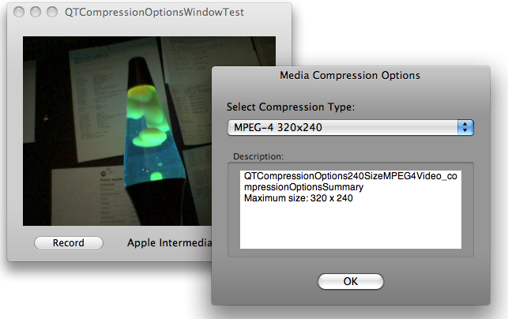
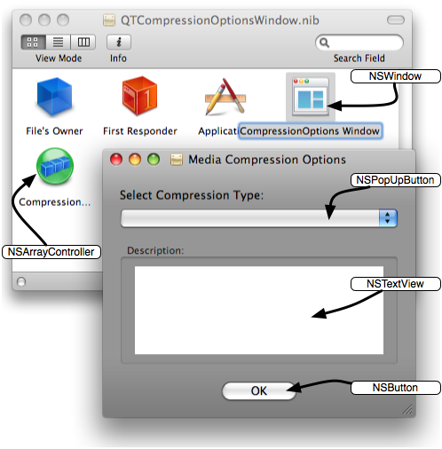
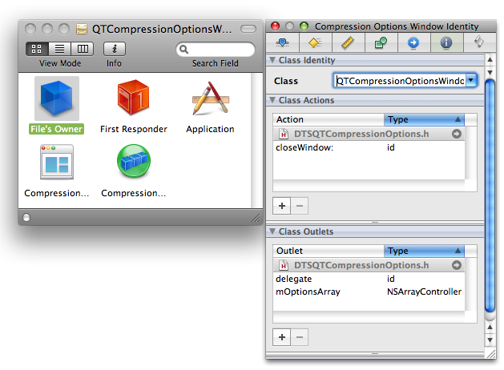
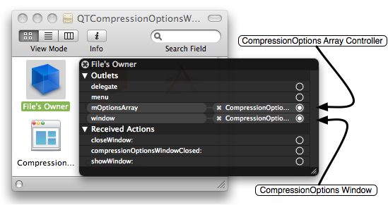
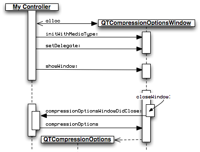
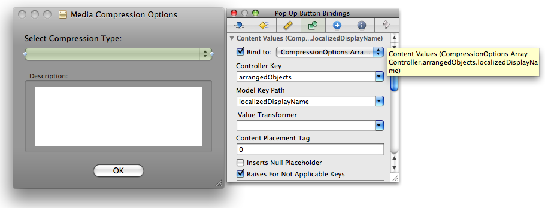
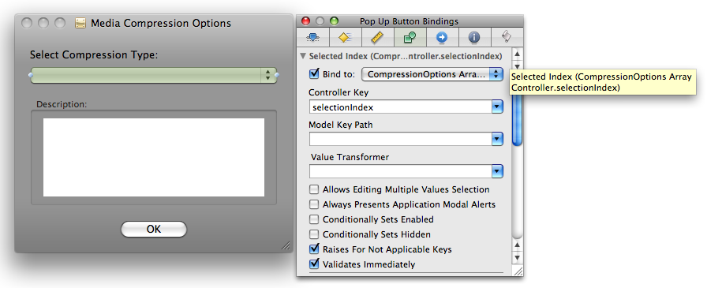
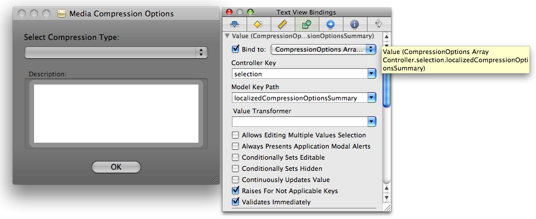
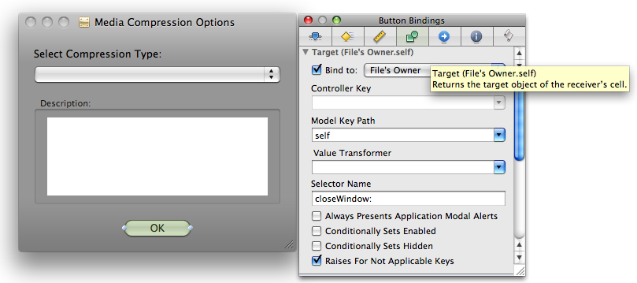

> 导航：[总目录](../../README.md) · [technotes](../../_indexes/technotes.md)


Technical Note TN2219

# Managing QTCompressionOptions - An overview of the QTCompressionOptionsWindow sample

This Technote describes some of the techniques used in building the QTCompressionOptionsWindow code sample. Notably, the sample demonstrates a singular technique for managing user-configurable compression settings when using the capture methods and classes available in the QuickTime Kit framework (QTKit.framework).

Download the [QTCompressionOptionsWindow](https://developer.apple.com/samplecode/QTCompressionOptionsWindow/index.html) code sample to follow along.

[Introduction](#apple-f4xwc4dqnrsv64tfmyxwi33df52wszbpirkfgmjqgaydinrsgqwugsbrfvjukq2ujfhu4mi)[The QTCompressionOptions Class](#apple-f4xwc4dqnrsv64tfmyxwi33df52wszbpirkfgmjqgaydinrsgqwugsbrfvjukq2ujfhu4mq)[The QTCompressionOptionsWindow Class Interface](#apple-f4xwc4dqnrsv64tfmyxwi33df52wszbpirkfgmjqgaydinrsgqwugsbrfvjukq2ujfhu4my)[The QTCompressionOptionsWindow user interface](#apple-f4xwc4dqnrsv64tfmyxwi33df52wszbpirkfgmjqgaydinrsgqwugsbrfvjukq2ujfhu4na)[File's Owner](#apple-f4xwc4dqnrsv64tfmyxwi33df52wszbpirkfgmjqgaydinrsgqwugsbrfvjvkqstivbviskpjy2a)[The QTCompressionOptionsWindow Class Implementation](#apple-f4xwc4dqnrsv64tfmyxwi33df52wszbpirkfgmjqgaydinrsgqwugsbrfvjukq2ujfhu4nq)[Using Cocoa Bindings](#apple-f4xwc4dqnrsv64tfmyxwi33df52wszbpirkfgmjqgaydinrsgqwugsbrfvjukq2ujfhu4ny)[NSPopUpButton](#apple-f4xwc4dqnrsv64tfmyxwi33df52wszbpirkfgmjqgaydinrsgqwugsbrfvjvkqstivbviskpjy3q)[NSTextView](#apple-f4xwc4dqnrsv64tfmyxwi33df52wszbpirkfgmjqgaydinrsgqwugsbrfvjvkqstivbviskpjyyta)[NSButton](#apple-f4xwc4dqnrsv64tfmyxwi33df52wszbpirkfgmjqgaydinrsgqwugsbrfvjvkqstivbviskpjyyte)[Using QTCompressionOptionsWindow In Your Application](#apple-f4xwc4dqnrsv64tfmyxwi33df52wszbpirkfgmjqgaydinrsgqwugsbrfvjukq2ujfhu4mjv)[Conclusion](#apple-f4xwc4dqnrsv64tfmyxwi33df52wszbpirkfgmjqgaydinrsgqwugsbrfvjukq2ujfhu4mjw)[References](#apple-f4xwc4dqnrsv64tfmyxwi33df52wszbpirkfgmjqgaydinrsgqwugsbrfvjukq2ujfhu4mjx)[Document Revision History](#apple-f4xwc4dqnrsv64tfmyxwi33df52wszbpirkfgmjqgaydinrsgqwvezlwnfzws33ojbuxg5dpoj4s2rdpnz2ey2lonncwyzlnmvxhiskel4yq)

## Introduction

If you're a QuickTime or Cocoa developer working with audio and video capture, you'll want to take advantage of the new capture classes and methods introduced in Mac OS X v10.5 and the latest release QuickTime. There are now 15 new capture classes available in the QTKit framework that are designed to expand the range of media services developers can incorporate in their multimedia applications.

These new capture classes and methods provide your application with pro-grade, frame-accurate capture of audio and video media from one or more external sources. Your captured media can be record to a QuickTime movie (.mov) file or displayed in a Cocoa view and may also be compressed using a common set of compression formats. You can also directly access decompressed capture buffers for custom processing.

This Technote describes the compression features of QTKit Capture using the QTCompressionOptionsWindow code sample that demonstrates how to capture video media to a movie file using the methods available in the QTKit capture classes while also allowing the user to select how that video will be compressed.

After a quick read of the [QTKit Capture Programming Guide](https://developer.apple.com/documentation/QuickTime/Conceptual/QTKitCaptureProgrammingGuide/Introduction/chapter_1_section_1.html) the task may seem very easy to do, requiring usage of only a few capture classes; `QTCaptureDevice`, `QTCaptureDeviceInput`, `QTCaptureSession`, `QTCaptureView` and `QTCaptureMovieFileOutput`. Instances of these objects all fit together like a set of lego pieces creating a "Capture Graph" that performs the operation.

That being said, what if you not only want to specify the compression method for the media being captured but also want to manage a list of compression settings via a user interface. How can those tasks be accomplished?

The QTCompressionOptionsWindow code sample demonstrates a technique you can use to manage compression settings. This is achieved by using a self-contained re-usable class that provides a user interface for selecting different compression settings via a Media Compression Options Window, as shown in Figure 1.

You can accomplish this with less than 30 lines of Objective-C code by taking advantage of Cocoa bindings. Download the [QTCompressionOptionsWindow](https://developer.apple.com/samplecode/QTCompressionOptionsWindow/index.html) sample and follow along.

The sample contains three files that are discussed in this Technote:

- Class Header File - `QTCompressionOptionsWindow.h`
- Class Implementation File - `QTCompressionOptionsWindow.m`
- Class NIB File - `QTCompressionOptionsWindow.nib`

__Figure 1__  Media Compression Options Window.

[Back to Top](#)

## The QTCompressionOptions Class

Compression settings are represented in the QTKit Capture Framework by the `QTCompressionOptions` class. `QTCompressionOptions` objects represent a set of compression settings for a specific type of media; `QTMediaTypeVideo` or `QTMediaTypeSound`. Each instance of `QTCompressionOptions` is used to describe a single compression setting and are created using a set of presets keyed by a named compression identifier.

__Note:__ For more information about the `QTCompressionOptions` class see [Technical Q&A QA1586, 'QTKit Capture - Specifying Media Compression Settings'](https://developer.apple.com/qa/qa2008/qa1586.html) and the [QTCompressionOptions Class Reference](https://developer.apple.com/documentation/QuickTime/Reference/QTCompressionOptions_Ref/Introduction/Introduction.html).

To create a `QTCompressionOptions` object describing H.264 compression with a maximum size of 320x240, you use the `NSString` identifier `QTCompressionOptions`240SizeH264Video with the class method `compressionOptionsWithIdentifier:` (Listing 1).

__Listing 1__  Create compression settings describing H.264 320x240.

```
QTCompressionOptions *myCompressionOptions;  myCompressionOptions = [QTCompressionOptions compressionOptionsWithIdentifier:                                    QTCompressionOptions240SizeH264Video];  [mCaptureMovieFileOutput setCompressionOptions:myCompressionOptions                                      forConnection:mVideoConnection];
```

While this is very easy to do, the compression settings are hardcoded and therefore the practical uses limited. To present a user interface, you need to dynamically build a list of all the compression options currently available for a given media type and display them appropriately.

The `QTCompressionOptions` class method `compressionOptionsIdentifiersForMediaType:` is ideal since it returns an array of compression identifiers which can be used to create `QTCompressionOptions` instances. Only identifiers which are valid on the current system will be returned, for example if the Apple Intermediate Codec is not available on the current system the `QTCompressionOptionsLosslessAppleIntermediateVideo` identifier will not be returned in the array.

[Back to Top](#)

## The QTCompressionOptionsWindow Class Interface

Now that you have an idea of how QTKit Capture manages compression settings and how to create these settings objects dynamically, you can define a simple class that manages both an arbitrary number of `QTCompressionOptions` instances and a Window.

```objc
@interface QTCompressionOptionsWindow : NSWindowController { @private     IBOutlet NSArrayController  *mOptionsArray;     NSString                    *mMediaType;      IBOutlet id                  delegate; }  // designated initializer - (id)initWithMediaType:(NSString *)inMediaType;  // compression options of this media type are being managed by the controller - (NSString *)mediaType;  // manage compression options for the media type passed in, should only be // QTMediaTypeVideo or QTMediaTypeSound, nil is equivalent to QTMediaTypeVideo - (OSStatus)setMediaType:(NSString *)inMediaType;  // returns the selected QTCompressionOptions instance // that may be used with -setCompressionOptions:forConnection: - (QTCompressionOptions *)compressionOptions;  // closes the window and notifies the client of the class via delegation - (IBAction)closeWindow:(id)sender;  // manages controller delegate - (id)delegate; - (void)setDelegate:(id)value;  @end  // a client of this class should implement this delegate method // which is called when the compression options window is closed // the client may ask the sender for the selected QTCompressionOptions instance @interface NSObject (QTCompressionOptionsWindowDelegate)  - (void)compressionOptionsWindowDidClose:(id)sender;  @end
```

Since `NSWindowController` can manage a window stored in a nib file and will take care of loading and displaying the window, closing it when appropriate handling Window placement and so on, the `QTCompressionOptionsWindow` class will be a subclass of `NSWindowController` and gain all this functionality for free.

An `NSArrayController` referenced by `mOptionsArray` will be used to manage a collection of `QTCompressionOptions` objects. `NSArrayController` is a bindings compatible class that manages a collection of objects. By taking advantage of bindings you are able to mediate between the model (that is, the array of `QTCompressionOptions` objects) and the user interface without having to write any code.

Since the class manages an array of `QTCompressionOptions` objects specific to a media type (either `QTMediaTypeVideo` or `QTMediaTypeSound`), the class keeps track of this media type string in `mMediaType`.

Finally, an `id` is required for the delegate object. A delegate is an object that acts on behalf of, or in coordination with, another object when that object encounters an event. In our case, when the Media Compression Options Window is closed, a `compressionOptionsWindowDidClose:` message is sent to the object registered as the delegate. This message allows the delegate to ask for and use the selected compression setting in an application-specific manner.

[Back to Top](#)

## The QTCompressionOptionsWindow user interface

Now that the Objective-C class is defined, you use Interface Builder to build the user interface as shown in Figure 2.

__Figure 2__  Media Compression Options User Interface.



All the interface elements in Figure 2 are common and should easily be recognized. The key elements are; An `NSPopUpButton`, used to list the localized display names for each compression selection, and a `NSTextView` used to display the localized compression options summary text for the currently selected compression option. An `NSButton` is used to dismiss the Window preserving the selected compression option.

The `NSArrayController` in the nib is called "CompressionOptions Array Controller" and is the object that will manage the collection of `QTCompressionOptions` instances for us and mediate between this collection and our user interface elements. When the nib file is loaded, it will automatically be connected to the `mOptionsArray` outlet.

### File's Owner

Note the class of the File's Owner object in Figure 3. It has been set to reflect that it will represent an instance of the `QTCompressionOptionsWindow` class.

The File’s Owner acts as a placeholder for the object that will manage the contents of the nib file after it is loaded. Our nib file contains two objects that must be referred to by instances of `QTCompressionOptionsWindow`; the `NSWindow` named "CompressionOptions Window" and the `NSArrayController` named "CompressionOptions Array Controller".

The File's Owner object provides a way to make connections to objects in the nib file like the `NSArrayController` and the `QTCompressionOptionsWindow` class. When the nib file is loaded, File's Owner will be set to be the instance of `QTCompressionOptionsWindow`.

Figure 3 shows that the Class field has been changed to "QTCompressionOptionsWindow" as the File's Owner Class Identity.

__Figure 3__  File's Owner Class Identity.



Once File's Owner is configured, connections may be made between outlets (`IBOutlet`) in the class and objects in the nib file. Figure 4 shows the connections for the `NSArrayController` which is connected to `mArrayController` as mentioned previously and the `NSWindow` which is connected to `window`.

When the nib file is loaded, objects in the nib file are created, initialized and connected properly.

__Figure 4__  File's Owner Connections.

[Back to Top](#)

## The QTCompressionOptionsWindow Class Implementation

If you take a quick tour of the methods used to work with `QTCompressionOptionsWindow` instances (the code in `QTCompressionOptions.m`), you'll see how this is implemented.

The `initWithMediaType:` method is used to initialize the `QTCompressionOptionsWindow` object. This method accepts either the `QTMediaTypeVideo` or `QTMediaTypeSound` media type identifier depending on the list of compression settings you want the Media Compression Options Window to present to a user.

__Listing 2__  `initWithMediaType:` method.

```
// designated initializer // call with QTMediaTypeVideo or QTMediaTypeSound to initalize - (id)initWithMediaType:(NSString *)inMediaType {     // call NSWindowController designated initializer     if (self = [super initWithWindow:nil]) {         // inappropriate media types will bail on init         if ([self setMediaType:inMediaType]) {             [self release];             return nil;         }     }      return self; }
```

The `setMediaType:` method is invoked during object initialization (and may also be used after initialization to change media types). This method does most of the work in this class. It accepts a media type identifier, performs some basic checks to make sure the media type is valid and the nib file is loaded then asks the `QTCompressionOptions` class for all the available compression type identifiers for the specified media type. By iterating though the returned array of compression option identifiers the method creates instances of `QTCompressionOptions` for each identifier and simply populates the `NSArrayController`.

__Listing 3__  `setMediaType:` method.

```
// set the media type of the compression options you want managed - (OSStatus)setMediaType:(NSString *)inMediaType {     // accept nil as a request for the default - the more common vide options     if (nil == inMediaType) inMediaType = QTMediaTypeVideo;       // only accept Video or Audio since they are the only valid compression option media types at this time     if ((NO == [inMediaType isEqualToString:QTMediaTypeVideo])           && (NO == [inMediaType isEqualToString:QTMediaTypeSound])) return invalidMedia;      // only do the set up if the media type has changed     if ([mMediaType isEqualToString:inMediaType]) return noErr;      [mMediaType release];     mMediaType = [inMediaType retain];      // make sure the nib is actually loaded at this time,     // required for our connections to the array controller and so on     if (![self isWindowLoaded]) { [self window]; }      // make sure the array controller is empty     [mOptionsArray removeObjects:[mOptionsArray arrangedObjects]];      // load it up with the currently chosen compression options objects     NSArray *optionsIdentifiers = [QTCompressionOptions                                    compressionOptionsIdentifiersForMediaType:inMediaType];     NSEnumerator *enumerator = [optionsIdentifiers objectEnumerator];      UInt8 index;     UInt8 count = [optionsIdentifiers count];     for (index = 0; index < count; index++) {         QTCompressionOptions *options = [QTCompressionOptions                                          compressionOptionsWithIdentifier:[enumerator nextObject]];         [mOptionsArray addObject:options];     }      [mOptionsArray setSelectionIndex:0];      return noErr; }
```

The `setDelegate:` method is used to register a controller class as delegate. The delegate will get called when the Media Compression Options Window is closed.

__Listing 4__  setDelegate method.

```objc
- (void)setDelegate:(id)inDelegate {     delegate = inDelegate; }
```

`showWindow:` is a method inherited from `NSWindowController` a client of this class will call to display the Media Compression Options Window. This allows a user to select a compression setting from a pop-up list. No code needed here.

The `closeWindow:` action is automatically sent to the `QTCompressionOptionsWindow` instance via the binding mechanism (see below) when the 'OK' button is clicked. The Media Compression Options Window is then closed preserving the users selected compression setting.

__Listing 5__  closeWindow action.

```objc
- (IBAction)closeWindow:(id)sender {     [self close]; }
```

After the window is closed a `compressionOptionsWindowDidClose:` message is sent to the object registered as the delegate. Listing 6.

__Listing 6__  Sending `compressionOptionsWindowDidClose:` to the delegate.

```
// inform the client of this class that the window has been closed // the client will then be able to ask for the currently selected // compression options object - (void)close {     [super close];      if (nil != delegate && [delegate respondsToSelector:@selector(compressionOptionsWindowDidClose:)] ) {          [delegate compressionOptionsWindowDidClose:self];     } }
```

The delegate may then retrieve the currently selected compression settings by sending a `compressionOptions:` message to the sender.

Figure 5 is a visual representation of a typical calling sequence when using the `QTCompressionOptionsWindow` class.

__Figure 5__

[Back to Top](#)

## Using Cocoa Bindings

Bindings are a way to connect user interface elements to their underlying data without writing a lot of (or any) glue code to synchronize the two.

To implement the user interface, a connection called a binding is created between the `NSArrayController` (which is managing the collection of `QTCompressionOptions` objects) and the user interface elements (`NSPopUpButton` and `NSTextView`) where we want the information returned by each `QTCompressionOptions` instance displayed.

`QTCompressionOptions` has two methods that return the strings used to populate both the pop-up and the text view.

__Listing 7__  `QTCompressionOptions` display methods.

```objc
- (NSString *)localizedDisplayName; - (NSString *)localizedCompressionOptionsSummary;
```

The content of the pop-up is provided by sending the `localizedDisplayName` message to each `QTCompressionOptions` instance in the array managed by the `NSArrayController`. When an item is selected, the `localizedCompressionOptionsSummary` message is sent to the selected `QTCompressionOptions` instance and the returned `NSString` is displayed in the text view. This mediation between the user interface and the contents of the array is performed automatically for us by the `NSArrayController`.

__Note:__ If you have noticed the compression options summary description displayed in the text view doesn't look very helpful, you're right. In current versions of QTKit (QuickTime 7.4.x), the `QTCompressionOptions` class isn't returning much from `localizedCompressionOptionsSummary`. A future version will describe the chosen compression setting in more detail.

Here's how this is set up in Interface Builder:

### NSPopUpButton

#### Content Values

In the Value Selection section of the Bindings Inspector for `NSPopUpButton`, bind Content Values to the `NSArrayController`. This is done by checking the "Bind to:" checkbox and selecting "CompressionOptions Array Controller" from the list.

Content Values are arrays of strings that are displayed as the items in the `NSPopUpButton`.

The Controller Key is set to `arrangedObjects` which returns the array from the controller and the Model Key Path is `localizedDisplayName`.

Establishing this binding in Interface Builder is equivalent to programatically sending the `localizedDisplayName` message each of the managed `QTCompressionOptions` instances and will populate the pop-up with the returned string values.

__Figure 6__  Content Values binding.



#### Selected Index

In the Value Selection section of the Bindings Inspector for `NSPopUpButton`, bind Selected Index to the `NSArrayController`. This is done by checking the "Bind to:" checkbox and selecting "CompressionOptions Array Controller" from the list.

Selected Index is an integer value that specifies the index of the selected item in the `NSPopUpButton`. When the selection changes in the `NSPopUpButton`, this value is updated with the index of the newly selected item.

The Controller Key is set to `selectionIndex` which returns the index value of the first object in the selection.

__Figure 7__  Selected Index binding.



### NSTextView

#### Value

In the Value Selection section of the Bindings Inspector for `NSTextView`, bind Value to the `NSArrayController`. This is done by checking the "Bind to:" checkbox and selecting "CompressionOptions Array Controller" from the list.

Value is the `NSString` that is displayed as the content of the `NSTextView`.

The Controller Key is set to `selection` which returns the currently selected object and the Model Key Path is `localizedCompressionOptionsSummary`.

Establishing this binding in Interface Builder is equivalent to programatically sending the `localizedCompressionOptionsSummary` message to the currently selected `QTCompressionOptions` instance and displaying the returned string in the text view. We know what the index is for the currently selected item because of the above Selected Index binding.

__Figure 8__  Value binding.



### NSButton

#### Target

In the Target section of the Bindings Inspector for `NSButton`, bind Target to File's Owner (remember File's Owner represents `QTCompressionOptionsWindow`). This is done by checking the "Bind to:" checkbox and selecting "File's Owner" from the list.

Target is the object that receives a message corresponding to the selector name when the `NSButton` is clicked.

The Model Key Path is `self` and the Selector Name is `closeWindow:`.

Establishing this binding in Interface Builder is equivalent to programatically sending the `closeWindow:` message to an instance of `QTCompressionOptionsWindow` when the 'OK' button is clicked.

__Figure 9__  Target binding.

[Back to Top](#)

## Using QTCompressionOptionsWindow In Your Application

Using the QTCompressionOptionsWindow takes very little code. Here's an example of some typical code that may be used to create and use an instance of `QTCompressionOptionsWindow`.

Declare a reference to a `QTCompressionOptionsWindow` instance in your controller class.

__Listing 8__  MyController.h.

```objc
#import <QTCompressionOptionsWindow.h>  @interface MyController : NSObject {     ...      // the Compression Options Window     QTCompressionOptionsWindow *mCompressionOptionsWindow; }     ...
```

Allocate an instance of the `QTCompressionOptionsWindow` and initialize it with a media type, in this case `QTMediaTypeVideo`. Then set the delegate (most likely your custom controller, i.e. `self`).

__Listing 9__  MyController.m awakeFromNib.

```objc
- (void)awakeFromNib {     // code to initialize capture objects      ...      // ******** Compression Options Window *****      // create our window with the media type and set ourselves as the delagate     // you could also instantiate the window directly in the nib and hook up the deleate     // then simply call showWindow or setMediaType if you want to change the list of compression options shown     mCompressionOptionsWindow = [[QTCompressionOptionsWindow alloc] initWithMediaType:QTMediaTypeVideo];     if (nil == mCompressionOptionsWindow) {         NSLog(@"Compression Options Window did not load!\n");         return;     }     [mCompressionOptionsWindow setDelegate:self];      ... }
```

Display the window at some future time as required.

__Listing 10__  MyController.m showCompressionOptionsWindow:.

```objc
- (IBAction)showCompressionOptionsWindow:(id)sender  {     [mCompressionOptionsWindow showWindow:sender]; }
```

Implement a delegate method called `compressionOptionsWindowDidClose:` which is called when the Media Compression Options Window is closed.

This delegate method can retrieve the compression settings selected from the pop-up list by sending the message `compressionOptions` to the `sender`(the `QTCompressionOptionsWindow` instance) which will return the `QTCompressionOptions` instance selected in the pop-up. This returned `QTCompressionOptions` instance is then used to set the desired compression settings for the media being saved to the file.

Send the `QTCaptureFileOutput` instance a `setCompressionOptions:forConnection:` message and pass it the returned `QTCompressionOptions` instance for the appropriate connection, thereby setting the user chosen compression settings for that media stream.

__Listing 11__  MyController.m delegate method.

```
// when the options window is closed this delegate method gets called // ask for the chosen QTCompressionOptions object and configure the file output // object accordingly - (void)compressionOptionsWindowDidClose:(id)sender {     // get the selected compression setting     QTCompressionOptions *myCompressionOptions = [sender compressionOptions];      if (nil != myCompressionOptions) {         [mCaptureSession stopRunning];          // configure the file output to compress this connection using the chosen         // compression settings         [mCaptureMovieFileOutput setCompressionOptions:myCompressionOptions         forConnection:[[mCaptureMovieFileOutput connections] lastObject]];          [mCaptureSession startRunning];          // update the UI so it displays the chosen compression type         self.displayName = [myCompressionOptions localizedDisplayName];          NSLog(@"%@\n", [myCompressionOptions localizedDisplayName]);     } else {         NSLog(@"Bad Compression Options Object Returned!\n");     } }
```

[Back to Top](#)

## Conclusion

By taking advantage of Cocoa bindings and standard user interface elements, you saw how to create a user interface to use with the QTKit Capture framework with less than 30 lines of Objective-C code. This of course just scratches the surface of what can be done with QTKit and Cocoa.

Experiment with the code, expand on it, make it unique to your application and most of all, have fun.

[Back to Top](#)

## References

- [QTCompressionOptionsWindow Sample Code](https://developer.apple.com/samplecode/QTCompressionOptionsWindow/index.html)
- [QTKit Capture Programming Guide](https://developer.apple.com/documentation/QuickTime/Conceptual/QTKitCaptureProgrammingGuide/Introduction/chapter_1_section_1.html)
- [Interface Builder User Guide](https://developer.apple.com/documentation/DeveloperTools/Conceptual/IB_UserGuide/Introduction/chapter_1_section_1.html)
- [Cocoa Fundamentals Guide](https://developer.apple.com/documentation/Cocoa/Conceptual/CocoaFundamentals/Introduction/chapter_1_section_1.html)
- [lIntroduction to Cocoa Bindings Programming Topics](https://developer.apple.com/documentation/Cocoa/Conceptual/CocoaBindings/CocoaBindings.html)

[Back to Top](#)

---

#### Document Revision History

| __Date__ | __Notes__ |
| 2008-03-11 | Editorial |
| 2008-03-04 | New document that introductory overview of the QTCompressionOptionsWindow sample demonstrating one way to manage QTCompressionOptions objects. |

