> 导航：[总目录](../../README.md) · [technotes](../../_indexes/technotes.md)

Technical Note TN2434

# Minimizing your app's Memory Footprint

For the benefit of both stability and performance, it's important to understand and heed the differing amounts of memory that are available to your app across the various devices your app supports. Minimizing the memory usage of your app is the best way to ensure it runs at full speed and avoids crashing due to memory depletion in customer instantiations. Furthermore, using the Allocations Instrument to assess large memory allocations within your app can sometimes be a quick exercise that can yield surprising performance gains.

[Introduction](#apple-f4xwc4dqnrsv64tfmyxwi33df52wszbpirkfgnbqgaytomrvgiwugsbrfveu4vcsj5cfkq2ujfhu4)[Terms Definition](#apple-f4xwc4dqnrsv64tfmyxwi33df52wszbpirkfgnbqgaytomrvgiwugsbrfveu4vcsj5cfkq2ujfhu4lkuivje2u27ircumskojfkest2o)[Profiling the app for memory usage](#apple-f4xwc4dqnrsv64tfmyxwi33df52wszbpirkfgnbqgaytomrvgiwugsbrfvifet2gjfgek)[Analyzing the results](#apple-f4xwc4dqnrsv64tfmyxwi33df52wszbpirkfgnbqgaytomrvgiwugsbrfvjekvsjivlq)[Conclusion](#apple-f4xwc4dqnrsv64tfmyxwi33df52wszbpirkfgnbqgaytomrvgiwugsbrfvbu6tsdjrkvgskpjy)[Related Material](#apple-f4xwc4dqnrsv64tfmyxwi33df52wszbpirkfgnbqgaytomrvgiwugsbrfvjektcbkrcuix2nifkekusjifga)[Document Revision History](#apple-f4xwc4dqnrsv64tfmyxwi33df52wszbpirkfgnbqgaytomrvgiwvezlwnfzws33ojbuxg5dpoj4s2rdpnz2ey2lonncwyzlnmvxhiskel4yq)

## Introduction

This guide provides a walkthrough of the steps to profile your app's memory usage in Xcode. Organizing your app's more significant memory use at a granular level can sometimes yield surprising results. Taking further steps to reduce big allocations is one of the easiest ways to increase performance, and safeguard your app from termination in low memory conditions.

__Important:__ As an arbitrary example, this guide profiles a real game in development called __Ascii Man__. Being a 2D tile-based game implemented in OpenGL ES, the larger allocations we look at are those required to render a game of this type.

### Terms Definition

- __Memory Footprint__ refers to the total current amount of system memory that is allocated to your app.
[Back to Top](#)

## Profiling the app for memory usage

1. Xcode > __Product__ menu > Profile
2. Choose __Allocations__.

   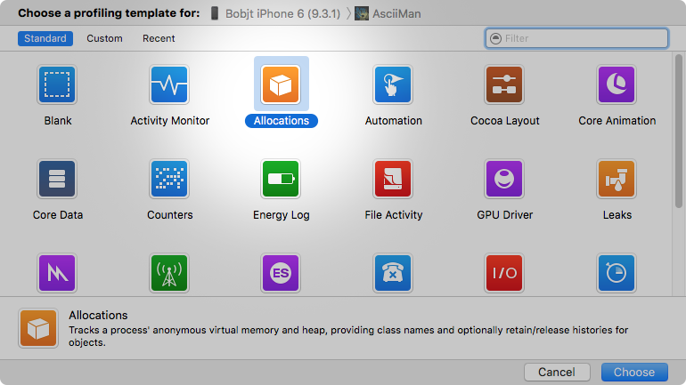
3. Click the record button.

   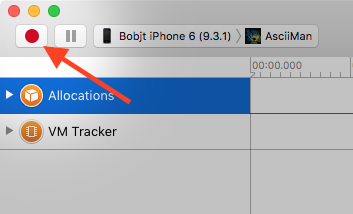
4. Navigate to the area of the app that you're interested in assessing memory usage, such as the main level of a game, or the primary editing operations of an image editing app.
5. Use the app for a few minutes to allow Instruments to retrieve a representative sample of data.
6. Press the Stop button to stop profiling.
7. Select a range spanning the time within the run you want to analyze. Doing this filters the results shown on the __Allocations Summary__ below.

   __Figure 1__ – Hold the Command key and click from areas marked 1 to 2 in order to select the range of interest.

   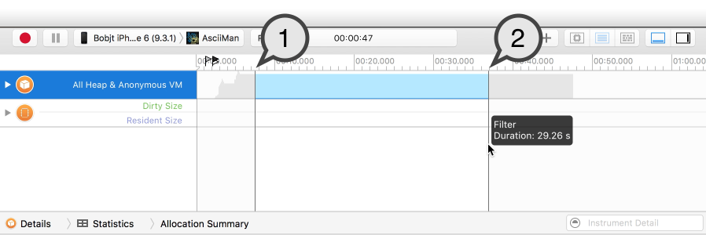

   __Figure 2__ – Include in the range ramps that represent allocation. The range shown here includes allocations for a game's intro screen and loading the first level. These two events were chosen because they allocate a majority of the total memory used by the app, and therefore, they are also the best candidates to speed up.

   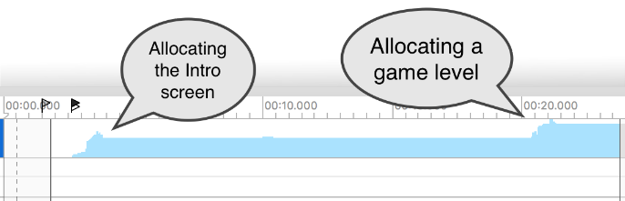

   __Note:__ Allocations made by your app take time to fulfill and they take time to release. Using this process to reduce the number (or size) of allocations in your app not only eliminates the time required to perform those allocations, but earns performance for the OS as it has more memory to work with as a result.
8. Now it's time to analyze the results.

   __Note:__ This guide profiles a real app in development and its memory usage highlighted is unique to that app. Therefore, the following issues we identify serve as an example of the types of things you'll find. The memory usage circumstances will be different for your app but the approach to assess memory usage remains the same.

   __Figure 3 –__ The results are shown on the Allocations Summary pane.

   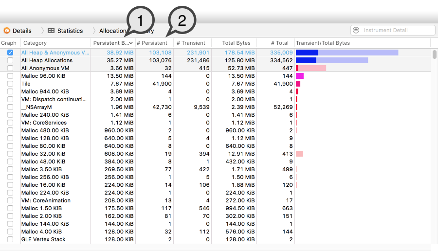

   __Figure 3 Legend:__

   1. __Persistent Bytes__ is the primary focus of this tutorial. It is the total number of bytes your app currently holds in memory. For the purposes of this guide, Persistent Bytes for `All Heap & Anonymous VM` represents your app's memory footprint.

      This is the value to minimize; the lower the __persistent bytes__, the faster your app can run and the less chances there are to face memory depletion.

      __Important:__ On iOS, tvOS and watchOS, if the device is low on available memory and your app is high on __Persistent Bytes__ it can result in your app being terminated.
   2. __# Persistent__ is the other interesting metric we look at here. It represents the total __number__ of repetitions of a particular allocation.

   __Note:__ Our exercise is performed using these two metrics of the Allocations Summary pane alone. To read more about the other columns, see:

   • __Instruments User Guide__  > Allocations Instrument > [Detail Pane Columns](https://developer.apple.com/library/ios/documentation/DeveloperTools/Conceptual/InstrumentsUserGuide/Instrument-Allocations.html).

[Back to Top](#)

## Analyzing the results

This section analyzes the results of the memory profiling done in the above section, [Profiling the app for memory usage](#apple-f4xwc4dqnrsv64tfmyxwi33df52wszbpirkfgnbqgaytomrvgiwugsbrfvifet2gjfgek).

__Important:__ By default, the Allocation Summary pane is sorted descending on column Persistent Bytes. If your results are sorted differently, follow along by sorting the results descending on column Persistent Bytes.

1. Have a look at the first allocation type:

   - __Figure 4__ – The first allocation type is titled "Malloc 96.00 KiB".

     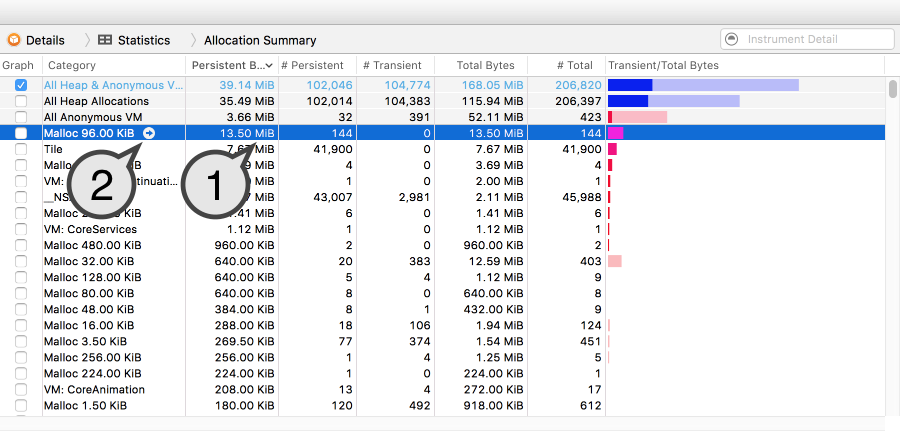

     __Figure 4 Legend –__

     1. This allocation is a __Malloc of size 96 KB__. 144 of these allocations result in 13.5 MB out of the total 39 MB of our memory footprint. That's a whopping 34%!
     2. Click the right-arrow next to this allocation in order to list all 144 repetitions.
   - __Figure 5__ – Now sort the allocation by __Responsible Caller__ to narrow down the locations where it occurs.

     __Note:__ To sort the list by Responsible Caller, click title of the Responsible Caller column.

     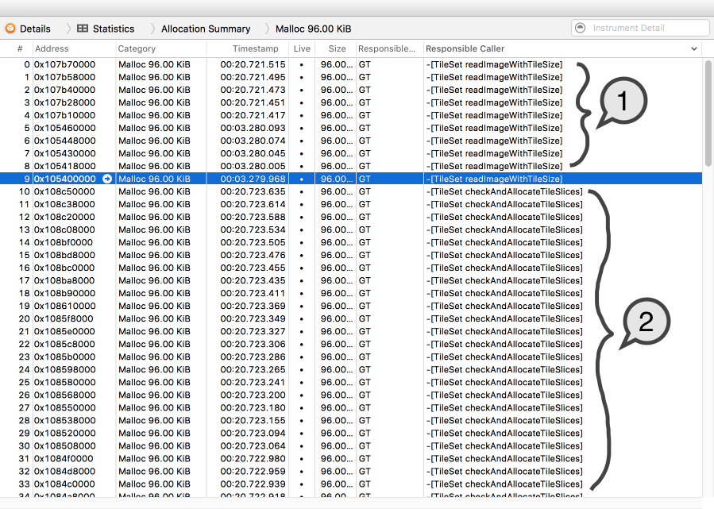

     __Figure 5 Legend –__

     1. The first 10 instances of the 144 allocations source from `TileSet readImageWithTileset:`.
     2. The rest (10 thru 144) source from `TileSet checkAndAllocateTileSlice:`.
   - __Figure 6__ – Select a row whose Responsible Caller repeats the most times. This is the method to analyze first since it composes a majority of this type of allocation.

     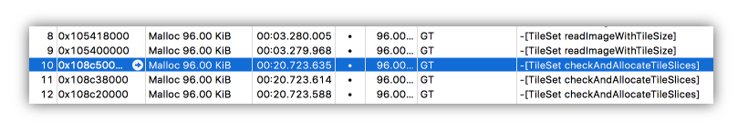
   - __Figure 7__ – Show the Extended Detail Pane to view the stack trace where the allocation occurred.

     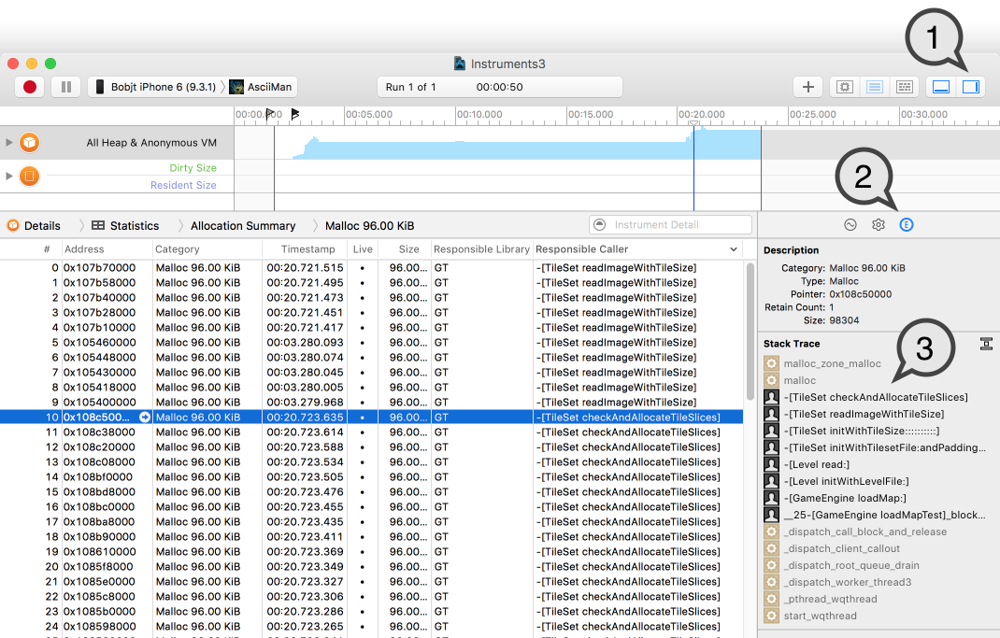

     __Figure 7 Legend –__

     1. Click to show the Right-pane.
     2. Click the "E" icon to reveal the Extended Detail pane.
     3. View the stack trace and note the call to `TileSet checkAndAllocateTileSlice:`.
   - __Figure 8__ – Double click the `TileSet checkAndAllocateTileSlice:` line in the stack trace to reveal the location within your code the allocation occurred.

     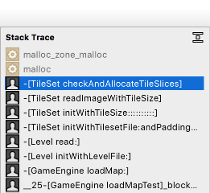

     __Note:__ You're only able to see code for sources for your app. Source code is not shown for allocations made within a framework or static library, though you can still weigh the memory cost of a library call and decide to throttle use or consider a replacement.

     __Figure 9__ – Line of code where the allocation occurs.

     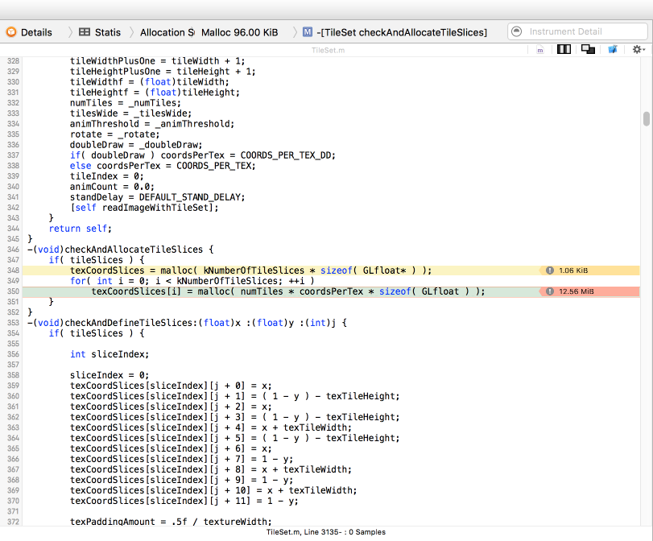

     - Line 350 is the allocation of interest. It is responsible for 12.56 MB of this type of allocation.
     - Line 348 is a different allocation, and at 1 KB, it pales in comparison and can be ignored for the time being.
   - __Consider ways to reduce this allocation__

     Because this allocation accounts for 34% of the app's total memory, it's a single line of code that offers the largest opportunity to minimize memory usage. This line of code is responsible for a feature called "tile slices," a rudimentary geometry-based form of image masking. Given this information, consider the following approaches to minimize this allocation:

     1. __Remove the allocation__

        - This geometry-based form of image masking was created with the intention of being incredibly fast at runtime, which it would be if the memory required to support it were not so large. The developer should consider switching to image-based masking, and then profile to assess the new speed-versus-space trade off.
        - All 34% of the memory footprint can be saved for levels not using image masking if a flag is used to prevent these placeholder allocations in those cases.
     2. __Reduce the number of allocations__

        For levels that do use masking, the developer might consider __reducing the number of allocations__. Having observed that the `malloc` effecting the allocation is repeated `kNumberOfTileSices` times, the number of allocations can be reduced if `kNumberOfTileSlices` can be reduced.

        `kNumberOfTileSlices` controls the number of image masking options to shape a tile; if some of the shapes are used less often, the developer could consider removing the lesser used options.
     3. __Reduce the size of the allocation__

        Alternatively, the developer can look into __reducing the size of the allocation__. Noticing that the size of the allocation is a factor a TileSet's number of tiles, `numTiles`, now is good time to consider whether extra tiles in the TileSet could be removed.
2. Next, let's have a look at the second largest allocation.

   - __Figure 10__ – The next allocation is "Tile".

     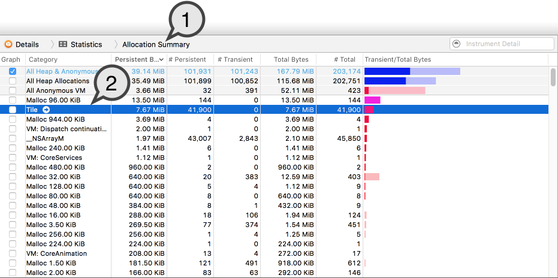

     __Figure 10 Legend –__

     1. Click the Allocation Summary breadcrumb to return to the results pane.
     2. The second largest allocation made by the app is the __Tile__ class. Though each Tile is relatively small (183 bytes), there are 41,900 instances in memory at one time and that composes a total of 7.67 MB. This allocation is 19.7% of the app's total memory footprint.
   - For this allocation type, viewing the line of code it sources from is less interesting than considering its overall size and number of repetitions. Opening up Tile.m in the Xcode editor, you can see its 183 bytes are composed of a few handfuls of primitives, most notably, arrays of size `kNumberOfLayers` which in this run was equal to 7.

     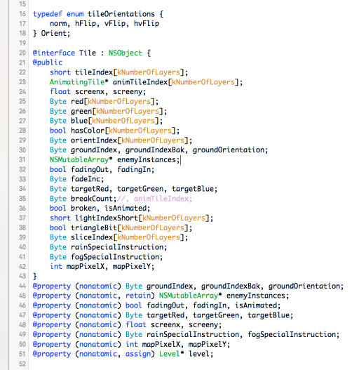
   - __Consider ways to reduce this allocation.__

     1. __Remove the allocation__

        In this case, removing the Tile allocation is not an option, as it is the most essential data structure required to render a game level.
     2. __Reduce the number of allocations__

        Reducing the number of allocations is more of a level-design choice, than one of programming. This is because the number of Tiles is directly dependent on the designer's choice of map dimensions in the game editor. Therefore, reducing the number of Tile allocations is easier to do moving forward (as a recommendation to the level designer), as retroactive reduction of tiles would likely involve modifying game levels.
     3. __Reduce the size of the allocation__

        Reducing allocation size is the most realistic option the developer can explore to reduce the memory used by __Tile__s. Here are a couple examples:

        1. The __red, green__ and __blue__ instance variables implement a feature that allows each tile to be colorized dynamically. With `kNumberOfLayers` = 7, it costs 3 (bytes) x 7 (number of layers) = 21 bytes out of the 183 bytes for each Tile to implement colorization. If the colorization feature were non-essential or sparsely used, the developer could consider removing it.

           How much memory does that earn us? Each tile allocation with colorization removed is 183 bytes - 21 bytes = 162 bytes. 162 bytes x 41,900 (number of tiles) = 6.79 MB.

           The total memory savings with colorization removed is 7.67 MB - 6.79 MB = 880 KB, __almost 1 MB__.
        2. The array of __AnimatingTile__ at line 23 has repetitions for each layer (or z-position). AnimatingTile is an object that allows a Tile's artwork to animate, and because most animations cover the entire size of a tile, a fairly reasonable consolation is to constrain each Tile to only a single AnimatingTile. This removes the array of `AnimatingTile*` down to a single pointer, and on 64-bit architecture each memory address is large (8 bytes) when every byte counts.

           How much memory does that earn us? Each tile allocation with animating tiles constrained to 1-per-tile is 183 bytes - 6 (number of layers minus one) \* 8 bytes (per 64-bit memory address) = 159 bytes. 159 bytes x 41,900 (number of tiles) = 6.66 MB.

           The total memory savings is 7.67 MB - 6.66 MB = __1.01 MB savings__.

        The two changes made above save the app almost 2 MB of memory use, which amounts to a total memory savings of __5% of the app's memory footprint__, and we were just getting started.

[Back to Top](#)

## Conclusion

In the example shown here, we consider only the first two allocations in detail; because we've sorted the allocations by size, the first two account for 50% of the app's total footprint. The next steps are to continue down to the remaining 50%. With each allocation, consider whether it can be __removed, reduced in size,__ or __reduced in repetition.__

Each app will have different allocation types sourcing from varying locations in code, along with different circumstances around their potential minimization, but the approach to assess memory use remains the same.

[Back to Top](#)

## Related Material

For other memory related tasks, see:

• __Instruments User Guide__ > [Profile Your App's Memory Usage](https://developer.apple.com/library/ios/documentation/DeveloperTools/Conceptual/InstrumentsUserGuide/CommonMemoryProblems.html#//apple_ref/doc/uid/TP40004652-CH91-SW1).

[Back to Top](#)

---

#### Document Revision History

| __Date__ | __Notes__ |
| 2016-05-23 | New document that walks through the process of minimizing an app's memory usage using the Allocations Instrument. |

