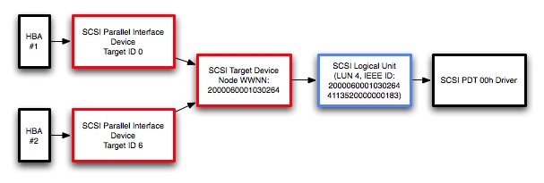

> 导航：[总目录](../../README.md) · [technotes](../../_indexes/technotes.md)


Technical Note TN2173

# Multipathing with FibreChannel on Mac OS X

Describes what is required of FibreChannel target hardware and host bus adapter drivers to take advantage of multipathing on Mac OS X

[Introduction](#apple-f4xwc4dqnrsv64tfmyxwi33df52wszbpirkfgmjqgaydimrrhewugsbrfvjukq2ujfhu4mi)[Multipathing Implementation used by Mac OS X](#apple-f4xwc4dqnrsv64tfmyxwi33df52wszbpirkfgmjqgaydimrrhewugsbrfvjukq2ujfhu4mq)[Supporting Multipathing in your HBA Driver](#apple-f4xwc4dqnrsv64tfmyxwi33df52wszbpirkfgmjqgaydimrrhewugsbrfvjukq2ujfhu4my)[Supporting Multipathing in your SCSI Target Device](#apple-f4xwc4dqnrsv64tfmyxwi33df52wszbpirkfgmjqgaydimrrhewugsbrfvjukq2ujfhu4na)[Related Information](#apple-f4xwc4dqnrsv64tfmyxwi33df52wszbpirkfgmjqgaydimrrhewugsbrfvjukq2ujfhu4ni)[Document Revision History](#apple-f4xwc4dqnrsv64tfmyxwi33df52wszbpirkfgmjqgaydimrrhewvezlwnfzws33ojbuxg5dpoj4s2rdpnz2ey2lonncwyzlnmvxhiskel4yq)

## Introduction

The purpose of multipathing is to allow a single device to be connected to a host computer by more than one path, providing both redundancy and load balancing for increased performance. This technote explains what is required to make your host bus adapter (HBA) drivers and FibreChannel target devices compatible with the multipathing support in Mac OS X.

Support for multipathing began shipping with Mac OS X 10.3.5. It's important to be aware that Apple’s multipathing implementation differs significantly from that of other storage vendors. Many vendors implement multipathing support at the logical unit level whereas Mac OS X implements multipathing at the target device level. As a result, multipathing currently does not get enabled on Mac OS X for many 3rd party storage solutions

[Back to Top](#)

## Multipathing Implementation used by Mac OS X

Mac OS X provides multipathing support on a per-target basis. Multipathing at the LUN level is not currently supported. The support for multipathing is provided by the IOSCSIArchitectureModelFamily KEXT and will be automatically enabled for devices that implement the required characteristics in firmware.

__Figure 1__  Architecture of the multipathing support in Mac OS X.



IOSCSIArchitectureModelFamily requires that all targets using multipath support show the same LUN configuration. RAID controllers and other hardware that broadcast the same world-wide node name (WWNN) for multiple target interfaces but do not publish their LUNs symmetrically are not compatible with this multipathing approach and will exhibit undesirable characteristics and behavior.

Load balancing across available paths to a device is done using a pressure-based algorithm. This algorithm attempts to keep the amount of outstanding I/O equal across all connections to a device by assigning new I/O requests to the port with the least amount of outstanding I/O.

Although its primary function is to provide multipathing support across FibreChannel, this same technology is implemented as part of the Mac OS X SCSI support and could potentially be used across other implementations of SCSI as well. To support a different interface, you will need to either extract or synthesize a WWNN for each target you are connecting to. On FibreChannel, the WWNN is part of the information available for every node attached to the fabric.

__Important:__ Currently, multipathing support requires the "Physical Interconnect" key in the Protocol Characteristics dictionary of the controller to be set to "Fibre Channel Interface". Other values will result in all data being sent across only one interface. At the time multipathing was added, FibreChannel was the only interface implemented that could support multipathing and a check against the protocol characteristics dictionary was added to prevent compatibility issues for existing drivers.

[Back to Top](#)

## Supporting Multipathing in your HBA Driver

If you are implementing a host bus adapter (HBA), have your HBA set the `kIOPropertyFibreChannelNodeWorldWideNameKey` property for each target device. This property is mandatory for FibreChannel controllers and optional for most other interfaces.

If your HBA does not need to dynamically discover targets added after boot (that is, returns false from  `DoesHBAPerformDeviceManagement` and relies on IOSCSIParallelFamily to discover any targets when the HBA becomes active), you can call `SetTargetProperty` from inside `InitializeTargetForID` to add the `kIOPropertyFibreChannelNodeWorldWideNameKey` property to the new target.

__Listing 1__  Setting the kIOPropertyFibreChannelNodeWorldWideNameKey key for non-managed targets.

```
bool com_foo_sampleAdapter::DoesHBAPerformDeviceManagement ( void ) {     // Report that we *DO NOT* manage our own devices - we rely on the OS to discover targets for us     return false; }  bool com_foo_sampleAdapter::InitializeTargetForID ( SCSITargetIdentifier targetID ) {      bool retVal = false;     OSData *targetWWNN = NULL;      // [...]     // Do any other target-specific setup here      // Set the WWNN to a hard-coded value for demonstration purposes     // In the real world, you would obtain the WWNN for each target node     // from your FibreChannel HBA     targetWWNN = OSData::withBytes("12345678", 8); // 64-bit WWNN      SetTargetProperty(targetID, kIOPropertyFibreChannelNodeWorldWideNameKey, targetWWNN);     targetWWNN->release();     retVal = true;      return retVal; }
```

Alternatively, if your HBA is handling the creation and destruction of targets itself, locate the WWNN for the target and pass it to `CreateTargetForID` as a member of the properties dictionary.

__Listing 2__  Setting the kIOPropertyFibreChannelNodeWorldWideNameKey key for managed targets.

```
bool com_foo_sampleAdapter::DoesHBAPerformDeviceManagement ( void ) {     // Report that we *DO* manage our own devices - we will query all possible targets ourselves     return true; }  bool com_foo_sampleAdapter::addNewTarget ( SCSITargetIdentifier targetID ) {      bool retVal = false;     OSDictionary *targetDictionary = NULL;     OSData *targetWWNN = NULL;      targetDictionary = OSDictionary::withCapacity(2); // Just a small dict      // [...]     // Do any other target-specific setup here      // Set the WWNN to a hard-coded value for demonstration purposes     // In the real world, you would obtain the WWNN for each target node     // from your FibreChannel HBA     targetWWNN = OSData::withBytes("12345678", 8); // 64-bit WWNN      targetDictionary-> setObject(kIOPropertyFibreChannelNodeWorldWideNameKey, targetWWNN);     targetWWNN->release();      CreateTargetForID(targetID, targetDictionary);     targetDictionary->release();      retVal = true;      return retVal; }
```

__Important:__ Multipathing support requires each connection to the device to appear with a unique SCSI Domain Identifier. If it does not, the multipathing subsystem assumes that it is the same connection and will not transfer data over this secondary connection. This will be handled for you if you subclass from IOSCSIParallelInterfaceController. If your driver subclasses from a different source such as IOSCSIProtocolServices or IOSCSIProtocolInterface, you will likely need to ensure this yourself.

[Back to Top](#)

## Supporting Multipathing in your SCSI Target Device

If you are implementing a target device, your device must publish results for INQUIRY page 83h, Device Identification Page, in binary format and provide either a EUI-64 or FCNameIdentifier.

LUNs that are not presented symmetrically are currently not supported on Mac OS X. It is recommended that you provide a mechanism to allow a user to configure your target devices so that all LUNs are reported symmetrically.

[Back to Top](#)

## Related Information

Technical Committee T10, SCSI Storage Interfaces

[http://www.t10.org](http://www.t10.org)

Darwin Source Code, particularly the IOSCSIArchitectureModelFamily and IOSCSIParallelFamily source

[http://developer.apple.com/darwin/](https://developer.apple.com/darwin/)

[Back to Top](#)

---

#### Document Revision History

| __Date__ | __Notes__ |
| 2007-03-23 | Added important notes about the requirement to set the physical interconnect property in the protocol characteristics to Fibre Channel and about requiring unique SCSI domain identifiers for each connection. |
| 2007-02-23 | New document that an explanation on how FibreChannel multipathing works on Mac OS X and how to design storage hardware to take advantage of it |

