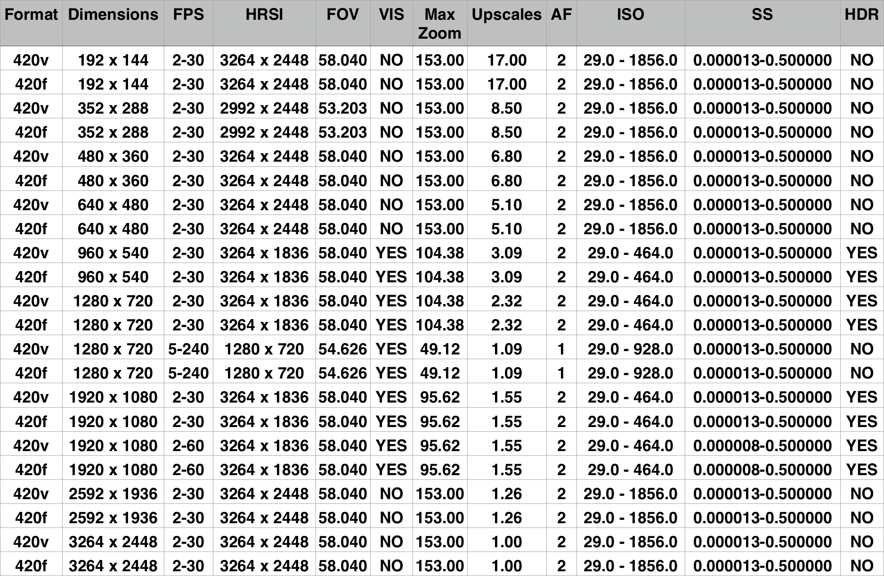
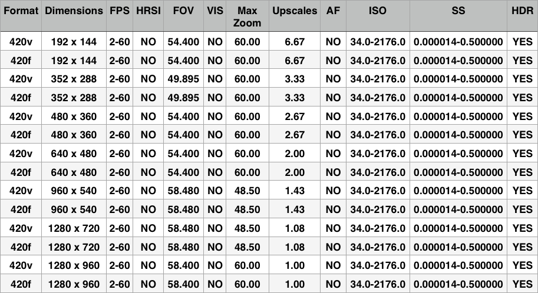

> 导航：[总目录](../../README.md) · [technotes](../../_indexes/technotes.md)

Technical Note TN2409

# New AV Foundation Camera Features for the iPhone 6 and iPhone 6 Plus

AV Foundation introduces a number of APIs in support of the new camera features available on the iPhone 6 and iPhone 6 Plus. These include focus pixels, optical image stabilization, 1080p60, slow motion video, cinematic video stabilization, single-shot (video) HDR, and high-resolution still images during video.

In addition, both iPhone 6 and iPhone 6 Plus support the manual control features (manual focus, manual exposure, exposure compensation, manual white balance, and bracketed still capture) which were discussed in [WWDC 2014 Session 508 Camera Capture: Manual Controls](https://developer.apple.com/videos/wwdc/2014/#508).

[Focus Pixels](#apple-f4xwc4dqnrsv64tfmyxwi33df52wszbpirkfgnbqgaytkmbthawugsbrfvde6q2vknpvaskyivgfg)[Optical Image Stabilization](#apple-f4xwc4dqnrsv64tfmyxwi33df52wszbpirkfgnbqgaytkmbthawugsbrfvhvavcjinauyx2jjvauork7knkecqsjjrevuqkujfhu4)[1080p60](#apple-f4xwc4dqnrsv64tfmyxwi33df52wszbpirkfgnbqgaytkmbthawugsbrfuytaobqka3da)[Slow Motion Video at 240 fps](#apple-f4xwc4dqnrsv64tfmyxwi33df52wszbpirkfgnbqgaytkmbthawugsbrfvjuyt2xl5gu6vcjj5hf6vsjircu6x2bkrptenbql5dfauy)[Cinematic Video Stabilization](#apple-f4xwc4dqnrsv64tfmyxwi33df52wszbpirkfgnbqgaytkmbthawugsbrfvbustsfjvaviskdl5lesrcfj5pvgvcbijeuysk2ifkest2o)[Single-Shot (Video) HDR](#apple-f4xwc4dqnrsv64tfmyxwi33df52wszbpirkfgnbqgaytkmbthawugsbrfvjustshjrcv6u2ij5kf6x2wjfcekt27l5eeiuq)[High Resolution Still Images during Video](#apple-f4xwc4dqnrsv64tfmyxwi33df52wszbpirkfgnbqgaytkmbthawugsbrfveesr2il5jeku2pjrkviskpjzpvgvcjjrgf6sknifduku27irkveskoi5pvmskeivhq)[Document Revision History](#apple-f4xwc4dqnrsv64tfmyxwi33df52wszbpirkfgnbqgaytkmbthawvezlwnfzws33ojbuxg5dpoj4s2rdpnz2ey2lonncwyzlnmvxhiskel4yq)

## Focus Pixels

The iPhone 6 and 6 Plus have dedicated focus pixels which provide depth information using phase detection. Continuous auto-focus changes are very fast and very subtle. There's no throbbing effect as the lens steps through a full focus scan. Phase detection focus is so good, it is recommended you allow the focus to adjust while recording videos. In low light scenes, the AF mechanism may perform a scan to gather contrast information.

Where focus pixels are supported by the hardware, they are automatically "on" when you set the `AVCaptureDevice` `focusMode` property to `AVCaptureFocusModeContinuousAutoFocus`. Therefore, when focus pixels are available, they are automatically used. There’s no opt in or opt out. The front camera on the iPhone 6 and iPhone 6 Plus has a fixed focus lens, so focus pixels refer solely to the back-facing camera. All `AVCaptureDeviceFormat` objects for the back-facing camera support focus pixels except the 720p240 format.

How can you know if a format uses focus pixels, traditional contrast detect focus, or doesn’t support any focus?

There is a new `AVCaptureDeviceFormat` read-only property `autoFocusSystem`. There are three `AVCaptureAutoFocusSystem` constants: `None`, `ContrastDetection`, and `PhaseDetection`. When phase detection is available on the active format, it is recommended you allow the camera to continuously adjust focus while recording, since it is very fast and subtle. Where the focus system is contrast detect, you should lock focus before starting a recording, or use the `AVCaptureDevice` `smoothAutofocusEnabled` property where it is supported.

Note that when traditional contrast detect auto-focus is in use, the `AVCaptureDevice` `adjustingFocus` property flips to `YES` when a focus is underway, and flips back to `NO` when it is done. When phase detect autofocus is in use, the `adjustingFocus` property does __not__ flip to `YES`, as the phase detect method tends to focus more frequently, but in small, sometimes imperceptible amounts. You can observe the `AVCaptureDevice` `lensPosition` property to see lens movements that are driven by phase detect AF.

See `AVCaptureDevice`.h — `AVCaptureAutoFocusSystem` and `autoFocusSystem`.

[Back to Top](#)

## Optical Image Stabilization

The back-facing camera on the iPhone 6 Plus (just the 6 Plus) supports optical image stabilization. By default, it activates when you use `AVCaptureStillImageOutput` to take photos using the 8 Megapixel device format or the `AVCaptureSessionPresetPhoto` preset, and you’re in low light. AV Foundation uses the same property introduced in iOS 7, `AVCaptureStillImageOutput` `automaticallyEnablesStillImageStabilizationWhenAvailable`. This property defaults to `YES` on supported platforms (iPhone 5s, iPhone 6 and iPhone 6 Plus). On the iPhone 5s and iPhone 6, digital image stabilization techniques are used to decrease blurriness in low-light images. On the iPhone 6 Plus, a combination of optical and digital image stabilization techniques are employed for even better low light performance.

See `AVCaptureOutput`.h — `automaticallyEnablesStillImageStabilizationWhenAvailable`.

[Back to Top](#)

## 1080p60

The back-facing camera on the iPhone 6 and iPhone 6 Plus has one `AVCaptureDeviceFormat` pair (420v / 420f) for 1080p30 and a second pair that supports 1080p60. It can go from a 2 fps min frame rate up to a 60 fps max frame rate. The `AVCaptureSessionPresetHigh` uses the 1080p30 format. If you want to record in 1080p60, use the technique established in iOS 7 of iterating through the `AVCaptureDevice` `formats`, finding the `AVCaptureDeviceFormat` you want, then setting the `AVCaptureDevice` `setActiveFormat` property instead of `AVCaptureSession` `setSessionPreset`. Review the WWDC 2013 Session 610 video "What's New in Camera Capture" for a refresher course on this technique. See `AVCaptureDevice`.h — `activeFormat`.

[Back to Top](#)

## Slow Motion Video at 240 fps

The back-facing camera on the iPhone 6 and iPhone 6 Plus has an `AVCaptureDeviceFormat` pair (420v / 420f) for 720p30, and a second pair that supports 720p240. Its supported frame rate range is 5 fps - 240 fps. You can use it by setting the format on the `AVCaptureDevice` `activeFormat` property (same as above with 1080p60). The 240 fps format is binned. If you wish to capture at 120 fps on the iPhone 6 or iPhone 6 Plus, find and choose the 240 fps-capable format, then set the `AVCaptureDevice` `activeVideoMinFrameDuration` and `activeVideoMaxFrameDuration` properties to `CMTimeMake( 1, 120 )`.

See `AVCaptureDevice`.h — `activeFormat`.

[Back to Top](#)

## Cinematic Video Stabilization

iOS 6 introduced API support for video stabilization on the iPhone 4s. The back-facing camera on the iPhone 6 and 6 Plus supports a more aggressive, dramatic, and fluid algorithm called “cinematic video stabilization”. This stabilization method reduces the camera’s field of view compared to standard video stabilization, introduces much more latency in the video capture pipeline compared to standard video stabilization, and consumes significantly more system memory. For these reasons, it is not on by default and must be opted in to use.

When using cinematic video stabilization, it is recommended that you use narrow or identical min and max frame durations to keep the latency consistent and manageable. iPhone 6 and 6 Plus also support the standard (lower latency, less dramatic) video stabilization algorithm used in earlier products. Previously, the `AVCaptureConnection` allowed you to opt in for video stabilization by calling the `AVCaptureConnection` `setEnablesVideoStabililzationWhenAvailable`: method. AV Foundation now supports more than one type of video stabilization, so that method has been deprecated (along with `AVCaptureConnection` `videoStabilizationEnabled`:) in favor of a new method, `AVCaptureConnection` `setPreferredVideoStabilizationMode`:.

You may set your preferred video stabilization mode to one of 4 constants: `AVCaptureVideoStabilizationModeOff`, `AVCaptureVideoStabilizationModeStandard`, `AVCaptureVideoStabilizationModeCinematic`, or `AVCaptureVideoStabilizationModeAuto`. You can query the `AVCaptureDevice` `activeFormat` property to determine what stabilization modes it supports by calling `AVCaptureDeviceFormat` `isVideoStabilizationModeSupported`:. Setting the preferred stabilization mode to a constant other than `AVCaptureVideoStabilizationModeOff` does not force video stabilization on. Some device formats and `AVCaptureOutput`'s don’t support stabilization. To determine which video stabilization mode is actually in use, you can key-value observe the `AVCaptureConnection` `activeVideoStabilizationMode` property. When you set your preferred stabilization mode to `AVCaptureVideoStabilizationModeAuto`, an appropriate stabilization mode will be chosen based on the format and frame rate in use. Currently, only the 1080p30 and 1080p60 video formats support cinematic stabilization. The default value for `preferredVideoStabilizationMode` is `AVCaptureVideoStabilizationModeOff`. As on earlier products, only the 16:9 video formats support stabilization.

See `AVCaptureDevice`.h — `isVideoStabilizationModeSupported`: and `AVCaptureSession`.h — `preferredVideoStabilizationMode` and `activeVideoStabilizationMode`.

[Back to Top](#)

## Single-Shot (Video) HDR

AKA “streaming HDR” or “video HDR”. The iPhone 6 and 6 Plus support continuous, streaming high-dynamic-range video as opposed to the more traditional method of fusing a bracket of still images with differing EV values into a single high dynamic range photo. The HDR support is built right into the sensor. This capability is referred to as “Video HDR” in the API. All `AVCaptureDeviceFormat` objects for the front-facing camera support video HDR. On the back-facing camera, the 540p30, 720p30, 1080p30, and 1080p60 formats support video HDR.

By default, video HDR is adjusted automatically by `AVCaptureDevice` (the `AVCaptureDevice` `automaticallyAdjustsVideoHDREnabled` property defaults to `YES`). When automatic adjusting of video HDR is on, the `AVCaptureDevice` always turns off the `videoHDREnabled` property if you set a new format using `setActiveFormat`:. If you invoke `setSessionPreset`: instead, `AVCaptureDevice` turns video HDR on or off automatically depending on whether it’s a good fit for the preset.

If you want to force video HDR on for a particular format, set the `automaticallyAdjustsVideoHDREnabled` property to `NO`, then set the `AVCaptureDevice` `videoHDREnabled` property to `YES`. You may not set this latter property without first turning off video HDR auto adjustment. Note that setting `videoHDREnabled` may cause a lengthy reconfiguration of the `AVCaptureDevice`, similar to setting a new active format or `AVCaptureSession` `sessionPreset` property. If you are setting either the active format or the `AVCaptureSession`’s session preset __and__ `videoHDREnabled`, you should bracket these operations with calls to `[session beginConfiguration]` and `[session commitConfiguration]` to minimize reconfiguration time.

See `AVCaptureDevice`.h — `automaticallyAdjustsVideoHDREnabled` and `videoHDREnabled`.

[Back to Top](#)

## High Resolution Still Images during Video

On all devices, your still images are captured by `AVCaptureStillImageOutput` at the resolution of the input `AVCaptureDevice` `activeFormat`. In other words, if your `activeFormat` `CMVideoFormatDescription` has a resolution of 640x480, still images are captured at 640x480. Sometimes, you need to run the `AVCaptureDevice` at a reduced resolution due to intensive image processing in your `AVCaptureVideoDataOutput`, but you still want to capture full resolution still images without interrupting preview and reconfiguring the device.

New on the iPhone 6 and 6 Plus, you can capture video (video data output and movie file output) at the resolution of your `activeFormat` while still capturing still images at high resolution. The high resolution stills maintain the same aspect ratio and field of view as your `AVCaptureDevice`'s `activeFormat`. This feature is off by default. To enable it, you call `AVCaptureStillImageOutput` `setHighResolutionStillImageOutputEnabled`:. You may also discover what still image resolution you will get by querying the `AVCaptureDeviceFormat` `highResolutionStillImageDimensions` property. When this feature is enabled, you can capture video, for instance, at 192x144 but still get still images at 3264x2448 (full 8 megapixel). Note that if you enable video stabilization for any output, the high resolution still image emitted by `AVCaptureStillImageOutput` may be smaller by 10 or more percent. High resolution stills during video are only supported by the back-facing camera.

For reference, here is the list of supported `AVCaptureDeviceFormat`'s for the back and front camera on the iPhone 6 and iPhone 6 Plus.

__TABLE KEY__ (Figure 1, Figure 2)

__HRSI__ = high res still image dimensions

__FOV__ = field of view

__VIS__ = the format supports video stabilization

__Max Zoom__ = the max video zoom factor

__Upscales__ = the zoom factor at which digital upscaling is engaged

__AF__ = auto focus system (1 = contrast detect, 2 = phase detect)

__ISO__ = the supported ISO range

__SS__ = the supported exposure duration range

__HDR__ = this format supports video HDR

__Figure 1__  Supported `AVCaptureDeviceFormat`'s for the back camera.

__Figure 2__  Supported `AVCaptureDeviceFormat`'s for the front camera.

[Back to Top](#)

---

#### Document Revision History

| __Date__ | __Notes__ |
| 2014-10-30 | New document that describes the new AV Foundation Camera Features for the iPhone 6 and iPhone 6 Plus |

