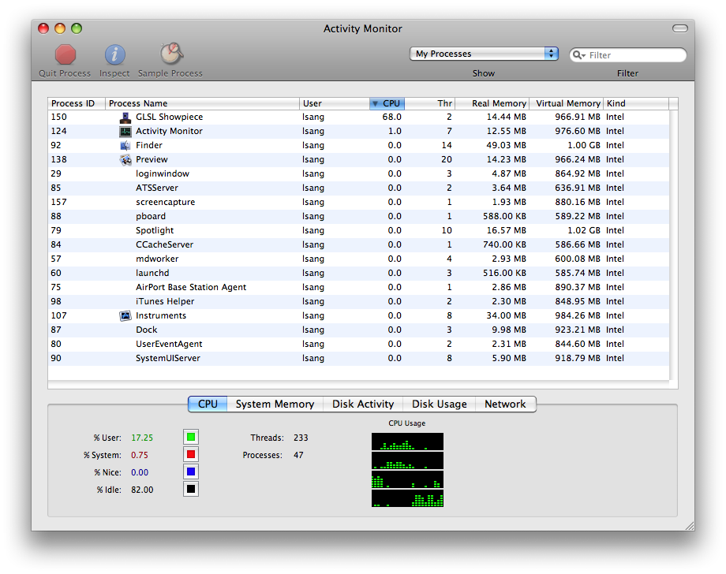
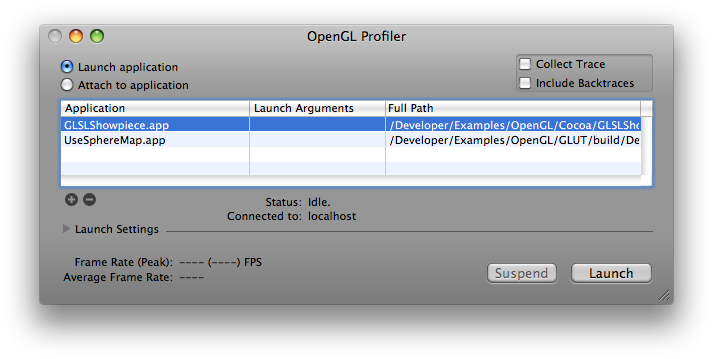
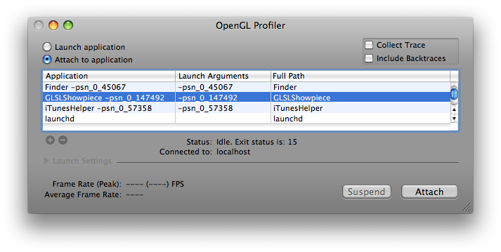
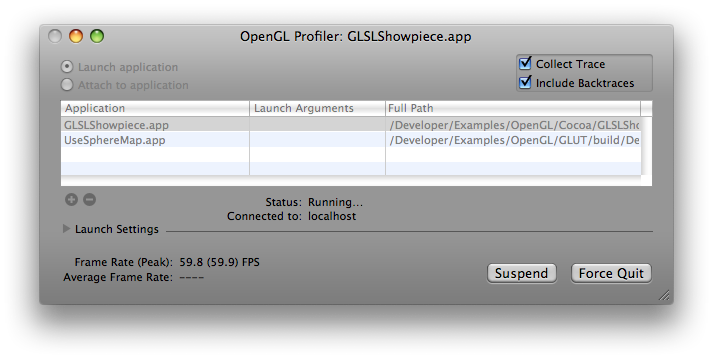
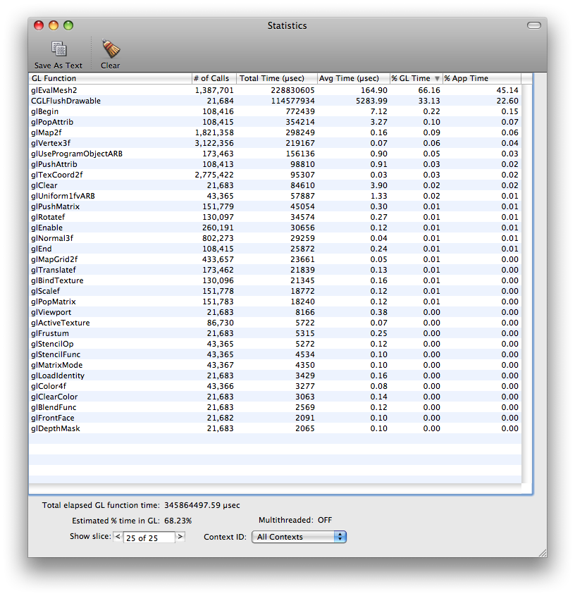
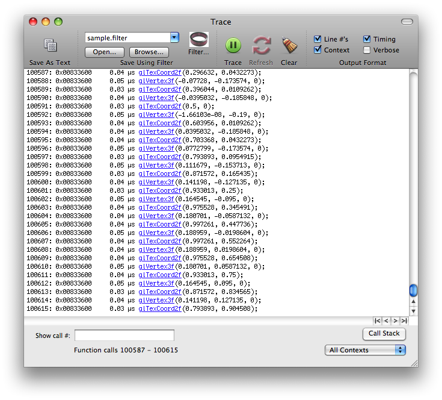
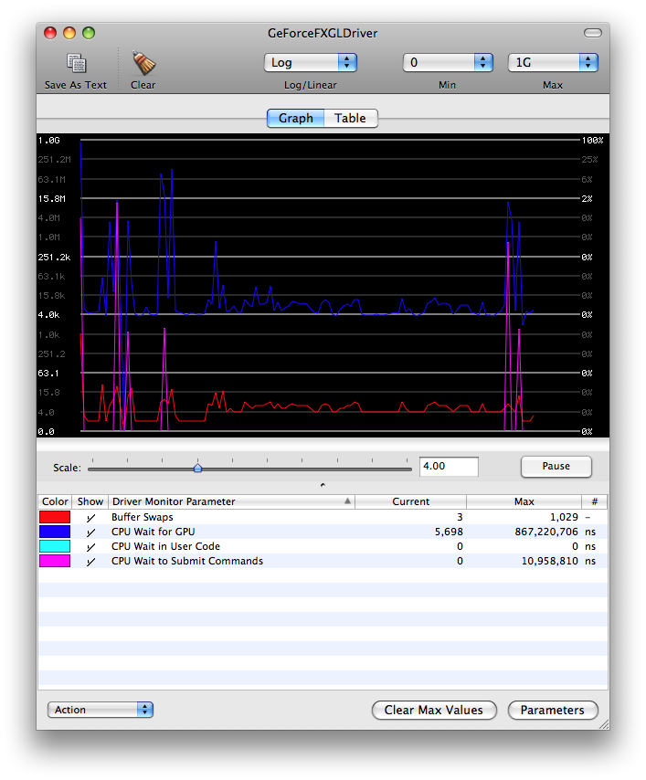

> 导航：[总目录](../../README.md) · [technotes](../../_indexes/technotes.md)

Technical Note TN2093

# OpenGL Performance Optimization : The Basics

This document describes some of the basic concepts and techniques for optimizing performance in OpenGL applications, including a tuning roadmap to use 'top', Shark and OpenGL Profiler to get an idea how much the overall application can benefit from optimizing OpenGL. It also introduces performance tools such as OpenGL Driver Monitor and covers a few general recommendations on using OpenGL effectively.

[Introduction](#apple-f4xwc4dqnrsv64tfmyxwi33df52wszbpirkfgmjqgaydgmryhewugsbrfvke4vcbi4yq)[The Performance Tuning Roadmap](#apple-f4xwc4dqnrsv64tfmyxwi33df52wszbpirkfgmjqgaydgmryhewugsbrfvke4vcbi4za)[Use Profiler, Driver Monitor, Instruments and Shark](#apple-f4xwc4dqnrsv64tfmyxwi33df52wszbpirkfgmjqgaydgmryhewugsbrfvke4vcbi42a)[Finding and eliminating duplicate function calls and redundant state changes](#apple-f4xwc4dqnrsv64tfmyxwi33df52wszbpirkfgmjqgaydgmryhewugsbrfvke4vcbi42q)[Effective use of glFlush() and glFinish()](#apple-f4xwc4dqnrsv64tfmyxwi33df52wszbpirkfgmjqgaydgmryhewugsbrfvke4vcbi43a)[Understanding Vertical Synchronization](#apple-f4xwc4dqnrsv64tfmyxwi33df52wszbpirkfgmjqgaydgmryhewugsbrfvke4vcbi44a)[Don't try to overdrive the graphics pipeline (with rendering timers)](#apple-f4xwc4dqnrsv64tfmyxwi33df52wszbpirkfgmjqgaydgmryhewugsbrfvke4vcbi43q)[Reading pixels from the frame buffer](#apple-f4xwc4dqnrsv64tfmyxwi33df52wszbpirkfgmjqgaydgmryhewugsbrfvke4vcbi44q)[Concluding Remarks](#apple-f4xwc4dqnrsv64tfmyxwi33df52wszbpirkfgmjqgaydgmryhewugsbrfvke4vcbi4yta)[Reference Section](#apple-f4xwc4dqnrsv64tfmyxwi33df52wszbpirkfgmjqgaydgmryhewugsbrfvke4vcbi4ytc)[Document Revision History](#apple-f4xwc4dqnrsv64tfmyxwi33df52wszbpirkfgmjqgaydgmryhewvezlwnfzws33ojbuxg5dpoj4s2rdpnz2ey2lonncwyzlnmvxhiskel4yq)

## Introduction

Optimization of OpenGL code has become an increasingly important activity in the development of OpenGL-based applications. This document is targeted towards OpenGL developers who are looking to improve the performance of their applications. Developers should have a fundamental knowledge of OpenGL programming and a familiarity with OpenGL on Mac OS X to fully utilize and understand the information presented here.

Before diving into code to start performance tuning an OpenGL application, it is best to examine the fundamentals of OpenGL optimization and develop a systematic approach to enhancing the performance of OpenGL applications. This document provides step-by-step demonstrations on using Activity Monitor (or Instruments) and OpenGL Profiler to determine how much the overall application performance can be improved if OpenGL were to be reduced to zero overhead.

The document then gives more information on the OpenGL Profiler and other tools available on Mac OS X for tuning OpenGL performance, including OpenGL Driver Monitor and Shark. Following are a few important issues and advices developers must keep in mind when developing OpenGL applications.

[Back to Top](#)

## The Performance Tuning Roadmap

- __Run OpenGL Application (windowed) side-by-side with Activity Monitor or Activity Monitor Instruments__

  This yields a baseline performance number for the amount of CPU time consumed by the application. An example screenshot of Activity Monitor is shown below with the application in question (GLSLShowpiece) listed on top.

  
- __Determine baseline CPU utilization__

  Note the time in the above image. The GLSLShowpiece application is currently using 68.0% of the available CPU time. This is the baseline value that should be used for determining how an application is performing.
- __Collect an OpenGL function statistics and trace using OpenGL Profiler__

  There are two ways to analyze an application in OpenGL Profiler. You can launch an application within Profiler as demonstrated by the following dialog:

  

  Or you can attach a running application to Profiler as demonstrated by this dialog:

  

  After the application in question is launched or attached, you can collect OpenGL statistics by selecting __Statistics__ under __Views__ menu or pressing __cmd-opt-s__. Similarly, you can collect OpenGL call trace by selecting __Trace__ under __Views__ menu or pressing __cmd-opt-t__. You can also collect backtraces of the OpenGL functions by checking the __Include Backtraces__ option in the Profiler's main window:

  

  You may see small hiccups or glitches in the application, particularly when Profiler is collecting backtraces. This is normal and will not affect your performance statistics significantly. The reason for this is that Profiler is collecting and writing out a large amount of data for the function trace listing.
- __Analyze Profiler statistics data; Look for percentage of application time spent in OpenGL and where that time in OpenGL is being spent.__

  This image shows the Profiler statistics from the GLSLShowpiece sample. The listing is sorted by most OpenGL time consumed in descending order. It indicates that the bulk of the time spent in OpenGL occurs in computing two-dimensional grid of points or lines (glEvalMesh2).

  

  Down at the bottom of the image in the lefthand corner is a little bit of data labeled "Estimated % time in OpenGL: 68.23%". At this point in the analysis, that number is of the most concern. The higher this number, the more time the application is spending in OpenGL and the more opportunity there may be to improve application performance by optimizing OpenGL.
- __Analyze Profiler function traces; Look for duplicate function calls and redundant or unnecessary state changes.__

  This image is of the function trace itself. Note that this is only a partial listing of the complete function trace, showing function calls from 100587 to 100615. There can be thousands of pages such as these, millions if Profiler is allowed to continue collecting function traces. You can scroll through the listing with the arrows at the bottom of the page. The outside arrows take you to the first and last pages, left and right respectively, and the inside arrows scroll one page backward or forward, again left and right respectively.

  

  The trace can be very useful for finding duplicate function calls or redundant state changes. When looking through the traces, look for back-to-back function calls with the same or similar data. These are areas that can typically be optimized in code to remove some function call overhead. When looking for redundant state changes, some commonly seen duplicates include functions such as glTexParameter\*(), glPixelStore\*(), glEnable() and glDisable(). Many times, these functions can be called once from a setup or state modification routine and only called when necessary. It's generally good practice to keep state changes out of rendering loops (which can be seen in the function trace as the same sequence of state changes and drawing over and over again) as much as possible and use separate routines to adjust state as necessary. This subject will be described in more details later in the document.
- __Determine what maximum performance benefit would be if OpenGL were to be reduced to zero overhead__

  Perhaps the most important aspect of OpenGL performance is how it relates to overall application performance. Using the above data from the GLSLShowpiece sample, 68.0% (from Activity Monitor or Instruments) of available CPU time is being used by the application. Of this 68.0%, 68.23% (from Profiler) is being spent in OpenGL, while the remainder is being used by the application itself. The following equations illustrates the relationship of these two numbers and how much the overall application can gain if OpenGL were to be reduced to zero overhead:

  __Overall Performance Increase = (Total CPU Time Consumed) \* (Percentage of Time Spent In OpenGL)__

  __New Framerate = Previous FPS \* (1 + (Percent Performance Increase)__

  Placing the generated data into the equations yields the following results:

  __Overall Performance Increase = (68.0%) \* (68.23%) = 46.3964%__

  __New Framerate = 59.8fps \* 1.464 = 87.5fps__

  __Note:__ It is impractical to think that an OpenGL application can actually have zero CPU utilization and still do something marginally useful. The idea of reducing the overhead of OpenGL to zero is strictly for demonstrating the concepts behind OpenGL optimization.

[Back to Top](#)

## Use Profiler, Driver Monitor, Instruments and Shark

The previous section offered some tips and instructions for using the OpenGL Profiler to collect performance data for an OpenGL application. With Profiler, developers can see how much time is being spent in OpenGL, in which functions that time is being spent and function call traces for the application being analyzed. OpenGL Profiler contains many more features and functions, not just the ones mentioned previously. For a more complete description of the OpenGL Profiler, please visit the [Real world profiling with the OpenGL Profiler](https://developer.apple.com/technotes/tn2007/tn2178.html) web page.

These three tools, included with the Mac OS X Developer Tools installation, are of paramount importance when performance tuning OpenGL applications. They are capable of tracking down and illustrating many of the common performance problems found in OpenGL applications. Instead of duplicating a great deal of information in this document regarding these tools, included below is a list of links to the appropriate tools documentation.

When using Profiler, there are a couple things to keep in mind. The following is a short list of items to keep in mind when you start working with Profiler:

- Collect statistics to see where time is being spent in OpenGL
- Collect a function trace to look for duplicate function calls and redundant state changes
- Look for `glFinish()` commands in the function statistics and remove from code if possible.
- Check for vertex submission commands - determine how vertices are being submitted to OpenGL.

The OpenGL Driver Monitor can be overwhelming at first, so to get a better grasp on the data displayed, please take a look at the "OpenGL Driver Monitor Parameters" section in the [OpenGL Driver Monitor User Guide](https://developer.apple.com/library/mac/#documentation/graphicsimaging/Conceptual/OpenGLDriverMonitorUserGuide/Introduction/Introduction.html). This document describes in moderate detail the various aspects of Driver Monitor and some of the more important statistics that can be examined within the application.

In this image of Driver Monitor running simultaneously with the GLSLShowpiece application, virtually all of the parameters and states of the driver can be viewed and analyzed. In this particular example, there are 4 different items currently being tracked by Driver Monitor: `bufferSwapCount` (Buffer Swaps), `clientGLWaitTime` (CPU Wait for GPU), `hardwareSubmitWaitTime` (CPU Wait in User Code) and `hardwareWaitTime` (CPU Wait to submit Commands). The first one is relatively simple - the `bufferSwapCount` is the total number of buffer swaps performed by the driver. The second, `clientGLWaitTime`, is the amount of time the CPU is stalled by the client OpenGL driver while waiting for a hardware time stamp to arrive. This usually occurs while waiting for a texture update or the completion of a glFence() command. The third parameter, `hardwareSubmitWaitTime`, shows how long the CPU is stalled waiting to be able to submit a new batch of OpenGL commands. This is a particularly important function as it can offer some insight as to how much time is being wasted by the CPU waiting for the GPU to process the previously submitted command buffers. The last parameter, `hardwareWaitTime`, is a global indicator of how long the CPU is stalled while waiting for the GPU. This parameter encompasses parameters such as `hardwareSubmitWaitTime` and other hardware waiting situations.

Instruments is a very powerful tool that can gather a variety of performance data from your running application, including CPU usage, memory usage, disk activity, network activity, and so forth. Unlike most other performance and debugging tools, Instruments lets you view in the timeline all of the different types of information side by side. This allows you to correlate the overall behavior of your application, not just the behavior in one specific area. In addition to providing the graphical timeline view, Instruments provides tools to help you analyze your application’s behavior over time. For example, the Instruments window lets you store data from multiple runs so that you can see whether your application’s behavior is actually improving or whether it still needs work. For details on how to use instrument, please refer to [Instruments User Guide](https://developer.apple.com/library/mac/#documentation/DeveloperTools/Conceptual/InstrumentsUserGuide/Introduction/Introduction.html).

To complement the performance data Instruments collects, the Shark application lets you view system-level events, such as system calls, thread scheduling decisions, interrupts, and virtual memory faults. When you find performance problems in your code are more related to the interaction between your code, Mac OS X, and the hardware architecture of the device, you may use Shark to get information about those iterations and find performance bottlenecks. For more information on Shark, please reference the [Using Shark](https://developer.apple.com/library/mac/#documentation/performance/Conceptual/PerformanceOverview/InitialEvaluation/InitialEvaluation.html#//apple_ref/doc/uid/TP40001410-CH206-SW8) documentation.

[Back to Top](#)

## Finding and eliminating duplicate function calls and redundant state changes

One of the primary culprits for OpenGL performance issues is duplicate function calls. There are many forms of this particular problem, including redundant state settings and multiple flushes or swaps in a single frame. For instance, if one were enabling lighting with a call such as `glEnable(GL_LIGHTING)` or enabling texturing with `glEnable(GL_TEXTURE_2D)`, these only need to be called once for enabling and/or once for disabling. A common scenario here is for an application to enable texturing and/or lighting every time through the drawing loop. Generally speaking, an application will only have to make state changes such as these once if they are to be used throughout the application and should be done in a dedicated setup routine. However, there are instances where texturing or lighting may need to be turned off and back on again (such as when drawing a wire-frame outline around a textured polygon) in order to accomplish a specific visual effect or drawing operation. In this case, isolated routines should be present that will change state only if necessary and should be done at the application level instead of in OpenGL itself.

It is important to understand that OpenGL does not perform any type of consistency checks or redundant state set checks. For instance, as in the example above, if a call is made such as `glEnable(GL_LIGHTING)` and subsequently, this same call is issued, OpenGL will not verify that the state is actually changing. It will simply update the state value of the supplied parameter, even if that value is identical to its current value. This is a design decision in the OpenGL specification and not implementation-specific. The additional code required to perform these checks, while useful for developers, would inevitably cause performance problems even for applications that were not doing such things.

State changes in OpenGL tend to be expensive and should be broken out into separate initialization or configuration routines. Placing these calls in draw loops, or functions executed by the drawing loops, has the effect of slowing down OpenGL performance due to unnecessary changes in state. Due to the fact that OpenGL is performance-minded, no conditional or error checking is performed on incoming state changes, so these calls will cost just as many cycles for redundant entries as they would for changing data.

[Back to Top](#)

## Effective use of glFlush() and glFinish()

These two commands are both used to do essentially the same thing, that being to submit all queued OpenGL commands to the hardware for execution. The major difference between the two is that `glFinish()` blocks until all of those commands have been executed by the hardware, while `glFlush()` simply waits until all the commands have been submitted. This fact alone makes it quite clear that `glFinish()` can cause much more serious problems than `glFlush()`.

Problems centered around these two function calls are usually easy to track down. Incorrect use of these commands can cause stalls and slow downs, which inevitably result in poor application performance. This is usually displayed as stuttering, sluggish response and high levels of CPU utilization. A quick look through the statistics report from OpenGL Profiler should show where the problems lie, if `glFlush()` or `glFinish()` is to blame.

As one can imagine, `glFlush()` has a much less significant impact on performance than `glFinish()` does. In the quest for higher performance, `glFinish()` commands should be removed unless they are deemed to be absolutely necessary. `glFlush()` commands can be used as long as this is done so in an efficient manner. For instance, you could use `glFlush()` to force drawing updates at the end of a draw loop, but you would not want to do this right before a call to a buffer swapping command (such as `aglSwapBuffers()`, which contains an implicit `glFlush()` itself). For a more detailed description of these two commands, please reference the Q&A [glFlush() vs glFinish()](https://developer.apple.com/qa/qa2004/qa1158.html). This document offers a clear and decisive definition and discussion of `glFlush()` and glFinish and their impact on performance.

[Back to Top](#)

## Understanding Vertical Synchronization

Vertical synchronization (VSYNC) refers to the synchronization of frame changes with the vertical retrace. Vertical retrace, also known as vertical blanking interval or vertical synchronization signal, is used to describe the action performed within a CRT display that turns the electron beam off each time the beam has completed tracing the entire screen to create an image.

Applications are usually synchronized with the vertical retrace in order to eliminate the problem of frame tearing. Frame tearing is a situation where part of a following frame overwrites previous frame data in the frame buffer before that frame has fully been rendered on the screen. The visual effect of this is that one will see perhaps half (more or less depending on the situation) of the new frame and remainder of the previous frame. Vertical synchronization eliminates this problem by only drawing 1 frame during the vertical retrace, which guarantees that only 1 frame will be drawn per screen refresh.

Another reason you should turn on vertical synchronization is to avoid overdriving the drawing loop when using rendering timers. You will find more information about this in the next chapter of [Don't try to overdrive the graphics pipeline (with rendering timers)](#apple-f4xwc4dqnrsv64tfmyxwi33df52wszbpirkfgmjqgaydgmryhewugsbrfvke4vcbi43q).

There are some caveats to doing this, however. The refresh only happens in integer factors of the current refresh rate of the monitor (60Hz, 30Hz, 15Hz, etc). The problem here is that OpenGL will block while waiting for the next vertical retrace which tends to waste time that could be spent performing other drawing operations.

__Note:__ LCD displays do not use an electron beam and thus requires no retrace period. The refresh rate on LCD displays refers generally to frame rate, which is typically a fixed rate of 60Hz.

[Back to Top](#)

## Don't try to overdrive the graphics pipeline (with rendering timers)

Another common performance issue is an application's attempt to overdrive the drawing loops. This normally arises when vertical synchronization is not enabled and using a timer that fires in rapid succession, calling the drawing loop each time it fires. Typically, the timer interval has been set to some exceptionally small value (such as 0.001 seconds to yield 1000 executions per second). The effect of this is quite the opposite from what is often expected - CPU time is consumed at double or triple (sometimes much higher) what it would or should normally be and application performance is severely degraded.

In this situation, it's best to either allow the system to regulate drawing (using `-setNeedsDisplay:` in Cocoa, for instance) or to synchronize buffer swaps with the vertical refresh rate. This is because when the application blocks waiting for the next vertical retrace, the timer can not fire, thus taking no extra CPU time. When vertical synchronization is enabled, it is actually good practice to set the timer to a small interval such as 0.001 seconds or 1000 fps, so that your OpenGL application can have the entire retrace period for drawing.

As an alternative of using timers, you can choose to use a Core Video display link to drive the drawing loop, without worrying about choosing an appropriate time interval or overdriving the pipeline. For more information about Core Video display link, please see [CVDisplayLink Reference](https://developer.apple.com/library/mac/#documentation/QuartzCore/Reference/CVDisplayLinkRef/Reference/reference.html).

For more details about this subject and short code examples, please see [Technical Q&A QA1385, 'Driving OpenGL Rendering Loops'](https://developer.apple.com/qa/qa2004/qa1385.html). The document provides sample codes of driving the drawing loop of a Cocoa OpenGL application using a `CVDisplayLink` as well as using an `NSTimer` when vertical synchronization is on. The code listed there illustrates proper architecture of a rendering loop in Cocoa in both cases.

[Back to Top](#)

## Reading pixels from the frame buffer

Reading pixels back from the frame buffer in OpenGL is commonly accomplished with the `glReadPixels()` API. Understanding how this command functions is key to achieving good application performance when buffer read back is required.

Conventional `glReadPixels()` blocks the pipeline until all rendering commands are complete, and waits until all pixel data are transferred and ready for use before it returns control to the calling application. One can easily see that this has two negative performance impacts, forcing a synchronization point between the calling application and OpenGL (something you should always strive to avoid), and the cost of the data transfer from GPU to CPU across the bus (which can be fairly expensive depending on how much data is retrieved).

On the contrary, `glReadPixels()` with PBOs (pixel buffer objects) can schedule asynchronous data transfer and returns immediately without stall. Therefore, the application can execute other processes right away while transferring the data by OpenGL at the same time. The other advantage of using PBOs is the fast pixel data transfer from (and to) a graphics card though DMA without involving CPU cycles. In the conventional way, the pixel data is loaded into system memory by CPU. Using a PBO, instead, GPU manages copying data from the frame buffer to a PBO. This means that OpenGL performs a DMA transfer operation without wasting CPU cycles.

To maximize asynchronous read back performance, you can use two PBOs. Every frame, the application reads the pixel data from the framebuffer to one PBO using `glReadPixels()`, and processes the pixel data in the other. Calls to `glMapBufferARB()` and `glUnmapBufferARB()` will map/unmap the OpenGL controlled buffer object to the client's address space so that you can access and modify the buffer through a pointer. These read and process can be performed simultaneously, because `glReadPixels()` to the first PBO returns immediately so CPU can start processing data in the second PBO without delay. You alternate between the two PBOs every frame.

__Warning:__ If you want to transfer data to a PBO and update its values during one single frame, `glMapBufferARB()` will cause a synchronization issue. `glMapBufferARB()` will not return if GPU is still working with the buffer object, and waits until GPU finishes its job.

[Back to Top](#)

## Concluding Remarks

In conclusion, the above information should offer a solid foundation upon which to build a fast, optimized OpenGL application on Mac OS X. The important thing to remember here is that this is really the "tip of the iceberg", so to speak, and that there are numerous other methods and techniques that can be employed to further enhance application performance. Another issue to keep in mind is that all applications do not drive the graphics pipeline in the same manner, therefore different optimization techniques can be necessary depending on how the application is architected and how it is handling rendering.

[Back to Top](#)

## Reference Section

[OpenGL Driver Monitor User Guide](https://developer.apple.com/library/mac/#documentation/graphicsimaging/Conceptual/OpenGLDriverMonitorUserGuide/Introduction/Introduction.html)

[Real world profiling with the OpenGL Profiler](https://developer.apple.com/technotes/tn2007/tn2178.html)

[Instruments User Guide](https://developer.apple.com/library/mac/#documentation/DeveloperTools/Conceptual/InstrumentsUserGuide/Introduction/Introduction.html)

[Using Shark](https://developer.apple.com/library/mac/#documentation/performance/Conceptual/PerformanceOverview/InitialEvaluation/InitialEvaluation.html#//apple_ref/doc/uid/TP40001410-CH206-SW8)

[glFlush() vs glFinish()](https://developer.apple.com/qa/qa2004/qa1158.html)

[Driving Rendering Loops with CVDisplayLink or NSTimer](https://developer.apple.com/qa/qa2004/qa1385.html)

Also, the OpenGL presentations from previous WWDC sessions are extremely valuable references for OpenGL performance. These are available on DVD to all developers who attend the conference.

[Back to Top](#)

---

#### Document Revision History

| __Date__ | __Notes__ |
| 2013-06-07 | Corrected links. |
| 2008-11-05 | Added an abstract; Updated the screen shots and corresponding text with Leopard versions; Added more details to the chapter of "Understanding Vertical Synchronization" (was named as "Understanding VSYNC"), and "Reading pixels from the frame buffer". |
| 2004-12-01 | This document describes some of the concepts and techniques for optimizing performance in OpenGL applications. |
|  | New document that this document describes some of the concepts and techniques for optimizing performance in OpenGL applications. |

