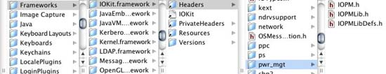
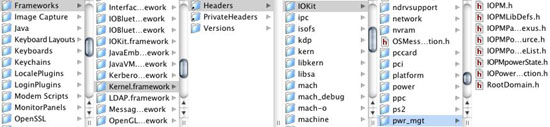
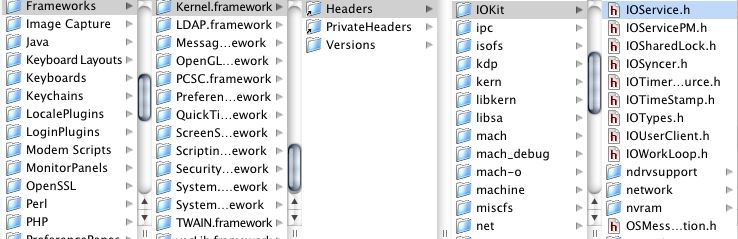
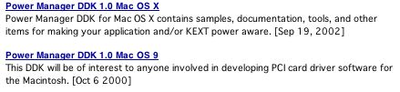
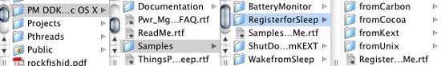
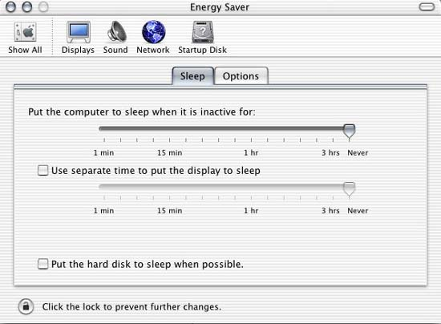

> 导航：[总目录](../../README.md) · [technotes](../../_indexes/technotes.md)

Technical Note TN2075

# Power Management for Macintosh; getting started

Power Management is that part of Mac OS X and Mac OS 9 that provides the functionality for the computer to sleep and wake, for applications and drivers to register for power event, and more...

But where do you find all the related material?

This Technical Note is intended to help you locate the various Power Management header files, documentation, Darwin sources, code samples, and Development Kits available to developers.

[Locating Power Management Header Files](#apple-f4xwc4dqnrsv64tfmyxwi33df52wszbpirkfgmjqgaydgmjqgewugsbrfvkectru)[Locating Darwin Power Management Files](#apple-f4xwc4dqnrsv64tfmyxwi33df52wszbpirkfgmjqgaydgmjqgewugsbrfvkectrrgu)[Locating Power Management Development Kits](#apple-f4xwc4dqnrsv64tfmyxwi33df52wszbpirkfgmjqgaydgmjqgewugsbrfvkectrsgm)[Locating Power Management Documentation](#apple-f4xwc4dqnrsv64tfmyxwi33df52wszbpirkfgmjqgaydgmjqgewugsbrfvkectrsha)[Locating Power Management Tools](#apple-f4xwc4dqnrsv64tfmyxwi33df52wszbpirkfgmjqgaydgmjqgewugsbrfvkectrtgi)[Power Management and Your Development Environment](#apple-f4xwc4dqnrsv64tfmyxwi33df52wszbpirkfgmjqgaydgmjqgewugsbrfvkectrtgq)[Basic Power Management Gotchas](#apple-f4xwc4dqnrsv64tfmyxwi33df52wszbpirkfgmjqgaydgmjqgewugsbrfvkectruge)[Carbon and Both Power Managers](#apple-f4xwc4dqnrsv64tfmyxwi33df52wszbpirkfgmjqgaydgmjqgewugsbrfvkectrugm)[Policy Maker vs. Power Controller](#apple-f4xwc4dqnrsv64tfmyxwi33df52wszbpirkfgmjqgaydgmjqgewugsbrfvkectrugu)[Sleep means sleep; not suspend or shutdown](#apple-f4xwc4dqnrsv64tfmyxwi33df52wszbpirkfgmjqgaydgmjqgewugsbrfvkectruhe)[Why won't this machine sleep?](#apple-f4xwc4dqnrsv64tfmyxwi33df52wszbpirkfgmjqgaydgmjqgewugsbrfvkectrvge)[Keep your desktop cover closed...](#apple-f4xwc4dqnrsv64tfmyxwi33df52wszbpirkfgmjqgaydgmjqgewugsbrfvkectrvgm)[My PCI device panics during wake](#apple-f4xwc4dqnrsv64tfmyxwi33df52wszbpirkfgmjqgaydgmjqgewugsbrfvkectrvgu)[Where to go from here](#apple-f4xwc4dqnrsv64tfmyxwi33df52wszbpirkfgmjqgaydgmjqgewugsbrfvkectrvg4)[Document Revision History](#apple-f4xwc4dqnrsv64tfmyxwi33df52wszbpirkfgmjqgaydgmjqgewvezlwnfzws33ojbuxg5dpoj4s2rdpnz2ey2lonncwyzlnmvxhiskel4yq)

## Locating Power Management Header Files

If you are developing a Mac OS X application that uses power management, your header files are located at this absolute path.

/System/Library/Frameworks/IOKit.framework/Versions/A/Headers/pwr_mgt See Figure 1 The Power Management DDK for Mac OS X contains various samples that show you how to use header files in this category. Use these header files if you are developing from a UNIX, Cocoa, and Carbon environment.

However, if you are using Carbon there is also one other Mac OS 9 header file required. This header file is power.h and is located at this absolute path. /System/Library/Frameworks/CoreServices.framework/Versions/A/Frameworks/OSServices.framework/Versions/A/Headers/Power.h

__Figure 1__  Power Management User Headers

If you are developing an in-kernel device driver (KEXT) that uses power management, the header files you need are located at these two absolute paths. The APIs are part of IOService.h.

/System/Library/Frameworks/Kernel.framework/Versions/A/Headers/IOKit/IOService.h See Figure 3 /System/Library/Frameworks/Kernel.framework/Versions/A/Headers/IOKit/pwr_mgt See Figure 2

__Figure 2__  Power Management Kernel Headers

__Figure 3__  More Power Management Kernel Headers

[Back to Top](#)

## Locating Darwin Power Management Files

There are three Darwin subprojects dealing with Power Management: IOKitUser, PowerManagement, and xnu.

IOKitUser/pwr_mgt subproject ([http://www.opensource.apple.com/darwinsource/10.2.6/IOKitUser/pwr_mgt.subproj/](http://www.opensource.apple.com/darwinsource/10.2.6/IOKitUser/pwr_mgt.subproj/) ) contains user-space APIs and sample applications.

PowerManagement subproject ([http://www.opensource.apple.com/darwinsource/10.2.6/PowerManagement/](http://www.opensource.apple.com/darwinsource/10.2.6/PowerManagement/) ) contains the user-space backend support. There are no APIs in this project, but pmset source code is contained in this subproject.

xnu subproject ([http://www.opensource.apple.com/darwinsource/10.2.6/xnu/iokit/IOKit/pwr_mgt/](http://www.opensource.apple.com/darwinsource/10.2.6/xnu/iokit/IOKit/pwr_mgt/) ) contains the kernel interface.

[Back to Top](#)

## Locating Power Management Development Kits

There are two Power Management Development Kits, one for Mac OS X and one for Mac OS 9 as shown in Figure 3. Use this URL to locate these kits.

([http://developer.apple.com/sdk/index.html](https://developer.apple.com/sdk/index.html) )

__Figure 4__  Power Management Development Kits

[Back to Top](#)

## Locating Power Management Documentation

Power management is described in Chapter 10 of Inside Mac OS X: I/O Kit Fundamentals. You can view this document at [http://developer.apple.com/documentation/Darwin/#IOKit](https://developer.apple.com/documentation/Darwin/#IOKit) It is also part of the Developer SDK. When your Developer SDK is installed you can locate it via this path.

/Developer/Documentation/Darwin/IOKit/IOKitFundamentals

[Back to Top](#)

## Locating Power Management Tools

There are many OS X tools for reading and writing power management parameters. These tools are part of the Power Management OS X DDK. There are two tools of interest called pmset and SleepCycler that should be mentioned here.

pmset is a command line tool that circumvents the Energy Saver System Preferences. It is run as root and is intended for testing purposes. See the man pages for details. Here is the synopsis for pmset:

"pmset changes and reads power management settings such as idle sleep timing, wake on administrative access, automatic restart on power loss, etc."

SleepCycler is an application that continuously cycles your machine from a state of 'awake' (ie, 'non-sleep') to 'sleep' (or 'doze' for machines that do not support 'deep sleep').

Primarily, SleepCycler was designed to stress test Power Management system software in Mac OS X. It is also useful since it stress tests device driver Power Management behavior, as well as overall system behavior.

[Back to Top](#)

## Power Management and Your Development Environment

Regardless of your development environment (Carbon, Cocoa, Kernel, or UNIX) the Power Management DDK for Mac OS X has some very simple examples to get you started. After you've installed the DDK, you can find the samples in the folder named Register for Sleep (as shown in Figure 4). To make it easy to choose the right code for your needs, the samples are arranged in subfolders that correspond to different development environments.

__Figure 5__  Sleep Examples

All the examples do the same thing. They register for sleep and provide a callback routine. Regardless of your environment these examples provide the necessary frameworks, header files, and other controls to quickly build the examples. Check them out by downloading the DDK.

__Note:__ Your patience please: currently the RegisterforSleepfromKext example is being added to a version of the HelloIOKit tutorial and will be published very soon. In the meantime check out Chapter 10 from I/O Kit Fundamentals for a code snippet.

[Back to Top](#)

## Basic Power Management Gotchas

Based on power management questions submitted to DTS Engineering, here is a list of some common situations developers discover during their development cycle.

### Carbon and Both Power Managers

If you are developing for Carbon you need to be aware that there are not just Mac OS X power manager headers, there are also Mac OS 9 headers. They are not the same. All other development environments only need to use the Mac OS X headers. The Carbon power.h headers are obsolete and are not entirely implemented in Mac OS X, but are needed for Mac OS 9.

### Policy Maker vs. Power Controller

Chapter 10 of I/O Kit Fundamentals contains a detailed explanation of what these two terms mean and how they interact. However, a short description will help you get started. Both entities live in the kernel, but a policy maker has a human interface in the Energy Saver System Preferences as shown in Figure 5.

__Figure 6__  Energy Saver System Preferences.

A user uses the Engery Saver System Preference to communicate with a policy maker and set energy preferences. A power controller resides in a KEXT and takes its orders from the policy maker. These "orders" consist of power events, such as sleep. Although you will probably never implement a policy maker, if you are developing a device driver you will need to implement a power controller. This is because only a device driver knows how to remove power from the device so it can safely sleep. As you read Chapter 10 of I/O Kit Fundamentals, you may want to skim the policy maker information and concentrate instead on the power controller material.

### Sleep means sleep; not suspend or shutdown

DTS Engineering has noticed that developers from a UNIX or Windows background may use different terminology for "sleep" than traditional Macintosh developers do. Here is the sleep definition from SleepCycler Help for your convenience. SleepCycler is located on the Power Management DDK for Mac OS X.

There are two different types of sleep currently supported in Mac OS X - full sleep (deep sleep), and a lighter doze.

In general, machines that fully support Power Management will sleep, while those that do not will doze.

In the state of sleep almost all hardware except the minimum required things like the PMU (Power Management Unit) are suspended/turned off, including the CPU - this means that processes are not scheduled or run.

Most machines that officially support Mac OS X are capable of sleeping, however a few machines such as the original iMacs (pre slot-loading) and Blue/White and Beige G3s do not fully support sleep, and thus doze.

In doze mode all the devices that are capable of power-management (as reported by their drivers) are suspended, but those that claim to not be power-manageable are not suspended, and thus prevent the whole machine from sleeping.

The OS turns off as many of the remaining devices as possible, however, the CPU remains running, and thus programs are still actively scheduled and running.

### Why won't this machine sleep?

There are a number of valid reasons why a machine will not sleep (see the OS X Power Manager DDK for details). However all of these reasons fall into one broad category: activity from other events in a multitasking environment. While debugging your applications and hardware try to do so from a benign environment. In other words, turn off all Energy Saver Preferences (if possible) and do not launch any unnecessary applications. Additional applications may "tickle" activity timers, which can prevent your machine from IDLE sleep.

### Keep your desktop cover closed...

while debugging your PCI device. Many of us like to have the enclosure open to see LEDs flicker on our PCI devices. Visual feedback is great while debugging. Did you know however, that "some" computer enclosures have a sense switch, which when open disables power management from functioning? This could mean a sleep event that you expect to happen when you execute a line of "sleep" code will be ignored by Power Managment because the enclosure is open. Having an enclosure open may prevent hardware heat sensors from acting, causing Power Management to ignore sleep events.

### My PCI device panics during wake

This is usually because your device is not registering for power events. When a sleep event occurs, power is removed from the PCI bus and therefore your device will need to be reinitialized when a wake event occurs.

[Back to Top](#)

## Where to go from here

Two places come to mind. In no order, try Chapter 10 of I/O Kit Fundamentals. The Power Manager DDK is also another source of samples, tools, etc.

Good luck with your development effort. DTS Engineering

[Back to Top](#)

---

#### Document Revision History

| __Date__ | __Notes__ |
| 2003-05-30 | New document that outlines available documentation and its location for power management on Mac OS X and OS 9. |

