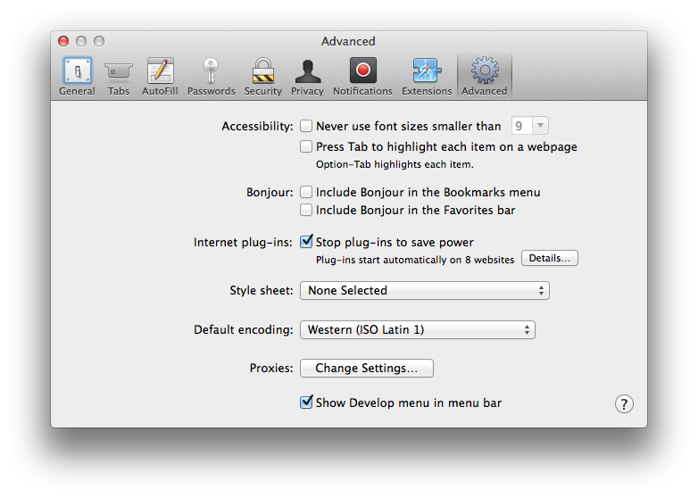

> 导航：[总目录](../../README.md) · [technotes](../../_indexes/technotes.md)


Technical Note TN2262

# Preparing Your Web Content for iPad

Platform-specific considerations for web content in Safari on iOS devices, with specific information for iPad.

[Introduction](#apple-f4xwc4dqnrsv64tfmyxwi33df52wszbpirkfgnbqgaydsnjxg4wugsbrfveu4vcsj5cfkq2ujfhu4)[Safari on iPad Readiness Checklist](#apple-f4xwc4dqnrsv64tfmyxwi33df52wszbpirkfgnbqgaydsnjxg4wugsbrfvjucrsbkjev6t2ol5evaqkel5jekqkejfheku2tl5buqrkdjngesu2u)[1. Test your website on iPad, and update user agent detection code if necessary](#apple-f4xwc4dqnrsv64tfmyxwi33df52wszbpirkfgnbqgaydsnjxg4wugsbrfvjucrsbkjev6t2ol5evaqkel5jekqkejfheku2tl5buqrkdjngesu2ufuyv6x2uivjvix2zj5kvex2xivbfgskuivpu6ts7jfiecrc7l5au4rc7kvieiqkuivpvku2fkjpucr2fjzkf6rcfkrcugvcjj5hf6q2pircv6skgl5hekq2fknjucusz)[2. Use W3C standard web technologies instead of plug-ins](#apple-f4xwc4dqnrsv64tfmyxwi33df52wszbpirkfgnbqgaydsnjxg4wugsbrfvjucrsbkjev6t2ol5evaqkel5jekqkejfheku2tl5buqrkdjngesu2ufuzf6x2vkncv6vztinpvgvcbjzcecusel5lukqs7krcugscoj5ge6r2jivjv6skoknkekqkel5humx2qjrkuox2jjzjq)[3. Check your viewport tag settings](#apple-f4xwc4dqnrsv64tfmyxwi33df52wszbpirkfgnbqgaydsnjxg4wugsbrfvjucrsbkjev6t2ol5evaqkel5jekqkejfheku2tl5buqrkdjngesu2ufuzv6x2djbcugs27lfhvkus7kzeukv2qj5jfix2uifdv6u2fkrkestshkm)[4. Modify code that relies on CSS fixed positioning](#apple-f4xwc4dqnrsv64tfmyxwi33df52wszbpirkfgnbqgaydsnjxg4wugsbrfvjucrsbkjev6t2ol5evaqkel5jekqkejfheku2tl5buqrkdjngesu2ufu2f6x2nj5cesrszl5bu6rcfl5keqqkul5jektcjivjv6t2ol5bvgu27izevqrkel5ie6u2jkreu6tsjjzdq)[5. Prepare for a touch interface](#apple-f4xwc4dqnrsv64tfmyxwi33df52wszbpirkfgnbqgaydsnjxg4wugsbrfvjucrsbkjev6t2ol5evaqkel5jekqkejfheku2tl5buqrkdjngesu2ufu2v6x2qkjcvaqksivpumt2sl5av6vcpkvbuqx2jjzkekusgifbuk)[Document Revision History](#apple-f4xwc4dqnrsv64tfmyxwi33df52wszbpirkfgnbqgaydsnjxg4wvezlwnfzws33ojbuxg5dpoj4s2rdpnz2ey2lonncwyzlnmvxhiskel4yq)

## Introduction

Safari on iPad is capable of delivering a "desktop" web experience. iPad has a large, 9.7" screen and fast network connectivity, and Safari on iPad uses the same WebKit layout engine as Safari on OS X. You can ensure that your website looks and works great on iPad, and even create new touch-enabled web experiences for your customers, by considering a few specific differences between iPad and other platforms.

If you have access to an iPad, test your website using the iPad. If not, you can test your website in Safari on OS X, instructions are given below.

[Back to Top](#)

## Safari on iPad Readiness Checklist

### 1. Test your website on iPad, and update user agent detection code if necessary

Many websites perform server-side checks on the browser's user agent string to determine whether or not they should serve the mobile version of their website. Safari on iPad is capable of delivering a "desktop" web experience, and users will expect this experience since iPad has a large screen and fast network connectivity. If you have a version of your website that is optimized for mobile devices with small screens, do NOT serve this mobile version to iPad users.

Listing 1 shows the Safari on iPad user agent string. It identifies the version of Safari that is running on iPad, and iPad is identified as a mobile device.

__Listing 1__  Safari on iPad user agent string in iOS 7.0 SDK

```
Mozilla/5.0 (iPad; U; CPU OS 3_2 like Mac OS X; en-us) AppleWebKit/531.21.10 (KHTML, like Gecko) Version/4.0.4 Mobile/7B334b Safari/531.21.10
```

Note that the Safari on iPad user agent string contains the word "Mobile", but does not contain the word "iPhone". If you are currently serving mobile content to any browser that self-identifies as "Mobile", you should modify your user agent string checks to look for iPad and avoid sending it the wrong version of your site. The version numbers in this string are subject to change over time as new versions of Safari on iPad become available, so any code that checks the user agent string should not rely on version numbers.

#### Simulating Safari on iPad HTTP requests in Safari on the desktop

If you're unable to test with an iPad or iPhone Simulator, you can simulate an HTTP request from Safari on iPad in Safari on a desktop computer. First, load your website in Safari on OS X. Then, enable the checkbox next to "Show Develop menu in menu bar" in Safari's Advanced Preference pane, as shown in Figure 1.

__Figure 1__  Enabling the Safari Develop menu.



Next, select __Develop > User Agent > Other__ from the Safari menu. You will be prompted to enter a user agent string. Copy the Safari on iPad user agent string above, then paste in it into the dialog box that appears, as shown in Figure 2.

__Figure 2__  Customizing the user agent string.


When you click "OK", the User-Agent field in any HTTP request headers will be set to the string that you just entered, and the page will automatically reload. When the page reloads, you should verify that you're __not__ serving the mobile version of your website to iPad. You can verify that the Safari on iPad user agent string was sent to your server by inspecting request headers in the Resources pane of Safari's Web Inspector, as shown in Figure 3. This user agent string setting persists on a per-window basis.

__Figure 3__  Inspecting request headers.


### 2. Use W3C standard web technologies instead of plug-ins

Plug-ins are not supported in Safari on iPad, nor are they supported in Safari on iOS.

If you're using a plug-in to display user interface elements such as menus or other navigation elements on your website, these elements will not be accessible to users of Safari on iOS. Be sure to include a code path for platforms that do not support plug-ins, and for users on desktop platforms such as OS X that may have plug-ins disabled.

If you're using a plug-in to embed audio or video in a webpage, you can use the HTML5 `<audio>` and `<video>` tags to deliver audio and video content in Safari on iOS. These tags work seamlessly with _[HTTP Live Streaming Overview](../../documentation/Networking%20Internet/HTTP%20Live%20Streaming%20Overview/Introduction.md#apple-f4xwc4dqnrsv64tfmyxwi33df52wszbpkridimbqga4dgmzs)_, and it is easy to structure your HTML to fall back to plug-in content in browsers that don't support these elements. For more information on using HTML5 `<audio>` and `<video>` tags, see the _[Safari HTML5 Audio and Video Guide](../../documentation/Audio%20Video/Safari%20HTML5%20Audio%20and%20Video%20Guide/About%20HTML5%20Audio%20and%20Video.md#apple-f4xwc4dqnrsv64tfmyxwi33df52wszbpkridimbqga4tkmrt)_, and the `HTMLMediaElement`, `HTMLVideoElement`, and `HTMLAudioElement` class references in the _[Safari DOM Extensions Reference](https://developer.apple.com/documentation/webkitjs)_.

If you're currently using a plug-in to draw animations in your webpages, you can use a combination of JavaScript and CSS3 transforms, transitions, and animations to create animations in Safari on iOS. For more information on how to use CSS to create rich animations in webpages, see the _[Safari CSS Reference](../../documentation/Apple%20Applications/Safari%20CSS%20Reference/Introduction%20to%20Safari%20CSS%20Reference.md#apple-f4xwc4dqnrsv64tfmyxwi33df52wszbpkridimbqgazdanjq)_, the _[Safari CSS Visual Effects Guide](../../documentation/Internet%20Web/Safari%20CSS%20Visual%20Effects%20Guide/Introduction.md#apple-f4xwc4dqnrsv64tfmyxwi33df52wszbpkridimbqga4damzs)_, and "Audio, Video, & Visual Effects" sample code at the [Safari Dev Center](https://developer.apple.com/safari).

#### Testing without plug-ins in Safari on the desktop

If you're unable to test with Safari on an iPad or using the iPhone Simulator, you can verify that your website works well without plug-ins in Safari on the desktop. Begin by disabling the checkbox next to "Enable plug-ins" in Safari's Security Preference pane, as shown in Figure 4.

__Figure 4__  Disabling plug-ins in Safari on the desktop.


Next, visit your website. Elements on webpages which use plug-ins may be replaced with messages advising you to download or upgrade the required plug-in. In Safari on iOS, these areas may be blank.

### 3. Check your viewport tag settings

If you've specified viewport settings for your webpage in Safari on iPhone, verify that these same settings are suitable for Safari on iPad. Specifically, if you want the width of the viewport to match the width of the device, you should use the `device-width` constant instead of a hard-coded pixel value. For example, many websites use the setting shown in Listing 2 to set the viewport to a width that they consider suitable for iPhone.

__Listing 2__  Incorrect: Using a pixel value for viewport width.

```
<meta name="viewport" content="width=320" /> <!--- WRONG //--->
```

Using the `device-width` constant as shown in Listing 3 is a much better approach, as it will set the viewport to the width of the current device.

__Listing 3__  Correct: Using a constant for viewport width.

```
<meta name="viewport" content="width=device-width" />
```

### 4. Modify code that relies on CSS fixed positioning

CSS fixed positioning works in Safari on iPhone and iPad, but not as you might expect. While elements that use fixed positioning in Safari on OS X always stay on screen, elements that use fixed positioning in Safari on iPhone and iPad can end up offscreen as users zoom and pan the webpage. Why does this happen?

By definition, the containing block of a webpage element that uses CSS fixed positioning is the viewport. This means that when you set `position: fixed` with a `bottom` and `right` value of `20px` as shown in Listing 4, you have "fixed" the position of an element 20 pixels above the bottom edge of the viewport, and 20 pixels from the right edge of the viewport.

__Listing 4__  CSS fixed positioning.

```
 #fixed {
    position: fixed;
    right: 20px;
    bottom: 20px;
    height: 100px;
    width: 100px;
    background-color: purple;
  }
```

In Safari on the desktop, the viewport is analogous to the window — as you resize a window, you are resizing the viewport. As you scroll, you are scrolling the viewport. Hence, in Safari on OS X, the element always stays on screen.

Safari on iPad and Safari on iPhone do not have resizable windows. In Safari on iPhone and iPad, the window size is set to the size of the screen (minus Safari user interface controls), and cannot be changed by the user. To move around a webpage, the user changes the zoom level and position of the viewport as they double tap or pinch to zoom in or out, or by touching and dragging to pan the page. As a user changes the zoom level and position of the viewport they are doing so within a viewable content area of fixed size (that is, the window). This means that webpage elements that have their position "fixed" to the viewport can end up outside the viewable content area, offscreen.

### 5. Prepare for a touch interface

Although an external hardware keyboard is an option for use with iPad, the primary means of interacting with web content in Safari on iPad is through touch. The software keyboard appears in Safari on iPad and iPhone when a form control that requires text input — such as `<input type="text">` or `<textarea>` — gains focus. Users should not be forced to rely on a keyboard to navigate your webpage.

Additionally, Safari on iOS users interact with your web content directly with their fingers, rather than using a mouse. This creates new opportunities for touch-enabled interfaces, but does not work well with hover states. For example, a mouse pointer can hover over a webpage element and trigger an event; a finger on a Multi-Touch screen cannot. For this reason, mouse events are emulated in Safari on iOS. As a result, elements that rely only on `mousemove`, `mouseover`, `mouseout` or the CSS pseudo-class `:hover` may not always behave as expected on a touch-screen device such as iPad or iPhone.

You can handle touches directly or even detect advanced gestures in Safari on iOS, using the DOM Touch events `touchstart`, `touchmove`, `touchend`, and `touchcancel`. Unlike mouse events which are emulated, DOM Touch events are specifically designed to work with touch interfaces, so their behavior is reliable and expected. For more information on using touch events in web content for Safari on iOS, see the "Handling Events" section of the _[Safari Web Content Guide](../../documentation/Apple%20Applications/Safari%20Web%20Content%20Guide/Creating%20Compatible%20Web%20Content.md#apple-f4xwc4dqnrsv64tfmyxwi33df52wszbpkridimbqga3diobs)_, the `Touch`, `TouchEvent`, and `TouchList` classes in the _[Safari DOM Extensions Reference](https://developer.apple.com/documentation/webkitjs)_, and the [SlideMe](https://developer.apple.com/safari/library/samplecode/SlideMe/index.html) sample code at the [Safari Dev Center](https://developer.apple.com/safari).

Since touching and holding in Safari on iOS will invoke the Cut/Copy/Paste dialog, you may also choose to disable selection on user interface elements such as menus and buttons using `-webkit-user-select: none`. It is important to only disable selection as needed on a per-element basis. Selection in webpages should __never__ be globally disabled.

[Back to Top](#)

---

#### Document Revision History

| __Date__ | __Notes__ |
| 2014-05-01 | Updated figures and removed section about content editable. |
| 2010-03-09 | Updated documentation links. |
| 2010-03-05 | Updated documentation links. |
| 2010-03-03 | New document that describes platform-specific considerations for web content in Safari on iPhone OS, with specific information for iPad. |

