> 导航：[总目录](../../README.md) · [technotes](../../_indexes/technotes.md)


Technical Note TN2178

# Real world profiling with the OpenGL Profiler

OpenGL Profiler is a very powerful tool for debugging and optimizing OpenGL in Mac OS X. This technote describes basic usage of OpenGL Profiler as well as some real world techniques for application analysis and more advanced topics for more specific testing and profiling. The content of this document describes OpenGL Profiler v.4 which is included in Mac OS X Leopard but should help you use the previous versions as well.

[Getting Started](#apple-f4xwc4dqnrsv64tfmyxwi33df52wszbpirkfgnbqgaydoojzgawugsbrfvjukq2ujfhu4mi)[The Main Window launch or attach](#apple-f4xwc4dqnrsv64tfmyxwi33df52wszbpirkfgnbqgaydoojzgawugsbrfvjvkqstivbviskpjyyq)[Collecting an OpenGL call trace](#apple-f4xwc4dqnrsv64tfmyxwi33df52wszbpirkfgnbqgaydoojzgawugsbrfvjvkqstivbviskpjy2a)[Collecting OpenGL call statistics](#apple-f4xwc4dqnrsv64tfmyxwi33df52wszbpirkfgnbqgaydoojzgawugsbrfvjvkqstivbviskpjy3a)[Checking the Pixel Format](#apple-f4xwc4dqnrsv64tfmyxwi33df52wszbpirkfgnbqgaydoojzgawugsbrfvjvkqstivbviskpjy4a)[Setting breakpoints](#apple-f4xwc4dqnrsv64tfmyxwi33df52wszbpirkfgnbqgaydoojzgawugsbrfvjvkqstivbviskpjy4q)[Controlling execution](#apple-f4xwc4dqnrsv64tfmyxwi33df52wszbpirkfgnbqgaydoojzgawugsbrfvjvkqstivbviskpjyyta)[Inspecting OpenGL state](#apple-f4xwc4dqnrsv64tfmyxwi33df52wszbpirkfgnbqgaydoojzgawugsbrfvjvkqstivbviskpjyytc)[Viewing Resources](#apple-f4xwc4dqnrsv64tfmyxwi33df52wszbpirkfgnbqgaydoojzgawugsbrfvjvkqstivbviskpjyyte)[Buffer Views](#apple-f4xwc4dqnrsv64tfmyxwi33df52wszbpirkfgnbqgaydoojzgawugsbrfvjvkqstivbviskpjyzda)[Real World Techniques](#apple-f4xwc4dqnrsv64tfmyxwi33df52wszbpirkfgnbqgaydoojzgawugsbrfvjukq2ujfhu4mrw)[Checking the Application for Errors](#apple-f4xwc4dqnrsv64tfmyxwi33df52wszbpirkfgnbqgaydoojzgawugsbrfvjvkqstivbviskpjyzdm)[Checking GPU or CPU execution of current state](#apple-f4xwc4dqnrsv64tfmyxwi33df52wszbpirkfgnbqgaydoojzgawugsbrfvjvkqstivbviskpjyzdo)[Collecting Trace and Statistics for a single frame](#apple-f4xwc4dqnrsv64tfmyxwi33df52wszbpirkfgnbqgaydoojzgawugsbrfvjvkqstivbviskpjyzdq)[Enabling Multithreaded execution of the OpenGL Framework](#apple-f4xwc4dqnrsv64tfmyxwi33df52wszbpirkfgnbqgaydoojzgawugsbrfvjvkqstivbviskpjyzds)[Monitoring VRAM with Driver Monitor](#apple-f4xwc4dqnrsv64tfmyxwi33df52wszbpirkfgnbqgaydoojzgawugsbrfvjvkqstivbviskpjyzta)[Editing shaders](#apple-f4xwc4dqnrsv64tfmyxwi33df52wszbpirkfgnbqgaydoojzgawugsbrfvjvkqstivbviskpjyztc)[Disabling OpenGL Execution](#apple-f4xwc4dqnrsv64tfmyxwi33df52wszbpirkfgnbqgaydoojzgawugsbrfvjvkqstivbviskpjyzte)[Attaching and running scripts at breakpoints](#apple-f4xwc4dqnrsv64tfmyxwi33df52wszbpirkfgnbqgaydoojzgawugsbrfvjvkqstivbviskpjyztg)[Trace Filtering](#apple-f4xwc4dqnrsv64tfmyxwi33df52wszbpirkfgnbqgaydoojzgawugsbrfvjvkqstivbviskpjyzti)[Launching with a custom pixel format](#apple-f4xwc4dqnrsv64tfmyxwi33df52wszbpirkfgnbqgaydoojzgawugsbrfvjvkqstivbviskpjyztk)[Programatic control of OpenGL Profiler](#apple-f4xwc4dqnrsv64tfmyxwi33df52wszbpirkfgnbqgaydoojzgawugsbrfvjukq2ujfhu4mzx)[Controlling breakpoints](#apple-f4xwc4dqnrsv64tfmyxwi33df52wszbpirkfgnbqgaydoojzgawugsbrfvjvkqstivbviskpjyzto)[Inserting comments in the Trace view](#apple-f4xwc4dqnrsv64tfmyxwi33df52wszbpirkfgnbqgaydoojzgawugsbrfvjvkqstivbviskpjyztq)[Controlling the trace logging](#apple-f4xwc4dqnrsv64tfmyxwi33df52wszbpirkfgnbqgaydoojzgawugsbrfvjvkqstivbviskpjyzts)[Controlling the collection of statistics](#apple-f4xwc4dqnrsv64tfmyxwi33df52wszbpirkfgnbqgaydoojzgawugsbrfvjvkqstivbviskpjy2da)[OpenGL Profiler Preferences](#apple-f4xwc4dqnrsv64tfmyxwi33df52wszbpirkfgnbqgaydoojzgawugsbrfvjukq2ujfhu4nbs)[Document Revision History](#apple-f4xwc4dqnrsv64tfmyxwi33df52wszbpirkfgnbqgaydoojzgawvezlwnfzws33ojbuxg5dpoj4s2rdpnz2ey2lonncwyzlnmvxhiskel4yq)

## Getting Started

OpenGL Profiler is located at /Developer/Applications/Graphics Tools.

The first time you open OpenGL Profiler, it will give you a choice to enable attaching to running applications as shown in Figure 1.

If you click enable Profiler will set the `GL_ENABLE_DEBUG_ATTACH` environment variable, which will take effect in the next login. Go ahead and enable it.

__Figure 1__  Enabling Profiler Attaching.

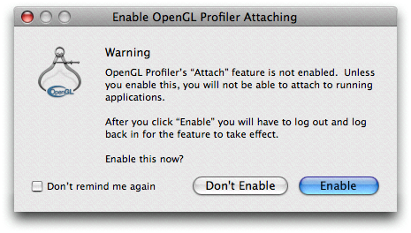

### The Main Window launch or attach

There are 2 ways to analyze an application, by attaching to a running instance or by launching within Profiler.

#### Launching an application with Profiler

The main window with  __Launch application__ selected as shown in Figure 2 is where you can drag and drop your application bundle, or you can press the __"+"__ button to add it in the open panel. Select the application name in the table, and press the __Launch__ button to start the application. Also, you can click on the Launch Arguments field and add any arguments needed for the application prior to launching it.

Once running you can start to see the instant and peak __Frame Rate__.

The default update time of 5 secs for the frame rate display can be changed in the Preferences as shown in OpenGL Profiler Preferences.

__Note:__ The frame rate field is updated by counting `CGLFlushDrawable` per unit of time, if your application is not double buffered this field might not display the correct information

__Figure 2__  Launching an application within Profiler.

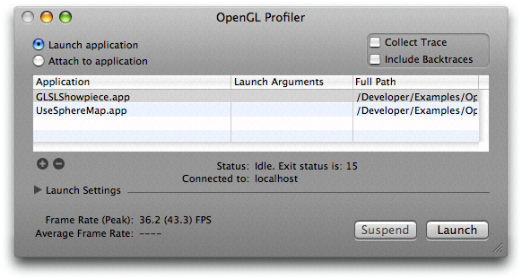

#### Attaching to a running application

There might be times when attaching to a running application is more convenient, and this can be done by selecting __Attach to application__ , choosing the appropriate process and the clicking the __Attach__ button as shown in Figure 3.

__Figure 3__  Attaching to a running application.

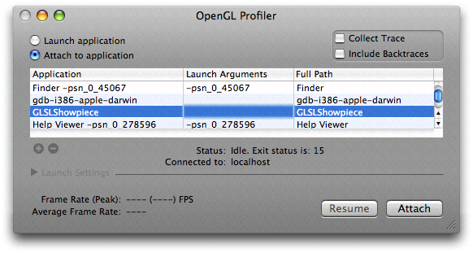

__Note:__ If an error as shown in Figure 4 is presented at this time, the most likely cause is that the environment variable `GL_ENABLE_DEBUG_ATTACH` is not set, or you have not logged out and logged back in after enabling the attach feature upon the very first launch of OpenGL Profiler. A similar message will be presented if trying to launch an application that is no longer at the provided path.

__Figure 4__  Launch or attach error

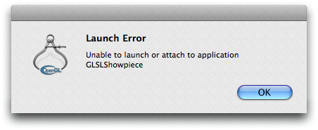

### Collecting an OpenGL call trace

Once you have launched or attached to an application, you can collect statistics and trace view of the OpenGL commands submitted by your application.

To collect an OpenGL trace simply select __Trace__ under the __Views__ menu or press __Command-Option-T__.

The trace view is very useful to analyze the sequence of operations as well as to identify redundant calls or state mishandling.

Figure 5 shows a trace window with Lines #'s, Contexts and Timing information selected.

__Figure 5__  Trace window.

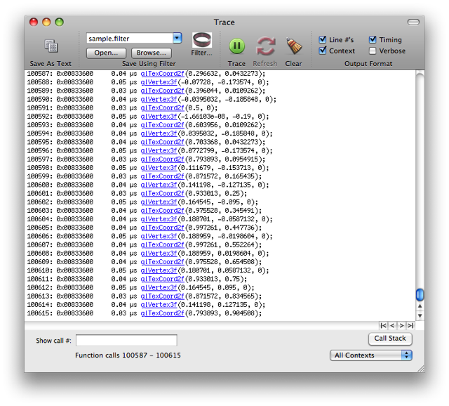

You can also collect backtraces by selecting __Include Backtraces__ on the Profiler's main window.

This will collect backtraces with function names, so you can see who is calling a particularly slow call by clicking on the function name as shown in Figure 6. You may right click on it and choose to view the original image in a new window or tab.

__Figure 6__  Trace view with call stack

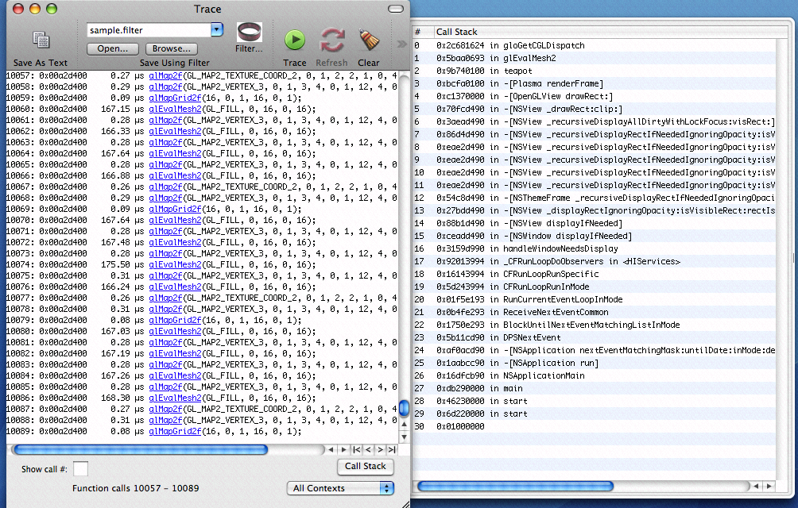

#### Saving a Trace to a text file

The call trace can be saved to a text file for post processing by clicking on __Save As Text__

Traces can be long and might take some time to finish saving a text file which can get really large.

With Line #'s, Context and Timing selected the generated text file looks like:

```
1: 0x00a2d400     0.18 µs glBegin(GL_QUADS); 2: 0x00a2d400     0.08 µs glTexCoord2f(0.025, 0.025); 3: 0x00a2d400     0.08 µs glNormal3f(0, 0, 1); 4: 0x00a2d400     1.19 µs glVertex3f(0, 0.03, 3.15); 5: 0x00a2d400     0.10 µs glVertex3f(0.03, 0, 3.15); 6: 0x00a2d400     0.10 µs glVertex3f(0, -0.03, 3.15); 7: 0x00a2d400     0.08 µs glVertex3f(-0.03, 0, 3.15); 8: 0x00a2d400     0.07 µs glNormal3f(0, 0, -1); 9: 0x00a2d400     0.10 µs glVertex3f(-0.03, 0, 0); 10: 0x00a2d400     0.08 µs glVertex3f(0, -0.03, 0); 11: 0x00a2d400     0.08 µs glVertex3f(0.03, 0, 0); 12: 0x00a2d400     0.09 µs glVertex3f(0, 0.03, 0);
```

For information on the __Save Using Filter__ see section Trace Filtering

__Note:__ Collecting traces and backtraces is a very heavy operation and it will slow down your rendering, so this feature is designed to analyze relatively small portions of an application.

### Collecting OpenGL call statistics

To collect statistics simply select __Statistics__ under the __Views__ menu or press __Command-Option-S__.

The window presents a table of information that can be reordered by clicking on the column heading.

The statistics view is great to see the estimated % of time spent in GL as a total, the percentages of time spent in GL per call and the percentage of App time that a particular call is taking as well as how many times a function is being called.

The "% App Time" field shows an estimate of how much time the application spends in a particular function. This is calculated by timing the each GL call and diving the cummulative results by the total application running time. Managing the timing of the GL calls might skew the numbers a few percentage points but the results are still representative. Shark might give you a more accurate number.

The "% GL Time" is an estimate based on the time a particular function takes in relation to the total time spent inside OpenGL.

Also the statistics can be scrolled in different time slices by using the __Show slice__ at the bottom of the window.

Figure 7 shows the statistics window sorted by the largest __Total Time__  spent in a function.

__Figure 7__  Statistics window

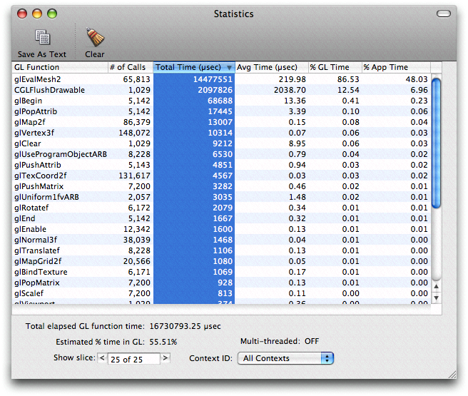

#### Saving statistics to a text file

In the same way you can save a call trace to a text file, you can do the same for the statistics, and the text file takes the form:

```
GL Function;# of Calls;Total Time (µsec);Avg Time (µsec);% GL Time;% App Time ...
```

### Checking the Pixel Format

Sometimes it is useful to examine the pixel format of a context and Profiler allows you to do just that in the __Pixel Format__  selection under the __Views__  menu or press __Command-Option-P__

If there are multiple contexts, the one in black is the current context.

Among other things, this is where you look to see if an OpenGL context is double buffered, antialiased, etc.

Figure 8 shows what the Pixel Format window looks like.

__Figure 8__  Pixel Format View

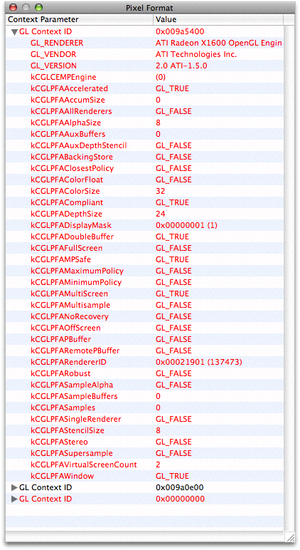

There is also a way to override the pixel format that an application asks for with a custom temporary pixel format and this is shown in Launching with a custom pixel format

### Setting breakpoints

One of the most powerful features of OpenGL Profiler is the ability to set breakpoints at which resources (textures, ...), GL state, scripts can be run, the multithreaded engine can be enabled, or even see if the current setup is going to run in the CPU or GPU,.

Profiler also allows you to control the execution (or bypass) at the OpenGL function level.

You can set breakpoints by selecting the __Breakpoints__  option of __Views__ menu or you can press __Command-Option-B__ .

Figure 9 shows the breakpoints window.

Breakpoints can be set before or after executing a particular call, at a GL error, VAR error, thread conflict, and software fallback.

To set a breakpoint at a particular call, click under __before__  or __after__  on the line of the particular function of interest. To quickly scroll to a particular GL call you can type the first few letters of the particular function your are interested in.

To set a breakpoint in any GL errors simply click on the __Break on Error__  button, similarly for __Break on VAR error__ , __Break on thread conflict__  and __Break on SW fallback__.

__Figure 9__  Breakpoint window.

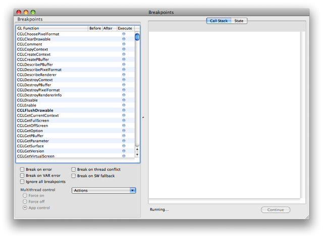

Once the application hits the breakpoint the call stack, context, `kCGLCPGPUFragmentProcessing` (fragment processing on the GPU), `kCGLCPGPUVertexProcessing` (vertex processing on the GPU) and `kCGLCPCurrentRendererID` (see /System/Library/Frameworks/OpenGL.framework/Headers/CGLRenderers.h) are presented.

In the event of a break for GL error, VAR error or thread conflict there is a useful status message at the bottom of the Call Stack view.

The __Actions__  pop up allows you set and reset all breakpoints. It also allows you to attach scripts to execute at a breakpoint. This feature is discussed at Attaching and running scripts at breakpoints.

Figure 10 shows an application stopped at `CGLFlushDrawable` with everything running on the GPU at that point.

__Figure 10__  Stopped at `CGLFlushDrawable`.

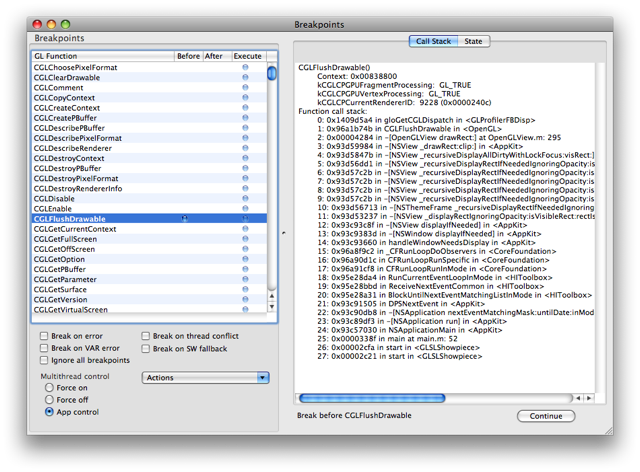

### Controlling execution

Execution of a particular call is done by the selection of __Execute__  on the line of that particular call. By default all OpenGL calls are set to execute. The __Actions__  pop up allows you to set or reset global execution.

If a call is set to not execute, it becomes a noop and the consequences of this vary greatly depending on many factors. This functionality should only be used when the code, traces, etc are understood.

Sometimes is necessary to set breakpoints but ignore them for a period of time, this can be achieved by enabling the __Ignore all breakpoints__  button.

To continue execution click on the __Continue__ button at the lower right hand corner of the __Breakpoints__  window.

### Inspecting OpenGL state

The current OpenGL state can be checked at breakpoints by clicking on the __State__  tab of the breakpoints window.

This is very useful when rendering anomalies are encountered, for state sorting ideas, etc.

Figure 11 shows the state right before a `CGLFlushDrawable`, the blue highlighted state is the state that has changed __From default state__ .

__Figure 11__  Highlighted changes from default GL state.

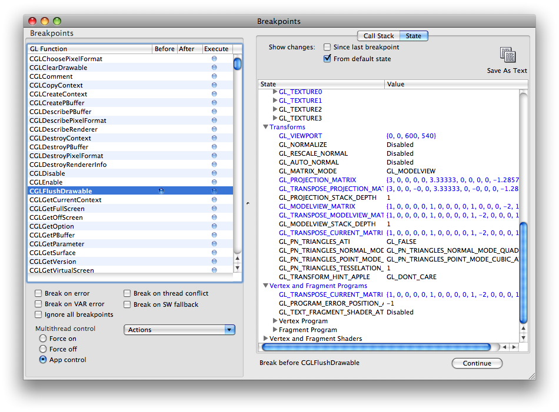

Although not pictured if __Since last breakpoint__ is selected the GL state changes would be highlighted in red. if both the options are selected GL state highlighted in purple signifies changes from default and since last breakpoint.

### Viewing Resources

While stopped at a breakpoint a variety of resources can then be examined.

The resource view can be opened by selecting __Resources__  from the __Views__ menu or you can press __Command-Option-R__.

#### Textures

The __Textures__ tab presents a list of textures objects sorted by their texture ID.

The ones highlighted in red are not loaded into Profiler yet, but a simple click on any of them should bring the texture out.

In this view, the textures can be examined, their target, internal format, source format, source type, and dimensions are shown.

The  __Mipmap Level__ slider at the bottom will let you select other mipmaps levels if defined, the  __Zoom Level__  slider allows to zoom in and out the texture in the view, the  __Source Blend Mode__  and  __Destination Blend Mode__ can be adjusted if necessary for proper viewing, the  __Background Color & Opacity__  picker will let you select the color and opacity of the background and the  __Flip Texture__  button will flip the texture vertically.

Figure 12 shows a texture resource view.

__Figure 12__  Examining the textures in the resource view

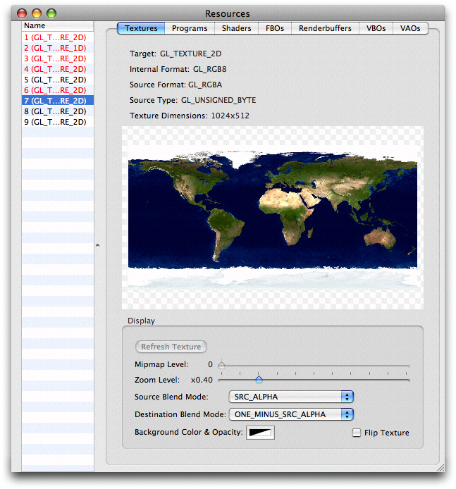

#### ARB Programs

ARB Programs can be examined in the  __Resources__  window under the  __Programs__  tab. As with any resource make sure the application is at a break point.

#### GLSL Shaders

OpenGL Profiler is very useful for examining and even editing shaders in your application. To get there make sure to stop at a breakpoint, open the  __Resources__  in the  __View__  menu if you haven't already and select the  __Shaders__  tab. Here Profiler presents a list of shader and program objects to inspect.

For editing or tweaking shaders in your application this way see the section Editing shaders.

Figure 13 shows what a program object might look like.

__Figure 13__  Program Object.

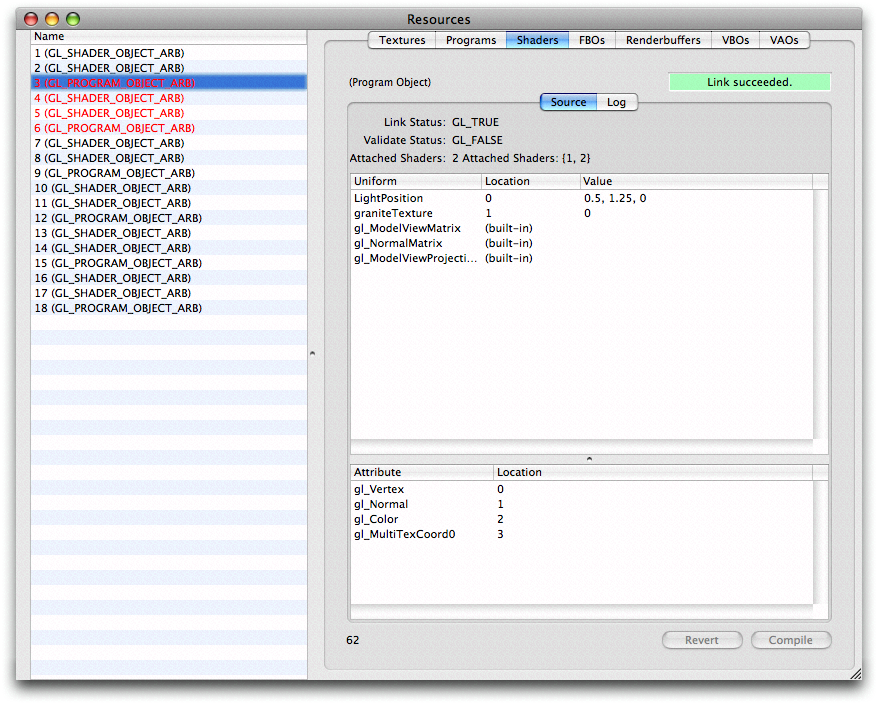

Figure 14 shows what a shader object with a vertex shader might look like.

__Figure 14__  Vertex Shader

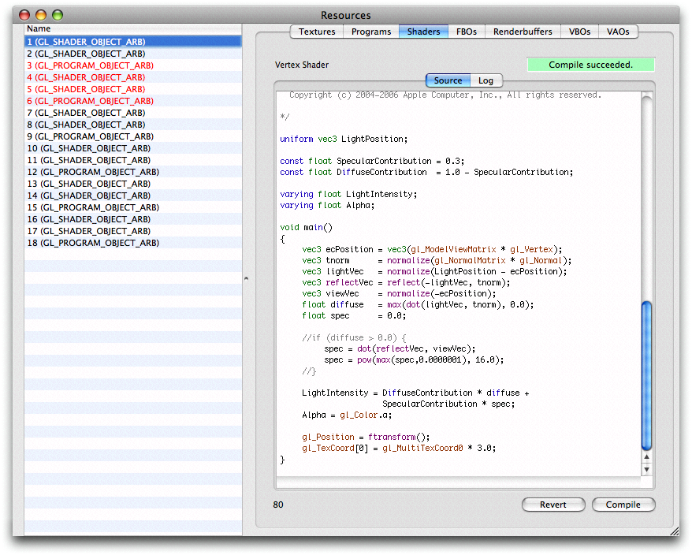

Figure 15 shows what a shader object with a fragment shader might look like.

__Figure 15__  Fragment Shader.

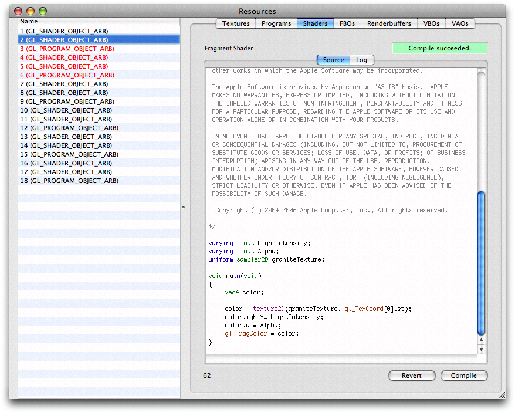

#### FBOs

Framebuffer Objects can be examined in the  __Resources__  window under the  __FBOs__  tab. As with any resource make sure the application is at a break point. Here Profiler presents a list of the FBOs it knows about.

Here you can identify the color, depth, and stencil attachments of an FBO and use the  __Texture__  or  __Renderbuffers__  tabs to inspect their contents.

Figure 16 shows the structure and attachments of the FBO.

__Figure 16__  FBO structure in the resource view

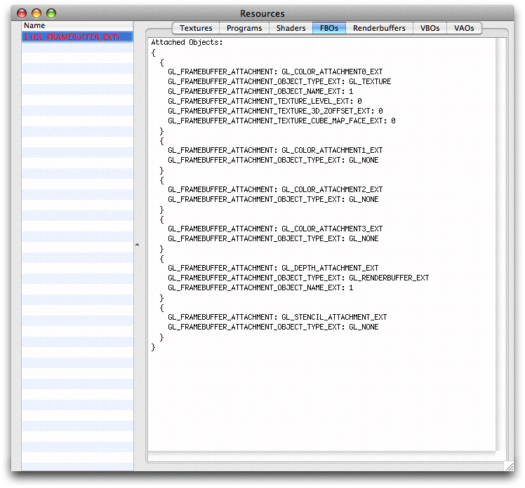

#### Renderbuffers

Renderbuffers can be examined in the  __Resources__  window under the  __Renderbuffers__  tab. As with any resource make sure the application is at a break point.

The functionality here is very similar to the Texture tab as described above. There are adjustments for zoom, source and destination blend, background color and opacity, and the ability to vertically flip the image.

Figure 17 shows the contents of a Renderbuffer.

__Figure 17__  Renderbuffer in the resource view.

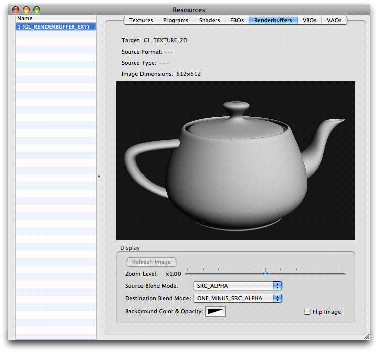

#### VBOs

Vertex Buffer Objects can be examined in the  __Resources__  window under the  __VBOs__  tab. As with any resource make sure the application is at a break point.

Profiler shows you the properties associated with a VBO.

Figure 18 shows the contents of a Renderbuffer.

__Figure 18__  Vertex Buffer Object view

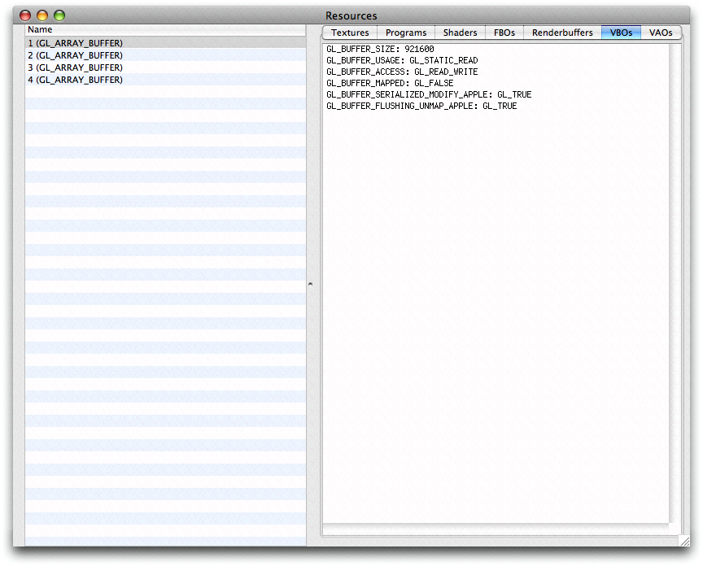

#### VAOs

Vertex Array Objects can be examined in the  __Resources__  window under the  __VAOs__  tab. As with any resource make sure the application is at a break point.

### Buffer Views

Under the view menu, several buffers can be examined when stopped at a breakpoint. Below are some screen captures from a particle shader in the GLSLShowpiece example.

#### Back bufffer

__Figure 19__  Current back buffer

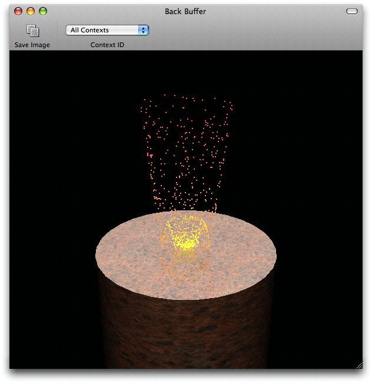

#### Depth buffer

__Figure 20__  Initial depth buffer view

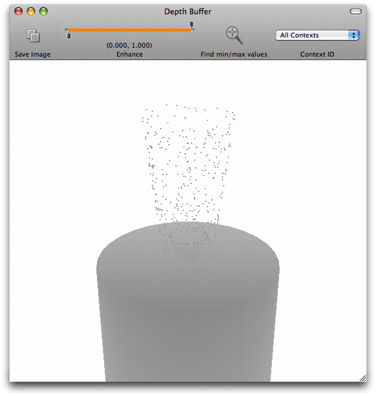

__Figure 21__  Depth buffer view with max and min range

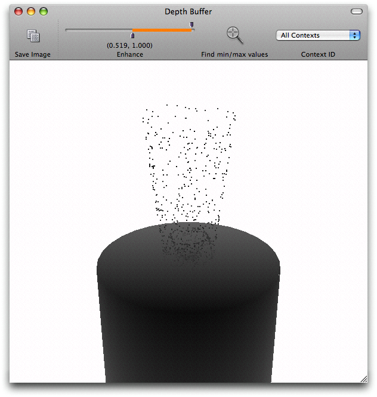

#### Alpha buffer

__Figure 22__  Alpha buffer

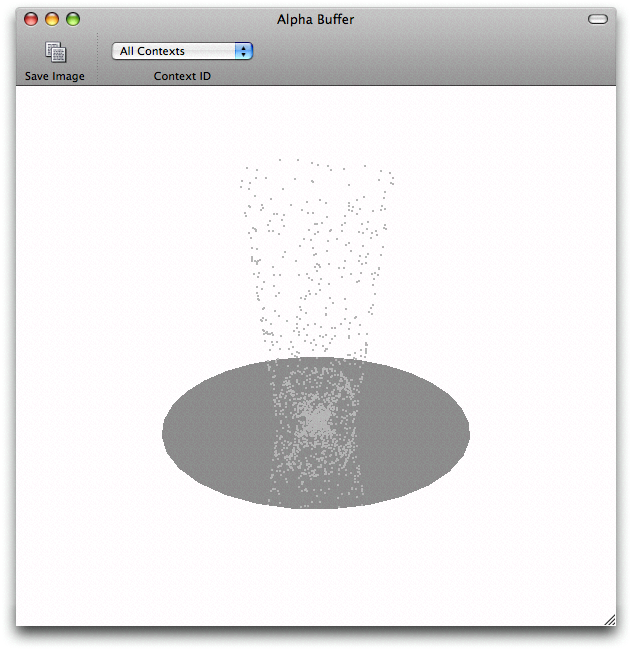

#### Stencil buffer

__Figure 23__  Stencil buffer

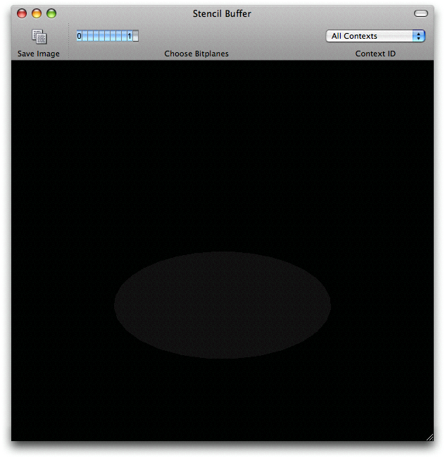[Back to Top](#)

## Real World Techniques

### Checking the Application for Errors

OpenGL Profiler can help to quickly check an application for errors by setting breakpoints of GL errors, thread errors, etc.

- On the breakpoint window, set the appropriate breakpoint for GL errors
- Launch or attach to the application if you have not done so
- Monitor the breakpoint window to see if catches an error

Figure 24 shows Profiler catching an error.

__Figure 24__  Break on error

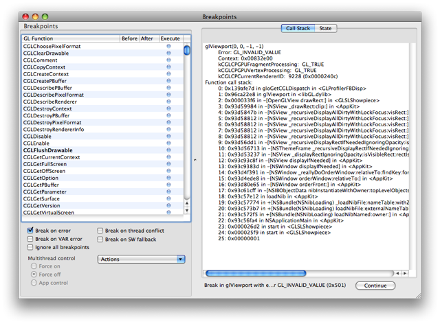

### Checking GPU or CPU execution of current state

The easiest way to check in OpenGL Profiler if the application is indeed executing on the GPU is to let Profiler break on software fallbacks.

- On the breakpoint window, check the SW fallback option
- Launch or attach to the application if you have not done so
- Monitor the breakpoint window to see if catches a software callback

Figure 25 shows Profiler catching a software callback. Note that `kCGLCPGPUFragmentProcessing` and `kCGLCPGPUVertexProcessing` are both GL_FALSE at the point, indicating that fragment processing and vertex processing are currently handled by a software recovery mechanism. The value of `kCGLCPCurrentRendererID` also becomes distinct.

__Figure 25__  Break on software fallback

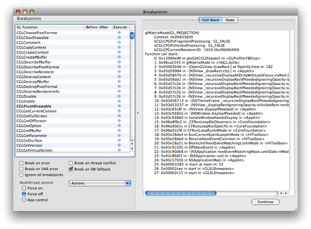

### Collecting Trace and Statistics for a single frame

Collecting the trace and statistics of a single frame can give you a quick (if somewhat narrow) view of what the application is doing.

- Launch or attach to the application of interest
- Navigate the application to the suspect area
- Set a breakpoint in `CGLFlushDrawable` for double buffered contexts or glFlush for single buffered ones
- Once stopped, open (or clear) the trace and statistics windows
- Press Continue once at the bottom of the breakpoints window

Here are a few things to consider in the trace:

Do you see any duplicate or redundant calls?

On this single frame look for state management, can it be improved by state sorting?

Do you see any single call taking significantly more time than the others?

Is the frame not done rendering? Maybe more than one `CGLFlushDrawable` / glFlush are being sent per frame.

### Enabling Multithreaded execution of the OpenGL Framework

Some applications might benefit from enabling multithreaded execution of the OpenGL Framework.

OpenGL Profiler allows you to test this option without any coding.

- Launch or attach to the application of interest
- Note the frame rate at somewhat repeatable point
- Set any breakpoint. `CGLFlushDrawable` is common for double buffered contexts.
- Once stopped select  __Force on__  in the  __Multi-thread control__
- Clear the breakpoint and
- Press Continue once at the bottom of the breakpoints window
- Note the frame rate under multi-threaded execution

__Note:__ Not all applications will benefit. See [Enabling multi-threaded execution of the OpenGL framework](https://developer.apple.com/technotes/tn2006/tn2085.html)

### Monitoring VRAM with Driver Monitor

Although a separate application from OpenGL Profiler, OpenGL Driver Monitor is another key tool when debugging and optimizing OpenGL applications.

There is a performance cliff when VRAM becomes full, so knowing how your application uses VRAM is essential.

- In OpenGL Profiler select __Driver Monitor__ under the __View__ menu to start OpenGL Driver Monitor
- In OpenGL Driver Monitor select the appropriate driver. Usually this is accomplised by pressing Cmd-1 on machines with a single graphics card or you can select it under __Driver Monitors__ in the __Monitors__ menu
- On the driver monitor window click __Parameters__ and double click on __Current Free Video Memory__

__Page Offs__  and __Page Ons__ of textures and surfaces are others you might want to monitor in relation to VRAM.

### Editing shaders

With Mac OS X Leopard, OpenGL Profiler provides the ability to modify shaders on the fly.

- Launch or attach to the application of interest
- Set a breakpoint and wait for the application to stop
- Open the __Resources View__ and select the __Shaders__ tab
- Select the desired shader object on the left. See Figure 14
- Edit the shader in the __Source__ tab and press __Compile__
- If compilation failed you can use the __Log__ tab. You can use the __Revert__ button to return to the original code and then hit __Compile__ again
- if the compilation was succesful then release the breakpoint and hit __Continue__ on the  __breakpoints__ view

### Disabling OpenGL Execution

Under some circumstances you might want to disable procession of OpenGL functions. This is possible within Profiler by selecting __Execute none__ under __Actions__ in the __Breakpoints__ view. To restore execution select __Execute all__

### Attaching and running scripts at breakpoints

OpenGL Profiler allows you to insert (at a performance cost) small amounts of GL code or __Scripts__ to be executed while stopped at a breakpoint.

First you must create the script. Open the __Scripts__ view and click on the "+" button. This generates an empty script that you can rename. On right side you can edit the contents of the script as shown in Figure 26 .

__Figure 26__  The scripts view

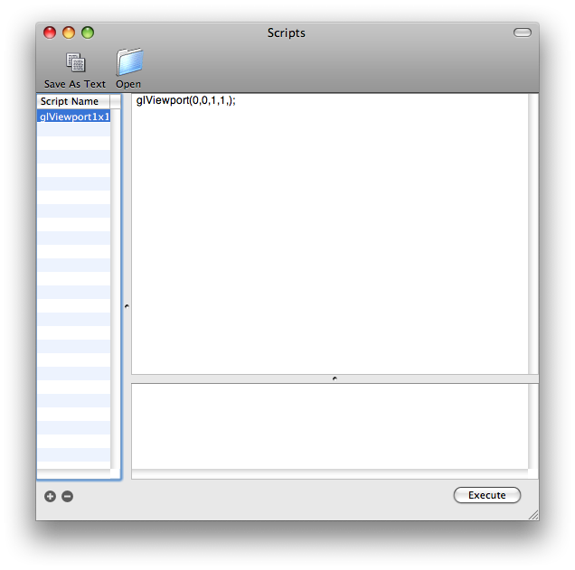

Once created this script can be executed manually while stopped in a breakpoint. To automatically execute the script, attach it to a breakpoint by selecting __Attach Script...__ under the __Actions__ in the __Breakpoints view__. You can choose to execute the script before or after the break, and continue automatically or not after the execution, as shown in Figure 27.

__Figure 27__  Attaching a script to a breakpoint.

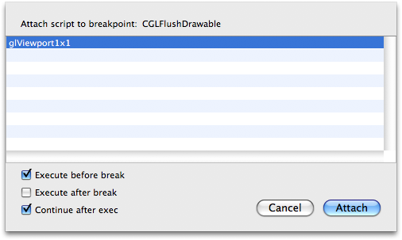

__Note:__ Keep in mind that running scripts automatically in a call that is used repeatedly is not a good way to measure performance differences since the execution and continue is a very expensive operation.

### Trace Filtering

OpenGL Profiler allows you to create a custom filter that takes stdin and put something to stdout to save your trace.

A possible example might be finding a the slowest calls. Consider the simple shell script at Listing 1 and the image at Figure 28.

The script will generate a sorted (increasingly slower) output of the trace once you click the __Filter__ button. Then you could use the line number of the output to trace back to the surroundings where the call actually took place. This will help in figuring out what particular frames might be slowing down your scene.

__Listing 1__  sortedByTime.sh.

```
#!/bin/tcsh -f  awk '{ print $3" "$0 }' | sort -n
```

__Figure 28__  Using sortedByTime.sh

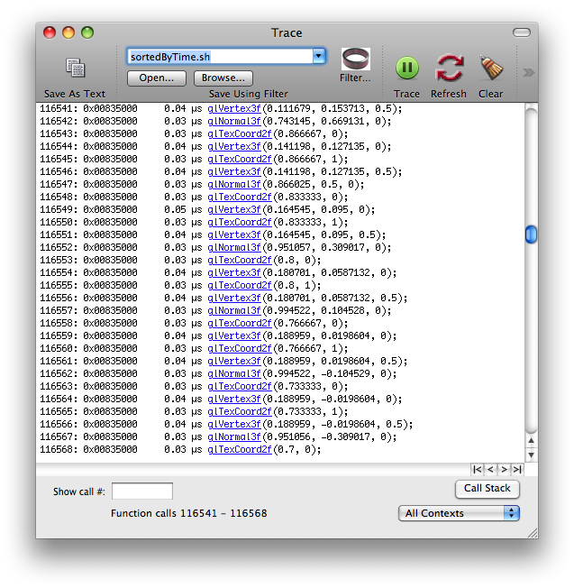

### Launching with a custom pixel format

OpenGL Profiler allows you to __Launch__ an application with a custom pixel format. By selecting the __Launch Settings__ in the main window as shown in Figure 29

Among other things, this allows you to try different antialising settings and quickly seeing the results without modifying the source code of the application.

__Figure 29__  Custom Pixel format.

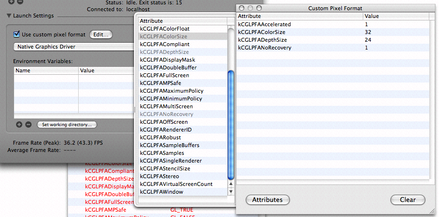[Back to Top](#)

## Programatic control of OpenGL Profiler

OpenGL Profiler also provides some programmatic control..

### Controlling breakpoints

This is a very powerful feature that allows your application to set and clear breakpoints when attached to OpenGL Profiler.

You can set a breakpoint by making an array with 3 GLints:

- Parameter 0: function ID (see CGLProfilerFunctionEnum.h)
- Parameter 1: the logical OR of kCGLProfBreakBefore or kCGLProfBreakAfter, indicating how you want the breakpoint to stop: before entering OpenGL, on return from OpenGL, or both
- Parameter 2: is used like a boolean which turns the breakpoint on or off

and then passing this array to `CGLSetOption`().

Listing 2 shows how to programmatically set a breakpoint at `CGLFlushDrawable`.

__Listing 2__  Setting a breakpoint at `CGLFlushDrawable`.

```c
#include "OpenGL/CGLProfiler.h" #include "OpenGL/CGLProfilerFunctionEnum.h" ...    GLint myBreakpoint[] = { kCGLFECGLFlushDrawable, kCGLProfBreakBefore, 1;}    CGLSetOption( kCGLGOEnableBreakpoint, myBreakpoint ); ...
```

### Inserting comments in the Trace view

Comments can be printed out in the Trace window using the technique illustrated in Listing 3

__Listing 3__  Inserting comments in the trace.

```c
#include <OpenGL/CGLProfiler.h> ...     CGLSetOption(kCGLGOComment, (long) "***** My Comment is here *****"); ...
```

The resulting comment looks like this in the trace:

```
21561: 0.00 µs /* ***** My Comment is here ***** */
```

### Controlling the trace logging

You application can also control when to start/stop the trace logging as shown in Listing 4

This gives you fine grain control over what traces to collect in a specific section or time for example.

__Listing 4__  Pass GL_TRUE to start and GL_FALSE to stop tracing.

```c
#include <OpenGL/CGLProfiler.h> ...     CGLSetOption(kCGLGOEnableFunctionTrace, GL_TRUE); ...
```

__Listing 5__  Clearing the trace window.

```c
#include <OpenGL/CGLProfiler.h> ...     CGLSetOption(kCGLGOResetFunctionTrace, NULL); ...
```

### Controlling the collection of statistics

You application can also control when to start/stop the collection of statistics as shown in Listing 6.

Make sure to open the statistics window first.

__Listing 6__  Controlling the statistics.

```c
#include <OpenGL/CGLProfiler.h> ...     // To start     CGLSetOption(kCGLGOResetFunctionStatistics, NULL); // if you want to reset counters to zero     CGLSetOption(kCGLGOEnableFunctionStatistics, GL_TRUE); ...     // To stop the counters     CGLSetOption(kCGLGOEnableFunctionStatistics, GL_FALSE); ...
```

[Back to Top](#)

## OpenGL Profiler Preferences

__Figure 30__  Preferences window

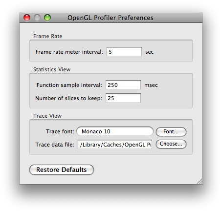[Back to Top](#)

---

#### Document Revision History

| __Date__ | __Notes__ |
| 2008-09-16 | New document that this document describes how to use OpenGL Profiler, a very powerful tool for your OpenGL development. |

