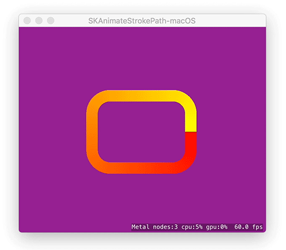
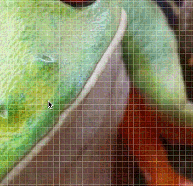
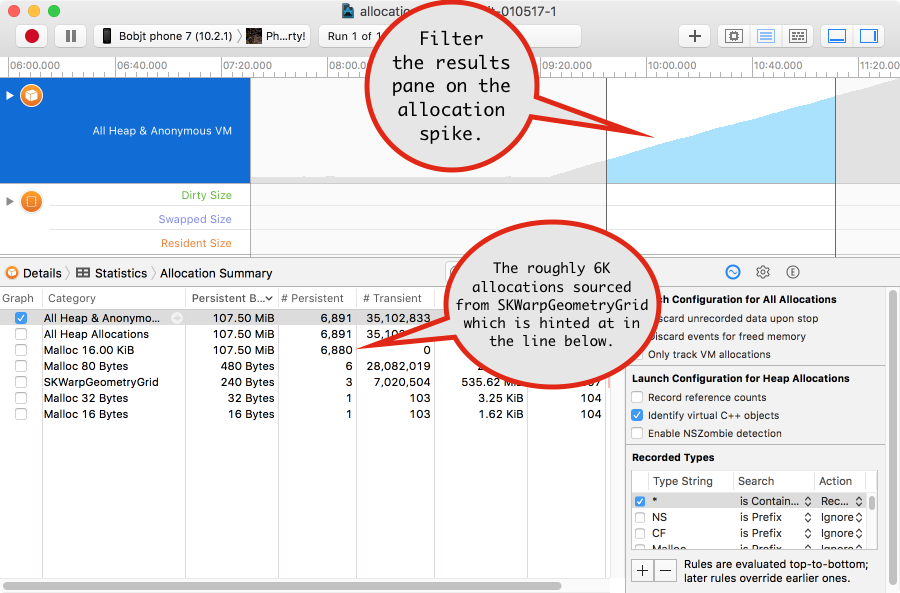
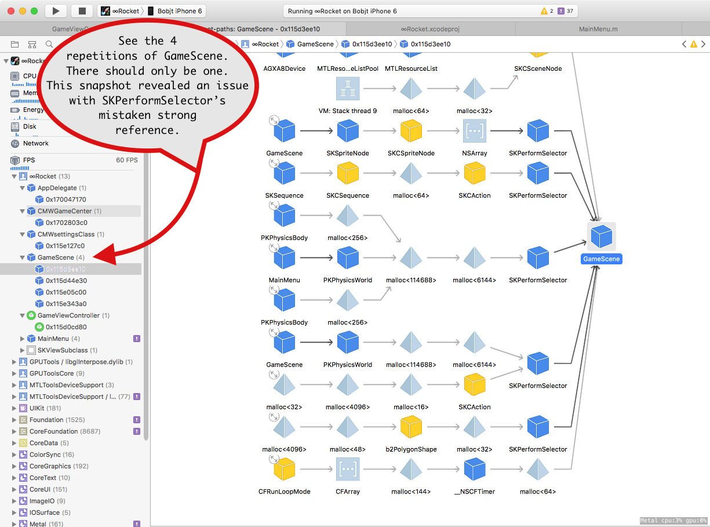
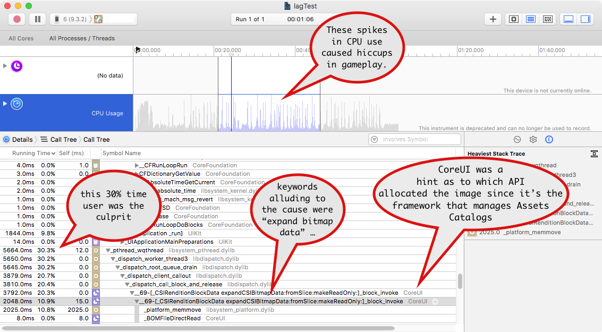

> 导航：[总目录](../../README.md) · [technotes](../../_indexes/technotes.md)


Technical Note TN2451

# SpriteKit Debugging Guide

Common SpriteKit issues and general debugging tips for SpriteKit app developers.

[Introduction](#apple-f4xwc4dqnrsv64tfmyxwi33df52wszbpirkfgnbqgaytonrqhewugsbrfveu4vcsj5cfkq2ujfhu4)[Common Issues](#apple-f4xwc4dqnrsv64tfmyxwi33df52wszbpirkfgnbqgaytonrqhewugsbrfvbu6tknj5hesu2tkvcvg)[Use SpriteKit objects within the ordained callbacks](#apple-f4xwc4dqnrsv64tfmyxwi33df52wszbpirkfgnbqgaytonrqhewugsbrfvhvercbjfhekrcdifgeyqsbinfvg)[How to animate the stroking of a path](#apple-f4xwc4dqnrsv64tfmyxwi33df52wszbpirkfgnbqgaytonrqhewugsbrfvjviuspjncvgscbircve)[Zooming nodes about an arbitrary screen point](#apple-f4xwc4dqnrsv64tfmyxwi33df52wszbpirkfgnbqgaytonrqhewugsbrfvbu6tknj5hesu2tkvcvglk2j5hu2skoi5pu4t2eivjv6qkcj5kvix2bjzpucuscjfkfeqkslfpvgq2sivcu4x2qj5eu4va)[SKShader limitations](#apple-f4xwc4dqnrsv64tfmyxwi33df52wszbpirkfgnbqgaytonrqhewugsbrfvbu6tknj5hesu2tkvcvglktjnjuqqkeivjf6tcjjveviqkujfhu4uy)[Debugging Tips](#apple-f4xwc4dqnrsv64tfmyxwi33df52wszbpirkfgnbqgaytonrqhewugsbrfvcekqsvi5dustshkrevauy)[Choosing the renderer](#apple-f4xwc4dqnrsv64tfmyxwi33df52wszbpirkfgnbqgaytonrqhewugsbrfvcekqsvi5dustshkrevauzninee6t2tjfheox2ujbcv6usfjzcekusfki)[Debugging SpriteKit memory problems](#apple-f4xwc4dqnrsv64tfmyxwi33df52wszbpirkfgnbqgaytonrqhewugsbrfvjvausjkrcuwskujvcu2t2sle)[Debugging SpriteKit performance issues](#apple-f4xwc4dqnrsv64tfmyxwi33df52wszbpirkfgnbqgaytonrqhewugsbrfvcekqsvi5dustshkrevauznircuevkhi5eu4r27knifeskuivfusvc7kbcverspkjguctsdivpusu2tkvcvg)[Enable shader compilation failure logging](#apple-f4xwc4dqnrsv64tfmyxwi33df52wszbpirkfgnbqgaytonrqhewugsbrfvjuqqkeivjegt2nkbeuyqkujfhu4)[Create a focused sample](#apple-f4xwc4dqnrsv64tfmyxwi33df52wszbpirkfgnbqgaytonrqhewugsbrfvcekqsvi5dustshkrevauzninjekqkuivpucx2gj5bvku2firpvgqknkbgek)[Document Revision History](#apple-f4xwc4dqnrsv64tfmyxwi33df52wszbpirkfgnbqgaytonrqhewvezlwnfzws33ojbuxg5dpoj4s2rdpnz2ey2lonncwyzlnmvxhiskel4yq)

## Introduction

This document is a SpriteKit troubleshooting guide that supplements the SpriteKit framework references located within the Developer Library. See the SpriteKit [developer splash page](https://developer.apple.com/spritekit/) for the complete suite of SpriteKit documentation. When troubleshooting an issue, start there first to ensure you're using the APIs properly.

This guide provides additional troubleshooting information that applies to SpriteKit as a whole and also covers individual problems that SpriteKit developers have encountered in the [Common Issues](#apple-f4xwc4dqnrsv64tfmyxwi33df52wszbpirkfgnbqgaytonrqhewugsbrfvbu6tknj5hesu2tkvcvg) and [Debugging Tips](#apple-f4xwc4dqnrsv64tfmyxwi33df52wszbpirkfgnbqgaytonrqhewugsbrfvcekqsvi5dustshkrevauy) sections.

[Back to Top](#)

## Common Issues

The following are a list of topics and issues SpriteKit game developers frequently discuss along with known solutions. If a specific problem is not listed here, continue to the [Debugging Tips](#apple-f4xwc4dqnrsv64tfmyxwi33df52wszbpirkfgnbqgaytonrqhewugsbrfvcekqsvi5dustshkrevauy) section for general strategies to troubleshoot SpriteKit issues.

### Use SpriteKit objects within the ordained callbacks

SpriteKit is largely a single threaded game engine and as such the API provides developers with callbacks to implement your custom game logic. The primary callback for your game logic is `update( _ : )`. Other examples are `didMoveToView()` and `didSimulatePhysics()`. Modifying SpriteKit objects outside of the ordained callbacks (a background queue or anything else non-main-thread) can result in concurrency related problems. Even dispatching work on the main thread asynchronously or at a later time is risky because the closure is likely to be done outside of the timeframe SpriteKit expects. If you're experiencing a segmentation fault or other type of crash occurring deep within the SpriteKit framework, there's a good chance your code is modifying a SpriteKit object outside of the normal callbacks.

__Tips:__

1. Use `DispatchQueue.async` and `asyncAfter` to set flags and do not interact with SpriteKit objects (e.g., SKTexture, SKNode, SKShader, etc.). Check flags within your scene's update callback to operate on SpriteKit objects at that time.
2. See the __SKScene API reference__ > [Figure 3 - Frame processing in a scene](https://developer.apple.com/reference/spritekit/skscene) for the complete list of callbacks.

### How to animate the stroking of a path

SKShapeNode's path can be animated by supplying a custom `strokeShader` that outputs based on a few [SKShader properties](https://developer.apple.com/reference/spritekit/skshader), `v_path_distance` and `u_path_length`. Note that within the shader supplied below, `u_current_percentage` is added by us and refers to the current point within the path we want stroked up to. By that, the scene determines the pace of the animated stroking. Also note since strokeShader is a fragment shader, it outputs an RGB at every step which allows the stroke to be a gradient color if desired, which is demonstrated by the use of  `u_color_start` and  `u_color_end`.

The shader is defined in a text file named "gradientStroke.fsh" added to the Xcode project:

```
void main()
{

    if(u_path_length == 0.0) {
        // error as u_path_length should never be zero, draw magenta
        gl_FragColor = vec4(1.0, 0.0, 1.0, 1.0);

    }
    else if(v_path_distance / u_path_length <= u_current_percentage) {
        float c = v_path_distance / u_path_length;
        float v = 1.0 - c;
        vec4 l = u_color_start;
        vec4 r = u_color_end;

        gl_FragColor = vec4(clamp( l.r*v + r.r*c, 0.0, 1.0),
                             clamp(l.g*v + r.g*c, 0.0, 1.0),
                             clamp(l.b*v + r.b*c, 0.0, 1.0),
                             clamp(l.a*v + r.a*c, 0.0, 1.0));
    }
    else {
        gl_FragColor = vec4(0.0, 0.0, 0.0, 0.0);
    }
}
```

Sample SKScene subclass using the stroke shader:

```swift
import SpriteKit
import GameplayKit

class GameScene: SKScene {

    var strokeShader: SKShader!
    var strokeLengthUniform: SKUniform!

    // define the start and end colors here
    var startColorUniform = SKUniform(name: "u_color_start",
            vectorFloat4: vector_float4([1.0, 1.0, 0.0, 1.0]))

    var endColorUniform = SKUniform(name: "u_color_end",
            vectorFloat4: vector_float4([1.0, 0.0, 0.0, 1.0]))

    var _strokeLengthFloat: Float = 0.0
    var strokeLengthKey: String!
    var strokeLengthFloat: Float {
        get {
            return _strokeLengthFloat
        }
        set(newStrokeLengthFloat) {
            _strokeLengthFloat = newStrokeLengthFloat
            strokeLengthUniform.floatValue = newStrokeLengthFloat
        }
    }

    override func didMove(to view: SKView) {

        // percentage is the only variable uniform since start and end color don't change
        strokeLengthUniform = SKUniform(name: "u_current_percentage", float: 0.0)

        // pass all uniforms to the shader
        strokeShader = SKShader(fileNamed: "gradientStroke.fsh")
        strokeShader.uniforms = [strokeLengthUniform, startColorUniform, endColorUniform]
        strokeLengthFloat = 0.0

        let cameraNode = SKCameraNode()
        self.camera = cameraNode
        let path = CGMutablePath()
        path.addRoundedRect(in: CGRect(x: 0, y: 0, width: 200, height: 150),
                cornerWidth: 35,
                cornerHeight: 35,
                transform: CGAffineTransform.identity)

        let shapeNode = SKShapeNode(path: path)
        shapeNode.lineWidth = 17.0
        addChild(shapeNode)
        shapeNode.addChild(cameraNode)
        shapeNode.strokeShader = strokeShader

        // center camera over the rounded rectangle
        let rect = shapeNode.calculateAccumulatedFrame()
        cameraNode.position = CGPoint(x: rect.size.width/2.0, y: rect.size.height/2.0)

    }

    override func update(_ currentTime: TimeInterval) {

        // The amount incremented determines the pace of the animation.
        strokeLengthFloat += 0.01
        if strokeLengthFloat > 1.0 {
            strokeLengthFloat = 0.0
        }
    }
}
```

__Figure 1__  The animating path.



### Zooming nodes about an arbitrary screen point

Zooming a node on a particular screen point can be challenging in SpriteKit. An intuitive thought is to use anchorPoint and scale to do so, however, a few caveats make it challenging:

1. Changing a node's scale does not change its size (therefore, nor does it change its underlying coordinate system). That can be an unintuitive fact and it complicates point conversion by requiring you to factor out the scale yourself.
2. Not every SKNode derivative has an anchorPoint on which `scale` sizes about, and for those that do, adjusting the anchorPoint changes its visual location in the scene. This can be an unintuitive fact and it complicates the use of anchorPoint for zooming because it requires the unintended translation to be undone.

A simple alternative approach is to use position and size instead. The following code snippets demonstrate zooming in and out around the mouse pointer.

1. __Convert screen coordinates of the mouse to coordinates of the node and create a custom anchor point:__

   ```swift
   class GameScene: SKScene {
   ...
       func setAnchorPointBasedOnMousePosition() {
           // get mouse location of the previous-most mouseMoved event
           let locationInScene = mouseEvent.location(in: self)

           // convert its screen location to its location within the frogSprite
           var locationInFrogSprite = convert(locationInScene, to: frogSprite)

           // bounds check to ensure the custom anchor point does not lie outside the frogSprite.
           locationInFrogSprite.x = clamp(locationInFrogSprite.x, 0.0, frogSprite.size.width)
           locationInFrogSprite.y = clamp(locationInFrogSprite.y, 0.0, fromSprite.size.height)

           // create a percentage-based anchor point (values between 0..1)
           tempAnchorPoint = CGPoint(x: locationInFrogSprite.x / frogSprite.size.width,
                   y: locationInFrogSprite.y / frogSprite.size.height)
       }
       func clamp<T: Comparable>(_ value: T, _ lower: T, _ upper: T) -> T {
           return min( max(value, lower), upper)
       }
   ```
2. __Set the new zoom scale and do so about the custom anchor point:__

   ```
    var zoomScale: CGFloat {
           get {
               return _zoomScale
           }
           set(newZoomScale) {
               _zoomScale = newZoomScale
               let newSize = CGSize(width: frogSpriteInitialSize.width * _zoomScale,
                       height: frogSpriteInitialSize.height * _zoomScale)

               let oldSize = frogSprite.size
               let sizeDiff = CGSize(width: oldSize.width - newSize.width,
                       height: oldSize.height - newSize.height)

               // updating size instead of scale changes its coordinate system which helps point conversion on subsequent zooms
               frogSprite.size = newSize

               // the position changes on zoom. Use the custom anchor point made above
               frogSprite.position.x += sizeDiff.width * tempAnchorPoint.x
               frogSprite.position.y += sizeDiff.height * tempAnchorPoint.y
           }
       }
   ```
3. Finally, to zoom, call both methods in succession:

   ```swift
    func zoom(_ factor: CGFloat) {
           setAnchorPointBasedOnMousePosition()
           zoomScale *= factor // calls the zoomScale setter above
       }
   ```

__Figure 2__ - zooming nodes with the above code using mouse location as the anchor point.



### SKShader limitations

The following are known limitations of SKShader in addition to debugging tips.

__Limitations of SKShader__

- Custom shader code supplied to SKShader must be written in the OpenGL ES 2.0 shading language (also known as __GLSL ES__ or __ESSL__). Metal shading language is not supported. See the [SKShader](https://developer.apple.com/reference/spritekit/skshader) API reference for more information. The ESSL specification is maintained by the Khronos Group, and is linked [here](https://www.khronos.org/files/opengles_shading_language.pdf) for your reference when writing shaders for use with SKShader.
- GL extension checking within shader code supplied to SKShader is not supported.
- SKShader compilation failure logging is off when using the convenience initializer. See [Enable shader compilation failure logging](#apple-f4xwc4dqnrsv64tfmyxwi33df52wszbpirkfgnbqgaytonrqhewugsbrfvjuqqkeivjegt2nkbeuyqkujfhu4) for steps to turn it on.
[Back to Top](#)

## Debugging Tips

The following list of topics are helpful in troubleshooting general SpriteKit development issues.

### Choosing the renderer

Originally, SpriteKit was implemented in OpenGL and then moved to Metal in iOS 9 & OS X 10.11. It's important to be mindful of this for debugging purposes because some issues exhibit in one renderer but not the other. If you're experiencing what you believe to be a SpriteKit bug, switch the renderer and check for different results. While one renderer might offer a temporary workaround, you must [file a bug report](https://developer.apple.com/bug-reporting/) for renderer differences so the real underlying issue can be assessed for a fix.

- To choose the renderer, see:

  __QA1904__ - [Specifying the renderer for SpriteKit and SceneKit](https://developer.apple.com/library/content/qa/qa1904/_index.html)

  __Important:__ SpriteKit uses Metal by default but only on devices that support Metal. Metal is supported on Macs introduced in 2012 and later and on iOS devices equipped with A7 processor or higher: iPhone 5S, iPad Air, iPad Mini with Retina Display, iPhone 6, iPhone 6 Plus, and later devices.
- To confirm which renderer is active, use the code:

  ```
  let defaults = UserDefaults.standard
  var dict = [String:Any]()
  dict["debugDrawStats_SKContextType"] = true
  defaults.set( dict, forKey: "SKDefaults" )
  ```

  This will print "Metal" or "OpenGL" in the bottom corner of the SKView depending on which renderer is active.

### Debugging SpriteKit memory problems

Problems with ever-increasing memory are not isolated to SpriteKit games but this section speaks to a few instances that commonly arise.

#### Tab-based SpriteKit apps and SKScene caching

Apps that show SpriteKit scenes in a tab format can fill up memory quickly if prior scenes are not released while changing from one tab to another. For more imformation, see __QA1889__ - [Tab-based SpriteKit Apps and Scene Caching](https://developer.apple.com/library/content/qa/qa1889/_index.html).

#### General memory problems

The following list are general techniques to troubleshoot memory issues and their example use with SpriteKit games.

1. Use the Allocations instrument to troubleshoot memory allocation anomalies like runaway memory use. See __TN2434__ - [Minimizing your app's Memory Footprint](https://developer.apple.com/library/content/technotes/tn2434/_index.html) for a complete walkthrough. An example scenario of how the Allocations instrument was used to resolve a SpriteKit memory issue is depicted in Figure 3.

   __Figure 3__ - the Allocations instrument lead straight to an app coding problem in which a SpriteKit game occasionally entered in infinite loop that created SKWarpGeometryGrids.

   
2. Use Xcode's memory graph tool to check why certain objects are still in memory and their number of repetitions. This tool was added to Xcode 8 and introduced in WWDC '16 __session 410__ - [Visual Debugging with Xcode](https://developer.apple.com/videos/play/wwdc2016/410/). An example scenario of how Xcode's memory graph was used to resolve a SpriteKit memory issue is depicted in Figure 4.

   __Figure 4__ - Xcode's memory graph revealed the culprit of unreleased scenes in one app was due to a bug in SKPerformSelector. Its mistaken strong reference created a retain cycle with its owner, GameScene. While the bug was being fixed, the memory incline was worked around by temporarily omitting the use of `SKAction`'s `performSelector`.

   

   __Tip:__ use the left-sidebar to find objects by class name and select it to display its retains in the center pane.

### Debugging SpriteKit performance issues

This section covers tips to debug performance issues in SpriteKit games.

#### Use Time Profiler to track down gameplay hiccups

- The [Time Profiler](https://developer.apple.com/library/content/documentation/DeveloperTools/Conceptual/InstrumentsUserGuide/Instrument-TimeProfiler.html) instrument shows which APIs are spending the most time. An example scenario of how Time Profiler was used to solve a SpriteKit performance issue is depicted in Figure 5.

  __Figure 5__ - this Time Profiler run revealed that a noticeable hiccup in gameplay was due to the decoding on an image from disk on-the-fly. This is known to be an expensive operation. The hint the image was from an Assets Catalog led to the app's use of `SKSpriteNode( imageNamed: )`. Because sprite images were being reused, the problem was solved by allocating an SKTexture one time at the start of the scene and sharing it throughout gameplay by allocating sprites with `SKSpriteNode( texture:, color:, size: )` instead.

  

  By default, Time Profiler sorts its results descending by largest time using APIs. The coding optimization made here was the second largest time user on the list (the first was SpriteKit's rendering) so we didn't have to look far to find the problem.

### Enable shader compilation failure logging

If an SKShader is not working and you're unsure why, check for compilation errors in Xcode's console. Note that error handling is encapsulated when using SKShader's convenience initializer `init( fileNamed: )` (see the signature comments in SKShader.h). To enable compilation failure logging, use `SKShader( source:, uniforms: )` instead. Here's an example:

```swift
func shaderWithFileNamed( _ filename: String?,
        fileExtension: String?,
        uniforms: [SKUniform]? = nil) -> SKShader? {

        let path = Bundle.main.path( forResource: filename, ofType: fileExtension )

        guard let source = try? NSString(contentsOfFile: path!, encoding: String.Encoding.utf8.rawValue) else {
                return nil
        }

        let shader: SKShader

        if let uniforms = uniforms {
                shader = SKShader( source: source as String, uniforms: uniforms)
        }
        else {
                shader = SKShader( source: source as String)
        }

        return shader
}
```

### Create a focused sample

Often times when troubleshooting a SpriteKit issue, isolating the problem in a new smaller Xcode project can lead to a resolution. That's because isolating the problematic behavior with minimal code distills the issue to the handful of APIs that could be responsible. Another benefit is that alternative options become more clear which can increase the chances of finding a workaround. Remember to file a bug using the online [Bug Reporter](https://developer.apple.com/bug-reporting/) for any issues that you think might be a bug in an Apple framework.

[Back to Top](#)

---

#### Document Revision History

| __Date__ | __Notes__ |
| 2017-02-21 | New document that covers common issues encountered when developing SpriteKit games and general tips specific to debugging SpriteKit apps. |

