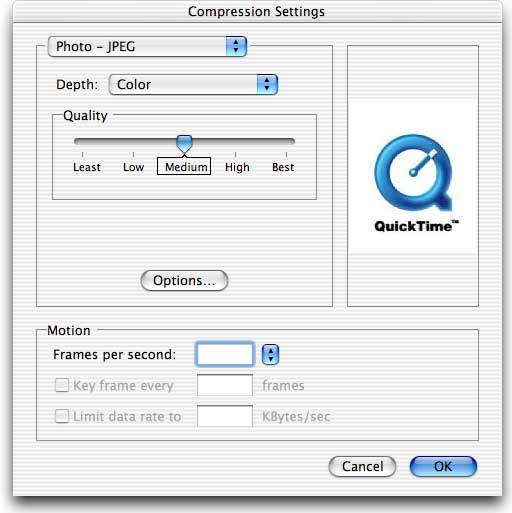
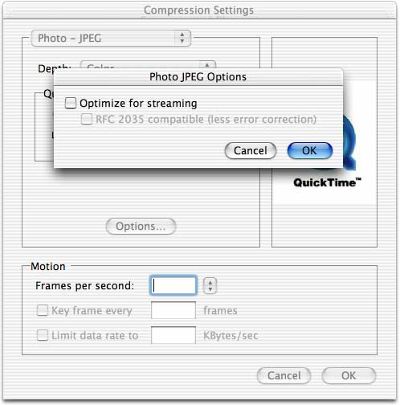
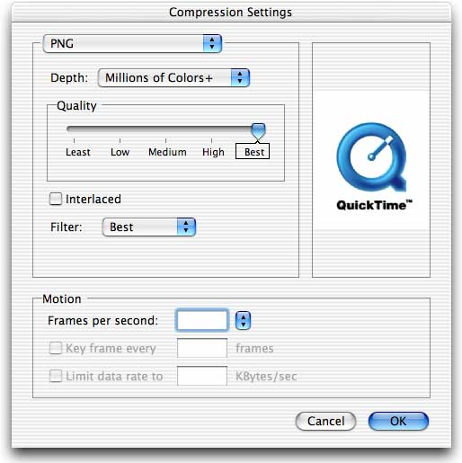
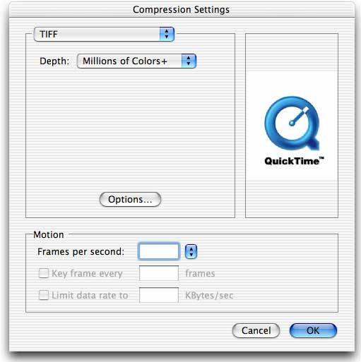

> 导航：[总目录](../../README.md) · [technotes](../../_indexes/technotes.md)


# Retired Document

__Important:__
This document may not represent best practices for current development. Links to downloads and other resources may no longer be valid.

Technical Note TN2081

# Supplying codec-specific options within the Standard Compression Dialog

__Important:__ This document may not represent best practices for current development. Links to downloads and other resources may no longer be valid.

This technote discusses the ImageCodec '`DITL`' APIs introduced with QuickTime 6. These functions allow compressor components to supply the user interface for their codec-specific options for display directly within the Standard Image-Compression Dialog.

This technote also demonstrates how to remove the "Quality Slider" control from the Standard Image-Compression Dialog.

[Introduction](#apple-f4xwc4dqnrsv64tfmyxwi33df52wszbpirkfgmjqgaydgmbzhewugsbrfveu4vcsj4)[ImageCodec 'DITL' Dispatch Selectors](#apple-f4xwc4dqnrsv64tfmyxwi33df52wszbpirkfgmjqgaydgmbzhewugsbrfvjukq2ujfhu4mi)[ImageCodec 'DITL' Functions](#apple-f4xwc4dqnrsv64tfmyxwi33df52wszbpirkfgmjqgaydgmbzhewugsbrfvjukq2ujfhu4mq)[ImageCodecGetDITLForSize](#apple-f4xwc4dqnrsv64tfmyxwi33df52wszbpirkfgmjqgaydgmbzhewugsbrfvjukq2ujfhu4mrnjfgucr2finhuirkdi5cvircjkrgemt2sknevuri)[ImageCodecDITLInstall](#apple-f4xwc4dqnrsv64tfmyxwi33df52wszbpirkfgmjqgaydgmbzhewugsbrfvjukq2ujfhu4my)[ImageCodecDITLEvent](#apple-f4xwc4dqnrsv64tfmyxwi33df52wszbpirkfgmjqgaydgmbzhewugsbrfvjukq2ujfhu4na)[ImageCodecDITLItem](#apple-f4xwc4dqnrsv64tfmyxwi33df52wszbpirkfgmjqgaydgmbzhewugsbrfvjukq2ujfhu4ni)[ImageCodecDITLRemove](#apple-f4xwc4dqnrsv64tfmyxwi33df52wszbpirkfgmjqgaydgmbzhewugsbrfvjukq2ujfhu4nq)[ImageCodecDITLValidateInput](#apple-f4xwc4dqnrsv64tfmyxwi33df52wszbpirkfgmjqgaydgmbzhewugsbrfvjukq2ujfhu4ny)[Removing the Quality Slider](#apple-f4xwc4dqnrsv64tfmyxwi33df52wszbpirkfgmjqgaydgmbzhewugsbrfvjukq2ujfhu4oa)[References](#apple-f4xwc4dqnrsv64tfmyxwi33df52wszbpirkfgmjqgaydgmbzhewugsbrfvjekrq)[Document Revision History](#apple-f4xwc4dqnrsv64tfmyxwi33df52wszbpirkfgmjqgaydgmbzhewvezlwnfzws33ojbuxg5dpoj4s2rdpnz2ey2lonncwyzlnmvxhiskel4yq)

## Introduction

The Standard Image-Compression Dialog Component provides a consistent user interface for specifying the parameters that control the compression of an image or image sequence. The dialog presented allows the user to pick a compressor component, the pixel depth for the operation, the desired spatial quality and when compressing a sequence of images, allows the choosing of a frame rate, key frame rate and data rate.

In addition to these settings, a chosen compressor component may have codec-specific options and present these settings in its own "Options..." dialog from within Standard Compression as shown in Figure 1 and Figure 2.

This is done by the compressor component implementing `ImageCodecRequestSettings` along with the corresponding `ImageCodecGetSettings` and `ImageCodecSetSettings` functions.

__Figure 1__  Compression settings and codec-specific options



__Figure 2__  Compression settings and codec-specific streaming options



QuickTime 6 introduces a set of APIs which can be implemented in addition to `ImageCodecRequestSettings` to provide a more convenient Compression Settings user interface as shown in Figure 3. With the addition of the new ImageCodec '`DITL`' functions, compressor components can now supply user interface items for codec-specific options which will be embedded within the Standard Image-Compression Dialog. This eliminates the need for an "Options..." button and an extra options dialog box.

__Figure 3__  Embedded codec-specific options



When implementing a compressor component, you can now choose how your codec-specific options will be presented in the Standard Image-Compression Dialog.

- Implement `ImageCodecRequestSettings` - This is the standard function required for codecs with custom settings. The Standard Image-Compression Dialog will show an "Options..." button, and will call your codecs `ImageCodecRequestSettings` function to display a dialog box to manage its codec-specific compression settings as shown in Figure 1 and Figure 2.
- Implement `ImageCodecGetDITLForSize` and related APIs in addition to `ImageCodecRequestSettings` - This is the newer option available from QuickTime 6 forward. The "Options..." button will be removed and Standard Compression will call your codecs `ImageCodecGetDITLForSize` function asking for the dialog item list ('`DITL`') specifying all of the items that are to be embedded in the Standard Image-Compression Dialog as shown in Figure 3.

Additionally, you may now remove the "Quality Slider" control as shown in Figure 4. You may want to do this if your compressor component performs only lossless compression (`codecLosslessQuality`).

__Figure 4__  Quality Slider removed



This technical note describes each of the ImageCodec '`DITL`' functions, provides a sample implementation for each and describes how to remove the "Quality Slider" control from the Standard Image-Compression Dialog.

The sample implementation demonstrates supplying a checkbox and a popup menu control. It can be used as a starting point to easily add support for these new ImageCodec APIs to your compression component.

__Note:__ While this technical note discusses how Standard Compression interacts with these new ImageCodec APIs, you can also call them directly as a way of conveniently implementing `ImageCodecRequestSettings`.

[Back to Top](#)

## ImageCodec 'DITL' Dispatch Selectors

There are six new selectors all of which must be implemented to allow the Standard Image-Compression Dialog to embed codec-specific settings within its dialog. These selectors should be added to `Range 1` in your codec component dispatch file.

__Listing 1__  ImageCodec selectors from ImageCodec.h

```
kImageCodecGetDITLForSizeSelect    = 0x002E
kImageCodecDITLInstallSelect       = 0x002F
kImageCodecDITLEventSelect         = 0x0030
kImageCodecDITLItemSelect          = 0x0031
kImageCodecDITLRemoveSelect        = 0x0032
kImageCodecDITLValidateInputSelect = 0x0033
```

__Listing 2__  Component dispatcher.

```
 ComponentComment ("Codec Range")
 ComponentRangeBegin (1)
  ComponentCall (GetCodecInfo)
     .
     . ...Various other Codec Range 1 selectors
     .
  ComponentCall (GetDITLForSize)
  ComponentCall (DITLInstall)
  ComponentCall (DITLEvent)
  ComponentCall (DITLItem)
  ComponentCall (DITLRemove)
  ComponentCall (DITLValidateInput)
 ComponentRangeEnd (1)
```

[Back to Top](#)

## ImageCodec 'DITL' Functions

### ImageCodecGetDITLForSize

```
ComponentResult ImageCodecGetDITLForSize(ComponentInstance ci,
                                         Handle *ditl,
                                         Point *requestedSize)
```

__ditl__ - A pointer to a handle. Dialog items are returned here.

__requestedSize__ - The requested size in pixels that fits into the dialog.

Return `noErr` if there is no error or `badComponentSelector` for unsupported sizes.

When your compressor component is selected, Standard Compression will call `ImageCodecGetDITLForSize` asking your codec to supply user interface elements (a dialog items list '`DITL`') that fit within a specified size in pixels.

There are two special values passed in for the size parameter; `kSGSmallestDITLSize` and `kSGLargestDITLSize`. These special values request the smallest and largest possible item size respectively. You must at a minimum support `kSGSmallestDITLSize` and return `badComponentSelector` for sizes not provided by your component.

Standard Compression will currently only ask for `kSGSmallestDITLSize`.

Once you have successfully returned the appropriate dialog items lists, your compressor component will subsequently get called to manage the items. The returned handle should not be a resource manager handle.

__Listing 3__  Example '`DITL`' and related resources.

```
#define kMyCodecDITLResID 129
#define kMyCodecPopupCNTLResID 129
#define kMyCodecPopupMENUResID 129

#define TEXT_HEIGHT 16
#define INTER_CONTROL_SPACING 12
#define POPUP_CONTROL_HEIGHT 22

resource 'DITL' (kMyCodecDITLResID, "Compressor Options") {
{
 {0, 0, TEXT_HEIGHT, 100},
 CheckBox { enabled, "Checkbox" },

 {TEXT_HEIGHT + INTER_CONTROL_SPACING, 0,
  TEXT_HEIGHT + INTER_CONTROL_SPACING + POPUP_CONTROL_HEIGHT, 165},
 Control { enabled, kMyCodecPopupCNTLResID },
 };
};

resource 'CNTL' (kMyCodecPopupCNTLResID, "Compressor Popup") {
 {0, 0, 20, 165},
 0,
 visible,
 60,        /* title width */
 kMyCodecPopupMENUResID,
 popupMenuCDEFProc+popupFixedWidth,
 0,
 "Menu:"
};

resource 'MENU' (kMyCodecPopupMENUResID, "Compressor Popup") {
 kMyCodecPopupMENUResID,
 textMenuProc,
 0x7FFD,       /* Enable flags */
 enabled,
 "Popup",
 { /* array: 8 elements */
  /* [1] */
  "Best", noIcon, noKey, noMark, plain,
  /* [2] */
  "-", noIcon, noKey, noMark, plain,
  /* [3] */
  "None", noIcon, noKey, noMark, plain,
  /* [4] */
  "Less", noIcon, noKey, noMark, plain,
  /* [5] */
  "Some", noIcon, noKey, noMark, plain,
  /* [6] */
  "More", noIcon, noKey, noMark, plain,
  /* [7] */
  "Many", noIcon, noKey, noMark, plain,
  /* [8] */
  "Most", noIcon, noKey, noMark, plain
 }
};
```

__Listing 4__  `ImageCodecGetDITLForSize` Implementation.

```
// Item numbers
//
#define kItemCheckbox 1
#define kItemPopup    2

pascal ComponentResult MyCodec_GetDITLForSize(Handle storage,
                                              Handle *ditl,
                                              Point *requestedSize)
{
 Globals *store = (Globals *)storage;
 Handle h = NULL;
 ComponentResult err = noErr;

 switch (requestedSize->h) {
 case kSGSmallestDITLSize:
   GetComponentResource((Component)(store->self), FOUR_CHAR_CODE('DITL'),
                                                  kMyCodecDITLResID, &h);
   if (NULL != h) *ditl = h;
   else err = resNotFound;
   break;
 default:
   err = badComponentSelector;
   break;
 }

 return err;
}
```

### ImageCodecDITLInstall

```
ComponentResult ImageCodecDITLInstall(ComponentInstance ci,
                                      DialogRef d,
                                      short itemOffset)
```

__d__ - A dialog reference identifying the compression settings dialog box. Your component may use this value to manage its part of the dialog box.

__itemOffset__ - The offset to your image codec’s first item.

Return `noErr` if no errors have occurred.

Standard Compression calls `ImageCodecDITLInstall` after your dialog items have been appended to the Standard Image-Compression Dialog but before the items are displayed to the user. Your component is provided with a reference to the dialog the items are embedded in, and the offset to your first item as it appears in the dialog. `ImageCodecSetSettings` is called prior to this call, therefore use this opportunity to set default values or to initialize any control values.

Because your items are appended into a larger dialog box containing other items, the `itemOffset` value may be different each time your component is called; do not rely on it being the same.

__Listing 5__  `ImageCodecDITLInstall` Implementation.

```
pascal ComponentResult MyCodec_DITLInstall(Handle storage,
                                           DialogRef d,
                                           short itemOffset)
{
 ControlRef cRef;

 unsigned long checkboxValue = (**storage).checkboxPreference;
 unsigned long popupValue = (**storage).popupPreference;

 GetDialogItemAsControl(d, kItemCheckBox + itemOffset, &cRef);
 SetControl32BitValue(cRef, checkboxValue);

 GetDialogItemAsControl(d, kItemPopup + itemOffset, &cRef);
 SetControl32BitValue(cRef, popupValue);

 return noErr;
}
```

### ImageCodecDITLEvent

```
ComponentResult ImageCodecDITLEvent(ComponentInstance ci,
                                    DialogRef d,
                                    short itemOffset,
                                    const EventRecord *theEvent,
                                    short *itemHit,
                                    Boolean *handled)
```

__d__ - A dialog reference identifying the compression settings dialog box.

__itemOffset__ - The offset to your image codec's first item in the dialog box.

__theEvent__ - A pointer to an `EventRecord` structure. This structure contains information identifying the nature of the event.

__itemHit__ - A pointer to a field that is to receive the item number in cases where your component handles the event. The number returned is an absolute, not a relative number, so it must be offset by the `itemOffset` parameter.

__handled__ - A pointer to a Boolean value. Set this Boolean value to `true` if you handle the event; set it to `false` if you do not.

Return `noErr` if no errors have occurred.

`ImageCodecDITLEvent` is called as part of the Standard Image-Compression Dialog event filter. This call allows your component to control and process events closer to their source by filtering all the events received, but not handled, by the standard dialog event filters.

You may want to handle events at this level if for example, you want to map some of the user's keypresses to your custom items.

If your component handles the event, set `handled` to `true` and `itemHit` to the absolute item number of the hit item, otherwise set `handled` to `false` and leave `itemHit` unmodified.

The absolute item number should be offset by the `itemOffset` value. For example, if the `itemOffset` passed to you is 4 and the item hit was your first item, the absolute value returned should be 5, calculated by adding the `itemOffset` with your item number; 4+1=5.

__Listing 6__  `ImageCodecDITLEvent` Implementation.

```
pascal ComponentResult MyCodec_DITLEvent(Handle storage,
                                         DialogRef d,
                                         short itemOffset,
                                         const EventRecord *theEvent,
                                         short *itemHit,
                                         Boolean *handled)
{
 *handled = false;
 return noErr;
}
```

### ImageCodecDITLItem

```
ComponentResult ImageCodecDITLItem(ComponentInstance ci,
                                   DialogRef d,
                                   short itemOffset,
                                   short itemNum)
```

__d__ - A dialog reference identifying the settings dialog box.

__itemOffset__ - The offset to your panel’s first item in the dialog box.

__itemNum__ - The item number of the dialog item selected by the user.

Return `noErr` if no errors have occurred.

`ImageCodecDITLItem` is called as part of the Standard Image-Compression Dialog event handling procedure once one of your items is hit. Your component may perform whatever processing is appropriate depending on the item number hit.

The `itemNum` parameter is an absolute number. It is your responsibility to adjust this value to account for the offset to your first item in the dialog box.

For example, if `itemNum` passed to you is 5 with an `itemOffset` of 4 it would indicate your components first item was hit; 5-4 = 1.

__Listing 7__  `ImageCodecDITLItem` Implementation.

```
pascal ComponentResult MyCodec_DITLItem(Handle storage,
                                        DialogRef d,
                                        short itemOffset,
                                        short itemNum)
{
 ControlRef cRef;

 switch (itemNum - itemOffset) {
 case kItemCheckbox:
   GetDialogItemAsControl(d, itemOffset + kItemCheckbox, &cRef);
   SetControl32BitValue(cRef, !GetControl32BitValue(cRef));
   break;
 case kItemPopup:
   break;
 }

 return noErr;
}
```

### ImageCodecDITLRemove

```
ComponentResult ImageCodecDITLRemove(ComponentInstance ci,
                                     DialogRef d,
                                     short itemOffset)
```

__d__ - A dialog pointer identifying the settings dialog box.

__itemOffset__ - The offset to your first item in the dialog box.

Return `noErr` if no errors have occurred.

Standard Compression calls `ImageCodecDITLRemove` in the process of finalizing the settings just before removing your items and disposing of the settings dialog. Your component is provided with a reference to the dialog your items are embedded in, and the offset to your first item as it appears in that dialog.

You can use this opportunity to set the appropriate values in your codec globals as indicated by the state of your codec-specific items. If `ImageCodecDITLValidateInput` (discussed below) sets `true` in its `ok` parameter, Standard Compression will call `ImageCodecGetSettings` immediately following `ImageCodecDITLRemove` getting your current compression settings.

__Listing 8__  `ImageCodecDITLRemove` Implementation.

```
pascal ComponentResult MyCodec_DITLRemove(Handle storage,
                                          DialogRef d,
                                          short itemOffset)
{
 ControlRef cRef;
 unsigned long checkboxValue;
 unsigned long popupValue;

 GetDialogItemAsControl(d, kItemCheckbox + itemOffset, &cRef);
 checkboxValue = GetControl32BitValue(cRef);

 GetDialogItemAsControl(d, kItemPopup + itemOffset, &cRef);
 popupValue = GetControl32BitValue(cRef);

 (**storage).checkboxPreference = checkboxValue;
 (**storage).popupPreference = popupValue;

 return noErr;
}
```

### ImageCodecDITLValidateInput

```
ComponentResult ImageCodecDITLValidateInput(ComponentInstance ci,
                                            Boolean *ok)
```

__ok__ - A pointer to a Boolean value. Set this value to `true` if the settings are OK; otherwise, set it to `false`.

Return `noErr` if no errors have occurred.

Standard Compression calls `ImageCodecDITLValidateInput` when the user clicks the "OK" button in the process of finalizing the settings selection. If the user clicks the "Cancel" button, your component will not receive this call.

Your component can use this call to validate its settings and indicate whether these settings are acceptable.

If you set `true` for the `ok` parameter to indicate valid settings, Standard Compression will then call `ImageCodecDITLRemove` and `ImageCodecGetSettings` to retrieve the current compression settings. If you set the value of `ok` to `false`, Standard Compression will ignore the "OK" button and not ask for the current compression settings after calling `ImageCodecDITLRemove`.

__Listing 9__  `ImageCodecDITLValidateInput` Implementation.

```
pascal ComponentResult MyCodec_DITLValidateInput(Handle storage,
                                                 Boolean *ok)
{
 if (ok)
   *ok = true;
 return noErr;
}
```

[Back to Top](#)

## Removing the Quality Slider

While the "Options..." button is removed automatically when your codec implements the new ImageCodec '`DITL`' functions, the "Quality Slider" control is removed though the inclusion of a codec component options resource ('`ccop`'), containing the flag `kCodecCompressionNoQuality`. This '`ccop`' resource must be referenced from your components public resource list ('`thnr`' resource).

__Listing 10__  Removing the Quality Slider Control.

```
#define kCodecCompressionNoQuality 0x00000001

type 'ccop' {
 longint;
};

resource 'thnr' (kMyCodecThingResID) {
 {
  'cdci', 1, 0,
  'cdci', kMyCodeccdciResID, 0,

  'ccop', 1, 0,
  'ccop', kMyCodecThingResID, 0,
 }
};

resource 'ccop' (kMyCodecThingResID) {
 kCodecCompressionNoQuality;
};
```

[Back to Top](#)

## References

[Standard Image Compression Dialog Components](https://developer.apple.com/library/archive/documentation/QuickTime/RM/CompressDecompress/ImageComprMgr/N-Chapter/14StandardImageCompre.html#//apple_ref/doc/uid/TP40000878-StandardImageCompressionDialogComponents-SW1)

[Back to Top](#)

---

#### Document Revision History

| __Date__ | __Notes__ |
| 2009-04-29 | Editorial Corrections |
| 2003-05-20 | New document that discusses the ImageCodec 'DITL' APIs introduced with QuickTime 6. |

