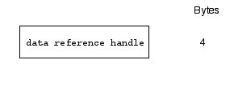
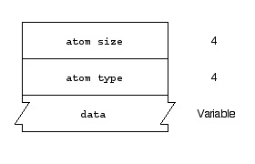

> 导航：[总目录](../../README.md) · [technotes](../../_indexes/technotes.md)


# Retired Document

__Important:__
This document may not represent best practices for current development. Links to downloads and other resources may no longer be valid.

Technical Note TN1195

# Tagging Handle and Pointer Data References in QuickTime

__Important:__ This document may not represent best practices for current development. Links to downloads and other resources may no longer be valid.

This Technote discusses the use of data reference extensions, which are used by QuickTime to tag handle and pointer data references. Data reference extensions give you the ability to associate Mac OS file type, MIME type, initialization data and/or file name information with a given data reference.

This note is directed at developers who want to take advantage of this feature in QuickTime.

[Overview](#apple-f4xwc4dqnrsv64tfmyxwi33df52wszbpirkfgmjqgaydgmbtgqwugsbrfvke4vcbi4yq)[Data References](#apple-f4xwc4dqnrsv64tfmyxwi33df52wszbpirkfgmjqgaydgmbtgqwugsbrfvke4vcbi4za)[Constructing Data Reference Handles](#apple-f4xwc4dqnrsv64tfmyxwi33df52wszbpirkfgmjqgaydgmbtgqwugsbrfvke4vcbi42q)[Alias Data Reference Handle](#apple-f4xwc4dqnrsv64tfmyxwi33df52wszbpirkfgmjqgaydgmbtgqwugsbrfvke4vcbi43a)[Handle Data Reference Handle](#apple-f4xwc4dqnrsv64tfmyxwi33df52wszbpirkfgmjqgaydgmbtgqwugsbrfvke4vcbi44a)[Pointer Data Reference Handle](#apple-f4xwc4dqnrsv64tfmyxwi33df52wszbpirkfgmjqgaydgmbtgqwugsbrfvke4vcbi4ytc)[URL Data Reference Handle](#apple-f4xwc4dqnrsv64tfmyxwi33df52wszbpirkfgmjqgaydgmbtgqwugsbrfvke4vcbi4zdm)[Resource Data Reference Handle](#apple-f4xwc4dqnrsv64tfmyxwi33df52wszbpirkfgmjqgaydgmbtgqwugsbrfvke4vcbi4ytg)[Data Reference Extensions](#apple-f4xwc4dqnrsv64tfmyxwi33df52wszbpirkfgmjqgaydgmbtgqwugsbrfvke4vcbi4ytk)[Building a Handle or Pointer Data Reference with Data Reference Extensions](#apple-f4xwc4dqnrsv64tfmyxwi33df52wszbpirkfgmjqgaydgmbtgqwugsbrfvke4vcbi4yts)[Additional Notes & Comments](#apple-f4xwc4dqnrsv64tfmyxwi33df52wszbpirkfgmjqgaydgmbtgqwugsbrfvke4vcbi4zde)[Summary](#apple-f4xwc4dqnrsv64tfmyxwi33df52wszbpirkfgmjqgaydgmbtgqwugsbrfvke4vcbi4zdg)[References](#apple-f4xwc4dqnrsv64tfmyxwi33df52wszbpirkfgmjqgaydgmbtgqwugsbrfvke4vcbi4zdi)[Document Revision History](#apple-f4xwc4dqnrsv64tfmyxwi33df52wszbpirkfgmjqgaydgmbtgqwvezlwnfzws33ojbuxg5dpoj4s2rdpnz2ey2lonncwyzlnmvxhiskel4yq)

## Overview

When you ask QuickTime to create a new movie from a file which is not a QuickTime movie file, QuickTime will locate an appropriate movie importer component to read the file. In doing so, QuickTime needs to know the type of data in the file. It usually find this information through either the file type, file extension, or MIME type associated with the file. If the data is in memory referenced via a handle data reference or a pointer data reference, none of this information is available. To remedy this, you can attach ("tag") this information to the data reference as a data reference extension so QuickTime knows the type of the data -- you can attach the MIME type extension, MacOS File Type extension or you can use the File Name extension with an appropriate file extension. You can also specify initialization data for the handle data reference.

After tagging the data reference, any QuickTime function call that will look at the type of data (`GetGraphicsImporterForDataRef`, `NewMovieFromDataRef`, `GetMovieImporterForDataRef`, etc.) will find the type information you provided.

__Important:__ If you ask QuickTime to create a new movie for any non-QuickTime movie (.mov) data in a handle or pointer data reference  __without__  specifying any of the data reference extensions (filename, file type, MIME type, and so on) this will fail with the -2048 `noMovieFound` error. You must set at least one of the data reference extensions.

Alternately, you can use the [MovieImportDataRef](https://developer.apple.com/documentation/QuickTime/APIREF/movieimportdataref.htm) function and directly specify the movie importer component you would like to use to perform the import (rather than let QuickTime decide based on the data reference extensions). See [Q&A QTMTB52 - Playing memory resident WAVE data using QuickTime](https://developer.apple.com/qa/qtmtb/qtmtb52.html) for an example code listing.

For example, you can tag a handle to a PhotoShop image file's data with the Mac OS `'8BPS'` file type and be assured that the correct Graphics Importer Component will be chosen.

Also, the handle and pointer data handlers are the only data handlers that support the above extensions since there's no intrinsic file type, file name or MIME type for a handle or pointer to a block of memory.

[Back to Top](#)

## Data References

The handle and pointer data handlers are the only data handlers that support the data reference extensions. So what exactly is a handle or pointer data reference? A handle or pointer data reference is simply a reference to data that resides in a block of memory as specified by a handle or pointer, rather than in a file (or somewhere else).

In QuickTime, all data handlers identify their data with data references. Data references specify the location of the data, and the data reference type indicates the data handler able to interpret the data. We can therefore specify a data reference programatically by a type value and a reference value as follows:

__Table 1__  Specifying a Data Reference.

| type | description |
| OSType dataRefType | Specifies the type of data reference |
| Handle dataRef | Specifies the actual data reference |

The dataRef value specifies the actual data reference. This is a handle to the information that identifies the data to be used. The type of information stored in the handle depends on the data reference type. For example, if your application is loading a movie from a file, this handle would contain a Macintosh alias to the movie file.

The dataRefType value specifies the type of data reference. For example, for an alias data reference you set this to `rAliasType` ('alis'), indicating that the reference is an alias.

Listed below are all the available data reference types:

__Table 2__  Data Reference Types.

| Data reference type | Description |
| 'alis' | Data reference is a Macintosh alias handle. An alias handle contains information about the file, including its full path name. For more information about aliases, see Inside Macintosh: Files. |
| 'hndl' | Data reference is a Macintosh handle containing the data. For more information about Macintosh handles, see Inside Macintosh: Memory. In addition to specifying movie data in memory, this handle may contain data reference extensions as described in section "Data Reference Extensions" below. |
| 'rsrc' | Data reference is a Macintosh alias handle. However, appended to the end of the alias handle is the resource type (stored as a 32-bit unsigned integer) and ID (stored as a 16-bit signed integer) to use within the specified file. Both these values must be big-endian format. |
| 'url ' | Data reference is a handle whose data is a C-string (null-terminated) specifying a URL (note: a URL data reference can have data reference extensions too, so the actual size of a URL data reference may be larger than the length of the string). |
| 'ptr ' | Data reference is a pointer to the data in memory plus a size value. In addition to specifying movie data in memory, the pointer data reference may contain data reference extensions as described in section "Data Reference Extensions" below |

[Back to Top](#)

## Constructing Data Reference Handles

How do you construct a data reference handle? As stated above, the information that identifies the data is specified in the data reference handle (while the type of the data reference is specified in the data reference type). Here's how to construct data reference handles for the various data references:

### Alias Data Reference Handle

The alias data reference handle is a standard Macintosh alias handle (see Inside Macintosh:Files for more information). Here's code showing how to construct the data reference handle for an alias data reference. In our example, you pass a standard Macintosh file system specification record for the desired file in the `theFile` parameter and an alias handle is returned. We use the `NewAlias` function to create the alias handle, but you can also use any of the other Alias Manager functions which return an alias handle (`QTNewAlias`, `NewAliasMinimal`, `NewAliasMinimalFromFullPath`, etc.):

__Listing 1__  Creating an alias data reference.

```
Handle MyCreateAliasDataReferenceHandle(const FSSpec *theFile)
{
    OSErr err;
    AliasHandle theAlias;

    err = NewAlias(NULL, theFile, &theAlias);
    if (err == noErr)
    {
        return (Handle)theAlias;
    }

    return NULL;
}
```

Also, new with QuickTime 6.4 are a set of convenience functions for creating alias data references from various file references. These are shown below. For more information, see [What's New in QuickTime 6.4](https://developer.apple.com/documentation/QuickTime/whatsnew.htm#//apple_ref/doc/uid/TP40001050).

`QTNewDataReferenceFromFSRef` - creates an alias data reference from a file specification

`QTNewDataReferenceFromFSRefCFString` - creates an alias data reference from a file reference pointing to a directory and a file name.

`QTNewDataReferenceFromFSSpec` - creates an alias data reference from a file specification of type `FSSpec`.

`QTNewDataReferenceWithDirectoryCFString` - creates an alias data reference from another alias data reference pointing to the parent directory and a `CFString` that contains the file name.

`QTNewDataReferenceFromFullPathCFString` - creates an alias data reference from a `CFString` that represents the full pathname of a file.

### Handle Data Reference Handle

The handle data reference handle is a handle whose data is a Macintosh handle containing the actual data. Here's code showing how to construct the data reference handle for a handle data reference. In our example, you simply pass a handle to your actual data in the `theDataH` parameter and a data reference handle is returned. The data reference handle may be null, in which case the actual data would need to be specified by a data ('data') data reference extension (see "Data Reference Extensions").

__Listing 2__  Creating a handle data reference.

```
Handle MyCreateDataReferenceHandle(Handle theDataH)
{
    Handle  dataRef = NULL;
    OSErr   err     = noErr;

    // Create a data reference handle for our data.
    err = PtrToHand( &theDataH, &dataRef, sizeof(Handle));

    return dataRef;
}
```

__Note:__ most QuickTime functions which accept data references accept the data reference handle and data reference type as separate parameters. For example, here's how you would pass a handle data reference to the Graphics Importer function `GetGraphicsImporterForDataRef`:

__Listing 3__  Using a handle data reference with `GetGraphicsImporterForDataRef`.

```
void MyGetGraphicsImporterForDataRef(Handle ourData)
{
    OSErr err;
    ComponentInstance gi;
    Handle dataRefH = NULL;

    dataRefH = MyCreateDataReferenceHandle(ourData);
    if (dataRefH)
    {
        err = GetGraphicsImporterForDataRef (
                 dataRefH,                 /* data reference */
                 HandleDataHandlerSubType, /* data ref type */
                 &gi); /* importer returned here */

         /* ...now use the returned graphics importer component
          gi as you please... */

         /* close the graphics importer component instance when
        we are done */
        CloseComponent(gi);
    }

    /* clean up our data reference handle when we
       are done */
    if (dataRefH)
    {
     DisposeHandle(dataRefH);
    }
}
```

__Note:__ you would need to dispose of the data reference handle when you are done.

### Pointer Data Reference Handle

The pointer data reference handle is a handle whose data is a record containing a pointer to the actual data along with a value specifying the size of the data. Here's code showing how to construct the data reference handle for a pointer data reference. In our example, you simply pass a pointer to your actual data in the `data` parameter as well as the size of the data in the `dataSize` parameter and a pointer data reference handle is returned:

__Listing 4__  Creating a pointer data reference.

```
Handle MyCreatePointerReferenceHandle(void *data, Size dataSize)
{
    PointerDataRefRecord    ptrDataRefRec;
    Handle                  dataRef = NULL;
    OSErr                   err     = noErr;

    ptrDataRefRec.data          = data;
    ptrDataRefRec.dataLength    = dataSize;

    // create a data reference handle for our data
    err = PtrToHand( &ptrDataRefRec, &dataRef, sizeof(PointerDataRefRecord));

    return dataRef;
}
```

### URL Data Reference Handle

The URL data reference handle is a handle whose data is a C-string (null-terminated) specifying a URL. Here's code showing how to construct the data reference handle for a URL data reference:

__Listing 5__  Creating a URL data reference.

```
Handle MyCreateURLDataReferenceHandle(char *theURL)
{
    Handle          myDataRef = NULL;
    Size            mySize = 0;

    // get the size of the URL, plus the terminating null byte
    mySize = (Size)strlen(theURL) + 1;
    if (mySize <= 1)
        goto bail;

    // copy the URL into the handle
    PtrToHand(theURL, &myDataRef, mySize);

bail:
    return(myDataRef);
}
```

Also, new with QuickTime 6.4 are a set of convenience functions for creating URL data references. These are shown below. For more information, see [What's New in QuickTime 6.4](https://developer.apple.com/documentation/QuickTime/whatsnew.htm#//apple_ref/doc/uid/TP40001050).

`QTNewDataReferenceFromCFURL` - creates a URL data reference from a `CFURL`.

`QTNewDataReferenceFromURLCFString` - creates a URL data reference from a `CFString` that represents a URL string.

### Resource Data Reference Handle

The resource data reference handle is also a Macintosh alias handle. However, appended to the end of the alias handle is the resource type (stored as a 32-bit unsigned integer) and ID (stored as a 16-bit signed integer) to use within the specified file. These values must be big-endian format.

Here's code showing how to construct the data reference handle for a resource data reference. In our example, we build a data reference for a standard QuickTime movie file whose movie resource resides in the resource fork of the file. Pass a standard Macintosh file system specification record for the desired movie file in the `theFile` parameter. Next, an alias handle is created for this file. Finally, we append to this alias handle the resource type for the movie resource (type 'moov') along with the movie resource ID (128). Once this information is appended, the completed resource data reference handle is returned.

Note you can use any of the other Alias Manager functions to create the alias handle (`QTNewAlias`, `NewAliasMinimal`, `NewAliasMinimalFromFullPath`, etc.):

__Listing 6__  Type your listing title text here.

```
Handle MyCreateResourceDataReferenceHandle(FSSpec *theFile)
{
    OSErr err;
    AliasHandle theAlias;

    err = NewAlias(NULL, theFile, &theAlias);
    if (err == noErr)
    {
        OSType ourType = EndianU32_NtoB(MovieResourceType);
        short ourID = EndianU16_NtoB(128);

        /* append resource type */
        err = PtrAndHand(&ourType, (Handle)theAlias, sizeof(OSType));

        /* append resource id */
        err = PtrAndHand(&ourID, (Handle)theAlias, sizeof(short));

        return (Handle)theAlias;
    }

    return NULL;
}
```

[Back to Top](#)

## Data Reference Extensions

One can certainly construct a handle or pointer data reference for a given piece of data, and use this data reference with any of the QuickTime API's which operate on data references. However, if you just construct a "plain" handle or pointer data reference, the reference doesn't contain any information about the file type or file name, so QuickTime will end up performing a slow validate search to identify the file (since there's really no other way). As well as being slow, this technique will miss some file formats which can't be detected by validation.

For example, when you call the `GetGraphicsImporterForFile` function to try to obtain a graphics importer for a given file, QuickTime first tries to locate a graphics importer component for the specified file based on the Macintosh file type of the file. If it is unable to locate a graphics importer component based on the Macintosh file type, `GetGraphicsImporterForFile` will try to locate a graphics importer component for the specified file based on the file name extension of the file.

If you have the file name, you should add the file name to the handle or pointer data reference. If you know the file type or MIME type, you should add this information as well. You can also specify any initialization data for the handle data reference.

How do you go about adding this information to a handle or pointer data reference? Use the handle or pointer data reference extensions.

__Note:__ The pointer and handle data handlers treat data reference extensions differently. In particular, the internal format of the tags for pointer data references is not identical to that of handle data references. For this reason, the pointer data handler supports the following data handler functions for getting and setting the extensions:

`DataHSetDataRefExtension`

`DataHGetDataRefExtension`

Developers should make use of these functions for getting and setting the extensions, rather than building and parsing the extensions by hand. See [Building a Handle or Pointer Data Reference with Data Reference Extensions](#apple-f4xwc4dqnrsv64tfmyxwi33df52wszbpirkfgmjqgaydgmbtgqwugsbrfvke4vcbi4yts) below for code snippets showing how to construct data reference extensions for both handle and pointer data references.

Here's the format of a data reference handle with data reference extensions:

The format of a handle data reference is:

__Figure 1__  Data reference handle.



optionally continued by a pascal string containing the file name (\*not padded\* - zero byte if not available). Note the filename is not really a data reference extension - QuickTime will recognize any file name added to the data reference.

__Figure 2__  Optional file name.


optionally continued by a sequence of n classic atoms, whose format is as follows (atom size and atom type fields must be big-endian):

__Figure 3__  Optional sequence of classic atoms.



Atom types may be any of the following:

- 'ftyp' - Mac OS file type, data is a big-endian OSType
- 'mime' - MIME type, data is a pascal string (no padding)
- 'data' - Initialization data (for handle data reference only), data can be a any block of image, video/audio data, etc.

__Note:__ The pointer data reference does not support the initialization data extension ('data').

__Note:__ If you add any of these atoms, you MUST add a file name first -- even if it is an empty Pascal string.

[Back to Top](#)

## Building a Handle or Pointer Data Reference with Data Reference Extensions

As shown above, building a handle or pointer data reference with data reference extensions involves first creating a data reference handle for your data, then adding any additional data reference extension information (Mac OS file type, MIME type and/or file name, initialization data) that you may have for this data reference handle. Listed below are code snippets which demonstrate how it's done.

__Note:__ Remember, as stated in [Data Reference Extensions](#apple-f4xwc4dqnrsv64tfmyxwi33df52wszbpirkfgmjqgaydgmbtgqwugsbrfvke4vcbi4ytk) when adding data reference extensions to the pointer data reference you should use the data handler functions `DataHSetDataRefExtension` and `DataHGetDataRefExtension` rather than constructing the extensions by hand.

The first example shows how to build a handle data reference with extensions. You pass to the function first a handle to your data, followed by (optionally) the file name, file type, MIME type and any initialization data you may have. If you specify initialization data, the data is added in-place to the handle data reference (which means the data reference can grow to be quite large). The advantage to adding initialization data in this manner is that once you've created the data reference you no longer have to manage the actual data handle yourself as you would if you added the data via the handle data reference handle.

You may pass nulls for any of the file name, file type, MIME type and initialization data parameters, in which case these parameters are not added as data reference extensions to the data reference handle. The function returns a handle data reference handle for your data:

__Listing 7__  Creating a handle data reference with extensions.

```
//
// createHandleDataRefWithExtensions
//
// Creates a handle data reference for a
// handle containing a block of movie data. It also
// adds data reference extensions for file name, file
// type, mime type and initialization data.
//
// Parameters
//
//   dataHandle        A handle to your movie data. You
//                     may pass NULL here, in which case
//                     you would have to  pass a valid
//                     value for the initDataPtr parameter
//                     which adds the data ('data')
//                     extension to specify the actual data.
//
//   fileName          If you know the original file name
//                     you should pass it here to help
//                     QuickTime determine which importer
//                     to use. Pass NULL if you do not wish
//                     to specify the fileName
//
//   fileType          If you know the file type of the
//                     original file name, you should
//                     pass it here. Pass 0 here if you
//                     do not wish to specify the fileType
//
//   mimeTypeString    If you know the mime type of the
//                     data, you should pass it here. Pass
//                     NULL if you do not wish to specify
//                     the mime type.
//
//   initDataPtr       Pass any initialization data here, or
//                     0 if there is none.
//
//   initDataByteCount Specify the size of any initialization
//                     data, or 0 if there is none.
//

Handle createHandleDataRefWithExtensions(
                         Handle             dataHandle,
                         Str255             fileName,
                         OSType             fileType,
                         StringPtr          mimeTypeString,
                         Ptr                initDataPtr,
                         Size               initDataByteCount
                         )
{
    OSErr  err = noErr;
    Handle dataRef = NULL;

    // First create a data reference handle for our data
    dataRef = MyCreateDataReferenceHandle(dataHandle);
    if (!dataRef) goto bail;

    // We can add the filename to the data ref to help
    // importer finding process. Find uses the extension.
    // We must add the file name if we are also adding a
    // file type, MIME type or initialization data

    // If file name is NULL we still need to specify a
    // null Pascal string (a single 0 byte) in the data
    // reference prior to adding the other extensions
    err = AddFilenamingExtension (dataRef, fileName);
    if (err) goto bail;

    // The handle data handler can also be told the
    // filetype and/or MIME type by adding data ref
    // extensions. These help the importer finding process.
    // NOTE: If you add either of these, you MUST add
    // a filename first -- even if it is an empty Pascal
    // string. Any data ref extensions will be ignored.

    // to add file type, you add a classic atom followed
    // by the Mac OS filetype for the kind of file

    if (fileType)
    {
        err = AddMacOSFileTypeDataRefExtension (dataRef, fileType);
        if (err) goto bail;
    }

    // to add MIME type information, add a classic atom followed by
    // a Pascal string holding the MIME type

    if (mimeTypeString)
    {
        err = AddMIMETypeDataRefExtension (dataRef, mimeTypeString);
        if (err) goto bail;
    }

    // add any initialization data, but only if a dataHandle was
    // not already specified (any initialization data is ignored
    // in this case)
    if((dataHandle == NULL) && (initDataPtr))
    {
        err = AddInitDataDataRefExtension (dataRef, initDataPtr);
        if (err) goto bail;
    }

    return dataRef;

bail:
    if (dataRef)
    {
        // make sure and dispose the data reference handle
        DisposeHandle(dataRef);
    }

    return NULL;
}

//////////
//
// MyCreateDataReferenceHandle
// Create a handle data reference handle.
//
// The handle data reference handle contains
// a handle to a block of data.
//
//////////

Handle MyCreateDataReferenceHandle(Handle theDataH)
{
    Handle  dataRef = NULL;
    OSErr   err     = noErr;

    // Create a data reference handle for our data.
    err = PtrToHand( &theDataH, &dataRef, sizeof(Handle));

    return dataRef;
}

//////////
//
// AddMIMETypeDataRefExtension
// Add a MIME type as a data reference extension.
//
// A MIME type data extension is an atom whose data
// is a Pascal string.
//
//////////

OSErr AddMIMETypeDataRefExtension (
                                  Handle theDataRef,
                                  StringPtr theMIMEType
                                  )
{
    unsigned long   myAtomHeader[2];
    OSErr           myErr = noErr;

    if (theMIMEType == NULL)
        return(paramErr);

    myAtomHeader[0] = EndianU32_NtoB(sizeof(myAtomHeader) +
                                    theMIMEType[0] + 1);
    myAtomHeader[1] =
        EndianU32_NtoB(kDataRefExtensionMIMEType);

    myErr = PtrAndHand(myAtomHeader, theDataRef,
                            sizeof(myAtomHeader));
    if (myErr == noErr)
        myErr = PtrAndHand(theMIMEType, theDataRef,
                              theMIMEType[0] + 1);

    return(myErr);
}

//////////
//
// AddInitDataDataRefExtension
// Add some initialization data as a data reference extension.
//
// An initialization data data extension is an atom whose data
// is any block of data.
//
//////////

OSErr AddInitDataDataRefExtension (
                                    Handle theDataRef,
                                    Ptr theInitDataPtr
                                   )
{
    unsigned long   myAtomHeader[2];
    OSErr           myErr = noErr;

    if (theInitDataPtr == NULL)
        return(paramErr);

    myAtomHeader[0] = EndianU32_NtoB(sizeof(myAtomHeader) +
         GetPtrSize(theInitDataPtr));
    myAtomHeader[1] =
       EndianU32_NtoB(kDataRefExtensionInitializationData);

    myErr = PtrAndHand(myAtomHeader, theDataRef,
                            sizeof(myAtomHeader));
    if (myErr == noErr)
        myErr = PtrAndHand(theInitDataPtr,
                   theDataRef, GetPtrSize(theInitDataPtr));

    return(myErr);
}

//////////
//
// AddMacOSFileTypeDataRefExtension
// Add a Macintosh file type as a data reference extension.
//
// A Macintosh file type data extension is an atom whose
// data is a 4-byte OSType.
//
//////////

OSErr AddMacOSFileTypeDataRefExtension (
                                       Handle theDataRef,
                                       OSType theType
                                       )
{
    unsigned long   myAtomHeader[2];
    OSType          myType;
    OSErr           myErr = noErr;

    myAtomHeader[0] = EndianU32_NtoB(sizeof(myAtomHeader) +
                                    sizeof(theType));
    myAtomHeader[1] = EndianU32_NtoB(kDataRefExtensionMacOSFileType);

    myType = EndianU32_NtoB(theType);

    myErr = PtrAndHand(myAtomHeader, theDataRef,
                          sizeof(myAtomHeader));
    if (myErr == noErr)
        myErr = PtrAndHand(&myType, theDataRef,
                            sizeof(myType));

    return(myErr);
}

//////////
//
// AddFilenamingExtension
// Add a filenaming extension to a data reference.
// If theStringPtr is NULL, add a 0-length filename.
//
// A filenaming extension is a Pascal string.
//
//////////

OSErr AddFilenamingExtension (
                            Handle theDataRef,
                            Str255 theFileName
                            )
{
    unsigned char   myChar = 0;
    OSErr           myErr = noErr;
    if (theFileName == NULL)
        myErr = PtrAndHand(&myChar, theDataRef, sizeof(myChar));
    else
        myErr = PtrAndHand(theFileName, theDataRef,
                             theFileName[0] + 1);

    return(myErr);
}
```

The next example shows how to build a pointer data reference with extensions. You pass to the function first a pointer to your data along with the size of the data, followed by (optionally) the file name, file type and MIME type.

You may pass nulls for any of the file name, file type, and MIME type parameters, in which case these parameters are not added as data reference extensions to the pointer data reference handle. The function returns a pointer data reference handle for your data:

__Listing 8__  Creating a pointer data reference with extensions.

```
//
// createPointerDataRefWithExtensions
//
// Given a pointer to some movie data, it creates a
// pointer data reference with extensions.
//
// Parameters
//
//   data             A pointer to your movie data
//   dataSize         The actual size of the movie data
//                    specified by the data pointer
//   fileName         If you know the original file name
//                    you should pass it here to help
//                    QuickTime determine which importer
//                    to use. Pass NULL if you do not wish
//                    to specify the fileName
//   fileType         If you know the file type of the
//                    original file name, you should
//                    pass it here. Pass 0 here if you
//                    do not wish to specify the fileType
//   mimeTypeString   If you know the mime type of the
//                    data, you should pass it here. Pass
//                    NULL if you do not wish to specify
//                    the mime type.
//

Handle createPointerDataRefWithExtensions(
                         void               *data,
                         Size               dataSize,
                         Str255             fileName,
                         OSType             fileType,
                         StringPtr          mimeTypeString
                         )
{
    OSStatus  err = noErr;
    Handle dataRef = NULL;
    ComponentInstance dataRefHandler = NULL;

    // First create a data reference handle for our data
    dataRef = MyCreatePointerReferenceHandle(data, dataSize);
    if (!dataRef) goto bail;

    //  Get a data handler for our data reference
    err = OpenADataHandler(
            dataRef,                    /* data reference */
            PointerDataHandlerSubType,  /* data ref. type */
            NULL,                       /* anchor data ref. */
            (OSType)0,                  /* anchor data ref. type */
            NULL,                       /* time base for data handler */
            kDataHCanRead,              /* flag for data handler usage */
            &dataRefHandler); /* returns the data handler */
    if (err) goto bail;

    // We can add the filename to the data ref to help
    // importer finding process. Find uses the extension.
    // If we add a filetype or mimetype we must add a
    // filename -- even if it is an empty string
    if (fileName || fileType || mimeTypeString)
    {
        err = PtrDataRef_AddFileNameExtension(
            dataRefHandler, /* data ref. handler */
            fileName); /* file name for extension */

        if (err) goto bail;
    }

    // The pointer data handler can also be told the
    // filetype and/or MIME type by adding data ref
    // extensions. These help the importer finding process.
    // NOTE: If you add either of these, you MUST add
    // a filename first -- even if it is an empty Pascal
    // string. Any data ref extensions will be ignored.

    // to add file type, you add a classic atom followed
    // by the Mac OS filetype for the kind of file

    if (fileType)
    {
        err = PtrDataRef_AddFileTypeExtension(
            dataRefHandler, /* data ref. handler */
            fileType); /* file type for extension */
        if (err) goto bail;
    }

    // to add MIME type information, add a classic atom followed by
    // a Pascal string holding the MIME type

    if (mimeTypeString)
    {
        err = PtrDataRef_AddMIMETypeExtension (
                dataRefHandler,     /* data ref. handler */
                mimeTypeString); /* mime string for extension */
        if (err) goto bail;
    }

    /* dispose old data ref handle because
        it does not contain our new changes */
    DisposeHandle(dataRef);
    dataRef = NULL;

    /* re-acquire data reference from the
        data handler to get the new
        changes */
    err = DataHGetDataRef(dataRefHandler, &dataRef);
    if (err) goto bail;

    CloseComponent(dataRefHandler);

    return dataRef;

bail:
    if (dataRefHandler)
    {
        CloseComponent(dataRefHandler);
    }

    if (dataRef)
    {
        // make sure and dispose the data reference handle
        // once we are done with it
        DisposeHandle(dataRef);
    }

    return NULL;
}

//////////
//
// PtrDataRef_AddFileNameExtension
//
// Tell the data handler to set
// the file name extension in the
// data reference.
//
//////////

OSStatus PtrDataRef_AddFileNameExtension(
        ComponentInstance dataRefHandler,   /* data ref. handler */
        Str255 fileName) /* file name for extension */
{
    OSStatus anErr = noErr;
    unsigned char myChar = 0;
    Handle fileNameHndl = NULL;

    /* create a handle with our file name string */

    /* if we were passed a null string, then we
       need to add this null string (a single 0
       byte) to the handle */

    if (fileName == NULL)
        anErr = PtrToHand(&myChar, &fileNameHndl, sizeof(myChar));
    else
        anErr = PtrToHand(fileName, &fileNameHndl, fileName[0] + 1);
    if (anErr != noErr) goto bail;

    /* set the data ref extension for the
        data ref handler */
    anErr = DataHSetDataRefExtension(
            dataRefHandler,         /* data ref. handler */
            fileNameHndl,           /* data ref. extension to add */
            kDataRefExtensionFileName);

bail:
    if (fileNameHndl)
        /* no longer need this */
        DisposeHandle(fileNameHndl);

    return anErr;

}

//////////
//
// PtrDataRef_AddFileTypeExtension
//
// Tell the data handler to set
// the file type extension in the
// data reference.
//
//////////

OSStatus PtrDataRef_AddFileTypeExtension(
        ComponentInstance dataRefHandler,   /* data ref. handler */
        OSType fileType) /* file type for extension */
{
    Handle      fileTypeHndl = NULL;
    OSStatus    anErr        = noErr;
    OSType      myType;

    myType = EndianU32_NtoB(fileType);

    anErr = PtrToHand(&myType, &fileTypeHndl, sizeof(OSType));
    if (anErr != noErr) goto bail;

    /* set the data ref extension for the
        data ref handler */
    anErr = DataHSetDataRefExtension(
            dataRefHandler,             /* data ref. handler */
            fileTypeHndl,               /* data ref. extension to add */
            kDataRefExtensionMacOSFileType);

bail:

    if (fileTypeHndl)
        /* no longer need this */
        DisposeHandle(fileTypeHndl);

    return anErr;
}

//////////
//
// PtrDataRef_AddMIMETypeExtension
//
// Tell the data handler to set
// the mime type extension in the
// data reference.
//
//////////

OSStatus PtrDataRef_AddMIMETypeExtension(
        ComponentInstance dataRefHandler,   /* data ref. handler */
        StringPtr mimeType) /* mime type for extension */
{
    OSStatus anErr = noErr;
    Handle mimeTypeHndl = NULL;

    if (mimeType == NULL)
        return paramErr;

    anErr = PtrToHand(mimeType, &mimeTypeHndl, mimeType[0] + 1);
    if (anErr != noErr) goto bail;

    /* set the data ref extension for the
        data ref handler */
    anErr = DataHSetDataRefExtension(
            dataRefHandler,             /* data ref. handler */
            mimeTypeHndl,               /* data ref. extension to add */
            kDataRefExtensionMIMEType);

bail:

    if (mimeTypeHndl)
        /* no longer need this */
        DisposeHandle(mimeTypeHndl);

    return anErr;
}

//////////
//
// MyCreatePointerReferenceHandle
// Create a pointer data reference handle.
//
// The pointer data reference handle contains
// a record specifying a pointer to a block of
// movie data along with a size value.
//
//////////

Handle MyCreatePointerReferenceHandle(void *data, Size dataSize)
{
 Handle dataRef = NULL;
 PointerDataRefRecord ptrDataRefRec;
 OSErr err;

 ptrDataRefRec.data = data;
 ptrDataRefRec.dataLength = dataSize;

 // create a data reference handle for our data
 err = PtrToHand( &ptrDataRefRec, &dataRef, sizeof(PointerDataRefRecord));

 return dataRef;
}
```

[Back to Top](#)

## Additional Notes & Comments

If you add a Mac OS file type or MIME type or initialization data extension as shown above, you MUST add a file name \*first\* in the sequence - even if it is an empty Pascal string (a single 0 length byte).

__Note:__ Only the handle data reference supports the initialization data ('data') extension.

Remember, any initialization data you specify via the 'data' extension for a handle data reference is of course added to the data reference, meaning the data reference can grow to be quite large. You'll probably only want to use image data (GIF, etc.), text data or music data as initialization data (rather than audio/video data) , as it tends to take up less space.

[Back to Top](#)

## Summary

Data reference extensions in QuickTime give you the ability to associate Mac OS file type, MIME type, initialization data and/or file name information with a given data reference. This assures QuickTime will interpret your data correctly and as quickly as possible.

[Back to Top](#)

## References

- [Letters From the Ice Floe Dispatch #5 - Finding the file type and extension from the MIME type](https://developer.apple.com/quicktime/icefloe/dispatch005.html)
- [QuickTime API Documentation, Graphics Importer](https://developer.apple.com/documentation/QuickTime/RM/ImportExport/GraphicImport/index.html)
- [QuickTime File Format Documentation, QuickTime Atoms](https://developer.apple.com/documentation/QuickTime/QTFF/index.html)
- [What's New in QuickTime 6.4](https://developer.apple.com/documentation/QuickTime/whatsnew.htm)

[Back to Top](#)

---

#### Document Revision History

| __Date__ | __Notes__ |
| 2011-07-19 | Editorial |
| 2006-08-30 | createPointerDataRefWithExtensions now correctly calls CloseComponent to close the DataHandler being used. |
| 2006-03-21 | Explain why movie import might fail with the -2048 noMovieFound error. |
| 2004-05-26 | Add information for the pointer data reference, new QuickTim 6.4 convenience functions for creating data references, and updated code snippets. |
| 2000-04-01 | New document that the use of data reference extensions used by QuickTime to tag handle and pointer data references. |

