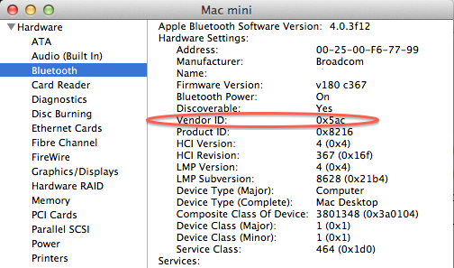
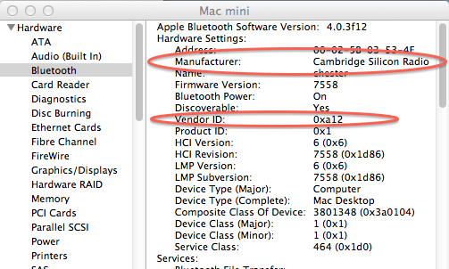

> 导航：[总目录](../../README.md) · [technotes](../../_indexes/technotes.md)


# Retired Document

__Important:__
This document may not represent best practices for current development. Links to downloads and other resources may no longer be valid.

Technical Note TN2295

# Testing Core Bluetooth Applications in the iOS Simulator

__Important:__ This document may not represent best practices for current development. Links to downloads and other resources may no longer be valid.

A new feature in iOS 5 is the support for Bluetooth 4.0 Low Energy (LE) devices using the Core Bluetooth Framework. For those who do not have a Bluetooth LE capable device, it is still possible to begin development and test Core Bluetooth iOS applications using the iOS simulator with a Bluetooth LE USB adapter. This Technical Note describes how to configure an OS X system to enable iOS simulator support for Core Bluetooth iOS applications. This Technical Note also explains the need for a Bluetooth LE adapter for OS X systems, which have Bluetooth LE built-in, for simulator testing.

This Technical Note also provides important information if you are using an OS X system for testing both iOS and OS X Core Bluetooth applications. When you make the changes described in this Technical Note, you may need to restore the system in order to run OS X Bluetooth LE application tests.

[Introduction](#apple-f4xwc4dqnrsv64tfmyxwi33df52wszbpirkfgnbqgaytemrrgewugsbrfvke4vcbi4yq)[Requirements](#apple-f4xwc4dqnrsv64tfmyxwi33df52wszbpirkfgnbqgaytemrrgewugsbrfvjekukvjfjektkfjzkfg)[Steps For Enabling iOS Simulator Support](#apple-f4xwc4dqnrsv64tfmyxwi33df52wszbpirkfgnbqgaytemrrgewugsbrfvjvirkqknpumt2sl5cu4qkcjreu4r27jfhvgx2tjfgvktcbkrhvex2tkvifat2skq)[Step 1 - Set the NVRAM Setting](#apple-f4xwc4dqnrsv64tfmyxwi33df52wszbpirkfgnbqgaytemrrgewugsbrfvjvirkqge)[Step 2 - Attach the Bluetooth LE USB adapter](#apple-f4xwc4dqnrsv64tfmyxwi33df52wszbpirkfgnbqgaytemrrgewugsbrfvjvirkqgi)[Step 3 - Verify the NVRAM Setting](#apple-f4xwc4dqnrsv64tfmyxwi33df52wszbpirkfgnbqgaytemrrgewugsbrfvjvirkqgm)[Step 4 - Enable Bluetooth in the iOS Simulator](#apple-f4xwc4dqnrsv64tfmyxwi33df52wszbpirkfgnbqgaytemrrgewugsbrfvjvirkqgq)[Understanding the OS X Bluetooth Driver Behavior](#apple-f4xwc4dqnrsv64tfmyxwi33df52wszbpirkfgnbqgaytemrrgewugsbrfvku4rcfkjjviqkoirpvgv2jkrbuqx27ijcuqqkwjfhve)[Bluetooth LE USB adapter Required on OS X Systems with Bluetooth 4.0 built-in](#apple-f4xwc4dqnrsv64tfmyxwi33df52wszbpirkfgnbqgaytemrrgewugsbrfvbfitcfijkustcujfha)[Testing OS X Bluetooth LE Applications](#apple-f4xwc4dqnrsv64tfmyxwi33df52wszbpirkfgnbqgaytemrrgewugsbrfvkeku2ujfheox2pknpvqx2cjrkukvcpj5keqx2mivpucucqjreugqkujfhu4uy)[Testing iOS / OS X Bluetooth LE Applications on a System with built-in Bluetooth LE](#apple-f4xwc4dqnrsv64tfmyxwi33df52wszbpirkfgnbqgaytemrrgewugsbrfvkeku2ujfheox2pknpvqx2cjrkukvcpj5keqx2mivpucucqjreugqkujfhu4uznkrcvgvcjjzdv6skpknpv6x2pknpvqx2cjrkukvcpj5keqx2mivpucucqjreugqkujfhu4u27j5hf6qk7knmvgvcfjvpvoskujbpuevkjjrkf6skol5beyvkfkrhu6vcil5gek)[Testing iOS / OS X Bluetooth LE Applications on a System without built-in Bluetooth LE](#apple-f4xwc4dqnrsv64tfmyxwi33df52wszbpirkfgnbqgaytemrrgewugsbrfvkeku2ujfheox2pknpvqx2cjrkukvcpj5keqx2mivpucucqjreugqkujfhu4uznkrcvgvcjjzdv6skpknpv6x2pknpvqx2cjrkukvcpj5keqx2mivpucucqjreugqkujfhu4u27j5hf6qk7knmvgvcfjvpvoskujbhvkvc7ijkustcul5eu4x2cjrkukvcpj5keqx2miu)[Document Revision History](#apple-f4xwc4dqnrsv64tfmyxwi33df52wszbpirkfgnbqgaytemrrgewvezlwnfzws33ojbuxg5dpoj4s2rdpnz2ey2lonncwyzlnmvxhiskel4yq)

## Introduction

iOS 5.0 provides the Core Bluetooth framework for creating iOS applications, which can detect, connect, and communicate with Bluetooth 4.0 Low Energy (LE) devices. The standard method for testing Core Bluetooth applications is on a device such as the iPhone 4S, which has Bluetooth LE support. In order to facilitate the development of Core Bluetooth iOS applications when one does not have a Bluetooth LE iOS device, the iOS 5 SDK simulator can be used to test these applications with the help of a third-party Bluetooth LE USB adapter. This Technical Note describes the process to enable and verify simulator support on an OS X system.

__Note:__ Developer Technical Support does not support the iOS Simulators in cases where code execution is found to be different when executed on iOS devices. When code is found to run differently on the simulator, please submit a bug report using the Apple Developer Bug Report web site [Apple Developer Bug Report](http://bugreport.apple.com) web site.

__Important:__ You must test your Core Bluetooth application on an iOS device with Bluetooth 4.0 built-in before submitting the application to App Review. Do not base your iOS application submission on the success of running the application only in the iOS simulator.

[Back to Top](#)

## Requirements

To test iOS Core Bluetooth applications in the iOS simulator environment, you must have the following

- Mac system with Mac OS X 10.7.3 or greater
- Xcode 4.2.1 with iOS 5 SDK or greater
- Bluetooth LE USB adapter

For Mac systems with Bluetooth 4.0 built in, it is still a requirement to have a Bluetooth LE USB adapter in order to test iOS Core Bluetooth applications. An explanation as to why an adapter is required for this case is described in the section [Bluetooth LE USB adapter Required on OS X Systems with Bluetooth 4.0 built-in](#apple-f4xwc4dqnrsv64tfmyxwi33df52wszbpirkfgnbqgaytemrrgewugsbrfvbfitcfijkustcujfha)

[Back to Top](#)

## Steps For Enabling iOS Simulator Support

The following are the steps to enable iOS simulator support for Core Bluetooth applications.

### Step 1 - Set the NVRAM Setting

Open a Terminal window and use the NVRAM command as shown in Listing 1

__Listing 1__  Setting the bluetoothHostControllerSwitchBehavior NVRAM Setting

```
user$ sudo nvram bluetoothHostControllerSwitchBehavior="never"
Password:********
```

A system restart is not required after performing this setting. To understand why this step is necessary, see section [Understanding the OS X Bluetooth Driver Behavior](#apple-f4xwc4dqnrsv64tfmyxwi33df52wszbpirkfgnbqgaytemrrgewugsbrfvku4rcfkjjviqkoirpvgv2jkrbuqx27ijcuqqkwjfhve)

### Step 2 - Attach the Bluetooth LE USB adapter

The Bluetooth LE USB adapter must be connected after performing the NVRAM setting.

### Step 3 - Verify the NVRAM Setting

Open the System Information application to verify that the system Bluetooth driver is matched to the built-in Bluetooth host controller interface (HCI). For the Hardware->Bluetooth setting, verify that the Vendor ID is "0x5AC". Refer to Figure 1 below for an example of what the System Information application window should show.

__Figure 1__  System Information - Bluetooth Host Controller Interface



If the system Bluetooth controller is matched to the Bluetooth LE USB adapter, then the iOS simulator will not be able to use the external Bluetooth controller for Bluetooth LE services. In this case, you might see a System Information Bluetooth panel as shown in Figure 2. Here, the Bluetooth driver is matched to the Cambridge Silicon Radio (CSR) Bluetooth LE USB adapter. If this is the case, remove the Adapter and return to [Step 1 - Set the NVRAM Setting](#apple-f4xwc4dqnrsv64tfmyxwi33df52wszbpirkfgnbqgaytemrrgewugsbrfvjvirkqge)

__Figure 2__  Bluetooth driver matched to external HCI



### Step 4 - Enable Bluetooth in the iOS Simulator

In Xcode, launch the iOS application in the iOS 5 iPhone/iPad simulator. When the iOS simulator launches, close the application and open the Settings application and select the General tab and verify that Bluetooth is ON.

Relaunch the iOS application in the simulator. The iOS Core Bluetooth application should connect and communicate with Bluetooth LE devices, as it would when run on an iOS device with Bluetooth LE support.

__Note:__ If there is no Bluetooth LE adapter attached to the system, it will not be possible to turn Bluetooth on in the Settings application. In running CoreBluetooth code in the simulator where there is no Bluetooth 4.0 support, `-[CentralManager state]` will return the `CBCentralManagerStatePoweredOff` result. On an iOS device with no Bluetooth LE support, `-[CentralManager state]` will instead return `CBCentralManagerStateUnsupported`.

[Back to Top](#)

## Understanding the OS X Bluetooth Driver Behavior

The default behavior of the OS X Bluetooth driver is such that when an external Bluetooth HCI is attached, the driver will detach from the built-in Bluetooth interface and attach to the external HCI - if the HCI is not an Apple device. This behavior benefits OS X application developers who are developing Bluetooth LE applications, in the case that they have older Mac systems, which do not have built-in Bluetooth LE support. The developer can attach the Bluetooth LE USB adapter, the system Bluetooth driver attaches to the new HCI, then when the OS X Core Bluetooth application is run, Bluetooth LE services are accessed through the adapter. The downside here is that existing Bluetooth connections via the built-in driver are lost (Bluetooth HID devices for example).

For iOS Core Bluetooth application developers, this behavior is not compatible with the iOS simulator. In order to simulate the same Bluetooth behavior as the iOS device, the iOS simulator must open a direct connection with a Bluetooth LE HCI. If the built-in driver automatically attaches to the external Bluetooth LE HCI when it is attached, the simulator will not be able to open a connection with the external HCI. To control the driver matching behavior, the built-in Bluetooth driver recognizes the `bluetoothHostControllerSwitchBehavior` NVRAM setting. If the setting is set to "never", when the Bluetooth LE adapter is connected, the system Bluetooth driver does not switch to supporting the external HCI.

The following is a listing of behavior settings with respect to the OS X built-in Bluetooth driver. Refer to Listing 1 for setting the `bluetoothHostControllerSwitchBehavior` NVRAM variable.

- `bluetoothHostControllerSwitchBehavior="never"` // when a new HCI is connected, the built-in driver stays attached to the built-in HCI
- `bluetoothHostControllerSwitchBehavior="always"` // when a new HCI is connected, the built-in driver disconnects from the built in HCI and attaches to the external HCI
- `bluetoothHostControllerSwitchBehavior="default"` // when a new HCI is connected, the built-in driver only disconnects from the built in HCI and attaches to the external HCI if the new module is not an Apple module.

[Back to Top](#)

## Bluetooth LE USB adapter Required on OS X Systems with Bluetooth 4.0 built-in

On Mac systems with Bluetooth 4.0 built-in, a Bluetooth LE USB adapter is still required to support Core Bluetooth functionality in the iOS 5 simulator. As explained in [Understanding the OS X Bluetooth Driver Behavior](#apple-f4xwc4dqnrsv64tfmyxwi33df52wszbpirkfgnbqgaytemrrgewugsbrfvku4rcfkjjviqkoirpvgv2jkrbuqx27ijcuqqkwjfhve) the system Bluetooth driver attaches to the built-in Bluetooth HCI. This leaves no available Bluetooth HCI for the iOS 5 simulator to attach to. For this reason, the external Bluetooth LE USB adapter is required for testing Core Bluetooth applications in the iOS 5 simulator.

__Note:__ For Mac systems with built-in Bluetooth LE support, there is a known issue under OS X 10.7.3 in the case that an external Bluetooth LS Adapter is connected. If the built-in driver attaches to an external Bluetooth HCI leaving the built-in HCI available for the iOS simulator, the simulator fails to attach to the built-in Bluetooth HCI - Radar bug:
(r. [11267888](rdar://problem/11267888))

[Back to Top](#)

## Testing OS X Bluetooth LE Applications

If you are testing Bluetooth LE applications for both iOS and OS X, you may need to restore the `bluetoothHostControllerSwitchBehavior` setting. There are 2 cases to consider.

### Testing iOS / OS X Bluetooth LE Applications on a System with built-in Bluetooth LE

If your system has Bluetooth LE built-in, leave the `bluetoothHostControllerSwitchBehavior="never"` setting in NVRAM. With the `bluetoothHostControllerSwitchBehavior` setting set to "never", the system Bluetooth driver will stay matched to the built-in Bluetooth HCI which supports Bluetooth LE and OS X application will use the built-in HCI for Bluetooth LE services.

### Testing iOS / OS X Bluetooth LE Applications on a System without built-in Bluetooth LE

If your system does not have Bluetooth LE built-in, then to test an OS X application, you want the built-in Bluetooth driver to attach to the Bluetooth LE USB adapter to support the OS X application. To achieve this behavior, you must change the `bluetoothHostControllerSwitchBehavior` setting to the "default" behavior. When you want the test iOS Bluetooth LE applications in the iOS simulator, you will need to set the `bluetoothHostControllerSwitchBehavior` to "never".

[Back to Top](#)

---

#### Document Revision History

| __Date__ | __Notes__ |
| 2012-04-23 | New document that describes how to configure an OS X system to test Core Bluetooth iOS Applications in the Simulator. |

