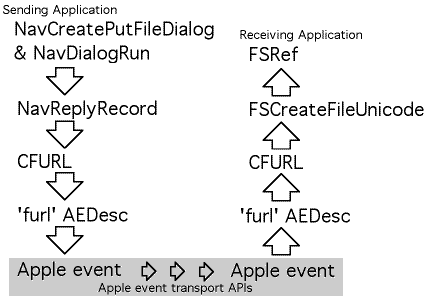

> 导航：[总目录](../../README.md) · [technotes](../../_indexes/technotes.md)


Technical Note TN2022

# The Death of typeFSSpec: Moving Along to typeFileURL

This technote describes the `typeFileURL` data format and discusses how to use this data type to pass references to files between applications in Mac OS X. This new data type provides a convenient way to pass references to files that have yet to be created between applications running in Mac OS X.

The `FSSpec` data type is not suitable for encoding information about files in Mac OS X. Most importantly, an `FSSpec` cannot encode long or Unicode file names such as those used in the Mac OS X file system. In addition, Directory ID numbers and volume reference numbers are application specific in Mac OS X. This means that a directory ID number or volume reference number used in one application will not have any meaning for another applications. `FSSpec` records include volume reference numbers, directory ID numbers, and do not contain sufficient space for long file names. As a result, `FSSpec` does not provide suitable encoding for storing references to files or for passing references to files between applications in Mac OS X.

For the most part, alias records encoded in Apple events provide suitable remedy for the shortcomings of `FSSpec` records, except for one case — references to files that have yet to be created. In these cases, `typeFileURL` is the best way to provide a such a pre-determined file reference.

Users will expect to be able to use longer file names in Mac OS X, and the new Navigation Services routines will allow them to do this. Most importantly, for the purposes of this document, it should be noted that calls to `NavPutFile` have been replaced with the `NavCreatePutFileDialog`/`NavDialogRun` calling sequence that allows a user to provide a longer, Unicode file name that is returned in a CFString. This document discusses how this information can be packaged up for transmission between applications and transmission within Apple event factored applications.

[typeFileURL Defined](#apple-f4xwc4dqnrsv64tfmyxwi33df52wszbpirkfgmjqgaydgmbvhewugsbrfvjukq2ulfiekrsjjrcvkusmircumskoivca)[When to use typeFileURL](#apple-f4xwc4dqnrsv64tfmyxwi33df52wszbpirkfgmjqgaydgmbvhewugsbrfvjukq2xjbcu4vcpkvjuk)[Creating a typeFileURL from a Navigation Services reply](#apple-f4xwc4dqnrsv64tfmyxwi33df52wszbpirkfgmjqgaydgmbvhewugsbrfvjukq2dkjcucvcjjzdvity)[Creating a file referenced by a typeFileURL](#apple-f4xwc4dqnrsv64tfmyxwi33df52wszbpirkfgmjqgaydgmbvhewugsbrfvjukq2dkjcucvcjjzdumuspju)[Advanced routines for using typeFileURL](#apple-f4xwc4dqnrsv64tfmyxwi33df52wszbpirkfgmjqgaydgmbvhewugsbrfvjukq2birlectsdivca)[Downloads](#apple-f4xwc4dqnrsv64tfmyxwi33df52wszbpirkfgmjqgaydgmbvhewugsbrfvjukq2ej5lu4tcpifcfg)[Document Revision History](#apple-f4xwc4dqnrsv64tfmyxwi33df52wszbpirkfgmjqgaydgmbvhewvezlwnfzws33ojbuxg5dpoj4s2rdpnz2ey2lonncwyzlnmvxhiskel4yq)

## typeFileURL Defined

In a nutshell, `typeFileURL` is a Core Foundation URL encoded to a stream of bytes in UTF-8 format. This is the suggested data type to use when your application would like to create a reference to a file that has yet to be created. Furthermore, there are a number of other good reasons to use this type; depending on your processing requirements, you may wish to use this data type in a number of different circumstances. Here are some properties and features of the `typeFileURL` data format:

- `typeAlias` and `typeFSRef` require deterministic reference and cannot refer to files that have yet to be created. `typeFileURL` uses the weak "by name" style reference provided by URLs, and as such is quite capable of providing pre-determined references to files.
- `typeFileURL` provides facilities encoding of special characters in directory and file names including '/', ':', and Unicode characters.
- It is the same data format as the `'furl'` drag flavor. This flavor is attached to drag references containing HFS flavors. It is used internally by the Drag Manager as follows:

  - In the sending application: when a HFS flavor is added to a drag item, the Drag Manager encodes a `'furl'` flavor in the drag item referencing the same file.
  - In the receiving application: The `'furl'` flavor is decoded and used to update the `FSSpec` record's fields in the HFS flavor before it is passed to the receiving application.

  The result is that an application can use the HFS flavors directly without worrying about stale directory ID numbers of volume reference numbers. But, as well, an application that uses the `typeFileURL` data type may use the encoded `'furl'` flavor directly, instead of using the HFS flavor.
- URLs provided by Core Foundation encode mount-point information. As such, `typeFileURL` references are capable of distinguishing between volumes with the same name.
- `typeFileURL` does not encode any process-specific information such as volume reference numbers or directory ID numbers. As such, it is valid to pass this format from process to process.
- `typeFileURL` is a static non-persistent reference. That is, if a `typeFileURL` is created that references a file and that file is later moved, the `typeFileURL` will no longer reference that file. For this type of functionality, you should consider using the `typeAlias` format.

The routines shown in Listing 1 provide a functional definition for the `typeFileURL` format. These routines can be used to convert Apple event descriptor records containing `typeFileURL` data into Core Foundation URLs. Core Foundation URLs themselves provide clear reference to files that can be used by applications.

__Listing 1__  Routines illustrating how to encode and decode 'furl' Apple event descriptor records. These routines provide a functional definition for this data type.

```
 /* encode -> AEDesc     FURLDescFromCFURL encodes a Core Foundation URL into a     Apple event descriptor record and returns a pointer to     the descriptor record. If an error occurs, NULL is     returned. */ AEDesc * FURLDescFromCFURL(AEDesc *furlDesc, CFURLRef url) {     CFDataRef theData;     OSStatus err;     AEDesc *furlResult;          /* set up locals to a known state */     furlResult = NULL;          /* encode the URL to a UTF8 data string */     theData = CFURLCreateData(nil, url, kCFStringEncodingUTF8, true);     if (theData != NULL) {              /* put the data into the descriptor */         err = AECreateDesc('furl', CFDataGetBytePtr(theData),             CFDataGetLength(theData), furlDesc);              /* if successful, set the result */         if (err == noErr) {             furlResult = furlDesc;         }             /* release the local buffer */         CFRelease(theData);     }         /* return a pointer to the furl descriptor */     return furlResult; }      /* decode -> CFURL     FURLDescToCFURL decodes an Apple event descriptor record     containing a furl descriptor and returns a Core Foundation     URL. If an error occurs, NULL is returned. */ CFURLRef FURLDescToCFURL(AEDesc *furlDesc) {     Ptr dataPtr;     Size bytecount;     CFURLRef url;     OSStatus err;          /* set up locals to a known state */     url = NULL;          /* verify the type is correct */     if (furlDesc->descriptorType == 'furl') {              /* count the bytes in the descriptor */         bytecount = AEGetDescDataSize(furlDesc);              /* allocate a local buffer for the bytes */         dataPtr = malloc(bytecount);         if (dataPtr != NULL) {                  /* copy the bytes from the descriptor */             err = AEGetDescData(furlDesc, dataPtr, bytecount);             if (err == noErr) {                      /* create a Core Foundation URL */                 url = CFURLCreateWithBytes(nil, dataPtr, bytecount,                     kCFStringEncodingUTF8, nil);              }                 /* deallocate the local buffer */             free(dataPtr);         }     }         /* return the new URL */     return url; }
```

These are runtime data types used by applications for communications of file locations. As such, a definition of the binary format for this type is not provided in this document. However, developers who are interested in discovering the exact details of the binary encoding used for this data type should consult the Core Foundation documentation.

[Back to Top](#)

## When to use typeFileURL

The `typeFileURL` was specifically designed to allow reference to files that have yet to be created. As such, its primary function is to allow file naming and reference in "Save As..." style Apple events sent between and within applications.

In an application that has been factored and sends Apple events to itself for processing in response to user interface commands, the `typeFileURL` is a necessary encoding mechanism as the traditional encoding schemes not sufficient for encoding references to files that have yet to be created in Mac OS X.

__Figure 1__  An illustration showing how the typeFileURL format is used to encode references to files in Apple events.



__Note:__ In a factored application, both the sending application and the receiving application are one and the same.

[Back to Top](#)

## Creating a typeFileURL from a Navigation Services reply

Naturally, the first step in the process illustrated in Figure 1 is retrieving a Core Foundation URL from the Navigation Services reply that references the file that should be created. In Mac OS X, the Navigation Services reply record returned by a `NavCreatePutFileDialog`/`NavDialogRun` sequence will contain an `FSRef` referring to the folder where the new file should be created in the first AEDesc record in the AEDescList contained in the `NavReplyRecord`'s `selection` field, and the name of the new file will contained in the CFString referred to by the `saveFileName` field. Listing 2 illustrates one way this can be done.

__Listing 2__  An example of how one could generate a Core Foundation URL from a Navigation Services reply record returned by a NavCreatePutFileDialog/NavDialogRun sequence.

```
 /* GetCFURLFromNavReply returns a URL referencing a file that     is yet to be created in response to a     NavCreatePutFileDialog/NavDialogRun sequence */ CFURLRef GetCFURLFromNavReply(const NavReplyRecord * navReply) {     OSStatus err;     FSRef parentFSRef;     CFURLRef parentURLRef, fullURLRef;     AEKeyword theAEKeyword;     DescType typeCode;     Size actualSize;          /* ensure locals are in a known state */     fullURLRef = NULL;          /* get the FSRef referring to the parent directory */     err = AEGetNthPtr(&navReply->selection, 1, typeFSRef,         &theAEKeyword, &typeCode, &parentFSRef, sizeof(FSRef), &actualSize);     if (err == noErr) {              /* convert the FSRef into a Core Foundation URL */         parentURLRef = CFURLCreateFromFSRef(NULL, &parentFSRef);         if (parentURLRef != NULL) {                  /* add the file name to the end of the url */             fullURLRef = CFURLCreateCopyAppendingPathComponent(NULL,                 parentURLRef, navReply->saveFileName, false);                  /* release the path to the parent */             CFRelease(parentURLRef);         }     }         /* return the reference to the new URL */     return fullURLRef; }
```

Once the file reference has been encoded as a CFURL, a routine such as `FURLDescFromCFURL` (see Listing 1) can be used to encode it into a Apple event descriptor record as an `'furl'` formatted descriptor. Once it has been converted into this format, it is ready for transport in an Apple event.

[Back to Top](#)

## Creating a file referenced by a typeFileURL

For decoding an Apple event descriptor record containing a `typeFileURL` your application would use a technique similar to the one presented in the `FURLDescToCFURL` routine shown in Listing 1. This will provide a CFURL referencing the file that is to be created, which in turn can be used to generate both a reference to the directory (where the file should be created), and the name of the file to create. These items can then be passed to `FSCreateFileUnicode`, shown in Listing 3, to perform the file creation operation. Once the file has been created, it can be referenced using an `FSRef` record.

__Listing 3__  An example of how one could create a file referenced by a CFURL using the FSCreateFileUnicode routine.

```
 /* CreateFileUsingCFURL creates the file referenced by     the CFURL using the supplied catalog parameters. */ OSStatus CreateFileUsingCFURL(             FSRef *newFileReference,             CFURLRef url,             FSCatalogInfoBitmap whichInfo,             const FSCatalogInfo * catalogInfo) {      CFURLRef parentURL;     CFStringRef fileNameRef;     FSRef parentDirectory;     UniCharPtr nameStringPtr;     OSStatus err;          /* set locals to a known state */     err = coreFoundationUnknownErr;          /* get the url to the parent directory */     parentURL = CFURLCreateCopyDeletingLastPathComponent(NULL, url);     if (parentURL != NULL) {              /* convert the URL to a FSRef */         if (CFURLGetFSRef(parentURL, &parentDirectory)) {                  /* get the leaf name from the URL */             fileNameRef = CFURLCopyLastPathComponent(url);             if (fileNameRef != NULL) {                      /* get the leaf name from the URL */                 nameStringPtr = CFStringGetCharactersPtr(fileNameRef);                 if (nameStringPtr != NULL) {                          /* create the file */                     err = FSCreateFileUnicode(                         &parentDirectory,                         CFStringGetLength(fileNameRef),                         nameStringPtr,                         whichInfo, catalogInfo,                         newFileReference, NULL);                 }                     /* release the file name */                 CFRelease(fileNameRef);             }         }             /* release the parent url */         CFRelease(parentURL);     }         /* return the status value */     return err; }
```

[Back to Top](#)

## Advanced routines for using typeFileURL

Sample code presented in this document was chosen for illustration and was designed to present ideas. More advanced users may wish to consult sample code listings provided in the attached download file. These source files include:

- Apple event coercion handlers for automatic conversion to/from `typeFileURL`, `typeChar`, `typeStyledText`, `typeUnicodeText`, `cFile`, `typeFSS`, `typeFSRef`, `typeAlias`, and `typeObjectSpecifier`
- Utility routines for using `typeFileURL` records in Apple event records

[Back to Top](#)

## Downloads

- Advanced typeFileURL routines ("tn2022_code.zip", 9.7K)

[Back to Top](#)

---

#### Document Revision History

| __Date__ | __Notes__ |
| 2011-07-27 | Reformatted content and made minor editorial changes. |
| 2001-06-07 | New document that discusses the typeFileURL format and how to use it to pass file references between applications in Mac OS X. |

