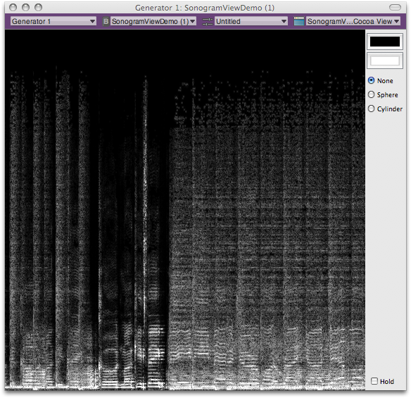

> 导航：[总目录](../../README.md) · [technotes](../../_indexes/technotes.md)


# Retired Document

__Important:__
This document may not represent best practices for current development. Links to downloads and other resources may no longer be valid.

Technical Note TN2200

# The Sonogram View Demo Audio Unit

__Important:__ This document may not represent best practices for current development. Links to downloads and other resources may no longer be valid.

Read this document if you are an audio unit developer, conversant in the Objective-C and C++ programming languages, who would like to make use of any of the advanced audio unit features that the associated sample project demonstrates. Once you are familiar with building and using the project, continue by studying its project files.

[Introduction](#apple-f4xwc4dqnrsv64tfmyxwi33df52wszbpirkfgmjqgaydinbxgawugsbrfvke4vcbi4yq)[Using the Sonogram View Demo Audio Unit](#apple-f4xwc4dqnrsv64tfmyxwi33df52wszbpirkfgmjqgaydinbxgawugsbrfvkvgskoi5pviscfl5ju6tspi5jectk7kzeukv27ircu2t27ifkuiskpl5ku4sku)[Obtaining the Project](#apple-f4xwc4dqnrsv64tfmyxwi33df52wszbpirkfgmjqgaydinbxgawugsbrfvkvgskoi5pviscfl5ju6tspi5jectk7kzeukv27ircu2t27ifkuiskpl5ku4skufvhuevcbjfhestshl5keqrk7kbje6ssfinka)[Building and Installing the Audio Unit](#apple-f4xwc4dqnrsv64tfmyxwi33df52wszbpirkfgmjqgaydinbxgawugsbrfvkvgskoi5pviscfl5ju6tspi5jectk7kzeukv27ircu2t27ifkuiskpl5ku4skufvbfkskmireu4r27ifheix2jjzjviqkmjreu4r27kreekx2bkvcest27kvhesva)[Hosting and Using the Audio Unit](#apple-f4xwc4dqnrsv64tfmyxwi33df52wszbpirkfgmjqgaydinbxgawugsbrfvkvgskoi5pviscfl5ju6tspi5jectk7kzeukv27ircu2t27ifkuiskpl5ku4skufvee6u2ujfheox2bjzcf6vktjfheox2ujbcv6qkvireu6x2vjzevi)[Exploring the Project Source Files](#apple-f4xwc4dqnrsv64tfmyxwi33df52wszbpirkfgmjqgaydinbxgawugsbrfvkvgskoi5pviscfl5ju6tspi5jectk7kzeukv27ircu2t27ifkuiskpl5ku4skufvcvqucmj5jestshl5keqrk7kbje6ssfinkf6u2pkvjegrk7izeuyrkt)[External References](#apple-f4xwc4dqnrsv64tfmyxwi33df52wszbpirkfgmjqgaydinbxgawugsbrfvcvqvcfkjhectc7kjcumrksivhegrkt)[Document Revision History](#apple-f4xwc4dqnrsv64tfmyxwi33df52wszbpirkfgmjqgaydinbxgawvezlwnfzws33ojbuxg5dpoj4s2rdpnz2ey2lonncwyzlnmvxhiskel4yq)

## Introduction

The Sonogram View Demo audio unit draws a realtime sonogram generated from audio you play through it. It demonstrates a variety of advanced audio unit features, while its Xcode project files provide the real-world code that implements these features.

Use the Sonogram View Demo project to learn about:

- Creating custom Cocoa views for audio units
- Using Core Image filters to visualize audio
- Using the Mac OS X Vector Library (vecLib) framework, part of the Accelerate framework
- Converting audio data streams between the time and frequency domains
- Managing variable packet size, overlapping FFT analysis windows, and variable analysis window size

The Sonogram View Demo audio unit is an override of the AUEffectBase class, part of the audio unit class hierarchy provided in the Core Audio SDK.

As sample code, this Xcode project comes with the usual proviso that the code favors clarity of demonstration over optimization—in this case, the drawing is not optimized. Refer to Reference Library > Graphics & Imaging to learn about drawing in Mac OS X.

__Figure 1__  Sonogram View

[Back to Top](#)

## Using the Sonogram View Demo Audio Unit

This section describes how to get and build the Sonogram View Demo audio unit Xcode project, and how to install and use the resulting audio unit. It also provides an introduction to exploring the project’s source files.

__Important:__ To build the Sonogram View Demo project, use Xcode 3.0 or later. To host the audio unit you build with the project, use AU Lab 2.0 or later, and Mac OS X v10.5 or later.

### Obtaining the Project

The Sonogram View Demo project is installed when you install Xcode Tools, provided on the Mac OS X installation DVD. You can also obtain it from the ADC website.

Once installed, find the project at this location on your hard disk:

When this document refers to the Core Audio SDK, it means the entire contents of this folder:

### Building and Installing the Audio Unit

To build the Sonogram View Demo project:

1. Double-click the SonogramViewDemo.xcodeproj file. Xcode opens and displays the project window.
2. Build the project by clicking the Build button in the toolbar or by pressing Command-B.

To install the newly built audio unit, do one of the following:

- Option one. Create a symbolic link to the audio unit from your Plug-Ins/Components/ directory by entering the following command line in Terminal, on a single line—taking care to include a space character before the tilde:

  ln -s /Developer/Examples/CoreAudio/SimpleSDK/SonogramViewDemo/build/Development/SonogramViewDemo.component ~/Library/Audio/Plug-Ins/Components/SonogramViewDemo.component
- Option two. Copy the new audio unit from the build/Development folder into your Plug-Ins/Components directory.

### Hosting and Using the Audio Unit

You can use any audio unit host application to run the Sonogram View Demo audio unit, provided you are using Mac OS X v10.5 or later. The procedure here uses the reference audio unit host, AU Lab. To follow these steps, you’ll need an audio file in any format supported by Mac OS X.

First, set up AU Lab and make some audio material available to play, as follows:

1. Open the AU Lab application, located here:

   /Developer/Applications/Audio/

   The Development Configuration Assistant window opens. Click Next.
2. Click Add Input, then click Next.
3. Click Done. A new AU Lab document window opens.
4. In AU Lab, choose Edit > Add Audio Unit Generator.
5. In the Add Audio Unit Generator dialog, ensure that AUAudioFilePlayer is showing in the pop-up menu. Click OK. The file player inspector window appears.
6. Add one or more audio files to the Audio Files list in the player inspector window. Do this by dragging audio files from the Finder into the Audio Files list. In the list, select the file you want to play.

Now, ensure that everything is set up correctly, as follows. Click the Play button (right-facing triangle) in the player inspector window. The Play button becomes a Pause button, and the selected audio file plays.

Before continuing, click the Pause button to stop the audio.

Next, add the Sonogram View Demo audio unit to AU Lab, and play audio through it:

1. In the AU Lab document window, open the Effects pop-up menu in the Generator channel. Choose Apple Demo > SonogramViewDemo. The view opens for the Sonogram View Demo audio unit.
2. Click the Play button in the player inspector window. The selected audio file plays, and the Sonogram View Demo audio unit’s view displays a realtime sonogram of the audio.

Controls in the Sonogram View Demo audio unit’s view let you:

- Set the background color as well as the color of the trace
- Warp the display over a sphere or cylinder
- Freeze the display

### Exploring the Project Source Files

This section introduces the most important classes used in the Sonogram View Demo code and briefly describes the implementation of the audio unit and its view.

#### The Sonogram View Demo Project

For an overview of how audio unit projects are laid out, refer to Audio Unit Programming Guide. That document also describes the role of the Core Audio SDK in building audio units.

#### The CASonogramView Class

The CASonogramView class, written in Objective-C, draws the sonogram for the audio unit. You can see its implementation in the corresponding source and interface files in the project’s CocoaUI directory.

This class is a subclass of the SonogramViewDemoView class (in the same folder). It uses an NSTimer object for updating the view content. A CASonogramView object draws into a CIImage object. For more on the CIImage class, which is part of Core Image’s Quartz Core framework, see CIImage Class Reference.

A CASonogramView object makes use of a CARingBuffer object for storing processed frames of audio data. The implementation files for the CARingBuffer class are in the Core Audio SDK’s PublicUtility directory.

#### The CASpectralProcessor Class

The CASpectralProcessor class, written in C++, supports audio processing by converting audio data from the time domain into the frequency domain, or vice versa. It is part of the Core Audio SDK, in the PublicUtility directory.

You can use this class in three ways:

- Roundtrip processing, using the Process method. This takes time domain data, converts it to the frequency domain, lets you process it, and then converts it back to the time domain. This is the method to use for fast Fourier transform (FFT) work.
- Time-to-frequency domain processing, using the ProcessForwards method. This method lets you retrieve audio data and work with it in the frequency domain. The Sonogram View Demo audio unit uses this method.
- Frequency-to-time domain processing, using the ProcessBackwards method. This performs the inverse of the ProcessForwards method, converting frequency domain data to the time domain.

The CASpectralProcessor class’s initialization method is:

__Listing 1__  CASpectralProcessor constructor

```
CASpectralProcessor (
    UInt32 inFFTSize,        // The size of the FFT you want to perform
    UInt32 inHopSize,        // The overlap between frames
    UInt32 inNumChannels,    // The number of audio channels to process
    UInt32 inMaxFrames       // the maximum number of frames received per slice
);
```

Because the Sonogram View Demo audio unit does not perform digital signal processing (DSP) on its incoming audio data—it simply visualizes it—it uses the CASpectralProcessor class’s ProcessForwards method:

__Listing 2__  CASpectralProcessor::ProcessForwards

```
bool ProcessForwards (
    UInt32 inNumFrames,
    AudioBufferList* inInput
);
```

If you want to use a CASpectralProcessor object to process audio, you define a DSP function and then give the object a pointer to your function, using the SetSpectralFunction method:

__Listing 3__  CASpectralProcessor::SetSpectralFunction

```
void SetSpectralFunction (
    SpectralFunction  inFunction,
    void              *inUserData
);
```

#### The SonogramViewDemo and SonogramViewDemoView classes

The SonogramViewDemo class is the main class for the audio unit. It does its work in its Render method:

__Listing 4__  SonogramViewDemo::Render

```
ComponentResult Render (
    AudioUnitRenderActionFlags  &ioActionFlags,
    const AudioTimeStamp        &inTimeStamp,
    UInt32                      inFramesToProcess
);
```

This method places its output data into a CARing object, which is then queried by the audio unit’s view.

The SonogramViewDemoView class is the main class for the audio unit’s view. It periodically requests the latest data to display, using its updateSpectrum method:

The view then sends the frequency domain audio data to the CASonogramView object, which buffers the data in RGBA (Red Green Blue + Alpha) format. The CASonogramView object goes on to draw the spectrogram by overriding the NSView class’s drawRect method:

To perform the drawing, the CASonogramView object first instantiates a CIImage object. It then fetches the buffered RGBA data and sends it to the CIImage object. The CIImage object, in turn, aligns and filters the data using Core Image filters.

[Back to Top](#)

## External References

- [Audio Documentation](https://developer.apple.com/documentation/MusicAudio/index.html)
- [Audio Unit Programming Guide](https://developer.apple.com/documentation/MusicAudio/Conceptual/AudioUnitProgrammingGuide/index.html)
- [Audio and MIDI on Mac OS X](https://developer.apple.com/audio/pdf/coreaudio.pdf)
- [CoreAudio Mailing List](http://lists.apple.com/mailman/listinfo/coreaudio-api)
- Example Audio Units - /Developer/Examples/CoreAudio/AudioUnits/
- PublicUtility - /Developer/Examples/CoreAudio/PublicUtility/

[Back to Top](#)

---

#### Document Revision History

| __Date__ | __Notes__ |
| 2007-11-07 | New document that describes the advanced audio unit features that the associated sample project demonstrates. |

