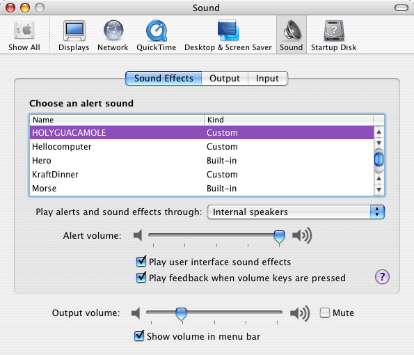
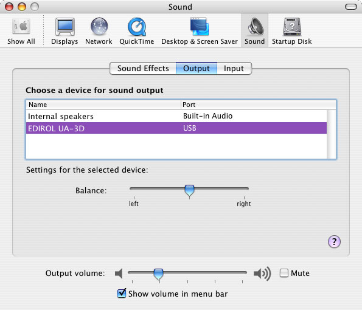

> 导航：[总目录](../../README.md) · [technotes](../../_indexes/technotes.md)


# Retired Document

__Important:__
This document may not represent best practices for current development. Links to downloads and other resources may no longer be valid.

Technical Note TN2102

# The System Sound APIs for Mac OS X v10.2 through v10.4

__Important:__ This document may not represent best practices for current development. Links to downloads and other resources may no longer be valid.

This technote discusses the System Sound APIs for correctly playing Alerts and User Interface Sound Effects available in SystemSound.h on Mac OS X 10.2, 10.3 and later.

__Note:__ For Mac OS X v10.5 and later use the `AudioServices` set of APIs which provide the same feature set. See `AudioServices.h` and the [System Sound Services Reference](https://developer.apple.com/library/mac/#documentation/AudioToolbox/Reference/SystemSoundServicesReference/Reference/reference.html)

[Introduction](#apple-f4xwc4dqnrsv64tfmyxwi33df52wszbpirkfgmjqgaydgmrqgywugsbrfvke4vcbi4yq)[The System Sound APIs](#apple-f4xwc4dqnrsv64tfmyxwi33df52wszbpirkfgmjqgaydgmrqgywugsbrfvke4vcbi42q)[Alert Sounds](#apple-f4xwc4dqnrsv64tfmyxwi33df52wszbpirkfgmjqgaydgmrqgywugsbrfvke4vcbi42a)[User Interface Sound Effects](#apple-f4xwc4dqnrsv64tfmyxwi33df52wszbpirkfgmjqgaydgmrqgywugsbrfvke4vcbi43a)[Creating SystemSoundActionIDs](#apple-f4xwc4dqnrsv64tfmyxwi33df52wszbpirkfgmjqgaydgmrqgywugsbrfvke4vcbi43q)[Completion Routines](#apple-f4xwc4dqnrsv64tfmyxwi33df52wszbpirkfgmjqgaydgmrqgywugsbrfvke4vcbi44a)[Example Usage](#apple-f4xwc4dqnrsv64tfmyxwi33df52wszbpirkfgmjqgaydgmrqgywugsbrfvke4vcbi44q)[Document Revision History](#apple-f4xwc4dqnrsv64tfmyxwi33df52wszbpirkfgmjqgaydgmrqgywvezlwnfzws33ojbuxg5dpoj4s2rdpnz2ey2lonncwyzlnmvxhiskel4yq)

## Introduction

Mac OS X allows users to personally select their preferred audio device for Alerts and Sound Effects (the __Default System Output Device__), as well as the sound output device for all other audio generated by the system (the __Default Output Device__). These can either be set to the same device (for example Internal speakers) or two completely different devices.

The System Sound API allows developers to correctly play Alert Sounds with all the attributes and respecting all system settings for Alerts. This includes flashing the screen in circumstances where audio output is unavailable or because of a user specified preference such as Mute or the Universal Access Hearing Preference "Flash the screen when an alert sound occurs".

System Sound also allows developers to correctly play User Interface Sound Effects if the "Play user interface sound effects" checkbox is checked (see Figure 1).

In both cases, the audio will be directed to the __Default System Output Device__ selected for Alerts and Sound Effects.

Figure 1 shows the __Default System Output__ device for Alert Sounds and Sound Effects (selected from the "Play alerts and sound effects through:" popup) set to Internal speakers, while figure 2 shows the chosen __Default Output Device__ set to the EDIROL UA-3D USB device.

A typical user configuration may be iTunes playing purchased music out a pair of USB speakers (__Default Output Device__) while Alerts and Sound Effects play though the Internal speakers (__Default System Output Device__). Using the System Sound APIs will guarantee that your application never plays an Alert or Sounds Effect out the wrong device, possibly a pair of speakers turned up very loud blasting SpinalTap's greatest hits.

__Note:__ If your application makes use of alert sounds, using the System Sound APIs is a better approach than using some heavier weight methods to play these sound such as NSSound or QuickTime.

__Figure 1__  Alerts and Sound Effects.



__Figure 2__  Sound Output.

[Back to Top](#)

## The System Sound APIs

The following APIs are defined in "SystemSound.h", part of the OSServices framework, which in turn is part of the CoreServices umbrella framework.

[Back to Top](#)

## Alert Sounds

__(available on Mac OS X 10.2 and later)__

There are two APIs for playing Alert Sounds.

`AlertSoundPlay` (available on Mac OS X 10.2 and later) equates to and supersedes the traditional Mac OS call `SysBeep`. It takes no parameters and will play the currently selected alert sound out the selected __Default System Output Device__ (see Figure 1). This call will interrupt any previously playing alert sound.

```
void AlertSoundPlay(void);
```

`AlertSoundPlayCustomSound` (available on Mac OS X 10.3 and later) takes a `SystemSoundActionID` and will play an alert sound designated by this actionID with the same behavior as `AlertSoundPlay`.

```
void AlertSoundPlayCustomSound(SystemSoundActionID inAction)  inAction: A SystemSoundActionID indicating the desired           Sound to be played with AlertSound behavior.
```

[Back to Top](#)

## User Interface Sound Effects

__(available on Mac OS X 10.3 and later)__

There is a single API for playing User Interface Sound Effects.

`SystemSoundPlay` takes a `SystemSoundActionID` and will immediately play the sound designated by this actionID out the selected __Default System Output Device__ (see Figure 1). This call should be used for one time user interface actions that do not require a duration or modification during playback. Sustain loops in the sound will be ignored.

__Warning:__ `SystemSoundPlay` was actually exported in Mac OS X 10.2 and SystemSound.h says that it is available on Mac OS X 10.2.

Although technically correct, calling `SystemSoundPlay` on Mac OS X 10.2.x causes an immediate crash. While this behavior can be mildly amusing it is not really very useful (we think you may agree), therefore this technical note has marked `SystemSoundPlay` as available on Mac OS X 10.3 and later.

```
void SystemSoundPlay(SystemSoundActionID inAction)  inAction: A SystemSoundActionID indicating the desired           System Sound to be played.
```

[Back to Top](#)

## Creating SystemSoundActionIDs

__(available on Mac OS X 10.2 and later)__

There are two APIs for working with `SystemSoundActionIDs`.

`SystemSoundGetActionID` allows you to create a 'custom' sound `SystemSoundActionID` by providing an audio file. Use this call to add a sound to the System Sound Server that can be played via `SystemSoundPlay` or `AlertSoundPlayCustomSound`. This call takes an FSRef \* designating the audio file and if successful will return a `SystemSoundActionID`.

```
OSStatus SystemSoundGetActionID(   const FSRef * userFile,   SystemSoundActionID * outAction)  userFile: An const FSRef * for the audio file to be used as a System Sound.           Any audio file supported by the AudioFile APIs in the           AudioToolbox framework may be used.  outAction: If successful, a SystemSoundActionID will be returned,            which in turn can be passed to SystemSoundPlay() or            AlertSoundPlayCustomSound().
```

`SystemSoundRemoveActionID` allows you to remove a 'custom' sound. Use this call when you no longer need to use the 'custom' sound that was created by `SystemSoundGetActionID`. You must remember to call this funtion so the System Sound Server can release resources that are no longer needed. This call takes a single `SystemSoundActionID` parameter.

```
OSStatus SystemSoundRemoveActionID(SystemSoundActionID inAction)  inAction: A SystemSoundActionID indicating the desired System Sound           to be removed.
```

[Back to Top](#)

## Completion Routines

__(available on Mac OS X 10.3 and later)__

There are two APIs which let you to work with Completion Routines.

`SystemSoundSetCompletionRoutine` allows you to set a completion routine which is associated with a specific `SystemSoundActionID`. This completion routine will be called when the System Sound Server finishes playing the designated 'custom' sound.

```
OSStatus SystemSoundSetCompletionRoutine(   SystemSoundActionID inAction,   CFRunLoopRef inRunLoop,   CFStringRef inRunLoopMode,   SystemSoundCompletionUPP inCompletionRoutine,   void * inUserData  inAction: The SystemSoundActionID that the completion routine will be           associated with.  inRunLoop: A CFRunLoopRef indicating the desired run loop the completion            routine should be run on. Pass NULL for the main run loop.  inRunLoopMode: A CFStringRef indicating the run loop mode for the runloop                mode for the runloop where the completion routine will be                executed. Pass NULL to use kCFRunLoopDefaultMode.  inCompletionRoutine: A SystemSoundCompletionProc for the completion                      routine proc to be called when the provided                      SystemSoundActionID has completed playing in                      the server.  inUserData: A void * to pass user data to the completion routine.
```

`SystemSoundRemoveCompletionRoutine` removes the Completion Routine associated with a specific `SystemSoundActionID`. Call this function when you no longer want a Completion Routine set for an associated 'custom' sound to be called when the sound has finished playing.

```
void SystemSoundRemoveCompletionRoutine(SystemSoundActionID inAction)  inAction: A SystemSoundActionID that currently has an associated           completion routine.
```

[Back to Top](#)

## Example Usage

__Listing 1__  Playing a custom Alert Sound.

```
SystemSoundActionID gFunkSoundID = 0;  OSStatus CreateFunkActionID(void) {   const char *soundFilePath = "/System/Library/Sounds/Funk.aiff";   FSRef soundFileRef;   OSStatus err;    err = FSPathMakeRef(soundFilePath, &soundFileRef, NULL);   if (noErr == err) {     err = SystemSoundGetActionID(&soundFileRef, &gFunkSoundID);   }    return err; }  void MyDoSomethingFunction(void) {   .   .   .   if (badBadThing)     AlertSoundPlayCustomSound(gFunkSoundID);     // NOTE: Make sure to not remove the Action ID     // immediately following this call, you must give     // the system a chance to actually play the sound.   .   .   . }  void MyCleanUpActionID(void) {   // Remember to call SystemSoundRemoveActionID for the ActionID   // when you are completely done with it.   // NOTE: Do not remove the Action ID before the system is given a   // chance to play the sound as noted above.     SystemSoundRemoveActionID(gFunkSoundID); }
```

[Back to Top](#)

---

#### Document Revision History

| __Date__ | __Notes__ |
| 2011-05-23 | Editorial |
| 2004-07-13 | Editorial changes and spelling. |
| 2004-02-13 | New document that discusses the System Sound APIs for correctly playing Alerts and User Interface Sound Effects |

