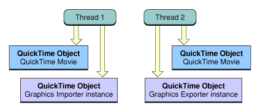
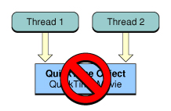
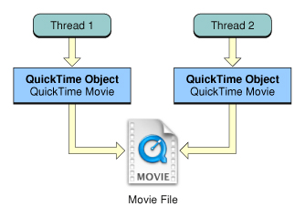
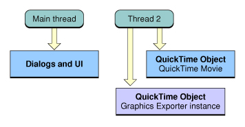
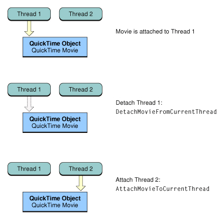
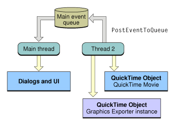

> 导航：[总目录](../../README.md) · [technotes](../../_indexes/technotes.md)


Technical Note TN2125

# Thread-safe programming in QuickTime

The technical note introducing QuickTime 1.0 in 1992 began with the phrase "The world isn't standing still -- it's moving, fast". Since its introduction QuickTime has kept pace, evolving over the years from a mere 500 APIs to over 2500, adding support for new video, still image and audio formats, streaming, interactivity and so on. Since the release of Mac OS X 10.3, QuickTime has allowed developers to move common processor-intensive QuickTime operations to background threads enabling more powerful and responsive applications.

This technical note is aimed at QuickTime developers who are targeting Mac OS X 10.3 or later and want to add multithreading support to their applications or components.

If you're interested in adding multithreading support to your QuickTime application or component but are not familiar with the vocabulary or concepts of multithreaded application development, refer to the following list of reference materials:

Technical Books List

To take advantage of QuickTime's multithreading support, you must be working with Mac OS X 10.3 or later and QuickTime 6.4 or later. Earlier versions of Mac OS X do not provide the system level support required for QuickTime to be called from background threads, even with the latest version of QuickTime installed.

QuickTime 7 provides even greater flexibility, the adoption of Core Audio under the hood for example removed many of the earlier limitations when working with certain sound media formats.

QTKit developers who would like to take advantage of the thread-safety support discussed in this document must target Mac OS X 10.5 or QuickTime 7.3 or later. Previous versions do not provide the QTKit framework APIs required to support thread-safe operations.

[Introduction](#apple-f4xwc4dqnrsv64tfmyxwi33df52wszbpirkfgmjqgaydgmzzgiwugsbrfvjukq2ujfhu4mi)[Thread-safe Operations](#apple-f4xwc4dqnrsv64tfmyxwi33df52wszbpirkfgmjqgaydgmzzgiwugsbrfvjukq2ujfhu4mq)[What can be made thread-safe](#apple-f4xwc4dqnrsv64tfmyxwi33df52wszbpirkfgmjqgaydgmzzgiwugsbrfvjvkqstivbviskpjyza)[What is not thread-safe](#apple-f4xwc4dqnrsv64tfmyxwi33df52wszbpirkfgmjqgaydgmzzgiwugsbrfvjvkqstivbviskpjyzq)[Advice for Application Developers](#apple-f4xwc4dqnrsv64tfmyxwi33df52wszbpirkfgmjqgaydgmzzgiwugsbrfvjukq2ujfhu4ni)[Calling EnterMoviesOnThread](#apple-f4xwc4dqnrsv64tfmyxwi33df52wszbpirkfgmjqgaydgmzzgiwugsbrfvjvkqstivbviskpjy2q)[Moving QuickTime objects between threads](#apple-f4xwc4dqnrsv64tfmyxwi33df52wszbpirkfgmjqgaydgmzzgiwugsbrfvjvkqstivbviskpjy3a)[Dealing with Callbacks](#apple-f4xwc4dqnrsv64tfmyxwi33df52wszbpirkfgmjqgaydgmzzgiwugsbrfvjvkqstivbviskpjy3q)[Dealing with the Resource Manager](#apple-f4xwc4dqnrsv64tfmyxwi33df52wszbpirkfgmjqgaydgmzzgiwugsbrfvjvkqstivbviskpjy4a)[Scenarios and Sample Code](#apple-f4xwc4dqnrsv64tfmyxwi33df52wszbpirkfgmjqgaydgmzzgiwugsbrfvjvkqstivbviskpjy4q)[Working with the QTKit Framework](#apple-f4xwc4dqnrsv64tfmyxwi33df52wszbpirkfgmjqgaydgmzzgiwugsbrfvjukq2ujfhu4mjr)[Overview](#apple-f4xwc4dqnrsv64tfmyxwi33df52wszbpirkfgmjqgaydgmzzgiwugsbrfvjvkqstivbviskpjyytc)[QTMovie Class Methods](#apple-f4xwc4dqnrsv64tfmyxwi33df52wszbpirkfgmjqgaydgmzzgiwugsbrfvjvkqstivbviskpjyyte)[QTMovie Instance Methods](#apple-f4xwc4dqnrsv64tfmyxwi33df52wszbpirkfgmjqgaydgmzzgiwugsbrfvjvkqstivbviskpjyytg)[Beware the underlying QuickTime Movie Controller](#apple-f4xwc4dqnrsv64tfmyxwi33df52wszbpirkfgmjqgaydgmzzgiwugsbrfvjvkqstivbviskpjyyti)[Sample Code](#apple-f4xwc4dqnrsv64tfmyxwi33df52wszbpirkfgmjqgaydgmzzgiwugsbrfvjvkqstivbviskpjyytm)[QTKit Capture](#apple-f4xwc4dqnrsv64tfmyxwi33df52wszbpirkfgmjqgaydgmzzgiwugsbrfvjvkqstivbviskpjyyto)[QuickTime for Windows](#apple-f4xwc4dqnrsv64tfmyxwi33df52wszbpirkfgmjqgaydgmzzgiwugsbrfvjukq2ujfhu4mjz)[Advice for Component Developers](#apple-f4xwc4dqnrsv64tfmyxwi33df52wszbpirkfgmjqgaydgmzzgiwugsbrfvjukq2ujfhu4mrq)[Use the one-shot Component Manager resource APIs](#apple-f4xwc4dqnrsv64tfmyxwi33df52wszbpirkfgmjqgaydgmzzgiwugsbrfvjvkqstivbviskpjyzda)[Don't use the Component RefCon to store global state](#apple-f4xwc4dqnrsv64tfmyxwi33df52wszbpirkfgmjqgaydgmzzgiwugsbrfvjvkqstivbviskpjyzdc)[Consider putting constant tables into your executable](#apple-f4xwc4dqnrsv64tfmyxwi33df52wszbpirkfgmjqgaydgmzzgiwugsbrfvjvkqstivbviskpjyzde)[Set the Component thread-safe flag](#apple-f4xwc4dqnrsv64tfmyxwi33df52wszbpirkfgmjqgaydgmzzgiwugsbrfvjvkqstivbviskpjyzdg)[QuickTime Thread-safe components](#apple-f4xwc4dqnrsv64tfmyxwi33df52wszbpirkfgmjqgaydgmzzgiwugsbrfvjukq2ujfhu4mrv)[References](#apple-f4xwc4dqnrsv64tfmyxwi33df52wszbpirkfgmjqgaydgmzzgiwugsbrfvjukq2ujfhu4mrw)[Technical Books List](#apple-f4xwc4dqnrsv64tfmyxwi33df52wszbpirkfgmjqgaydgmzzgiwugsbrfvjvkqstivbviskpjyzdm)[Mac OS X](#apple-f4xwc4dqnrsv64tfmyxwi33df52wszbpirkfgmjqgaydgmzzgiwugsbrfvjvkqstivbviskpjyzdo)[PThreads and Multithreading](#apple-f4xwc4dqnrsv64tfmyxwi33df52wszbpirkfgmjqgaydgmzzgiwugsbrfvjvkqstivbviskpjyzdq)[Tools](#apple-f4xwc4dqnrsv64tfmyxwi33df52wszbpirkfgmjqgaydgmzzgiwugsbrfvjvkqstivbviskpjyzds)[Document Revision History](#apple-f4xwc4dqnrsv64tfmyxwi33df52wszbpirkfgmjqgaydgmzzgiwvezlwnfzws33ojbuxg5dpoj4s2rdpnz2ey2lonncwyzlnmvxhiskel4yq)

## Introduction

QuickTime's heritage on traditional Mac OS (System 6.0.8 through Mac OS 9) meant that many of the original APIs were designed to be called from a single thread. Mac OS X, however, introduced Macintosh developers to the power of true multiprocessing -- the ability to perform multiple simultaneous operations in __multiple applications__ at once. Mac OS X also removed some traditional Mac OS limitations regarding the types of tasks that could be performed with multiple threads from within any __single application__.

Why is this important when developing a QuickTime application?

To answer this question, let's suppose that all processing operations were instantaneous. If this were true, all operations could be run in theory, from the same thread. In reality however, many common operations can in fact take time. When these processor intensive operations delay application responsiveness by blocking the user interface, or by limiting the number of tasks that can be performed at once, the user experience suffers. Your application can benefit whenever you can perform a QuickTime operation that doesn't require any direct user interaction and can run regardless of whatever is happening on the main thread.

As an example, think about movie compression -- a somewhat time consuming processes. Maybe your application would like to compress two movies at the same time, or play one movie while compressing another. These types of QuickTime operations prior to Mac OS X 10.3 may have introduced unacceptable processing delays or lack of application responsiveness.

Now consider moving this operation from the main thread (the user interface blocking thread) to a background thread, or even a number of background threads. Your application could then compress and export multiple movies in different formats all at the same time while playing another movie or performing some other task all without blocking the user interface.

The design goal of QuickTime's multithreading support for Mac OS X 10.3 and later specifically addresses this problem. QuickTime will now allow developers to move processor-intensive tasks to background threads, freeing up the main thread thereby improving an application's speed, responsiveness and overall performance.

[Back to Top](#)

## Thread-safe Operations

Mac OS X 10.3 and later now allows you to perform the following QuickTime operations from background threads:

- Opening movie files
- Rendering Movies
- Compressing and exporting Movies
- Still image Import and Export

These types of operations can take up a great deal of processing time thus causing CPU bottlenecks and user interface responsiveness problems. They are ideal to move to background threads.

__Important:__ Movie __playback__ has always avoided blocking the user interface. It has been this way since QuickTime 1.0 and continues to be true.

Before discussing what can be made thread-safe, we need to define a few terms; QuickTime Movie, Movie file, QuickTime object and Disjoint.

- QuickTime Movie - an opaque QuickTime data structure in memory referencing time-based media.
- Movie File - a file containing some media sample data that sits on disk. A movie file may, or may not be a QuickTime movie file (.mov). For example, a movie file could be an MPEG4 file (.mp4) imported and being viewed as a QuickTime Movie.
- QuickTime object - in the context of this technical note this term is used as a generic reference to any of the QuickTime data types. A QuickTime object could be some opaque data structure like a QuickTime Movie, a Component Instance, Decompression sequence and so on.
- Disjoint - Having no elements in common.

__Note:__ It is important to understand the above distinction between a QuickTime Movie (the data structure in memory) and a movie file (the file on disk).

### What can be made thread-safe

QuickTime applications working with the following toolbox managers can be made thread-safe:

- Movie Toolbox (Import, Rendering, Creation, Export)
- Image Compression Manager
- QuickDraw (Offscreen GWorlds)
- Component Manager
- Alias Manager
- Memory Manager

Independent threads in your application can safely use logically disjoint sets of QuickTime objects from multiple threads. If one thread has its own unique set of QuickTime objects and another thread has its own unique set, then any operation performed on these objects can be considered thread-safe. The two threads must have no QuickTime objects in common. See Figure 1.

For example, two background threads could import a .DV stream then step through each Movie using APIs such as `GetNextInterestingTime`, `SetMovieTime` and render frames by calling `MoviesTask`.

__Figure 1__  Disjoint access is thread-safe.



Conversely, if two threads access the same QuickTime object or objects simultaneously, then any operation performed on these objects is not considered thread-safe. The threads manipulating these objects are required to perform their own synchronization (or locking) around any object access. This is no different from any unprotected (or global) data structure that needs to be accessed from multiple threads. Some kind of thread protection must be implemented before allowing simultaneous access. See Figure 2.

__Figure 2__  Simultaneous access is not thread-safe.



__Note:__ POSIX pthread APIs provide two thread synchronization primitives; mutexs and condition variables.

Mutexes are simple locks and can be used to control access to some QuickTime object like a Graphics Importer Instance or Decompression Sequence shared between two background threads.

Mutexes have only two states, locked and unlocked. POSIX condition variable can be used with mutexes to allow threads to block and wait for a signal from another thread. When the signal arrives, the thread that's blocked can then attempt to grab the lock on the related mutex.

Multiprocessing Services also provides thread synchronization and signaling mechanisms.

See the References section at the end of this Technical Note for more information regarding pthreads and Multiprocessing Services.

An exception occurs when working with the file system. The operating system routines that implement access to files are all thread-safe. Because the file system is designed for multithreaded access, independent threads can have two QuickTime objects referring to the same file. It is perfectly fine to have two threads share the same movie file for __reading__. Two threads can have their own separate QuickTime Movies referencing the same movie file while performing read operations. For example, these threads could render or display different parts of the Movie at the same time, without any problems. However, it may not be safe for one of these threads to be writing to the movie file while the other thread is reading from it without some locking. See Figure 3.

__Figure 3__  Sharing the same movie file for reading is thread-safe.



The key point in this discussion is that your application should not allow more than one thread to work on the same QuickTime object at same time if you want to ensure thread-safety. It is your responsibility as the caller to ensure that this is the case.

### What is not thread-safe

The following Toolbox managers are not thread safe; QuickTime applications cannot use their services from background threads:

- HIToolbox (User Interface)
- Resource Manager

Additionally, the following Movie Toolbox functionality is not available from background threads:

- Movie Playback
- Movie Controller

The Human Interface Toolbox provides user interface elements for applications. Working with the HIToolbox however is not thread-safe. Additionally, it is the main threads run loop which normally receives all the events generated by the user.

It doesn't matter if you are working with QuickTime in the Carbon or Cocoa environment, user interface elements must stay on the main thread and it is your responsibility as the caller to avoid creating or presenting a Dialog or Window on a background thread. QuickTime user interface elements include the Standard Compression Dialog, Dialogs presented by APIs such as `MovieExportDoUserDialog`, the default Movie Export Progress Procedure and so on. See Figure 4.

__Figure 4__  Keep all user interface on the main thread.



Working with the Resource Manager is also not thread-safe, because its APIs involve the use of a global state called the "resource chain". The resource chain is a list of open resource file. It is effectively an implicit parameter passed to most of the Resource Manager APIs. This means you should not call APIs such as `OpenComponentResFile`, `OpenAComponentResFile`, `CloseComponentResFile` and so on, from background threads.

The Movie Toolbox provides the functionality that allows you to import, play, render, create, edit, and store time-based data. Movies cannot be played on background threads, therefore calling Movie Toolbox __playback__ APIs such as `StartMovie` or `SetMovieRate` should only be done from the main thread.

The Movie Controller (and Carbon Movie Control which you can think of in terms of the more familiar HIToolbox Control) provides a whole suite of functionality when working with QuickTime Movies; playback, editing, user interface, interactive event dispatching to name a few. The Movie Controller however is not thread-safe and must only be created and used from the main thread.

[Back to Top](#)

## Advice for Application Developers

Performing some high-level operation such as opening a movie file or converting an image from one format to another may involve a number of lower-level components such as Movie Importers, Data Handlers, Image Decompressors and so on. These components may, or may not be thread-safe and often the application doesn't have any way of knowing which lower-level components will be invoked until the operation has started.

This means that some media files cannot be opened and certain media conversions cannot be performed safely from background threads. Your application will need to adopt a strategy to deal with this possibility.

Mac OS X 10.3 includes a number of thread-safe and non-thread-safe components. For example, while the most widely used still image formats such as JPEG, PNG and TIFF have been made thread-safe MacPaint has not. You can use this to your advantage by having a very well defined case to test how well your code handles dealing with media requiring components that are not thread-safe. In most cases you will need to move the QuickTime object to the main thread and continue the operation. The threads import and export samples in the Scenarios and Sample Code section of this document demonstrate this technique.

### Calling EnterMoviesOnThread

Applications using QuickTime on background threads should now call `EnterMoviesOnThread` on each background thread before calling any other QuickTime APIs on those threads. When QuickTime will no longer be used on a background thread, the thread should call `ExitMoviesOnThread`. This indicates to QuickTime that the application will no longer be using QuickTime from that thread.

The `EnterMoviesOnThread` / `ExitMoviesOnThread` pair is not the same as `EnterMovies` / `ExitMovies` pair. Applications should continue to call `EnterMovies` if QuickTime APIs are being used on the main thread.

`EnterMoviesOnThread` initializes a thread-private QuickTime environment, so calls to `GetMoviesError` or `MoviesTask(NULL, 0)`, for example, will not obtain errors or task movies in other threads.

Calling `EnterMoviesOnThread` also informs the Component Manager that it should not allow the use of any non-thread-safe components on that thread. If the Component Manager is about to open a non-thread-safe component to perform a certain function, it will return a `componentNotThreadSafeErr` (-2098) error without opening the component. This error code will then propagate up to the caller.

Your application can receive a `componentNotThreadSafeErr` from any QuickTime API called from a background thread, and should use this as a notification that the work being performed on the background thread needs to be shifted over to the main thread.

__Listing 1__  `EnterMoviesOnThread`.

```
OSErr EnterMoviesOnThread(UInt32 inFlags)  EnterMoviesOnThread is used to indicate to QuickTime that an application will be using QuickTime APIs on the current thread.  inFlags - flags indicating how the executing thread will be using QuickTime. Pass 0 for the default options.  Flags:  kQTEnterMoviesFlagDontSetComponentsThreadMode = 1L << 0  Discussion:  Applications should call EnterMoviesOnThread on threads they create. If EnterMoviesOnThread is not called on a spawned preemptive thread when calling QuickTime APIs, the global QuickTime state will be shared with the main thread.  By default, EnterMoviesOnThread will set the current Component Manager thread mode according to state of QuickTime's thread sharing policy. If the QuickTime state is private to the thread, the mode will be set to kCSAcceptThreadSafeComponentsOnlyMode. If the QuickTime state is shared between the thread calling EnterMoviesOnThread and the main thread, then the mode will be set to kCSAcceptAllComponentsMode.  By including the kQTEnterMoviesFlagDontSetComponentThreadMode flag in the call to EnterMoviesOnThread, no change to the thread mode will be made leaving it as it was before the call. Setting the thread mode is a convenience provided by EnterMoviesOnThread and can be done directly using CSSetComponentsThreadMode. You can also get the current thread mode by calling CSGetComponentsThreadMode.  The thread mode set by calling EnterMoviesOnThread or CSSetComponentsThreadMode is thread-local, not process-global.  The first call to EnterMoviesOnThread will change the Component Manager thread mode unless the kQTEnterMoviesFlagDontSetComponentsThreadMode flag is passed. All subsequent calls will leave the Component Manger thread mode unaffected.  Multiple calls to EnterMoviesOnThread can be made on a single thread. An example may be an application that spawns a thread and calls EnterMoviesOnThread. The application then calls library code that also uses QuickTime. The library code, which is unable to predict if the caller initialized QuickTime, will call also call EnterMoviesOnThread. This matches the typical usage of EnterMovies today by libraries.
```

__Listing 2__  `ExitMoviesOnThread`.

```
OSErr ExitMoviesOnThread(void)  ExitMoviesOnThread is used to indicate to QuickTime that the application will no longer be using QuickTime APIs on the current thread.  Discussion:  ExitMoviesOnThread returns an appropriate operating system or QuickTime error if the operation couldn't be completed. This might occur because a previous call to EnterMoviesOnThread was not made.  ExitMoviesOnThread should be called before exiting from a background thread that uses QuickTime and undoes the setup performed by EnterMoviesOnThread.  Each EnterMoviesOnThread call should be matched with an ExitMoviesOnThread. ExitMoviesOnThread should not be called on a thread without a previous call to EnterMoviesOnThread.  Note that after the last ExitMoviesOnThread is called on a background thread, subsequent calls to QuickTime APIs without calling EnterMoviesOnThread first will result in threads sharing the main thread's state just as though the application didn't use the EnterMoviesOnThread / ExitMoviesOnThread pair. This is for compatibility.  Not calling ExitMoviesOnThread while not fatal can potentially result in resource leaks. Callers should therefore bracket all QuickTime calls on secondary threads between an initial EnterMoviesOnThread and final ExitMoviesOnThread.
```

### Moving QuickTime objects between threads

In some cases, you may need to move a QuickTime object from one thread to another.

When working with instances of Graphics Importers and Graphics Exporters, you will need to manage this by implementing your own locking mechanism and ensuring that the QuickTime object (the Component Instance in this case) is only being called from one thread at a time.

QuickTime Movies on the other hand must know which thread they belong to at any given time. There are two APIs that must be called whenever moving a QuickTime Movie from one thread to another. You must first detach a Movie from the old thread then attach it to the new thread.

When passing a QuickTime Movie from one thread to another, call `DetachMovieFromCurrentThread` in the old thread and `AttachMovieToCurrentThread` in the new thread. This lets QuickTime know which thread owns the Movie and ensures that the Movie is not incorrectly tasked on the wrong thread. See Figure 5.

__Figure 5__  Migrating a QuickTime Movie between threads.



Obtaining a Movie reference using any of the `NewMovie...` APIs such as `NewMovie`, `NewMovieFromDataRef`, `NewMovieFromFile` and so on will create a Movie that is already attached to the current thread. Calls to `AttachMovieToCurrentThread` will fail if the movie is already attached to a thread. If you're opening or creating a movie with the intention of passing it to a background thread, call `DetachMovieFromCurrentThread` on the creation thread before calling `AttachMovieToCurrentThread` on the background thread.

Calling `DetachMovieFromCurrentThread` to detach QuickTime Movie containing un-safe media (media requiring non-thread-safe components to render) from the main thread will fail and return a `componentNotThreadSafeErr`. As previously mentioned, your application should be ready to deal with this specific situation and either perform the operation on the main thread, move the operation over to the main thread if the error was received on a background thread, or cancel the operation as required.

__Listing 3__  `AttachMovieToCurrentThread`.

```
OSErr AttachMovieToCurrentThread(Movie m)  m - the Movie for this operation. Your application obtains this Movie identifier from such functions as NewMovie, NewMovieFromFile, and NewMovieFromHandle.  Returns noErr if there is no error or componentNotThreadSafeErr if the Movie cannot be attached to the current thread.  Discussion:  Attaches a movie to the current thread.
```

__Listing 4__  `DetachMovieFromCurrentThread`.

```
OSErr DetachMovieFromCurrentThread(Movie m)  m - the movie for this operation. Your application obtains this movie identifier from such functions as NewMovie, NewMovieFromFile, and NewMovieFromHandle.  Returns noErr if there is no error.  Discussion:  Detaches a Movie from the current thread.
```

### Dealing with Callbacks

A number of QuickTime APIs allow for the installation of callback routines, the most common being asynchronous completion callbacks and progress callbacks.

Asynchronous completion callbacks have always been called from special threads and must be thread-safe. These threads are not the same thread that is performing the operation; this behavior has not changed in Mac OS X 10.3.

Other QuickTime callbacks however are called from the __same thread performing the operation__.

This is particularly important when implementing your own progress callbacks containing some user interface elements. A progress callback called from a background thread is __executing on that thread__. It doesn't matter where this code resides in your application or what other functions may be using it, if a callback could be called from a background thread it must be thread-safe.

In cases such as this, you may need to re-think your progress callbacks to make them thread-safe. One very useful technique is to use [custom carbon events](https://developer.apple.com/documentation/Carbon/Conceptual/Carbon_Event_Manager/Tasks/chapter_3_section_13.html#//apple_ref/doc/uid/TP30000989-CH203-TPXREF110) sent from the progress callback on a background thread to a carbon event handler on the main thread. This can be accomplished by using the thread-safe API `PostEventToQueue` from a background thread. See Figure 6.

The API `GetMainEventQueue` can be used to retrieve the main event queue `EventQueueRef` -- this is the queue the Carbon event will be posted to.

__Note:__ On Mac OS X 10.3.x `GetMainEventQueue` is not thread-safe and must be called from the main thread. Your application can call this API early, storing the returned `EventQueueRef`, which at a later time can be part of the thread data passed to your background threads.

On Mac OS X 10.4 and greater, `GetMainEventQueue` is thread-safe and can be called from the background thread which may be posting the event.

__Figure 6__  Use PostEventToQueue to send custom Carbon Events to the main thread.



__Important:__ Don't call `SetMovieProgressProc` on a background thread with the MovieProgressUPP set to -1 for the Movie Toolbox's default progress function. This is not thread-safe.

When you don't want any Movie progress function use NULL:

`SetMovieProgressProc(theMovie, NULL, NULL)`.

### Dealing with the Resource Manager

The Resource Manager is not thread-safe. It is critical to remember that this includes any APIs manipulating resources, the resource chain, or resource maps.

However, the one-shot Component Manager calls that return component resources are thread-safe and should be used if your application needs to obtain a public resource from a Component.

These include the following APIs:

- `GetComponentResource`
- `GetComponentIndString`
- `GetComponentPublicResource`
- `GetComponentPublicIndString`
- `GetComponentPublicResourceList`

__Listing 5__  Using `GetComponentPublicResource`.

```
ComponentDescription cd; ResourceHandle resource = NULL; Component c = 0;  cd.componentType = MovieExportType; cd.componentSubType = kAComponentSubType; cd.componentManufacturer = kAManufacturer; cd.componentFlags = 0; cd.componentFlagsMask = 0;  c = FindNextComponent(c, &cd) if (c) {     err = GetComponentPublicResource(c, 'PICT', 1, &resource);     if (noErr == err) {         // do something with the resource          ...         DisposeHandle(resource);     } }
```

For more information on these APIs see [Ice Floe Dispatch 21](https://developer.apple.com/quicktime/icefloe/dispatch021.html)

### Scenarios and Sample Code

(a) Still image import - ThreadsImporter Sample Code

[ThreadImporter](https://developer.apple.com/samplecode/ThreadsImporter/index.html) demonstrates importing and displaying still images on separate threads.

(b) Still image export - ThreadsExporter Sample Code

[ThreadsExporter](https://developer.apple.com/samplecode/ThreadsExporter/index.html) demonstrates importing and exporting still images in different formats on separate threads.

(c) QuickTime Movie import - ThreadsImportMovie Sample Code

[ThreadsImportMovie](https://developer.apple.com/samplecode/ThreadsImportMovie/index.html) demonstrates importing and displaying QuickTime Movies on separate threads.

(d) QuickTime Movie export - ThreadsExportMovie Sample Code

[ThreadsExportMovie](https://developer.apple.com/samplecode/ThreadsExportMovie/index.html) demonstrates exporting Movies using the QuickTime Movie Export Component on separate threads.

(e) Opening a Movie on main thread then migrating a copy of the Movie to a background thread.

Listing 8 contains a common code snippet demonstrating how a Movie can be migrated from the main thread to a background thread for some further processing. It's used with the worker functions shown in listings 6 and 7. The function `Do_SomeWorkOnSeparateThread` is called with a WindowRef containing a QuickTime movie and creates a background thread which then executes the function `DoSomeWorkFunction` shown in those listings.

(f) Export a migrated movie from a background thread.

Listing 6 opens the QuickTime Movie Export Component, configures it to compress the video using the DV Codec then calls `ConvertMovieToDataRef` to perform the export operation from the background thread.

__Listing 6__  Exporting a Movie on a background thread.

```
// This worker function performs the Movie Export operation on a background thread void *DoSomeWorkFunction(void *inWorkerThreadRef) {     QTAtomContainer exportSettings;     Handle theDataRef;     OSType theDataRefType;     EventRef theEventRef = NULL;     OSStatus status;      WorkerThreadRef worker = (WorkerThreadRef)inWorkerThreadRef;      EnterMoviesOnThread(0);      status = AttachMovieToCurrentThread(worker->theMovie);     require_noerr(status, CantAttachToCurrentThread);      CFStringRef path = CFSTR("/Users/fasteddie/Desktop/testoutput.mov");      status = QTNewDataReferenceFromFullPathCFString(path, kQTNativeDefaultPathStyle,                                                     0, &theDataRef, &theDataRefType);     require_noerr(status, Done);      // open the QuickTime Movie Export component and configure it     ComponentInstance ci = OpenDefaultComponent(MovieExportType, kQTFileTypeMovie);     if (ci) {          SCSpatialSettings ss;         SCTemporalSettings ts;         UInt8 falseSetting = false;         QTAtom videAtom = 0;         QTAtom sptlAtom = 0;         QTAtom tprlAtom = 0;         QTAtom ensoAtom = 0;         QTAtom saveAtom = 0;         QTAtom fastAtom = 0;          ss.codecType = kDVCNTSCCodecType;         ss.codec = NULL;         ss.depth = 0;         ss.spatialQuality = codecHighQuality;          ts.temporalQuality = 0;         ts.frameRate = FixRatio(30, 1); //30L<<16;         ts.keyFrameRate = 0;          // get the defaults and change them - you could keep these around if you want         status = MovieExportGetSettingsAsAtomContainer(ci, &exportSettings);         require_noerr(status, Done);          // video options         videAtom = QTFindChildByID(exportSettings, kParentAtomIsContainer,                                    kQTSettingsVideo, 1, NULL);         if (videAtom) {             // spatial             sptlAtom = QTFindChildByID(exportSettings, videAtom, scSpatialSettingsType,                                        1, NULL);             if (sptlAtom) {                 status = QTSetAtomData(exportSettings, sptlAtom,                                        sizeof(SCSpatialSettings), &ss);             }             // temporal             tprlAtom = QTFindChildByID(exportSettings, videAtom, scTemporalSettingsType,                                        1, NULL);             if (tprlAtom) {                 status = QTSetAtomData(exportSettings, tprlAtom,                                        sizeof(SCTemporalSettings), &ts);             }         }          // we only care about video         // disable export sound         ensoAtom = QTFindChildByID(exportSettings, kParentAtomIsContainer,                                    kQTSettingsMovieExportEnableSound, 1, NULL);         if (ensoAtom) {             status = QTSetAtomData(exportSettings, ensoAtom, sizeof(falseSetting),                                    &falseSetting);         }          // turn off save for internet options aka fastStart         saveAtom = QTFindChildByID(exportSettings, kParentAtomIsContainer,                                    kQTSettingsMovieExportSaveOptions, 1, NULL);         if (saveAtom) {             fastAtom = QTFindChildByID(exportSettings, saveAtom,                                        kQTSettingsMovieExportSaveForInternet, 1, NULL);             if (fastAtom) {                 status = QTSetAtomData(exportSettings, fastAtom, sizeof(falseSetting),                                        &falseSetting);             }         }          // set 'em         status = MovieExportSetSettingsFromAtomContainer(ci, exportSettings);         require_noerr(status, Done);          // no progress proc - if you do use a custom progress proc remember that it will         // be called on this thread and that you cannot use any user interface         // one approach you could use if you required user interface would be to create         // custom carbon events and post them to a handler installed on the main thread         SetMovieProgressProc(worker->theMovie, NULL, NULL);          // export the movie         ConvertMovieToDataRef(worker->theMovie, 0, theDataRef, theDataRefType,                               kQTFileTypeMovie, FOUR_CHAR_CODE('TVOD'),                               createMovieFileDeleteCurFile |                               createMovieFileDontCreateResFile,                               ci);     }  Done:      DetachMovieFromCurrentThread(worker->theMovie);      if (ci) CloseComponent(ci);     if (exportSettings) QTDisposeAtomContainer(exportSettings);     if (theDataRef) DisposeHandle(theDataRef);  CantAttachToCurrentThread:      ExitMoviesOnThread();      worker->threadStatus = status;      CreateEvent(NULL, kEventClassQTThreading, kEventAppCleanUpThreadDroppings, 0,                 kEventAttributeNone, &theEventRef);     SetEventParameter(theEventRef, kEventParamThreadData, typeWorkerThreadRef,                       sizeof(worker), &worker);      if (theEventRef) {         PostEventToQueue(worker->mainEventQueue, theEventRef,                          kEventPriorityStandard);         ReleaseEvent(theEventRef);     }      pthread_exit(NULL); }
```

(g) Rendering video to a GWorld and creating a Movie from scratch on a background thread.

Listing 7 creates a new Movie and movie file, renders the migrated movie to a `'2vuy'` GWorld, manipulates the luma and saves the sample data into the newly created movie file all on the background thread.

__Listing 7__  Rendering and Creating a Movie on a background thread.

```
// This worker function renders and creates a new Movie on a background thread void *DoSomeWorkFunction(void *inWorkerThreadRef) {     Handle theDataRef;     OSType theDataRefType;     DataHandler theDataHandler = 0;     Movie theNewMovie = NULL;     ImageDescriptionHandle id;     GWorldPtr theGWorld;     PixMapHandle theGWorldPixMap;     unsigned long theGWorldRowBytes;     Ptr baseAddr;     long theDataSize;     Track theTrack;     Media theMedia;     Rect srcRect;     short flags;     OSType whichMediaType = VideoMediaType;     TimeValue movieTime = 0;     TimeValue duration;     EventRef theEventRef = NULL;     OSStatus status;      WorkerThreadRef worker = (WorkerThreadRef)inWorkerThreadRef;      EnterMoviesOnThread(0);      status = AttachMovieToCurrentThread(worker->theMovie);     require_noerr(status, CantAttachToCurrentThread);      CFStringRef path = CFSTR("/Users/fasteddie/Desktop/testoutput.mov");      status = QTNewDataReferenceFromFullPathCFString(path,                                                      kQTNativeDefaultPathStyle,                                                     0,                                                     &theDataRef,                                                     &theDataRefType);     require_noerr(status, Done);      status = CreateMovieStorage(theDataRef, theDataRefType,                                 FOUR_CHAR_CODE('TVOD'), smSystemScript,                                 createMovieFileDeleteCurFile |                                 createMovieFileDontCreateResFile,                                 &theDataHandler, &theNewMovie);     require_noerr(status, Done);      // get the size of the movie     GetMovieBox(worker->theMovie, &srcRect);     MacOffsetRect(&srcRect, -srcRect.left, -srcRect.top);      // create a GWorld to render the frame into     status = QTNewGWorld(&theGWorld,                          k2vuyPixelFormat,                          &srcRect,                          NULL,                          NULL,                          0);     require_noerr(status, Done);      // set the GWorld     SetGWorld(theGWorld, NULL);     SetMovieGWorld(worker->theMovie, theGWorld, NULL);      theGWorldPixMap = GetGWorldPixMap(theGWorld);     LockPixels(theGWorldPixMap);     baseAddr = GetPixBaseAddr(theGWorldPixMap);     theGWorldRowBytes = QTGetPixMapHandleRowBytes(theGWorldPixMap);      // get the image description and data size     // NOTE: according to Ice Floe Dispatch 19 Image Descriptions     // for QuickTime Movie files containing uncompressed Y'CbCr video data     // should be version 2 and include a number of required Image Description     // extensions. We don't add any of these for the sake of simplicity     // http://developer.apple.com/quicktime/icefloe/dispatch019.html     status = MakeImageDescriptionForPixMap(theGWorldPixMap, &id);     theDataSize = (**id).dataSize;      // create a new movie track and media     theTrack = NewMovieTrack(theNewMovie,                              FixRatio((srcRect.right - srcRect.left), 1),                              FixRatio((srcRect.bottom - srcRect.top), 1),                              kNoVolume);     status = GetMoviesError();     require_noerr(status, Done);      theMedia = NewTrackMedia(theTrack, VideoMediaType,                              kQTSDefaultMediaTimeScale, NULL, 0);     status = GetMoviesError();     require_noerr(status, Done);      // begin the editing session so sample data will be written out to the file     status = BeginMediaEdits(theMedia);     require_noerr(status, Done);      // for the first frame, include the frame we are currently on     flags = nextTimeMediaSample | nextTimeEdgeOK;     whichMediaType = VideoMediaType;      Handle theSampleData = NewHandle(theDataSize);     if (MemError() || NULL == theSampleData) goto Done;      while (1) {         // get the next frame of the source movie         // skip to the next interesting time         GetMovieNextInterestingTime(worker->theMovie,                                     flags,                                     1,                                     &whichMediaType,                                     movieTime,                                     0,                                     &movieTime,                                     &duration);         status = GetMoviesError();         require_noerr(status, Done);          if (-1 == movieTime) break;          // set the time for the frame         SetMovieTimeValue(worker->theMovie, movieTime);          // draw the frame into the GWorld         MoviesTask(worker->theMovie, 0);         status = GetMoviesError();         require_noerr(status, Done);          // mess with the luma subtracting 25 from each Y         // value clamping at 16 the min value (25+16 = 41)         // CbYCrY 8-bits each component pixels 0-1         // see Ice Floe Dispatch 19         // http://developer.apple.com/quicktime/icefloe/dispatch019.html         UInt32 height = srcRect.bottom;         Ptr nextScanLine = baseAddr;         while (height--) {             UInt32 width = theGWorldRowBytes >> 1;              UInt8 *thePixPtr = (UInt8 *)nextScanLine;             while (width--) {                 UInt8 Y = thePixPtr[1];                 Y = ((Y <= 41) * 16) | ((Y - 25) * !(Y <= 41));                 thePixPtr[1] = Y;                 thePixPtr += 2;             }             nextScanLine += theGWorldRowBytes;         }          // add the media sample to the movie         PtrToXHand(baseAddr, theSampleData, theDataSize);         status = AddMediaSample(theMedia,                                  theSampleData, // the video sample                                 0,             // no offset into data                                 theDataSize,                                  60,            // frame duration                                 (SampleDescriptionHandle)id,                                  1,             // one sample                                 0,             // self-contained samples                                 NULL);         require_noerr(status, Done);          flags = nextTimeMediaSample;     }      // end the media editing session     status = EndMediaEdits(theMedia);     require_noerr(status, Done);      // add the media to the track     status = InsertMediaIntoTrack(theTrack, 0, 0, GetMediaDuration(theMedia),                                   fixed1);     require_noerr(status, Done);      status = AddMovieToStorage(theNewMovie, theDataHandler);  Done:      SetMovieGWorld(worker->theMovie, NULL, NULL);      // something messed up so delete the file     if (status && theDataHandler) {         DataHDeleteFile(theDataHandler);     }      if (theDataRef) DisposeHandle(theDataRef);     if (theDataHandler) CloseMovieStorage(theDataHandler);     if (id) DisposeHandle((Handle)id);     if (theSampleData) DisposeHandle(theSampleData);     if (theNewMovie) DisposeMovie(theNewMovie);     if (theGWorld) DisposeGWorld(theGWorld);      DetachMovieFromCurrentThread(worker->theMovie);  CantAttachToCurrentThread:      worker->threadStatus = status;      ExitMoviesOnThread();      CreateEvent(NULL, kEventClassQTThreading, kEventAppCleanUpThreadDroppings,                 0, kEventAttributeNone, &theEventRef);     SetEventParameter(theEventRef, kEventParamThreadData, typeWorkerThreadRef,                       sizeof(worker), &worker);      if (theEventRef) {         PostEventToQueue(worker->mainEventQueue, theEventRef,                          kEventPriorityStandard);         ReleaseEvent(theEventRef);     }      pthread_exit(NULL); }
```

__Listing 8__  Do_SomeWorkOnSeparateThread.

```
// Worker thread struct we pass around typedef struct {     SInt32        refCount;     pthread_t     workerThread;     Movie         theMovie;     EventQueueRef mainEventQueue;     OSStatus      threadStatus; } WorkerThread, *WorkerThreadRef;  // Our custom Carbon event type  enum {   kEventClassQTThreading = 'QTTH',   kEventAppCleanUpThreadDroppings = 'clup',   kEventParamThreadData = 'thrd',   typeWorkerThreadRef = 'thrd'      // WorkerThreadRef };   // code required to install our Carbon event handler // this snippet could reside in a larger initialize function that installs // a minimum set of Carbon event handlers, possibly before calling // RunApplicationEventLoop()  ...  EventTypeSpec eventType[] = {{kEventClassQTThreading,                               kEventAppCleanUpThreadDroppings}}; status = InstallApplicationEventHandler(Handle_CleanUpThreadData,                                         GetEventTypeCount(eventType),                                         eventType, NULL, NULL);  ...  // The Carbon event handler for our custom clean up event static pascal OSStatus Handle_CleanUpThreadData(EventHandlerCallRef inHandlerCallRef,                                                 EventRef inEvent, void *inUserData) {     WorkerThreadRef worker = NULL;      GetEventParameter(inEvent, kEventParamThreadData, typeWorkerThreadRef,                       NULL, sizeof(worker), NULL, &worker);     if (NULL == worker) return eventNotHandledErr;      if (1 == DecrementAtomic(&worker->refCount)) {         DisposeMovie(worker->theMovie);         free(worker);     }      return noErr; }  // check the component for the magic cmpThreadSafe flag Boolean IsComponentThreadSafe(OSType inComponentType, OSType inComponentSubType) {     Component comp = 0;     ComponentDescription cd = { inComponentType, inComponentSubType,                                 kAnyComponentManufacturer, 0, cmpIsMissing };     ComponentDescription compDesc;      comp = FindNextComponent(0, &cd);     while (comp != NULL) {         GetComponentInfo(comp, &compDesc, NULL, NULL, NULL);         if (compDesc.componentFlags & cmpThreadSafe) return true;          comp = FindNextComponent(comp, &cd);     }       return false; }  /***************************************************** * * Do_SomeWorkOnSeparateThread(WindowRef aWindow)  * * Purpose: Takes the Movie being played in the passed in Window * and clones it, moves it to a background thread and then calls * one of the DoSomeWorkFunctions above to perform the work * * Inputs: A Window Reference * * Returns: none */ static OSStatus Do_SomeWorkOnSeparateThread(WindowRef aWindow) {     WorkerThreadRef worker;     pthread_attr_t attr;     OSStatus status = paramErr;      if (NULL == aWindow) return status;      WindowDataPtr wdr = (WindowDataPtr)GetWRefCon(aWindowRef);     if (NULL == wdr) return status;      Handle cloneHandle = NewHandle(0);     if (NULL == cloneHandle || status = MemError()) return status;      // allocate memory for the worker thread data     worker = calloc(1, sizeof(WorkerThread));     if (NULL == worker) { status = memFullErr; goto Failure; }      // we need the main event queue so we can call     // PostEventToQueue from the background thread     // but GetMainEventQueue isn't thread safe on     // 10.3.x -- that's why we set this up here     // However, GetMainEventQueue IS thread safe on     // 10.4 and greater, so we have the flexibility     // to do this later if we wished on newer systems     worker->mainEventQueue = GetMainEventQueue();      // clone the original movie this new movie will be attached     // to the main thread so make sure to detach it     status = PutMovieIntoHandle(wdr->fMovie, cloneHandle);     require_noerr(status, Failure);      status = NewMovieFromHandle(&worker->theMovie, cloneHandle, newMovieActive, NULL);     require_noerr(status, Failure);      status = DetachMovieFromCurrentThread(worker->theMovie);     if (componentNotThreadSafeErr == status) {          // darn! - we can't export this movie as is on a separate thread         // we first need to remove tracks containing unsafe media          long trackCount = GetMovieTrackCount(worker->theMovie);         long count;          // delete all tracks of unsafe types         for (count = 1; count <= trackCount; count++) {             Track track = GetMovieIndTrack(worker->theMovie, count);             Media media = GetTrackMedia(track);             SampleDescriptionHandle desc;             OSType theMediaType;             OSType theCodecType;              if (track) {                 GetMediaHandlerDescription(media, &theMediaType, NULL, NULL);                 desc = (SampleDescriptionHandle)NewHandle(0);                 GetMediaSampleDescription(media, 1, desc);                 theCodecType = (**desc).dataFormat;                 DisposeHandle((Handle)desc);                 if (!IsComponentThreadSafe(MediaHandlerType, theMediaType) ||                     !IsComponentThreadSafe(decompressorComponentType, theCodecType)) {                     DisposeMovieTrack(track);                     count--;                 }             }         }          // get the track count again - if there's no tracks left         // there's not much point in attempting an export is there         trackCount = GetMovieTrackCount(worker->theMovie);         if (trackCount == 0) goto Failure;          // try again         status = DetachMovieFromCurrentThread(worker->theMovie);         require_noerr(status, Failure);     }      // create thread detached     pthread_attr_init(&attr);     pthread_attr_setdetachstate(&attr, PTHREAD_CREATE_DETACHED);      IncrementAtomic(&worker->refCount);      // create the worker thread and do some work     status = pthread_create(&worker->workerThread, &attr, DoSomeWorkFunction, worker);     pthread_attr_destroy(&attr);     require_noerr(status, Failure);      DisposeHandle(cloneHandle);      return noErr;  Failure:     if (cloneHandle) DisposeHandle(cloneHandle);     if (worker->theMovie) DisposeMovie(worker->theMovie);     if (worker) free(worker);     return status; }
```

[Back to Top](#)

## Working with the QTKit Framework

### Overview

With Mac OS X 10.5 and QuickTime 7.3 or later installed, QTKit provides the framework level support that is required to use QTKit objects on background threads. This includes the ability to tell QTKit when you want to use a `QTMovie` instance on a background thread, when you're attaching or detaching a `QTMovie` instance from the current thread and also allows control of the `QTMovie` idle state.

Three `QTMovie` class methods and four `QTMovie` instance methods provide this enhanced functionality.

### QTMovie Class Methods

The `QTMovie` Class has three class methods to support thread-safety. These methods allow the client to notify the framework when it will be using, or is done using QTKit objects on background threads. Note that these methods are functionally equivalent to the `EnterMoviesOnThread` and `ExitMoviesOnThread` C API pair.

__Listing 9__  enterQTKitOnThread.

```objc
+ (void)enterQTKitOnThread  Discussion:  Indicates that the client will be using QTKit on the current (non-main) thread and performs the required QuickTime-specific initialization. Must be paired with a call to +(void)exitQTKitOnThread.
```

__Listing 10__  exitQTKitOnThread.

```objc
+ (void)exitQTKitOnThread  Discussion:  Indicates that the client will no longer be using QTKit on the current (non-main) thread and performs any required QuickTime-specific cleanup. Must be paired with a call to +(void)enterQTKitOnThread or +(void)enterQTKitOnThreadDisablingThreadSafetyProtection.
```

__Listing 11__  enterQTKitOnThreadDisablingThreadSafetyProtection.

```objc
+ (void)enterQTKitOnThreadDisablingThreadSafetyProtection  Discussion:  Indicates that the client will be using the QTKit on the current (non-main) thread allowing the use of non-threadsafe components. This is equivalent to using the kCSAcceptAllComponentsMode flag with the EnterMoviesOnThread C API. Must be paired with a call to +(void)exitQTKitOnThread.  Developers should not under normal circumstances need to disable thread-safe component protection.
```

### QTMovie Instance Methods

The `QTMovie` Class has four instance methods to support thread-safety. These methods allow you to attach and detach `QTMovie` instances from the currently running thread, as well as get and set the idle state of a `QTMovie` instance.

__Listing 12__  attachToCurrentThread.

```objc
- (void)attachToCurrentThread  Discussion:  Attaches a QTMovie instance to the current thread and if it is the main thread, adds the QTMovie instance to the global idle list. Call -setIdling:NO to override this default.
```

__Listing 13__  detachFromCurrentThread.

```objc
- (void)detachFromCurrentThread  Discussion:  Detaches a QTMovie instance from the current thread and removes it from the global idle list. QTMovie instances must never be idled when they are attached to background threads.
```

__Listing 14__  idling.

```objc
- (BOOL)idling  Returns YES if the QTMovie is being idled, NO if it is not being idled.  Discussion:  Returns the current idling state of a QTMovie instance.
```

__Listing 15__  setIdling.

```objc
- (void)setIdling:(BOOL)state  state - idle state, YES or NO.  Discussion:  This method allows you to manage the idle state of a QTMovie instance, that is, whether it's being tasked or not.  A QTMovie instance migrated to background threads using the detachFromCurrentThread / attachToCurrentThread methods will automatically be removed from the global idle list by the QTKit framework.  QTMovie instances attached back to the main thread will be added to the global idle list automatically by the QTKit framework. Call -setIdling:NO to override this default behavior.  Note that QTMovies attached to background threads must never be idled.
```

### Beware the underlying QuickTime Movie Controller

A `QTMovie` instance always has-a QuickTime Movie Controller instance associated with it; this is a fundamental part of the `QTMovie` objects design. The QTKit framework relies on this QuickTime Movie Controller instance for a number of important operations, such as handling mcActions, intermovie communication, and so on.

However, QuickTime Movie Controller Components are __NOT__ thread-safe and cannot be created on background threads. Therefore, there is a lurking thread safety problem here that will affect `QTMovie` object creation even when all the recommended thread-safety guidelines for working with QuickTime and QTKit are followed.

#### Correctly creating a QTMovie for background processing

A `QTMovie` object instance __must always be created and initialized on the main thread__ then migrated to a background thread for further processing if desired.

In other words, a `QTMovie` object __must never be created on a background thread__; the underlying QuickTime Movie Controller will fail to initialize and many subsequent operations on the `QTMovie` instance will simply fail. While it is possible to get around this limitation by using `enterQTKitOnThreadDisablingThreadSafetyProtection`, this is not a recommended or supported approach.

__Warning:__ `QTMovie` objects must be allocated and initialized on the main thread then migrated to a background thread for further processing if so desired. Do not allocate a `QTMovie` object on a background thread!

### Sample Code

__Listing 16__  Setting up a `QTMovie` object on the main thread.

```objc
- (void)doExportWithFile:(NSString *)inFile {     QTMovie *movie = nil;      NSDictionary *attrs = [NSDictionary dictionaryWithObjectsAndKeys:(id)inFile, QTMovieFileNameAttribute,                                             [NSNumber numberWithBool:NO], QTMovieOpenAsyncOKAttribute, nil];      movie = [QTMovie movieWithAttributes:attrs error:nil];      [movie detachFromCurrentThread];      [NSThread detachNewThreadSelector:@selector(doExportOnThread:)                              toTarget:self                             withObject:movie]; }
```

__Listing 17__  Working on a background thread.

```objc
- (void)doExportOnThread:(QTMovie *)movie {     NSAutoreleasePool *pool = [[NSAutoreleasePool alloc] init];      NSDictionary *attrs = [NSDictionary dictionaryWithObjectsAndKeys:                                             [NSNumber numberWithBool:YES], QTMovieExport,                                             [NSNumber numberWithLong:'M4V '], QTMovieExportType, nil];      [QTMovie enterQTKitOnThread];     [movie attachToCurrentThread];      // do export     [movie writeToFile:@"/Users/Shared/iPodMovie.m4v" withAttributes:attrs];      [movie detachFromCurrentThread];     [QTMovie exitQTKitOnThread];      [pool release]; }
```

### QTKit Capture

The QTKit capture classes introduced in Mac OS X 10.5 and QuickTime 7.3 generally have good thread-safety characteristics. To be more specific, these classes may be used from background threads, except for `QTCaptureView` which inherits from `NSView` and therefore has a few notable limitations as discussed in the [Cocoa Thread Safety](https://developer.apple.com/documentation/Cocoa/Conceptual/Multithreading/articles/CocoaSafety.html#//apple_ref/doc/uid/20000736-BCICDHAF) documentation.

Although Capture Sessions represented by the `QTCaptureSession` object and their Inputs (for example, `QTCaptureDeviceInput`) and Outputs (for example, `QTCaptureMovieFileOutput`) can be created, run, and monitored from background threads, any method calls that mutate these objects or access mutable information must be serialized. Therefore, these methods are required to perform their own synchronization (or locking) around any object access. This behavior is no different from any unprotected data structure that needs to be accessed from multiple threads.

See [Cocoa Thread Safety](https://developer.apple.com/documentation/Cocoa/Conceptual/Multithreading/articles/CocoaSafety.html) and [Using Locks in Cocoa](https://developer.apple.com/documentation/Cocoa/Conceptual/Multithreading/articles/CocoaLocks.html#//apple_ref/doc/uid/20000737-BCIGACJD) for more details regarding what is and what is not considered thread-safe when using Cocoa.

[Back to Top](#)

## QuickTime for Windows

While you may call QuickTime from a __single__ background thread on Windows with relative safety, the system level support required to call the QuickTime Media Layer (QTML) from __multiple__ background threads does not exist on the platform. For example, critical frameworks such as QuickDraw are not thread-safe on Windows.

Additionally, QuickTime is completely serialized on Windows only allowing a single thread to call into the QuickTime Library at any one time. If one thread is performing a QuickTime operation, any other thread making a QuickTime API call will block waiting for the previous operation to return.

Therefore, calling QuickTime from __multiple__ background threads on Windows is not recommended.

__Note:__ This has been the case since the release of QuickTime for Windows 3.0 and remains unchanged with the current release of QuickTime for Windows.

__Important:__ The QuickTime threading APIs discussed in this technical note are not available when using the QuickTime for Windows SDK.

[Back to Top](#)

## Advice for Component Developers

QuickTime's highly modular design allows it to be extended through the addition of new components that provide new and or specific services.

Component developers updating their components should make their next version thread-safe. The amount of effort this may require will differ for each component type. There are however a number of common guidelines which apply to all component types.

### Use the one-shot Component Manager resource APIs

As discussed, the Resource Manager is not thread-safe, but the one-shot Component Manager calls that return component resources are. When implementing component calls returning information stored in component resources such as `ImageCodecGetCodecInfo`, `GraphicsImportGetMIMETypeList` and so on, make sure to use the one-shot Component Manager resource APIs as required. See listings 9 through 11.

__Listing 18__  WRONG - Don't use the Resource Manager.

```
// The example below shows some typical old code a component could use to // obtain one of its resources. This is a relatively large amount of code and is // not thread-safe. If your component contains older code such as this // it's time to update the code.  OSErr  err; Handle resource = NULL; short  saveResFile; short  resRef;  saveResFile = CurResFile(); err = OpenAComponentResFile((Component)store->self, &resRef); if (err == noErr) {   resource = Get1Resource('PICT', 128);   if (resource) {     LoadResource(resource);     DetachResource(resource);   } else {     err = ResError();     if (err == noErr)       err = resNotFound;   }    CloseComponentResFile(resRef);   UseResFile(saveResFile); }
```

__Listing 19__  CORRECT - Use `GetComponentResource`.

```
// Use the Component Manager one-shot thread-safe functions. // This one line performs the exact same function as the above listing.  OSErr  err; Handle resource = NULL;  err = GetComponentResource((Component)store->self, 'PICT', 128, &resource);
```

__Listing 20__  CORRECT - Implementing ImageCodecGetInfo.

```
// Example 'cdci' resource #define kMyCodecFormatName  "My Cool Codec"  // These flags specify information about the capabilities of the component #define kMyDecoFlags (codecInfoDoes32 | codecInfoDoes8)  // These flags specify the possible format of compressed data produced by the component // and the format of compressed files that the component can handle during decompression #define kMyFormatFlags (codecInfoDepth32 | codecInfoDepth40)  // Component Description resource 'cdci' (129) {     kMyCodecFormatName, // Type     1,                  // Version     0,                  // Revision level     'MINE',             // Manufacturer     kMyDecoFlags,       // Decompression Flags     0,                  // Compression Flags     kMyFormatFlags,     // Format Flags     0,                  // Compression Accuracy     128,                // Decomression Accuracy     0,                  // Compression Speed     200,                // Decompression Speed     0,                  // Compression Level     0,                  // Reserved     8,                  // Minimum Height     8,                  // Minimum Width     0,                  // Decompression Pipeline Latency     0,                  // Compression Pipeline Latency     0                   // Private Data };  // ImageCodecGetCodecInfo // Your codec receives the ImageCodecGetCodecInfo request whenever an application // calls the Image Compression Manager's GetCodecInfo function. // Your component should return a formatted CodecInfo structure defining its // capabilities.  // Both compressors and decompressors may receive this call. pascal ComponentResult MyDeco_GetCodecInfo(MyCodecGlobals glob, CodecInfo *info) {     CodecInfo **tempCodecInfo;     OSErr err = noErr;      if (NULL == info) return paramErr;      err = GetComponentResource((Component)glob->self, codecInfoResourceType,                                129, (Handle *)&tempCodecInfo);     if (noErr == err) {         *info = **tempCodecInfo;         DisposeHandle((Handle)tempCodecInfo);     }      return err; }
```

For more information on these APIs see [Ice Floe Dispatch 21](https://developer.apple.com/quicktime/icefloe/dispatch021.html)

### Don't use the Component RefCon to store global state

Some components maintain a global state which is shared between Component Instances and use the Component RefCon for this purpose. This is no longer going to work when your component is called from multiple threads and therefore you should not use this RefCon to store global state.

If your component uses `SetComponentRefCon` and `GetComponentRefCon`, you'll need to review this usage. Shared globals used for communication between components should be protected, and shared globals for constant tables should be replaced with global const data as described in the next section of this document.

If however, you do need to share dynamic state between components, you'll need to use standard locking techniques to protect access to this global state as you normally would. Use functions such as `pthread_once` to protect the initialization of the global state.

__Listing 21__  The pthread_once function.

```
int pthread_once(pthread_once_t *once_control, void (*init_routine)(void))  pthread_once performs one time initialization by ensuring that any initialization code is only ever executed once.  once_control - a pointer to a static variable initialized to PTHREAD_ONCE_INIT.  init_routine - a C initialization function corresponding to the following prototype, void initRoutine(void);  Discussion:  When pthread_once is first called with a given once_control argument, the function calls the init_routine then sets the value of once_control to record that initialization has been successful. Calls to pthread_once with the same once_control argument after successful initialization do nothing.
```

__Listing 22__  Using pthread_once for initialization.

```c
#include <pthread.h>  typedef struct  {     Handle  someGlobalHandle;     long    someDynamicValues[ARRAY_SIZE];     ... } SharedGlobals;  typedef struct {     ComponentInstance   self;     ComponentInstance   delegateComponent;     ComponentInstance   target;     OSType              codecType;     SharedGlobals       *sharedGlob;     ... } ComponentGlobals, *ComponentGlobalsPtr;  static SharedGlobals componentSharedGlobals;  static void InitSharedGlobals(void) {     componentSharedGlobals.someGlobalHandle = NewHandle(HANDLE_SIZE * sizeof(long));      InitSomeGlobalHandle(&componentSharedGlobals);     InitSomeDynamicValues(&componentSharedGlobals); }  static SharedGlobals* GetSharedGlobals(void) {     static pthread_once_t control = PTHREAD_ONCE_INIT;      /* pthread_once executes a routine exactly once in a process.        The first call to this subroutine by any thread in the process        executes the given routine, without parameters. Any subsequent        call will have no effect.         This is useful when a unique initialization has to be done by        one thread and reduces synchronization requirements. */      pthread_once(&control, InitSharedGlobals);      return &componentSharedGlobals; }  pascal ComponentResult MyCodec_ImageCodecOpen(ComponentGlobalsPtr glob,                                               ComponentInstance self) {     ComponentResult result = noErr;     ComponentDescription cd;      result = GetComponentInfo((Component)self, &cd, NULL, NULL, NULL);     if (result) return result;      if ((glob = (ComponentGlobalsPtr)calloc(1, sizeof(ComponentGlobals))) == NULL)         return memFullErr;      SetComponentInstanceStorage(self,(Handle)glob);      glob->self = self;     glob->codecType = cd.componentSubType;     ...     glob->sharedGlob = GetSharedGlobals();      ...      return result; }
```

### Consider putting constant tables into your executable

If your component requires shared globals for some constant tables allocating them once and keeping them around for use later consider building these tables separately and placing the prebuilt data in your component executable labeled as `static const`.

This is a valuable technique and has a number of advantages:

- If your table data is constant and the compiler knows that it is, the data will be placed in the read-only section of the component executable. This is also known as the TEXT segment.

  The text segment is the same place as your components executable code. Not only can these constant tables be shared between multiple instances of a component within a __single application__, but they can also be shared between multiple instances of components across __multiple applications__. Your constant data will only ever reside in physical memory once.
- The table data will be marked read-only. If memory needs to be paged out, the system knows it can bring the table data back at any time by mapping it back from the read-only file. This is a plus because the table data will never wastefully be written back to disk.

__Listing 23__  Pre-built tables marked as const.

```
static const gReverseBitsTable[256] = {     0x00, 0x80, 0x40, 0xc0, 0x20, 0xa0, 0x60, 0xe0,     0x10, 0x90, 0x50, 0xd0, 0x30, 0xb0, 0x70, 0xf0,     0x08, 0x88, 0x48, 0xc8, 0x28, 0xa8, 0x68, 0xe8,     0x18, 0x98, 0x58, 0xd8, 0x38, 0xb8, 0x78, 0xf8,     [..] };  Running nm -m from the teminal displays how these tables have indeed been placed in the TEXT segment.  % nm -m whatever.o 00000000 (__TEXT,__const) non-external _gReverseBitsTable  If you didn't have the "const" keyword in the table definition, the  table would be placed in the the DATA segment and each process will get its own writable copy.  00000000 (__DATA,__data) non-external _gNonConstReverseBitsTable
```

### Set the Component thread-safe flag

Once you've successfully made your component thread-safe, make sure to set the component thread-safe flag in your global component flags. This indicates to QuickTime (or any application that asks for your component info) that your component can safely be used from background threads.

__Listing 24__  Component thread-safe flag.

```
cmpThreadSafe  = 1L << 28 // Component is thread-safe
```

__Listing 25__  Adding the cmpThreadSafe flag.

```
// extended 'thng' template #define thng_RezTemplateVersion 1  #include <Carbon/Carbon.r> #include <QuickTime/QuickTime.r>  resource 'thng' (256) {     kSomeQTComponentType, // Type     'DEMO',               // SubType     'DEMO',               // Manufacturer     0,      0,     0,           // - use componentHasMultiplePlatforms     0,     'STR ',      // Name Type     128,         // Name ID     'STR ',      // Info Type     129,         // Info ID     0,           // Icon Type     0,           // Icon ID     kMyComponentVersion,  // Version     // Registration Flags     componentHasMultiplePlatforms |     kOtherComponentRegistrationFlags,     0,           // Resource ID of Icon Family     {       // Add Thread Safe Flag       kMyComponentFlags | cmpThreadSafe,       'dlle',    // Code Resource type - Entry point found by                  // symbol name 'dlle' resource       512,       // ID of 'dlle' resource       platformPowerPCNativeEntryPoint,                  // Platform Type (response from                  // gestaltComponentPlatform or failing                  // that, gestaltSysArchitecture)     }; };
```

For more information regarding the `'thng'` resource and building Mach-O Components see [Technical Note TN2012, 'Building Universal QuickTime Components for Mac OS X'](https://developer.apple.com/technotes/tn/tn2012.html).

[Back to Top](#)

## QuickTime Thread-safe components

The following QuickTime components are thread-safe on Mac OS X 10.3 and later with QuickTime 6.5.2 installed. Newer versions of QuickTime may offer more thread-safe components. Fiendishthngs (see the Tools section of this document) may be used to determine specific component capabilities with newer versions of QuickTime.

__Important:__ All Sound Manager audio encoders/decoders (except for the DV Audio decoder) are not thread-safe with QuickTime versions 6.4 - 6.5.2. This requires removing Sound Tracks from Movies before migrating them to background threads and will prevent importing movie files containing audio on background threads.

Newer versions of QuickTime use the Core Audio framework lifting many of these restrictions.

__Table 1__

| Image Codecs 'imco' compressorComponentType 'imdc' decompressorComponentType | Image Decompressors 'imdc' decompressorComponentType |
| Apple DV/DVCPRO Codec - NTSC | Apple Base (aka Base Codec) |
| Apple DV - PAL Codec | Apple CMYK |
| Apple DVCPRO - PAL Codec | Apple GIF |
| Apple DVCPRO50 - NTSC Codec | Apple AVR JPEG |
| Apple DVCPRO50 - PAL Codec | Apple OpenDML JPEG |
| Apple Planar RGB Codec | Apple r408 |
| Apple PNG Codec | Apple Scaling |
| Apple None Codec (aka Raw Codec) | Apple Sorenson YUV9 |
| Apple Animation Codec | Apple YUV420 |
| Apple Video Codec | Apple YUV422 |
| Apple TIFF Codec | Apple 16-bit Grey |
| Apple Cinepak Codec | Apple 32-bit Grey with Alpha |
| Apple Photo - JPEG Codec | Apple 48-bit RGB |
| Apple Motion JPEG A Codec | Apple 64-bit ARGB |
| Apple Motion JPEG B Codec |  |
| JPEG 2000 Codec |  |
| Apple MPEG4 Codec |  |

__Table 2__

| Still Image Importers & Exporters 'grip' GraphicsImporterComponentType 'grex' GraphicsExporterComponentType | Still Image Importers 'grip' GraphicsImporterComponentType |
| JPEG | GIF |
| Photoshop | JPEG 2000 |
| PNG |  |
| QuickTime Image |  |
| TIFF |  |
| Base Import / Export |  |

__Table 3__

| Movie Importers & Exporters 'eat ' MovieImportType 'spit' MovieExportType | Movie Importers 'eat ' MovieImportType | Movie Exporters 'spit' MovieExportType |
| DV | Animated GIF | 3G |
| QuickTime Movie | Slow Movie | BMP |
| MPEG-4 | Compact Disk Audio (AIFF) | Image Sequence |
| AVI |  | Hinted Movie |
| AIFF |  |  |
| WAVE |  |  |
| muLaw |  |  |

__Table 4__

| Data Handlers 'dhlr' DataHandlerType | Media Handlers 'mhlr' MediaHandlerType |
| Apple Handle Data Handler | Apple Generic Media Handler |
| Apple NULL Data Handler | Apple MPEG4 ODSM Media Handler |
| Apple Pointer Data Handler | Apple MPEG 4 Scene Media Handler |
| Apple Resource Data Handler | Apple Standard Media Handler |
| Apple Alias Data Handler | Time Code Media Handler |
|  | Apple Video Media Handler |

__Table 5__

| Standard Compression 'scdi' StandardCompressionType | Data Codecs 'dcom' DataCompressorComponentType 'ddec' DataDecompressorComponentType |
| Standard Image | Apple Data |
| Standard Sound | Deflate / Inflate (zlib) |

__Table 6__

| Sound Decompressors 'sdec' kSoundDecompressor | Clock Components 'clok' clockComponentType |
| DV Sound Decompressor | Apple Microsecond Clock |

[Back to Top](#)

## References

### Technical Books List

- [Threads, Operating Systems and QuickTime](http://www.amazon.com/exec/obidos/tg/listmania/list-browse/-/1XKE0LFSRIZY7/ref=cm_aya_av.lm_more/104-2703352-0145515)

### Mac OS X

- [Introduction to Multithreading Programming Topics](https://developer.apple.com/documentation/Cocoa/Conceptual/Multithreading/index.html)
- [Cocoa Thread Safety](https://developer.apple.com/documentation/Cocoa/Conceptual/Multithreading/articles/CocoaSafety.html)
- [Using Locks in Cocoa](https://developer.apple.com/documentation/Cocoa/Conceptual/Multithreading/articles/CocoaLocks.html#//apple_ref/doc/uid/20000737-BCIGACJD)
- [Threading Architectures](https://developer.apple.com/technotes/tn/tn2028.html)
- [Introduction to Multiprocessing Services Programming Guide](https://developer.apple.com/documentation/Carbon/Conceptual/Multitasking_MultiproServ/01introduction/chapter_1_section_1.html)
- [Working with Multiprocessing Services](https://developer.apple.com/technotes/tn/tn1071.html)
- [MP-Safe Routines](https://developer.apple.com/technotes/tn/tn2006.html)
- [Ice Floe Dispatch 21 - Component Resources](https://developer.apple.com/quicktime/icefloe/dispatch021.html)
- [Technical Note 2012: Building QuickTime Components for Mac OS X](https://developer.apple.com/technotes/tn/tn2012.html)

### PThreads and Multithreading

- [POSIX threads programming](http://www.llnl.gov/computing/tutorials/pthreads/)
- [Fundementals of Multithreading](http://www.slcentral.com/articles/01/6/multithreading/index.php)
- [Wikipedia: Thread (computer science)](http://en.wikipedia.org/wiki/Multithreading)
- [Wikipedia: Thread-safety](http://en.wikipedia.org/wiki/Thread-safety)
- [Andrew S. Tanenbaum's link to Section 2.2. THREADS of his book Modern Operating Systems 2nd ed.](http://www.cs.vu.nl/~ast/books/mos2/sample-2.pdf)
- [Programming with POSIX Threads](http://www.amazon.com/exec/obidos/ASIN/0201633922/ref%3Dnosim/ricksphotograpag/104-2703352-0145515)
- [Unix Systems Programming: Communication, Concurrency and Threads, Second Edition](http://www.amazon.com/exec/obidos/tg/detail/-/0130424110/qid=1095717278/sr=8-4/ref=sr_8_xs_ap_i4_xgl14/102-9026273-2939321?v=glance&s=books&n=507846)
- [Pthreads Programming: A POSIX Standard for Better Multiprocessing](http://www.amazon.com/exec/obidos/tg/detail/-/1565921151/104-2703352-0145515?v=glance)

### Tools

[Fiendishthngs (Mac OS X Universal Binary)](https://developer.apple.com/samplecode/Fiendishthngs/Fiendishthngs.html) - This utility will list all the components it finds on the system and allow you query most QuickTime component types for detailed information.

[Back to Top](#)

---

#### Document Revision History

| __Date__ | __Notes__ |
| 2007-09-14 | Updated for QuickTime 7.3 and Mac OS X 10.5. Added QTKit information. Editorial corrections. |
| 2007-05-08 | Editorial |
| 2006-02-14 | added QuickTime for Windows section |
| 2005-05-05 | editorial |
| 2004-10-08 | New document that discusses how to use QuickTime from background threads for applications and component developers. |

