> 导航：[总目录](../../README.md) · [technotes](../../_indexes/technotes.md)


Technical Note TN2300

# Transitioning QTKit Code to AV Foundation

The AV Foundation framework provides powerful services for capturing, playing, inspecting, editing, and re-encoding time-based audiovisual media. It is the recommended framework for all development involving time-based audiovisual media.

You should read this document if you have an existing QTKit based app and would like to transition your code to AV Foundation.

[Introduction](#apple-f4xwc4dqnrsv64tfmyxwi33df52wszbpirkfgnbqgayteobvgiwugsbrfveu4vcsj5cfkq2ujfhu4)[Getting Started](#apple-f4xwc4dqnrsv64tfmyxwi33df52wszbpirkfgnbqgayteobvgiwugsbrfvdukvcujfheox2tkravevcfiq)[Identifying Deprecated APIs with Xcode](#apple-f4xwc4dqnrsv64tfmyxwi33df52wszbpirkfgnbqgayteobvgiwugsbrfvmegt2eiu)[Checking your existing binary with nm](#apple-f4xwc4dqnrsv64tfmyxwi33df52wszbpirkfgnbqgayteobvgiwugsbrfvhe2)[Working with Audiovisual Media Resources](#apple-f4xwc4dqnrsv64tfmyxwi33df52wszbpirkfgnbqgayteobvgiwugsbrfvlu6usljfheox2xjfkeqx2bkvcest2wjfjvkqkml5gukrcjifpverktj5kveq2fkm)[Representing Audiovisual Media Resources](#apple-f4xwc4dqnrsv64tfmyxwi33df52wszbpirkfgnbqgayteobvgiwugsbrfvjekucsivjuktsujfheotkfireuc)[Creating Media Objects](#apple-f4xwc4dqnrsv64tfmyxwi33df52wszbpirkfgnbqgayteobvgiwugsbrfvlu6usljfheox2xjfkeqx2bkvcest2wjfjvkqkml5gukrcjifpverktj5kveq2fkmwugusfifkestshl5gukrcjifpu6qskivbviuy)[Playback](#apple-f4xwc4dqnrsv64tfmyxwi33df52wszbpirkfgnbqgayteobvgiwugsbrfvlu6usljfheox2xjfkeqx2bkvcest2wjfjvkqkml5gukrcjifpverktj5kveq2fkmwvatcblfbecq2l)[Media Export](#apple-f4xwc4dqnrsv64tfmyxwi33df52wszbpirkfgnbqgayteobvgiwugsbrfvlu6usljfheox2xjfkeqx2bkvcest2wjfjvkqkml5gukrcjifpverktj5kveq2fkmwu2rkejfav6rkykbhveva)[Writing Media](#apple-f4xwc4dqnrsv64tfmyxwi33df52wszbpirkfgnbqgayteobvgiwugsbrfvlveskujfheotkfireuc)[Editing](#apple-f4xwc4dqnrsv64tfmyxwi33df52wszbpirkfgnbqgayteobvgiwugsbrfvlu6usljfheox2xjfkeqx2bkvcest2wjfjvkqkml5gukrcjifpverktj5kveq2fkmwukrcjkreu4ry)[Getting Media Samples during Playback](#apple-f4xwc4dqnrsv64tfmyxwi33df52wszbpirkfgnbqgayteobvgiwugsbrfvlu6usljfheox2xjfkeqx2bkvcest2wjfjvkqkml5gukrcjifpverktj5kveq2fkmwuorkukreu4r27jvcuiskbl5juctkqjrcvgx2ekvjestshl5ieyqkzijaugsy)[Getting Still Images from a Video](#apple-f4xwc4dqnrsv64tfmyxwi33df52wszbpirkfgnbqgayteobvgiwugsbrfvlu6usljfheox2xjfkeqx2bkvcest2wjfjvkqkml5gukrcjifpverktj5kveq2fkmwuorkukreu4r27knkestcml5eu2qkhivjv6rssj5gv6qk7kzeuirkp)[Media Metadata](#apple-f4xwc4dqnrsv64tfmyxwi33df52wszbpirkfgnbqgayteobvgiwugsbrfvlu6usljfheox2xjfkeqx2bkvcest2wjfjvkqkml5gukrcjifpverktj5kveq2fkmwu2rkejfav6tkfkrauiqkuie)[Media Capture and Access to Camera](#apple-f4xwc4dqnrsv64tfmyxwi33df52wszbpirkfgnbqgayteobvgiwugsbrfvgukrcjifpugqkqkrkverk7ifheix2binbuku2tl5ke6x2difgukusb)[Core Classes](#apple-f4xwc4dqnrsv64tfmyxwi33df52wszbpirkfgnbqgayteobvgiwugsbrfvgukrcjifpugqkqkrkverk7ifheix2binbuku2tl5ke6x2difgukusbfvbu6usfl5buyqktkncvg)[Input/Output Classes](#apple-f4xwc4dqnrsv64tfmyxwi33df52wszbpirkfgnbqgayteobvgiwugsbrfvgukrcjifpugqkqkrkverk7ifheix2binbuku2tl5ke6x2difgukusbfveu4ucvkrpu6vkukbkvix2djravgu2fkm)[Device Access Class](#apple-f4xwc4dqnrsv64tfmyxwi33df52wszbpirkfgnbqgayteobvgiwugsbrfvgukrcjifpugqkqkrkverk7ifheix2binbuku2tl5ke6x2difgukusbfvcekvsjincv6qkdincvgu27ingecu2t)[Showing the User What’s Being Recorded](#apple-f4xwc4dqnrsv64tfmyxwi33df52wszbpirkfgnbqgayteobvgiwugsbrfvgukrcjifpugqkqkrkverk7ifheix2binbuku2tl5ke6x2difgukusbfvjuqt2xjfheox2ujbcv6vktivjf6v2iifkf6x27knpuerkjjzdv6usfinhvercfiq)[Representations of Time](#apple-f4xwc4dqnrsv64tfmyxwi33df52wszbpirkfgnbqgayteobvgiwugsbrfvjekucsivjuktsuifkest2oknpu6rs7kreu2ri)[References](#apple-f4xwc4dqnrsv64tfmyxwi33df52wszbpirkfgnbqgayteobvgiwugsbrfvjekrsfkjcu4q2fkm)[Documents](#apple-f4xwc4dqnrsv64tfmyxwi33df52wszbpirkfgnbqgayteobvgiwugsbrfvjekrsfkjcu4q2fkmwuit2dkvguktsukm)[Sample Code](#apple-f4xwc4dqnrsv64tfmyxwi33df52wszbpirkfgnbqgayteobvgiwugsbrfvjekrsfkjcu4q2fkmwvgqknkbgekx2dj5cek)[Technical Notes](#apple-f4xwc4dqnrsv64tfmyxwi33df52wszbpirkfgnbqgayteobvgiwugsbrfvjekrsfkjcu4q2fkmwvirkdjbhesq2bjrpu4t2uivjq)[Document Revision History](#apple-f4xwc4dqnrsv64tfmyxwi33df52wszbpirkfgnbqgayteobvgiwvezlwnfzws33ojbuxg5dpoj4s2rdpnz2ey2lonncwyzlnmvxhiskel4yq)

## Introduction

Introduced in OS X 10.7, AV Foundation is a framework that you can use to play and create time-based audiovisual media. The framework includes many Objective-C classes, with the core class being [AVAsset](https://developer.apple.com/library/mac/#documentation/AVFoundation/Reference/AVAsset_Class/Reference/Reference.html); this class presents a uniform model and inspection interface for all forms and sources of audiovisual media. The services offered by this framework include the following:

- Movie or audio capture
- Movie or audio playback, including precise synchronization and audio panning
- Media editing and track management
- Media asset and metadata management
- Audio file inspection (for example, data format, sample rate, and number of channels)

For more information about the various classes of the AV Foundation framework, see the [AV Foundation Programming Guide](https://developer.apple.com/library/mac/#documentation/AudioVideo/Conceptual/AVFoundationPG/Articles/00_Introduction.html).

AV Foundation is the recommended framework for all new development involving time-based audiovisual media on iOS and OS X. AV Foundation is also recommended for transitioning existing apps based on QTKit. Introduced in OS X 10.4, QTKit provides a set of Objective-C classes and methods designed to handle the basic tasks of playback, editing, export, audio/video capture and recording, in addition to a number of other multimedia capabilities.

This document describes the mapping of the QTKit classes and methods to the newer AV Foundation classes to help you get started working with AV Foundation objects and their associated methods to accomplish a variety of tasks.

[Back to Top](#)

## Getting Started

To understand what is required to modernize your entire application, build your application with Xcode and the latest SDK as described in [Identifying Deprecated APIs with Xcode](#apple-f4xwc4dqnrsv64tfmyxwi33df52wszbpirkfgnbqgayteobvgiwugsbrfvmegt2eiu).

To get a quick look at your existing binary to see what QuickTime API's you are using, use the process described in [Checking your existing binary with nm](#apple-f4xwc4dqnrsv64tfmyxwi33df52wszbpirkfgnbqgayteobvgiwugsbrfvhe2).

### Identifying Deprecated APIs with Xcode

Build your application with Xcode to identify all the APIs that need updating. Make sure and always build your application using the latest version of Xcode and the Mac OS X SDK. As frameworks evolve through various releases, APIs are introduced or deprecated and behaviors of existing APIs may occasionally change. By always using the latest tools, you can keep your application up to date with the current versions of all the frameworks.

If your application is using older frameworks such as Carbon it may require significant changes to modernize it. Otherwise, if you are already using the modern frameworks, you probably need only update those portions that are using the now deprecated QuickTime APIs.

### Checking your existing binary with nm

You can determine which QuickTime APIs your application is using by running the `nm` command-line tool against your application binary.

__Note:__ To use the `nm` tool, you must first download and install the latest command line tools in Xcode. To install these tools, go to the Downloads tab within the Xcode Preferences menu and click "Install" next to the Command Line Tools entry.

`nm` displays the name list (symbol table) of each object file in the argument list. Use the `egrep` utility to filter the output from the `nm` tool and get a list of only the QuickTime APIs.

Here's example output from the `nm` tool that has been filtered using `egrep` to easily identify the QuickTime APIs:

__Listing 1__  Example output from the `nm` command-line tool.

```shell
$ nm -m "MyQuickTimeApp.app/Contents/MacOS/MyQuickTimeApp"  | egrep "QuickTime|QTKit"
MyQuickTimeApp.app/Contents/MacOS/MyQuickTimeApp (for architecture ppc):
00002e2c (__TEXT,__text) non-external -[MyDocument makeMyMovie]
         (undefined [lazy bound]) external .objc_class_name_QTMovie (from QTKit)
         (undefined [lazy bound]) external _CloseMovieStorage (from QuickTime)
         (undefined [lazy bound]) external _CreateMovieStorage (from QuickTime)
         (undefined [lazy bound]) external _GetMoviesError (from QuickTime)
         (undefined) external _QTAddImageCodecQuality (from QTKit)
         (undefined) external _QTAddImageCodecType (from QTKit)
         (undefined [lazy bound]) external _QTMakeTime (from QTKit)
         (undefined) external _QTMovieEditableAttribute (from QTKit)
         (undefined) external _QTMovieFlatten (from QTKit)
         (undefined) external _QTMovieNaturalSizeAttribute (from QTKit)
         (undefined [lazy bound]) external _QTNewDataReferenceFromFullPathCFString (from QuickTime)
MyQuickTimeApp.app/Contents/MacOS/MyQuickTimeApp (for architecture i386):
00003025 (__TEXT,__text) non-external -[MyDocument makeMyMovie]
         (undefined [lazy bound]) external .objc_class_name_QTMovie (from QTKit)
         (undefined [lazy bound]) external _CloseMovieStorage (from QuickTime)
         (undefined [lazy bound]) external _CreateMovieStorage (from QuickTime)
         (undefined [lazy bound]) external _GetMoviesError (from QuickTime)
         (undefined) external _QTAddImageCodecQuality (from QTKit)
         (undefined) external _QTAddImageCodecType (from QTKit)
         (undefined [lazy bound]) external _QTMakeTime (from QTKit)
         (undefined) external _QTMovieEditableAttribute (from QTKit)
         (undefined) external _QTMovieFlatten (from QTKit)
         (undefined) external _QTMovieNaturalSizeAttribute (from QTKit)
         (undefined [lazy bound]) external _QTNewDataReferenceFromFullPathCFString (from QuickTime)
```

More information on these tools can be found in their respective man pages (for example, type `man nm` from the Terminal application).

[Back to Top](#)

## Working with Audiovisual Media Resources

### Representing Audiovisual Media Resources

In QTKit, the [QTMovie](https://developer.apple.com/library/mac/#documentation/QuickTime/Reference/QTKitFramework/Classes/QTMovie_Class/Reference/Reference.html) object represents a playable collection of media data. A `QTMovie` object is associated with instances of the [QTTrack](https://developer.apple.com/library/mac/#documentation/QuickTime/Reference/QTKitFramework/Classes/QTTrack_Class/Reference/Reference.html) class. A `QTTrack` object represents the ordering and other characteristics of media data in a `QTMovie` object, such as a single video track or audio track. In turn, a `QTTrack` object is associated with a single [QTMedia](https://developer.apple.com/library/mac/#documentation/QuickTime/Reference/QTKitFramework/Classes/QTMedia_Class/Reference/Reference.html) object. A `QTMedia` object represents the data associated with a `QTTrack` object.

__AV Foundation__

The primary class that the AV Foundation framework uses to represent media is [AVAsset](https://developer.apple.com/library/mac/#documentation/AVFoundation/Reference/AVAsset_Class/Reference/Reference.html). An `AVAsset` instance is a collection of one or more pieces of media data (audio and video tracks) that are intended to be presented or processed together, each of a uniform media type, including (but not limited to) audio, video, text, closed captions, and subtitles. The asset object provides information about the whole resource, such as its duration or title, as well as hints for presentation, such as its natural size.

A track is represented by an instance of [AVAssetTrack](https://developer.apple.com/library/mac/#documentation/AVFoundation/Reference/AVAssetTrack_Class/Reference/Reference.html). In a typical simple case, one track represents the audio component and another represents the video component; in a complex composition, there may be multiple overlapping tracks of audio and video.

A track has a number of properties, such as its type, visual and/or audible characteristics, metadata, and timeline. A track also has an array of format descriptions ([CMFormatDescriptions](https://developer.apple.com/library/mac/#documentation/CoreMedia/Reference/CMFormatDescription/Reference/reference.html)), each of which describes the format of media samples referenced by the track.

A track may itself be divided into segments, represented by instances of [AVAssetTrackSegment](https://developer.apple.com/library/mac/#documentation/AVFoundation/Reference/AVAssetTrackSegment_Class/Reference/Reference.html). A segment is a time mapping from the source to the asset track timeline.

The media data associated with a track segment can only be accessed using [AVAssetReader](https://developer.apple.com/library/mac/#documentation/AVFoundation/Reference/AVAssetReader_Class/Reference/Reference.html) (see [Writing Media](#apple-f4xwc4dqnrsv64tfmyxwi33df52wszbpirkfgnbqgayteobvgiwugsbrfvlveskujfheotkfireuc) for more information).

Here's a summary of the classes for representing audiovisual media with QTKit and AV Foundation:

__Figure 1__  Representing Audiovisual Media Resources using QTKit and AV Foundation.

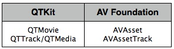

See the [Sample Code 'AVSimplePlayer'](https://developer.apple.com/samplecode/AVSimplePlayerOSX/index.html) for an example of working with audiovisual resources in AV Foundation.

### Creating Media Objects

A `QTMovie` object can be initialized from a file, from a resource specified by a URL, from a block of memory, from a pasteboard, or from an existing QuickTime movie. The `QTMovie` class provides a number of methods for initializing and creating movie objects such as `initWithFile:error`, `movieWithURL:error` and others. See Figure 2.

__AV Foundation__

You can instantiate an asset using [AVURLAsset](https://developer.apple.com/library/mac/#documentation/AVFoundation/Reference/AVURLAsset_Class/Reference/Reference.html) (a subclass of `AVAsset`) with URLs that refer to any audiovisual media resources, such as streams (including HTTP Live Streams), QuickTime movie files, MP3 files, and files of other types. You can also instantiate an asset using other subclasses that extend the audiovisual media model, such as [AVMutableComposition](https://developer.apple.com/library/mac/#documentation/AVFoundation/Reference/AVMutableComposition_Class/Reference/Reference.html) does for temporal editing. For example, you create a new empty mutable composition using the `composition` method. Then you can insert all the tracks within a given time range of a specified asset into the composition using the `insertTimeRange:ofAsset:atTime:error:` method. See Figure 2.

__Note:__ Because of the nature of timed audiovisual media, upon successful initialization of an asset some or all of the values for its keys may not be immediately available. The value of any key can be requested at any time, and the asset will always return its value synchronously, although it may have to block the calling thread in order to do so. In order to avoid blocking, you can register your interest in particular keys and to become notified when their values become available. For further details, see [AVAsynchronousKeyValueLoading](https://developer.apple.com/library/mac/#documentation/AVFoundation/Reference/AVAsynchronousKeyValueLoading_Class/Reference/Reference.html).

__Figure 2__  Creating Media Objects using QTKit and AV Foundation.

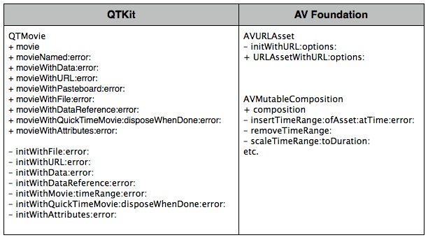

See the [Sample Code 'AVSimplePlayer'](https://developer.apple.com/samplecode/AVSimplePlayerOSX/index.html) for an example of creating media objects in AV Foundation.

### Playback

There are three QTKit classes that are used for the playback of QuickTime movies:

`QTMovie` - Typically used in combination with a `QTMovieView` object for playback. `QTMovie` provides various methods to control movie playback such as `play`, `stop`, and others. See Figure 3.

[QTMovieView](https://developer.apple.com/library/mac/#documentation/QuickTime/Reference/QTKitFramework/Classes/QTMovieView_Class/Reference/Reference.html) (subclass of `NSView`) - Used to display and control a `QTMovie` object in a window, which supplies the movie being displayed. When a `QTMovie` is associated with a `QTMovieView`, a built-in movie controller user interface may also be displayed, allowing the user control of movie playback via the interface. See Figure 4.

[QTMovieLayer](https://developer.apple.com/library/mac/#documentation/QuickTime/Reference/QTKitFramework/Classes/QTMovieLayer_Class/Reference/Reference.html) (subclass of `CALayer`) - Provides a layer into which the frames of a `QTMovie` object can be drawn. Intended to provide support for Core Animation. See Figure 5.

__AV Foundation__

In AV Foundation, a player controller object ([AVPlayer](https://developer.apple.com/library/mac/#documentation/AVFoundation/Reference/AVPlayer_Class/Reference/Reference.html)) is used to manage playback of an asset, for example starting and stopping playback, and seeking to a particular time. A player provides you with information about the state of the playback, so if you need to, you can synchronize your user interface with the player’s state. See a list of some of the common player controller methods in Figure 3.

You use an instance of `AVPlayer` to play a single asset. You use an [AVQueuePlayer](https://developer.apple.com/library/mac/#documentation/AVFoundation/Reference/AVQueuePlayer_Class/Reference/Reference.html) object to play a number of items in sequence (`AVQueuePlayer` is a subclass of `AVPlayer`).

To play an asset, you don’t provide assets directly to an `AVPlayer` object. Instead, you provide an instance of [AVPlayerItem](https://developer.apple.com/library/mac/#documentation/AVFoundation/Reference/AVPlayerItem_Class/Reference/Reference.html). A player item manages the presentation state of an asset with which it is associated. A player item contains player item tracks—instances of [AVPlayerItemTrack](https://developer.apple.com/library/mac/#documentation/AVFoundation/Reference/AVPlayerItemTrack_Class/Reference/Reference.html)—that correspond to the tracks in the asset.

You can initialize a player item with an existing asset, or you can initialize a player item directly from a URL. As with `AVAsset`, simply initializing a player item doesn’t necessarily mean it’s ready for immediate playback. You can observe (using [key-value observing](https://developer.apple.com/library/mac/#documentation/Cocoa/Conceptual/KeyValueObserving/KeyValueObserving.html)) an item’s status property to determine if and when it’s ready to play.

__Figure 3__  Media Playback using QTKit and AV Foundation.

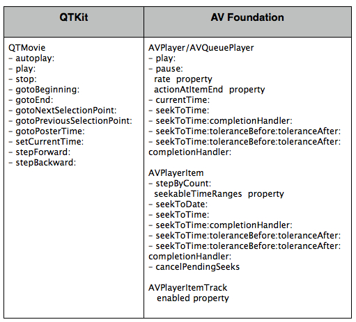

To display an `AVPlayer` object in a window use the `AVPlayerView` class in the `AVKit` framework. `AVPlayerView` is a subclass of `NSView` that can be used to display the visual content of an `AVPlayer` object and the standard playback controls. The style of the playback controls are customizable (inline, floating, minimal, hidden). There are editing controls to allow you to trim the media and remove those parts you don't want to save. Also included is a button for sharing the media via email, text message, YouTube and others. An `AVPlayer` object associated with an `AVPlayerView` can be used to control playback of the media, for example starting and stopping playback, and seeking to a particular chapter.

__Figure 4__  Media Playback to a window using QTKit and AV Foundation (`AVKit`) and displaying the standard controls user interface.

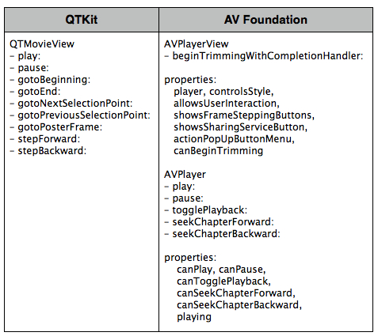

You can also direct the output of a `AVPlayer` to a specialized Core Animation Layer -- an instance of `AVPlayerLayer` or [AVSynchronizedLayer](https://developer.apple.com/library/mac/#documentation/AVFoundation/Reference/AVSynchronizedLayer_Class/Reference/Reference.html). See Figure 5.

__Figure 5__  Core Animation Layer Output Destination for Playback.

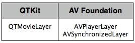

See the [Sample Code 'AVSimplePlayer'](https://developer.apple.com/samplecode/AVSimplePlayerOSX/index.html) for an example of media playback in AV Foundation.

### Media Export

In QTKit you can use the `QTMovie` `writeToFile:withAttributes:` method to export an existing movie to a new movie of a specified type and settings. The various settings for the movie export operation are specified in an attributes dictionary.

You can also use a `QTExportSession` object to transcode a given `QTMovie` source (or a collection of `QTTrack` objects) according to the settings in a `QTExportOptions` object. Clients of `QTExportSession` can implement the `QTExportSessionDelegate` interface for receiving progress and completion information from an instance of `QTExportSession`.

__AV Foundation__

AV Foundation allows you to create new representations of an asset in a couple of different ways. You can simply re-encode an existing asset, or you can perform operations on the contents of an asset and save the result as a new asset.

You use an export session ([AVAssetExportSession](https://developer.apple.com/library/mac/#documentation/AVFoundation/Reference/AVAssetExportSession_Class/Reference/Reference.html)) to re-encode an existing asset into a format defined by one of a number of commonly-used presets.

If you need more control over the transformation, you can use an asset reader ([AVAssetReader](https://developer.apple.com/library/mac/#documentation/AVFoundation/Reference/AVAssetReader_Class/Reference/Reference.html)) and asset writer (`AVAssetWriter`, see [Writing Media](#apple-f4xwc4dqnrsv64tfmyxwi33df52wszbpirkfgnbqgayteobvgiwugsbrfvlveskujfheotkfireuc)) object in combination to convert an asset from one representation to another. Using these objects you can, for example, choose which of the tracks you want to be represented in the output file, specify your own output format, or modify the asset during the conversion process.

You use an `AVAssetReader` object to obtain media data of an asset, whether the asset is file-based or represents an assemblage of media data from multiple sources (as with an [AVComposition](https://developer.apple.com/library/mac/#documentation/AVFoundation/Reference/AVComposition_Class/Reference/Reference.html) object). `AVAssetReader` lets you read the raw un-decoded media samples directly from storage.

You initialize an `AVAssetReader` with the `initWithAsset:error:` and `assetReaderWithAsset:error:` methods. Then call `startReading:` to prepare the receiver for obtaining sample buffers from the asset. You read the media data of an asset by adding one or more concrete instances of [AVAssetReaderOutput](https://developer.apple.com/library/mac/#documentation/AVFoundation/Reference/AVAssetReaderOutput_Class/Reference/Reference.html) to an `AVAssetReader` object using `addOutput:`, then call `copyNextSampleBuffer:` to synchronously copy the next sample buffer for the output.

__Note:__ `AVAssetReader` is not intended for use with real-time sources, and its performance is not guaranteed for real-time operations.

__Figure 6__  Media Export using QTKit and AV Foundation.

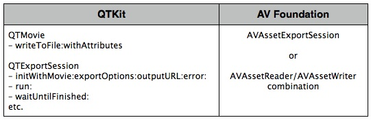

See the [Sample Code 'avexporter'](https://developer.apple.com/samplecode/avexporter/index.html) for an example of exporting media in AV Foundation.

### Writing Media

To create an empty `QTMovie` that you can then add media to, you use the `initToWritableDataReference:error:` method. This method creates a new storage container at the location specified by the data reference and returns a `QTMovie` object that has that container as its default data reference. Then call the `addImage:forDuration:withAttributes:` method to images to the `QTMovie`, using attributes specified in the attributes dictionary. See Figure 7.

__AV Foundation__

You use an asset writer ([AVAssetWriter](https://developer.apple.com/library/mac/#documentation/AVFoundation/Reference/AVAssetWriter_Class/Reference/Reference.html)) object to write media data to a new file of a specified container type, such as a QuickTime movie file or an MPEG-4 file. You initialize an `AVAssetWriter` using the `assetWriterWithURL:fileType:error:` and `initWithURL:fileType:error:` methods.

You can get the media data for an asset from an instance of `AVAssetReader`, or even from outside the AV Foundation API set. Media data is presented to `AVAssetWriter` for writing in the form of a [CMSampleBuffer](https://developer.apple.com/library/mac/#documentation/CoreMedia/Reference/CMSampleBuffer/Reference/Reference.html). The format of the media data is described in a `CMFormatDescription`. You use an `AVAssetWriterInput` to append media samples packaged as `CMSampleBuffer` objects, or collections of metadata, to a single track of the output file of an `AVAssetWriter` object using the `appendSampleBuffer:` method.

With `AVAssetWriterInput` you can also set various properties for the output file. For example, the `outputSettings` property specifies encoding settings for the media appended to the output. The `naturalSize` property allows a client to set track dimensions. The `metadata` property is a collection of track-level metadata that is associated with the asset and is carried in the output file. The `transform` property specifies the preferred transformation of the visual media data in the output file for display purposes.

`AVAssetWriterInput` inputs are added to your `AVAssetWriter` using the `addInput:` method. You append sequences of sample data to the asset writer inputs in a sample-writing session. You must call `startSessionAtSourceTime:` to begin one of these sessions.

Using `AVAssetWriter`, you can optionally re-encode media samples as they are written. You can also optionally write metadata collections to the output file, or specify various other properties such as movie time scale and time to elapse between writing movie fragments.

__Figure 7__  Writing Media using QTKit and AV Foundation.

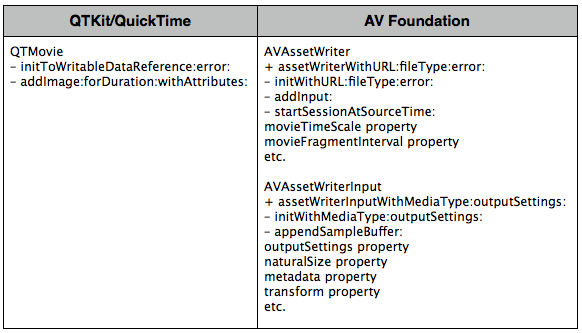

See the [Sample Code 'AVReaderWriter for OSX'](https://developer.apple.com/samplecode/ReaderWriter/index.html) for an example of writing media in AV Foundation.

### Editing

To edit movies with QTKit you operate on movie selections as well as movie and tracks segments. `QTMovie` offers a variety of different methods for editing movies. See Figure 8.

When a `QTMovie` is associated with a `QTMovieView`, the `QTMovieView` also supports editing operations on a movie. These operate on the current movie selection. See Figure 8.

__AV Foundation__

With AV Foundation you use compositions ([AVComposition](https://developer.apple.com/library/mac/#documentation/AVFoundation/Reference/AVComposition_Class/Reference/Reference.html)) to create new assets from existing pieces of media (typically, one or more video and audio tracks). You use a mutable composition ([AVMutableComposition](https://developer.apple.com/library/mac/#documentation/AVFoundation/Reference/AVMutableComposition_Class/Reference/Reference.html)) to add and remove tracks, and adjust their temporal orderings. For example, the `addMutableTrackWithMediaType:preferredTrackID:` method adds an empty track of the specified media type to a `AVMutableComposition`.

You can also set the relative volumes and ramping of audio tracks; and set the opacity, and opacity ramps, of video tracks. All file-based audiovisual assets are eligible to be combined, regardless of container type.

At its top-level, `AVComposition` is a collection of tracks, each presenting media of a specific media type (e.g. audio or video), according to a timeline. Each track is represented by an instance of [AVCompositionTrack](https://developer.apple.com/library/mac/#documentation/AVFoundation/Reference/AVCompositionTrack_Class/Reference/Reference.html). Each track is comprised of an array of track segments, represented by instances of [AVCompositionTrackSegment](https://developer.apple.com/library/mac/#documentation/AVFoundation/Reference/AVCompositionTrackSegment_Class/Reference/Reference.html). Each segment presents a portion of the media data stored in a source container, specified by URL, a track identifier, and a time mapping. The URL specifies the source container, and the track identifier indicates the track of the source container to be presented.

You can access the track segments of a track using the segments property (an array of `AVCompositionTrackSegment` objects) of `AVCompositionTrack`. The collection of tracks with media type information for each, and each with its array of track segments (URL, track identifier, and time mapping), form a complete low-level representation of a composition. This representation can be written out in any convenient form, and subsequently the composition can be reconstituted by instantiating a new `AVMutableComposition` with [AVMutableCompositionTrack](https://developer.apple.com/library/mac/#documentation/AVFoundation/Reference/AVMutableCompositionTrack_Class/Reference/Reference.html) objects of the appropriate media type, each with its segments property set according to the stored array of URL, track identifier, and time mapping.

__Figure 8__  Editing with QTKit and AV Foundation.

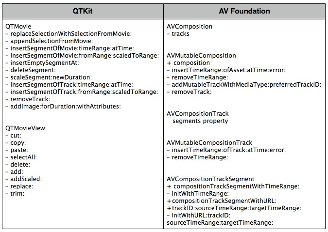

See the [Sample Code 'AVSimpleEditorOSX'](https://developer.apple.com/samplecode/AVSimpleEditorOSX/index.html) for an example of editing media in AV Foundation.

### Getting Media Samples during Playback

The QuickTime 7 Core Video digital video pipeline allows you to access individual media frames during playback. To do this, you specify a visual context (`QTVisualContextRef`) when preparing a QuickTime movie for playback. With QTKit, you set the visual context for a `QTMovie` using the `setVisualContext:` method. The visual context specifies the drawing destination you want to render your video into. For example, this can be a pixel buffer or texture visual context. After you specify a drawing context, you are free to manipulate the frames as you wish.

To synchronize the video with a display’s refresh rate, Core Video provides a timer called a display link ([CVDisplayLinkRef](https://developer.apple.com/library/mac/#documentation/QuartzCore/Reference/CVDisplayLinkRef/Reference/reference.html)). The display link makes intelligent estimates for when a frame needs to be output, based on display type and latencies. You set a callback for the display link with the `CVDisplayLinkOutputCallback` function, which is called whenever the display link wants the application to output a frame.

When frames are generated for display, Core Video provides different buffer types to store the image data. Core Video defines an abstract buffer of type [CVBuffer](https://developer.apple.com/library/mac/#documentation/QuartzCore/Reference/CVBufferRef/Reference/reference.html). All the other buffer types are derived from the `CVBuffer` type. You can use the `CVBuffer` APIs on any Core Video buffer.

__AV Foundation__

AV Foundation introduces the `AVPlayerItemOutput` class in OS X Mountain Lion. `AVPlayerItemOutput` is an abstract class encapsulating the common API for all `AVPlayerItemOutput` subclasses. Instances of `AVPlayerItemOutput` may acquire individual samples from an `AVAsset` during playback by an `AVPlayer`. You manage an association of an `AVPlayerItemOutput` instance with an `AVPlayerItem` as the source input using the `AVPlayerItem` `addOutput:` and `removeOutput:` methods:

When an `AVPlayerItemOutput` is associated with an `AVPlayerItem`, samples are provided for a media type in accordance with the rules for mixing, composition, or exclusion that the `AVPlayer` honors among multiple enabled tracks of that media type for its own rendering purposes. For example, video media will be composed according to the instructions provided via `AVPlayerItem.videoComposition`, if present.

`AVPlayerItemVideoOutput` is a concrete subclass of `AVPlayerItemOutput` that vends video images as Core Video pixel buffers (`CVPixelBufferRef`). Use a `AVPlayerItemVideoOutput` in conjunction with a Core Video display link (`CVDisplayLinkRef`) or a Core Animation display link (`CADisplayLink`) to accurately synchronize with screen device refreshes.

__Figure 9__  Getting Media Samples during Playback with QuickTime/QTKit and AV Foundation.

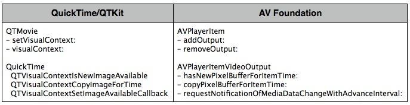

### Getting Still Images from a Video

To get an image for a movie frame at a specific time, use the `QTMovie` `frameImageAtTime:` or `frameImageAtTime:withAttributes:error:` method, which accepts a dictionary of attributes.

Similarly, the posterImage: method returns an [NSImage](https://developer.apple.com/library/mac/#documentation/Cocoa/Reference/ApplicationKit/Classes/NSImage_Class/Reference/Reference.html) for the poster frame of a `QTMovie`, and the `currentFrameImage:` method returns an `NSImage` for the frame at the current time in a `QTMovie`. See Figure 10.

__AV Foundation__

To create thumbnail images of video independently of playback using AV Foundation, you initialize an instance of [AVAssetImageGenerator](https://developer.apple.com/library/mac/#documentation/AVFoundation/Reference/AVAssetImageGenerator_Class/Reference/Reference.html) using the asset from which you want to generate thumbnails. `AVAssetImageGenerator` uses the default enabled video track(s) to generate images.

You can configure several aspects of the image generator, for example, you can specify the maximum dimensions for the images it generates and the aperture mode using `maximumSize` and `apertureMode` respectively. You can then generate a single image at a given time, or a series of images.

You use `copyCGImageAtTime:actualTime:error:` to generate a single image at a specific time. AV Foundation may not be able to produce an image at exactly the time you request, so you can pass as the second argument a pointer to a `CMTime` that upon return contains the time at which the image was actually generated.

To generate a series of images, you send the image generator a `generateCGImagesAsynchronouslyForTimes:completionHandler:` message.

__Figure 10__  Getting Still Images from a Video using QTKit and AV Foundation.

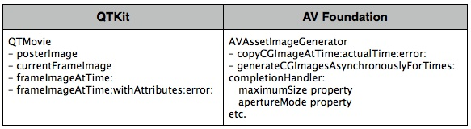

See the [Sample Code 'AVReaderWriter for OSX'](https://developer.apple.com/samplecode/ReaderWriter/index.html) for an example of getting still images from a video in AV Foundation.

### Media Metadata

Metadata is information about a file, track, or media, such as the artist and title of an MP3 track. In QTKit, metadata is encapsulated in an opaque container and accessed using a `QTMetaDataRef`. A `QTMetaDataRef` represents a metadata repository consisting of one or more native metadata containers. The `QTMovie` and `QTTrack` APIs support unified access to these containers.


Each container consists of some number of metadata items. Metadata items correspond to individually labeled values with characteristics such as keys, data types, locale information, and so on. You address each container by its storage format (`kQTMetaDataStorageFormat`). There is support for classic QuickTime user data items, iTunes metadata, and a QuickTime metadata container format. A `QTMetaDataRef` may have one or all of these. QTMetaDataRefs may be associated with a movie, track or media.

The `QTMovie` class provides a number of different methods to access the metadata items for a given movie file, track or media. See Figure 11.

__AV Foundation__

In AV Foundation, Assets may also have metadata, represented by instances of [AVMetadataItem](https://developer.apple.com/library/mac/#documentation/AVFoundation/Reference/AVMetadataItem_Class/Reference/Reference.html). An `AVMetadataItem` object represents an item of metadata associated with an audiovisual asset or with one of its tracks. To create metadata items for your own assets, you use the mutable subclass, [AVMutableMetadataItem](https://developer.apple.com/library/mac/#documentation/AVFoundation/Reference/AVMutableMetadataItem_Class/Reference/Reference.html).

Metadata items have keys that accord with the specification of the container format from which they’re drawn. Full details of the metadata formats, metadata keys, and metadata key spaces supported by AV Foundation are available among the defines in the `AVMetadataFormat.h` interface file.

You can load values of a metadata item “lazily” using the methods from the `AVAsynchronousKeyValueLoading` protocol. `AVAsset` and other classes in turn provide their metadata lazily so that you can obtain objects from those arrays without incurring overhead for items you don’t ultimately inspect.

You can filter arrays of metadata items by locale or by key and key space using `metadataItemsFromArray:withLocale:` and `-metadataItemsFromArray:withKey:keySpace:` respectively.

__Figure 11__  Media Metadata.

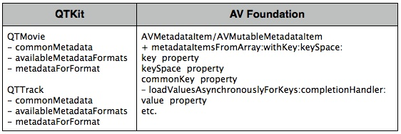

See the [Sample Code 'avmetadataeditor'](https://developer.apple.com/samplecode/avmetadataeditor/index.html) for an example of working with media metadata in AV Foundation.

[Back to Top](#)

## Media Capture and Access to Camera

The classes in the QTKit capture API handle a wide range of professional-level image-processing tasks in the capture and recording of audio/video media content. When working with QTKit capture, you typically make use of three essential types of objects: capture inputs, capture outputs and a capture session.

The classes that form the capture architecture of the QTKit API can be grouped as follows:

• Core

• Input/Output

• Utility

• User Interface

• Device Access

These classes and their mappings to the various AV Foundation capture APIs are described in more detail in the sections below.

__AV Foundation__

AV Foundation also provides a full suite of capture APIs that give you full access to the camera and provide for flexible output. The classes that make up the AV Foundation capture APIs closely resemble those in QTKit.

As with QTKit, recording input from cameras and microphones in AV Foundation is managed by a capture session. A capture session coordinates the flow of data from input devices to outputs such as a movie file. You can configure multiple inputs and outputs for a single session, even when the session is running. You send messages to the session to start and stop data flow. In addition, you can use an instance of preview layer to show the user what a camera is recording.

### Core Classes

There are four classes in QTKit Capture that comprise the core classes, as shown in Figure 12.

The [QTCaptureSession](https://developer.apple.com/library/mac/#documentation/QuickTime/Reference/QTCaptureSession_Class/Reference/Reference.html) class provides an interface for connecting input sources to output destinations.

[QTCaptureInput](https://developer.apple.com/library/mac/#documentation/QuickTime/Reference/QTCaptureInput_Class/Reference/Reference.html) and [QTCaptureOutput](https://developer.apple.com/library/mac/#documentation/QuickTime/Reference/QTCaptureOutput_Class/Reference/Reference.html) are both abstract classes, and provide interfaces for connecting inputs and outputs. The `QTCaptureInput` class provides input source connections for a `QTCaptureSession`. `QTCaptureOutput` is an abstract class that provides an interface for connecting capture output destinations, such as QuickTime files and video previews, to a `QTCaptureSession`.

[QTCaptureConnection](https://developer.apple.com/library/mac/#documentation/QuickTime/Reference/QTCaptureConnection_Ref/Introduction/Introduction.html) represents a connection over which a single stream of media data is sent from a `QTCaptureInput` to a `QTCaptureSession` and from a `QTCaptureSession` to a `QTCaptureOutput`.

__AV Foundation__

The four core capture classes in AV Foundation are shown in Figure 12. As in QTKit, to manage the capture from a device such as a camera or microphone, you assemble objects to represent inputs and outputs, and use an instance of [AVCaptureSession](https://developer.apple.com/library/mac/#documentation/AVFoundation/Reference/AVCaptureSession_Class/Reference/Reference.html) to coordinate the data flow between them. [AVCaptureInput](https://developer.apple.com/library/mac/#documentation/AVFoundation/Reference/AVCaptureInput_Class/Reference/Reference.html) objects are used to configure the ports from an input device, and [AVCaptureOutput](https://developer.apple.com/library/mac/#documentation/AVFoundation/Reference/AVCaptureOutput_Class/Reference/Reference.html) objects are used to manage the output to a movie file or still image.

A connection between a capture input and a capture output in a capture session is represented by an [AVCaptureConnection](https://developer.apple.com/library/mac/#documentation/AVFoundation/Reference/AVCaptureConnection_Class/Reference/Reference.html) object. Capture inputs (instances of `AVCaptureInput`) have one or more input ports (instances of AVCaptureInputPort). Capture outputs (instances of `AVCaptureOutput`) can accept data from one or more sources (for example, an AVCaptureMovieFileOutput object accepts both video and audio data).

__Figure 12__  Core Capture Classes for QTKit and AV Foundation.

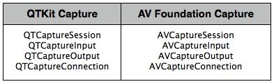

### Input/Output Classes

You use the methods in the [QTCaptureDeviceInput](https://developer.apple.com/library/mac/#documentation/QuickTime/Reference/QTCaptureDeviceInput_Class/Reference/Reference.html) class to handle input sources for various media devices, such as cameras and microphones. The six output classes provide output destinations for `QTCaptureSession` objects that can be used to write captured media to QuickTime movies or to preview video or audio that is being captured. [QTCaptureFileOutput](https://developer.apple.com/library/mac/#documentation/QuickTime/Reference/QTCaptureFileOutput_Class/Reference/Reference.html), an abstract superclass, provides an output destination for a capture session to write captured media simply to files. See Figure 13.

__AV Foundation__

There are five AV Foundation output classes and one input class belonging to this group. See Figure 13. `AVCaptureInput` is an abstract base-class describing an input data source (cameras and microphones) to an `AVCaptureSession` object. The output classes provide an interface for connecting a capture session (an instance of `AVCaptureSession`) to capture output destinations, which include files, video previews, still images, as well as uncompressed and compressed video frames and audio sample buffers from the video being captured.

__Figure 13__  Input/Output Capture Classes for QTKit and AV Foundation.

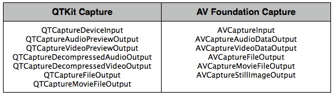

### Device Access Class

The [QTCaptureDevice](https://developer.apple.com/library/mac/#documentation/QuickTime/Reference/QTCaptureDevice_Class/Reference/Reference.html) class represents an available capture device. Each instance of `QTCaptureDevice` corresponds to a capture device that is connected or has been previously connected to the user’s computer during the lifetime of the application. Instances of `QTCaptureDevice` cannot be created directly. A single unique instance is created automatically whenever a device is connected to the computer.

__AV Foundation__

An [AVCaptureDevice](https://developer.apple.com/library/mac/#documentation/AVFoundation/Reference/AVCaptureDevice_Class/Reference/Reference.html) object abstracts a physical capture device that provides input data (such as audio or video) to an `AVCaptureSession` object.

You can enumerate the available devices, query their capabilities, and be informed when devices come and go. If you find a suitable capture device, you create an `AVCaptureDeviceInput` object for the device, and add that input to a capture session.

You can also set properties on a capture device (its focus mode, exposure mode, and so on).

__Figure 14__  Device Capture Classes for QTKit and AV Foundation.

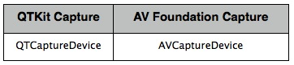

### Showing the User What’s Being Recorded

You can use the methods available in the [QTCaptureView](https://developer.apple.com/library/mac/#documentation/QuickTime/Reference/QTCaptureView_Class/Reference/Reference.html) class (a subclass of `NSView`), to preview video that is being processed by an instance of `QTCaptureSession`. The class creates and maintains its own [QTCaptureVideoPreviewOutput](https://developer.apple.com/library/mac/#documentation/QuickTime/Reference/QTCaptureVideoPreviewOutput_Class/Reference/Reference.html) to gather the preview video you need from the capture session.

Support for Core Animation is provided by the [QTCaptureLayer](https://developer.apple.com/library/mac/#documentation/QuickTime/Reference/QTCaptureLayer_Class/Reference/Reference.html) class, which is a subclass of `CALayer` (see the [Core Animation Programming Guide](https://developer.apple.com/library/mac/#documentation/Cocoa/Conceptual/CoreAnimation_guide/Introduction/Introduction.html)). `QTCaptureLayer` displays video frames currently being captured into a layer hierarchy. See Figure 15.

__AV Foundation__

You can provide the user with a preview of what’s being recorded by the camera using an [AVCaptureVideoPreviewLayer](https://developer.apple.com/library/mac/#documentation/AVFoundation/Reference/AVCaptureVideoPreviewLayer_Class/Reference/Reference.html) object. `AVCaptureVideoPreviewLayer` is a subclass of `CALayer` . There are no outputs to show the preview. In general, the preview layer behaves like any other `CALayer` object in the render tree (see the [Core Animation Programming Guide](https://developer.apple.com/library/mac/#documentation/Cocoa/Conceptual/CoreAnimation_guide/Introduction/Introduction.html)). You can scale the image and perform transformations, rotations and so on just as you would any layer.

__Figure 15__  Classes for Showing What is Being Recorded using QTKit and AV Foundation.

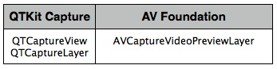

See the [Sample Code 'AVRecorder'](https://developer.apple.com/samplecode/AVRecorder/index.html), [Sample Code 'StopNGo for Mac'](https://developer.apple.com/samplecode/StopNGoOSX/index.html) and [Sample Code 'avvideowall'](https://developer.apple.com/samplecode/avvideowall/index.html) for an example of media capture in AV Foundation.

[Back to Top](#)

## Representations of Time

QTKit provides the [QTTime](https://developer.apple.com/library/mac/#documentation/QuickTime/Reference/QTKitFramework/Miscellaneous/QTKit_DataTypes/Reference/reference.html) and [QTTimeRange](https://developer.apple.com/library/mac/#documentation/QuickTime/Reference/QTKitFramework/Miscellaneous/QTKit_DataTypes/Reference/reference.html) structures for representing specific times and time ranges in a movie or track. See Figure 16.

There are a number of functions that you use in working with time, such as `QTMakeTime`, `QTMakeTimeRange`, `QTTimeIncrement`, `QTMakeTimeScaled` and others.

You use these functions to create a `QTTime` structure, get and set times, compare `QTTime` structures, add and subtract times, and get a description. In addition, other functions are also available for creating a `QTTimeRange` structure, querying time ranges, creating unions and intersections of time ranges, and getting a description.

__AV Foundation__

Time in AV Foundation is represented by primitive structures from the Core Media framework. The [CMTime](https://developer.apple.com/library/mac/#documentation/CoreMedia/Reference/CMTime/Reference/reference.html) structure represents a length of time. More specifically, the `CMTime` is a C structure that represents time as a rational number, with a numerator (an `int64_t` value), and a denominator (an `int32_t` timescale). Conceptually, the timescale specifies the fraction of a second each unit in the numerator occupies. Thus if the timescale is 4, each unit represents a quarter of a second; if the timescale is 10, each unit represents a tenth of a second, and so on.

In addition to a simple time value, a `CMTime` can represent non-numeric values: +infinity, -infinity, and indefinite. It can also indicate whether the time been rounded at some point, and it maintains an epoch number.

AV Foundation provides a number of functions for working with `CMTime` structures. For example, you create a time using `CMTimeMake`, or one of the related functions such as `CMTimeMakeWithSeconds` (which allows you to create a time using a float value and specify a preferred time scale). There are several functions for time-based arithmetic and to compare times. For a list of all the available functions, see the [CMTime Reference](https://developer.apple.com/library/mac/#documentation/CoreMedia/Reference/CMTime/Reference/reference.html).

If you need to use CMTimes in annotations or Core Foundation containers, you can convert a `CMTime` to and from a `CFDictionary` (see [CFDictionaryRef](https://developer.apple.com/library/mac/#documentation/CoreFoundation/Reference/CFDictionaryRef/Reference/reference.html)) using `CMTimeCopyAsDictionary` and `CMTimeMakeFromDictionary` respectively. You can also get a string representation of a `CMTime` using `CMTimeCopyDescription`.

`CMTimeRange` is a C structure that has a start time and duration, both expressed as CMTimes. A time range does not include the time that is the start time plus the duration.

You create a time range using `CMTimeRangeMake` or `CMTimeRangeFromTimeToTime`.

Core Media provides functions you can use to determine whether a time range contains a given time or other time range, or whether two time ranges are equal, and to calculate unions and intersections of time ranges, such as `CMTimeRangeContainsTime`, `CMTimeRangeEqual`, `CMTimeRangeContainsTimeRange`, and `CMTimeRangeGetUnion`.

For a list of all the available functions, see the [CMTimeRange Reference](https://developer.apple.com/library/archive/technotes/tn2300/CMTime Reference).

If you need to use the `CMTimeRange` in annotations or Core Foundation containers, you can convert a `CMTimeRange` to and from a `CFDictionary` using `CMTimeRangeCopyAsDictionary` and `CMTimeRangeMakeFromDictionary` respectively. You can also get a string representation of a `CMTime` using `CMTimeRangeCopyDescription`.

__Figure 16__  Representations of Time.

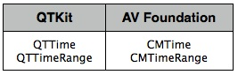

See the [Sample Code 'AVSimpleEditorOSX'](https://developer.apple.com/samplecode/AVSimpleEditorOSX/index.html), [Sample Code 'avexporter'](https://developer.apple.com/samplecode/avexporter/index.html), [Sample Code 'AVScreenShack'](https://developer.apple.com/samplecode/AVScreenShack/index.html) and [Sample Code 'AVReaderWriter for OSX'](https://developer.apple.com/samplecode/ReaderWriter/index.html) for an example of working with time in AV Foundation.

[Back to Top](#)

## References

### Documents

[AV Foundation Programming Guide](https://developer.apple.com/library/mac/#documentation/AudioVideo/Conceptual/AVFoundationPG/Articles/00_Introduction.html)

### Sample Code

[Sample Code 'AVSimplePlayer'](https://developer.apple.com/samplecode/AVSimplePlayerOSX/index.html)

[Sample Code 'AVSimpleEditorOSX'](https://developer.apple.com/samplecode/AVSimpleEditorOSX/index.html)

[Sample Code 'avexporter'](https://developer.apple.com/samplecode/avexporter/index.html)

[Sample Code 'AVScreenShack'](https://developer.apple.com/samplecode/AVScreenShack/index.html)

[Sample Code 'AVReaderWriter for OSX'](https://developer.apple.com/samplecode/ReaderWriter/index.html)

[Sample Code 'avvideowall'](https://developer.apple.com/samplecode/avvideowall/index.html)

[Sample Code 'StopNGo for Mac'](https://developer.apple.com/samplecode/StopNGoOSX/index.html)

[Sample Code 'AVRecorder'](https://developer.apple.com/samplecode/AVRecorder/index.html)

[Sample Code 'avmetadataeditor'](https://developer.apple.com/samplecode/avmetadataeditor/index.html)

### Technical Notes

_[AVFoundation - Timecode Support with AVAssetWriter and AVAssetReader](../AVFoundation%20-%20Timecode%20Support%20with%20AVAssetWriter%20and%20AVAssetReader/AVFoundation%20-%20Timecode%20Support%20with%20AVAssetWriter%20and%20AVAssetReader.md#apple-f4xwc4dqnrsv64tfmyxwi33df52wszbpirkfgnbqgaytgmztgq)_

[Back to Top](#)

---

#### Document Revision History

| __Date__ | __Notes__ |
| 2013-05-28 | Added information about the AVPlayerView class in the new AVKit framework for OS X 10.9. Also added sections about identifying deprecated APIs with Xcode, and checking your existing binary with nm. |
| 2012-09-18 | New document that discusses how to transition your QTKit code to AV Foundation. |

