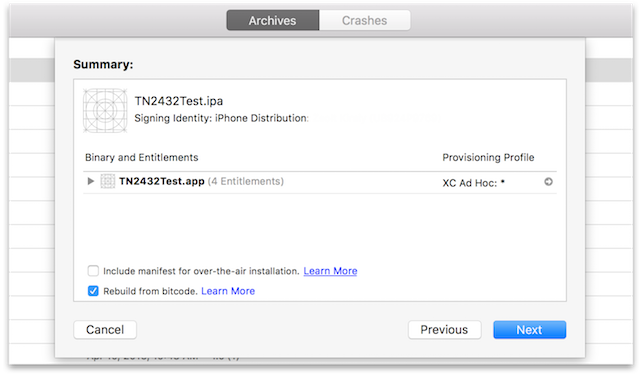
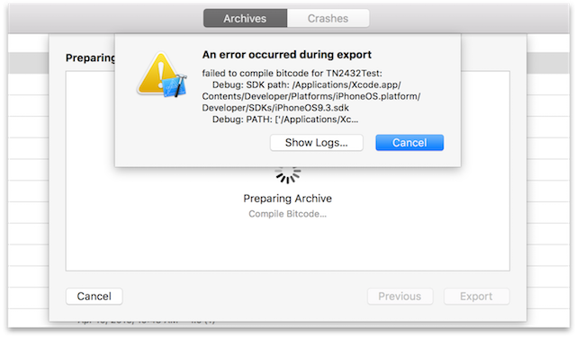
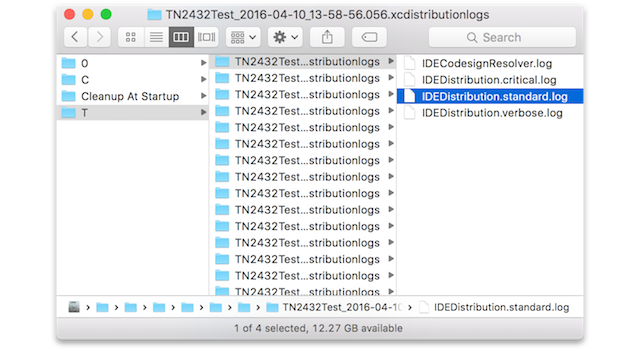
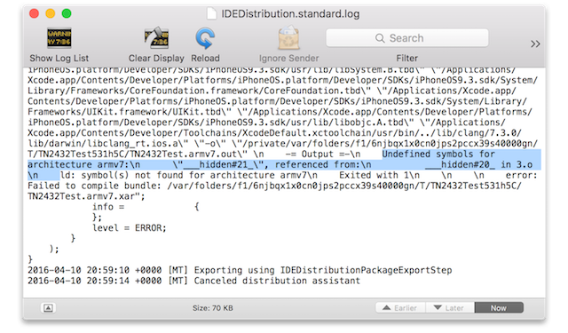

> 导航：[总目录](../../README.md) · [technotes](../../_indexes/technotes.md)

Technical Note TN2432

# Troubleshooting App Thinning and Bitcode Build Failures

Bitcode compilation and app thinning can be tested via ad hoc deployment. Use the latest version of Xcode to match App Store behavior. Workarounds are provided for common issues.

[Introduction](#apple-f4xwc4dqnrsv64tfmyxwi33df52wszbpirkfgnbqgaytomjvgawugsbrfvke4vcbi4yq)[Troubleshooting](#apple-f4xwc4dqnrsv64tfmyxwi33df52wszbpirkfgnbqgaytomjvgawugsbrfvke4vcbi4yvani)[Diagnosis](#apple-f4xwc4dqnrsv64tfmyxwi33df52wszbpirkfgnbqgaytomjvgawugsbrfvke4vcbi4za)[Diagnosing Bitcode and App Thinning Issues](#apple-f4xwc4dqnrsv64tfmyxwi33df52wszbpirkfgnbqgaytomjvgawugsbrfvke4vcbi4zc2rcjifdu4t2tjfheox2cjfkegt2eivpuctsel5avauc7kreestsojfheox2jknjvkrkt)[Known Issues and Workarounds](#apple-f4xwc4dqnrsv64tfmyxwi33df52wszbpirkfgnbqgaytomjvgawugsbrfvke4vcbi4zq)[Known Bitcode Issues](#apple-f4xwc4dqnrsv64tfmyxwi33df52wszbpirkfgnbqgaytomjvgawugsbrfvke4vcbi4zs2s2oj5lu4x2cjfkegt2eivpusu2tkvcvg)[Known App Thinning Issues](#apple-f4xwc4dqnrsv64tfmyxwi33df52wszbpirkfgnbqgaytomjvgawugsbrfvke4vcbi4zs2s2oj5lu4x2bkbif6vcijfhe4skoi5pusu2tkvcvg)[Document Revision History](#apple-f4xwc4dqnrsv64tfmyxwi33df52wszbpirkfgnbqgaytomjvgawvezlwnfzws33ojbuxg5dpoj4s2rdpnz2ey2lonncwyzlnmvxhiskel4yq)

## Introduction

App thinning and bitcode compilation require complex processing as part of the app submission process. This document provides best practices, a diagnostic procedure, and common workarounds, in case you encounter a failure before Apple had a chance to implement a fix.

[Back to Top](#)

## Troubleshooting

General tips for troubleshooting and best practices are listed below.

- Be sure to use the [latest version of Xcode](https://itunes.apple.com/us/app/xcode/id497799835?mt=12) to build and submit your app. The issue you are experiencing may already be fixed in the latest version.
- Try to reproduce the failure locally. You can do this from Xcode by exporting an archive for [ad hoc deployment](https://developer.apple.com/library/ios/documentation/IDEs/Conceptual/AppDistributionGuide/TestingYouriOSApp/TestingYouriOSApp.html#//apple_ref/doc/uid/TP40012582-CH8-SW21). That will go through the same processes as the App Store, and you will have more visibility into what is failing and be able to experiment with changes to avoid the issue. The [Diagnosis](#apple-f4xwc4dqnrsv64tfmyxwi33df52wszbpirkfgnbqgaytomjvgawugsbrfvke4vcbi4za) section will guide you through this process.
- Read the [Known Issues and Workarounds](#apple-f4xwc4dqnrsv64tfmyxwi33df52wszbpirkfgnbqgaytomjvgawugsbrfvke4vcbi4zq) section below. If the symptoms for one of them match what you are seeing, there may be a workaround that you can use.
- If the failure is due to a third-party library used in your app, you may need to work with the library provider to find a solution.
- If the failure is related to bitcode compilation, and if your app is for iOS, where bitcode is still optional, you can opt out of submitting with bitcode as a temporary workaround. Please re-enable it later when the issue is fixed.

[Back to Top](#)

## Diagnosis

### Diagnosing Bitcode and App Thinning Issues

If bitcode compilation or app thinning failed on the App Store, you can duplicate this failure with the following process. When recompiling from bitcode, the build log will not be visible in Xcode's Report Navigator, but Xcode will give you the option of viewing the logs in case of failure.

1. Archive your project.
2. Follow the steps in the App Distribution Guide under the heading [Exporting Your App for Testing Outside the Store](https://developer.apple.com/library/ios/documentation/IDEs/Conceptual/AppDistributionGuide/TestingYouriOSApp/TestingYouriOSApp.html#//apple_ref/doc/uid/TP40012582-CH8-SW17), up to and including Step 6.
3. Make sure you check "Rebuild from bitcode" in Step 6, as shown in Figure 1.
4. Observe that the export fails, shown in Figure 2
5. Click on "Show Logs...".
6. A Finder window opens (Figure 3). Double click on the "IDEDistribution.standard.log" file to open it in the Console app.
7. Find the error in the Console app. The example in Figure 4 shows an "Undefined symbols" error.
8. In the [Known Issues and Workarounds](#apple-f4xwc4dqnrsv64tfmyxwi33df52wszbpirkfgnbqgaytomjvgawugsbrfvke4vcbi4zq) section, use this error message, and your knowledge of your project to find the correct cause and workaround.

__Figure 1__  Export with 'Rebuild from bitcode' checked.

__Figure 2__  Rebuild from bitcode failure.

__Figure 3__  Export logs with the log containing the build messages selected.

__Figure 4__  The build failure log.

[Back to Top](#)

## Known Issues and Workarounds

### Known Bitcode Issues

#### Undefined symbols when inconsistently using __asm on symbols

If a symbol is declared in one source file with an assembly name specified via `__asm`, and in another source file that same symbol is used without an assembly name, those symbols may be obfuscated inconsistently in the bitcode, leading to `Undefined symbols` link failures. The assembly names may be specified in system headers with the `__DARWIN_ALIAS` (or similar) macros.

Workaround: Consistently use the same symbol declarations in all your code. If the inconsistent symbols are coming from third-party embedded frameworks, you may need to work with the framework vendor to get a fix.

#### Undefined symbols when using assembly code or inline assembly with link-time optimization (LTO).

When using LTO, symbols in assembly code may be obfuscated inconsistently.

Workaround: Avoid LTO or rewrite the assembly code to avoid symbol references.

#### Empty -sectcreate file causes bitcode build failure

The linker's `-sectcreate` option allows you to insert content from a file directly into the output. If the file specified by the `-sectcreate` option is empty, the bitcode build will fail.

Workaround: Create an empty section with some other mechanism, or add something to the file so that the section is not completely empty.

#### Undefined symbols due to unused linkonce_odr bitcode

If the failure is related to bitcode compilation, and if your app is for a platform where bitcode is still optional (i.e., iOS), you can opt out of submitting with bitcode as a temporary workaround. Please reenable it later when the issue is fixed.

### Known App Thinning Issues

#### Failure to detect and handle a malformed Info.plist

Workaround: Verify that all Info.plist files contained in your app are correctly formatted Property List files by running `plutil -lint Info.plist` on each one.

#### Failure processing an app containing an Info.plist with a CFBundleExecutable key which points to a missing file

Workaround: Fix Info.plist files to stop referring to missing executables.

#### Failure handling apps where the CFBundleSupportedPlatforms key in an Info.plist file is missing or specifies an invalid platform

This includes simulator platforms, which should not be used in apps that are sent to the store. Workaround: Verify that all Info.plist files correctly specify `CFBundleSupportedPlatforms`.

#### Static libraries included in an app bundle cause failures

Static libraries should be linked into your app but not copied into the app bundle. Workaround: Verify that your app does not mistakenly include static libraries.

#### dSYM content inside an app bundle causes failures

There is no reason to have .dSYMs included as part of an app. Workaround: Remove the .dSYM content.

#### Failure to detect and report missing Swift runtime libraries

Workaround: If you're using Swift, verify that your app includes all the necessary Frameworks/libswift\*.dylib libraries.

#### Inconsistent architectures in Mach-O files lead to link failures

Workaround: Verify that your app's binaries have consistent architectures. For example, if your app is armv7 and arm64, ensure that your frameworks are also all armv7 and arm64 as well.

#### App name beginning with '-' (the dash character) causes a failure in app thinning

Workaround: Rename the app’s folder name to avoid the dash; you can keep the app’s display name the same.

[Back to Top](#)

---

#### Document Revision History

| __Date__ | __Notes__ |
| 2016-05-31 | Editorial |
| 2016-05-23 | Fixed image sizes. |
| 2016-05-20 | New document that provides suggestions for troubleshooting App Store submission failures due to issues in the app thinning and bitcode build processes, including a list of known issues and potential workarounds. |

