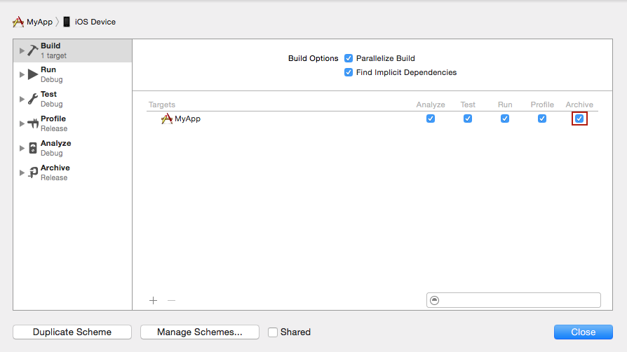
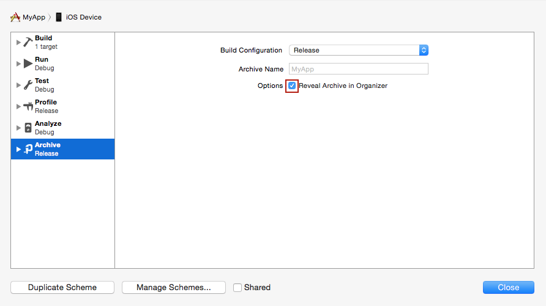
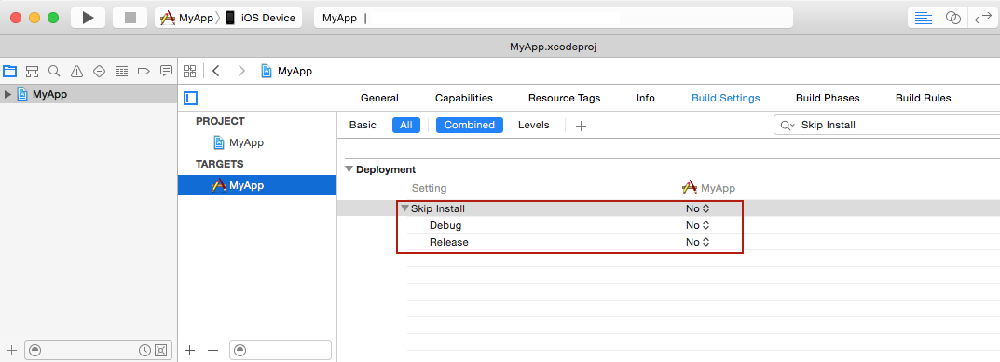
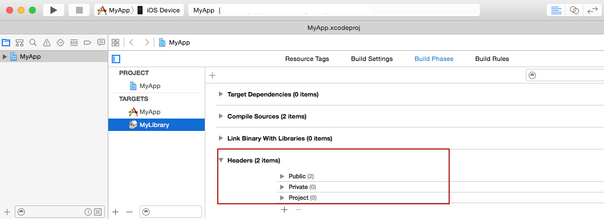
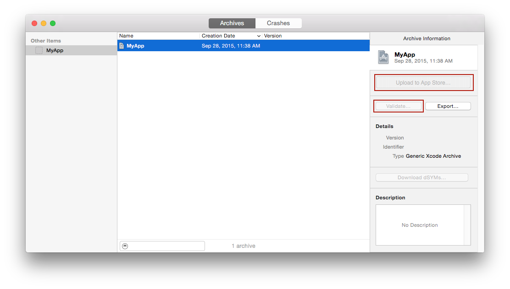
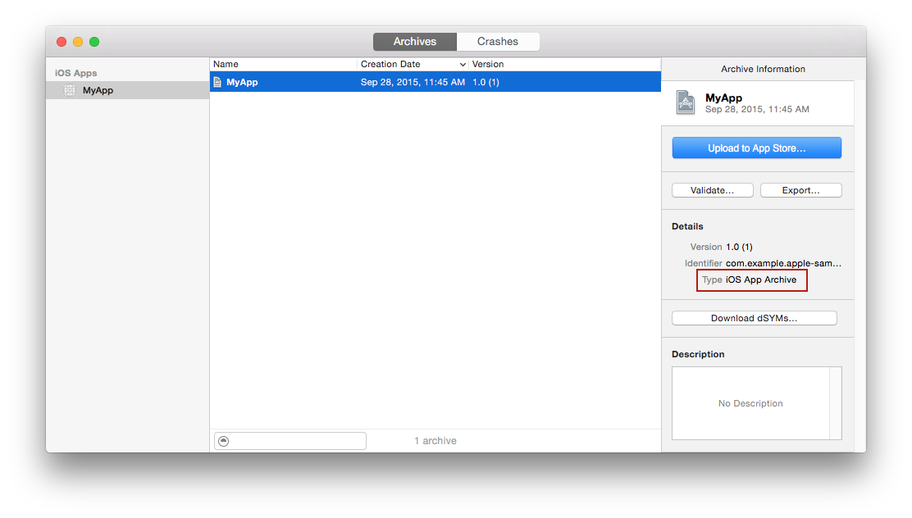
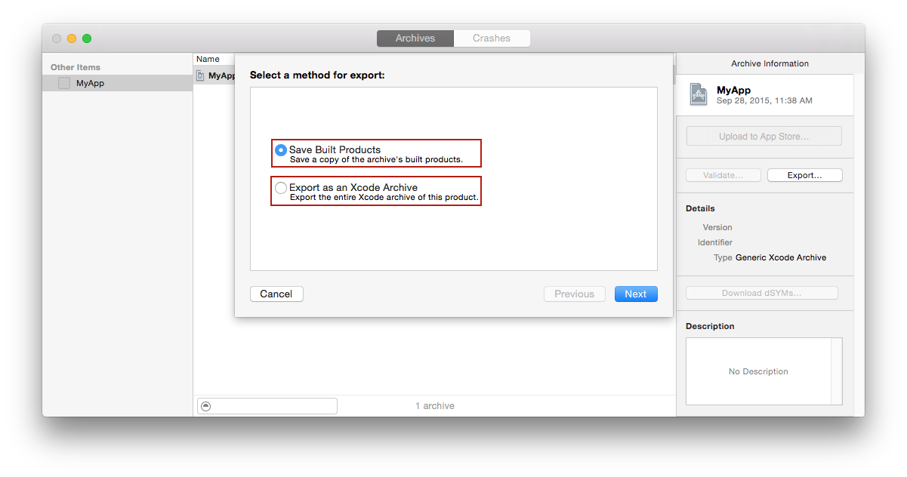

> 导航：[总目录](../../README.md) · [technotes](../../_indexes/technotes.md)

Technical Note TN2215

# Troubleshooting Application Archiving in Xcode

This technote answers common issues encountered while archiving iOS and Mac applications in Xcode. See "[Archiving Your App](https://developer.apple.com/library/ios/documentation/IDEs/Conceptual/AppDistributionGuide/TestingYouriOSApp/TestingYouriOSApp.html#//apple_ref/doc/uid/TP40012582-CH8-SW4)" for more information about archiving applications in Xcode.

[Why is the Archive menu item grayed out in Xcode ?](#apple-f4xwc4dqnrsv64tfmyxwi33df52wszbpirkfgnbqgaytcmrsgewugsbrfvluqwk7jfjv6vciivpucusdjbevmrk7jvcu4vk7jfkektk7i5jecwkfirpu6vkul5eu4x2yinhuirk7l4)[Xcode successfully archived my application, but the Archives Organizer does not list my archive](#apple-f4xwc4dqnrsv64tfmyxwi33df52wszbpirkfgnbqgaytcmrsgewugsbrfvmegt2eivpvgvkdincvgu2gkvgeywk7ifjegscjkzcuix2nlfpucucqjreugqkujfhu4x27ijkvix2ujbcv6qksineesvsfknpu6ushifheswsfkjpuit2fknpu4t2ul5gesu2ul5gvsx2bkjbuqskwiu)[<Project name> does not contain a single–bundle application or contains multiple products. Please select another archive, or adjust your scheme to create a single–bundle application.](#apple-f4xwc4dqnrsv64tfmyxwi33df52wszbpirkfgnbqgaytcmrsgewugsbrfvifet2k)[The Upload to App Store and Validate buttons are grayed out in the Archives Organizer](#apple-f4xwc4dqnrsv64tfmyxwi33df52wszbpirkfgnbqgaytcmrsgewugsbrfveeimi)[Unexpected Save Built Products and Export as Xcode Archive options in the Archives Organizer when attempting to export my archive](#apple-f4xwc4dqnrsv64tfmyxwi33df52wszbpirkfgnbqgaytcmrsgewugsbrfvku4rkykbcugvcfirpvgqkwivpuevkjjrkf6ucsj5cfkq2uknpuctsel5cvqucpkjkf6qktl5megt2eivpucusdjbevmrk7j5ifiskpjzjv6skol5keqrk7ifjegscjkzcvgx2pkjductsjljcvex2xjbcu4x2bkrkektkqkreu4r27krhv6rkykbhvevc7jvmv6qksineesvsf)[Document Revision History](#apple-f4xwc4dqnrsv64tfmyxwi33df52wszbpirkfgnbqgaytcmrsgewvezlwnfzws33ojbuxg5dpoj4s2rdpnz2ey2lonncwyzlnmvxhiskel4yq)

## Why is the Archive menu item grayed out in Xcode ?

The Archive menu item may be grayed out in Xcode for any of the following reasons:

- The Archive action is disabled for your app in the scheme editor's Build pane.

  In Xcode, open the scheme editor by choosing `Product > Scheme > Edit Scheme…`, then select the `Archive` action for your app in the Build pane as shown in Figure 1.

__Figure 1__  Archive action selected in the scheme editor Build pane

__Note:__ Be sure to select your app's scheme from the scheme pop-up menu in the upper-left corner of the Xcode toolbar before opening the scheme editor.

- The run destination is set to `iOS Simulator` in the Scheme pop-up menu in the upper-left corner of the Xcode toolbar.

  Applications built for the simulator cannot be archived nor submitted to the App Store. Set the run destination to `iOS Device` to enable archiving for your application.

[Back to Top](#)

## Xcode successfully archived my application, but the Archives Organizer does not list my archive

The Organizer may not list your archive after a successful `Product > Archive` for any of the following reasons:

- The `Reveal Archive in Organizer` option is disabled for your app in the scheme Editor's Archive pane.

  In Xcode, open the scheme editor by choosing `Product > Scheme > Edit Scheme…`, then select `Reveal Archive in Organizer` in the Archive pane as shown in Figure 2.

__Figure 2__  Reveal Archive in Organizer selected in the scheme editor Archive pane

__Note:__ Be sure to select your app's scheme from the scheme pop-up menu in the upper-left corner of the Xcode toolbar before opening the scheme editor.

- The `Skip Install` build setting is set to `YES` in your Build Settings pane.

  `Skip Install` (SKIP_INSTALL) must be set to `YES` for static libraries and `NO` for applications as shown in Figure 3. See [SKIP_INSTALL](https://developer.apple.com/library/ios/documentation/DeveloperTools/Reference/XcodeBuildSettingRef/1-Build_Setting_Reference/build_setting_ref.html#//apple_ref/doc/uid/TP40003931-CH3-SW36) for more information about it.

__Figure 3__  Skip Install set to NO for the MyApp application

- The `Installation Directory` (INSTALL_PATH) build setting was not properly set in your Build Settings pane.

  Set this build setting to `$(LOCAL_APPS_DIR)`, the default value for applications. See [INSTALL_PATH (Installation Directory)](https://developer.apple.com/library/ios/documentation/DeveloperTools/Reference/XcodeBuildSettingRef/1-Build_Setting_Reference/build_setting_ref.html#//apple_ref/doc/uid/TP40003931-CH3-SW41) for more information about it.

[Back to Top](#)

## <Project name> does not contain a single–bundle application or contains multiple products. Please select another archive, or adjust your scheme to create a single–bundle application.

You may be getting this message for any of the following reasons:

- Your archive contains header files.

  If your app links against a static library, then your archive contains header files because the library probably uses a Headers build phase to export these files as shown in Figure 4. Headers build phases do not work correctly with static library targets when archiving in Xcode. Delete this phase, add a Copy Files build phase to your library, and use it to export your header files. See [Copying Files While Building a Product](https://developer.apple.com/library/ios/recipes/xcode_help-project_editor/Articles/CreatingaCopyFilesBuildPhase.html#//apple_ref/doc/uid/TP40010155-CH14-SW1) for more information about adding a Copy File build phase to your project.

__Figure 4__  Headers build phase

- Your archive contains static libraries or frameworks.

  You must set "Skip Install" to `YES` to prevent your static libraries or framework from being added to your archive.

__Note:__ If your archive contains unexpected items such as header files, static libraries, or frameworks, then it is a generic Xcode archive.

[Back to Top](#)

## The Upload to App Store and Validate buttons are grayed out in the Archives Organizer

If the Archives Organizer shows `Upload to App Store` and `Validate` as shown in Figure 5, then your archive is likely a generic Xcode archive rather than an app archive. You cannot package generic archives nor submit them for review. See [<Project name> does not contain a single–bundle application or contains multiple products. Please select another archive, or adjust your scheme to create a single–bundle application.](#apple-f4xwc4dqnrsv64tfmyxwi33df52wszbpirkfgnbqgaytcmrsgewugsbrfvifet2k) for information on how to avoid building a generic archive.

__Figure 5__  A generic Xcode archive

__Note:__ The Type field in the Archives Organizer specifies the type of your archive. Make sure that the type of your archive is set to Mac App Archive for a Mac archive and iOS App Archive for an iOS archive as shown in Figure 6 before attempting to distribute it.

__Figure 6__  Archive of an iOS application

[Back to Top](#)

## Unexpected Save Built Products and Export as Xcode Archive options in the Archives Organizer when attempting to export my archive

If the Archives Organizer shows `Save Built Products` and `Export as Xcode Archive` as shown in Figure 7, then your archive is likely a generic Xcode archive rather than an app archive. See [<Project name> does not contain a single–bundle application or contains multiple products. Please select another archive, or adjust your scheme to create a single–bundle application.](#apple-f4xwc4dqnrsv64tfmyxwi33df52wszbpirkfgnbqgaytcmrsgewugsbrfvifet2k) for information on how to avoid building a generic archive.

__Figure 7__  Attempting to export a generic archive

[Back to Top](#)

---

#### Document Revision History

| __Date__ | __Notes__ |
| 2015-10-15 | Updated for Xcode 7. |
| 2015-10-14 | Updated for Xcode 7. |
| 2015-08-18 | Editorial update. |
| 2015-03-27 | Updated for Xcode 6. |
| 2014-07-17 | Fixed typos. |
| 2014-03-17 | Updated the "Unexpected Save Built Products and Export as Xcode Archive options in the Archives Organizer when attempting to distribute my archive" section. |
| 2012-06-28 | Added information on how to resolve the Archives Organizer's "Save Built Products" and "Export as Xcode Archive" issue. |
| 2011-09-12 | New document that describes how to resolve common issues encountered while archiving iOS and Mac applications in Xcode. |
