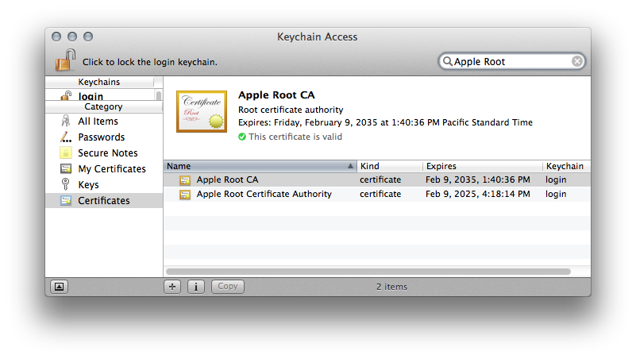

> 导航：[总目录](../../README.md) · [technotes](../../_indexes/technotes.md)


Technical Note TN2318

# Troubleshooting Failed Signature Verification

This document assists in troubleshooting failed signature verification that can occur when archiving an app in Xcode, or while validating an archive for distribution.

[Overview](#apple-f4xwc4dqnrsv64tfmyxwi33df52wszbpirkfgnbqgaytgnzxg4wugsbrfvhvmrkskzeukvy)[Diagnosing Signature Verification Failure](#apple-f4xwc4dqnrsv64tfmyxwi33df52wszbpirkfgnbqgaytgnzxg4wugsbrfvcesqkhjzhvgskoi4)[Resolving Signature Verification Failure](#apple-f4xwc4dqnrsv64tfmyxwi33df52wszbpirkfgnbqgaytgnzxg4wugsbrfvke4vcbi4ya)[Check the Signature For a Failure Root Cause](#apple-f4xwc4dqnrsv64tfmyxwi33df52wszbpirkfgnbqgaytgnzxg4wugsbrfvje6t2uinavku2f)[Do Not Distribute Apps From Beta OS X or Beta Xcode](#apple-f4xwc4dqnrsv64tfmyxwi33df52wszbpirkfgnbqgaytgnzxg4wugsbrfvke4vcbi42a)[Avoid special characters in Executable names](#apple-f4xwc4dqnrsv64tfmyxwi33df52wszbpirkfgnbqgaytgnzxg4wugsbrfvke4vcbi4yc2qkwj5euix2tkbcugskbjrpugscbkjaugvcfkjjv6skol5cvqrkdkvkecqsmivpu4qknivjq)[Code Signing Entitlements Troubleshooting](#apple-f4xwc4dqnrsv64tfmyxwi33df52wszbpirkfgnbqgaytgnzxg4wugsbrfvke4vcbi42q)[Avoid App ID Prefix Mismatching](#apple-f4xwc4dqnrsv64tfmyxwi33df52wszbpirkfgnbqgaytgnzxg4wugsbrfvke4vcbi4za)[Sign Your App With The Correct Provisioning Profile](#apple-f4xwc4dqnrsv64tfmyxwi33df52wszbpirkfgnbqgaytgnzxg4wugsbrfvke4vcbi4yq)[Install the Apple Root certification authority](#apple-f4xwc4dqnrsv64tfmyxwi33df52wszbpirkfgnbqgaytgnzxg4wugsbrfvje6t2uinaq)[Supporting Information](#apple-f4xwc4dqnrsv64tfmyxwi33df52wszbpirkfgnbqgaytgnzxg4wugsbrfvke4vcbi44a)[How do I check if my application's signature has been corrupted?](#apple-f4xwc4dqnrsv64tfmyxwi33df52wszbpirkfgnbqgaytgnzxg4wugsbrfvke4vcbi4ztq)[How do I see which certificate was used to sign my app?](#apple-f4xwc4dqnrsv64tfmyxwi33df52wszbpirkfgnbqgaytgnzxg4wugsbrfvke4vcbi43a)[How do I check the entitlements on my Application's Signature?](#apple-f4xwc4dqnrsv64tfmyxwi33df52wszbpirkfgnbqgaytgnzxg4wugsbrfvke4vcbi4ztg)[How do I locate the .app file signed for distribution from within an application archive?](#apple-f4xwc4dqnrsv64tfmyxwi33df52wszbpirkfgnbqgaytgnzxg4wugsbrfvke4vcbi43dq)[How do I check the entitlements associated to my Provisioning Profile?](#apple-f4xwc4dqnrsv64tfmyxwi33df52wszbpirkfgnbqgaytgnzxg4wugsbrfvke4vcbi43dk)[How do I check which devices are associated to my Provisioning Profile?](#apple-f4xwc4dqnrsv64tfmyxwi33df52wszbpirkfgnbqgaytgnzxg4wugsbrfvke4vcbi42di)[Document Revision History](#apple-f4xwc4dqnrsv64tfmyxwi33df52wszbpirkfgnbqgaytgnzxg4wvezlwnfzws33ojbuxg5dpoj4s2rdpnz2ey2lonncwyzlnmvxhiskel4yq)

## Overview

Signature verification problems can be puzzling, but usually these types of problems can be traced to a few common cases that are relatively easy to resolve. The goal of this document is to help developers having trouble with their signature verification by enabling them to quickly and easily identify what types of problems they are having and how to correct them.

[Back to Top](#)

## Diagnosing Signature Verification Failure

Signature verification failure is diagnosed with the following error messages.

__Listing 1__  App Validation error indicating the app is not signed with an App Store distribution profile.

```
Invalid Provisioning Profile
```

__Listing 2__  Alternate app validation error indicating the app is not signed with a provisioning profile suitable for submission.

```
The bundle is not signed using an Apple submission certificate.
```

__Listing 3__  Invalid Binary rejection email indicating a corrupted code signature was detected.

```
Invalid Signature - Make sure you have signed your application with a distribution certificate, not an ad hoc certificate or a development certificate. Verify that the code signing settings in Xcode are correct at the target level (which override any values at the project level). Additionally, make sure the bundle you are uploading was built using a Release target in Xcode, not a Simulator target. If you are certain your code signing settings are correct, choose "Clean All" in Xcode, delete the "build" directory in the Finder, and rebuild your release target.
```

[Back to Top](#)

## Resolving Signature Verification Failure

To resolve signature verification failure, make sure the app and its Xcode project satisfy the recommendations made by the following sub-sections.

### Check the Signature For a Failure Root Cause

The following Terminal command is capable of distinguishing a number of code signature issues that follow.

```
codesign --verify -vvvv -R='anchor apple generic and certificate 1[field.1.2.840.113635.100.6.2.1] exists and (certificate leaf[field.1.2.840.113635.100.6.1.2] exists or certificate leaf[field.1.2.840.113635.100.6.1.4] exists)' /path/to/the.app
```

__Important:__ "/path/to/the.app" is your app file path. Drag and drop the .app file from the Finder window into the Terminal window to automatically fill in the file path.

__Note:__ To find the app file associated to an Xcode app archive, see [How do I locate the .app file signed for distribution from within an application archive?](#apple-f4xwc4dqnrsv64tfmyxwi33df52wszbpirkfgnbqgaytgnzxg4wugsbrfvke4vcbi43dq)

__Listing 4__  Healthy command results appear as shown.

```
/path/to/the.app: valid on disk
/path/to/the.app: satisfies its Designated Requirement
/path/to/the.app: explicit requirement satisfied
```

If a different result is shown, compare it with the following list of code signature issues.

- ```
  test-requirement: failed to satisfy code requirement(s)
  ```

  This error indicates that the profile used to sign the app is missing its submission entitlement which can occur for example when a development Provisioning Profile is used to the sign the app instead of the intended distribution profile.
- ```
  a sealed resource is missing or invalid in architecture: armv7
  ```

  Or, it's related error:

  ```
  resource missing: my.app/._*
  ```

  Following are two options to resolve this issue:

  - The file prefixed with "._" is problematic and a was the result of copying certain Mac OS X files to a non-HFS+ formatted disk. These files are referred to as Dot files, Apple Double files, or resource forks. They are invisible to Finder but can be removed using the dot_clean utility. The Xcode Project Folder is the argument to dot_clean as illustrated below.

    ```
    dot_clean /path/to/My_Xcode_Project
    ```

    __Note:__ Drag and drop the Xcode project folder from Finder to Terminal to automatically in the path.

    __Important:__ If Terminal cannot find the dot_clean utility, download the optional Command Line Tools through Xcode via Preferences > Downloads.
  - Alternatively, this issue may be worked around by making a new project using the latest version of Xcode. Move your code, resources, and frameworks to the new project, and reattempt your distribution build validation.
- ```
  Failed to load provisioning profile from: (x)
  ```

  Two slightly different versions of this error follow:

  - If (x) in the above error is a file path that appears to be \*truncated\* then the workaround to this problem is to do anything in your power to \*shorten\* that path, such as setting the "bundle name" Info.plist property to a shorter name. Then reattempt your distribution build validation.
  - If (x) in the above error is a file path that \*does not\* appear to be truncated but you are running on Mac OS X 10.6.x, please update to OS X Lion 10.7.x and download/install the latest version of Xcode.
- ```
  object file format invalid or unsuitable
  ```

  To resolve this error:

  - 1) Ensure that your "Executable file" Info.plist property is set to the value: `${EXECUTABLE_NAME}`.
  - 2) Ensure your Derived Data folder resides on an HFS+ formatted drive.
  - 3) This issue was prevalent in older versions of Xcode. Make sure you're running the latest version of Xcode possible on your Mac, and if so, reinstall Xcode.
  - 4) This error has also been known to occur when the codesign utility cannot find the codesign_allocate utility, which could occur if the CODESIGN_ALLOCATE environment variable is not set, such as:

    ```
    export CODESIGN_ALLOCATE="/Applications/Xcode.app/Contents/Developer/usr/bin/codesign_allocate"
    ```
- ```
  cannot find code object on disk
  ```

  This error occurs when signed app bundles are placed on foreign disk formats that do not support Mac OS X resource forks. To resolve the issue please ensure that both the Xcode Project and the Derived Data folder reside on an HFS+ formatted disk. The Derived Data setting is found within Xcode Preferences > Locations.
- ```
  For any of the following errors:
  * Error: 0x8001094A -2147415734 CSSMERR_CSP_VERIFY_FAILED
  * CSSM_SignData returned: 8001094A
  ```

  - If OCSP and CRL checking are temporarily turned off (in Keychain Access > Preferences > Certificates) and this resolves the Xcode build, reinstall Xcode (to restore its own signature) and also ensure there are no network connectivity issues on the Mac that is running Xcode.

### Do Not Distribute Apps From Beta OS X or Beta Xcode

App Store apps are required to be built with GM versions of OS X and Xcode. If apps are instead built with a beta version of OS X or Xcode, they will be rejected on those grounds. Beta, Seed, Developer Preview and Pre-Release software are synonymous in this context.

- Check the OS X version using the Apple menu > About This Mac > More Info > System Report. Click "Software" on the sidebar for the System Version. Compare your system version and build number with the latest OS X release displayed on the Mac App Store.
- To check Xcode's version, open the Xcode menu > About Xcode. Compare the version and build number with the latest non-beta Xcode release available on the Dev Center website.

### Avoid special characters in Executable names

Executable files within your app that contain special characters (i.e. non-numeric, and non-alpha) can cause this rejection. To resolve the problem, change the Xcode target’s Product Name build setting from `${TARGET_NAME}` to a string containing only alpha/numeric characters. Also, ensure the value of the Info.plist key "Executable file" is equal to `${EXECUTABLE_NAME}`. If identified to be the cause, please file a bug report using [Apple Bug Reporter](https://developer.apple.com/bug-reporting/) identifying the problematic characters.

### Code Signing Entitlements Troubleshooting

Code signing entitlements exist in two places within an app and they must match (or be compatible with) each other to prevent code signing entitlement related validation failures.

#### Entitlement Destinations on a built App

To diagnose code signing entitlement validation failures, compare the entitlements of the following two places for mismatches or unexpected values:

- The app's signature. You can view the entitlements on the app's signature using the steps in section: [How do I check the entitlements on my Application's Signature?](#apple-f4xwc4dqnrsv64tfmyxwi33df52wszbpirkfgnbqgaytgnzxg4wugsbrfvke4vcbi4ztg)
- The app's embedded provisioning profile. You can view the entitlements associated to the app's embedded provisioning profile using the steps in section: [How do I check the entitlements associated to my Provisioning Profile?](#apple-f4xwc4dqnrsv64tfmyxwi33df52wszbpirkfgnbqgaytgnzxg4wugsbrfvke4vcbi43dk)

#### Entitlement Sources

To resolve entitlement mismatches or unexpected values, you'll need to track down their source. The following list identifies where the app's entitlements of the above locations are configured:

1. Entitlements on provisioning profiles are configured through their App ID on the [Certs IDs and Profiles](https://developer.apple.com/account/overview.action) website, or equivalently, through Xcode's Target > Capabilities pane.

2. Entitlements on the app's signature source from the following various places:

- The entitlements associated to the provisioning profile used to sign the app. (These source from the services enabled for the App ID that is associated to the profile.)
- Capabilities which are enabled on the Xcode > Target > Capabilities pane. (This essentially affects the entitlements that are associated to App ID linked to the provisioning profile that Xcode will attempt to use to sign the app.)
- Any custom code signing entitlements that might be supplied via a ".entitlements" file defined in Xcode's Code Signing Entitlements target build setting (if any).
- The App ID Prefix always sources from the App ID Prefix associated to the provisioning profile that was \*initially\* used to sign the app.

  __Important:__ "Initially" is emphasized because apps can be re-signed on the Xcode > Organizer > Archives pane for various distribution workflows in which all entitlements are replaced by the re-signing profile \*except\* the App ID Prefix. See section [Avoid App ID Prefix Mismatching](#apple-f4xwc4dqnrsv64tfmyxwi33df52wszbpirkfgnbqgaytgnzxg4wugsbrfvke4vcbi4za) for more information.

__Note:__ Supplying a custom Code Signing Entitlements file within your Target > Build Settings is generally only required when utilizing custom keychain access sharing across multiple apps.

#### Workflow to Verify an App's Entitlements

The process to check the entitlements of the \*exact\* build you'll be submitting to the App Store, use the workflow in [Technical Q&A QA1798 - Checking Distribution Entitlements](https://developer.apple.com/library/prerelease/ios/qa/qa1798/_index.html#//apple_ref/doc/uid/DTS40014167).

### Avoid App ID Prefix Mismatching

There are two code signing phases involved in distributing an app and the App ID Prefix of both Provisioning Profiles used in those code signing phases must match. If the App ID Prefix doesn't match in both, the app will fail to submit to the app store, and it will fail to install on testing or enterprise iOS devices.

An example App ID Prefix is shown below. It's the 10-character prefix of the App ID associated with the Provisioning Profile. So for App ID:

```
A1B2C3D4E5.com.company.myGreatApp
```

The App ID Prefix is:

```
A1B2C3D4E5
```

Here's how to resolve the issue:

1. Check the App ID Prefix of your app's embedded profile using the steps in [How do I check the entitlements associated to my Provisioning Profile?](#apple-f4xwc4dqnrsv64tfmyxwi33df52wszbpirkfgnbqgaytgnzxg4wugsbrfvke4vcbi43dk)
2. Then compare it to the App ID Prefix on the apps signature using [How do I check the entitlements on my Application's Signature?](#apple-f4xwc4dqnrsv64tfmyxwi33df52wszbpirkfgnbqgaytgnzxg4wugsbrfvke4vcbi4ztg)
3. If the prefix doesn't match, the easiest solution is to use the same provisioning profile in both signing phases:

   1. Open the Xcode project Target > Build Settings, and expand the Code Signing Identity and Provisioning Profile build settings. Set “Any iOS SDK” to “iOS Distribution” for Release.
   2. Set the Provisioning Profile build setting to your distribution provisioning profile.
   3. Re-archive the app (via Xcode > Product menu > Archive).
   4. Re-submit the app through the Xcode Organizer, and be sure to pick the same distribution profile to sign the submission.

__Note:__ The App ID Prefix is sometimes equal to the Team ID, but it isn't always the case. See Cocoa Core Competancies > [App ID](https://developer.apple.com/library/ios/documentation/general/conceptual/DevPedia-CocoaCore/AppID.html) for more information about App IDs.

### Sign Your App With The Correct Provisioning Profile

There are two locations within Xcode that determine which Provisioning Profile is used to sign the app: the Code Signing Identity and Provisioning Profile target build settings, and the Provisioning Profile selection menu shown while distributing an archive on the Organizer.

Here are the two locations to ensure you're signing with the right provisioning profile:

- The app archiving invoked via Xcode > Product menu > Archive uses the Code Signing Identity and Provisioning Profile target build setting to select the Provisioning Profile to sign the app.

  - Assign the Release build configuration to the Archive task. Do that using the steps in [Scheme Editing Help](https://developer.apple.com/library/ios/recipes/xcode_help-scheme_editor/Articles/SchemeArchive.html#//apple_ref/doc/uid/TP40010402-CH6-SW1). This affects which Code Signing Identity build setting is used to sign the app during app archiving.
  - Set the Release build configuration's Code Signing Identity to iOS Distribution, and set the Release build configuration's Provisioning Profile build setting to your App Store distribution provisioning profile.
- The Distribute phase on the Xcode > Organizer > Archives tab uses the Provisioning Profile selection menu to re-sign the archive before it is submitted. Note that App ID Prefixes are never updated during the re-signing process. See section [Avoid App ID Prefix Mismatching](#apple-f4xwc4dqnrsv64tfmyxwi33df52wszbpirkfgnbqgaytgnzxg4wugsbrfvke4vcbi4za) for more information.

__Note:__ You can verify your results by checking that your app is signed with the distribution certificate using the steps in section [How do I see which certificate was used to sign my app?](#apple-f4xwc4dqnrsv64tfmyxwi33df52wszbpirkfgnbqgaytgnzxg4wugsbrfvke4vcbi43a). The "Authority" field should print "iPhone Distribution".

### Install the Apple Root certification authority

The app validation process requires the root certification authority (CA) certificates in order to validate the app's code signature.

__Figure 1__  Properly installed Apple Root certification authority.



If these files are missing from your keychain, follow these steps:

1. Download and install both Apple root certificate authorities here: [Apple Root Certification Authority](http://www.apple.com/certificateauthority/).

2. Double click the downloaded .cer files to install them into Keychain Access. Add them to the default 'login' keychain.

3. If the submission still fails signature verification, continue to the next requirements covered by this guide.

[Back to Top](#)

## Supporting Information

### How do I check if my application's signature has been corrupted?

Use the steps in section [Check the Signature For a Failure Root Cause](#apple-f4xwc4dqnrsv64tfmyxwi33df52wszbpirkfgnbqgaytgnzxg4wugsbrfvje6t2uinavku2f) to check whether your apps signature is (or has been) corrupted.

### How do I see which certificate was used to sign my app?

__Note:__ This command uses an .app file argument. If needed, see the steps in section [How do I locate the .app file signed for distribution from within an application archive?](#apple-f4xwc4dqnrsv64tfmyxwi33df52wszbpirkfgnbqgaytgnzxg4wugsbrfvke4vcbi43dq)

To verify your app was signed with the correct certificate, use the following console command:

```
codesign -dvvv /path/to/MyGreatApp.app
```

__Note:__ Drag and drop the .mobileprovision file from Finder to Terminal to automatically fill in the file path.

Check the "Authority" field within the command results to see which identity owns the certificate used to sign the app:

```
Authority=iPhone Distribution: Appleseed Inc.
```

If the Authority of a distribution build reads "iPhone Developer" then a development Provisioning Profile was used to sign the app by mistake. For more information, see the section [Sign Your App With The Correct Provisioning Profile](#apple-f4xwc4dqnrsv64tfmyxwi33df52wszbpirkfgnbqgaytgnzxg4wugsbrfvke4vcbi4yq).

### How do I check the entitlements on my Application's Signature?

During the code signing process, application entitlements are written into the signature. The entitlements source from two places, the Provisioning Profile used to sign the app, and a custom code signing entitlements file, if you've included one in the Xcode target's optional Code Signing Entitlements build setting. To view the entitlements on the app's signature, run the following console command:

```
codesign -d --entitlements :- /path/to/MyGreatApp.app
```

__Note:__ Drag and drop the .mobileprovision file from Finder to Terminal to automatically fill in the file path.

__Note:__ This command uses an .app file argument. If needed, see the steps in section [How do I locate the .app file signed for distribution from within an application archive?](#apple-f4xwc4dqnrsv64tfmyxwi33df52wszbpirkfgnbqgaytgnzxg4wugsbrfvke4vcbi43dq)

For example, the following are results from a typical distribution build:

```xml
Executable=/path/to/MyGreatApp.app/MyGreatApp
<?xml version="1.0" encoding="UTF-8"?>
<!DOCTYPE plist PUBLIC "-//Apple//DTD PLIST 1.0//EN" "http://www.apple.com/DTDs/PropertyList-1.0.dtd">
<plist version="1.0">
<dict>
<key>application-identifier</key>
<string>ABC123DE45.com.appleseedinc.mygreatapp</string>
<key>get-task-allow</key>
<false/>
<key>keychain-access-groups</key>
<array>
<string>ABC123DE45.com.appleseedinc.mygreatapp</string>
</array>
</dict>
</plist>
```

The entitlements in this case came solely from the Provisioning Profile used to sign the app. Additional entitlements should be present if any of the store technologies are enabled for your app. See [Provisioning Your App for Store Technologies](https://developer.apple.com/library/ios/documentation/IDEs/Conceptual/AppDistributionGuide/ProvisioningStoreTechnologies/ProvisioningStoreTechnologies.html#//apple_ref/doc/uid/TP40012582-CH14-SW1) for more information on ways that additional entitlements get added to the app's signature.

### How do I locate the .app file signed for distribution from within an application archive?

- Follow the steps in the App Distribution Guide section [Beta Testing Your iOS App](https://developer.apple.com/library/ios/documentation/IDEs/Conceptual/AppDistributionGuide/TestingYouriOSApp/TestingYouriOSApp.html#//apple_ref/doc/uid/TP40012582-CH8-SW1) to create an .ipa, however, be sure to sign the app using your App Store distribution Provisioning Profile.
- Rename the .ipa created in the previous step to have a .zip file extension, and double click it to decompress the contents. The uncompressed folder will be titled "Payload".
- See the .app file signed for distribution within the ./Payload/Applications folder.

### How do I check the entitlements associated to my Provisioning Profile?

Entitlements are associated with Provisioning Profiles and transferred to your application's signature during code signing.

#### Checking the Entitlements of a Provisioning Profile

```
security cms -D -i /path/to/AppStoreProfile.mobileprovision
```

__Note:__ Drag and drop the .mobileprovision file from Finder to Terminal to automatically fill in the file path.

__Listing 5__  The pertinent command results are seen within the Entitlements key.

```
<key>Entitlements</key>
<dict>
<key>application-identifier</key>
<string>ABC123DE45.com.appleseedinc.*</string>
<key>get-task-allow</key>
<false/>
<key>keychain-access-groups</key>
<array>
<string>ABC123DE45.*</string>
</array>
</dict>
```

Consider the example that this profile was used to create the application signature as seen in the section [How do I check the entitlements on my Application's Signature?](#apple-f4xwc4dqnrsv64tfmyxwi33df52wszbpirkfgnbqgaytgnzxg4wugsbrfvke4vcbi4ztg) Note the following expected results when comparing the two:

- 1) the `application-identifier` entitlement on the signature is fully-qualified to fill in the "\*" portion of that entitlement within the profile.
- 2) the `keychain-access-groups` entitlement on the signature is fully-qualified and in most cases will be equal to the fully-qualified `application-identifier` on the signature.
- 3) `get-task-allow` is false, as it should be for distribution profiles. Though this particular entitlement is ignored during App Store ingestion, it must be false for Ad Hoc profiles (and Ad Hoc signatures). If you have a value of true here on the signature it might indicate that you've built your distribution build with the wrong build configuration, "Debug" instead of "Release".

#### Checking the entitlements of an Apps embedded Provisioning Profile

To check the entitlements of a profile that is embedded into your .app bundle as a result of Code Signing process at build time, the command will look similar to:

```
security cms -D -i /path/to/the.app/embedded.mobileprovision
```

__Note:__ Drag and drop the .mobileprovision file from Finder to Terminal to automatically fill in the file path.

### How do I check which devices are associated to my Provisioning Profile?

Devices are associated to Development and Ad Hoc Provisioning Profiles when they're created on the iOS Portal. To verify those devices specified are contained within the resulting profile, use the following command:

```
security cms -D -i /path/to/MyAdHocProfile1.mobileprovision
```

__Note:__ Drag and drop the .mobileprovision file from Finder to Terminal to automatically fill in the file path.

Within the command results look for the <key>ProvisionedDevices</key> section for the device UDIDs associated to the profile, such as:

```
<key>ProvisionedDevices</key>
<array>
<string>abab79177cse660edf75b4affe9d87ef2685ade2</string>
<string>3436dc195c5432f1c22b5a687adfcd350de3af0a</string>
<string>04589ca69bbde998a72f320s7148290603bc025c</string>
<string>8a684993a490ebfdf564ef20d5fa38ebfb31b8d7</string>
<string>16663b95823sf346fc377c3d31a90bc9fcd61d1d</string>
<string>2e88a9cb3155fc81577c580b86s74351e3f50d5b</string>
<string>105404f9945627sa24be595015a7cb5655f096f1</string>
<string>7ea5s4fe4ee0c8d40a18117c446306663fc0bf73</string>
</array>
```

[Back to Top](#)

---

#### Document Revision History

| __Date__ | __Notes__ |
| 2014-09-10 | Editorial update. |
| 2014-06-17 | Add root CA certificate requirement. |
| 2013-09-23 | New document that assists in resolving failed signature verification. |

