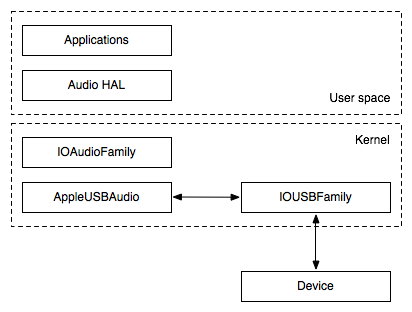
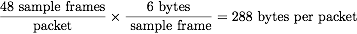
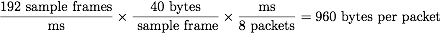
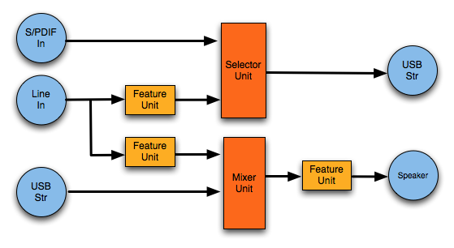
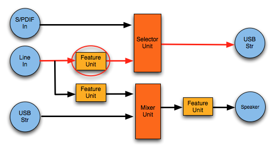
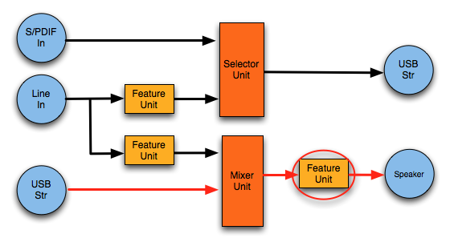
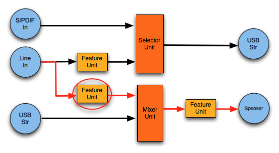
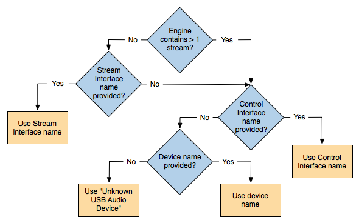
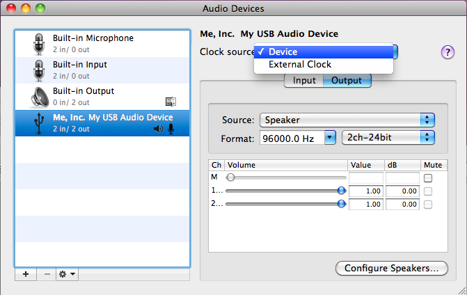

> 导航：[总目录](../../README.md) · [technotes](../../_indexes/technotes.md)


Technical Note TN2274

# USB Audio on the Mac

To successfully design a class compliant USB audio device that works seamlessly with the Mac, it is important to understand the features of the Mac's USB audio class driver, AppleUSBAudio. This document explains the driver's architecture, features, and algorithms available in Mac OS X v10.6 and later. It also includes a section discussing recently enhanced support for devices that comply with the USB Device Class Definition for Audio Devices 2.0 specification. The insights and design tips presented here are intended to assist device developers in creating high quality plug-and-play USB audio devices.

[Background](#apple-f4xwc4dqnrsv64tfmyxwi33df52wszbpirkfgnbqgaytamjrgywugsbrfvke4vcbi4yq)[Class Driver Overview](#apple-f4xwc4dqnrsv64tfmyxwi33df52wszbpirkfgnbqgaytamjrgywugsbrfvke4vcbi4za)[Unified Engine Model](#apple-f4xwc4dqnrsv64tfmyxwi33df52wszbpirkfgnbqgaytamjrgywugsbrfvke4vcbi4zq)[Artifact-free Streaming](#apple-f4xwc4dqnrsv64tfmyxwi33df52wszbpirkfgnbqgaytamjrgywugsbrfvke4vcbi42a)[Endpoint Synchronization Types](#apple-f4xwc4dqnrsv64tfmyxwi33df52wszbpirkfgnbqgaytamjrgywugsbrfvke4vcbi42f6mi)[Feedback for Asynchronous Output Streams](#apple-f4xwc4dqnrsv64tfmyxwi33df52wszbpirkfgnbqgaytamjrgywugsbrfvke4vcbi42f6my)[Maximum Packet Size](#apple-f4xwc4dqnrsv64tfmyxwi33df52wszbpirkfgnbqgaytamjrgywugsbrfvke4vcbi42f6mq)[USB Audio Controls](#apple-f4xwc4dqnrsv64tfmyxwi33df52wszbpirkfgnbqgaytamjrgywugsbrfvke4vcbi42q)[Control Publishing Rules](#apple-f4xwc4dqnrsv64tfmyxwi33df52wszbpirkfgnbqgaytamjrgywugsbrfvke4vcbi42v6mi)[Status Interrupts](#apple-f4xwc4dqnrsv64tfmyxwi33df52wszbpirkfgnbqgaytamjrgywugsbrfvke4vcbi43a)[Descriptive Naming](#apple-f4xwc4dqnrsv64tfmyxwi33df52wszbpirkfgnbqgaytamjrgywugsbrfvke4vcbi43q)[Device Name](#apple-f4xwc4dqnrsv64tfmyxwi33df52wszbpirkfgnbqgaytamjrgywugsbrfvke4vcbi43v6mi)[Channel Names](#apple-f4xwc4dqnrsv64tfmyxwi33df52wszbpirkfgnbqgaytamjrgywugsbrfvke4vcbi43v6mq)[Supported USB Audio 2.0 Features](#apple-f4xwc4dqnrsv64tfmyxwi33df52wszbpirkfgnbqgaytamjrgywugsbrfvke4vcbi44a)[High Speed Streaming](#apple-f4xwc4dqnrsv64tfmyxwi33df52wszbpirkfgnbqgaytamjrgywugsbrfvke4vcbi44f6mi)[Interface Association Descriptor](#apple-f4xwc4dqnrsv64tfmyxwi33df52wszbpirkfgnbqgaytamjrgywugsbrfvke4vcbi44f6mq)[Clock Entities](#apple-f4xwc4dqnrsv64tfmyxwi33df52wszbpirkfgnbqgaytamjrgywugsbrfvke4vcbi44f6my)[Status Interrupt Control Endpoint](#apple-f4xwc4dqnrsv64tfmyxwi33df52wszbpirkfgnbqgaytamjrgywugsbrfvke4vcbi44f6na)[Ways to Extend the Class Driver](#apple-f4xwc4dqnrsv64tfmyxwi33df52wszbpirkfgnbqgaytamjrgywugsbrfvke4vcbi44q)[Document Revision History](#apple-f4xwc4dqnrsv64tfmyxwi33df52wszbpirkfgnbqgaytamjrgywvezlwnfzws33ojbuxg5dpoj4s2rdpnz2ey2lonncwyzlnmvxhiskel4yq)

## Background

This document assumes the reader is familiar with the Core Audio framework, Audio HAL, I/O Kit basics and USB fundamentals. Please review these documents for more information:

- [Audio Device Driver Programming Guide](https://developer.apple.com/mac/library/documentation/DeviceDrivers/Conceptual/WritingAudioDrivers/)
- [I/O Kit Fundamentals](https://developer.apple.com/mac/library/documentation/DeviceDrivers/Conceptual/IOKitFundamentals/)
- [USB Device Class Definition for Audio Devices specifications](http://www.usb.org/developers/devclass_docs#approved)

__Note:__ There is often confusion when referencing the various USB related specifications. See Table 1 for a summary of the terms used in this article to reference USB specifications.

__Table 1__  Terminology used in this document to reference USB related specifications.

| Terms used in this document | Reference |
| USB Audio 1.0 USB Audio 2.0 | Revisions of the USB Device Class Definition for Audio Devices |
| USB Audio Data Formats 1.0 USB Audio Data Formats 2.0 | Revisions of the USB Device Class Definition for Audio Data Formats |
| USB 1.0 USB 1.1 USB 2.0 | Revisions of the Universal Serial Bus Specification |

The reader is strongly encouraged to review the documents in Table 1.

[Back to Top](#)

## Class Driver Overview

AppleUSBAudio is an I/O Kit based kernel driver that is designed to support both USB Audio 1.0 and USB Audio 2.0 class compliant devices. Figure 1 shows where AppleUSBAudio fits in the Mac OS X audio stack architecture. In addition to transporting audio data between the hardware and the host’s sample buffer, it also communicates format and control changes between the host and the device (like volume, mute, format, input/clock source, etc.) AppleUSBAudio presents these hardware resources to applications through the HAL (audio hardware abstraction layer.)

__Figure 1__  AppleUSBAudio in the Mac OS X audio stack



The AppleUSBAudio driver communicates to devices via the USB transport, using the IOUSBFamily APIs. AppleUSBAudio builds upon the IOAudioFamily layer which provides general audio driver functions like maintaining the sample and mix buffers, facilitating communication over the kernel and user space boundary through user clients, and more. Please see the [Audio Device Driver Programming Guide](https://developer.apple.com/mac/library/documentation/DeviceDrivers/Conceptual/WritingAudioDrivers/) for more details.

AppleUSBAudio is a mature driver that supports many USB Audio 1.0 and 2.0 features. Table 2 highlights some of the supported features that are discussed in this article.

__Table 2__  Supported features in AppleUSBAudio. A checkmark in the “USB Audio 1.0” column means that this feature is supported for USB Audio 1.0 devices. The same follows for the “USB Audio 2.0” column.

| Feature | USB Audio 1.0 devices | USB Audio 2.0 devices | Notes | Document section |
| Input stream sample synchronous to output stream | X | X | Streams must meet requirements to occupy the same engine | Unified Engine Model |
| Synchronous endpoints | X | X |  | Endpoint Synchronization Types |
| Output adaptive endpoints | X | X | Usually paired with an asynchronous input endpoint. Input adaptive endpoints are not supported. | Endpoint Synchronization Types |
| Asynchronous endpoints | X | X |  | Endpoint Synchronization Types |
| Status interrupts | X | X | Device informs host of volume, mute, input selector, clock validity | Status Interrupts |
| Predefined and custom channel names | X | X | Uses iChannelNames | Descriptive Naming |
| Clock entity descriptors |  | X | Clock Source, Clock Selector, Clock Multiplier | Clock Entities |
| High speed isochronous audio data transfers |  | X | Can support high channel count/sample rates. Example: 10 channels of input and 10 channels of output, 32-bit @ 192 kHz | High Speed Streaming |

[Back to Top](#)

## Unified Engine Model

AppleUSBAudio represents the streams of a USB audio device to the application layer using IOAudioFamily's IOAudioStream entities. One or more streams are associated with each engine.

In Mac OS v10.5.6 and earlier, AppleUSBAudio restricted each engine to one stream only. Then in v10.5.7, AppleUSBAudio’s engine model was redesigned to combine multiple streams per engine when possible. In cases where input and output streams can reside on the same engine, this architecture achieves sample synchronization and consistent latencies between streams.

In order to combine multiple streams on one engine, the following criteria must be met by the stream interfaces:

1. All sample rate sets must match.
2. The same synchronization type is used for all interface alternate settings.
3. The streams reside in the same clock domain.

Please note the following behaviors of streams that occupy the same engine:

- These streams operate in the same time domain and sample rate setting (but not necessarily the same format.)
- These streams cannot be activated independently. They will always start and stop together.

__Important:__ If a device is designed to combine multiple streams on a single engine, it must support starting multiple streams at the same time. If the device needs more time to do this, consider increasing the lock delay (see Section 4.6.1.2 of the USB Audio 1.0 Spec and Section 4.10.1.2 of the USB Audio 2.0 Spec.)

[Back to Top](#)

## Artifact-free Streaming

The primary and most important function of the AppleUSBAudio driver is to support reliable, artifact-free audio streaming. Developers can aid the driver in achieving this goal by selecting the appropriate endpoint descriptor values for synchronization type and maximum packet size.

### Endpoint Synchronization Types

To maintain glitch-free audio, AppleUSBAudio must regularly present timestamps to Core Audio that accurately represent the audio data rate of the engine (see “The Audio I/O Model Up Close” in the [Audio Device Driver Programming Guide](https://developer.apple.com/mac/library/documentation/DeviceDrivers/Conceptual/WritingAudioDrivers/) for more details.) When the device publishes the correct endpoint synchronization types in its configuration descriptors, AppleUSBAudio can pick the appropriate stream from which to generate the most accurate timestamps for the engine.

The driver supports all three synchronization types defined by the USB 2.0 Specification (see Section 5.12.4.1 Synchronization Type and Table 5-12):

- Synchronous: synced to host via SOF
- Asynchronous: not synced to host, data rate is locked to a free-running internal clock on the device or an external source like S/PDIF
- Adaptive: synced to host via data rate

Table 3 below lists synchronization type combinations that work well with Mac OS X.

__Table 3__  Recommended endpoint synchronization type combinations.

| Input Stream | Output Stream | Device derives its clock from | Master clock | Timestamps generated from |
| Synchronous | Synchronous | SOF | Mac | Input stream |
| Asynchronous | Adaptive | Output data rate | Mac | Output stream |
| Asynchronous | Asynchronous | Free-running internal or external source | Device or external | Input stream |

If a device supports multiple clock domains, USB Audio 2.0 clock entity descriptors should be used to clearly communicate its clock architecture to AppleUSBAudio. Please see the [Clock Entities](#apple-f4xwc4dqnrsv64tfmyxwi33df52wszbpirkfgnbqgaytamjrgywugsbrfvke4vcbi44f6my) section later in this article for information about these descriptors.

__Note:__ Devices may use USB Audio 2.0 descriptors for full speed devices, not just high speed devices. This can be useful to more accurately describe full speed devices with complicated clock architectures such as multiple clock domains.

### Feedback for Asynchronous Output Streams

To stream audio via an asynchronous sink endpoint, a device must continuously update the host of its desired data rate relative to the SOF frequency (see Section 5.10.4 of the USB 1.0 Spec and Section 5.12.4 of the USB 2.0 Spec.) AppleUSBAudio supports two feedback mechanisms:

1. Explicit feedback endpoint: The device provides an associated isochronous feedback endpoint which sends packets containing the number of samples per USB (micro)frame (see Section 3.7.2.2 of the USB Audio 1.0 Spec and Section 3.16.2.2 of the USB Audio 2.0 Spec.)
2. Implicit feedback: The driver uses the number of sample frames in the main input stream's packets to construct the packets for all output streams within the engine.  No feedback endpoint is required (see Section 5.12.4.3 of the USB 2.0 Spec.)

In order to use implicit feedback, the device must satisfy the following requirements:

- Asynchronous input and output streams reside on one engine (i.e. needs to meet criteria for the Unified Engine Model.)
- The polling intervals (bInterval) for the stream endpoints must match.
- Either the input stream endpoint “Usage type” is set to “Implicit feedback data endpoint” (USB Audio 2.0 only, Section 4.10.1.1) and/or the sync feedback endpoint is omitted (see Table 4.)

Table 4 illustrates the synchronization method used by the driver in various scenarios. If indicated by the “Usage type” field, the driver will treat the input stream as implicit feedback and ignore an additional sync feedback endpoint if present (Config 2.) This allows a device to implement both feedback mechanisms if needed for compatibility reasons. Config 3 is only recommended for USB Audio 1.0 devices where endpoint “Usage type” is not available.

__Table 4__  Feedback used by AppleUSBAudio for asynchronous output under various configuration scenarios.

| Config | Input endpoint descriptor specifies implicit feedback usage type | Feedback endpoint present | Meets implicit requirements | Sync method | Recommended? |
| 1 | Yes | No | Yes | Implicit | Yes |
| 2 | Yes | Yes | Yes | Implicit | Only for compatibility |
| 3 | No | No | Yes | Implicit | Only for USB Audio 1.0 devices |
| 4 | No | Yes | n/a | Feedback endpoint | Yes |
| 5 | Yes | Yes | No | Feedback endpoint | No |

__Note:__ We recommend using implicit feedback when possible because it conserves both device and host resources, and increases feedback precision.

### Maximum Packet Size

It is very important to specify the correct value for each endpoint’s maximum packet size because an incorrect value could result in audio corruption. The packet size cannot exceed 1023 bytes for full speed devices and 1024 bytes for high speed devices (Section 5.6.3 of the USB 2.0 Specification.) To determine the exact value, one needs to identify the supported format and sample rate configuration that consumes the largest possible bandwidth for the endpoint.

The amount of audio data contained in each packet may vary depending on the speed of the device. If the device is full speed, each packet contains 1 millisecond (ms) of data. On high speed USB devices, each USB frame is split into eight 125 microsecond segments called microframes. Endpoints can specify the polling interval at which transfers can occur, i.e. every microframe, every other microframe, etc. This frequency must be taken into account when calculating the max packet size. (At this time, AppleUSBAudio supports at most one transaction per microframe. See the [High Speed Streaming](#apple-f4xwc4dqnrsv64tfmyxwi33df52wszbpirkfgnbqgaytamjrgywugsbrfvke4vcbi44f6mi) section for more information.)

#### Calculation Examples

The following full and high speed examples illustrate the calculation procedure:

__A) 48 kHz / 24-bit / 2 channel / full speed__

Each sample frame contains 2 channels of 3 byte samples which is 6 bytes per sample frame. The packet size is calculated as follows:




This value assumes that the data rate will never vary, as is the case when the stream is synchronous to SOF. If the endpoint is adaptive or asynchronous, one additional sample frame should be added to accommodate adjustments in the data rate. Section 2.3.1.1 of the Audio Data Formats 2.0 Specification limits variation in the packet size by +/- 1 sample frame.

Synchronous: Max packet size = 288 bytes

Adaptive or asynchronous: Max packet size = 288 + 6 = 294 bytes

__B) 44.1 kHz / 16-bit / 8 channel / full speed__

Each sample frame contains 8 channels of 2 byte samples which is 16 bytes per sample frame. The packet size is calculated as follows:


Packets cannot contain partial sample frames. So, while most packets will contain 44 sample frames, every tenth packet will contain 45 sample frames.


Synchronous, adaptive or asynchronous\*: Max packet size = 720 bytes

\*The extra permitted sample frame has already been included.

__C) 192 kHz / 32-bit / 10 channel / high speed__

This example assumes one transaction every microframe (i.e. the polling interval is 1 microframe.)

Each sample frame contains 10 channels of 4 byte samples which is 40 bytes per sample frame. The packet size is calculated as follows:


Synchronous:



Adaptive or asynchronous: Max packet size = 960 + 40 = 1000 bytes

__Table 5__  Summary of max packet size calculation examples. “Sync” indicates synchronous endpoints, “adapt” indicates adaptive endpoints, and “async” refers to asynchronous endpoints.

| Example | Sample rate (Hz) | Bit depth | Channels | Average sample frames per ms | Max sample frames per ms (sync) | Trans-actions per ms | Max packet size, sync (bytes) | Max packet size, adapt & async (bytes) |
| A (full) | 48000 | 24 | 2 | 48 | 48 | 1 | 288 | 294 |
| B (full) | 44100 | 16 | 8 | 44.1 | 45 | 1 | 720 | 720 |
| C (high) | 192000 | 32 | 10 | 7680 | 7680 | 8 | 960 | 1000 |

#### How AppleUSBAudio Uses the Max Packet Size

When starting a stream, the driver reserves the minimum USB isochronous bandwidth possible: the minimum of the max packet size and the bandwidth required for the current sample rate and format. This maximizes the remaining available bandwidth for other USB devices, including other audio devices connected to the Mac. It also increases the likelihood that the bandwidth request will be granted in situations where much of the bandwidth is already in use.

#### Important Tips

When determining the max packet size, make sure not to forget the extra sample frame in the calculation for these special cases:

- Sample rates that do not divide evenly into packets (i.e. 44.1 kHz)
- Adaptive and asynchronous endpoints

When streaming, devices must always observe the bandwidth restrictions for each of the sample rate and format settings. This includes the +/- 1 sample frame rule in Section 2.3.1.1 of the Audio Data Formats 2.0 Specification.

__Warning:__ Failure to comply with the bandwidth rules for the current sample rate and format may not only result in audio corruption for that particular stream, but for all of the other streams on the same engine.

[Back to Top](#)

## USB Audio Controls

AppleUSBAudio parses the audio control interface descriptors to discover the audio topology for a USB audio device. The topology consists of building blocks or units that represent the audio function and provide a mechanism to manipulate parameters, like adjusting the audio controls. Figure 2 shows a simple topology that consists of Input and Output Terminals in blue, Feature Units in yellow, and a Selector Unit and a Mixer Unit in orange.

__Figure 2__   A sample audio function topology showing two input sources (S/PDIF and line in) as well as one output (speaker.)



AppleUSBAudio uses the information contained in the audio topology to find a device’s input and output volume/mute controls, hardware play through controls, input selector, and even clock source options for USB Audio 2.0 devices. AppleUSBAudio exposes these controls to Core Audio as IOAudioControls. This section focuses on volume, mute, and play through controls specifically.

Feature Units contain volume and mute controls which can logically map to volume, mute, and hardware play through controls on the Mac. When AppleUSBAudio creates input and output stream volume and mute IOAudioControls, these appear in Sound Preferences and the Audio MIDI Setup (AMS) application. In the case of play through, a Feature Unit’s mute control appears as a “Thru” toggle in AMS only. The play through volume controls are also published by AppleUSBAudio but do not appear in AMS or the Sound Preferences pane. However, they can be accessed via the developer audio utility HALLab.

__Important:__ Since play through volume is not accessible to the user in AMS, developers should set the device's play through volume control default to a reasonable level to ensure a good user experience.

### Control Publishing Rules

Since multiple Feature Units can exist in an audio path, AppleUSBAudio uses a special algorithm to select the Feature Unit that contains the logical controls to expose to the Audio HAL. The algorithm seeks to accommodate the most common cases and to minimize undesirable side effects. The rules are as follows:

__\* Volume/mute for input sources:__  AppleUSBAudio will publish the controls contained in the Feature Unit closest to the selector unit on the Input Terminal side as shown in Figure 3.

__Figure 3__   Feature unit selected for line input volume and mute controls.



__Important:__ Volume and mute controls intended to control the same source should be contained in the same Feature Unit (i.e. do not separate volume and mute in two consecutive Feature Units.)

__\* Volume/mute for output sources:__  AppleUSBAudio will publish the controls contained in the Feature Unit closest to the Output Terminal as shown in Figure 4.

__Figure 4__  Feature unit selected for speaker output volume and mute controls.



__\* Hardware play through with Mixer Unit in path:__  AppleUSBAudio will publish controls contained in a Feature Unit between the Input Terminal and the Mixer Unit.  Searching from the Input Terminal to the Mixer Unit, the driver selects the first Feature Unit that isn't shared with another audio path. An example is shown in Figure 5.

__Figure 5__  Feature Unit selected for play through controls on a path that contains a Mixer Unit.



__Important:__ Play through controls cannot be shared with another audio path because this could result in unwanted side effects. For example, if a play through control is also contained in a record path, muting the play through control would also unintentionally mute the recording input.

__\* Hardware play through without Mixer Unit in path:__  AppleUSBAudio will publish controls contained in the Feature Unit closest to the Input Terminal that isn't shared with another audio path.

[Back to Top](#)

## Status Interrupts

A status interrupt pipe can be used to inform the host that a setting has changed on the device. This feedback maintains synchronization between the Mac’s user interface and the device state. Currently, AppleUSBAudio updates certain audio controls on the Mac for interrupts originating from Feature, Selector and Clock units as described in Table 6.

__Table 6__  Types of status interrupts that AppleUSBAudio supports and example device and Mac behavior.

| Unit | Associated controls | Example device event that triggers an interrupt | Mac response to interrupt |
| Feature unit | Volume and mute | User turns volume knob | Volume is updated in AMS and Sound Preferences UI |
| Selector unit | Input path selector | User switches toggle from microphone input to line input | “Source” selector is updated to “Line input” in AMS’s input tab for the device |
| Clock unit (USB Audio 2.0 only) | Clock validity, supported sample rate(s) changed | User disconnects S/PDIF cable which was in use as the Clock Source | AppleUSBAudio switches to an alternate valid Clock Source and updates selector in AMS |

Please refer to Section 3.7.1.2 of the USB Audio 1.0 standard and Section 6 of the USB Audio 2.0 standard for more information.

[Back to Top](#)

## Descriptive Naming

Another way to improve the user experience with a USB audio class device on Mac OS X is to provide meaningful and descriptive device and channel names. The following sections will explain how to accomplish this with the device’s configuration descriptors.

### Device Name

The device name will appear in many places on the Mac, including in Audio MIDI Setup, Sound Preferences, and in third party audio applications. Core Audio represents each engine as a device in the system. If an engine has a name, Core Audio will use that as the device name, otherwise it will use the USB device name. Figure 6 shows how AppleUSBAudio and Core Audio will determine the descriptive name assigned to the device, depending on the number of streams associated with the engine, and the presence of the control and stream interface names, and USB device name.

__Figure 6__  Device naming algorithm.



### Channel Names

AppleUSBAudio supports the Audio Cluster Descriptors as described in section 3.7.2.3 “Audio Channel Cluster Format” of the USB Audio 1.0 specification and section 4.1 “Audio Channel Cluster Descriptor” in the USB Audio 2.0 specification. These descriptors allow device developers to name the channels in a stream, using either predefined names (such as “Front Left”, or “Low Frequency Effects”, etc.) or custom names. Listing 1 shows the descriptor fields of interest, as represented in AppleUSBAudio. Please refer to the USB Audio specification sections previously mentioned for a thorough explanation of the use of these fields.

__Listing 1__  Structure representing the Audio Cluster Descriptor in AppleUSBAudio

```c
typedef struct AudioClusterDescriptor {
    UInt8		bNrChannels;
    UInt32		bmChannelConfig;
    UInt8		iChannelNames;
} AudioClusterDescriptor, *AudioClusterDescriptorPtr;
```

Audio Cluster Descriptors can be embedded in Input Terminal, Mixer, Processing, and Extension Unit descriptors. AppleUSBAudio searches for the Audio Cluster Descriptor on an audio path starting from the Output Terminal to the Input Terminal and uses the first one it finds.

[Back to Top](#)

## Supported USB Audio 2.0 Features

AppleUSBAudio was enhanced in Snow Leopard to support many of the key features contained in the USB Class Definition for Audio Devices 2.0 specification. The following features are currently supported:

### High Speed Streaming

(USB 2.0, Sections 5.6 and 9.6.6)

Mac OS X supports high speed streaming, up to 1024 bytes per microframe for each isochronous endpoint, including overhead.

__Note:__ The actual bandwidth available for endpoints depends on the current available bandwidth on the USB bus.

For example, Snow Leopard (and later) is able to stream 10 channels of 32-bit audio at 192 kHz to and from a USB Audio 2.0 device. Additional information pertaining to isochronous data transfer can be found in the [USB Device Interface Guide](https://developer.apple.com/mac/library/documentation/DeviceDrivers/Conceptual/USBBook/USBIntro/USBIntro.html).

### Interface Association Descriptor

(USB Audio 2.0, Section 4.6)

This required descriptor identifies an Audio Interface Collection. The interfaces grouped in the collection must be contiguously numbered and in the following order:

1. AudioControl Interface (mandatory)
2. AudioStreaming Interface(s)
3. MIDIStreaming Interface(s)

### Clock Entities

(USB Audio 2.0, Sections 3.13.11, 4.7.2.1 - 4.7.2.3)

Clock Domains are described using the new 2.0 Clock Entities: Clock Source, Clock Selector, and Clock Multiplier. The AppleUSBAudio driver also supports the associated clock related AudioControl Requests as specified in Sections 5.2.5.1 through 5.2.5.3.

Unlike USB Audio 1.0 devices, the use of switching the Alternate Setting to control the sampling frequency is prohibited for USB Audio 2.0 devices. Instead, a Clock Source entity serves as the master clock for a clock domain, which can provide a sampling signal frequency. Clock Selectors enable both the host and the audio function to switch clock inputs. Figure 7 shows how a Clock Selector appears in AMS. The Clock Multiplier provides a mechanism to derive additional sampling frequencies within a clock domain that are synchronous to the input clock signal.

__Figure 7__  Clock Selector as it appears in Audio MIDI Setup. In this case, the Clock Selector allows the user to select between the device and external clock sources.



### Status Interrupt Control Endpoint

(USB Audio 2.0, Section 4.8.2.1, 6)

AppleUSBAudio contains additional support for parsing the Interrupt Data Message Format in Section 6.1. The only additional 2.0 status interrupt support added to the driver was for the Clock Source unit.

AppleUSBAudio responds in various ways to an interrupt generated from a Clock Source unit that is currently driving the data rate. If the clock validity bit indicates the clock is invalid and the audio topology contains a Clock Selector, the driver searches for an alternate valid Clock Source and switches to that (as described in Table 6.) If the Clock Source is valid, then it assumes the sample rate has changed. In this case, it republishes the available rates and updates the current device sample rate on the host.

[Back to Top](#)

## Ways to Extend the Class Driver

AppleUSBAudio was designed to allow for some vendor specific extensions. This gives developers the advantage of adding special features without having to maintain the basic feature set of a high performance audio driver.

One way to augment the behavior of the class driver is to provide a codeless kernel extension (kext) that overrides certain properties of a USB audio device. These properties include the USB device and interface names, localization bundle, Core Audio HAL plugin, providing access to a custom control panel via Audio MIDI Setup's "Configure device..." option and more. This [sample code](https://developer.apple.com/mac/library/samplecode/SampleUSBAudioOverrideDriver/Introduction/Intro.html) illustrates the various properties that can be modified.

Another way to customize AppleUSBAudio is to add vendor specified DSP processing to input and/or output audio streams. Developers can create a custom [USB audio plugin](https://developer.apple.com/mac/library/samplecode/SampleUSBAudioPlugin/Introduction/Intro.html) that performs audio signal processing only for their device. This mechanism can also be used to provide access to a custom control panel. In the initialization routine, call `super::pluginSetConfigurationApp()` with the control panel's application bundle ID.

[Back to Top](#)

---

#### Document Revision History

| __Date__ | __Notes__ |
| 2013-06-03 | Updated to include integrating a custom control application from a codeless override kext. |
| 2011-09-22 | Updated with a new section describing feedback mechanisms for asynchronous output streams, including implicit feedback. Made minor editorial corrections. |
| 2010-06-07 | New document that details Apple's support for USB audio to help developers design class compliant devices that work seamlessly with the Mac. |
