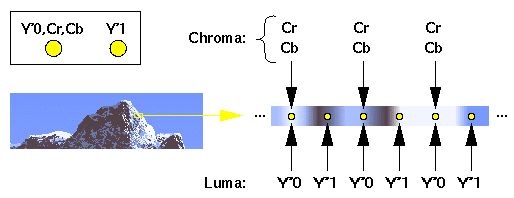
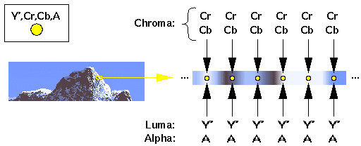
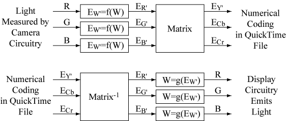
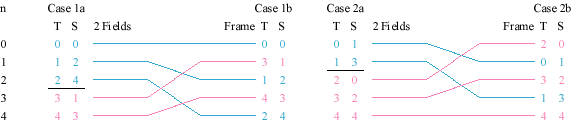
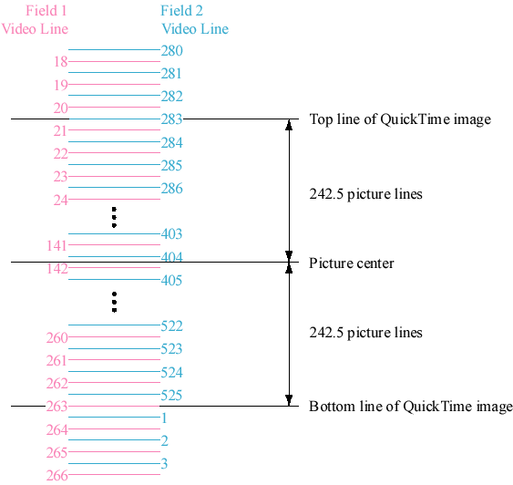
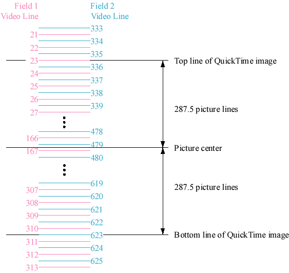

> 导航：[总目录](../../README.md) · [technotes](../../_indexes/technotes.md)


Technical Note TN2162

# Uncompressed Y´CbCr Video in QuickTime Files

Originally published December 14th, 1999 as Ice Floe Dispatch 19, part of the "Letters from the Ice Floe" group of QuickTime engineering documents.

The QuickTime file format allows storage of uncompressed Y´CbCr video data. This document provides documentation and labels so that:

- Uncompressed Y´CbCr video files written by one application can be interpreted correctly by another. This includes:

  - Y´CbCr color parameters (e.g., primaries, transfer function, matrix)
  - bit layout of Y´CbCr components
  - treatment of out-of-range component values in data
  - temporal relationship of Y´CbCr components relative to each other (e.g., field/frame information)
  - spatial relationship of Y´CbCr components relative to each other (e.g., pixel aspect ratio, cositing)
  - spatial relationship of Y´CbCr components relative to a canonical image center and a canonical clean aperture (e.g., for correct image alignment during compositing)
- When these files are digitized or output using a particular interface standard (e.g., NTSC, digital 525, PAL, digital 625), the relevant QuickTime component (e.g., video digitizer, image decompressor, video output) can map colors, canonical image center, and canonical clean aperture between the file and the video signal in a predictable and consistent way.

Using these labels, application and device developers can finally relieve end users of the following nagging usability problems:

- "I captured this file on a Mac but it looks dark on a PC."
- "I rendered to this file in app A; it plays ok in MoviePlayer but looks like snow in app B."
- "I captured this data and the colors look wrong on my computer screen."
- "I captured this data but the fields are swapped when I play it back. My application has 6 different field-related controls and I've tried all 64 combinations but none of them work."
- "I captured and played this data OK, but whenever I try to render or do effects using this data, there are stuttery forward-backward motion problems."
- "I captured this data and it looks squished or stretched horizontally."
- "Circles I lay down in my application don't look circular on the video monitor."
- "I am compositing similar video footage which I had captured with two different devices, and the video data is shifted horizontally. No setting of captured image size seems to help."

The documentation and labels outlined above make correct interchange possible. For the common case of digitizing and reproducing the production aperture of standard video signals, it is also desirable to make correct interchange simple and inexpensive by reducing the number of permutations of labels which applications and devices must support in order to interoperate with an acceptable number of other applications and devices.

To that end, this documentation also defines a level of conformance called the "production" level. When an application or device specifies that it can handle a format with a specified:

- compression type and
- video interface standard

at the production level of conformance, then this greatly constrains the labels defined in this document. In The Production Level of Conformance we will detail the constraints.

An application or device which supports a compression type and a video interface standard in this document must be able to handle that combination at the production level of conformance. An application or device is of course free to support additional label permutations.

The idea here is that all uncompressed Y´CbCr applications and devices support at least the production level of conformance. This greatly simplifies interchange and application development.

In this document, a label constraint which is not explicitly associated with production level conformance applies at all times.

[Overview](#apple-f4xwc4dqnrsv64tfmyxwi33df52wszbpirkfgnbqgaytgmbxgawugsbrfvke4vcbi4yq)[Conventions](#apple-f4xwc4dqnrsv64tfmyxwi33df52wszbpirkfgnbqgaytgmbxgawugsbrfvke4vcbi4za)[ImageDescription Structures and Image Buffers](#apple-f4xwc4dqnrsv64tfmyxwi33df52wszbpirkfgnbqgaytgmbxgawugsbrfvke4vcbi4zq)[QuickTime Image Rates and Video](#apple-f4xwc4dqnrsv64tfmyxwi33df52wszbpirkfgnbqgaytgmbxgawugsbrfvke4vcbi42q)[The Problem](#apple-f4xwc4dqnrsv64tfmyxwi33df52wszbpirkfgnbqgaytgmbxgawugsbrfvke4vcbi42s2vciivpvauspijgekti)[Solutions](#apple-f4xwc4dqnrsv64tfmyxwi33df52wszbpirkfgnbqgaytgmbxgawugsbrfvke4vcbi42s2u2pjrkviskpjzjq)[Audio and Video](#apple-f4xwc4dqnrsv64tfmyxwi33df52wszbpirkfgnbqgaytgmbxgawugsbrfvke4vcbi42s2qkvireu6x2bjzcf6vsjircu6)[Y´CbCr Spatial Relationship](#apple-f4xwc4dqnrsv64tfmyxwi33df52wszbpirkfgnbqgaytgmbxgawugsbrfvke4vcbi43a)[Y´CbCr Numerical Value and Color Parameters](#apple-f4xwc4dqnrsv64tfmyxwi33df52wszbpirkfgnbqgaytgmbxgawugsbrfvke4vcbi43q)[Scheme A: 'Wide-Range' Mapping with Unsigned Y´, Two's Complement Cb, Cr](#apple-f4xwc4dqnrsv64tfmyxwi33df52wszbpirkfgnbqgaytgmbxgawugsbrfvke4vcbi43s2u2djbcu2rk7ifpv6x2xjfcekx2sifheork7l5gucucqjfheox2xjfkeqx2vjzjusr2oivcf6wk7l5pv6vcxj5pvgx2dj5gvatcfjvcu4vc7inbf6x2dki)[Scheme B: 'Video-Range' Mapping with Unsigned Y´, Offset Binary Cb, Cr](#apple-f4xwc4dqnrsv64tfmyxwi33df52wszbpirkfgnbqgaytgmbxgawugsbrfvke4vcbi43s2u2djbcu2rk7ijpv6x2wjfcekt27kjau4r2fl5pu2qkqkbeu4r27k5evisc7kvhfgskhjzcuix2zl5pv6x2pizdfgrkul5bestsbkjmv6q2cl5puguq)[Compression Types](#apple-f4xwc4dqnrsv64tfmyxwi33df52wszbpirkfgnbqgaytgmbxgawugsbrfvke4vcbi44a)[Zero Bits](#apple-f4xwc4dqnrsv64tfmyxwi33df52wszbpirkfgnbqgaytgmbxgawugsbrfvke4vcbi44c2wsfkjhv6qsjkrjq)['yuv2' vs. '2vuy'](#apple-f4xwc4dqnrsv64tfmyxwi33df52wszbpirkfgnbqgaytgmbxgawugsbrfvke4vcbi44c2x2zkvldex27kzjv6x27gjlfkwk7)['2vuy' 4:2:2 Compression Type](#apple-f4xwc4dqnrsv64tfmyxwi33df52wszbpirkfgnbqgaytgmbxgawugsbrfvke4vcbi44c2xzskzkvsx27grptexzsl5bu6tkqkjcvgu2jj5hf6vczkbcq)['yuv2' 4:2:2 Compression Type](#apple-f4xwc4dqnrsv64tfmyxwi33df52wszbpirkfgnbqgaytgmbxgawugsbrfvke4vcbi44c2x2zkvldex27grptexzsl5bu6tkqkjcvgu2jj5hf6vczkbcq)[v308' 4:4:4 Compression Type](#apple-f4xwc4dqnrsv64tfmyxwi33df52wszbpirkfgnbqgaytgmbxgawugsbrfvke4vcbi44c2vrtga4f6xzul42f6nc7inhu2ucsivjvgskpjzpviwkqiu)[v408' 4:4:4:4 Compression Type](#apple-f4xwc4dqnrsv64tfmyxwi33df52wszbpirkfgnbqgaytgmbxgawugsbrfvke4vcbi44c2vruga4f6xzul42f6nc7grpugt2nkbjeku2tjfhu4x2ulfiek)[v216' 4:2:2 Compression Type](#apple-f4xwc4dqnrsv64tfmyxwi33df52wszbpirkfgnbqgaytgmbxgawugsbrfvke4vcbi44c2vrsge3f6xzul4zf6ms7inhu2ucsivjvgskpjzpviwkqiu)['v410' 4:4:4 Compression Type](#apple-f4xwc4dqnrsv64tfmyxwi33df52wszbpirkfgnbqgaytgmbxgawugsbrfvke4vcbi44c2x2wgqytax27grptixzul5bu6tkqkjcvgu2jj5hf6vczkbcq)[v210' 4:2:2 Compression Type](#apple-f4xwc4dqnrsv64tfmyxwi33df52wszbpirkfgnbqgaytgmbxgawugsbrfvke4vcbi44c2vrsgeyf6xzul4zf6ms7inhu2ucsivjvgskpjzpviwkqiu)[The 'colr' ImageDescription Extension](#apple-f4xwc4dqnrsv64tfmyxwi33df52wszbpirkfgnbqgaytgmbxgawugsbrfvke4vcbi44q)[The 'nclc' 'colr' ImageDescription Extension: Y´CbCr Color Parameters](#apple-f4xwc4dqnrsv64tfmyxwi33df52wszbpirkfgnbqgaytgmbxgawugsbrfvke4vcbi4yta)[Primaries](#apple-f4xwc4dqnrsv64tfmyxwi33df52wszbpirkfgnbqgaytgmbxgawugsbrfvke4vcbi4ytalkqkjeu2qksjfcvg)[Transfer Function](#apple-f4xwc4dqnrsv64tfmyxwi33df52wszbpirkfgnbqgaytgmbxgawugsbrfvke4vcbi4ytalkukjau4u2givjf6rsvjzbviskpjy)[Matrix](#apple-f4xwc4dqnrsv64tfmyxwi33df52wszbpirkfgnbqgaytgmbxgawugsbrfvke4vcbi4ytalknifkfesky)[Sample 'colr' Settings](#apple-f4xwc4dqnrsv64tfmyxwi33df52wszbpirkfgnbqgaytgmbxgawugsbrfvke4vcbi4ytalktifgvatcfl5pugt2mkjpv6u2fkrkestshkm)[The 'fiel' ImageDescription Extension: Field/Frame Information](#apple-f4xwc4dqnrsv64tfmyxwi33df52wszbpirkfgnbqgaytgmbxgawugsbrfvke4vcbi4ytalkujbcv6x2gjfcuyx27jfgucr2fircvgq2sjfifiskpjzpukwcuivhfgskpjzpv6rsjivgeix2gkjau2rk7jfhemt2sjvaviskpjy)[Pixel Aspect Ratio, Clean Aperture, and Picture Aspect Ratio](#apple-f4xwc4dqnrsv64tfmyxwi33df52wszbpirkfgnbqgaytgmbxgawugsbrfvke4vcbi4ytc)[The 'pasp' ImageDescription Extension: Pixel Aspect Ratio](#apple-f4xwc4dqnrsv64tfmyxwi33df52wszbpirkfgnbqgaytgmbxgawugsbrfvke4vcbi4yte)[Standard Definition Pixel Aspect Ratios](#apple-f4xwc4dqnrsv64tfmyxwi33df52wszbpirkfgnbqgaytgmbxgawugsbrfvke4vcbi4ytelktkrau4rcbkjcf6rcfizeu4skujfhu4x2qjfmektc7ifjvarkdkrpveqkujfhvg)[High Definition Pixel Aspect Ratios](#apple-f4xwc4dqnrsv64tfmyxwi33df52wszbpirkfgnbqgaytgmbxgawugsbrfvke4vcbi4ytelkijfduqx2eivdestsjkreu6ts7kbevqrkml5avgucfinkf6usbkreu6uy)[The 'clap' ImageDescription Extension: Clean Aperture](#apple-f4xwc4dqnrsv64tfmyxwi33df52wszbpirkfgnbqgaytgmbxgawugsbrfvke4vcbi4ytg)[Typical width, height, and 'clap' Settings](#apple-f4xwc4dqnrsv64tfmyxwi33df52wszbpirkfgnbqgaytgmbxgawugsbrfvke4vcbi4ytglkulfiesq2bjrpvoskekref6x2iiveuoscul5puctsel5pugtcbkbpv6u2fkrkestshkm)[525-Line Example](#apple-f4xwc4dqnrsv64tfmyxwi33df52wszbpirkfgnbqgaytgmbxgawugsbrfvke4vcbi4ytgljvgi2v6tcjjzcv6rkyifgvatcf)[625-Line Example](#apple-f4xwc4dqnrsv64tfmyxwi33df52wszbpirkfgnbqgaytgmbxgawugsbrfvke4vcbi4ytgljwgi2v6tcjjzcv6rkyifgvatcf)[The Production Level of Conformance](#apple-f4xwc4dqnrsv64tfmyxwi33df52wszbpirkfgnbqgaytgmbxgawugsbrfvke4vcbi4yti)[Appendix: Backwards Compatibility](#apple-f4xwc4dqnrsv64tfmyxwi33df52wszbpirkfgnbqgaytgmbxgawugsbrfvke4vcbi4ytk)['2vuy' Backwards Compatibility](#apple-f4xwc4dqnrsv64tfmyxwi33df52wszbpirkfgnbqgaytgmbxgawugsbrfvke4vcbi4ytklk7gjlfkwk7l5becq2lk5averctl5bu6tkqifkesqsjjreviwi)['yuv2' Backwards Compatibility](#apple-f4xwc4dqnrsv64tfmyxwi33df52wszbpirkfgnbqgaytgmbxgawugsbrfvke4vcbi4ytklk7lfkvmms7l5becq2lk5averctl5bu6tkqifkesqsjjreviwi)[Appendix: Issues Not Addressed](#apple-f4xwc4dqnrsv64tfmyxwi33df52wszbpirkfgnbqgaytgmbxgawugsbrfvke4vcbi4ytklkbkbiektsejfmf6x2jknjvkrktl5he6vc7ifceiusfknjukra)[Document Revision History](#apple-f4xwc4dqnrsv64tfmyxwi33df52wszbpirkfgnbqgaytgmbxgawvezlwnfzws33ojbuxg5dpoj4s2u2xkjea)

## Overview

This document describes compression types for storing uncompressed Y´CbCr data in a QuickTime file:

__Table 1__

| Compression Type | FourCC | Description |
| k422YpCbCr8CodecType | '2vuy' | 8-bit-per-component 4:2:2 |
| kComponentVideoCodecType | 'yuv2' | 8-bit-per-component 4:2:2 |
| k444YpCbCr8CodecType | 'v308' | 8-bit-per-component 4:4:4 |
| k4444YpCbCrA8CodecType | 'v408' | 8-bit-per-component 4:4:4:4 |
| k422YpCbCr16CodecType | 'v216' | 10,12,14,16-bit-per-component 4:2:2 |
| k444YpCbCr10CodecType | 'v410' | 10-bit-per-component 4:4:4 |
| k422YpCbCr10CodecType | 'v210' | 10-bit-per-component 4:2:2 |

Then it describes ImageDescription extensions which must be read and written with these compression types:

__Table 2__

| Extension | Description | Required |
| 'colr' | color parameters | always required |
| 'fiel' | field/frame information | always required |
| 'pasp' | pixel aspect ratio | required if non-square |
| 'clap' | clean aperture | always required |

[Back to Top](#)

## Conventions

Symbols R, G, B, W, X, Y, and Z denote light measurements which are linearly related to physical radiance. Symbols R´, G´, B´, W´, X´ and Y´ denote light measurements which are nonlinearly related to physical radiance. Y is CIE luminance, and Y´ is video luma (often erroneously referred to as luminance in video standards). For nonlinear light measurements where there is no ambiguity (e.g., Cb, Cr), we will omit the prime symbol (´). For more information, see the 'colr' ImageDescription extension.

floor(x) denotes the largest integer not greater than x.

ceil(x) denotes the smallest integer not less than x.

[Back to Top](#)

## ImageDescription Structures and Image Buffers

When using the compression types defined in this document, set the other fields of the ImageDescription like so:

__Listing 1__  struct ImageDescription.

```swift
struct ImageDescription
{
    long idSize;
    CodecType cType; // one of the compression types above
    long resvd1;
    short resvd2;
    short dataRefIndex;
    short version; // set to 2
    short revisionLevel; // set to 0
    long vendor; // set to your vendor type
    CodecQ temporalQuality; // not used -- set to 0
    CodecQ spatialQuality; // set to codecLosslessQuality
    short width; // number of luma (Y´) sampling instants wide
    short height; // number of picture lines high (incl. both fields)
    Fixed hRes; // not used -- set to 72 << 16
    Fixed vRes; // not used -- set to 72 << 16
    long dataSize; // see below
    short frameCount; // set to 1
    Str31 name; // see below for codec names
    short depth; // see below
    short clutID; // set to -1
};
```

This document (except for an appendix which will be mentioned below) can only be used to interpret a version 2 ImageDescription. If you want to support another version (lower or higher), you will need to consult documentation for that version. There is no implied forwards or backwards compatibility between ImageDescription versions.

If you want to support the existing (version 0 or 1) `'yuv2'` or `'2vuy'` files in the field, which predate this document, then see the Appendix: Backwards Compatibility for details.

If your code is requested to interpret an ImageDescription with a version for which you do not have documentation, reject the request. For example, QuickTime image decompressor component `preDecompress()` calls should reject ImageDescriptions with any version they are not written to handle.

If your code is requested to interpret an ImageDescription with version 2 but without the required ImageDescription extensions, then you should also reject the request.

The `revisionLevel` field indicates backwards-compatible changes within a version. This document describes `revisionLevel 0`.

We will use the term "buffer" to describe an image in memory or in a QuickTime file. "Address" refers to a memory address or a file offset. An image buffer has height lines and is width pixels wide. A "pixel" is a luma sampling instant (we will illustrate this for 4:2:2 and 4:4:4 below). The `bytes_per_luma_instant` quantity, which we will define below for each compression type, specifies the number of bytes per pixel.

The width field must be a multiple of `horiz_align_pixels`. We will define `horiz_align_pixels` for each compression type below. A QuickTime image decompressor should reject ImageDescriptions whose width field is not a multiple of `horiz_align_pixels`.

`width` and `height` may be further constrained by a stated level of conformance, as described in The Production Level of Conformance.

The `rowBytes` quantity implicitly associated with every image buffer specifies the difference between the address of the beginning of subsequent lines in the image buffer. For the compression types in this document, `rowBytes` is equal to `width*bytes_per_luma_instant`. There are no pad bytes at the end of each line.

Define `bytes_per_frame` as `height*width*bytes_per_luma_instant`.

In QuickTime files, the ImageDescription ('stsd' atom) `dataSize` field is not used and must be set to 0. The 'stsz' atom indicates the number of bytes in each sample and must be set to `bytes_per_frame` for the compression types in this document.

At runtime, a QuickTime video digitizer must set the ImageDescription `dataSize` field to 0, and must return an image size of `bytes_per_frame` from `VDCompressDone()`. QuickTime will set the `dataSize` field of the ImageDescription passed to an image decompressor to the fixed image size from the file's 'stsz' atoms. A QuickTime image decompressor should reject ImageDescriptions whose `dataSize` field does not equal `bytes_per_frame`.

As address increases,

- The Y´, Cb, and Cr components of each line are stored spatially left to right and temporally earliest to latest.
- The lines of a field or frame (see the 'fiel' ImageDescription extension below for field/frame info) are stored spatially top to bottom and temporally earliest to latest.

The `depth` field must be set to a value that is defined below for each compression type. Despite the name, the depth field has no direct connection to `bytes_per_luma_instant`; for the compression types in this document, depth is mostly used to indicate whether or not the compression type has alpha.

[Back to Top](#)

## QuickTime Image Rates and Video

### The Problem

A QuickTime media has a 32-bit TimeScale. Each sample in a QuickTime media has a 32-bit duration. Together the duration and TimeScale let you specify the frame rate of your video data.

A QuickTime movie has a 32-bit TimeScale. Each item in a QuickTime track's edit list contains a 32-bit duration in the movie TimeScale and a 32-bit media time in the media TimeScale. Therefore, the precision of track edit boundaries is determined by the movie TimeScale. A QuickTime movie also has a 32-bit duration in the movie TimeScale.

All 32-bit quantities mentioned above are two's complement signed values.

Since the track's edit list item's media time (in media TimeScale) and the movie duration (in movie TimeScale) are 32-bit quantities, it is important to choose TimeScales which will not overflow these fields under normal use. This issue also arises at runtime. Although most of the QuickTime APIs for manipulating media and movie times use 64-bit quantities (e.g., TimeRecord, ICMFrameTime), some of QuickTime's internal time calculations use only 32 bits, and some QuickTime APIs (e.g., CallMeWhen()) have no 64-bit version.

### Solutions

PAL and digital 625 video have exactly 25 frames per second. A media TimeScale of 25 and media sample durations of 1, along with a movie TimeScale of 25, provides 2 years of time in 32 bits. This works well for video-only movies.

NTSC and digital 525 video have exactly 30/1.001 frames per second. A media TimeScale of 30000 and media sample durations of 1001, along with a movie TimeScale of 30000, provide 19.9 hours of time in 32 bits.

The 30/1.001 rate of NTSC and digital 525 is sometimes approximated to (or mistaken to be) 29.97, which does not equal 30/1.001. The average rate of drop-frame timecode (e.g., LTC and VITC used in the video industry) over 24 hours is exactly 29.97, but the use of drop-frame timecode does not modify the video signal rate. Some existing movies have a media TimeScale of 2997, media sample durations of 100, and a movie TimeScale of 2997. This provides 8.2 days of time before 32-bit overflow, however after 4.6 hours, this representation deviates from the actual video timing by half a frame time. For tracks with a 2997 timescale which are longer than 4.6 hours, a frame-accurate representation of the video timing is only possible if the frames are allowed to have differing durations.

Most applications today only deal with material shorter than 4.6 hours. These applications should be able to read video movies with either 2997 or 30000 TimeScales. They may write either, but the 30000 TimeScale is preferred since it has a sufficient overflow time and precisely models the video signal.

Finally, some existing movies have a media TimeScale of 30, media sample durations of 1, and a movie TimeScale of 30. This provides 2 years of time in 32 bits, but the representation deviates from NTSC/digital 525 video timing by half a frame time after only 16 seconds! Any such movies intended for 30/1.001 frame/second video are mislabeled. Some such movies may be intended for graphics output devices whose rates are really 30 frames/second, but typically these are low-bitrate compressed movies where precise timing is not required. Therefore, a QuickTime reader which encounters a 30 frame per second movie with a compression type from this document but without the required ImageDescription extensions from this document should assume that the actual image rate is 30/1.001. All new movies with the compression types from this document should be created with the extensions from this document and should avoid image rate 30 for standard definition video.

The SMPTE HDTV formats (1920x1035, 1920x1080, 1280x720) have both a 30 (or 60) frame/second variety and a 30/1.001 (or 60/1.001) frame/second variety. Be careful to properly label HDTV data in QuickTime files.

### Audio and Video

For movies with audio and video tracks, it is sometimes desirable to specify edits on the audio track at a finer granularity than a video frame. Since all edits (regardless of track) are specified on the movie TimeScale, you must choose a TimeScale which satisfies the needs of edits on both the audio and video tracks.

Ideally, you would choose a TimeScale which is the least common multiple of the audio and video media TimeScales. Audio tracks typically have a TimeScale equal to the number of audio frames per second (e.g., 22050, 44100, 48000). For some combinations of common audio and video media TimeScales, this will again result in 32-bit time overflow. This tradeoff must be made according to application needs.

[Back to Top](#)

## Y´CbCr Spatial Relationship

For each 4:2:2 compression type, we will describe the bit position of a Y´0, Y´1, Cb, and Cr component. For this document, "pixels" in 4:2:2 implies luma (Y´) sampling instants. The leftmost luma (Y´) sample of each line in a QuickTime buffer is a Y´0 sample. The spatial relationship of the four components is like so:

__Figure 1__



For each 4:4:4 or 4:4:4:4 compression type, we will describe the bit position of a Y´, Cb, Cr, and (for 4:4:4:4) alpha (A) component. At each "pixel," there is a sample of all components:

__Figure 2__



__Note:__ "Cb" is often erroneously called "U" and "Cr" is often erroneously called "V."

[Back to Top](#)

## Y´CbCr Numerical Value and Color Parameters

For each compression type below, we will define how the following three canonical quantities map onto numerical values of that compression type's Y´, Cb, and Cr components:

```
EY´ : range [0, 1]
ECb : range [-0.5, +0.5]
ECr : range [-0.5, +0.5]
```

Specifically, we will define how EY´, ECb, and ECr map onto the compression type's integer values, and how those integer values are encoded (unsigned, offset binary, two's complement signed).

Each ImageDescription with these compression types must include a 'colr' extension with the 'nclc' type. This extension defines color parameters for EY´, ECb, and ECr.

Together, the compression type and 'colr' extension allow correct display and color conversion of the image data.

__Note:__ The terms EY´, ECb, and ECr are specific to this document and are not intended to correspond to any use of the same terms in other standards. In particular, the use of "E" should not be construed as voltage, and EY´, ECb, and ECr should not be construed to come from any particular video interface specification. This document uses EY´, ECb, and ECr as placeholder symbols which allow us to connect the compression type part of the document with the 'colr' ImageDescription extension part of the document.

We will define two mapping/encoding schemes. Each compression type will use one of these schemes. Other, slightly different encoding/mapping schemes exist in the video industry, so be careful that any Y´CbCr data you bring into QuickTime matches.

### Scheme A: 'Wide-Range' Mapping with Unsigned Y´, Two's Complement Cb, Cr

Scheme A transforms EY´, ECb, and ECr into n-bit Y´, Cb, and Cr (n >= 8) in this way:

```
Y´ = floor(0.5 + (2n-1) * EY´)
Cb = floor(0.5 + (2n-2) * ECb)
Cr = floor(0.5 + (2n-2) * ECr)
```

For n=8 bits, this yields:

```
Y´ = floor(0.5 + 255 * EY´)    Y´ = [0,255]     as EY´ = [0,1]
Cb = floor(0.5 + 254 * ECb)    Cb = [-127,+127] as ECb = [-0.5, +0.5]
Cr = floor(0.5 + 254 * ECr)    Cr = [-127,+127] as ECr = [-0.5, +0.5]
```

Y´ is an unsigned integer. Cb and Cr are two's complement signed integers.

__Warning:__ In specifications such as ITU-R BT.601-4, JFIF 1.02, and SPIFF (Rec. ITU-T T.84), the symbols Cb and Cr are used to describe offset binary integers, not two's complement signed integers as are used in scheme A.

The value -2n-1 (-128 for n=8 bits) may appear in a buffer due to filter undershoot. The writer of a QuickTime image may use the value. The reader of a QuickTime image must expect the value.

__Warning:__ In scheme A, Cb and Cr have a 2n-2 (254 for n=8 bits) excursion while Y´ has a 2n-1 (255 for n=8 bits) excursion. Furthermore, ECb=0 and ECr=0 imply Cb=0 and Cr=0, respectively (Cb and Cr have a 0 center). You may encounter video data with two's complement Cb and Cr components that have other excursions and centers. In particular, you may encounter data with a 2n-1 (255 for n=8 bits) excursion and a -0.5 center, which is known as a "Full-Range" mapping. You may also encounter data with a 2n excursion (256 for n=8 bits) and a 0 center. These forms of data are not representable using the labels described in this document. Be sure to convert the data properly when bringing it into QuickTime using a compression type from this document. Failure to so could, for example, incorrectly generate the value -2n-1.

### Scheme B: 'Video-Range' Mapping with Unsigned Y´, Offset Binary Cb, Cr

Scheme B comes from digital video industry specifications such as Rec. ITU-R BT. 601-4. All standard digital video tape formats (e.g., SMPTE D-1, SMPTE D-5) and all standard digital video links (e.g., SMPTE 259M-1997 serial digital video) use this scheme. Professional video storage and processing equipment from vendors such as Abekas, Accom, and SGI also use this scheme. MPEG-2, DVC and many other codecs specify source Y´CbCr pixels using this scheme.

Scheme B transforms EY´, ECb, and ECr into n-bit Y´, Cb, and Cr (n >= 8) in this way:

```
Y´ = floor(0.5 + 2n-8*(219 * EY´ + 16))
Cb = floor(0.5 + 2n-8*(224 * ECb + 128))
Cr = floor(0.5 + 2n-8*(224 * ECr + 128))
```

For n=8 bits, this yields:

```
Y´ = floor(0.5 + 219 * EY´ +  16)    Y´ = [16,235] as EY´ = [0,1]
Cb = floor(0.5 + 224 * ECb + 128)    Cb = [16,240] as ECb = [-0.5, +0.5]
Cr = floor(0.5 + 224 * ECr + 128)    Cr = [16,240] as ECr = [-0.5, +0.5]
```

For n=10 bits, this yields:

```
Y´ = floor(0.5 + 876 * EY´ +  64)    Y´ = [64,940] as EY´ = [0,1]
Cb = floor(0.5 + 896 * ECb + 512)    Cb = [64,960] as ECb = [-0.5, +0.5]
Cr = floor(0.5 + 896 * ECr + 512)    Cr = [64,960] as ECr = [-0.5, +0.5]
```

Y´ is an unsigned integer. Cb and Cr are offset binary integers.

Certain Y´, Cb, and Cr component values v are reserved as synchronization signals and must not appear in a buffer:

```
0         <=  v  <  2n-8
2n - 2n-8  <=  v  <  2n
```

For n=8 bits, these are values 0 and 255. For n=10 bits, these are values 0, 1, 2, 3, 1020, 1021, 1022, and 1023. The writer of a QuickTime image is responsible for omitting these values. The reader of a QuickTime image may assume that they are not present.

The remaining component values (e.g., 1-15 and 241-254 for n=8 bits and 4-63 and 961-1019 for n=10 bits) accommodate occasional filter undershoot and overshoot in image processing. In some applications, these values are used to carry other information (e.g., transparency). The writer of a QuickTime image may use these values and the reader of a QuickTime image must expect these values.

[Back to Top](#)

## Compression Types

The compression type defines the memory/file layout of the Y´CbCr components. ImageDescription structures with these compression types must include certain extensions described below to allow correct interchange and conversion of the image data.

We will show a packing diagram for each compression type:

- Bytes are numbered from 0. Byte n+1 has an address one higher than byte n.
- As you move from left to right along a diagram which says "Increasing Address Order", the bytes increase in address by 1.
- As you move from left to right along a diagram which says "Decreasing Address Order", the bytes decrease in address by 1.
- If individual bits of each byte are shown, the bits go from most significant bit to least significant bit as you move rightward, regardless of the byte order.
- If individual bits of an n-bit component sample are shown, they are numbered from n-1 (most significant) to 0 (least significant).
- We show the smallest repeating, byte-aligned spatial pattern of component samples.
- No additional padding or alignment is to be inferred.

### Zero Bits

Some of the compression types below include zero bits which are not used to encode image data. The writer of a QuickTime image must place zero in these bits. Image processing operations must continue to place zero in these bits. The reader of a QuickTime image can assume the bits are zero.

### 'yuv2' vs. '2vuy'

We will define two 8-bit 4:2:2 compression types:

- '2vuy' is the format long used by professional video tape formats, transmission protocols, processing equipment (both computer-based and not), and compression schemes. It uses scheme B ("Video-Range" Mapping with Unsigned Y´, Offset Binary Cb, Cr) to get from from EY´, ECb, and ECr to 8-bit Y´, Cb, and Cr, so it discards no information from a digital video link. Its component order also matches that transmitted over a digital video link.
- 'yuv2' is a format used by PC-based display cards with Y´CbCr to ER´, EG´ EB´ conversion hardware, which is typically used to accelerate MPEG decompression. Macintosh built-in video digitizers also use 'yuv2'.

'2vuy' is the preferred format for hardware and software development for which the choice is otherwise arbitrary.

### '2vuy' 4:2:2 Compression Type

The ImageCompression.h token to use is `k422YpCbCr8CodecType`.

The codec name to use is "Component Y'CbCr 8-bit 4:2:2".

| __Pixels 0-1__ | | | |
| --- | --- | --- | --- |
| __Increasing Address Order__ | | | |
| Byte 0 | Byte 1 | Byte 2 | 8-bit Y´1 |
| 8-bit Cb | 8-bit Y´0 | 8-bit Cr | 8-bit Y´1 |

This compression type uses scheme B ("Video-Range" Mapping with Unsigned Y´, Offset Binary Cb, Cr) to get from EY´, ECb, and ECr to Y´, Cb, and Cr. `bytes_per_luma_instant` is 2. `horiz_align_pixels` is 2. `depth` is 24. Despite the name, this pixel format is not a simple byte-reversal of 'yuv2.'

There are '2vuy' files in the field with a version less than 2. If you want to support such files, see '2vuy'

### 'yuv2' 4:2:2 Compression Type

The ImageCompression.h token to use is `kComponentVideoCodecType`.

The codec name to use is "Component Video".

| __Pixels 0-1__ | | | |
| --- | --- | --- | --- |
| __Increasing Address Order__ | | | |
| Byte 0 | Byte 1 | Byte 2 | Byte 3 |
| 8-bit Y´0 | 8-bit Cb | 8-bit Y´1 | 8-bit Cr |

This compression type uses scheme A ("Wide-Range" Mapping with Unsigned Y´, Two's Complement Cb, Cr) to get from EY´, ECb, and ECr to Y´, Cb, and Cr. `bytes_per_luma_instant` is 2. `horiz_align_pixels` is 2. `depth` is 24. Despite the name, this pixel format is not a simple byte-reversal of '2vuy.'

As described in Technical Note "QuickTime Pixel Format FourCCs", the 'yuv2' file format is equivalent to the 'yuvu' pixel format.

There are 'yuv2' files in the field with a version less than 2. If you want to support such files, see 'yuv2' Backwards Compatibility.

### v308' 4:4:4 Compression Type

The ImageCompression.h token to use is `k444YpCbCr8CodecType`.

The codec name to use is "Component Y'CbCr 8-bit 4:4:4".

| __Pixel 0__ | | |
| --- | --- | --- |
| __Increasing Address Order__ | | |
| Byte 0 | Byte 1 | Byte 2 |
| 8-bit Cr | 8-bit Y´ | 8-bit Cb |

This compression type uses scheme B ("Video-Range" Mapping with Unsigned Y´, Offset Binary Cb, Cr) to get from EY´, ECb, and ECr to Y´, Cb, and Cr. `bytes_per_luma_instant` is 3. `horiz_align_pixels` is 2. `depth` is 24

### v408' 4:4:4:4 Compression Type

The ImageCompression.h token to use is `k4444YpCbCrA8CodecType`.

The codec name to use is "Component Y'CbCrA 8-bit 4:4:4:4".

| __Pixel 0__ | | | |
| --- | --- | --- | --- |
| __Increasing Address Order__ | | | |
| Byte 0 | Byte 1 | Byte 2 | Byte 3 |
| 8-bit Cb | 8-bit Y´ | 8-bit Cr | 8-bit A |

This compression type uses scheme B ("Video-Range" Mapping with Unsigned Y´, Offset Binary Cb, Cr) to get from EY´, ECb, and ECr to Y´, Cb, and Cr. `bytes_per_luma_instant` is 4. `horiz_align_pixels` is 2. `depth` is 32.

In the absence of other information, assume the A (alpha) component behaves like Y´ as described in SMPTE RP 157-1995. 16 is completely transparent and 235 is completely opaque, and one is intended to linearly blend Y´, Cb, and Cr components based on the percentage between 16 and 235.

### v216' 4:2:2 Compression Type

The ImageCompression.h token to use is `k422YpCbCr16CodecType`.

The codec name to use is "Component Y'CbCr 10,12,14,16-bit 4:2:2".

| __Pixels 0-1__ | | | | | | | |
| --- | --- | --- | --- | --- | --- | --- | --- |
| __Increasing Address Order__ | | | | | | | |
| Byte 0 | Byte 1 | Byte 2 | Byte 3 | Byte 4 | Byte 5 | Byte 6 | Byte 7 |
| 16-bit LE Cb | | 16-bit LE Y´0 | | 16-bit LE Cr | | 16-bit LE Y´1 | |

Each n-bit component is left justified in a 16 bit little-endian word. The 16-n least significant bits of the 16 bit word are zero bits (described above). This compression type uses scheme B ("Video-Range" Mapping with Unsigned Y´, Offset Binary Cb, Cr) to get from EY´, ECb, and ECr to Y´, Cb, and Cr. `bytes_per_luma_instant` is 4. `horiz_align_pixels` is 2. `depth` is 24.

n is determined by a required 'sgbt' extension:

|  |  |
| --- | --- |
| `significantBits`  8-bit integer | 10, 12, 14, or 16 |

### 'v410' 4:4:4 Compression Type

The ImageCompression.h token to use is `k444YpCbCr10CodecType`.

The codec name to use is "Component Y'CbCr 10-bit 4:4:4".

3 10-bit unsigned components are packed into a 32-bit little-endian word. Here are the bits of the 32-bit little-endian word in decreasing address order:

| __Pixel 0__ | | | | | | | | | | | | | | | | | | | | | | | | | | | | | | | |
| --- | --- | --- | --- | --- | --- | --- | --- | --- | --- | --- | --- | --- | --- | --- | --- | --- | --- | --- | --- | --- | --- | --- | --- | --- | --- | --- | --- | --- | --- | --- | --- |
| __Decreasing Address Order__ | | | | | | | | | | | | | | | | | | | | | | | | | | | | | | | |
| __Byte 3__ | | | | | | | | __Byte 2__ | | | | | | | | __Byte 1__ | | | | | | | | __Byte 0__ | | | | | | | |
| Cr | | | | | | | | | | Y´ | | | | | | | | | | Cb | | | | | | | | | | X | X |
| 9 | 8 | 7 | 6 | 5 | 4 | 3 | 2 | 1 | 0 | 9 | 8 | 7 | 6 | 5 | 4 | 3 | 2 | 1 | 0 | 9 | 8 | 7 | 6 | 5 | 4 | 3 | 2 | 1 | 0 |

The 2 X bits are zero bits, described above. This compression type uses scheme B ("Video-Range" Mapping with Unsigned Y´, Offset Binary Cb, Cr) to get from EY´, ECb, and ECr to Y´, Cb, and Cr. `bytes_per_luma_instant` is 4. `horiz_align_pixels` is 2. `depth` is 24.

### v210' 4:2:2 Compression Type

The ImageCompression.h token to use is `k422YpCbCr10CodecType`.

The codec name to use is "Component Y'CbCr 10-bit 4:2:2".

12 10-bit unsigned components are packed into four 32-bit little-endian words. Here are the four 32-bit words in increasing address order:

| __Pixels 0-5__ | | | |
| --- | --- | --- | --- |
| __Increasing Address Order__ | | | |
| Bytes 0-3 | Bytes 4-7 | Bytes 8-11 | Bytes 12-15 |
| 32-bit LE word 0 | 32-bit LE word 1 | 32-bit LE word 2 | 32-bit LE word 3 |

Here are the bits of the four 32-bit little-endian words in decreasing address order. We have numbered each component with its spatial order. As you move from left to right in the QuickTime image, Y´ goes from 0 to 5 and Cb and Cr go from 0 to 2. Y´ number 0 is a Y´0 sample as described in Y´CbCr Spatial Relationship.

| __Word 0__ | | | | | | | | | | | | | | | | | | | | | | | | | | | | | | | |
| --- | --- | --- | --- | --- | --- | --- | --- | --- | --- | --- | --- | --- | --- | --- | --- | --- | --- | --- | --- | --- | --- | --- | --- | --- | --- | --- | --- | --- | --- | --- | --- |
| __Decreasing Address Order__ | | | | | | | | | | | | | | | | | | | | | | | | | | | | | | | |
| __Byte 3__ | | | | | | | | __Byte 2__ | | | | | | | | __Byte 1__ | | | | | | | | __Byte 0__ | | | | | | | |
| X | X | Cr 0 | | | | | | | | | | Y´ 0 | | | | | | | | | | Cb 0 | | | | | | | | | |
| 9 | 8 | 7 | 6 | 5 | 4 | 3 | 2 | 1 | 0 | 9 | 8 | 7 | 6 | 5 | 4 | 3 | 2 | 1 | 0 | 9 | 8 | 7 | 6 | 5 | 4 | 3 | 2 | 1 | 0 |

| __Word 1__ | | | | | | | | | | | | | | | | | | | | | | | | | | | | | | | |
| --- | --- | --- | --- | --- | --- | --- | --- | --- | --- | --- | --- | --- | --- | --- | --- | --- | --- | --- | --- | --- | --- | --- | --- | --- | --- | --- | --- | --- | --- | --- | --- |
| __Decreasing Address Order__ | | | | | | | | | | | | | | | | | | | | | | | | | | | | | | | |
| __Byte 3__ | | | | | | | | __Byte 2__ | | | | | | | | __Byte 1__ | | | | | | | | __Byte 0__ | | | | | | | |
| X | X | Y´ 2 | | | | | | | | | | Cb 1 | | | | | | | | | | Y´ 1 | | | | | | | | | |
| 9 | 8 | 7 | 6 | 5 | 4 | 3 | 2 | 1 | 0 | 9 | 8 | 7 | 6 | 5 | 4 | 3 | 2 | 1 | 0 | 9 | 8 | 7 | 6 | 5 | 4 | 3 | 2 | 1 | 0 |

| __Word 2__ | | | | | | | | | | | | | | | | | | | | | | | | | | | | | | | |
| --- | --- | --- | --- | --- | --- | --- | --- | --- | --- | --- | --- | --- | --- | --- | --- | --- | --- | --- | --- | --- | --- | --- | --- | --- | --- | --- | --- | --- | --- | --- | --- |
| __Decreasing Address Order__ | | | | | | | | | | | | | | | | | | | | | | | | | | | | | | | |
| __Byte 3__ | | | | | | | | __Byte 2__ | | | | | | | | __Byte 1__ | | | | | | | | __Byte 0__ | | | | | | | |
| X | X | Cb 2 | | | | | | | | | | Y´ 3 | | | | | | | | | | Cr 1 | | | | | | | | | |
| 9 | 8 | 7 | 6 | 5 | 4 | 3 | 2 | 1 | 0 | 9 | 8 | 7 | 6 | 5 | 4 | 3 | 2 | 1 | 0 | 9 | 8 | 7 | 6 | 5 | 4 | 3 | 2 | 1 | 0 |

| __Word 3__ | | | | | | | | | | | | | | | | | | | | | | | | | | | | | | | |
| --- | --- | --- | --- | --- | --- | --- | --- | --- | --- | --- | --- | --- | --- | --- | --- | --- | --- | --- | --- | --- | --- | --- | --- | --- | --- | --- | --- | --- | --- | --- | --- |
| __Decreasing Address Order__ | | | | | | | | | | | | | | | | | | | | | | | | | | | | | | | |
| __Byte 3__ | | | | | | | | __Byte 2__ | | | | | | | | __Byte 1__ | | | | | | | | __Byte 0__ | | | | | | | |
| X | X | Y´ 5 | | | | | | | | | | Cr 2 | | | | | | | | | | Y´ 4 | | | | | | | | | |
| 9 | 8 | 7 | 6 | 5 | 4 | 3 | 2 | 1 | 0 | 9 | 8 | 7 | 6 | 5 | 4 | 3 | 2 | 1 | 0 | 9 | 8 | 7 | 6 | 5 | 4 | 3 | 2 | 1 | 0 |

The X bits are zero bits, described above. This compression type uses scheme B ("Video-Range" Mapping with Unsigned Y´, Offset Binary Cb, Cr) to get from EY´, ECb, and ECr to Y´, Cb, and Cr.

`bytes_per_luma_instant` is 8/3. `horiz_align_pixels` is 48. `depth` is 24.

As described in ImageDescription Structures and Image Buffers, the width field must be a multiple of `horiz_align_pixels` for all compression types in this document. As a special case that applies to the 'v210' compression type only, width may be a multiple of 2 that is not a multiple of `horiz_align_pixels` (48). Each line of video data in an image buffer is padded out to the nearest 48 pixel (128 byte) boundary. The bits used for Y´, Cb, and Cr components beyond pixel width are zero bits.

As an example, say width is 1280 (as it is for 1280x720 HDTV video, SMPTE 296M-1997). 1280 is not a multiple of 48. So each line in the file occupies 1296 pixels (3456 bytes) instead of 1280 pixels. Say width is 1920 (as it is for 1920x1080 HDTV video, SMPTE 274M-1995). 1920 is a multiple of 48. So each line in the file occupies exactly 1920 pixels (5120 bytes).

[Back to Top](#)

## The 'colr' ImageDescription Extension

This extension is always required when using the compression types in this document. It allows the reader to correctly display the video data and convert it to other formats.

The goal of the 'colr' extension is to let you map the numerical values of pixels in the file to a common representation of color in which images can be correctly compared, combined, and displayed. The common representation is the CIE XYZ tristimulus values (defined in Publication CIE No. 15.2).

The 'colr' extension is designed to work for multiple imaging applications such as video and print. Each application, driven by its own set of historical and economic realities, has its own set of parameters needed to map from pixel values to CIE XYZ. Therefore, the 'colr' extension has this format:

|  |  |
| --- | --- |
| `colorParamType`  32-bit OSType | Type of color parameters. Examples: 'nclc' for video, 'prof' for print. |
| Contents: size and format depends on `colorParamType` | |

Currently, two values of colorParamType are defined:

- 'nclc': The color model used for all current video systems, known as "nonconstant luminance coding." Described below.
- 'prof': The color model used for scanning, printing, and displaying print images, this 'colr' type embeds an ICC profile into the ImageDescription. This is the color model used by Apple's ColorSync. The contents of this type are not defined in this document. Contact Apple for more information on the 'prof' type 'colr' extension.

[Back to Top](#)

## The 'nclc' 'colr' ImageDescription Extension: Y´CbCr Color Parameters

A 'colr' extension of type 'nclc' is always required when using the compression types in this document. It specifies the color parameters of the canonical EY´, ECb, and ECr components which we introduced above and mapped to each compression type.

If you are not familiar with the terms and/or specifications below, but you know that your video data came from a specific kind of video signal and/or is intended to be output as a specific kind of video signal, we provide a simple table below showing the best values to set in your 'colr' extension.

All current video systems use this model:

__Figure 3__



R, G, and B are tristimulus values (e.g., candelas/meter2), whose relationship to CIE XYZ tristimulus values can be derived from the set of primaries and white point chosen by the primaries parameter of the 'colr' extension using the method described in SMPTE RP 177-1993. For our purposes, the R, G, and B tristimulus values are normalized to the range [0,1].

ER´, EG´, and EB´, also in the range [0,1], are related to R, G, and B by a nonlinear transfer function labeled as f() and g() above. The `transferFunction` parameter of the 'colr' extension identifies f() for your QuickTime image.

f() is typically performed inside cameras and g() is typically performed inside displays, so ER´, EG´, and EB´ are often transmitted as voltage in video signals. f(W) is equal to g-1(RI(W)) where RI (rendering intent) is an empirical factor described in documents such as Charles Poynton's "The rehabilitation of gamma," Human Vision and Electronic Imaging III, Proceedings of SPIE/IS&T Conference 3299 (San Jose, Calif., Jan. 26 - 30, 1998), ed. B. E. Rogowitz and T. N. Pappas (Bellingham, Wash.: SPIE, 1998).

Finally, a matrix operation on nonlinear components (an operation referred to as "nonconstant luminance coding") gets us between ER´, EG´, and EB´ and the canonical EY´, ECb, and ECr components introduced above. The matrix parameter of the 'colr' extension identifies the matrix for your QuickTime image. EY´ is in the range [0,1] and ECb and ECr are in the range [-0.5,0.5].

|  |  |
| --- | --- |
| `colorParamType`  32-bit OSType | 'nclc' |
| `primaries`  16-bit integer index | CIE 1931 xy chromaticity coordinates of red primary, green primary, blue primary and white point. |
| `transferFunction`  16-bit integer index | Nonlinear transfer function from RGB to ER´ EG´ EB´ |
| `matrix`  16-bit integer index | Matrix from ER´ EG´ EB´ to EY´ ECb ECr. |

The values below correspond to those in the sequence display extension defined in MPEG-2 (Rec. ITU-T H.262 (1995 E) section 6.3.6).

### Primaries

Here are the values of primaries:

|  |  |
| --- | --- |
| `primaries`0 | Reserved. |
| 1 | Recommendation ITU-R BT.709-2, SMPTE 274M-1995, and SMPTE 296M-1997.   |  | x | y | | --- | --- | --- | | green | 0.300 | 0.600 | | blue | 0.150 | 0.060 | | red | 0.640 | 0.330 | | white (CIE Ill. D65) | 0.3127 | 0.3290 | |
| 2 | Primaries are unknown. |
| 3-4 | Reserved. |
| 5 | EBU Tech. 3213 (1981).   |  | x | y | | --- | --- | --- | | green | 0.29 | 0.60 | | blue | 0.15 | 0.06 | | red | 0.64 | 0.33 | | white (CIE Ill. D65) | 0.3127 | 0.3290 | |
| 6 | SMPTE C Primaries from SMPTE RP 145-1993. Used in SMPTE 170M-1994, SMPTE 293M-1996, SMPTE 240M-1995, and interim color implementation of SMPTE 274M-1995.   |  | x | y | | --- | --- | --- | | green | 0.310 | 0.595 | | blue | 0.155 | 0.070 | | red | 0.630 | 0.340 | | white (CIE Ill. D65) | 0.3127 | 0.3290 | |
| 7-65535 | Reserved. |

The following values, from Recommendation ITU-R BT.470-4 System M and the 1953 FCC NTSC spec, are obsolete and have never been used to code any digital image. If you are told your image is coded with these values, you almost definitely want the SMPTE C primaries (code 6 above) instead:

|  | x | y |
| --- | --- | --- |
| green | 0.21 | 0.71 |
| blue | 0.14 | 0.08 |
| red | 0.67 | 0.33 |
| white (CIE Ill. C) | 0.310 | 0.316 |

The following values, from Recommendation ITU-R BT.470-4 System B, G, have been superseded by EBU Tech. 3213 (code 5 above). EBU Tech. 3213 values are used for 625-line digital and composite PAL video:

|  | x | y |
| --- | --- | --- |
| green | 0.29 | 0.60 |
| blue | 0.15 | 0.06 |
| red | 0.64 | 0.33 |
| white (CIE Ill. D65) | 0.313 | 0.329 |

### Transfer Function

Here are the values of `transferFunction` (function f() in the diagram above). Transfer function is identical for red, green, and blue, and is shown as a mapping from W (e.g., R, G, B) to EW´ (e.g., ER´ EG´ EB´):

|  |  |
| --- | --- |
| `transferFunction`0 | Reserved. |
| 1 | Recommendation ITU-R BT.709-2, SMPTE 274M-1995, SMPTE 296M-1997, SMPTE 293M-1996 and SMPTE 170M-1994.   |  |  | | --- | --- | | EW´ = 4.500 W | for 0 <= W < 0.018 | | EW´ = 1.099 W0.45 - 0.099 | for 0.018 <= W <= 1 | |
| 2 | Transfer function is unknown. |
| 3-6 | Reserved. |
| 7 | SMPTE 240M-1995 and interim color implementation of SMPTE 274M-1995.   |  |  | | --- | --- | | EW´ = 4 W | for 0 <= W < 0.0228 | | EW´ = 1.1115 W0.45 - 0.1115 | for 0.0228 <= W <= 1 | |
| 8-65535 | Reserved. |

The MPEG-2 sequence display extension transfer_characteristics defines a code 6 whose transfer function is identical to that in code 1. QuickTime writers should map 6 to 1 when converting from transfer_characteristics to `transferFunction`.

Recommendation ITU-R BT.470-4 specified an "assumed gamma value of the receiver for which the primary signals are pre-corrected" as 2.2 for NTSC and 2.8 for PAL systems. This information is both incomplete and obsolete. Modern 525- and 625-line digital and NTSC/PAL systems use the transfer function with code 1 above.

The 'colr' extension supersedes the previously defined 'gama' ImageDescription extension. Writers of QuickTime files should never write both into an ImageDescription, and readers of QuickTime files should ignore 'gama' if 'colr' is present.

Some Macintosh-based video systems apply an additional transfer function to incoming Y´CbCr data at capture time so that when it is converted to nonlinear R´G´B´ for display on a Macintosh screen at playback time, it looks correct given the default Macintosh graphics backend transfer function. This operation is currently not representable or supported by the 'colr' parameters.

### Matrix

Here are the values for matrix. We show a formula for EY´ in the range [0,1]. You can derive the formula for ECb and ECr by normalizing (EY´ - EB´) and (EY´ - ER´), respectively, to the range [-0.5,+0.5]. In other words, if the EY´ equation has the form:

|  |
| --- |
| EY´ = KG´EG´ + KB´EB´ + KR´ER´ |

Then the formulas for ECb and ECr are:

|  |
| --- |
| ECb = (0.5/(1 - KB´)) (EB´ - EY´) |
| ECr = (0.5/(1 - KR´)) (ER´ - EY´) |

|  |  |
| --- | --- |
| `matrix`0 | Reserved. |
| 1 | Recommendation ITU-R BT.709-2 (1125/60/2:1 only), SMPTE 274M-1995 and SMPTE 296M-1997.   |  | | --- | | EY´ = 0.7152 EG´ + 0.0722 EB´ + 0.2126 ER´ | |
| 2 | Matrix is unknown. |
| 3-5 | Reserved. |
| 6 | Recommendation ITU-R BT.601-4, Recommendation ITU-R BT.470-4 System B and G, SMPTE 170M-1994 and SMPTE 293M-1996.   |  | | --- | | EY´ = 0.587 EG´ + 0.114 EB´ + 0.299 ER´ | |
| 7 | SMPTE 240M-1995 and interim color implementation of SMPTE 274M-1995.   |  | | --- | | EY´ = 0.701 EG´ + 0.087 EB´ + 0.212 ER´ | |
| 8-65535 | Reserved. |

The MPEG-2 sequence display extension matrix_coefficients defines a code 5 whose matrix is identical to that in code 6. QuickTime writers should map 5 to 6 when converting from matrix_coefficients to matrix.

The following values, from the 1953 FCC NTSC spec, are obsolete. If you are told your image is coded with these values, you almost definitely want the SMPTE 170M-1994 values (code 6 above) instead:

|  |
| --- |
| EY´ = 0.59 EG´ + 0.11 EB´ + 0.30 ER´ |

The following values, from Recommendation ITU-R BT.709-1, have been superseded by Recommendation ITU-R BT.709-2 (code 1 above):

|  |
| --- |
| EY´ = 0.7154 EG´ + 0.0721 EB´ + 0.2125 ER´ |

### Sample 'colr' Settings

Unless you know better, here are the best values to use for some common video signal formats:

| Video Signal Format | `primaries` | `transferFunction` | `matrix` |
| --- | --- | --- | --- |
| Composite NTSC (SMPTE 170M-1994) | 6 | 1 | 6 |
| Digital 525 (SMPTE 125M-1995 (4:3 parallel), SMPTE 267M-1995 (16:9 parallel), SMPTE 259M-1997 (serial)) |
| 720x483 progressive 16:9 (SMPTE 293M-1996) |
| Composite PAL (Rec. ITU-R BT. 470-4) | 5 | 1 | 6 |
| Digital 625 (Rec. ITU-R BT. 656-3) |
| 1920x1035 HDTV (SMPTE 240M-1995, SMPTE 260M-1992) | 6 | 7 | 7 |
| 1920x1080 HDTV interim color implementation (SMPTE 274M-1995) |
| 1920x1080 HDTV (SMPTE 274M-1995) | 1 | 1 | 1 |
| 1280x720 HDTV (SMPTE 296M-1997) |
| Anything else | 2 | 2 | 2 |

Some digital video signals can carry a video index (see SMPTE RP 186-1995) which explicitly labels the primaries, `transferFunction`, and matrix of the signal. If your video digitizing hardware can read video index, then use those values to fill in the 'colr' extension instead of the default values above. If your video output hardware can insert video index, consider doing so according to the 'colr' extension fields.

### The 'fiel' ImageDescription Extension: Field/Frame Information

This extension is always required when using the compression types in this document. It defines the temporal and spatial relationship of each of the height lines of the data in an image buffer. This information is required to correctly display and process the video data (e.g., still frame, slow motion, CGI).

|  |  |
| --- | --- |
| `fields`  8-bit unsigned integer | 1 for progressive scan, 2 for 2:1 interlaced |
| `detail`  8-bit unsigned integer | Depends on `fields` |

We give each line of the buffer, in order from lowest address to highest address, a number

|  |
| --- |
| 0 <= n <= `height`-1. |

The byte address of line n within the buffer is therefore `rowBytes`\*n.

__Note:__ There is a proposal to allow a gap between fields in the split-field representation (when (detail & 0x80) is clear) for disk performance and other purposes. Contact Apple if this is important in your application. If this ability is added for one or more of the compression types in this document, then there will need to be a new version and the documentation for the 'fiel' extension will be affected.

We give each line of the buffer, in spatial order from top to bottom, a number

|  |
| --- |
| 0 <= S <= `height`-1. |

Lines so numbered are called picture lines. On a display, picture lines are evenly spaced with no gaps. For interlaced images, a line in one field is vertically located exactly halfway between the next higher and lower lines in the other field. As you move from the top picture line to the bottom picture line of an interlaced buffer or display, you alternate between fields on each line.

We give each line of the buffer, in temporal order from earliest to latest, a number

|  |
| --- |
| 0 <= T <= `height`-1. |

For every setting of fields and detail, we will define S(n) and T(n), which map from address order to spatial and temporal order, respectively.

If `fields` is 1, then

- buffer contains a progressive scan image.
- detail is 0.
- S(n)=T(n)=n

If `fields` is 2, then

- buffer contains a 2:1 interlaced image. there are four possible address orderings:

__Figure 4__



- if (`detail` == 1), then

  - T(n)=n: buffer contains two fields in temporal order
  - case 1a: field with lower address contains topmost line
  - boundary = `ceil(height/2)`
  - if (n >= boundary), then S(n)= (n-boundary)\*2+1 else S(n) = n\*2
- if (`detail` == 6), then

  - T(n)=n: buffer contains two fields in temporal order
  - case 2a: field with higher address contains topmost line
  - boundary = `floor(height/2)`
  - if (n >= boundary), then S(n)= (n-boundary)\*2 else S(n) = n\*2+1
- if (`detail` == 9), then

  - S(n)=n: buffer contains two fields woven together in spatial order
  - case 1b: field containing line with lowest address is temporally earlier
  - if (n mod 2 == 0), then T(n)=n/2 else T(n)=`floor(n/2)`+`ceil(height/2)`
- if (`detail` == 14), then

  - S(n)=n: buffer contains two fields woven together in spatial order
  - case 2b: field containing line with lowest address is temporally later
  - f (n mod 2 == 0), then T(n)=n/2+`floor(height/2)` else T(n)=`floor(n/2)`
- None of the bits above directly imply a video signal field type (F1 or F2). The terms F1 and F2 refer to a characteristic of the electrical waveform of the video signal for a given field. In order to determine whether a field in a QuickTime file is F1 or F2, you must know the type of video signal and the intended position of the QuickTime buffer in the video raster. Given a video signal type, you can derive the raster position from the 'clap' ImageDescription extension described below.
- None of the bits above correspond to the often-misused term "field dominance." A piece of video footage acquires a field dominance when one commits to the frame boundaries on which the footage may be edited. Field dominance is either F1 dominant (edits fall between an F2 and a subsequent F1) or F2 dominant (edits fall between an F1 and a subsequent F2). Once video footage is placed in a QuickTime file, its fields have been grouped into frames, and edits are only possible on one boundary or the other. So to determine the field dominance of video footage in a QuickTime file, determine the field type (F1 or F2) of the temporally earlier field in each frame of the QuickTime file. The temporally earlier field of each QuickTime frame is a dominant field and the temporally later field of each QuickTime frame is a non-dominant field.
[Back to Top](#)

## Pixel Aspect Ratio, Clean Aperture, and Picture Aspect Ratio

Every QuickTime image has a "pixel aspect ratio," which is the horizontal spacing of luma sampling instants vs. the vertical spacing of picture lines when displayed on a display device. It is specified by the 'pasp' ImageDescription extension. Applications must know the pixel aspect ratio in order to draw round circles, lines at a specified angle, etc.

Every QuickTime image has a "clean aperture," which is a reference rectangle specified relative to the width pixels and height lines of the image by the required 'clap' ImageDescription extension.

Using the pixel aspect ratio and clean aperture dimensions, we can derive the "picture aspect ratio," which is the horizontal to vertical distance ratio of the clean aperture on a display device. The picture aspect ratio is typically 4:3 or 16:9.

The clean aperture is used to relate locations in two QuickTime images. Given two QuickTime images with identical picture aspect ratio, you can assume that the top left corner of the clean aperture of each image is coincident, and the bottom right corner of the clean aperture of each image is coincident.

The clean aperture also provides a deterministic mapping between a QuickTime image and the region of the video signal (as seen on a display device) from which it was captured or to which it will be played. Each video interface standard (e.g., NTSC, digital 525, PAL, digital 625) also defines a "clean aperture" in terms of its electrical signal. The term "clean aperture" actually originates in the video industry (see SMPTE RP 187-1995). You can think of a video interface standard's clean aperture as a fixed rectangular region on a display device of that standard. Given a QuickTime image and a QuickTime video component implementing a particular interface standard (e.g., video digitizer, image decompressor, video output), if the image and the standard have the same picture aspect ratio, then the component should map the clean aperture of the image to the clean aperture of the video signal. That is,

- the top left corner of the clean aperture of the QuickTime image maps to the top left corner of the clean aperture on a display device, and
- the bottom right corner of the clean aperture of the QuickTime image maps to the bottom right corner of the clean aperture on a display device.

An example. Say a user imports two clips with a 4:3 picture aspect ratio into an NLE application and performs a transition such as a cross-fade between the two clips. The application needs to know how to align the pixels of each source clip in the final result. Even if both clips have the same width and height, they don't necessarily represent the same region of the display device (or, equivalently, the video signal). This is because the clips may have been captured on different video digitizer devices which digitize different regions of the incoming video signal. The user notices that one or both of the clips appear "shifted" in the final output. Multiple generations of processing produce even more pronounced shifts.

The 'clap' ImageDescription extension eliminates this problem. First, QuickTime video digitizers label captured clips with the location of the clean aperture from the original video signal. Next, when the user imports these clips and performs a transition, the NLE application uses the clean aperture of each input clip to figure out how the pixels of each clip correspond. The NLE application produces an output clip with a clean aperture corresponding to the two input clips. Finally, the NLE application plays back the result, and the QuickTime image decompressor or video output component aligns the clean aperture of the clip to that of the output video signal. The clean aperture provides the missing piece of information so that the user sees no shifts.

Ideally, all applications and devices would digitize and output the same region of the video signal so that the clean aperture would be fixed relative to the width pixels and height lines of the image. Unfortunately this is far from the case in the industry today. The 'clap' ImageDescription extension provides the necessary information so that correct interchange of files is possible. In The Production Level of Conformance, this document specifies a greatly constrained set of ImageDescription parameters which all new devices and applications should support at a minimum, so that interchange of files can be simple and inexpensive.

Even applications that produce synthetic imagery (e.g., animation applications) should label output clips with a 'clap' ImageDescription extension. The application should allow the user to position objects relative to the (typically 4:3 or 16:9) clean aperture. For example, this allows the output of multiple animation applications to be combined without manual alignment. And it allows an application to synthesize imagery using data originally derived from video signals (e.g., keys, mattes, motion capture data, shape capture data) and then re-combine that imagery with the original video signals without manual alignment.

The term "clean aperture" does not refer to:

- The "Safe Action" and "Safe Title" areas defined in SMPTE RP 27.3-1989.
- The region of the video raster that is free from half-lines.
- The region of the video raster that is free from artifacts such as black bars from DV cameras or garbage bars from compression chips.

The three items above can be carried by other ImageDescription extensions, but they are outside the scope of this document. The size and location of the clean aperture is fixed for a given video standard and sampling frequency; it does not depend on the capturing equipment used or the image content of the captured signal.

Some NLE and many compositing applications allow the user to zoom and pan video clips relative to each other for artistic effect. The 'clap' ImageDescription extension is not intended to be used for this purpose. A QuickTime image's 'clap' ImageDescription extension should always specify where that single QuickTime image should be displayed relative to the standard clean aperture of a display device.

For both QuickTime and video interface standards, the "picture center" is defined as the center of the clean aperture.

Often, applications digitize a region of the video signal which is slightly larger than the clean aperture. In the video industry, this region is called the "production aperture," is cocentric with the clean aperture, and is defined to have the familiar 720x486 and 720x576 dimensions for the 525- and 625-line digital signal formats. Digitizing the production aperture accommodates edge-related filtering artifacts by providing a fixed region where such artifacts are allowed (see SMPTE RP 187-1995). So it is normal for a QuickTime image to have a clean aperture whose dimensions differ from `width` and `height`.

The pixel aspect ratio, clean aperture, and picture aspect ratio may be constrained by a stated level of conformance, as described in The Production Level of Conformance

[Back to Top](#)

## The 'pasp' ImageDescription Extension: Pixel Aspect Ratio

This extension is required when using the compression types in this document if the pixel aspect ratio is not square (1:1). It specifies the horizontal spacing of luma sampling instants vs. the vertical spacing of picture lines on a display device:

|  |  |
| --- | --- |
| `hSpacing`  32-bit integer | Horizontal Spacing of Luma Sampling Instants |
| `vSpacing`  32-bit integer | Vertical Spacing of Picture Lines |

`hSpacing` and `vSpacing` have the same units, but those units are unspecified: only the ratio matters. `hSpacing` and `vSpacing` may or may not be in reduced terms, and they may reduce to 1/1. Both of them must be positive.

Picture lines are defined with the 'fiel' ImageDescription extension above.

You can think of these values as the ratio of the width of a pixel to the height of a pixel. For example, say you want to draw a circle that appears round on the display device and whose diameter is n horizontal pixels (luma sampling instants). Draw an ellipse which is n pixels wide and n\*hSpacing/vSpacing pixels (picture lines) high. Notice that vSpacing is in the denominator: the greater the vertical spacing of pixels (picture lines), the fewer vertical pixels you need in order to match a given number of horizontal pixels (luma sampling instants) on the display device.

Pixel aspect ratio is not the same as "picture aspect ratio," which is defined in Pixel Aspect Ratio, Clean Aperture, and Picture Aspect Ratio above. Examples of common picture aspect ratios are 4:3 and 16:9.

### Standard Definition Pixel Aspect Ratios

There is widespread confusion about the pixel aspect ratio of standard definition video formats. If your device transfers one of these 4:3 picture aspect ratio video formats, these are the correct pixel aspect ratios:

| 4:3 Standard Definition Format | `hSpacing` | `vSpacing` |
| --- | --- | --- |
| "Square Pixel"  525-line analog video sampled at (12+3/11) MHz  (e.g., composite NTSC)  625-line analog video sampled at 14.75 MHz  (e.g., composite PAL) | 1 | 1 |
| "Non-Square 525"  Digital 525 (SMPTE 125M-1995, 13.5 MHz)  525-line analog video sampled at 13.5 MHz  (e.g., composite NTSC) | 10 | 11 |
| "Non-Square 625"  Digital 625 (Rec. ITU-R BT. 656-3, 13.5 MHz)  625-line analog video sampled at 13.5 MHz  (e.g., composite PAL) | 59 | 54 |

The luma sampling frequencies shown above (13.5 MHz, (12+3/11) MHz, and 14.75 MHz) are ubiquitous in the video industry. Furthermore, all existing (and probably future) standard definition video equipment assumes that sampling a 525-line signal at (12+3/11) MHz, or a 625-line signal at 14.75 MHz, yields square pixels. Therefore, for the standard definition formats we derive the pixel aspect ratio of non-square pixels (13.5 MHz in both cases) by taking a ratio of 13.5 MHz and the square sampling frequency.

Typical applications manipulate 720 pixel wide images for non-square data and 640 (525-line) or 768 (625-line) pixel wide images for square data. Note that 640/720 does not equal 10/11, and 768/720 does not equal 59/54. If you want to convert images between square and non-square using the widths above, you will need to either crop the source image or pad the destination image: images with the widths above do not represent the same underlying region of the video signal. You should maintain the picture center when performing these padding or cropping operations.

In theory, the non-square pixel aspect ratios above, and therefore also the square luma sampling frequencies, are superseded by the new calculations in SMPTE RP 187-1995. However, because the standard definition pixel aspect ratios from that spec do not reflect the actual ratios used by any existing (and probably future) standard definition equipment, you should use the values above. For the same reason, the 13.5 MHz and 18 MHz clean aperture figures which we will present in Typical width, height, and 'clap' Settings differ from those in SMPTE RP 187-1995.

Here is a comparable chart for the existing standard definition formats with 16:9 picture aspect ratio. With the exception of the 18 MHz format, the formats below are electrically identical to the ones in the table above. Typically you use the 16:9 formats below by pushing a button labeled "16:9" on a standard 4:3 monitor; the monitor takes the same signal and displays it vertically compressed. The clean apertures of the 16:9 formats have the same number of pixels and lines as the 4:3 formats above. The difference is that 16:9 cameras will capture data 16 units wide by 9 units high into the clean aperture, and 16:9 monitors will display the clean aperture such that it is 16 units wide by 9 units high on the display surface, instead of 4 by 3. Since the clean aperture still has the same number of pixels and lines but now has a different picture aspect ratio, you can map 4:3 values above into 16:9 values below by simply multiplying by (16/9)/(4/3)=(4/3). The 18 MHz SMPTE 267M-1995 standard is exceptional in that its clean aperture has 4/3 as many pixels per line so that the pixels can retain the pixel aspect ratio of 525-line 4:3 digital video (10/11).

| 16:9 Standard Definition Format | `hSpacing` | `vSpacing` |
| --- | --- | --- |
| 525-line analog video sampled at (12+3/11) MHz  (e.g., composite NTSC)  625-line analog video sampled at 14.75 MHz  (e.g., composite PAL) | 4 | 3 |
| Digital 525 (SMPTE 267M-1995, 13.5 MHz)  525-line analog video sampled at 13.5 MHz  (e.g., composite NTSC)  720x483 progressive 16:9 (SMPTE 293M-1996, 13.5 MHz) | 40 | 33 |
| Digital 625 (Rec. ITU-R BT. 656-3, 13.5 MHz)  625-line analog video sampled at 13.5 MHz  (e.g., composite PAL) | 118 | 81 |
| Digital 525 (SMPTE 267M-1995, 18 MHz)  Note there are more samples per line at 18 MHz | 10 | 11 |

### High Definition Pixel Aspect Ratios

Design of the HDTV formats had the benefit of hindsight. These formats define a clean aperture whose picture aspect ratio is exactly 16:9. Looking at the number of pixels and lines in the clean aperture, you can compute the pixel aspect ratio. One need not consider the luma sampling frequency.

For 1920x1035 HDTV (SMPTE 240M-1995, SMPTE 260M-1992), the clean aperture size is uncertain. SMPTE 240M-1995 and SMPTE 260M-1992 specify a clean aperture of 1888 pixels by 1017 lines. However, SMPTE RP 187-1995 specifies a clean aperture of 1888 pixels by 1018 lines. 1018 seems to be the more sensible value: since the picture center is located halfway between two lines, a clean aperture height which is 0 mod 2 puts the top and bottom of the clean aperture on lines instead of between lines. Industry practice will decide. Here are the values:

| Format | `hSpacing` | `vSpacing` |
| --- | --- | --- |
| 1920x1035 HDTV (SMPTE 240M-1995, SMPTE 260M-1992, 74.25 MHz (30 frames/sec) or 74.25/1.001 MHz (30/1.001 frames/sec)) according to SMPTE 260M-1992 informative annex B | 113 | 118 |
| 1920x1035 HDTV (SMPTE 240M-1995, SMPTE 260M-1992, 74.25 MHz (30 frames/sec) or 74.25/1.001 MHz (30/1.001 frames/sec)) according to SMPTE RP 187-1995 | 1018 | 1062 |

1920x1080 and 1280x720 HDTV are square-pixel:

| Format | `hSpacing` | `vSpacing` |
| --- | --- | --- |
| 1920x1080 HDTV (SMPTE 274M-1995, 148.5 MHz (60 frame/sec), 148.5/1.001 MHz (60/1.001 frame/sec), 74.25 MHz (30 frame/sec), 74.25/1.001 MHz (30/1.001 frame/sec)) | 1 | 1 |
| 1280x720 HDTV (SMPTE 296M-1997, 74.25 MHz (60 frame/sec), 74.25/1.001 MHz (60/1.001 frame/sec)) | 1 | 1 |

[Back to Top](#)

## The 'clap' ImageDescription Extension: Clean Aperture

This extension is always required when using the compression types in this document. It defines the position of the QuickTime image clean aperture, which we defined in Pixel Aspect Ratio, Clean Aperture, and Picture Aspect Ratio above, relative to the pixels and lines of the image. The picture center is defined to fall at the center of the clean aperture. This extension allows input, output, processing and compositing of video images with correct registration.

|  |  |
| --- | --- |
| `cleanApertureWidthN`  32-bit integer | width of clean aperture, in pixels |
| `cleanApertureWidthD`  32-bit integer |
| `cleanApertureHeightN`  32-bit integer | height of clean aperture, in lines |
| `cleanApertureHeightD`  32-bit integer |
| `horizOffN`  32-bit integer | horizontal offset of clean aperture center minus (`width`-1)/2. Typically 0. |
| `horizOffD`  32-bit integer |
| `vertOffN`  32-bit integer | vertical offset of clean aperture center minus (`height`-1)/2. Typically 0. |
| `vertOffD`  32-bit integer |

These parameters are represented as a fraction N/D. The fraction may or may not be in reduced terms. We will refer to the set of parameters fooN and fooD as simply foo. For `horizOff` and `vertOff`, D must be positive and N may be positive or negative. For `cleanApertureWidth` and `cleanApertureHeight`, both N and D must be positive.

Each line of your QuickTime image contains pixels 0 through `width`-1, inclusive. Consider the lines of your QuickTime image in spatial order (S, from the 'fiel' ImageDescription extension above) from 0 to `height`-1, inclusive.

The picture center of your image falls at:

|  |
| --- |
| pcX = `horizOff`+(`width`-1)/2 |
| pcY = `vertOff`+(`height`-1)/2 |

Typically, `horizOff` and `vertOff` are zero, so your QuickTime image is centered about the picture center.

The leftmost/rightmost pixel and the topmost/bottommost line of the clean aperture fall at:

|  |
| --- |
| pcX ± (`cleanApertureWidth`-1)/2 |
| pcY ± (`cleanApertureHeight`-1)/2 |

For QuickTime images representing unscaled video from some video interface standard, you must set `horizOff` to a multiple of `horiz_align_pixels` (which we defined along with each compression type) and you must set `cleanApertureWidth` and `cleanApertureHeight` to the clean aperture of the interface standard. See Typical width, height, and 'clap' Settings below for the clean aperture values to use. For example, if `horiz_align_pixels` is 2, this will guarantee that the leftmost Y´ sample of each line of your QuickTime image (which is always a Y´0 sample for 4:2:2 images, as explained in Y´CbCr Spatial Relationship above) maps to the location of a Y´0 sample in the video signal.

If your QuickTime image represents scaled video from some video interface standard whose clean aperture dimensions are caX by caY, and you applied a scale factor of scaleX and scaleY (QuickTime image pixels or lines per interface standard pixels or lines), then fill in the 'clap' extension with:

|  |
| --- |
| `cleanApertureWidth` = caX\*scaleX |
| `cleanApertureHeight` = caY\*scaleY |

### Typical width, height, and 'clap' Settings

Typically, an application will manipulate QuickTime images whose width and height match the production aperture of a particular interface standard, whose 'clap' `cleanApertureWidth` and `cleanApertureHeight` match the clean aperture of that standard, and whose 'clap' `horizOff` and `vertOff` are zero.

The table below reproduces the picture center location, production aperture size, and clean aperture size for common video interface standards.

For the 525- and 625-line formats, the dimensions of the production and clean apertures depend on the luma sampling frequency. In the 'pasp' ImageDescription extension above, we explained how luma sampling frequency relates to pixel aspect ratio and picture aspect ratio. In that section, we also explained why the clean aperture dimensions below do not match those found in SMPTE RP 187-1995.

|  |  |  |
| --- | --- | --- |
| 525-line video | Standards: | SMPTE 170M-1994, SMPTE 125M-1995, SMPTE 267M-1995, SMPTE 259M-1997, SMPTE 293M-1996 |
| Vertical Center: | 2:1 interlaced: halfway between line 404 (field 2) and 142 (field 1). progressive: halfway between line 283 and 284. |
| Horizontal Center: | (963/1716)\*(line period) from 0H, or halfway between luma sample 359 and 360 as per ITU-R BT.601-4, or halfway between luma sample 479 and 480 as per SMPTE 267M-1995 (18 MHz). Note: SMPTE 267M-1995 (18 MHz) seems to have an error in it relating to raster center and digital active line. |
| Production Aperture: | 12+3/11 MHz sampling: 640x486  13.5 MHz sampling: 720x486  18 MHz sampling: 960x486 |
| Clean Aperture: | 12+3/11 MHz sampling: 640x480  13.5 MHz sampling: (640\*(11/10))x480  18 MHz sampling: (640\*(11/10)\*(4/3))x480 |
| 625-line video | Standards: | Rec. ITU-R BT. 470-4, Rec. ITU-R BT. 656-3 |
| Vertical Center: | halfway between line 479 (field 2) and 167 (field 1) |
| Horizontal Center: | (983/1728)\*(line period) from 0H, or halfway between luma sample 359 and 360 as per ITU-R BT.601-4 |
| Production Aperture: | 14.75 MHz sampling: 768x576  13.5 MHz sampling: 720x576 |
| Clean Aperture: | 14.75 MHz sampling: 768x576  13.5 MHz sampling: (768\*(54/59))x576 |
| 1125-line (1920x1035) HDTV | Standards: | SMPTE 240M-1995, SMPTE 260M-1992 |
| Vertical Center: | halfway between line 861 (field 2) and 299 (field 1) |
| Horizontal Center: | (2303/4400)\*(line period) from 0H, or halfway between luma sample 1151 and 1152 from 0H as per SMPTE 240M-1995, or halfway between luma sample 959 and 960 of digital active line. |
| Production Aperture: | 1920x1035 |
| Clean Aperture: | 1888x1018 or 1888x1017  (see 'pasp' ImageDescription extension for info) |
| 1125-line (1920x1080) HDTV | Standards: | SMPTE 274M-1995 |
| Vertical Center: | 2:1 interlaced: halfway between line 291 (field 1) and 853 (field 2). progressive: halfway between line 581 and 582. |
| Horizontal Center: | (2303/4400)\*(line period) from 0H, or halfway between luma sample 1151 and 1152 from 0H as per SMPTE 274M-1995, or halfway between luma sample 959 and 960 of digital active line. |
| Production Aperture: | 1920x1080 |
| Clean Aperture: | 1888x1062 |
| 750-line (1280x720) HDTV | Standards: | SMPTE 296M-1997 |
| Vertical Center: | halfway between line 385 and 386 |
| Horizontal Center: | (1799/3300)\*(line period) from 0H, or halfway between luma sample 639 and 640 as per SMPTE 296M-1997 |
| Production Aperture: | 1280x720 |
| Clean Aperture: | 1248x702 |

### 525-Line Example

Here are the most common settings for 525-line signals sampled at 13.5 MHz:

|  |  |
| --- | --- |
| `width` | 720 |
| `cleanApertureWidth` | (640\*(11/10)) |
| `horizOff` | 0 |
| `height` | 486 |
| `cleanApertureHeight` | 480 |
| `vertOff` | 0 |

Here are the most common settings for 525-line signals sampled at (12+3/11) MHz:

|  |  |
| --- | --- |
| `width` | 640 |
| `cleanApertureWidth` | 640 |
| `horizOff` | 0 |
| `height` | 486 |
| `cleanApertureHeight` | 480 |
| `vertOff` | 0 |

This diagram shows the video lines of a 525-line signal interleaved in picture line order (spatial order from top to bottom). We have superimposed a 486-line image with the settings above. The vertical picture center of the QuickTime image is at (height-1)/2 since `vertOff` is 0. The vertical picture center of the video interface standard falls halfway between line 404 (field 2) and 142 (field 1). So the top and bottom lines of the QuickTime image are located

|  |
| --- |
| (`height`-1)/2 = (486-1)/2 = 242.5 |

picture lines above and below the picture center:

__Figure 5__



The settings of width, height, and the 'clap' extension are closely related to those of the 'fiel' ImageDescription extension. Here are some example scenarios:

- Say you are using the settings shown above. The topmost line of your 486-line QuickTime image gets transmitted on a line of F2 (line 283).

  - Say each frame of your QuickTime file contains an F1 field temporally followed by an F2 field (this is called F1 dominance). Since the topmost line of your QuickTime image is in F2, it gets transmitted in the temporally later field. We would therefore expect to see case 2a or 2b as described in the 'fiel' extension.
  - Say instead that each frame of your QuickTime file contains an F2 field temporally followed by an F1 field (F2 dominance). Since the topmost line of your QuickTime image is in F2, it gets transmitted in the temporally earlier field. We would therefore expect to see case 1a or 1b in the 'fiel' extension.
- Now you switch to a different 486-line QuickTime image whose 'clap' extension has a `vertOff` of 1. Unlike the diagram above, the topmost line of your QuickTime image gets transmitted on a line of F1 (line 21).

  - Say each frame of your QuickTime file contains an F1 field temporally followed by an F2 field (F1 dominance). Since the topmost line of your QuickTime image is in F1, it gets transmitted in the temporally earlier field. We would therefore expect to see case 1a or 1b as described in the 'fiel' extension.
  - Say instead that each frame of your QuickTime file contains an F2 field temporally followed by an F1 field (F2 dominance). Since the topmost line of your QuickTime image is in F1, it gets transmitted in the temporally later field. We would therefore expect to see case 2a or 2b in the 'fiel' extension.

### 625-Line Example

Here are the most common settings for 625-line signals sampled at 13.5 MHz:

|  |  |
| --- | --- |
| `width` | 720 |
| `cleanApertureWidth` | (768\*(54/59)) |
| `horizOff` | 0 |
| `height` | 576 |
| `cleanApertureHeight` | 576 |
| `vertOff` | 0 |

Here are the most common settings for 625-line signals sampled at 14.75 MHz:

|  |  |
| --- | --- |
| `width` | 768 |
| `cleanApertureWidth` | 768 |
| `horizOff` | 0 |
| `height` | 576 |
| `cleanApertureHeight` | 576 |
| `vertOff` | 0 |

This diagram shows a 625-line signal interleaved in picture line order. We have superimposed a 576-line image with the settings above. The vertical picture center of the QuickTime image is at (height-1)/2 since `vertOff` is 0. The vertical picture center of the interface standard falls halfway between line 479 (field 2) and 167 (field 1). So the top and bottom lines of the QuickTime image are located

|  |
| --- |
| (`height`-1)/2 = (576-1)/2 = 287.5 |

picture lines above and below the picture center:

__Figure 6__

[Back to Top](#)

## The Production Level of Conformance

The production level of conformance was introduced in Scope above. When an application or device specifies that it can handle a format with a specified:

- compression type, and
- video interface standard (including luma sampling frequency for 525/625)

at the production level of conformance, then:

- width and height match the production aperture shown for that video interface standard in Typical width, height, and 'clap' Settings.
- 'clap' `cleanApertureWidth` and `cleanApertureHeight` match the clean aperture shown for that video interface standard in Typical width, height, and 'clap' Settings.
- 'clap' `horizOff` and `vertOff` are 0.
- 'pasp' hSpacing and vSpacing are as described for the video interface standard (and luma sampling frequency) in 'pasp' ImageDescription extension.
- for 525- and 625-line signals, this corresponds exactly to the 525-Line Example and 625-Line Example given in Typical width, height, and 'clap' Settings above.
- 'colr' primaries, `transferFunction`, and matrix match the color parameters shown for that video interface standard in Sample 'colr' Settings.
- if the interface standard is progressive scan, then the 'fiel'

  - fields parameter is 1, and
  - detail is 0.
- if the interlace standard is 2:1 interlaced, then the 'fiel'

  - fields parameter is 2,
  - (detail == 9) or (detail == 14) (buffer contains two fields woven together in spatial order), and
  - the value is determined by the width, height, 'clap' settings, and field dominance of the video footage, as explained by the example in the 525-Line Example given in Typical width, height, and 'clap' Settings above.

Note that all parameters except field dominance have been constrained above to a single value. Therefore all possible permutations of the ImageDescription parameters and ImageDescription extension parameters have been reduced to 1 (progressive scan signal) or 2 (2:1 interlaced signal, with either dominance) permutations.

The application or device may also wish to specify quality parameters such as whether it can input or output the format at the full rate specified by the video interface standard.

[Back to Top](#)

## Appendix: Backwards Compatibility

Here's what you need to know to support existing '2vuy' and 'yuv2' files in the field.

### '2vuy' Backwards Compatibility

There are some existing '2vuy' files which have version 0 or version 1 and which lack the ImageDescription extensions described in this document. In general it is not possible to derive all the parameters. If you want to support such files, here are the best assumptions to use:

- if height is 486, file was recorded from the production aperture of a 525-line digital source, with F1 dominance and exactly the parameters described in The Production Level of Conformance. So:

  - 'pasp' extension: pixel aspect ratio is 10/11.
  - 'fiel' extension: fields is 2 and detail is 14.
  - 'clap' and 'colr' extension:

    - width: 720
    - height: 486
    - 'clap' `cleanApertureWidth`: (640\*(11/10))
    - 'clap' `cleanApertureHeight`: 480
    - 'clap' `horizOff`: 0
    - 'clap' `vertOff`: 0
    - 'colr' colorParamType: 'nclc'
    - 'colr' primaries: 6
    - 'colr' `transferFunction`: 1
    - 'colr' matrix: 6
- if height is 576, file was recorded from the production aperture of a 625-line digital source, with F1 dominance and exactly the parameters described in The Production Level of Conformance. So:

  - 'pasp' extension: pixel aspect ratio is 59/54.
  - 'fiel' extension: fields is 2 and detail is 9.
  - 'clap' and 'colr' extension:

    - width: 720
    - height: 576
    - 'clap' `cleanApertureWidth`: (768\*(54/59))
    - 'clap' `cleanApertureHeight`: 576
    - 'clap' `horizOff`: 0
    - 'clap' `vertOff`: 0
    - 'colr' colorParamType: 'nclc'
    - 'colr' primaries: 5
    - 'colr' `transferFunction`: 1
    - 'colr' matrix: 6

### 'yuv2' Backwards Compatibility

There are some existing 'yuv2' files which lack the required ImageDescription extensions. In some cases, these files may have a width which is not a multiple of `horiz_align_pixels` (see ImageDescription Structures and Image Buffers).

In general it is not possible to derive all the ImageDescription parameters. If you want to support such files, here are the best assumptions to use:

- 'pasp' extension: pixel aspect ratio is 1/1.
- 'fiel' extension: fields is 1 and detail is 0. Each buffer contains one of the two fields of each frame from a standard definition video signal, which thus looks like a progressive scan signal at half the vertical resolution of the video signal.
- 'clap' and 'colr' extension: if height is 240, file was recorded from a composite NTSC source with these parameters:

  - width: 320
  - height: 240
  - 'clap' `cleanApertureWidth`: 320
  - 'clap' `cleanApertureHeight`: 240
  - 'clap' `horizOff`: unpredictable (guess 0)
  - 'clap' `vertOff`: unpredictable (guess 0)
  - 'colr' colorParamType: 'nclc'
  - 'colr' primaries: 6
  - 'colr' `transferFunction`: 1
  - 'colr' matrix: 6
- If height is 288, file was recorded from a composite PAL source with these parameters:

  - width: 384
  - height: 288
  - 'clap' `cleanApertureWidth`: 384
  - 'clap' `cleanApertureHeight`: 288
  - 'clap' `horizOff`: unpredictable (guess 0)
  - 'clap' `vertOff`: unpredictable (guess 0)
  - 'colr' colorParamType: 'nclc'
  - 'colr' primaries: 5
  - 'colr' `transferFunction`: 1
  - 'colr' matrix: 6

'2vuy' is the preferred format for hardware and software development for which the choice is otherwise arbitrary. All new '2vuy' and 'yuv2' files should be created with the proper extensions and version 2.

### Appendix: Issues Not Addressed

The compression types and ImageDescription extensions described in this document do not address:

- Separate alpha channels that tag along with the Y´CbCr data.
- Parameterization of alpha field so you can tell if it is a zero, don't care, or, if it is used, how it is to be interpreted.
- Using the 2 don't care bits of the 10:10:10:2 packings available as alpha.
- The meaning of the QuickTime video digitizer rectangles relative to the video standards.
- Use of these extensions outside uncompressed Y´CbCr (e.g., DV, M-JPEG, still JPEG, JFIF coordination). Many of the ImageDescription extensions can be applied with very little additional effort to other formats; we would appreciate any feedback on issues that arise.
- Labeling of uncompressed R´G´B´ pixels. In particular, R´G´B´ pixels derived from 525-line, 625-line, or HD video sources represent different primaries and cannot be interchanged without appropriate labeling and conversion.
- The three different 10-bit, 4:2:2 Y´CbCr formats used by:

  - Abekas A60 and Accom RTD
  - Accom WSD 2Xtreme
  - Sierra Design Labs QuickFrame
- Labeling of Y´CbCr pixels with non-standard primaries, transfer function, or matrix, such as

  - might occur with very-low-end consumer cameras or other devices.
  - might occur due to bugs in commonly available parts, e.g., Zoran JPEG chipsets.
[Back to Top](#)

---

#### Document Revision History

| __Date__ | __Notes__ |
| 1999-12-14 | New document that describes storage of uncompressed Y´CbCr video data in the QuickTime file format. Originally published as Ice Floe Dispatch 19, "Letters from the Ice Floe" engineering documents. |

