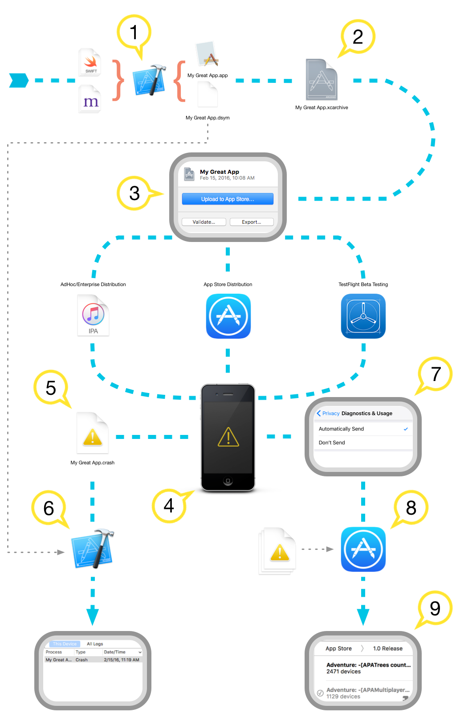
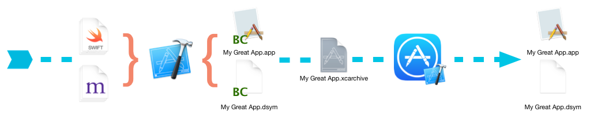
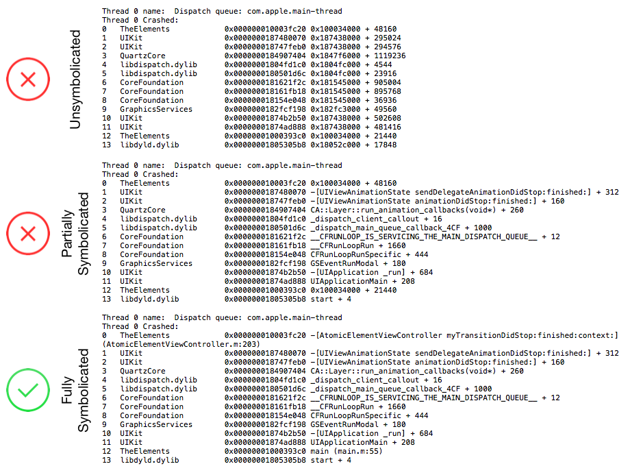
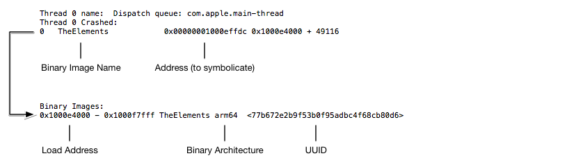
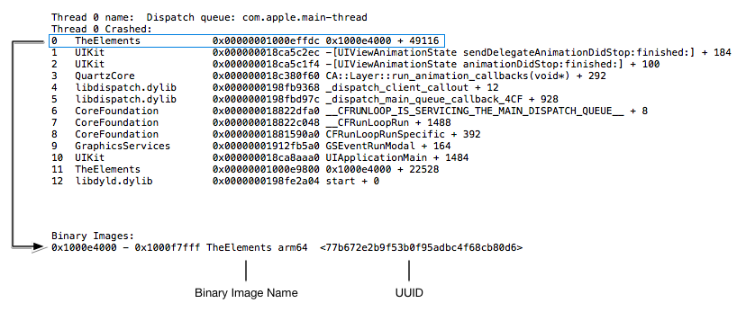

> 导航：[总目录](../../README.md) · [technotes](../../_indexes/technotes.md)


Technical Note TN2151

# Understanding and Analyzing Application Crash Reports

When an application crashes, a crash report is created which is very useful for understanding what caused the crash. This document contains essential information about how to symbolicate, understand, and interpret crash reports.

[Introduction](#apple-f4xwc4dqnrsv64tfmyxwi33df52wszbpirkfgnbqgaydqmjygqwugsbrfveu4vcsj5cfkq2ujfhu4)[Acquiring Crash and Low Memory Reports](#apple-f4xwc4dqnrsv64tfmyxwi33df52wszbpirkfgnbqgaydqmjygqwugsbrfvaugukvjfjestshl5bveqktjbpuctsel5ge6v27jvcu2t2slfpverkqj5jfiuy)[Symbolicating Crash Reports](#apple-f4xwc4dqnrsv64tfmyxwi33df52wszbpirkfgnbqgaydqmjygqwugsbrfvjvstkcj5gesq2bkreu6tq)[Bitcode](#apple-f4xwc4dqnrsv64tfmyxwi33df52wszbpirkfgnbqgaydqmjygqwugsbrfvjvstkcj5gesq2bkreu6trnijeviq2pircq)[Determining Whether a Crash Report is Symbolicated](#apple-f4xwc4dqnrsv64tfmyxwi33df52wszbpirkfgnbqgaydqmjygqwugsbrfvjvstkcj5gesq2bkreu6trnl5cekvcfkjgustsjjzdv6v2iivkeqrksl5av6q2sifjuqx2sivie6usul5evgx2tlfguet2mjfbucvcfiq)[Symbolicating iOS Crash Reports With Xcode](#apple-f4xwc4dqnrsv64tfmyxwi33df52wszbpirkfgnbqgaydqmjygqwugsbrfvjvstkcj5gesq2bkrcvoskujbmegt2eiu)[Symbolicating Crash Reports With atos](#apple-f4xwc4dqnrsv64tfmyxwi33df52wszbpirkfgnbqgaydqmjygqwugsbrfvjvstkcj5gesq2bkrcv6v2jkref6qkuj5jq)[Symbolication Troubleshooting](#apple-f4xwc4dqnrsv64tfmyxwi33df52wszbpirkfgnbqgaydqmjygqwugsbrfvjvstkcj5gesq2bkreu6tsukjhvkqsmivjuqt2pkreu4ry)[Analyzing Crash Reports](#apple-f4xwc4dqnrsv64tfmyxwi33df52wszbpirkfgnbqgaydqmjygqwugsbrfvau4qkmlfnestshl5bveqktjbpverkqj5jfiuy)[Header](#apple-f4xwc4dqnrsv64tfmyxwi33df52wszbpirkfgnbqgaydqmjygqwugsbrfvbveqktjbpuqrkbircve)[Exception Information](#apple-f4xwc4dqnrsv64tfmyxwi33df52wszbpirkfgnbqgaydqmjygqwugsbrfvcvqq2fkbkest2ol5eu4rsp)[Additional Diagnostic Information](#apple-f4xwc4dqnrsv64tfmyxwi33df52wszbpirkfgnbqgaydqmjygqwugsbrfvavaucjjzde6)[Backtraces](#apple-f4xwc4dqnrsv64tfmyxwi33df52wszbpirkfgnbqgaydqmjygqwugsbrfvjviqkdjnkfeqkdiu)[Thread State](#apple-f4xwc4dqnrsv64tfmyxwi33df52wszbpirkfgnbqgaydqmjygqwugsbrfvau4qkmlfnestshl5bveqktjbpverkqj5jfiuznkreferkbirpvgvcbkrcq)[Binary Images](#apple-f4xwc4dqnrsv64tfmyxwi33df52wszbpirkfgnbqgaydqmjygqwugsbrfvau4qkmlfnestshl5bveqktjbpverkqj5jfiuznijeu4qkslfpustkbi5cvg)[Understanding Low Memory Reports](#apple-f4xwc4dqnrsv64tfmyxwi33df52wszbpirkfgnbqgaydqmjygqwugsbrfvku4rcfkjjviqkoireu4r27jrhvox2nivgu6uszl5jekucpkjkfg)[Related Documents](#apple-f4xwc4dqnrsv64tfmyxwi33df52wszbpirkfgnbqgaydqmjygqwugsbrfvjektcbkrcuix2ej5bvktkfjzkfg)[Document Revision History](#apple-f4xwc4dqnrsv64tfmyxwi33df52wszbpirkfgnbqgaydqmjygqwvezlwnfzws33ojbuxg5dpoj4s2rdpnz2ey2lonncwyzlnmvxhiskel4yq)

## Introduction

When an application crashes, a __crash report__ is created and stored on the device. Crash reports describe the conditions under which the application terminated, in most cases including a complete backtrace for each executing thread, and are typically very useful for debugging issues in the application. You should look at these crash reports to understand what crashes your application is having, and then try to fix them.

Crash reports with backtraces need to be __symbolicated__ before they can be analyzed. Symbolication replaces memory addresses with human-readable function names and line numbers. If you get crash logs off a device through Xcode's Devices window, then they will be symbolicated for you automatically after a few seconds. Otherwise you will need to symbolicate the `.crash` file yourself by importing it to the Xcode Devices window. See [Symbolicating Crash Reports](#apple-f4xwc4dqnrsv64tfmyxwi33df52wszbpirkfgnbqgaydqmjygqwugsbrfvjvstkcj5gesq2bkreu6tq) for details.

A  __Low Memory report__ differs from other crash reports in that there are no backtraces in this type of report. When a low memory crash happens, you must investigate your memory usage patterns and your responses to low memory warnings. This document points to you several memory management references that you might find useful.

[Back to Top](#)

## Acquiring Crash and Low Memory Reports

[Debugging Deployed iOS Apps](https://developer.apple.com/library/ios/#qa/qa1747/_index.html) discusses how to retrieve crash and low memory reports directly from an iOS device.

[Analyzing Crash Reports](https://developer.apple.com/library/ios/documentation/IDEs/Conceptual/AppDistributionGuide/AnalyzingCrashReports/AnalyzingCrashReports.html) in the [App Distribution Guide](https://developer.apple.com/library/ios/documentation/IDEs/Conceptual/AppDistributionGuide/Introduction/Introduction.html) discusses how to view aggregate crash reports collected from TestFlight beta testers and users who have downloaded your app from the App Store.

[Back to Top](#)

## Symbolicating Crash Reports

Symbolication is the process of resolving backtrace addresses to source code method or function names, known as symbols. Without first symbolicating a crash report it is difficult to determine where the crash occurred.

__Note:__ Low Memory Reports do not need to be symbolicated.

__Note:__ Crash reports from macOS are typically symbolicated, or partially symbolicated, at the time they are generated. This section focuses on symbolicating crash reports from iOS, watchOS, and tvOS, but the overall process is similar for macOS.

__Figure 1__  Overview of the crash reporting and symbolication process.



1. As the compiler translates your source code into machine code, it also generates debug symbols which map each machine instruction in the compiled binary back to the line of source code from which it originated. Depending on the __Debug Information Format__ (`DEBUG_INFORMATION_FORMAT`) build setting, these debug symbols are stored inside the binary or in a companion Debug Symbol (`dSYM`) file. By default, debug builds of an application store the debug symbols inside the compiled binary while release builds of an application store the debug symbols in a companion `dSYM` file to reduce the binary size.

   The Debug Symbol file and application binary are tied together on a per-build-basis by the build UUID. A new UUID is generated for each build of your application and uniquely identifies that build. Even if a functionally-identical executable is rebuilt from the same source code, with the same compiler settings, it will have a different build UUID. Debug Symbol files from subsequent builds, even from the same source files, will not interoperate with binaries from other builds.
2. When you archive the application for distribution, Xcode will gather the application binary along with the .`dSYM` file and store them at a location inside your home folder. You can find all of your archived applications in the Xcode Organizer under the "Archived" section. For more information about creating an archive, refer to the [App Distribution Guide](https://developer.apple.com/library/ios/documentation/IDEs/Conceptual/AppDistributionGuide/Introduction/Introduction.html).

   __Important:__ To symbolicate crash reports from testers, app review, and customers, you must retain the archive for each build of your application that you distribute.
3. If you are distributing your app via the App Store, or conducting a beta test using Test Flight, you will be given the option of including the `dSYM` file when uploading your archive to iTunes Connect. In the submission dialog, check “Include app symbols for your application…”. Uploading your `dSYM` file is necessary to receive crash reports collected from TestFlight users and customers who have opted to share diagnostic data. For more information about the crash reporting service, refer to the [App Distribution Guide](https://developer.apple.com/library/ios/documentation/IDEs/Conceptual/AppDistributionGuide/AnalyzingCrashReports/AnalyzingCrashReports.html).

   __Important:__ Crash reports received from App Review will be unsymbolicated, even if you included the `dSYM` file when uploading your archive to iTunes Connect. You will need to symbolicate any crash reports received from App Review using Xcode. See [Symbolicating iOS Crash Reports With Xcode](#apple-f4xwc4dqnrsv64tfmyxwi33df52wszbpirkfgnbqgaydqmjygqwugsbrfvjvstkcj5gesq2bkrcvoskujbmegt2eiu).
4. When your application crashes, an unsymbolicated crash report is created and stored on the device.
5. Users can retrieve crash reports directly from their device by following the steps in [Debugging Deployed iOS Apps](https://developer.apple.com/library/ios/#qa/qa1747/_index.html). If you have distributed your application via AdHoc or Enterprise distribution, this is the only way to acquire crash reports from your users.
6. Crash reports retrieved from a device are unsymbolicated and will need to be symbolicated using Xcode. Xcode uses the `dSYM` file associated with your application binary to replace each address in the backtrace with its originating location in your source code. The result is a symbolicated crash report.
7. If the user has opted to share diagnostic data with Apple, or if the user has installed a beta version of your application through TestFlight, the crash report is uploaded to the App Store.
8. The App Store symbolicates the crash report and groups it with similar crash reports. This aggregate of similar crash reports is called a Crash Point.
9. The symbolicated crash reports are made available to you in Xcode's Crashes organizer.

### Bitcode

Bitcode is an intermediate representation of a compiled program. When you archive an application with bitcode enabled, the compiler produces binaries containing bitcode rather than machine code. Once the binary has been uploaded to the App Store, the bitcode is compiled down to machine code. The App Store may compile the bitcode again in the future, to take advantage of future compiler improvements without any action on your part.

__Figure 2__  Overview of the Bitcode compilation process.



Because the final compilation of your binary occurs on the App Store, your Mac will not contain the debug symbol (`dSYM`) files needed to symbolicate crash reports received from App Review or from users who have sent you crash reports from their devices. Although a `dSYM` file is produced when you archive your application, it is for the bitcode binary and can not be used to symbolicate crash reports. The App Store makes the `dSYM` files generated during bitcode compilation available for you to download, from Xcode or from the iTunes Connect website. You must download these `dSYM` files in order to symbolicate crash reports received from App Review or from users who have sent you crash reports from their devices. Crash reports received through the crash reporting service will be symbolicated automatically.

__Important:__ The binary compiled by the App Store will have different UUIDs than the binary that was originally submitted.

#### Downloading the dSYM files from Xcode

1. In the Archives organizer, select the archive that you originally submitted to the App Store.
2. Click the Download dSYMs button.

Xcode downloads the `dSYM` files and inserts them into the selected archive.

#### Downloading the dSYM files from the iTunes Connect website

1. Open the App Details page.
2. Click Activity.
3. From the list of All Builds, select a version.
4. Click the __Download dSYM__ link.

#### Translating 'hidden' symbol names back to their original names

When you upload your app with bitcode to the App Store, you may choose not to send your application's symbols by unchecking the "Upload your app's symbols to receive symbolicated reports from Apple" box in the submission dialog. If you choose not to send your app's symbol information to Apple, Xcode will replace the symbols in your app's .`dSYM` files with obfuscated symbols such as "__hidden#109_" before sending your app to iTunes Connect. Xcode creates a mapping between the original symbols and the "hidden" symbols and stores this mapping in a `.bcsymbolmap` file inside the application archive. Each .`dSYM` file will have a corresponding `.bcsymbolmap` file.

Before symbolicating crash reports, you will need to de-obfuscate the symbols in the .`dSYM` files downloaded from iTunes Connect. If you use the Download dSYMs button in Xcode, this de-obfuscation will be performed automatically for you. However, if you use the iTunes Connect website to download the .`dSYM` files, open Terminal and use the following command to de-obfuscate your symbols (replacing the example paths with your own archive and the dSYMs folder downloaded from iTunes Connect):

```
xcrun dsymutil -symbol-map ~/Library/Developer/Xcode/Archives/2017-11-23/MyGreatApp\ 11-23-17\,\ 12.00\ PM.xcarchive/BCSymbolMaps ~/Downloads/dSYMs/3B15C133-88AA-35B0-B8BA-84AF76826CE0.dSYM
```

Run this command for each .`dSYM` file inside the dSYMs folder you downloaded.

### Determining Whether a Crash Report is Symbolicated

A crash report may be unsymbolicated, fully symbolicated, or partially symbolicated. Unsymbolicated crash reports will not contain the method or function names in the backtrace. Instead, you have hexadecimal addresses of executable code within the loaded binary images. In a fully symbolicated crash report, the hexadecimal addresses in __every__ line of the backtrace are replaced with the corresponding symbol. In a partially symbolicated crash report, only some of the addresses in the backtrace have been replaced with their corresponding symbols.

Obviously, you should try to fully symbolicate any crash report you receive as it will provide the most insight about the crash. A partially symbolicated crash report may contain enough information to understand the crash, depending upon the type of crash and which parts of the backtraces were successfully symbolicated. An unsymbolicated crash report is rarely useful.

__Figure 3__  The same backtrace at various levels of symbolication.



### Symbolicating iOS Crash Reports With Xcode

Xcode will automatically attempt to symbolicate all crash reports that it encounters. All you need to do for symbolication is to add the crash report to the Xcode Organizer.

__Note:__ Xcode will not accept crash reports without a `.crash` extension. If you have received a crash report without an extension, or with a `.txt` extension, rename it to have a `.crash` extension before following the steps listed below.

1. Connect an iOS device to your Mac
2. Choose "Devices" from the "Window" menu
3. Under the "DEVICES" section in the left column, choose a device
4. Click the "View Device Logs" button under the "Device Information" section on the right hand panel
5. Drag your crash report onto the left column of the presented panel
6. Xcode will automatically symbolicate the crash report and display the results

To symbolicate a crash report, Xcode needs to be able to locate the following:

- The crashing application's binary and `dSYM` file.
- The binaries and `dSYM` files for all custom frameworks that the application links against. For frameworks that were built from source with the application, their `dSYM` files are copied into the archive alongside the application's `dSYM` file. For frameworks that were built by a third-party, you will need to ask the author for the `dSYM` file.
- Symbols for the OS that the that application was running on when it crashed. These symbols contain debug information for the frameworks included in a specific OS release (e.g. iOS 9.3.3). OS symbols are architecture specific - a release of iOS for 64-bit devices won't include armv7 symbols. Xcode will automatically copy OS symbols from each device that you connect to your Mac.

If any of these are missing Xcode may not be able to symbolicate the crash report, or may only partially symbolicate the crash report.

### Symbolicating Crash Reports With atos

The [atos](x-man-page://atos) command converts numeric addresses to their symbolic equivalents. If full debug symbol information is available then the output of `atos` will include file name and source line number information. The `atos` command can be used to symbolicate individual addresses in the backtrace of an unsymbolicated, or partially symbolicated, crash report. To symbolicate a part of a crash report using `atos`:

1. Find a line in the backtrace which you want to symbolicate. Note the name of the binary image in the second column, and the address in the third column.
2. Look for a binary image with that name in the list of binary images at the bottom of the crash report. Note the architecture and load address of the binary image.

__Figure 4__  Information from the crash report that is needed to use `atos`.



1. Locate the `dSYM` file for the binary. You can use Spotlight to find the matching `dSYM` file for the UUID of the binary image. See the [Symbolication Troubleshooting](#apple-f4xwc4dqnrsv64tfmyxwi33df52wszbpirkfgnbqgaydqmjygqwugsbrfvjvstkcj5gesq2bkreu6tsukjhvkqsmivjuqt2pkreu4ry) section. `dSYM` files are bundles in which reside a file containing the DWARF debugging information generated by the compiler at build time. You must provide the path to this file, not to the `dSYM` bundle, when invoking `atos`.
2. With the above information you can symbolicate addresses in the backtrace using the `atos` command. You can specify multiple addresses to symbolicate, separated by a space.

   `atos -arch <Binary Architecture> -o <Path to dSYM file>/Contents/Resources/DWARF/<binary image name> -l <load address> <address to symbolicate>`

__Listing 1__  Example usage of the `atos` command following the steps above, and the resulting output.

```shell
$ atos -arch arm64 -o TheElements.app.dSYM/Contents/Resources/DWARF/TheElements -l 0x1000e4000 0x00000001000effdc
-[AtomicElementViewController myTransitionDidStop:finished:context:]
```

### Symbolication Troubleshooting

If Xcode is failing to fully symbolicate a crash report, it's likely because your Mac is missing the `dSYM` file for the application binary, the `dSYM` files for one or more frameworks the application links against, or the device symbols for the OS the application was running on when it crashed. The steps below show how to use Spotlight to determine whether the `dSYM` file needed to symbolicate a backtrace addresse within a binary image is present on your Mac.

__Figure 5__  Locating the UUID for a binary image.



1. Find a line in the backtrace which Xcode failed to symbolicate. Note the name of the binary image in the second column.
2. Look for a binary image with that name in the list of binary images at the bottom of the crash report. This list contains the UUIDs for each of the binary images that were loaded into the process at the time of the crash.

   __Listing 2__  You can use the `grep` command line tool to quickly find the entry in the list of binary images.

   ```shell
   $ grep --after-context=1000 "Binary Images:" <Path to Crash Report> | grep <Binary Name>
   ```
3. Convert the UUID of the binary image to a 32 character string seperated in groups of 8-4-4-4-12 (`XXXXXXXX-XXXX-XXXX-XXXX-XXXXXXXXXXXX`). Note that all letters __must__ be uppercased.
4. Search for the UUID using the `mdfind` command line tool using the query `"com_apple_xcode_dsym_uuids == <UUID>"` (include the quotation marks).

   __Listing 3__  Using the `mdfind` command line tool to search for `dSYM` files with a given UUID.

   ```shell
   $ mdfind "com_apple_xcode_dsym_uuids == <UUID>"
   ```
5. If Spotlight finds a `dSYM` file for the UUID, `mdfind` will print the path to the `dSYM` file and possibly its containing archive. If a `dSYM` file for the UUID was not found, `mdfind` will exit without printing anything.

If Spotlight found a `dSYM` file for the binary but Xcode was not able to symbolicate addresses within that binary image, then you should file a bug. Attach the crash report and the relevant `dSYM` file(s) to the bug report. As a workaround, you can manually symbolicate the address using `atos`. See [Symbolicating Crash Reports With atos](#apple-f4xwc4dqnrsv64tfmyxwi33df52wszbpirkfgnbqgaydqmjygqwugsbrfvjvstkcj5gesq2bkrcv6v2jkref6qkuj5jq).

If Spotlight did not find a `dSYM` for the binary image, verify that you still have the Xcode archive for the version of your application that crashed and that this archive is located somewhere that Spotlight can find it (any location in your home directory should do). If your application was built with bitcode enabled, make sure you have downloaded the `dSYM` files for the final compilation from the App Store. See [Downloading the dSYM files from Xcode](#apple-f4xwc4dqnrsv64tfmyxwi33df52wszbpirkfgnbqgaydqmjygqwugsbrfvce6v2ojrhucrc7irjvsti).

If you think that you have the correct `dSYM` for the binary image, you can use the `dwarfdump` command to print the matching UUIDs. You can also use the `dwarfdump` command to print the UUIDs of a binary.

`xcrun dwarfdump --uuid <Path to dSYM file>`

__Note:__ You must have the archive that you originally submitted to the App Store for the version of your application that is crashing. The `dSYM` file and application binary are specifically tied together on a per-build-basis. Creating a new archive, even from the same sources and build configuration, will not produce a `dSYM` file that can interoperate with the crashing build.

If you no longer have this archive, you should submit a new version of your application for which you retain the archive. You will then be able to symbolicate crash reports for this new version.

[Back to Top](#)

## Analyzing Crash Reports

This section discusses each of the sections found within a standard crash report.

### Header

Every crash report begins with a header.

__Listing 4__  Excerpt of the header from a crash report.

```
Incident Identifier: B6FD1E8E-B39F-430B-ADDE-FC3A45ED368C
CrashReporter Key: f04e68ec62d3c66057628c9ba9839e30d55937dc
Hardware Model: iPad6,8
Process: TheElements [303]
Path: /private/var/containers/Bundle/Application/888C1FA2-3666-4AE2-9E8E-62E2F787DEC1/TheElements.app/TheElements
Identifier: com.example.apple-samplecode.TheElements
Version: 1.12
Code Type: ARM-64 (Native)
Role: Foreground
Parent Process: launchd [1]
Coalition: com.example.apple-samplecode.TheElements [402]

Date/Time: 2016-08-22 10:43:07.5806 -0700
Launch Time: 2016-08-22 10:43:01.0293 -0700
OS Version: iPhone OS 10.0 (14A5345a)
Report Version: 104
```

Most of the fields are self-explanatory but a few deserve special note:

- __Incident Identifier__: A unique identifier for the report. Two reports will never share the same Incident Identifier.
- __CrashReporter Key__: An anonymized per-device identifier. Two reports from the same device will contain identical values.
- __Beta Identifier__: A unique identifier for the combination of the device and vendor of the crashed application. Two reports for applications from the same vendor and from the same device will contain identical values. This field is only present in crash reports generated for applications distributed through TestFlight, and replaces the CrashReporter Key field.
- __Process__: The executable name for the process that crashed. This matches the value for the `CFBundleExecutable` key in the application's information property list.
- __Version__: The version of the process that crashed. The value for this field is a concatenation of the crashed application's `CFBundleVersion` and `CFBundleVersionString`.
- __Code Type__: The target architecture of the process that crashed. This will be one of `ARM-64`, `ARM`, `x86-64`, or `x86`.
- __Role__: The [task_role](http://opensource.apple.com/source/xnu/xnu-3248.60.10/osfmk/mach/task_policy.h) assigned to the process at the time of termination.
- __OS Version__: The OS version, including the build number, on which the crash occurred.

### Exception Information

Not to be confused with Objective-C/C++ exceptions (though one of those may be the cause of the crash), this section lists the Mach __Exception Type__ and related fields which provide information about the nature of the crash. Not all fields will be present in every crash report.

__Listing 5__  Excerpt of the Exception Codes section from a crash report generated when a process was terminated due to an uncaught Objective-C exception.

```
Exception Type: EXC_CRASH (SIGABRT)
Exception Codes: 0x0000000000000000, 0x0000000000000000
Exception Note: EXC_CORPSE_NOTIFY
Triggered by Thread: 0
```

__Listing 6__  Excerpt of the Exception Codes section from a crash report generated when a process was terminated because it dereferenced a NULL pointer.

```
Exception Type: EXC_BAD_ACCESS (SIGSEGV)
Exception Subtype: KERN_INVALID_ADDRESS at 0x0000000000000000
Termination Signal: Segmentation fault: 11
Termination Reason: Namespace SIGNAL, Code 0xb
Terminating Process: exc handler [0]
Triggered by Thread: 0
```

An explanation of the fields that may appear in this section are presented below.

- __Exception Codes__: Processor specific information about the exception encoded into one or more 64-bit hexadecimal numbers. Typically, this field will not be present because the Crash Reporter parses the exception codes to present them as a human-readable description in the other fields.
- __Exception Subtype__: The human-readable name of the exception codes.
- __Exception Message__: Additional human-readable information extracted from the exception codes.
- __Exception Note__: Additional information that is not specific to one exception type. If this field contains `SIMULATED (this is NOT a crash)` then the process did not crash, but was killed at the request of the system, typically the watchdog.
- __Termination Reason__: Exit reason information specified when a process is terminated. Key system components, both inside and outside of a process, will terminate the process upon encountering a fatal error (e.g. a bad code signature, a missing dependent library, or accessing privacy sensitive information without the proper entitlement). macOS Sierra, iOS 10, watchOS 3, and tvOS 10 have adopted new infrastructure to record these errors, and crash reports generated by these operating systems list the error messages in the Termination Reason field.
- __Triggered by Thread__: The thread on which the exception originated.

The following sections explain some of the most common exception types:

#### Bad Memory Access [EXC_BAD_ACCESS // SIGSEGV // SIGBUS]

The process attempted to access invalid memory, or it attempted to access memory in a manner not allowed by the memory's protection level (e.g. writing to read-only memory). The __Exception Subtype__ field contains a `kern_return_t` describing error and the address of the memory that was incorrectly accessed.

Here are some tips for debugging a bad memory access crash:

- If `objc_msgSend` or `objc_release` are near the top of the [Backtraces](#apple-f4xwc4dqnrsv64tfmyxwi33df52wszbpirkfgnbqgaydqmjygqwugsbrfvjviqkdjnkfeqkdiu) for the crashed thread, the process may have attempted to message a deallocated object. You should profile the application with the [Zombies instrument](https://developer.apple.com/library/ios/documentation/DeveloperTools/Conceptual/InstrumentsUserGuide/EradicatingZombies.html) to better understand the conditions of this crash.
- If `gpus_ReturnNotPermittedKillClient` is near the top of the [Backtraces](#apple-f4xwc4dqnrsv64tfmyxwi33df52wszbpirkfgnbqgaydqmjygqwugsbrfvjviqkdjnkfeqkdiu) for the crashed thread, the process was killed because it attempted to do rendering with OpenGL ES or Metal while in the background. See [QA1766: How to fix OpenGL ES application crashes when moving to the background](https://developer.apple.com/library/ios/qa/qa1766/_index.html).
- Run your application with the [Address Sanitizer](https://developer.apple.com/videos/play/wwdc2015/413/) enabled. The address sanitizer adds additional instrumentation around memory access in your compiled code. As your application runs, Xcode will alert you if memory is accessed in a way that could lead to a crash.

#### Abnormal Exit [EXC_CRASH // SIGABRT]

The process exited abnormally. The most common causes of crashes with this exception type are uncaught Objective-C/C++ exceptions and calls to `abort()`.

App Extensions will be terminated with this exception type if they take too much time to initialize (a watchdog termination). If an extension is killed due to a hang at launch, the __Exception Subtype__ of the generated crash report will be `LAUNCH_HANG`. Because extensions do not have a `main` function, any time spent initializing occurs within static constructors and `+load` methods present in your extension and dependent libraries. You should defer as much of this work as possible.

#### Trace Trap [EXC_BREAKPOINT // SIGTRAP]

Similar to an Abnormal Exit, this exception is intended to give an attached debugger the chance to interrupt the process at a specific point in its execution. You can trigger this exception from your own code using the `__builtin_trap()` function. If no debugger is attached, the process is terminated and a crash report is generated.

Lower-level libraries (e.g. libdispatch) will trap the process upon encountering a fatal error. Additional information about the error can be found in the [Additional Diagnostic Information](#apple-f4xwc4dqnrsv64tfmyxwi33df52wszbpirkfgnbqgaydqmjygqwugsbrfvavaucjjzde6) section of the crash report, or in the device's console.

Swift code will terminate with this exception type if an unexpected condition is encountered at runtime such as:

- a non-optional type with a nil value
- a failed forced type conversion

Look at the [Backtraces](#apple-f4xwc4dqnrsv64tfmyxwi33df52wszbpirkfgnbqgaydqmjygqwugsbrfvjviqkdjnkfeqkdiu) to determine where the unexpected condition was encountered. Additional information may have also been logged to the device's console. You should modify the code at the crashing location to gracefully handle the runtime failure. For example, use [Optional Binding](https://developer.apple.com/library/ios/documentation/Swift/Conceptual/Swift_Programming_Language/TheBasics.html) instead of force unwrapping an optional.

#### Illegal Instruction [EXC_BAD_INSTRUCTION // SIGILL]

The process attempted to execute an illegal or undefined instruction. The process may have attempted to jump to an invalid address via a misconfigured function pointer.

On Intel processors, the `ud2` opcode causes an `EXC_BAD_INSTRUCTION` exception but is commonly used to trap the process for debugging purposes. Swift code on Intel processors will terminate with this exception type if an unexpected condition is encountered at runtime. See Trace Trap for details.

#### Quit [SIGQUIT]

The process was terminated at the request of another process with privileges to manage its lifetime. `SIGQUIT` does not mean that the process crashed, but it did likely misbehave in a detectable manner.

On iOS, keyboard extensions will be quit by the host app if they take too long to load. It's unlikely that the [Backtraces](#apple-f4xwc4dqnrsv64tfmyxwi33df52wszbpirkfgnbqgaydqmjygqwugsbrfvjviqkdjnkfeqkdiu) shown in the crash report will point to the responsible code. Most likely, some other code along the startup path for the extension has taken a long time to complete but finished before the time limit, and execution moved onto the code shown in the [Backtraces](#apple-f4xwc4dqnrsv64tfmyxwi33df52wszbpirkfgnbqgaydqmjygqwugsbrfvjviqkdjnkfeqkdiu) when the extension was quit. You should [profile](https://developer.apple.com/library/content/documentation/DeveloperTools/Conceptual/InstrumentsUserGuide/MeasuringCPUUse.html) the extension to better understand where most of the work during startup is occurring, and move that work to a background thread or defer it until later (after the extension has loaded).

#### Killed [SIGKILL]

The process was terminated at the request of the system. Look at the __Termination Reason__ field to better understand the cause of the termination.

The __Termination Reason__ field will contain a namespace followed by a code. The following codes are specific to watchOS:

- The termination code `0xc51bad01` indicates that a watch app was terminated because it used too much CPU time while performing a background task. To address this issue, optimize the code performing the background task to be more CPU efficient, or decrease the amount of work that the app performs while running in the background.
- The termination code `0xc51bad02` indicates that a watch app was terminated because it failed to complete a background task within the allocated time. To address this issue, decrease the amount of work that the app performs while running in the background.
- The termination code `0xc51bad03` indicates that a watch app failed to complete a background task within the allocated time, and the system was sufficiently busy overall that the app may not have received much CPU time with which to perform the background task. Although an app may be able to avoid the issue by reducing the amount of work it performs in the background task, `0xc51bad03` does not indicate that the app did anything wrong. More likely, the app wasn’t able to complete its work because of overall system load.

#### Guarded Resource Violation [EXC_GUARD]

The process violated a guarded resource protection. System libraries may mark certain file descriptors as __guarded__, after which normal operations on those descriptors will trigger an `EXC_GUARD` exception (when it wants to operate on these file descriptors, the system uses special 'guarded' private APIs). This helps you quickly track down issues such as closing a file descriptor that had been opened by a system library. For example, if an app closes the file descriptor used to access the SQLite file backing a Core Data store, Core Data would then crash mysteriously much later on. The guard exception gets these problems noticed sooner, and thus makes them easier to debug.

Crash reports from newer versions of iOS include human-readable details about the operation that caused the `EXC_GUARD` exception in the __Exception Subtype__ and __Exception Message__ fields. In crash reports from macOS or older versions of iOS, this information is encoded into the first __Exception Code__ as a bitfield which breaks down as follows:

- __[63:61] - Guard Type__: The type of the guarded resource. A value of `0x2` indicates the resource is a file descriptor.
- __[60:32] - Flavor__: The conditions under which the violation was triggered.

  - If the first `(1 << 0)` bit is set, the process attempted to invoke `close()` on a guarded file descriptor.
  - If the second `(1 << 1)` bit is set, the process attempted to invoke `dup()`, `dup2()`, or `fcntl()` with the `F_DUPFD` or `F_DUPFD_CLOEXEC` commands on a guarded file descriptor.
  - If the third `(1 << 2)` bit is set, the process attempted to send a guarded file descriptor via a socket.
  - If the fifth `(1 << 4)` bit is set, the process attempted to write to a guarded file descriptor.
- __[31:0] - File Descriptor__: The guarded file descriptor that the process attempted to modify.

#### Resource Limit [EXC_RESOURCE]

The process exceeded a resource consumption limit. This is a notification from the OS that the process is using too many resources. The exact resource is listed in the __Exception Subtype__ field. If the __Exception Note__ field contains `NON-FATAL CONDITION`, then the process was not killed even though a crash report was generated.

- The exception subtype `MEMORY` indicates that the process has crossed a memory limit imposed by the system. This may be a precursor to termination for excess memory usage.
- The exception subtype `WAKEUPS` indicates that threads in the process are being woken up too many times per second, which forces the CPU to wake up very often and consumes battery life.

  Typically, this is caused by thread-to-thread communication (generally using `peformSelector:onThread:` or `dispatch_async`) that is unwittingly happening far more often than it should be. Because the sort of communication that triggers this exception is happening so frequently, there will usually be multiple background threads with very similar [Backtraces](#apple-f4xwc4dqnrsv64tfmyxwi33df52wszbpirkfgnbqgaydqmjygqwugsbrfvjviqkdjnkfeqkdiu) - indicating where the communication is originating.

#### Other Exception Types

Some crash reports may contain an un-named __Exception Type__, which will be printed as a hexadecimal value (e.g. 00000020). If you receive one of these crash reports, look directly to the __Exception Codes__ field for more information.

- The exception code `0xbaaaaaad` indicates that the log is a stackshot of the entire system, not a crash report. To take a stackshot, press the side button and both volume buttons simultaneously. Often these logs are accidentally created by users, and they do not indicate an error.
- The exception code `0xbad22222` indicates that a VoIP application has been terminated by iOS because it resumed too frequently.
- The exception code `0x8badf00d` indicates that an application has been terminated by iOS because a watchdog timeout occurred. The application took too long to launch, terminate, or respond to system events. One common cause of this is doing [synchronous networking on the main thread](https://developer.apple.com/library/ios/qa/qa1693/). Whatever operation is on `Thread 0` needs to be moved to a background thread, or processed differently, so that it does not block the main thread.
- The exception code `0xc00010ff` indicates the app was killed by the operating system in response to a thermal event. This may be due to an issue with the particular device that this crash occurred on, or the environment it was operated in. For tips on making your app run more efficiently, see [iOS Performance and Power Optimization with Instruments](https://developer.apple.com/videos/wwdc/2011/?id=312) WWDC session.
- The exception code `0xdead10cc` indicates that an application has been terminated by the OS because it held on to a file lock or sqlite database lock during suspension. If your application is performing operations on a [locked file](x-man-page://fcntl) or sqlite database at suspension time, it must [request additional background execution time](https://developer.apple.com/reference/uikit/uiapplication/1623051-beginbackgroundtask) to complete those operations and relinquish the lock before suspending.
- The exception code `0x2bad45ec` indicates that an application has been terminated by iOS due to a security violation. The termination description "Process detected doing insecure drawing while in secure mode" indicates the app tried to draw to the screen when not permitted to do so, such as when the screen is locked. Users may not notice this termination since the screen is off or the lock screen is displayed when this termination occurs.

__Note:__ Terminating a suspended app using the app switcher does not generate a crash report. Once an app has suspended, it is eligible for termination by iOS at any time, so no crash report will be generated.

### Additional Diagnostic Information

This section includes additional diagnostic information specific to the type of termination, which may include:

- __Application Specific Information__: framework error messages captured just before the process terminated
- __Kernel Messages__: details about code-signature problems
- __Dyld Error Messages__: error messages emitted by the dynamic linker

Starting in macOS Sierra, iOS 10, watchOS 3, and tvOS 10, most of this information is now reported in the __Termination Reason__ field under the [Exception Information](#apple-f4xwc4dqnrsv64tfmyxwi33df52wszbpirkfgnbqgaydqmjygqwugsbrfvcvqq2fkbkest2ol5eu4rsp).

You should read this section to better understand the circumstances under which the process was terminated.

__Listing 7__  Excerpt of the Application Specific Information section from a crash report generated when a process was terminated because a framework it links against could not be found.

```
Dyld Error Message:
Dyld Message: Library not loaded: @rpath/MyCustomFramework.framework/MyCustomFramework
  Referenced from: /private/var/containers/Bundle/Application/CD9DB546-A449-41A4-A08B-87E57EE11354/TheElements.app/TheElements
  Reason: no suitable image found.
```

__Listing 8__  Excerpt of the Application Specific Information section from a crash report generated when a process was terminated because it failed to load its initial view controller quickly.

```
Application Specific Information:
com.example.apple-samplecode.TheElements failed to scene-create after 19.81s (launch took 0.19s of total time limit 20.00s)

Elapsed total CPU time (seconds): 7.690 (user 7.690, system 0.000), 19% CPU
Elapsed application CPU time (seconds): 0.697, 2% CPU
```

### Backtraces

The most interesting part of a crash report is the backtrace for each of the process's threads at the time it terminated. Each of these traces is similar to what you would see when pausing the process with the debugger.

__Listing 9__  Excerpt of the Backtrace section from a fully symbolicated crash report.

```
Thread 0 name: Dispatch queue: com.apple.main-thread
Thread 0 Crashed:
0   TheElements                   	0x000000010006bc20 -[AtomicElementViewController myTransitionDidStop:finished:context:] (AtomicElementViewController.m:203)
1   UIKit                         	0x0000000194cef0f0 -[UIViewAnimationState sendDelegateAnimationDidStop:finished:] + 312
2   UIKit                         	0x0000000194ceef30 -[UIViewAnimationState animationDidStop:finished:] + 160
3   QuartzCore                    	0x0000000192178404 CA::Layer::run_animation_callbacks(void*) + 260
4   libdispatch.dylib             	0x000000018dd6d1c0 _dispatch_client_callout + 16
5   libdispatch.dylib             	0x000000018dd71d6c _dispatch_main_queue_callback_4CF + 1000
6   CoreFoundation                	0x000000018ee91f2c __CFRUNLOOP_IS_SERVICING_THE_MAIN_DISPATCH_QUEUE__ + 12
7   CoreFoundation                	0x000000018ee8fb18 __CFRunLoopRun + 1660
8   CoreFoundation                	0x000000018edbe048 CFRunLoopRunSpecific + 444
9   GraphicsServices              	0x000000019083f198 GSEventRunModal + 180
10  UIKit                         	0x0000000194d21bd0 -[UIApplication _run] + 684
11  UIKit                         	0x0000000194d1c908 UIApplicationMain + 208
12  TheElements                   	0x00000001000653c0 main (main.m:55)
13  libdyld.dylib                 	0x000000018dda05b8 start + 4

Thread 1:
0   libsystem_kernel.dylib        	0x000000018deb2a88 __workq_kernreturn + 8
1   libsystem_pthread.dylib       	0x000000018df75188 _pthread_wqthread + 968
2   libsystem_pthread.dylib       	0x000000018df74db4 start_wqthread + 4

...
```

The first line lists the thread number and the identifier of the currently executing dispatch queue. The remaining lines list details about the individual stack frames in the backtrace. From left to right:

- The stack frame number. Stack frames are presented in calling order, where frame zero is the function that was executing at the time execution halted. Frame one is the function that called the function in frame zero, and so on.
- The name of the binary in which the executing function for the stack frame resides.
- For frame zero, the address of the machine instruction that was executing when execution halted. For the remaining stack frames, the address of the machine instruction that will next execute when control returns to the stack frame.
- In a symbolicated crash report, the method name for the function in the stack frame.

#### Exceptions

Exceptions in Objective-C are used to indicate programming errors detected at runtime such as accessing an array with an index that is out-of-bounds, attempts to mutate immutable objects, not implementing a required method of a protocol, or sending a message which the receiver does not recognize.

__Note:__ Messaging a previously deallocated object may raise an `NSInvalidArgumentException` instead of crashing the program with a memory access violation. This occurs when a new object is allocated in the memory previously occupied by the deallocated object. If your application is crashing due to an uncaught `NSInvalidArgumentException` (look for `-[NSObject(NSObject) doesNotRecognizeSelector:]` in the exception backtrace), consider profiling your application with the [Zombies instrument](https://developer.apple.com/library/ios/documentation/DeveloperTools/Conceptual/InstrumentsUserGuide/EradicatingZombies.html) to eliminate the possibility that improper memory management is the cause.

If an exception is not caught, it is intercepted by a function called the uncaught exception handler. The default uncaught exception handler logs the exception message to the device's console then terminates the process. Only the exception backtrace is written to the generated crash report under the __Last Exception Backtrace__ section, as shown in Listing 10. The exception message is omitted from the crash report. If you receive a crash report with a __Last Exception Backtrace__ you should acquire the console logs from the originating device to better understand the conditions which caused the exception.

__Listing 10__  Excerpt of the Last Exception Backtrace section from an unsymbolicated crash report.

```
Last Exception Backtrace:
(0x18eee41c0 0x18d91c55c 0x18eee3e88 0x18f8ea1a0 0x195013fe4 0x1951acf20 0x18ee03dc4 0x1951ab8f4 0x195458128 0x19545fa20 0x19545fc7c 0x19545ff70 0x194de4594 0x194e94e8c 0x194f47d8c 0x194f39b40 0x194ca92ac 0x18ee917dc 0x18ee8f40c 0x18ee8f89c 0x18edbe048 0x19083f198 0x194d21bd0 0x194d1c908 0x1000ad45c 0x18dda05b8)
```

A crash log with a Last Exception Backtrace containing only hexadecimal addresses must be symbolicated to produce a usable backtrace as shown in Listing 11.

__Listing 11__  Excerpt of the Last Exception Backtrace section from a symbolicated crash report. This exception was raised when loading a scene in the app's storyboard. The corresponding IBOutlet for a connection to an element in the scene was missing.

```
Last Exception Backtrace:
0   CoreFoundation                	0x18eee41c0 __exceptionPreprocess + 124
1   libobjc.A.dylib               	0x18d91c55c objc_exception_throw + 56
2   CoreFoundation                	0x18eee3e88 -[NSException raise] + 12
3   Foundation                    	0x18f8ea1a0 -[NSObject(NSKeyValueCoding) setValue:forKey:] + 272
4   UIKit                         	0x195013fe4 -[UIViewController setValue:forKey:] + 104
5   UIKit                         	0x1951acf20 -[UIRuntimeOutletConnection connect] + 124
6   CoreFoundation                	0x18ee03dc4 -[NSArray makeObjectsPerformSelector:] + 232
7   UIKit                         	0x1951ab8f4 -[UINib instantiateWithOwner:options:] + 1756
8   UIKit                         	0x195458128 -[UIStoryboard instantiateViewControllerWithIdentifier:] + 196
9   UIKit                         	0x19545fa20 -[UIStoryboardSegueTemplate instantiateOrFindDestinationViewControllerWithSender:] + 92
10  UIKit                         	0x19545fc7c -[UIStoryboardSegueTemplate _perform:] + 56
11  UIKit                         	0x19545ff70 -[UIStoryboardSegueTemplate perform:] + 160
12  UIKit                         	0x194de4594 -[UITableView _selectRowAtIndexPath:animated:scrollPosition:notifyDelegate:] + 1352
13  UIKit                         	0x194e94e8c -[UITableView _userSelectRowAtPendingSelectionIndexPath:] + 268
14  UIKit                         	0x194f47d8c _runAfterCACommitDeferredBlocks + 292
15  UIKit                         	0x194f39b40 _cleanUpAfterCAFlushAndRunDeferredBlocks + 560
16  UIKit                         	0x194ca92ac _afterCACommitHandler + 168
17  CoreFoundation                	0x18ee917dc __CFRUNLOOP_IS_CALLING_OUT_TO_AN_OBSERVER_CALLBACK_FUNCTION__ + 32
18  CoreFoundation                	0x18ee8f40c __CFRunLoopDoObservers + 372
19  CoreFoundation                	0x18ee8f89c __CFRunLoopRun + 1024
20  CoreFoundation                	0x18edbe048 CFRunLoopRunSpecific + 444
21  GraphicsServices              	0x19083f198 GSEventRunModal + 180
22  UIKit                         	0x194d21bd0 -[UIApplication _run] + 684
23  UIKit                         	0x194d1c908 UIApplicationMain + 208
24  TheElements                   	0x1000ad45c main (main.m:55)
25  libdyld.dylib                 	0x18dda05b8 start + 4
```

__Note:__ If you find that exceptions thrown within an exception handling domain setup by your application are not being caught, verify that you are __not__ specifying the `-no_compact_unwind` flag when building your application or libraries.

64-bit iOS uses a "zero-cost" exception implementation. In a "zero-cost" system, every function has additional data that describes how to unwind the stack if an exception is thrown across the function. If an exception is thrown across a stack frame that has no unwind data then exception handling cannot proceed and the process halts. There might be an exception handler farther up the stack, but if there is no unwind data for a frame then there is no way to get there from the stack frame where the exception was thrown. Specifying the `-no_compact_unwind` flag means you get no unwind tables for that code, so you can not throw exceptions across those functions.

Additionally, if you are including plain C code in your application or a library, you may need to specify the `-funwind-tables` flag to include unwind tables for all functions in that code.

### Thread State

This section lists the thread state of the crashed thread. This is a list of registers and their values at the time execution halted. Understanding the thread state is not necessary when reading a crash report but you may be able to use this information to better understand the conditions of the crash.

__Listing 12__  Excerpt of the Thread State section from a crash report from an ARM64 device.

```
Thread 0 crashed with ARM Thread State (64-bit):
    x0: 0x0000000000000000   x1: 0x000000019ff776c8   x2: 0x0000000000000000   x3: 0x000000019ff776c8
    x4: 0x0000000000000000   x5: 0x0000000000000001   x6: 0x0000000000000000   x7: 0x00000000000000d0
    x8: 0x0000000100023920   x9: 0x0000000000000000  x10: 0x000000019ff7dff0  x11: 0x0000000c0000000f
   x12: 0x000000013e63b4d0  x13: 0x000001a19ff75009  x14: 0x0000000000000000  x15: 0x0000000000000000
   x16: 0x0000000187b3f1b9  x17: 0x0000000181ed488c  x18: 0x0000000000000000  x19: 0x000000013e544780
   x20: 0x000000013fa49560  x21: 0x0000000000000001  x22: 0x000000013fc05f90  x23: 0x000000010001e069
   x24: 0x0000000000000000  x25: 0x000000019ff776c8  x26: 0xee009ec07c8c24c7  x27: 0x0000000000000020
   x28: 0x0000000000000000  fp: 0x000000016fdf29e0   lr: 0x0000000100017cf8
    sp: 0x000000016fdf2980   pc: 0x0000000100017d14 cpsr: 0x60000000
```

### Binary Images

This section lists the binary images that were loaded in the process at the time of termination.

__Listing 13__  Excerpt of the application's entry in the binary images section of a crash report.

```
Binary Images:
0x100060000 - 0x100073fff TheElements arm64 <2defdbea0c873a52afa458cf14cd169e> /var/containers/Bundle/Application/888C1FA2-3666-4AE2-9E8E-62E2F787DEC1/TheElements.app/TheElements
...
```

Each line includes the following details for a single binary image:

- The binary image's address space within the process.
- The binary name or bundle identifier of the binary (macOS only). In crash reports from macOS, a (+) is prepended if the binary is part of the OS.
- (macOS only) The binary's short version string and bundle version, separated by a dash.
- (iOS only) The architecture of the binary image. A binary may contain multiple "slices", one for each architecture it supports. Only one of these slices is loaded into the process.
- An UUID which uniquely identifies the binary image. This value changes with each build of the binary and is used to locate the corresponding __dSYM__ file when symbolicating the crash report.
- The path to the binary on disk.
[Back to Top](#)

## Understanding Low Memory Reports

When a low-memory condition is detected, the virtual memory system in iOS relies on the cooperation of applications to release memory. Low-memory notifications are sent to all running applications and processes as a request to free up memory, hoping to reduce the amount of memory in use. If memory pressure still exists, the system may terminate background processes to ease memory pressure. If enough memory can be freed up, your application will continue to run. If not, your application will be terminated by iOS because there isn't enough memory to satisfy the application's demands, and a low memory report will be generated and stored on the device.

The format of a low memory report differs from other crash reports in that there are no backtraces for the application threads. A low memory report begins with a header similar to the [Header](#apple-f4xwc4dqnrsv64tfmyxwi33df52wszbpirkfgnbqgaydqmjygqwugsbrfvbveqktjbpuqrkbircve) of a crash report. Following the header are a collection of fields listing system-wide memory statistics. Take note of the value for the __Page Size__ field. The memory usage of each process in a low memory report is reported in terms of number of memory pages.

The most important part of a low memory report is the table of processes. This table lists all running processes, including system daemons, at the time the low memory report was generated. If a process was "jettisoned", the reason will be listed under the __[reason]__ column. A process may be jettisoned for a number of reasons:

- __[per-process-limit]__: The process crossed its system-imposed memory limit. Per-process limits on resident memory are established by the system for all applications. Crossing this limit makes the process eligible for termination.

  __Note:__ Extensions have much lower per-process memory limit. Certain technologies, such as map views and SpriteKit, carry a high baseline memory cost and may be unsuitable for use in an extension.
- __[vm-pageshortage]/[vm-thrashing]/[vm]__: The process was killed due to memory pressure.
- __[vnode-limit]__: Too many files are open.

  __Note:__ The system avoids killing the frontmost app when vnodes are nearly exhausted. This means that your application, when in the background, may be terminated even if it is not the source of excess vnode usage.
- __[highwater]__: A system daemon crossed its high water mark for memory usage.
- __[jettisoned]__: The process was jettisoned for some other reason.

If you do not see a reason listed next to your app/extension process, the cause of the crash was not memory pressure. Look for a `.crash` file (described in the previous section) for more information.

When you see a low memory crash, rather than be concerned about what part of your code was executing at the time of termination, you should investigate your memory usage patterns and your responses to low memory warnings. [Locating Memory Issues in Your App](https://developer.apple.com/library/ios/documentation/DeveloperTools/Conceptual/InstrumentsUserGuide/MemoryManagementforYourApp/MemoryManagementforYourApp.html) lists detailed steps on how to use the Leaks Instrument to discover memory leaks, and how to use the Allocations Instrument's Mark Heap feature to avoid abandoned memory. [Memory Usage Performance Guidelines](https://developer.apple.com/library/mac/#documentation/Performance/Conceptual/ManagingMemory/ManagingMemory.html#//apple_ref/doc/uid/10000160i) discusses the proper ways to respond to low-memory notifications as well as many tips for using memory effectively. It is also recommended that you check out the WWDC 2010 session, [Advanced Memory Analysis with Instruments](https://developer.apple.com/videos/wwdc/2010/?id=311).

__Important:__ The Leaks and Allocations instruments do not track all memory usage. You need to run your application with the VM Tracker instrument (included in the Instruments Allocations template) to see your total memory usage. VM Tracker is disabled by default. To profile your application with VM Tracker, click the instrument, check the "Automatic Snapshotting" flag or press the "Snapshot Now" button manually.

[Back to Top](#)

## Related Documents

For information about how to use the Instruments Zombies template to fix memory overrelease crashes, see [Eradicating Zombies with the Zombies Trace Template](https://developer.apple.com/library/ios/documentation/DeveloperTools/Conceptual/InstrumentsUserGuide/EradicatingZombies.html).

For more information about application archiving, refer to the the [App Distribution Guide](https://developer.apple.com/library/ios/documentation/IDEs/Conceptual/AppDistributionGuide/Introduction/Introduction.html).

For more information about interpreting crash logs, see [Understanding Crash Reports on iPhone OS WWDC 2010 Session](https://developer.apple.com/videos/wwdc/2010/?id=317).

[Back to Top](#)

---

#### Document Revision History

| __Date__ | __Notes__ |
| 2018-01-08 | Added information about de-obfuscating symbols in dSYMs downloaded using the iTunes Connect website. Also added a description of the exception code 0x2bad45ec. |
| 2017-04-03 | Clarified that crash reports need to be named with a .crash extension to be symbolicated using Xcode. Removed the discussion of the 0xdeadfa11 exception code (force quitting an app no longer generates a crash report). |
| 2017-02-21 | Added information about some termination codes specific to watchOS apps. Added information about why keyboard extensions may receive a SIGQUIT signal. |
| 2017-01-03 | Added additional details and resolution suggestions for the 0xdead10cc exception code. |
| 2016-09-02 | Updated for iOS 10. Expanded the discussion of crash report symbolication. |
| 2015-07-21 | Updated for Xcode 6. Expanded the discussion of crash reports. |
| 2012-12-13 | Added information about more exception codes. |
| 2012-03-28 | Added information about low memory crash reports and more exception codes. Updated for Xcode 4. |
| 2011-03-01 | Updated to reflect changes for iOS 4.0 and later. |
| 2010-07-06 | Fixed bug in the documentation. |
| 2010-05-18 | Updated to reflect changes for the iPhone OS 3.2 SDK and Xcode 3.2.2. |
| 2009-06-01 | Added stronger emphasis about the need to save not only .dSYM files, but application binaries as well. |
| 2009-04-30 | Updated for iTunes Connect crash log service. |
| 2009-02-18 | Updated to include a workaround for an issue that prevents application code from being symbolicated. |
| 2009-01-29 | New document that essential information for developers explaining how to symbolicate, understand, and interpret crash reports. |
