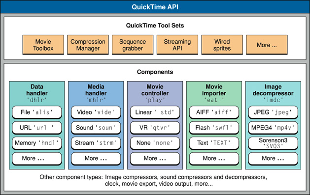
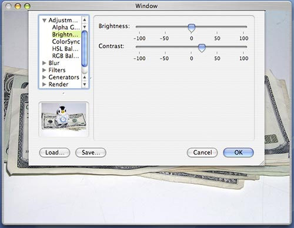

> 导航：[总目录](../../README.md) · [technotes](../../_indexes/technotes.md)


# Retired Document

__Important:__
This document may not represent best practices for current development. Links to downloads and other resources may no longer be valid.

Technical Note TN2140

# Updating Applications for QuickTime 6

__Important:__ This document may not represent best practices for current development. Links to downloads and other resources may no longer be valid.

This Technical Note discusses application level API changes and additions through the QuickTime 6 series of releases (QuickTime 6 - 6.5.2). While it is not meant as a replacement for the information presented in the delta documentation, it does consolidate, distill and elaborate upon certain topics presenting a single easily understandable, searchable document aimed at all QuickTime developers.

"They say that time changes things, but you actually have to change them yourself."

- Andy Warhol

[Overview](#apple-f4xwc4dqnrsv64tfmyxwi33df52wszbpirkfgmjqgaydgnjsgywugsbrfvke4vcbi44da)[You Still Oughta be in Pictures](#apple-f4xwc4dqnrsv64tfmyxwi33df52wszbpirkfgmjqgaydgnjsgywugsbrfvke4vcbi4yq)[What do we mean when we say QuickTime](#apple-f4xwc4dqnrsv64tfmyxwi33df52wszbpirkfgmjqgaydgnjsgywugsbrfvke4vcbi4za)[Where does QuickTime fit in on Mac OS X?](#apple-f4xwc4dqnrsv64tfmyxwi33df52wszbpirkfgmjqgaydgnjsgywugsbrfvke4vcbi4zdk)[The FSSpec, Data References and Movie Storage](#apple-f4xwc4dqnrsv64tfmyxwi33df52wszbpirkfgmjqgaydgnjsgywugsbrfvke4vcbi42a)[Working with Movie Storage and Data References](#apple-f4xwc4dqnrsv64tfmyxwi33df52wszbpirkfgmjqgaydgnjsgywugsbrfvke4vcbi42q)[API Summary](#apple-f4xwc4dqnrsv64tfmyxwi33df52wszbpirkfgmjqgaydgnjsgywugsbrfvke4vcbi44q)[Movie Importers and Data References](#apple-f4xwc4dqnrsv64tfmyxwi33df52wszbpirkfgmjqgaydgnjsgywugsbrfvke4vcbi44dm)[API Summary](#apple-f4xwc4dqnrsv64tfmyxwi33df52wszbpirkfgmjqgaydgnjsgywugsbrfvke4vcbi44ta)[Graphics Importers and Data References](#apple-f4xwc4dqnrsv64tfmyxwi33df52wszbpirkfgmjqgaydgnjsgywugsbrfvke4vcbi44di)[API Summary](#apple-f4xwc4dqnrsv64tfmyxwi33df52wszbpirkfgmjqgaydgnjsgywugsbrfvke4vcbi44tc)[Utility Functions for Working with Data References](#apple-f4xwc4dqnrsv64tfmyxwi33df52wszbpirkfgmjqgaydgnjsgywugsbrfvke4vcbi4zq)[Creating Data References](#apple-f4xwc4dqnrsv64tfmyxwi33df52wszbpirkfgmjqgaydgnjsgywugsbrfvke4vcbi4zdm)[API Summary](#apple-f4xwc4dqnrsv64tfmyxwi33df52wszbpirkfgmjqgaydgnjsgywugsbrfvke4vcbi4zdo)[Retrieving Information about Data References](#apple-f4xwc4dqnrsv64tfmyxwi33df52wszbpirkfgmjqgaydgnjsgywugsbrfvke4vcbi4ztk)[API Summary](#apple-f4xwc4dqnrsv64tfmyxwi33df52wszbpirkfgmjqgaydgnjsgywugsbrfvke4vcbi4ztm)[Retrieving Information about Storage Locations](#apple-f4xwc4dqnrsv64tfmyxwi33df52wszbpirkfgmjqgaydgnjsgywugsbrfvke4vcbi42da)[API Summary](#apple-f4xwc4dqnrsv64tfmyxwi33df52wszbpirkfgmjqgaydgnjsgywugsbrfvke4vcbi42dc)[Data Reference APIs available prior to QuickTime 6](#apple-f4xwc4dqnrsv64tfmyxwi33df52wszbpirkfgmjqgaydgnjsgywugsbrfvke4vcbi43tk)[Using Core Graphics with Graphics Importers and Exporters](#apple-f4xwc4dqnrsv64tfmyxwi33df52wszbpirkfgmjqgaydgnjsgywugsbrfvke4vcbi42ta)[API Summary](#apple-f4xwc4dqnrsv64tfmyxwi33df52wszbpirkfgmjqgaydgnjsgywugsbrfvke4vcbi42tc)[The Carbon Movie Control](#apple-f4xwc4dqnrsv64tfmyxwi33df52wszbpirkfgmjqgaydgnjsgywugsbrfvke4vcbi43da)[Working with the Control Manager](#apple-f4xwc4dqnrsv64tfmyxwi33df52wszbpirkfgmjqgaydgnjsgywugsbrfvke4vcbi43dk)[API Summary](#apple-f4xwc4dqnrsv64tfmyxwi33df52wszbpirkfgmjqgaydgnjsgywugsbrfvke4vcbi43de)[Don't use MCIsPlayerEvent](#apple-f4xwc4dqnrsv64tfmyxwi33df52wszbpirkfgmjqgaydgnjsgywugsbrfvke4vcbi43tc)[Manually Tasking QuickTime](#apple-f4xwc4dqnrsv64tfmyxwi33df52wszbpirkfgmjqgaydgnjsgywugsbrfvke4vcbi43di)[API Summary](#apple-f4xwc4dqnrsv64tfmyxwi33df52wszbpirkfgmjqgaydgnjsgywugsbrfvke4vcbi43do)[Standard Compression and Effects Dialog as Sheets](#apple-f4xwc4dqnrsv64tfmyxwi33df52wszbpirkfgmjqgaydgnjsgywugsbrfvke4vcbi43te)[Calling QuickTime from Background Threads](#apple-f4xwc4dqnrsv64tfmyxwi33df52wszbpirkfgmjqgaydgnjsgywugsbrfvke4vcbi44de)[References](#apple-f4xwc4dqnrsv64tfmyxwi33df52wszbpirkfgmjqgaydgnjsgywugsbrfvke4vcbi43ts)[Document Revision History](#apple-f4xwc4dqnrsv64tfmyxwi33df52wszbpirkfgmjqgaydgnjsgywvezlwnfzws33ojbuxg5dpoj4s2rdpnz2ey2lonncwyzlnmvxhiskel4yq)

## Overview

### You Still Oughta be in Pictures

Technology moves fast, styles change, previous coding techniques may no longer be the trend of the day and unless addressed these changes can quickly render applications dated and stale.

This is no different for a platform technology like QuickTime. As Mac OS X continues to evolve at the core, integration technologies like QuickTime need to adopt lower level changes and pass them up to application developers who can then seamlessly adopt the platform's preferred methodologies.

The QuickTime 6 series of releases have incrementally moved towards the use of more modern constructs appropriate to Mac OS X.

This transition started with the release of QuickTime 6 and the introduction of the Carbon Movie Control. This single API makes working with a Movie Controller in Carbon Event-based applications much easier and faster. QuickTime 6 also introduced a new tasking mechanism designed to improve application performance and the movie storage replacements for the movie file APIs, removing the need to use the antiquated `FSSpec`.

The transition continued though QuickTime 6.4 and later releases introducing greater support for working with Data References; the general way QuickTime describes the location of media data. Core Graphics support for Graphics Importers and Exporters; allowing developers to work with Core Graphics types like `CGImage` and `CGContextRef` instead of a `GWorld`; support for calling certain QuickTime APIs from background threads and the ability to bring up the Standard Compression and Effect Dialogs as sheets, just to name a few of the most commonly used application level features.

This technical note highlights application level changes and lists preferred APIs providing a guide to help developers quickly and easily update older QuickTime code.

### What do we mean when we say QuickTime

QuickTime has been around for some time now and has a deep rich history. First introduced in May 1991 and originally available for System 6.07 and System 7, it was designed as a full media architecture and offers a complete range of services some of which include: media creation, editing, capture from external devices, delivery via the web, streaming, and of course playback.

The QuickTime architecture is based on Components and a number of core Tool Sets; Components are modular pieces of code, each with specific specialized functions that work together to create a very flexible and extensible framework.

__Figure 1__  QuickTime Architecture.



The [QuickTime Getting Started Guide](https://developer.apple.com/referencelibrary/GettingStarted/GS_QuickTime/) provides a great place to begin working though the QuickTime Documentation Roadmap.

For a general introduction to QuickTime suitable for programmers of all levels, take a look at the [QuickTime Overview](https://developer.apple.com/documentation/QuickTime/RM/Fundamentals/QTOverview/index.html) document.

Over the years, the term "QuickTime" has been applied to several different things:

- QuickTime the end user product - this includes QuickTime Player and [QuickTime Pro](http://www.apple.com/quicktime/upgrade/).
- QuickTime the media container format - known as the "QuickTime Movie file format" (.mov). This file format has become the basis for the industry standard MPEG-4 and related file formats.
- QuickTime the media solution - Incorporating several products which can be used together to produce and deliver media; [QuickTime Broadcaster](http://www.apple.com/quicktime/products/broadcaster/), [QuickTime Pro](http://www.apple.com/quicktime/buy/), [QuickTime Streaming Server](http://www.apple.com/quicktime/products/qtss/), QuickTime Plug-in and QuickTime Player.
- QuickTime the set of cross-platform technologies - Consisting of a set of APIs for playing and editing media, image compression and decompression and so on, these APIs allow developers to access media services on both the Macintosh and Windows platforms.

### Where does QuickTime fit in on Mac OS X?

QuickTime sits on top of the Imaging, Video and Audio services on Mac OS X. It should be thought of as an integration layer that gives you access to digital media services on the platform. In turn, QuickTime makes use of lower level platform services all of which have APIs that developers can call directly.

See the [Graphics & Imaging Technology Overview](https://developer.apple.com/referencelibrary/GettingStarted/GS_GraphicsImaging/index.html) for a full discussion of Mac OS X graphics technology.

[Back to Top](#)

## The FSSpec, Data References and Movie Storage

It shouldn't come as a shock to anyone developing software on Mac OS X that the traditional [Mac OS file specification is dead](https://developer.apple.com/technotes/tn/tn2022.html), it is simply no longer suitable for encoding file information for the platform. Yet someone scanning the QuickTime API would see that the `FSSpec` is used in a number of seemingly critical APIs such as `NewMovieFromFile`, `ConvertMovieToFile`, `CreateMovieFile` and so on.

QuickTime internally uses the Data Reference abstraction as the general way to describe the location of media data. QuickTime however, previously relied on a specialized set of functions for dealing with files using `FSSpec`'s and another set of less richly defined APIs dealing with Data References. This is no longer the case. You can now perform all the functions you could with the `FSSpec` based APIs using Data References.

A Data Reference consists of an `OSType` and a `Handle`. The `OSType` indicates the Data Handler component type which is able to interpret the data container being referred to and the `Handle` is a block of data describing the specific location. The kind of information stored in the Handle is specific to the Data Reference type.

QuickTime currently defines the following Data Handler OSTypes:

- `rAliasType = FOUR_CHAR_CODE('alis')`
- `URLDataHandlerSubType = FOUR_CHAR_CODE('url ')`
- `PointerDataHandlerSubType = FOUR_CHAR_CODE('ptr ')`
- `HandleDataHandlerSubType = FOUR_CHAR_CODE('hndl')`
- `ResourceDataHandlerSubType = FOUR_CHAR_CODE('rsrc')`

As an example, a Data Reference to a file stored on a local volume would consist of an `rAliasType('alis')` `OSType`, while the Data Reference `Handle` would contain a Macintosh `AliasHandle` to the file itself. There are Data Reference types for URLs, Handles, Pointers, Resources and Files.

A Data Reference can also be described using a `DataReferenceRecord` structure.

```swift
struct DataReferenceRecord {
  OSType dataRefType;
  Handle dataRef;
};
typedef struct DataReferenceRecord DataReferenceRecord;
typedef DataReferenceRecord *      DataReferencePtr;
```

For a detailed discussion of Data References and their extensions, refer to [Technical Note TN1195, 'Tagging Handle and Pointer Data References in QuickTime'](https://developer.apple.com/technotes/tn/tn1195.html)

### Working with Movie Storage and Data References

QuickTime 6 introduced a set of APIs to completely replace the older `FSSpec` based APIs for opening, creating and updating movie files. Instead of being restricted to movie files described using an `FSSpec`, you can now perform these operations on any container that holds media data regardless how the location is described. For example, the container could be described by a full path in a `CFString`, a URL in a `NSURL`, `FSRef` and so on.

Table 1 lists the older `FSSpec` based APIs and their modern replacements.

__Table 1__  Movie Storage & Movie Data Reference APIs added in QuickTime 6 releases.

| Old API | Modern API |
| CreateMovieFile | CreateMovieStorage |
| OpenMovieFile | OpenMovieStorage |
| CloseMovieFile | CloseMovieStorage |
| DeleteMovieFile | DeleteMovieStorage |
| AddMovieResource | AddMovieToStorage |
| UpdateMovieResource | UpdateMovieInStorage |
| PutMovieIntoDataFork64 | PutMovieIntoStorage |
| NewMovieFromDataFork64 | NewMovieFromStorageOffset |
| FlattenMovieData | FlattenMovieDataToDataRef |
| ConvertMovieToFile | ConvertMovieToDataRef |
| ConvertFileToMovieFile | ConvertDataRefToMovieDataRef |

Table 2 lists two APIs which add Data Reference functionality to `PutMovieIntoHandle` and `NewMovieFromHandle` respectively.

__Table 2__  Data Reference APIs with added functionality in QuickTime 6.

| APIs adding Data Reference functionality |
| PutMovieForDataRefIntoHandle |
| NewMovieForDataRefFromHandle |

The Movie Storage APIs provide a more general way to create storage containers that can be accessed by data handlers. Let's directly compare a couple of the calls.

`CreateMovieFile` creates an empty QuickTime Movie structure with its default Data Reference set to the newly created movie file and opens the file with write permission.

```
CreateMovieFile(const FSSpec *fileSpec, OSType creator, ScriptCode scriptTag,
                long createMovieFileFlags,  short *resRefNum, Movie *newmovie)
```

`CreateMovieStorage` creates an empty QuickTime Movie structure whith its default Data Reference set to the newly created empty storage location and opens a Data Handler to this movie storage container with write permission.

```
CreateMovieStorage(Handle dataRef, OSType dataRefType, OSType creator,
                   ScriptCode scriptTag, long createMovieFileFlags,
                   DataHandler *outDataHandler, Movie *newmovie)
```

Notice how `CreateMovieStorage` makes used of Data References. Because Data References are related to which Data Handler Component is reading and/or writing the media data, the more general movie storage API returns an instance of a Data Handler which is related to the Data Reference passed in. In the `CreateMovieFile` case, the Data Handler is implied by the API itself.

Modernizing your code and moving to the Movie Storage APIs is easy, the older calls simply map directly to the newer calls and are straight forward replacements.

There are two older APIs which should be discussed in this section, they are `NewMovieFromFile` and its Data Reference replacement `NewMovieFromDataRef`. While `NewMovieFromDataRef` has been around for some time you may have not had a chance to use it yet.

Many QuickTime application open movie files by performing this older sequence of calls:

__Listing 1__  Older method.

```
Booolean OpenMovie(FSSpecPtr inFSSpec)
{
    Movie    myMovie = NULL;
    short    myRefNum = kInvalidFileRefNum;
    short    myResID = 0;
    OSErr    myErr = noErr;

    ...

    // open the movie file
    myErr = OpenMovieFile(inFSSpec, &myRefNum, fsRdPerm);
    if (myErr != noErr) goto bail;

    // get the Movie
    myErr = NewMovieFromFile(&myMovie, myRefNum, &myResID, NULL, newMovieActive, NULL);
    if (myErr != noErr) goto bail;

    // close the movie file - we no longer need it
    CloseMovieFile(myRefNum);

    // remember to call DisposeMovie when done with the returned Movie

    ...
}
```

`NewMovieFromFile` returns a Movie you can manipulate. You never deal with the movie file at all. QuickTime implicitly knows about the `rAliasType` Data Reference and where the media is stored.

The replacement for the above sequence of calls is simple. There's couple of minor differences; you don't need to specifically Open or Close the container and you'll need to create a Data Reference specifying the location of the file.

Creating the Data Reference is easy and QuickTime provides a number of utility functions to help create Data References (these are discussed in the next section), but you'll have to resist the urge to call `NewMovieFromStorageOffset` as this a specialized call and not really equivalent to `NewMovieFromFile`. The correct answer is to call `NewMovieFromDataRef`.

The modern sequence looks like this:

__Listing 2__  Modern method.

```
Booolean OpenMovie(CFStringRef inPath)
{
    Movie    myMovie = NULL;
    OSType   myDataRefType;
    Handle   myDataRef = NULL;
    short    myResID = 0;
    OSErr    myErr = noErr;

    ...

    // create the data reference
    myErr = QTNewDataReferenceFromFullPathCFString(inPath, kQTNativeDefaultPathStyle,
                                                   0, &myDataRef, &myDataRefType);
    if (myErr != noErr) goto bail;

    // get the Movie
    myErr = NewMovieFromDataRef(&myMovie, newMovieActive,
                                &myResID, myDataRef, myDataRefType);
    if (myErr != noErr) goto bail;

    // dispose the data reference handle - we no longer need it
    DisposeHandle(myDataRef);

    // remember to call DisposeMovie when done with the returned Movie

    ...
}
```

The following code snippets show how to perform a few common operations using the Movie Storage APIs:

__Listing 3__  Save a Movie with dependencies to a file.

```
OSStatus WriteMovieWithDependenciesToFile(Movie inMovie, CFStringRef inPath)
{
    Handle      dataRef = NULL;
    OSType      dataRefType;
    DataHandler dataHandler = 0;
    OSStatus    err;

    // create the data refenrece
    err = QTNewDataReferenceFromFullPathCFString(inPath, kQTNativeDefaultPathStyle, 0,
                                                 &dataRef, &dataRefType);
    if (err != noErr) goto bail;

    // create a file
    err = CreateMovieStorage(dataRef, dataRefType, FOUR_CHAR_CODE('TVOD'),
                             smSystemScript, createMovieFileDeleteCurFile,
                             &dataHandler, NULL);
    if (err != noErr) goto bail;

    // add the Movie
    err = AddMovieToStorage(inMovie, dataHandler);
    if (err != noErr) {
        DataHDeleteFile(dataHandler);
    }

bail:
    // close the storage
    if (dataHandler) CloseMovieStorage(dataHandler);

    // remember to dispose the data reference handle
    if (dataRef) DisposeHandle(dataRef);

    return err;
}
```

__Listing 4__  Flatten a Movie to a Data Reference.

```
OSStatus WriteFlattenedMovieToFile(Movie inMovie, CFStringRef inPath)
{
    Handle    dataRef = NULL;
    OSType    dataRefType;
    OSStatus  err;

    // create the data reference
    err = QTNewDataReferenceFromFullPathCFString(inPath, kQTNativeDefaultPathStyle, 0,
                                                 &dataRef, &dataRefType);
    if (noErr == err) {
        // flatten the movie
        Movie newMovie = FlattenMovieDataToDataRef(inMovie, flattenAddMovieToDataFork,
                                        dataRef, dataRefType, FOUR_CHAR_CODE('TVOD'),
                                        smSystemScript, createMovieFileDeleteCurFile);

        if (NULL != newMovie) {
            // we choose not to do anything with the returned movie
            DisposeMovie(newMovie);
        } else {
            err = invalidMovie;
        }

        // remember to dispose the data reference handle
        DisposeHandle(dataRef);
    }

    return err;
}
```

__Listing 5__  Save a Movie as a user specified format.

```objc
- (OSStatus) saveMovieFile(Movie inMovie, NSString *inPath)
 {
    Handle      dataRef = NULL;
    OSType      dataRefType;
    DataHandler dataHandler = 0;
    OSStatus    err;

    // create the data reference
    err = QTNewDataReferenceFromFullPathCFString((CFStringRef)inPath,
                                                 kQTNativeDefaultPathStyle,
                                                 0, &dataRef, &dataRefType);

    if (noErr == err) {
        // set the default progress procedure,
        SetMovieProgressProc(theMovie, (MovieProgressUPP)-1L, 0);

        // export the movie into a file
        err = ConvertMovieToDataRef(inMovie,        // the movie
                                    NULL,           // all tracks
                                    dataRef,        // the output data reference
                                    dataRefType,    // the data ref type
                                    0,              // no output file type
                                    0,              // no output file creator
                                    showUserSettingsDialog |    // flags
                                    movieToFileOnlyExport  |
                                    movieFileSpecValid,
                                    NULL); // no specific component
    }

    // remember to dispose the data reference handle
    DisposeHandle(dataRef);

    return err;
}
```

### API Summary

#### CreateMovieStorage

Creates an empty storage container to hold the Movie which references the Data Reference. This call opens a data handler to the movie file with write permission.

```
OSErr CreateMovieStorage(Handle dataRef,
                         OSType dataRefType,
                         OSType creator,
                         ScriptCode scriptTag,
                         long createMovieFileFlags,
                         DataHandler *outDataHandler,
                         Movie *newmovie);

Parameter Descriptions:

dataRef - A data reference to the storage for the movie file to be created.

dataRefType - The type of data reference.

creator - The creator value for the new file.

scriptTag - The script in which the movie file should be created. Use the Script Manager
            constant smSystemScript to use the system script; use the smCurrentScript
            constant to use the current script.

createMovieFileFlags - Controls movie file creation flags (see flags below).

outDataHandler - A pointer to a field that is to receive the data handler for the opened
                 movie file. Your application can use this value when calling other
                 Movie Toolbox functions that work with movie storage. If you set this
                 parameter to NULL, the Movie Toolbox creates the movie storage but does
                 not open the storage container.

newmovie - A pointer to a field that is to receive the identifier of the new Movie.
           CreateMovieStorage returns the identifier of the new Movie. If the function
           could not create a new Movie, it sets this returned value to 0. If you set
           this parameter to NULL, the Movie Toolbox does not create a movie.

Create Movie Storage Flags:

createMovieFileDeleteCurFile - Indicates whether to delete an existing file. If you set
                               this flag to 1, the Movie Toolbox deletes the file (if it
                               exists) before creating the new movie file. If you set
                               this flag to 0 and the file specified by the dataRef
                               parameter already exists, the Movie Toolbox uses the
                               existing file.

createMovieFileDontCreateMovie - Controls whether CreateMovieStorage creates a new Movie
                                 in the movie file. If you set this flag to 1, the Movie
                                 Toolbox does not create a movie in the new movie file.
                                 In this case, the function ignores the newmovie
                                 parameter. If you set this flag to 0, the Movie Toolbox
                                 creates a movie and returns the movie identifier in the
                                 field referred to by the newmovie parameter.

createMovieFileDontOpenFile - Controls whether CreateMovieStorage opens the new movie
                              file. If you set this flag to 1, the Movie Toolbox does
                              not open the new movie file. In this case, the function
                              ignores the outDataHandler parameter. If you set this flag
                              to 0, the Movie Toolbox opens the new movie file and
                              returns an instance of a data handler in
                              the outDataHandler parameter.

newMovieActive - Controls whether the new movie is active. Set this flag to 1 to make
                 the new movie active. A movie that does not have any tracks can still
                 be active. When the Movie Toolbox tries to play the movie, no images
                 are displayed, because there is no movie data. You can make a movie
                 active or inactive by calling SetMovieActive.

newMovieDontAutoAlternate - Controls whether the Movie Toolbox automatically selects
                            enabled tracks from alternate track groups. If you set this
                            flag to 1, the Movie Toolbox does not automatically select
                            tracks for the movie; you must enable tracks yourself.
```

If you are writing a custom data handler and would like to support this API make sure the following data handler selectors are implemented:

- `DataHGetDataRef`
- `DataHWrite64` or `DataHWrite` if you don't support 64-bit offsets. The 64-bit version is preferred.
- `DataHDeleteFile` to support the `createMovieFileDeleteCurFile` flag.
- `DataHCreateFileWithFlags` or `DataHCreateFile`. The WithFlags version is preferred.
- `DataHOpenForRead` and `DataHOpenForWrite`. The data hanlder must support both `kDataHCanRead` and `kDataHCanWrite`.

#### OpenMovieStorage

Opens a data handler to a specifies movie storage container.

This is a rarely used routine.

```
OpenMovieStorage(Handle dataRef,
                 OSType dataRefType,
                 long flags,
                 DataHandler *outDataHandler);

Parameter Descriptions

dataRef - A data reference to a handle for the movie to be stored.

dataRefType - The type of data reference.

flags - Either one or both of kDataHCanRead or kDataHCanWrite

outDataHandler - A pointer to a field that is to receive the data handler for the opened
                 movie storage. Your application can use this value when calling other
                 Movie Toolbox functions that work with movie storage.
```

#### CloseMovieStorage

Closes an open movie storage container.

This routine is equivalent to `CloseComponent`.

```
CloseMovieStorage(DataHandler dh);

Parameter Descriptions:

dh - A data handler component instance.
```

#### DeleteMovieStorage

Deletes a movie storage container.

```
DeleteMovieStorage (Handle dataRef, OSType dataRefType);

Parameter Descriptions:

dataRef - A data reference to the movie storage to be deleted.

dataRefType - The type of data reference.
```

If you are writing a custom data hander and you would like to support this API make sure the following data handler selectors are implemented:

- `DataHDeleteFile`

#### AddMovieToStorage

Adds a Movie atom to a movie storage container.

```
AddMovieToStorage (Movie theMovie, DataHandler dh);

Parameter Descriptions:

theMovie - The movie for this operation.

dh - A data handler component instance.
```

If you are writing a custom data hander and you would like to support this API make sure the following data handler selectors are implemented:

- `DataHScheduleData64` and `DataHGetFileSize64`. If you're not supporting 64-bit file offsets implement `DataHScheduleData` and `DataHGetFileSize`. The 64-bit version is preferred.
- `DataHWrite64`. If you're not supporting 64-bit file offsets implement `DataHWrite`. The 64-bit version is preferred.
- `DataHGetDataRef`

#### UpdateMovieInStorage

Replaces the contents of a Movie atom in a specified movie storage.

```
UpdateMovieInStorage(Movie theMovie, DataHandler dh);

Parameter Descriptions:

theMovie - The Movie for this operation.

dh - A data handler component instance.
```

#### PutMovieIntoStorage

Writes a Movie atom at a specified offset into a storage container managed by a data handler.

```
OSErr PutMovieIntoStorage(Movie theMovie,
                          DataHandler dh,
                          const wide *offset,
                          unsigned long maxSize);

Parameter Descriptions:

theMovie - A Movie identifier.

dh - A data handler for the data fork of the given storage. You pass in an open write
     path in the dh parameter.

offset - A pointer to a value that indicates where the movie should be written.

maxSize - The largest number of bytes that may be written.
```

If you are writing a custom data hander and you would like to support this API make sure the following data handler selectors are implemented:

- `DataHGetDataRef`
- `DataHWrite64`. If you're not supporting 64-bit file offsets implement `DataHWrite`. The 64-bit version is preferred.

#### NewMovieFromStorageOffset

Retrieves a Movie atom that is stored at the specified offset in a movie storage container.

```
NewMovieFromStorageOffset(Movie *theMovie,
                          DataHandler dh,
                          const wide *fileOffset,
                          short newMovieFlags,
                          Boolean *dataRefWasChanged);

Parameter Descriptions:

theMovie - A pointer to a field that is to receive the new movie's identifier. If the
           function cannot load the movie, the returned identifier is set to NIL.

dh - A data handler to a file that is already open.

fileOffset - A pointer to the starting file offset of the atom in the data fork of the
             file specified by the dh parameter.

newMovieFlags - Flags that control characteristics of the new movie (see flags below).

dataRefWasChanged - A pointer to a Boolean value. The Movie Toolbox sets the value to
                    TRUE if any of the movie's data references were changed. Use
                    UpdateMovieInStorage to preserve these changes. If you do not want
                    to receive this information, set the
                    dataRefWasChanged parameter to NULL. If the Movie Toolbox cannot
                    completely resolve all data references, it sets the current error
                    value to couldNotResolveDataRef.

New Movie Flags:

newMovieActive - Controls whether the new movie is active. Set this flag to 1 to make
                 the new movie active. A movie that does not have any tracks can still
                 be active. When the Movie Toolbox tries to play the movie, no images
                 are displayed, because there is no movie data. You can make a movie
                 active or inactive by calling the SetMovieActive function.

newMovieDontAutoAlternate - Controls whether the Movie Toolbox automatically selects
                            enabled tracks from alternate track groups. If you set this
                            flag to 1, the Movie Toolbox does not automatically select
                            tracks for the movie; you must enable tracks yourself.

newMovieDontResolveDataRefs - Controls how completely the Movie Toolbox resolves data
                              references in the movie resource. If you set this flag to
                              0, the Movie Toolbox tries to completely resolve all data
                              references in the resource. This may involve searching for
                              files on remote volumes. If you set this flag to 1, the
                              Movie Toolbox only looks in the specified file. If the
                              Movie Toolbox cannot completely resolve all the data
                              references, it still returns a valid movie identifier. In
                              this case, the Movie Toolbox also sets the current error
                              value to couldNotResolveDataRef.

newMovieDontAskUnresolvedDataRefs - Controls whether the Movie Toolbox asks the user to
                                    locate files. If you set this flag to 0, the Movie
                                    Toolbox asks the user to locate files
                                    that it cannot find on available volumes. If the
                                    Movie Toolbox cannot locate a file even
                                    with the user's help, the function returns a valid
                                    movie identifier and sets the current error value to
                                    couldNotResolveDataRef.
```

This routine serves the same purpose for movie storage as `NewMovieFromDataFork64` serves for movie file references. The API reads the Movie atom found at fileOffset and creates a Movie. The data handler parameter should be an open data handler component instance for the storage holding the Movie atom. The `newMovieFlags` and `dataRefWasChanged` parameters are interpreted identically to those same parameters to `NewMovieFromDataFork64`.

__Important:__ Unlike `NewMovieFromDataFork` and `NewMovieFromDataFork64`, there is no special interpretation of the file offset of -1. With those APIs, -1 indicates the current file position on the fileReference used. However, since data handlers have no notion of a current file position, there is no support for this magic value.

If you are writing a custom data hander and you would like to support this API make sure the following data handler selectors are implemented:

- `DataHScheduleData64` and `DataHGetFileSize64`
- `DataHScheduleData`. If you're not supporting 64-bit file offsets implement `DataHGetFileSize`. The 64-bit version is preferred.
- `DataHGetDataRef`

#### FlattenMovieDataToDataRef

Performs a flattening operation to the destination Data Reference and returns a identifier of a new Movie as the function result. If the function could not create the Movie, it sets this returned identifier to 0.

```
Movie FlattenMovieDataToDataRef(Movie theMovie,
                                long movieFlattenFlags,
                                Handle dataRef,
                                OSType dataRefType,
                                OSType creator,
                                ScriptCode scriptTag,
                                long createMovieFileFlags);

Parameter Descriptions:

theMovie - The movie for this operation. Your application obtains this movie identifier
           from such functions as as NewMovie, NewMovieFromFile, and NewMovieFromHandle.

movieFlattenFlags - Flags that control the process of adding movie data to the new movie
                    file. These flags affect how the toolbox adds movies to the new
                    movie file later (see flags below). Set unused flags to 0.

dataRef - A data reference to the handle for the movie file to be flattened.

dataRefType - The type of data reference.

creator - The creator value for the new file.

scriptTag - Constants that specify the script in which the movie file should be created.
            Use smSystemScript to use the system script or smCurrentScript to use the
            current script.

createMovieFileFlags - Flags that control file creation options (see flags below).

Movie Flatten Flags:

flattenAddMovieToDataFork - Causes the movie to be placed in the data fork of the new
                            movie file. You may use this flag to create single-fork
                            movie files, which can be more easily moved to computer
                            systems other than Macintosh.

flattenDontInterleaveFlatten - Allows you to disable the Movie Toolbox's data storage
                               optimizations. By default, the Movie Toolbox stores movie
                               data in a format that is optimized for the storage
                               device. Set this flag to 1 to disable these
                               optimizations.

flattenActiveTracksOnly - Causes the Movie Toolbox to add only enabled movie tracks to
                          the new movie file. Use SetTrackEnabled, to enable and disable
                          movie tracks.

flattenCompressMovieResource - Compresses the movie resource stored in the file's data
                               fork, but not the movie resource stored in the resource
                               fork on Mac OS systems.

flattenForceMovieResourceBeforeMovieData - Set this flag when you are creating a fast
                                           start movie, to put the movie resource at the
                                           front of the resulting movie file.

Create Movie Flags:

createMovieFileDeleteCurFile - Indicates whether to delete an existing file. If you set
                               this flag to 1, the Movie Toolbox deletes the file (if it
                               exists) before creating the new movie file. If this flag
                               is set to 0 and the file specified by the dataRef
                               parameter already exists, the Movie Toolbox uses the
                               existing file. In this case, the toolbox ensures that the
                               file has both a data and a resource fork. If this flag
                               isn't set, the data is appended to the file.

createMovieFileDontCreateMovie - Controls whether CreateMovieFile creates a new movie in
                                 the movie file. If you set this flag to 1, the Movie
                                 Toolbox does not create a movie in the new movie file.
                                 In this case, the function ignores the newmovie
                                 parameter. If you set this flag to 0, the Movie Toolbox
                                 creates a movie and returns the movie identifier
                                 in the field referred to by the newmovie parameter.

createMovieFileDontOpenFile - Controls whether CreateMovieFile opens the new movie file.
                              If you set this flag to 1, the Movie Toolbox does not open
                              the new movie file. In this case, the function ignores the
                              resRefNum parameter. If you set this flag to 0, the Movie
                              Toolbox opens the new movie file and returns its reference
                              number into the field referred to by the resRefNum
                              parameter.
```

With QuickTime versions prior to 6.0 it was possible to flatten a Movie to a Data Reference. However, it wasn't obvious. It involved calling `FlattenMovieData` while doing the following:

- Passing the address of a `DataReferenceRecord` in place of the address of a file's `FSSpec` and including the `flattenFSSpecPtrIsDataRefRecordPtr` flag in the `movieFlattenFlags` parameter.

`FlattenMovieDataToDataRef` now performs this same work on the client's behalf.

#### ConvertMovieToDataRef

Converts a specified movie (or a single track within a movie) into a specified file format and stores it in a specified storage location.

```
OSErr ConvertMovieToDataRef(Movie theMovie,
                            Track onlyTrack,
                            Handle dataRef,
                            OSType dataRefType,
                            OSType fileType,
                            OSType creator,
                            long flags,
                            ComponentInstance userComp);

Parameter Descriptions:

theMovie - The movie for this operation.

onlyTrack - The track in the source movie, if you want to convert only a single track.

dataRef - A data reference that specifies the storage location to receive the converted
          movie data.

dataRefType - The type of data reference. This function currently supports only alias
              data references.

fileType - The Mac OS file type of the storage location, which determines the export
           format.

creator - The creator type of the storage location.

flags - Flags that control the operation of the dialog box (see below).

userComp - An instance of the component to be used for converting the movie data.

Convert Movie Flags:

showUserSettingsDialog - If this bit is set, the Save As dialog box will be displayed to
                         allow the user to choose the type of file to export to, as well
                         as the file name to export to.

movieToFileOnlyExport - If this bit is set and the showUserSettingsDialog bit is set,
                        the Save As dialog box restricts the user to those file formats
                        that are supported by movie data export components.

movieFileSpecValid - If this bit is set and the showUserSettingsDialog bit is set, the
                     name field of the dataRef parameter is used as the default name of
                     the exported file in the Save As dialog box.
```

If the storage location is on a local file system, the file will have the specified file type and the creator. If `showUserSettingsDialog` is specified in the flags parameter, the function displays a dialog box that lets the user choose the output file and the export type. If an export component (or instance of an export component) is specified in the `userComp` parameter, it will be used to perform the conversion operation.

#### ConvertDataRefToMovieDataRef

Converts a piece of data in a storage location to a movie file format and stores it in another storage location, supporting a user settings dialog box for import operations.

```
OSErr ConvertDataRefToMovieDataRef(Handle inputDataRef,
                                   OSType inputDataRefType,
                                   Handle outputDataRef,
                                   OSType outputDataRefType,
                                   OSType creator,
                                   long flags,
                                   ComponentInstance userComp,
                                   MovieProgressUPP proc,
                                   long refCon);

Parameter Descriptions:

inputDataRef - A data reference that specifies the storage location of the source data.

inputDataRefType - The type of the input data reference.

outputDataRef - A data reference that specified the storage location to receive the
                converted data.

outputDataRefType - The type of the output data reference.

creator - The creator type of the output storage location.

flags - Flags that control the operation of the dialog box (see below).

userComp - An instance of a component to be used for converting the movie data.

proc - A MovieProgressProc progress callback function.

refCon - A reference constant to be passed to your callback. Use this parameter to point
         to a data structure containing any information your function needs.

Convert Movie Flags:

createMovieFileDeleteCurFile - Indicates whether to delete an existing file. If you set
                               this flag to 1, the Movie Toolbox deletes the file (if it
                               exists) before converting the new movie file. If you set
                               this flag to 0 and the file specified by the inputDataRef
                               and outputDataRef parameters already exists, the Movie
                               Toolbox uses the existing file. In this case, the toolbox
                               ensures that the file has both data.

movieToFileOnlyExport - If this bit is set and the showUserSettingsDialog bit is set,
                        the Save As dialog box restricts the user to those file formats
                        that are supported by
                        movie data export components.

movieFileSpecValid - If this bit is set and the showUserSettingsDialog bit is set, the
                     name of the outputDataRef parameter is used as the default name of
                     the exported file in the Save As dialog box.

showUserSettingsDialog - Controls whether the user settings dialog box for the specified
                         import operation can appear. Set this flag to 1 to display the
                         user settings dialog box.
```

This function converts a piece of data in a storage location into a movie and stores into another storage location. Both the input and the output storage locations are specified through data references. If the storage location is on a local file system, the file will have the specified creator. If specified as such in the flags, the function displays a dialog box that lets the user to choose the output file and the export type. If an export component (or its instance) is specified in `userComp`, it will be used for the conversion operation.

#### PutMovieForDataRefIntoHandle

This routine is equivalent to the [PutMovieIntoHandle](https://developer.apple.com/documentation/QuickTime/Reference/QTRef_MovieManager/Reference/reference.html#//apple_ref/c/func/PutMovieIntoHandle) API with one important difference. If the `dataRef` and `dataRefType` is passed, all media references to the same storage are converted to self-references in the resulting public movie handle. This Movie atom can be then written to the storage location.

```
OSErr PutMovieForDataRefIntoHandle(Movie theMovie,
                                   Handle dataRef,
                                   OSType dataRefType,
                                   Handle publicMovie);

Parameter Descriptions:

theMovie - The movie for this operation.

dataRef - A data reference to the storage in which the movie will be written.

dataRefType - The type of data reference.

publicMovie - The handle that is to receive the new movie resource. The function resizes
              the handle if necessary.
```

#### NewMovieForDataRefFromHandle

This routine is equivalent to [NewMovieFromHandle](https://developer.apple.com/documentation/QuickTime/Reference/QTRef_MovieToolkit/Reference/reference.html#//apple_ref/c/func/NewMovieFromHandle) API with one important difference. If the public handle contains media Data References that are self-references, `NewMovieForDataRefFromHandle` will convert these self-references to references specified by the passed in `dataRef` and `dataRefType`. All other data references are not changed.

```
OSErr NewMovieForDataRefFromHandle(Movie *theMovie,
                                   Handle h,
                                   short newMovieFlags,
                                   Boolean *dataRefWasChanged,
                                   Handle dataRef,
                                   OSType dataRefType);

Parameter Descriptions:

theMovie - A pointer to a field that is to receive the new movie's identifier. If the
           function cannot load the movie, the returned identifier is set to 0.

h - A handle to the movie resource from which the movie is to be loaded.

newMovieFlags - Flags that control characteristics of the new movie (see flags below).
                Be sure to set unused flags to 0.

dataRefWasChanged - A pointer to a Boolean value. The toolbox sets the value to TRUE if
                    any references were changed. Set the dataRefWasChanged parameter to
                    NULL if you don't want to receive this information. function result
                    If the Movie Toolbox cannot completely resolve all data references,
                    it sets the current error value to couldNotResolveDataRef.

dataRef - A data reference to the storage from which the movie was retrieved.

dataRefType - The type of data reference.

New Movie Flags:

newMovieActive - Controls whether the new movie is active. Set this flag to 1 to make
                 the new movie active. You can make a movie active or inactive by
                 calling SetMovieActive

newMovieDontResolveDataRefs - Controls how completely the Movie Toolbox resolves data
                              references in the movie resource. If you set this flag to
                              0, the toolbox tries to completely resolve all data
                              references in the resource. This may involve searching for
                              files on remote volumes. If you set this flag to 1, the
                              Movie Toolbox only looks in the specified file. If the
                              Movie Toolbox cannot completely resolve all the data
                              references, it still returns a valid movie identifier. In
                              this case, the Movie Toolbox also sets the current error
                              value to couldNotResolveDataRef.

newMovieDontAskUnresolvedDataRefs - Controls whether the Movie Toolbox asks the user to
                                    locate files. If you set this flag to 0, the Movie
                                    Toolbox asks the user to locate files that it cannot
                                    find on available volumes. If the Movie Toolbox
                                    cannot locate a file even with the user's help, the
                                    function returns a valid movie identifier and sets
                                    the current error value to couldNotResolveDataRef.

newMovieDontAutoAlternate - Controls whether the Movie Toolbox automatically selects
                            enabled tracks from alternate track groups. If you set this
                            flag to 1, the Movie Toolbox does not automatically select
                            tracks for the movie; you must enable tracks yourself.
```

[Back to Top](#)

## Movie Importers and Data References

Two APIs were added in QuickTime 6.4 to enable using Data References with Movie Importers. `MovieImportDoUserDialogDataRef` requests that a Movie Import Component display it's user dialog box and uses the Data Reference passed in to specify the storage location that contains the data to import. `MovieImportSetMediaDataRef` allows developers to specify the Data Reference storage location that is to receive the imported movie data. These two APIs replace `MovieImportDoUserDialog` and `MovieImportSetMediaFile` respectively.

__Table 3__  Data Reference APIs for Movie Importers.

| Old API | Modern API |
| MovieImportDoUserDialog | MovieImportDoUserDialogDataRef |
| MovieImportSetMediaFile | MovieImportSetMediaDataRef |

### API Summary

#### MovieImportDoUserDialogDataRef

Requests that a Movie Import Component display it's user dialog box. The Data Referece specifies the storage location that contains the data to import.

```
ComponentResult MovieImportDoUserDialogDataRef(MovieImportComponent ci,
                                               Handle dataRef,
                                               OSType dataRefType,
                                               Boolean *canceled);

Parameter Descriptions:

ci - The component instance that identifies your connection to the graphics importer
     component.

dataRef - A data reference that specifies a storage location that contains the data to
          import.

dataRefType - The type of the data reference.

canceled - A pointer to a Boolean entity that is set to TRUE if the user cancels the
           export operation.
```

#### MovieImportSetMediaDataRef

Specifies a storage location that is to receive the imported movie data during an import operation.

```
ComponentResult MovieImportSetMediaDataRef(MovieImportComponent ci,
                                           Handle dataRef,
                                           OSType dataRefType);

Parameter Descriptions:

ci - The component instance that identifies your connection to the graphics importer
     component.

dataRef - A data reference that specifies a storage location that receives the imported
          data.

dataRefType - The type of the data reference.
```

[Back to Top](#)

## Graphics Importers and Data References

QuickTime 6.4 added four Graphics Importer functions allowing developers to work with Data References when performing export operations to foreign file formats, QuickDraw pictures or QuickTime Image files. See Table 4.

__Table 4__  Data Reference APIs for Graphics Importers.

| Old API | Modern API |
| GraphicsImportDoExportImageFileDialog | GraphicsImportDoExportImageFileToDataRefDialog |
| GraphicsImportExportImageFile | GraphicsImportExportImageFileToDataRef |
| GraphicsImportSaveAsPicture | GraphicsImportSaveAsPictureToDataRef |
| GraphicsImportSaveAsQuickTimeImageFile | GraphicsImportSaveAsQuickTimeImageFileToDataRef |

### API Summary

#### GraphicsImportDoExportImageFileToDataRefDialog

Requests that a Graphics Importer present a dialog box that lets the user save an imported image to a foreign file format.

```
ComponentResult GraphicsImportDoExportImageFileToDataRefDialog(
                                                        GraphicsImportComponent ci,
                                                        Handle inDefaultDataRef,
                                                        OSType inDefaultDataRefType,
                                                        CFStringRef prompt,
                                                        ModalFilterYDUPP filterProc,
                                                        OSType *outExportedType,
                                                        Handle *outExportedDataRef,
                                                        OSType *outExportedDataRefType);

Parameter Descriptions:
ci - The component instance that identifies your connection to the Graphics Importer
     component.

inDefaultDataRef - A data reference that specifies the default export location.

inDefaultDataRefType - The type of the data reference that specifies the default export
                       location.

prompt - A reference to a CFString that contains the prompt text string for the dialog.

filterProc - A modal filter function; see ModalFilterYDProc in the QuickTime API
             Reference.

outExportedType - A pointer to an OSType entity where the type of the exported file will
                  be returned.

outExportedDataRef - A pointer to an handle where the data reference to the exported
                     file will be returned.

outExportedDataRefType - A pointer to an OSType entity where the type of the data
                         reference that points to the exported file will be returned.
```

This function presents a file dialog that lets the user to specify a file to which the exported data goes and a format into which image data is exported. By using Data References, a long file name or Unicode file name can be used as a default file name as well as the name of the file into which the export data goes. This function replaces `GraphicsImportDoExportImageFileDialog`.

#### GraphicsImportExportImageFileToDataRef

Saves an imported image in a foreign file format.

```
ComponentResult GraphicsImportExportImageFileToDataRef(GraphicsImportComponent ci,
                                                       OSType fileType,
                                                       OSType fileCreator,
                                                       Handle dataRef,
                                                       OSType dataRefType);

Parameter Descriptions:

ci - The component instance that identifies your connection to the graphics importer component.

fileType - The Mac OS file type for the new file, which determines the file format.

fileCreator - The creator type of the new file.

dataRef - A data reference that specifies a storage location to which the image is to be exported.

dataRefType - The type of the data reference.
```

This function exports the imported image to a foreign file format specified by fileType. The exported data will be saved into a storage location specified by a Data Reference. You can use Data Reference functions to create a data reference for a file that has long or Unicode file name. This function replaces `GraphicsImportExportImageFile`.

#### GraphicsImportSaveAsPictureToDataRef

Creates a storage location that contains a QuickDraw picture for an imported image.

```
ComponentResult GraphicsImportSaveAsPictureToDataRef(GraphicsImportComponent ci,
                                                     Handle dataRef,
                                                     OSType dataRefType);

Parameter Descriptions:

ci - The component instance that identifies your connection to the graphics importer component.

dataRef - A data reference that specifies a storage location to which the picture is to be saved.

dataRefType - The type of the data reference.
```

This function saves the imported image as a QuickDraw picture into a storage location specified through a Data Reference. You can use Data Reference Utilities to create a Data Reference for a file that has long or Unicode file name. This function replaces `GraphicsImporterSaveAsPictureFile`.

#### GraphicsImportSaveAsQuickTimeImageFileToDataRef

Creates a storage location that contains a QuickTime image of an imported image.

```
ComponentResult GraphicsImportSaveAsQuickTimeImageFileToDataRef(
                                                            GraphicsImportComponent ci,
                                                            Handle dataRef,
                                                            OSType dataRefType);

Parameter Descriptions:

ci - The component instance that identifies your connection to the graphics importer component.

dataRef - A data reference that specifies a storage location to which the picture is to be saved.

dataRefType - The type of the data reference.
```

This function saves the imported image as a QuickTime image into a storage location specified through a Data Reference. You can use Data Reference functions to create a data reference for a file that has long or Unicode file name. This function replaces `GraphicsImportSaveAsQuickTimeImageFile`.

[Back to Top](#)

## Utility Functions for Working with Data References

It should be clear that the Data Reference abstraction is central to manipulating media in QuickTime and that Data References can now be used throughout the entire QuickTime API. Not only is this a far more versatile way of describing the location of media data, but as file systems change and developers invent new ways to refer to media, this abstraction can grow to meet new needs.

Creating Data References by hand however would be very annoying, so QuickTime provides a full set of utility functions for creating new Data References, retrieving information about Data References and retrieving information about storage locations.

### Creating Data References

These Data Reference functions let you create data references from full paths, URLs, FSRefs and even FSSpecs.

__Listing 6__  Creating a Data References from a full path `CFString`

```
// create a data reference from a full path CFString
Movie GetMovieFromCFStringPath(CFStringRef inPath, Boolean allowUserInteraction)
{
    Movie theMovie = 0;
    Handle dataRef = NULL;
    OSType dataRefType;

    OSErr err;

    // create the data reference
    err = QTNewDataReferenceFromFullPathCFString(inPath, kQTNativeDefaultPathStyle,
                                                 0, &dataRef, &dataRefType);

    if (NULL != dataRef) {
        // get a movie
        err = NewMovieFromDataRef(&theMovie,
                                  (allowUserInteraction ? 0 :
                                  newMovieDontAskUnresolvedDataRefs),
                                  NULL, dataRef, dataRefType);

        // remember to dispose of the data reference handle
        DisposeHandle(dataRef);
    }

    return theMovie;
}
```

__Listing 7__  Creating a Data References from a `NSURL`

```objc
// create a data reference from a Cocoa URL
- (Movie) getMovieFromURL:(NSURL *)inURL userInteraction:(BOOL)allowUserInteraction
{
    Movie theMovie = 0;
    Handle dataRef = NULL;
    OSType dataRefType;

    OSErr err;

    err = QTNewDataReferenceFromCFURL((CFURLRef)inURL, 0, &dataRef, &dataRefType);

    if (NULL != dataRef) {
        // get a movie
        err = NewMovieFromDataRef(&theMovie,
                                  (allowUserInteraction ? 0 :
                                  newMovieDontAskUnresolvedDataRefs),
                                  NULL, dataRef, dataRefType);

        // remember to dispose of the data reference handle
        DisposeHandle(dataRef);
    }

    return theMovie;
}
```

### API Summary

#### QTNewDataReferenceFromFSRefCFString

Creates a Data Reference from a file reference pointing to a directory and a file name.

```
OSErr QTNewDataReferenceFromFSRefCFString(const FSRef *directoryRef,
                                          CFStringRef fileName,
                                          UInt32 flags,
                                          Handle *outDataRef,
                                          OSType *outDataRefType);

Parameter Descriptions:

directoryRef - A pointer to an opaque file specification that specifies the directory of
               the newly created data reference.

fileName - A reference to a CFString that specifies the name of the file.

flags - Currently not used; pass 0.

outDataRef - A pointer to a handle in which the newly created data reference is
             returned.

outDataRefType - A pointer to memory in which the OSType of the newly created data
                 reference is returned.
```

This function is useful for creating a Data Reference to a file that does not exist yet. Note that you cannot construct an `FSRef` for a nonexistent file. You can use File Manager functions to construct an `FSRef` for the directory. Depending on where your file name comes from, you may already have it in a form of `CFString`, or you may have to call `CFString` functions to create a new `CFString` for the file name. Then you can pass the new Data Reference to other Movie Toolbox functions that take a Data Reference. If you already have an `FSRef` for the file you want, you can call `QTNewDataReferenceFromFSRef` instead.

#### QTNewDataReferenceWithDirectoryCFString

Creates a Data Reference from another Data Reference pointing to the parent directory and a `CFString` that contains the file name.

```
OSErr QTNewDataReferenceWithDirectoryCFString(Handle inDataRef,
                                              OSType inDataRefType,
                                              CFStringRef targetName,
                                              UInt32 flags,
                                              Handle *outDataRef,
                                              OSType *outDataRefType);

Parameter Descriptions:

inDataRef - A data reference pointing to the parent directory.

inDataRefType - The type of the parent directory data reference; it must be
                AliasDataHandlerSubType.

targetName - A reference to a CFString containing the file name.

flags - Currently not used; pass 0.

outDataRef - A pointer to a handle in which the newly created data reference is
             returned.

outDataRefType - A pointer to memory in which the OSType of the newly created data
                 reference is returned.
```

In conjunction with `QTGetDataReferenceDirectoryDataReference`, this function is useful to construct a Data Reference to a file in the same directory as the one you already have a Data Reference for. Then you can pass the new Data Reference to other Movie Toolbox functions that take a Data Reference.

#### QTNewDataReferenceFromFullPathCFString

Creates a Data Reference from a `CFString` that represents the full pathname of a file.

```
OSErr QTNewDataReferenceFromFullPathCFString(CFStringRef filePath,
                                             QTPathStyle pathStyle,
                                             UInt32 flags,
                                             Handle *outDataRef,
                                             OSType *outDataRefType);

Parameter Descriptions:

filePath - A CFString that represents the full pathname of a file.

pathStyle - A constant that identifies the syntax of the pathname (see below).

flags - Currently not used; pass 0.

outDataRef - A pointer to a handle in which the newly created data reference is
             returned.

outDataRefType - A pointer to memory in which the OSType of the newly created data
                 reference is returned.

Path Style Constants:

kQTNativeDefaultPathStyle - The default pathname syntax of the platform.

kQTPOSIXPathStyle - Used on Unix-based systems where pathname components are delimited
                    by slashes.

kQTHFSPathStyle - The Macintosh HFS file system syntax where the delimiters are colons.

kQTWindowsPathStyle - The Windows pathname syntax that uses backslashes as component
                      delimiters.
```

You need to specify the syntax of the pathname as one of the QTPathStyle constants. The new Data Reference created can be passed to other Movie Toolbox calls that take a Data Reference.

#### QTNewDataReferenceFromURLCFString

Creates a URL Data Reference from a `CFString` that represents a URL string.

```
OSErr QTNewDataReferenceFromURLCFString(CFStringRef urlString,
                                        UInt32 flags,
                                        Handle *outDataRef,
                                        OSType *outDataRefType);

Parameter Descriptions:

urlString - A CFString that represents a URL string.

flags - Currently not used; pass 0.

outDataRef - A pointer to a handle in which the newly created data reference is
             returned.

outDataRefType - A pointer to memory in which the OSType of the newly created data
                 reference is returned.
```

The new URL Data Reference returned can be passed to other Movie Toolbox calls that take a Data Reference.

#### QTNewDataReferenceFromCFURL

Creates a URL Data Reference from a CFURL.

```
OSErr QTNewDataReferenceFromCFURL(CFURLRef url,
                                  UInt32 flags,
                                  Handle *outDataRef,
                                  OSType *outDataRefType);

Parameter Descriptions:

url - A reference to a Core Foundation struct that represents the URL to which you want
      a URL data reference. These structs contain two parts: the string and a base URL,
      which may be empty. With a relative URL, the string alone does not fully specify
      the address; with an absolute URL it does.

flags - Currently not used; pass 0.

outDataRef - A pointer to a handle in which the newly created data reference is
             returned.

outDataRefType - A pointer to memory in which the OSType of the newly created data
                 reference is returned.
```

The new URL Data Reference returned can be passed to other Movie Toolbox calls that take a Data Reference.

#### QTNewDataReferenceFromFSRef

Creates a Data Reference from a file specification of type `FSRef`.

```
OSErr QTNewDataReferenceFromFSRef(const FSRef *fileRef,
                                  UInt32 flags,
                                  Handle *outDataRef,
                                  OSType *outDataRefType);

Parameter Descriptions:

fileRef - A pointer to an opaque file system reference.

flags - Currently not used; pass 0.

outDataRef - A pointer to a handle in which the newly created data reference is
             returned.

outDataRefType - A pointer to memory in which the OSType of the newly created data
                 reference is returned.
```

You can use File Manager functions to construct a file reference for a file to which you want the new Data Reference to point. Then you can pass the reference to other Movie Toolbox functions that take a Data Reference. To construct a file reference, the file must already exist. To create a Data Reference for a file that does not exist yet, such as a new file to be created by a Movie Toolbox function, call `QTNewDataReferenceFromFSRefCFString`.

#### QTNewDataReferenceFromFSSpec

Creates a Data Reference from a file specification of type `FSSpec`.

```
OSErr QTNewDataReferenceFromFSSpec(const FSSpec *fsspec,
                                   UInt32 flags,
                                   Handle *outDataRef,
                                   OSType *outDataRefType);

Parameter Descriptions:

fsspec - A pointer to an file specification of type FSSpec.

flags - Currently not used; pass 0.

outDataRef - A pointer to a handle in which the newly created data reference is
             returned.

outDataRefType - A pointer to memory in which the OSType of the newly created data
                 reference is returned.
```

You can use File Manager functions to construct an `FSSpec` structure to specify a file. Then you can pass the new Data Reference to other Movie Toolbox functions that take a Data Reference. Because of the limitations of its data structure, an `FSSpec` may not work for a file with long or Unicode file names. Generally, you should use either `QTNewDataReferenceFromFSRef` or `QTNewDataReferenceFromFSRefCFString` instead.

### Retrieving Information about Data References

These data references functions let you retrieve information about data references.

### API Summary

#### QTGetDataReferenceDirectoryDataReference

Returns a new Data Reference for a parent directory.

```
OSErr QTGetDataReferenceDirectoryDataReference(Handle dataRef,
                                               OSType dataRefType,
                                               UInt32 flags,
                                               Handle *outDataRef,
                                               OSType *outDataRefType);

Parameter Descriptions:

dataRef - A data reference to which you want a new data reference that points to
          the directory.

dataRefType - The type the input data reference; must be AliasDataHandlerSubType.

flags - Currently not used; pass 0.

outDataRef - A pointer to a handle in which the newly created data reference is
             returned.

outDataRefType - A pointer to memory in which the OSType of the newly created data
                 reference is returned.
```

This function returns a new Data Reference that points to the parent directory of the storage location specified by the Data Reference passed in `dataRef`. The new Data Reference returned will have the same type as `dataRefType`.

#### QTGetDataReferenceTargetNameCFString

Returns the name of the target of a Data Reference as a `CFString`.

```
OSErr QTGetDataReferenceTargetNameCFString(Handle dataRef,
                                           OSType dataRefType,
                                           CFStringRef *name);

Parameter Descriptions:

dataRef - A data reference to which you want a new data reference that points to
          its directory.

dataRefType - The type the input data reference; must be AliasDataHandlerSubType.

name - A pointer to a CFStringRef entity where a reference to the newly created CFString
       will be returned.
```

This function creates a new `CFString` that represents the name of the target pointed to by the input Data Reference. You are responsible for releasing the returned `CFString`.

#### QTGetDataReferenceFullPathCFString

Returns the full pathname of the target of the Data Reference as a `CFString`.

```
OSErr QTGetDataReferenceFullPathCFString(Handle dataRef,
                                         OSType dataRefType,
                                         QTPathStyle pathStyle,
                                         CFStringRef *outPath);

Parameter Descriptions:

dataRef - A data reference to which you want a new data reference that points to
          the directory.

dataRefType - The type the input data reference; must be AliasDataHandlerSubType.

pathStyle - A constant that identifies the syntax of the pathname (see below).

outPath - A pointer to a CFStringRef entity where a reference to the newly created
          CFString will be returned.

Path Style Constants:

kQTNativeDefaultPathStyle - The default pathname syntax of the platform.

kQTPOSIXPathStyle - Used on Unix-based systems where pathname components are delimited
                    by slashes.

kQTHFSPathStyle - The Macintosh HFS file system syntax where the delimiters are colons.

kQTWindowsPathStyle - The Windows pathname syntax that uses backslashes as component
                      delimiters.
```

This function creates a new `CFString` that represents the full pathname of the target pointed to by the input Data Reference. You are responsible for releasing the returned `CFString`.

### Retrieving Information about Storage Locations

These data references functions let you retrieve information about the storage location associated with a data handler.

### API Summary

#### QTGetDataHandlerDirectoryDataReference

Returns a new Data Reference to the parent directory of the storage location associated with a data handler instance.

```
OSErr  QTGetDataHandlerDirectoryDataReference(DataHandler dh,
                                              UInt32 flags,
                                              Handle *outDataRef,
                                              OSType *outDataRefType);

Parameter Descriptions:

dh - A data handler component instance that is associated with a file.

flags - Currently not used; pass 0.

outDataRef - A pointer to a handle in which the newly created data reference is
             returned.

outDataRefType - A pointer to memory in which the OSType of the newly created data
                 reference is returned.
```

This function creates a new Data Reference that points at the parent directory of the storage location associated to the data handler instance.

#### QTGetDataHandlerTargetNameCFString

Returns the name of the storage location associated with a data handler.

```
OSErr  QTGetDataHandlerTargetNameCFString(DataHandler dh,
                                          CFStringRef *fileName);

Parameter Descriptions:

dh - A data handler component instance that is associated with a file.

fileName - A pointer to a CFStringRef entity where a reference to the newly created
           CFString will be returned.
```

This function creates a new `CFString` that represents the name of the storage location associated with the data handler passed in data handler. You are responsible for releasing the returned `CFString`.

#### QTGetDataHandlerFullPathCFString

Returns the full pathname of the storage location associated with a data handler.

```
OSErr QTGetDataHandlerFullPathCFString(DataHandler dh,
                                       QTPathStyle style,
                                       CFStringRef *outPath);

Parameter Descriptions:

dh - A data handler component instance that is associated with a file.

style - A constant that identifies the syntax of the pathname.

outPath - A pointer to a CFStringRef entity where a reference to the newly created
          CFString will be returned.

Path Style Constants:

kQTNativeDefaultPathStyle - The default pathname syntax of the platform.

kQTPOSIXPathStyle - Used on Unix-based systems where pathname components are delimited
                    by slashes.

kQTHFSPathStyle - The Macintosh HFS file system syntax where the delimiters are colons.

kQTWindowsPathStyle - The Windows pathname syntax that uses backslashes as component
                      delimiters.
```

This function creates a new `CFString` that represents the full pathname of the storage location associated with the passed in data handler. You are responsible for releasing the returned `CFString`.

[Back to Top](#)

## Data Reference APIs available prior to QuickTime 6

Table 5 lists QuickTime Data Reference based APIs which appeared before the release of QuickTime 6. Developers writing new application or revising older QuickTime code should use the modern versions of these APIs.

__Table 5__  Data Reference based APIs available prior to QuickTime 6.

| Old API | Modern API |
| NewMovieFromFile | NewMovieFromDataRef |
| MovieImportFile | MovieImportDataRef |
| QTSNewPresentationFromFile | QTSNewPresentationFromDataRef |
| MovieImportValidate | MovieImportValidateDataRef |
| MovieExportToFile | MovieExportToDataRef |
| GetGraphicsImporterForFile | GetGraphicsImporterForDataRef |
| GetGraphicsImporterForFileWithFlags | GetGraphicsImporterForDataRefWithFlags |
| GraphicsImportGetDataFile | GraphicsImportGetDataReference |
| GraphicsImportSetDataFile | GraphicsImportSetDataReference |
| GraphicsExportGetInputFile | GraphicsExportGetInputDataReference |
| GraphicsExportGetOutputFile | GraphicsExportGetOutputDataReference |
| GraphicsExportSetInputFile | GraphicsExportSetInputDataReference |
| GraphicsExportSetOutputFile | GraphicsExportSetOutputDataReference |
| CanQuickTimeOpenFile | CanQuickTimeOpenDataRef |

[Back to Top](#)

## Using Core Graphics with Graphics Importers and Exporters

QuickTime Graphics Importer and Exporter Components are used to easily open, display, save and convert still images stored in various file formats using different compression algorithms.

Since the release of QuicKTime 6.4 these components can be used and combined with Core Graphics APIs to draw or manage images, allowing applications to move away from GWorlds.

Graphics Importers have the ability to return a `CGImage` from import operations and Graphics Exporters can use a `CGImage` as the source for an export operation. Graphics Exporters also have the ability to work with a `CGBitmapContext` directly as the source for an export operation.

__Note:__ A `CGImage` is a Core Graphics opaque data type used to represent bitmap images.

__Note:__ A `CGBitmapContext` is a Core Graphics opaque data type represented in code by the data type `CGContextRef`. A graphics context encapsulates the information Core Graphics uses to draw images to an output device. All objects in Core Graphics are drawn in, or contained by, a graphics context.

__Listing 8__  Get a `CGImage` from a Graphics Importer.

```
CGImageRef GetCGImageFromPath(CFStringRef inPath)
{
    CGImageRef  imageRef = NULL;
    Handle  dataRef = NULL;
    OSType  dataRefType;

    GraphicsImportComponent gi = 0;

    ComponentResult result;

    // create the data reference
    result = QTNewDataReferenceFromFullPathCFString(inPath,
                                                     kQTNativeDefaultPathStyle,
                                                     0, &dataRef, &dataRefType);

    if (NULL != dataRef && noErr == result) {
        // get the graphics importer for the data ref
        GetGraphicsImporterForDataRefWithFlags(dataRef, dataRefType, &gi, 0);

        if (gi) {
            GraphicsImportCreateCGImage(gi, &imageRef, 0);

            // remember to close the component
            CloseComponent(gi);
        }

        // remember to dispose of the data reference handle
        DisposeHandle(dataRef);
    }

    return imageRef;
}
```

__Listing 9__  Save a `CGImage` as a PNG.

```
OSStatus ExportCGImageToPNGFile(CGImageRef inImageRef, CFStringRef inPath)
{
    Handle  dataRef = NULL;
    OSType  dataRefType;

    GraphicsExportComponent grex = 0;
    unsigned long sizeWritten;

    ComponentResult result;

    // create the data reference
    result = QTNewDataReferenceFromFullPathCFString(inPath, kQTNativeDefaultPathStyle,
                                                    0, &dataRef, &dataRefType);

    if (NULL != dataRef && noErr == result) {
        // get the PNG exporter
        result = OpenADefaultComponent(GraphicsExporterComponentType, kQTFileTypePNG,
                                       &grex);

        if (grex) {
            // tell the exporter where to find its source image
            result = GraphicsExportSetInputCGImage(grex, inImageRef);

            if (noErr == result) {
                // tell the exporter where to save the exporter image
                result = GraphicsExportSetOutputDataReference(grex, dataRef,
                                                              dataRefType);

                if (noErr == result) {
                    // write the PNG file
                    result = GraphicsExportDoExport(grex, &sizeWritten);
                }
            }

            // remember to close the component
            CloseComponent(grex);
        }

        // remember to dispose of the data reference handle
        DisposeHandle(dataRef);
    }

    return result;
}
```

### API Summary

#### GraphicsImportCreateCGImage

Imports an image as a Core Graphics `CGImage`.

```
ComponentResult GraphicsImportCreateCGImage(GraphicsImportComponent ci,
                                            CGImageRef *imageRefOut,
                                            UInt32 flags);

Parameter Descriptions:

ci - The component instance that identifies your connection to the graphics importer
     component.

imageRefOut - Points to a CGImageRef that will receive the created CGImage. It is
              the caller's responsibility to release the returned CGImage by calling
              CFRelease or CGImageRelease.

flags - A flag that determines the settings to use (see below).

CreateCGImage Flags:

kGraphicsImportCreateCGImageUsingCurrentSettings - Use the current Graphics Importer
                                                   SourceRect, Matrix and Clip instead
                                                   of the "default" image settings
                                                   derived from the imported image.
```

`GraphicsImportCreateCGImage` will ignore the current Graphics Importer source rect, matrix and clip, and instead use the default image settings returned by `GraphicsImportGetDefaultSourceRect`, `GraphicsImportGetDefaultMatrix` and `GraphicsImportGetDefaultClip` -- or, if those functions are not implemented for a given file format, no source extraction, identity matrix, and no clip.

Set the `kGraphicsImportCreateCGImageUsingCurrentSettings` flag to use the Graphics Importer Instance's current source rect, matrix and clip.

__Note:__ The image's default settings are NOT the same as the initial values you get when you call `GetGraphicsImporterForDataRef`, which are always: no source extraction, identity matrix, no clip.

`GraphicsImportCreateCGImage` always ignores the Graphics Mode set with `GraphicsImportSetGraphicsMode`.

#### GraphicsExportSetInputCGImage

Specifies a Core Graphics `CGImage` as the source for a graphics export operation.

```
ComponentResult GraphicsExportSetInputCGImage(GraphicsExportComponent ci,
                                              CGImageRef imageRef);

Parameter Descriptions:

ci - The component instance that identifies your connection to the graphics exporter
     component.

imageRef - A reference to a CGImage. The Graphics Exporter retains the passed in
           CGImage.
```

#### GraphicsExportGetInputCGImage

Determines which Core Graphics `CGImage` is the source for a graphics export operation.

```
ComponentResult GraphicsExportGetInputCGImage(GraphicsExportComponent ci,
                                              CGImageRef *imageRef);

Parameter Descriptions:

ci - The component instance that identifies your connection to the graphics exporter
     component.

imageRef - Points to a CGImageRef that will receive the created CGImage. Make sure not
           to release the returned CGImage.
```

#### GraphicsExportSetInputCGBitmapContext

Sets the `CGBitmapContext` that the graphics exporter will use as its input image.

```
ComponentResult GraphicsExportSetInputCGBitmapContext(GraphicsExportComponent ci,
                                                      CGContextRef bitmapContextRef);

Parameter Descriptions:

ci - The component instance that identifies your connection to the graphics exporter
     component.

bitmapContextRef - A reference to the CGContext. The Graphics Exporter retains the
                   passed in CGContext.
```

#### GraphicsExportGetInputCGBitmapContext

Retrieves the `CGBitmapContext` that the graphics exporter is using as its input image.

```
ComponentResult GraphicsExportGetInputCGBitmapContext(GraphicsExportComponent ci,
                                                      CGContextRef *bitmapContextRef);

Parameter Descriptions:

ci - The component instance that identifies your connection to the graphics exporter
     component.

bitmapContextRef - A reference to the CGContext. Make sure not to release the returned
                   CGContext.
```

[Back to Top](#)

## The Carbon Movie Control

QuickTime 6 for Mac OS X introduced the Carbon Movie Control. This control encapsulates all the functionality of the standard QuickTime Movie Controller and is an easy way for Carbon applications to take advantage of all the work the QuickTime Movie Controller performs from within a Carbon Events based application.

__Important:__ While this Technical Note specifically discusses QuickTime 6, it is necessary to mention QuickTime 7 in this section. QuickTime 7 introduced HIMovieView; this HIView is the preferred way Carbon developers gain access to all the functionality provided by the Movie Controller APIs and replaces the Carbon Movie Control.

HIMovieView however, is only available on Mac OS X 10.4 and greater.

The Carbon Movie Control therefore is still a viable solution for developers who need to support Mac OS X 10.3.x with either QuickTime 6 or QuickTime 7 installed. Table 6 summarizes preferred high-level control choices.

__Table 6__  Summary of available high-level control.

| Operating System | Carbon | Cocoa |
| 10.3.x & QuickTime 6 | Carbon Movie Control | NSMovieView |
| 10.3.x & QuickTime 7 | Carbon Movie Control | QTMovieView |
| 10.4 with QuickTime 7 | HIMovieView | QTMovieView |

The Carbon Movie Control acts as a Carbon Event Target receiving Carbon Events and dispatching them as required. An application never needs to worry about handling Movie events or calling antiquated APIs such as `WaitNextEvent` or `MCIsPlayerEvent`. Additionally, the QuickTime Movie Controller is automatically idled by the Carbon Movie Control using the QuickTime Idle Manager; optimizing idling frequency without the application having to worry about it.

The Carbon Movie Control is a Custom Control that installs a Carbon Event Handler to handle the Carbon Events it receives. When a Carbon Movie Control is created for a Movie, it automatically creates a traditional QuickTime Movie Controller and directs user interface events to this Movie Controller as needed. An application can also install its own Carbon Event Handlers on the Carbon Movie Control to intercept events and do some special processing like handling contextual menu clicks.

Control Manager APIs can be used to interact with the Carbon Movie Control. For example, you can use `GetControlBounds` and `SetControlBounds` to retrieve or modify the control's size and location.

As mentioned, the Carbon Movie Control also takes care of all idle time processing. An event loop timer is automatically installed which correctly idles the QuickTime Movie Controller at a frequency set using the information provided by the QuickTime Idle Manager. The result is that the amount of time devoted to movie processing is optimized.

Additionally, the Carbon Movie Control also provides support for basic movie editing, such as cut, copy, paste, and clear. It can also perform the work of updating the Edit Menu, enabling or disabling editing command items as appropriate.

### Working with the Control Manager

Once a Carbon Movie Control is created, you can access its associated Movie, its underlying QuickTime Movie Controller or change certain options using the `GetControlData` and `SetControlData` routines.

The following selectors can be passed to these control manager functions:

```
kMovieControlDataMovieController - Use with GetControlData to obtain the QuickTime Movie
                                   Controller. This allows the application access to
                                   more features of QuickTime and finer control over
                                   aspects of movie playback and editing.

When using the above selector make sure to not dispose of the returned QuickTime Movie
Controller; it is owned by the Carbon Movie Control it is associated with. You also must
not use MCSetControllerAttached to detach the controller from the Movie.

kMovieControlDataMovie - A GetControlData convenience to obtain the Movie associated
                         with a Carbon Movie Control after its creation.

kMovieControlDataManualIdling - Used with GetControlData and SetConrolData to obtain and
                                modify the state of the Carbon Movie Control's idling
                                behavior. By default, all Carbon Movie Controls are
                                given time by the Carbon Movie Control event loop timer.
                                Setting this Boolean item to TRUE will allow the
                                application to manually idle the QuickTime Movie
                                Controller using MCIdle.
```

__Listing 10__  Creating a Carbon Movie Control

```
OSStatus Do_CreateMovieControl(WindowRef inWindowRef)
{
    WindowDataPtr wdr; // application specific data we pass around
    Rect movieRect, windowRect, titleBarRect;
    Size outSize;
    HIPoint moviePosition;
    CGrafPtr savedPort;
    Boolean portChanged;
    ControlRef parentControl;
    QTMCActionNotificationRecord actionNotifier;

    OSStatus status = paramErr;

    require(NULL != inWindowRef, NoWindowRef);

    // get our window specific data
    wdr = (WindowDataPtr)GetWRefCon(inWindowRef);
    require(NULL != wdr, CantGetWindowData);

    // save the port
    portChanged = QDSwapPort(GetWindowPort(inWindowRef), &savedPort);

    // set the default progress procedure for the movie
    SetMovieProgressProc(wdr->fMovie, (MovieProgressUPP)-1, 0);

    // resize the movie bounding rect and offset to 0,0
    GetMovieBox(wdr->fMovie, &movieRect);
    MacOffsetRect(&movieRect, -movieRect.left, -movieRect.top);
    SetMovieBox(wdr->fMovie, &movieRect);

    // make sure that the movie has a non-zero width
    // zero height is okay (for example, a music movie with no controller bar)
    // but 16 is a good place to start because we do indeed have a controller
    if (movieRect.right - movieRect.left == 0) {
        MacSetRect(&movieRect, 0, 0, 320, 16);
    }

    windowRect = movieRect;

    // create the movie control
    UInt32 options = kMovieControlOptionLocateTopLeft   |
                     kMovieControlOptionEnableEditing   |
                     kMovieControlOptionHandleEditingHI |
                     kMovieControlOptionSetKeysEnabled;

    // create a Carbon Movie Control
    status = CreateMovieControl(inWindowRef, &movieRect, wdr->fMovie, options,
                                &wdr->fMovieControl);
    require_noerr(status, CantCreateMovieControl);

    // get the underlying QuickTime Movie Controller
    status = GetControlData(wdr->fMovieControl, kControlEntireControl,
                            kMovieControlDataMovieController, NULL,
                            &wdr->fMovieController, &outSize);
    require_noerr(status, CantGetMovieController);

    // size the window correctly adding our slop
    // so it fits nicely in a metal window
    windowRect.right += kDistanceFromHorizontalEdge;
    windowRect.bottom += kDistanceFromVerticalEdge;

    SizeWindow(inWindowRef, windowRect.right, windowRect.bottom, true);

    // set the Movie's position if it has a 'WLOC' user data atom
    status = GetWindowPositionFromMovie(wdr->fMovie, &moviePosition);
    if (noErr == status) {
        MoveWindowStructure(inWindowRef, moviePosition.x, moviePosition.y);
    }

    AlignWindow(inWindowRef, true, NULL, NULL);

    GetWindowBounds(inWindowRef, kWindowTitleBarRgn, &titleBarRect);
    wdr->fWindowTitleBarSlop = titleBarRect.bottom - titleBarRect.top;

    // position the control nicely in the window
    MoveControl(wdr->fMovieControl, kDistanceFromHorizontalEdge / 2,
                (kDistanceFromVerticalEdge - wdr->fWindowTitleBarSlop) / 2);

    // get the parent embedder control of the movie control
    GetSuperControl(wdr->fMovieControl, &parentControl);

    // install a bounds change event handler on the Movie Controls parent Control
    // so we know when the enclosing control has been resized and can resize
    // the Movie Control appropriately
    EventTypeSpec parentControlEvents[] = {{ kEventClassControl,
                                             kEventControlBoundsChanged }};
    status = InstallControlEventHandler(parentControl,
                                        ParentMovieControlWindowEventHandler,
                                        GetEventTypeCount(parentControlEvents),
                                        parentControlEvents, wdr, NULL);
    require_noerr(status, CantInstallControlWindowEventHandler);

    // install a carbon event handler on the movie control so we know when it's being
    // disposed and can clean up
    EventTypeSpec movieControlEvents[] = {{ kEventClassControl, kEventControlDispose }};
    status  = InstallControlEventHandler(wdr->fMovieControl, MovieControlEventHandler,
                                         GetEventTypeCount(movieControlEvents),
                                         movieControlEvents, wdr->fMovieControl, NULL);
    require_noerr(status, CantInstallMovieControllerEventHandler);

    // install an action notification procedure that does any application-specific Movie
    // controller processing
    actionNotifier.returnSignature  = 0;
    actionNotifier.notifyAction     = ActionNotificationCallback; // the action proc
    actionNotifier.refcon           = inWindowRef;
    actionNotifier.flags            = kQTMCActionNotifyBefore;

    status = MCDoAction(wdr->fMovieController, mcActionAddActionNotification,
                        (void*)&actionNotifier);

    // set the default movie play hints
    SetMoviePlayHints(wdr->fMovie, hintsAllowDynamicResize, hintsAllowDynamicResize);

NoWindowRef:
CantGetWindowData:
CantCreateMovieControl:
CantGetMovieController:
CantInstallControlWindowEventHandler:
CantInstallMovieControllerEventHandler:

    if (portChanged) QDSwapPort(savedPort, NULL);

    return status;
}
```

### API Summary

#### CreateMovieControl

Creates a Carbon Movie Control.

```
OSErr CreateMovieControl(WindowRef theWindow, Rect *localRect,
                         Movie theMovie,
                         UInt32 options,
                         ControlRef *returnedControl);
Parameter Descriptions:

theWindow - The window in which the control is placed.

localRect - The rectangle in the local coordinates of the window in which the movie
            control is placed. If NULL is passed for localRect, the Movie Control is
            positioned at 0,0 within the window and will have the natural dimensions of
            the movie, plus height of the Movie Controls, if visible. If the localRect
            has 0 height and width (top == bottom, left == right) it is interpreted as
            an anchor point and the top left point of the Movie Control will be located
            at this position. Its height and width will be as in the NULL rectangle
            case. For all other cases of rectangles, the Covie Control is centered
            within the rectangle by default and will be sized to fit within it while
            maintaining the movie's aspect ratio.

theMovie - The Movie to be displayed within the Carbon Movie Control.

options - A bitmask containing zero or more option bits (see below).

returnedControl - This is the Carbon Movie Control reference, suitable for passing to
                  Control Manager APIs.

Create Movie Control Options:

kMovieControlOptionHideController - The Movie Controller is hidden when the Carbon Movie
                                    Control is drawn.

kMovieControlOptionLocateTopLeft - The Movie is pinned to the top left of the localRect
                                   rather then being centered within it.

kMovieControlOptionEnableEditing - Allows programmatic editing of the movie and enables
                                   drag and drop.

kMovieControlOptionHandleEditingHI - Installs event handler for Edit menu commands and
                                     menu updating (also asserts
                                     kMovieControlOptionEnableEditing).

kMovieControlOptionSetKeysEnabled - Allows the movie control to react to keystrokes and
                                    participate in the keyboard focus mechanism within
                                    the window.

kMovieControlOptionManuallyIdled - Rather than being idled by the movie control event
                                   loop timer, this movie control is idled by the
                                   application, manually.
```

This routine returns an error if there is a problem with one of the parameters or if an error occurred while creating the underlying QuickTime Movie Controller or the Custom Control itself. If an error is returned, the value of returnedControl is undefined.

The Control can be deleted by calling DisposeControl(). Note that the Control is automatically disposed if the enclosing window is destroyed and that the underlying QuickTime Movie Controller is disposed of when the Carbon Movie Control is deleted. The Movie that the Carbon Movie Control/QuickTime Movie Control was associated with is NOT disposed.

[Back to Top](#)

## Don't use MCIsPlayerEvent

Mac OS X has shifted some of the ways events are handled by QuickTime. The `WaitNextEvent` event-handling model and its corresponding EventRecord structure are deprecated and therefore developers using the QuickTime Movie Controller directly will need to adopt a modern approach to handling events.

A simple way to do this is to let the system do as much work for you as possible. Instead of implementing all the details of passing user events around and idling Movies yourself, use higher-level APIs such as the Carbon Movie Control, HIMovieView, NSMovieView or QTKit when they are available to take care of these details for you.

QuickTime applications using the QuickTime Movie Controller directly should not call `MCIsPlayerEvent` at all.

When handling mouse clicks and key presses move to the `MCClick` and `MCKey` APIs as required.

Don't idle QuickTime Movies using `MCIsPlayerEvent`. It uses traditional Mac OS `NULL` events in order to provide Movies with sufficient processing time, however `NULL` events are only delivered to applications that call `WaitNextEvent`.

`MCIdle` should be used as as a replacement and called as needed.

[Back to Top](#)

## Manually Tasking QuickTime

While the Carbon Movie Control provides an incredibly easy and convenient way for developers to use the features of the QuickTime Movie Controller, some application may still need to manually task QuickTime Movies individually or work with the QuickTime Movie Controller directly.

The QuickTime tasking mechanism is designed to improve application performance and operation when there is a need to manually task QuickTime.

Applications give time to QuickTime by calling the `MCIdle`, `MoviesTask`, or `MCIsPlayerEvent` APIs. However, how often to call these APIs was always a question with a seemingly non-determinate answer. In many cases, applications idle more frequently than is required or when QuickTime doesn't really need to be called making inefficient use of processor time.

There are three APIs available to improve QuickTime tasking from an application's point of view. These are `QTGetTimeUntilNextTask`, `QTInstallNextTaskNeededSoonerCallback` and `QTUninstallNextTaskNeededSoonerCallback`.

`QTGetTimeUntilNextTask` takes a scale for its second parameter for example, 1/60 of a second or 1/1000 of a second, and returns a duration value (in that scale) until the next time QuickTime needs to be called.

The recommended way to use these APIs in a Carbon application is in conjunction with a Carbon Event Loop Timer. This is a timer routine set up to be called periodically from the Carbon event loop. See Listing 11. A callback is also installed using the `QTInstallNextTaskNeededSoonerCallback` API so if QuickTime decides that it requires time immediately it will call the `QTInstallNextTaskNeededSoonerCallback` routine. Using that routine, you can reschedule your Carbon event loop timer.

__Note:__ The `QTInstallNextTaskNeededSoonerCallback` callback procedure may be called at interrupt-time on Traditional Mac OS or called from another thread on Mac OS X.

__Listing 11__  A Carbon Event Loop Timer to Idle Movies.

```c
// a Carbon Event loop timer to idle Movies
static void MyMovieIdlingTimer(EventLoopTimerRef inTimer, void *inUserData)
{
    OSStatus error;
    long durationInMilliseconds;

    MyStatePtr myState = (MyStatePtr)inUserData; // application specific data
                                                 // related to its list of movies
    if (NULL == myState) return;

/*** Insert code here to idle the movies and/or QuickTime Movie Controllers that the
     application has in use. For example, calls to MCIdle ***/

    // ask the idle manager when we should fire the next time
    error = QTGetTimeUntilNextTask(&durationInMilliseconds, 1000);
    if (noErr != error) return;

    // 1000 == millisecond timescale
    if (durationInMilliseconds == 0) // When zero, pin the duration to our minimum
        durationInMilliseconds = kMinimumIdleDurationInMilliseconds;

    // Reschedule the event loop timer
    SetEventLoopTimerNextFireTime(myState->theEventTimer,
                                  durationInMilliseconds * kEventDurationMillisecond);
}
```

A TaskNeededSoonerCallback is installed using the `QTInstallNextTaskNeededSoonerCallback` API to enable QuickTime's Idle Manager to wake up the application when QuickTime needs attention between calls to the Carbon Event Loop Timer callback.

__Listing 12__  A `QTNextTaskNeededSoonerCallback` function.

```c
static void MyQTNextTaskNeededSoonerCallback(TimeValue duration,
                                             unsigned long flags, void *refcon)
{
    if (NULL == refcon) return;

    // re-shedule the Carbon Event Loop Timer!
    SetEventLoopTimerNextFireTime((EventLoopTimerRef)refcon,
                                  duration * kEventDurationMillisecond);
}
```

The following listing performs the actual installation of the Carbon Event Loop Timer and `QTNextTaskNeededSoonerCallback` functions. An application may call a function such as this once when the first QuickTime Movie is opened.

__Listing 13__  Install the Carbon Timer and Idle Manager callbacks.

```c
static OSStatus InstallMovieIdlingTimerAndNextTaskCallbacks(MyStatePtr myState)
{
    OSStatus error;

/* Note that myState is a structure to some application specific data to remember the
   event loop timer reference, as well as the list of Movies or Movie Controllers that
   it will need to idle */

    error = InstallEventLoopTimer(GetMainEventLoop(),                 // event loop
                                  0,                                  // firedelay
                                  kEventDurationMillisecond *
                                  kMinimumIdleDurationInMilliseconds, // interval
                                  NewEventLoopTimerUPP(MyMovieIdlingTimer),
                                  myState, // will be passed to us when the timer fires
                                  &myState->theEventTimer);
    if (noErr == error) {
        // install a callback that the Idle Manager will use when
        // QuickTime needs to immediately wake up the application

        error = QTInstallNextTaskNeededSoonerCallback(
                NewQTNextTaskNeededSoonerCallbackUPP(MyQTNextTaskNeededSoonerCallback),
                1000, // millisecond timescale
                0,    // No flags
                (void*)myState->theEventTimer); // refcon -- this is the timer that will
                                                // be rescheduled by the callback
    }

    return error;
}
```

### API Summary

#### QTGetTimeUntilNextTask

Provides the time in specified units, until QuickTime next needs to be called.

```
OSErr QTGetTimeUntilNextTask (long * duration,
                              long scale);

Parameter Descriptions:

duration - A pointer to the returned time to wait before tasking QuickTime again.

scale - The requested time scale.
```

This routine takes the scale that you're interested in, whether it is a 60th of second (scale=60), or a 1000th of second (scale=1000) then returns a duration that specifies how long you can wait before tasking QuickTime again. On Mac OS X, with the Carbon Event loop timer, you generally pass in 1000 and get milliseconds in return, and then schedule your Carbon event loop timer.

#### QTInstallNextTaskNeededSoonerCallback

Installs a callback that is called when QuickTime needs to be tasked sooner.

```
QTInstallNextTaskNeededSoonerCallback (QTNextTaskNeededSoonerCallbackUPP callbackProc,
                                       TimeScale scale,
                                       unsigned long flags,
                                       void * refcon);

Parameter Descriptions:

callbackProc - A callback procedure.

scale - The time scale of the duration that will be passed to the callback.

flags - Unused. Must be zero.

refcon - A reference constant.
```

This routine installs a callback procedure that specifies when QuickTime next needs to be tasked. You specify what scale you like, and when the callback is returned, it will pass you a duration.

Note that you can install or uninstall more than one callback procedure if necessary.

All callbacks will be called in sequence. You can also install the same callback multiple times with different refcons. It will be called once with each refcon value.

The callback procedure may be called from interrupt-time or on Mac OS X from another thread, so you must be careful not to do anything that might cause race conditions. You can however reschedule the Carbon event loop timer from another thread without any problems.

#### QTUninstallNextTaskNeededSoonerCallback

Uninstalls your NextTaskNeededSooner callback procedure.

```
QTUninstallNextTaskNeededSoonerCallback(QTNextTaskNeededSoonerCallbackUPP callbackProc,
                                        void * refcon);

Parameter Descriptions:

callbackProc - A callback procedure.

refcon - A reference constant.
```

This routine takes a callback procedure and your reference constant. The refcon can be used so you can uninstall one instance of a callback you have installed more than once with different refcons.

[Back to Top](#)

## Standard Compression and Effects Dialog as Sheets

On Mac OS X a Sheet is a dialog attached to a specific window. This ensures that a user never loses track of which window the dialog belongs to, interacts with the dialog and dismisses it before proceeding with work.

When configuring settings using either Standard Compression (Video and Audio) or the Standard Effects Dialogs, QuickTime developers using Carbon can take advantage of Sheets to give their applications a modern appearance.

__Figure 2__  Standard Effects Dialog as a sheet.



Listing 14 demonstrates how to bring up the Standard Effect Parameter Dialog as a sheet.

__Listing 14__  Using the Effects Dialog as a sheet.

```
QTAtomContainer GetEffectSettingsFromSheetOnWindowWithPreview(WindowRef inParentWindow,
                                                              PicHandle inPreview)
{
    QTAtomContainer              fxList = NULL;
    long                         minSrcs = 0;
    long                         maxSrcs = 1;
    QTEffectListOptions          listOpts = 0;
    QTEffectListOptions          dialogOpts = pdOptionsDisplayAsSheet;
    QTParameterDialog            paramDlg;
    QTEventLoopDescriptionRecord eventLoopDesc;
    QTAtomContainer              fxDesc = NULL;
    QTParamPreviewRecord         preview = { 1, inPreview };
    OSErr                        err;

    // get the list of QT effects
    err = QTGetEffectsList(&fxList, minSrcs, maxSrcs, listOpts);
    if (err) goto bail;

    // create a container for the returned description
    err = QTNewAtomContainer(&fxDesc);
    if (err) goto bail;

    // create the dialog
    err = QTCreateStandardParameterDialog(fxList, fxDesc, dialogOpts, &paramDlg);
    if (err) goto bail;

    // set up the event loop options
    eventLoopDesc.recordSize = sizeof(eventLoopDesc);
    eventLoopDesc.windowRefKind = kEffectParentWindowCarbon;
    eventLoopDesc.parentWindow = inParentWindow;
    eventLoopDesc.eventTarget = NULL;

    // set the preview picture
    QTStandardParameterDialogDoAction(paramDlg, pdActionSetPreviewPicture, &preview);

    // run the dialog
    err = QTStandardParameterDialogDoAction(paramDlg, pdActionRunInEventLoop,
                                            &eventLoopDesc);

    QTDismissStandardParameterDialog(paramDlg);

bail:
    if (err) {
        if (fxDesc) QTDisposeAtomContainer(fxDesc);
        fxDesc = NULL;
    }

  return fxDesc;
}
```

Listing 15 demonstrates how to bring up the Standard Video Compression Dialog as a Sheet. This will also work for Audio settings.

__Listing 15__  Using Standard Compression as a sheet.

```
CFDataRef GetVideoSettingsAsCFDataFromSheetOnWindowWithPreview(WindowRef inParentWindow,
                                                               PicHandle inPreview)
{
    ComponentInstance ci;
    Handle            settingsHndl = NULL;
    SCWindowSettings  windowSettings;
    CFDataRef         settingsAsData = NULL;
    Rect              previewBounds;
    ComponentResult   result = noErr;

    ci = OpenDefaultComponent(StandardCompressionType, StandardCompressionSubType);
    if (ci) {

        // tell the standard compression component to show the
        // settings panel as a sheet
        windowSettings.size = sizeof(SCWindowSettings);
        windowSettings.windowRefKind = scWindowRefKindCarbon;
        windowSettings.parentWindow = inParentWindow;

        SCSetInfo(ci, scWindowOptionsType, &windowSettings);

        // set the preview pict
        QDGetPictureBounds(inPreview, &previewBounds);
        SCSetTestImagePictHandle(ci, inPreview, &previewBounds, scPreferScaling);

        // bring up the dialog and get compression settings from the user
        result = SCRequestImageSettings(ci);
        if (scUserCancelled == result) goto bail;

        // get the settings back from the standard compression component
        result = SCGetInfo(ci, scSettingsStateType, &settingsHndl);
        if (noErr == result && NULL != settingsHndl) {
            HLock(settingsHndl);
            settingsAsData = CFDataCreate(kCFAllocatorDefault, *settingsHndl,
                                          GetHandleSize(settingsHndl));
            DisposeHandle(settingsHndl);
        }
    }

bail:
    if (ci) CloseComponent(ci);

    return settingsAsData;
}
```

[Back to Top](#)

## Calling QuickTime from Background Threads

QuickTime 6.4 on Mac OS X 10.3 introduced APIs that made performing certain QuickTime operations from background threads possible. You are now able to move certain common processor intensive QuickTime operations to background threads enabling a more responsive user experience.

Please refer to [Technical Note TN2125, 'Thread-safe programming in QuickTime'](https://developer.apple.com/technotes/tn/tn2125.html) for a complete discussion of this topic.

[Back to Top](#)

## References


- [What's New in QuickTime 6](https://developer.apple.com/documentation/QuickTime/QT6WhatsNew/index.html)
- [What's New in QuickTime 6.3](https://developer.apple.com/documentation/QuickTime/QT6_3/index.html)
- [What's New in QuickTime 6.4](https://developer.apple.com/documentation/QuickTime/WhatsNewQT6_4/index.html)
- [What's New in QuickTime 6.5](https://developer.apple.com/documentation/QuickTime/WhatsNewQT6_5/index.html)

Read the original technical article introducing QuickTime 1.0

- You Oughta be in Pictures. ("tn2140_QuickTimeDevelop7Article.pdf", 494.9K)

[Back to Top](#)

---

#### Document Revision History

| __Date__ | __Notes__ |
| 2007-05-15 | Editorial |
| 2005-04-19 | New document that discusses steps to update QuickTime applications covering QuickTime 6.0 to 6.5.2 |

