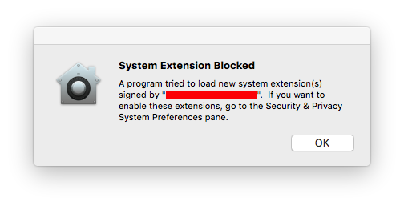
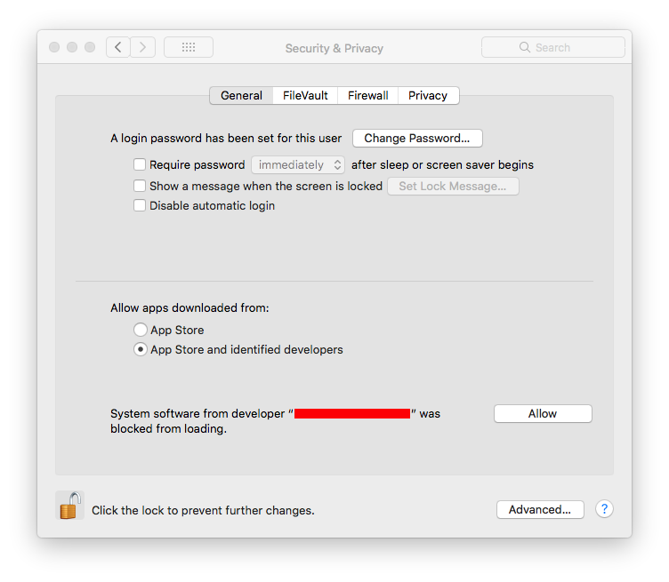

> 导航：[总目录](../../README.md) · [technotes](../../_indexes/technotes.md)

Technical Note TN2459

# User-Approved Kernel Extension Loading

macOS High Sierra 10.13 introduces a new feature that requires user approval before loading new third-party kernel extensions. This feature will require changes to some apps and installers in order to preserve the desired user experience. This technote is for developers who ship kernel extensions to users and system administrators who need to install kernel extensions.

[Introduction](#apple-f4xwc4dqnrsv64tfmyxwi33df52wszbpirkfgnbqgaytonrvhawugsbrfvke4vcbi4yq)[In-Depth Explanation](#apple-f4xwc4dqnrsv64tfmyxwi33df52wszbpirkfgnbqgaytonrvhawugsbrfvke4vcbi4za)[How This Affects KEXT Developers](#apple-f4xwc4dqnrsv64tfmyxwi33df52wszbpirkfgnbqgaytonrvhawugsbrfvke4vcbi4zq)[How This Affects Enterprise App Distribution](#apple-f4xwc4dqnrsv64tfmyxwi33df52wszbpirkfgnbqgaytonrvhawugsbrfvke4vcbi42a)[Document Revision History](#apple-f4xwc4dqnrsv64tfmyxwi33df52wszbpirkfgnbqgaytonrvhawvezlwnfzws33ojbuxg5dpoj4s2rdpnz2ey2lonncwyzlnmvxhiskel4yq)

## Introduction

macOS High Sierra 10.13 introduces a new feature that requires user approval before loading newly-installed third-party kernel extensions (KEXTs). When a request is made to load a KEXT that the user has not yet approved, the load request is denied. Apps or installers that treat a KEXT load failure as a hard error will need to be changed to handle this new case.

Approval is automatically granted to third-party KEXTs that were already present when upgrading to macOS High Sierra.

Note that approval doesn't guarantee that a KEXT is compatible and won't panic the system. The reason this feature exists is to give users more control over what KEXTs will load, which should reduce the number of panics.

[Back to Top](#)

## In-Depth Explanation

This feature enforces that only kernel extensions approved by the user will be loaded on a system. When a request is made to load a KEXT that the user has not yet approved, the load request is denied and macOS presents the alert shown in Figure 1.

__Figure 1__  Blocked kernel extension

This prompts the user to approve the KEXT in System Preferences > Security & Privacy as shown in Figure 2.

__Figure 2__  User approval to load a KEXT

This approval UI is only present in the Security & Privacy preferences pane for 30 minutes after the alert. Until the user approves the KEXT, future load attempts will cause the approval UI to reappear but will not trigger another user alert.

The alert shows the name of the developer who signed the KEXT so the user has some information to decide whether to approve the KEXT. This name comes from the Subject Common Name field of the Developer ID Application certificate used to sign the KEXT. Because of this, developers are encouraged to provide an appropriate company name when requesting KEXT signing identities.

When the user approves a KEXT, they are at the same time approving these other KEXTs signed by the same Team ID:

- If the approved KEXT is located in an application's bundle, all other KEXTs signed by the same Team ID in the same application's bundle are also approved.
- If the approved KEXT is located in the app's sub-directory inside `/Library/Application Support`, all other KEXTs signed by the same Team ID found in that same sub-directory are also approved.
- All KEXTs in `/Library/Extensions` signed by the same Team ID are also approved.

Once approved, the KEXT will immediately be loaded or added to the prelinked kernel cache, depending on what action was blocked. Subsequent requests to load the KEXT will proceed silently as on previous macOS versions.

Approved KEXTs are tracked in a system-wide policy database through the team identifier in the KEXT's code signature and the bundle identifier from the KEXT's `Info.plist`, so updating a KEXT that has already been approved will not trigger a new approval request.

[Back to Top](#)

## How This Affects KEXT Developers

Installers and applications that load kernel extensions may need to be revised to gracefully handle the kernel extension failing to load. Many products treat a KEXT loading failure as a hard failure. Some prompt the user to reinstall, some present a cryptic error message, and some simply don't function.

Starting with macOS High Sierra, installers and apps that load KEXTs should expect that KEXT loading will fail if the user hasn't approved their KEXT. Instead of treating this as an error, the user should be informed that they may need to approve the KEXT.

To determine if a KEXT has failed to load because it does not have user approval:

- If you are using `kextutil` or `kextload`, check for the exit code 27. In addition, `kextutil` will produce the error message `System policy prevents loading the kernel extension.`
- If you are using the KextManager APIs in `IOKit/kext/KextManager.h`, check for the result code `kOSKextReturnSystemPolicy`.

[Back to Top](#)

## How This Affects Enterprise App Distribution

For enterprise deployments where it is necessary to distribute software that includes kernel extensions without requiring user approval, there are two options:

- If your workflow is based on imaging, boot into Recovery OS and use the `spctl kext-consent` command. For detailed information about the `spctl` command, run the command `spctl help`. This command can either disable the user approval requirement completely or specify a list of Team IDs whose KEXTs may be loaded without user approval. The `spctl` command works in any installation environment, including Recovery OS and from NetBoot/NetInstall/NetRestore images.

  Note that the Team ID list maintained by `spctl` is separate from the system-wide policy database.
- For workflows that leverage Mobile Device Management (MDM), please see the AppleCare support article [Prepare for changes to kernel extensions in macOS High Sierra](https://support.apple.com/en-us/HT208019).

To reiterate, all third-party KEXTs that were already installed at the time of upgrading to macOS High Sierra are automatically approved and don't require any user action.

[Back to Top](#)

---

#### Document Revision History

| __Date__ | __Notes__ |
| 2018-04-19 | Updated for MDM changes in macOS 10.13.4. |
| 2017-09-08 | Updated for macOS High Sierra beta 8. |
| 2017-08-04 | Updated for macOS High Sierra beta 4. |
| 2017-07-12 | Updated for macOS High Sierra beta 3. |
| 2017-06-19 | New document that describes the user-approved kernel extension loading feature introduced in macOS High Sierra. |

