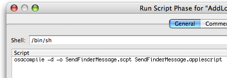

> 导航：[总目录](../../README.md) · [technotes](../../_indexes/technotes.md)


Technical Note TN2084

# Using AppleScript Scripts in Cocoa Applications

Even though your application is written in Objective-C using Cocoa, you can use AppleScript scripts to perform certain operations. This Technical Note explains how to integrate and execute AppleScripts from within your Cocoa application. It discusses how to leverage the NSAppleScript class and the use of NSAppleEventDescriptor to send data to the receiver.

__Note:__ Similar documentation on this subject for Carbon developers can be found in the technical Q&As: [QA1026 and QA1111](https://developer.apple.com/technicalqas/AppleScript/idxCarbon-date.html)

[Summary](#apple-f4xwc4dqnrsv64tfmyxwi33df52wszbpirkfgmjqgaydimbvgiwugsbrfvjukq2ujfhu4mi)[Creating an NSAppleScript](#apple-f4xwc4dqnrsv64tfmyxwi33df52wszbpirkfgmjqgaydimbvgiwugsbrfvjukq2ujfhu4mq)[Using NSAppleScript With an Embedded String](#apple-f4xwc4dqnrsv64tfmyxwi33df52wszbpirkfgmjqgaydimbvgiwugsbrfvjukq2ujfhu4my)[Using NSAppleScript With a Script Inside The App's Bundle](#apple-f4xwc4dqnrsv64tfmyxwi33df52wszbpirkfgmjqgaydimbvgiwugsbrfvjukq2ujfhu4na)[Integrating Compiled Scripts Into Your Xcode Project](#apple-f4xwc4dqnrsv64tfmyxwi33df52wszbpirkfgmjqgaydimbvgiwugsbrfvjvkqstivbviskpjy2a)[Sample Code](#apple-f4xwc4dqnrsv64tfmyxwi33df52wszbpirkfgmjqgaydimbvgiwugsbrfvjukq2ujfhu4nq)[Online Documentation](#apple-f4xwc4dqnrsv64tfmyxwi33df52wszbpirkfgmjqgaydimbvgiwugsbrfvjukq2ujfhu4ny)[Document Revision History](#apple-f4xwc4dqnrsv64tfmyxwi33df52wszbpirkfgmjqgaydimbvgiwvezlwnfzws33ojbuxg5dpoj4s2rdpnz2ey2lonncwyzlnmvxhiskel4yq)

## Summary

NSAppleScript is a great tool for interapplication communication. It is a convenient way to pass parameters to an AppleScript script running inside your application. This Technical Note shows how to use NSAppleScript to load, compile, and execute scripts, and NSAppleEventDescriptor to invoke a handler in a loaded script.

This Technical Note explains how to do the following:

- load a script from a URL or create one from an embedded `NSString`.
- execute the script and check for errors.
- obtain an `NSAppleEventDescriptor` containing the reply from an executed script or event.
- integrate an AppleScript into your Xcode project.

[Back to Top](#)

## Creating an NSAppleScript

When you create an instance of NSAppleScript object, you can use a URL to specify a script that can be in either text or compiled form:

`NSAppleScript* appleScript = [[NSAppleScript alloc] initWithContentsOfURL:url error:&errors];`

or you can supply the script as a string by using:

`NSAppleScript* appleScript = [[NSAppleScript alloc] initWithSource: (NSString *)source];`

Should an error occur when compiling or executing the script, the method `[NSAppleScript executeAndReturnError]` returns a dictionary containing error information.

[Back to Top](#)

## Using NSAppleScript With an Embedded String

Listing 1 shows how to use NSAppleScript to execute a complex script, embedded as an instance of NSString. If the script is successful, the code extracts information from the returned instance of NSAppleEventDescriptor. The executed script sets your application as a "Login Item" to the "Accounts" System Preferences.

__Listing 1__  Using NSAppleScript with an embedded string.

```objc
- (IBAction)addLoginItem:(id)sender {     NSDictionary* errorDict;     NSAppleEventDescriptor* returnDescriptor = NULL;      NSAppleScript* scriptObject = [[NSAppleScript alloc] initWithSource:                 @"\                 set app_path to path to me\n\                 tell application \"System Events\"\n\                 if \"AddLoginItem\" is not in (name of every login item) then\n\                 make login item at end with properties {hidden:false, path:app_path}\n\                 end if\n\                 end tell"];      returnDescriptor = [scriptObject executeAndReturnError: &errorDict];     [scriptObject release];      if (returnDescriptor != NULL)     {         // successful execution         if (kAENullEvent != [returnDescriptor descriptorType])         {             // script returned an AppleScript result             if (cAEList == [returnDescriptor descriptorType])             {                  // result is a list of other descriptors             }             else             {                 // coerce the result to the appropriate ObjC type             }         }      }     else     {         // no script result, handle error here     } }
```

[Back to Top](#)

## Using NSAppleScript With a Script Inside The App's Bundle

The following code in Listing 2 shows how your application can load an AppleScript script from its resources folder and send a text message to the Finder by displaying it in a dialog (the script is described below in Listing 3). It uses a series of NSAppleEventDescriptors to build the script parameters, determine the method name that's called and finally to create the AppleEvent for transmission to the Finder.

__Listing 2__  Using NSAppleScript with a script inside the app's bundle.

```objc
- (IBAction)sendFinderEvent:(id)sender {     // load the script from a resource by fetching its URL from within our bundle     NSString* path = [[NSBundle mainBundle] pathForResource:@"SendFinderMessage" ofType:@"scpt"];     if (path != nil)     {         NSURL* url = [NSURL fileURLWithPath:path];         if (url != nil)         {             NSDictionary* errors = [NSDictionary dictionary];             NSAppleScript* appleScript =                     [[NSAppleScript alloc] initWithContentsOfURL:url error:&errors];             if (appleScript != nil)             {                 // create the first parameter                 NSAppleEventDescriptor* firstParameter =                         [NSAppleEventDescriptor descriptorWithString:@"Message from my app."];                  // create and populate the list of parameters (in our case just one)                 NSAppleEventDescriptor* parameters = [NSAppleEventDescriptor listDescriptor];                 [parameters insertDescriptor:firstParameter atIndex:1];                  // create the AppleEvent target                 ProcessSerialNumber psn = {0, kCurrentProcess};                 NSAppleEventDescriptor* target =                 [NSAppleEventDescriptor                         descriptorWithDescriptorType:typeProcessSerialNumber                         bytes:&psn                         length:sizeof(ProcessSerialNumber)];                  // create an NSAppleEventDescriptor with the script's method name to call,                 // this is used for the script statement: "on show_message(user_message)"                 // Note that the routine name must be in lower case.                 NSAppleEventDescriptor* handler =                         [NSAppleEventDescriptor descriptorWithString:                         [@"show_message" lowercaseString]];                  // create the event for an AppleScript subroutine,                 // set the method name and the list of parameters                 NSAppleEventDescriptor* event =                         [NSAppleEventDescriptor appleEventWithEventClass:kASAppleScriptSuite                                 eventID:kASSubroutineEvent                                 targetDescriptor:target                                 returnID:kAutoGenerateReturnID                 transactionID:kAnyTransactionID];                 [event setParamDescriptor:handler forKeyword:keyASSubroutineName];                 [event setParamDescriptor:parameters forKeyword:keyDirectObject];                  // call the event in AppleScript                 if (![appleScript executeAppleEvent:event error:&errors]);                  {                     // report any errors from 'errors'                 }                  [appleScript release];             }             else             {                 // report any errors from 'errors'             }         }     } }
```

__Listing 3__  The Contents of SendFinderMessage.scpt

```
on show_message(user_message)     tell application "Finder"         display dialog user_message     end tell end show_message
```

__Important:__ For easier source code and project management, it is good practice to factor your AppleScript scripts as separate objects (i.e. separate compiled AppleScript files inside your app's resources folder). That way you won't need to change as much code if the scripting environment or object model for your target changes.

### Integrating Compiled Scripts Into Your Xcode Project

Since the code in Listing 2 loads the script from within your application's Resources folder, you should provide this script in your Xcode project as a "compiled script".

__Important:__ You may have noticed that Listing 3 is titled "SendFinderMessage.scpt". This is a compiled script with an extension ".scpt"; script text files are saved with ".applescript" extension. Compiled scripts are recommended for improved performance, especially if your scripts are large.

Adding your script to your Xcode project can be done two ways:

1. Compile The Script Yourself

When creating and editing your script using Script Editor you can save it in two formats: text or script. The "script" format means "compiled script". If you choose to save it as a compiled script then do the following with Xcode:

- Drag the compiled script (in our case "SendFinderMessage.scpt") to your Xcode project.
- Include the script file in the "Copy Bundle Resources" build phase.

2. Have Xcode Compile The Script

If you choose to store your script file as a "text" file, then you need Xcode to compile the script for you.

- Drag the script text file (in our case "SendFinderMessage.applescript") to your Xcode project.
- Create a new Run Script Build Phase and add the following (see example in Figure 1):

  `osacompile -d -o SendFinderMessage.scpt SendFinderMessage.applescript`
- Create a new Copy Files Build Phase and configure it to copy "SendFinderMessage.scpt" to the Resources folder.

__Figure 1__  Run Script Build Phase

[Back to Top](#)

## Sample Code

If you wish to research a more extensive example of using AppleScript scripts inside your Cocoa application using the techniques described in this Technical Note, refer to the [AttachAScript](https://developer.apple.com/samplecode/AttachAScript/) sample code project.

[Back to Top](#)

## Online Documentation

- [NSAppleScript](https://developer.apple.com/documentation/Cocoa/Reference/Foundation/Classes/NSAppleScript_Class/index.html#//apple_ref/doc/uid/TP40003618)
- [NSAppleEventDescriptor](https://developer.apple.com/documentation/Cocoa/Reference/Foundation/Classes/NSAppleEventDescriptor_Class/index.html#//apple_ref/doc/uid/TP40003616)

[Back to Top](#)

---

#### Document Revision History

| __Date__ | __Notes__ |
| 2006-09-19 | New document that explains how to work with AppleScript scripts in your Cocoa application. |

