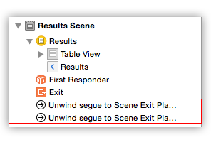

> 导航：[总目录](../../README.md) · [technotes](../../_indexes/technotes.md)


Technical Note TN2298

# Using Unwind Segues

This document provides an overview of unwind segues.

[Introduction](#apple-f4xwc4dqnrsv64tfmyxwi33df52wszbpirkfgnbqgaytgnjzgewugsbrfvke4vcbi4yq)[Creating an Unwind Segue](#apple-f4xwc4dqnrsv64tfmyxwi33df52wszbpirkfgnbqgaytgnjzgewugsbrfvke4vcbi4za)[Adding an Unwind Segue to a Storyboard](#apple-f4xwc4dqnrsv64tfmyxwi33df52wszbpirkfgnbqgaytgnjzgewugsbrfvke4vcbi4zc2qkeireu4r27ifhf6vkok5eu4rc7kncuovkfl5ke6x2bl5jvit2slfbe6qksiq)[The Unwind Process](#apple-f4xwc4dqnrsv64tfmyxwi33df52wszbpirkfgnbqgaytgnjzgewugsbrfvku4v2jjzcfauspim)[How an Unwind Segue Determines its Destination View Controller](#apple-f4xwc4dqnrsv64tfmyxwi33df52wszbpirkfgnbqgaytgnjzgewugsbrfvcekvceivjvi)[Responsibilities for Container View Controllers](#apple-f4xwc4dqnrsv64tfmyxwi33df52wszbpirkfgnbqgaytgnjzgewugsbrfvbugvsd)[Selecting a Child View Controller to Handle An Unwind Action](#apple-f4xwc4dqnrsv64tfmyxwi33df52wszbpirkfgnbqgaytgnjzgewugsbrfvbugvsdfvjuktcfinkestshl5av6q2ijfgeix2wjfcvox2dj5hfiuspjrgekus7krhv6scbjzceyrk7ifhf6vkok5eu4rc7ifbviskpjy)[Transitioning Between Two Child View Controllers](#apple-f4xwc4dqnrsv64tfmyxwi33df52wszbpirkfgnbqgaytgnjzgewugsbrfvbugvsdfvkfeqkokneviskpjzeu4r27ijcviv2fivhf6vcxj5pugscjjrcf6vsjivlv6q2pjzkfet2mjrcveuy)[Additional Resources](#apple-f4xwc4dqnrsv64tfmyxwi33df52wszbpirkfgnbqgaytgnjzgewugsbrfvauircjkreu6tsbjrpverktj5kveq2fkm)[Document Revision History](#apple-f4xwc4dqnrsv64tfmyxwi33df52wszbpirkfgnbqgaytgnjzgewvezlwnfzws33ojbuxg5dpoj4s2rdpnz2ey2lonncwyzlnmvxhiskel4yq)

## Introduction

Unwind segues give you a way to "unwind" the navigation stack back through push, modal, popover, and other types of segues. You use unwind segues to "go back" one or more steps in your navigation hierarchy. Unlike a normal segue, which create a new instance of their destination view controller and transitions to it, an unwind segue transitions to an existing view controller in your navigation hierarchy. Callbacks are provided to both the source and destination view controller before the transition begins. You can use these callbacks to pass data between the view controllers.

When you create an unwind segue in Interface Builder you do not specify a destination view controller. The unwind segue determines which view controller in your navigation hierarchy to unwind to when it is triggered at runtime. This process is customizable and additional points of customization are provided for container view controllers to participate in the unwind process. See [How an Unwind Segue Determines its Destination View Controller](#apple-f4xwc4dqnrsv64tfmyxwi33df52wszbpirkfgnbqgaytgnjzgewugsbrfvcekvceivjvi).

[Back to Top](#)

## Creating an Unwind Segue

Before you can begin adding unwind segues in Interface Builder, you must define at least one __unwind action__. An unwind action is an instance method with a `UIStoryboardSegue` as its only parameter and whose return type is `IBAction`. There are no requirements for the method name, but you should choose a name that is both unique and meaningful within the context of your entire application. Like IBActions and IBOutlets, unwind actions do not need to be declared in your class header file. The exception is if you are writing a framework and want clients of your framework to be able to create an unwind segue that targets your action.

__Listing 1__  Example definition of an unwind action.

```objc
/* Objective-C */
- (IBAction)unwindToMainMenu:(UIStoryboardSegue*)sender
{
    UIViewController *sourceViewController = sender.sourceViewController;
    // Pull any data from the view controller which initiated the unwind segue.
}

/* Swift */
@IBAction func unwindToMainMenu(sender: UIStoryboardSegue)
{
    let sourceViewController = sender.sourceViewController
    // Pull any data from the view controller which initiated the unwind segue.
}
```

When you create the unwind segue in your storyboard, you specify the name of an unwind action in the view controller you want the segue to unwind to. This unwind action is invoked just before the unwind segue is performed. You can access the `sourceViewController` of the `UIStoryboardSegue` parameter to retrieve any data from the view controller that initiated the unwind segue.

### Adding an Unwind Segue to a Storyboard

To add an unwind segue to a scene, control+drag from an object (such as a button, a table view cell, or a tab view item) in the scene to the scene's exit icon, highlighted in Figure 1. Choose an unwind action for the new segue from the popup menu.

__Figure 1__  The exit icon for a scene is the orange icon on the right.


To add an unwind segue that will only be triggered programmatically, control+drag from the scene's view controller icon to its exit icon as shown in Figure 2. Choose an unwind action for the new segue from the popup menu. You must also give the segue an identifier so that it can be referenced by your code. An unwind segue can be triggered by sending a `-performSegueWithIdentifier:sender:` message to the scene's view controller.

__Figure 2__  Creating a programmatically initiated unwind segue.


Once you have added an unwind segue, it will appear in the outline for the scene, as shown in Figure 3.

__Figure 3__  Unwind segues for each scene are displayed on the shelf.

[Back to Top](#)

## The Unwind Process

This section describes the process that occurs just after an unwind segue is initiated, either by the user interacting with a control in a scene or your code sending a `performSegueWithIdentifier:sender:` message to a view controller.

1. The unwind segue traverses your navigation hierarchy to locate the destination view controller. This step is described in detail under [How an Unwind Segue Determines its Destination View Controller](#apple-f4xwc4dqnrsv64tfmyxwi33df52wszbpirkfgnbqgaytgnjzgewugsbrfvcekvceivjvi).
2. The view controller that initiated the unwind segue is sent a `prepareForSegue:sender:` message. The default implementation does nothing. Your view controller can override this method to pass data to the destination view controller.
3. The destination view controller's unwind action is invoked.
4. The unwind segue animates the visual transition between the source and destination view controller.

Container view controllers have additional responsibilities. If you are implementing a custom container view controller, see [Responsibilities for Container View Controllers](#apple-f4xwc4dqnrsv64tfmyxwi33df52wszbpirkfgnbqgaytgnjzgewugsbrfvbugvsd) to learn how to your custom container view controller must participate in the unwind process.

### How an Unwind Segue Determines its Destination View Controller

When an unwind segue is initiated, it must first locate the nearest view controller in the navigation hierarchy which implements the unwind action specified when the unwind segue was created. This view controller becomes the destination of the unwind segue. If no suitable view controller is found, the unwind segue is aborted.

Starting from the view controller that initiated the unwind segue the search order is as follows:

1. The next view controller in the responder chain is sent a `viewControllerForUnwindSegueAction:fromViewController:withSender:` message. For a view controller presented modally, this will be the view controller that called `presentViewController:animated:completion:`. Otherwise, the `parentViewController`.

   The default implementation searches the receiver's `childViewControllers` array for a view controller that wants to handle the unwind action. If none of the receiver's child view controllers want to handle the unwind action, the receiver checks whether it wants to handle the unwind action and returns `self` if it does. In both cases, the `canPerformUnwindSegueAction:fromViewController:withSender:` method is used to determine if a given view controller wants to handle the unwind action.
2. If no view controller is returned from `viewControllerForUnwindSegueAction:fromViewController:withSender:` in step one, the search repeats from the next view controller in the responder chain.

The default implementation of `canPerformUnwindSegueAction:fromViewController:withSender:` returns `YES` if the receiver responds to the provided action. A view controller can override `canPerformUnwindSegueAction:fromViewController:withSender:` if additional granularity is required to determine whether the view controller can be the destination of an unwind segue. This may be necessary in order to remove ambiguity caused by having multiple instances of the same view controller on your navigation stack.

__Important:__ If your view controller overrides `canPerformUnwindSegueAction:fromViewController:withSender:`, your implementation should only return `YES` if the receiver wants to handle the unwind action. Do not return `YES` on behalf of a child view controller.

[Back to Top](#)

## Responsibilities for Container View Controllers

Container view controllers have two responsibilities in the unwind process, both discussed below. If you are using a container view controller provided by the SDK (`UINavigationController`, `UITabBarController`, ...) these are handled automatically.

### Selecting a Child View Controller to Handle An Unwind Action

A container view controller should implement the method shown in Listing 2 if custom logic is required to determine which of the container's child view controllers, if any, want to handle the unwind action. For example, `UINavigationController`'s implementation searches the view controllers on its navigation stack in reverse order beginning from the top. If none of the container's child view controllers want to handle the unwind action, invoke the super's implementation and return the result.

__Listing 2__  Override this method to return the child view controller that wants to handle the unwind action.

```objc
/* Objective-C */
- (UIViewController *)viewControllerForUnwindSegueAction:(SEL)action fromViewController:(UIViewController *)fromViewController withSender:(id)sender

/* Swift */
override func viewControllerForUnwindSegueAction(action: Selector, fromViewController: UIViewController, withSender sender: AnyObject?) -> UIViewController?
```

__Note:__ Always use `canPerformUnwindSegueAction:fromViewController:withSender:` to determine whether a child view controller wants to handle the unwind action.

### Transitioning Between Two Child View Controllers

Once an unwind segue has located its destination view controller, it attempts to locate an __unwind executor__ for the transition. The unwind executor is the common ancestor of both the view controller which initiated the unwind segue and the destination view controller. It is responsible for creating a `UIStoryboardSegue` which will be used to perform the visual transition between the source and destination view controllers.

When your container returns a view controller from `viewControllerForUnwindSegueAction:fromViewController:withSender:` the container becomes the unwind executor for the transition. Your container view controller must therefore implement the method shown in Listing 3 to return a `UIStoryboardSegue` that performs any animations and other steps are needed to transition from the view controller which initiated the unwind segue (`fromViewController`) to the destination view controller (`toViewController`). The returned object should be an instance of `UIStoryboardSegue` created using `segueWithIdentifier:source:destination:performHandler:` or your own subclass.

__Listing 3__  Implement this method to return a UIStoryboardSegue that transitions between fromViewController and toViewController.

```objc
/* Objective-C */
- (UIStoryboardSegue *)segueForUnwindingToViewController:(UIViewController *)toViewController fromViewController:(UIViewController *)fromViewController identifier:(NSString *)identifier

/* Swift */
override func segueForUnwindingToViewController(toViewController: UIViewController, fromViewController: UIViewController, identifier: String?) -> UIStoryboardSegue
```

__Note:__ There may be additional view controllers between the container view controller and `fromViewController`. You should not assume that `fromViewController` is an immediate child view controller of the container.

[Back to Top](#)

## Additional Resources

Unwind segues are discussed in the WWDC 2012: [Adopting Storyboards in Your App](https://developer.apple.com/videos/wwdc/2012/?id=407) session.

Examples of using unwind segues can be found in the [UnwindSegue](https://developer.apple.com/library/ios/samplecode/UnwindSegue/Introduction/Intro.html) sample code

[Back to Top](#)

---

#### Document Revision History

| __Date__ | __Notes__ |
| 2015-02-04 | Editorial changes. |
| 2013-08-13 | New document that describes using unwind segues for reverse navigation to existing view controller instances. |

