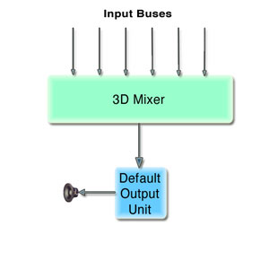
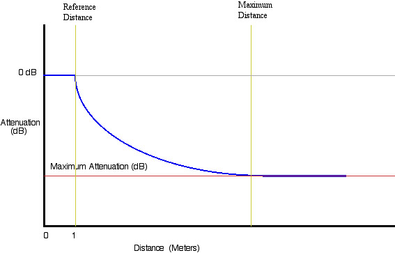

> 导航：[总目录](../../README.md) · [technotes](../../_indexes/technotes.md)


Technical Note TN2112

# Using the 3DMixer Audio Unit

This technote illustrates the usage of Core Audio's 3DMixer Audio Unit version 2.0.

The 3DMixer Audio Unit can mix audio from several different sources and then localize the sound in 3D space. This is very useful in games and in many other interactive applications that need to manage several audio sources simply and efficiently. This technote is intended for present and new users of the v2.0 3DMixer Audio Unit.

The v2.0 3DMixer Audio Unit has the ability to localize sound in 3-dimensional space, that is, position multiple sound sources by distance, elevation, and azimuth around a listener. The 3DMixer can render to multiple channel layouts (discussed below in the Speaker Configuration section). In addition, the quality of sound rendered during playback can be adjusted to meet CPU performance demands.

[Creating an AUGraph for the 3DMixer](#apple-f4xwc4dqnrsv64tfmyxwi33df52wszbpirkfgmjqgaydgmrygiwugsbrfvjukq2ujfhu4mi)[Setting the Bus count](#apple-f4xwc4dqnrsv64tfmyxwi33df52wszbpirkfgmjqgaydgmrygiwugsbrfvjukq2ujfhu4mq)[Using the Internal Reverb](#apple-f4xwc4dqnrsv64tfmyxwi33df52wszbpirkfgmjqgaydgmrygiwugsbrfvjukq2ujfhu4my)[Speaker Configurations](#apple-f4xwc4dqnrsv64tfmyxwi33df52wszbpirkfgmjqgaydgmrygiwugsbrfvjukq2ujfhu4na)[Localizing sound in 3D space](#apple-f4xwc4dqnrsv64tfmyxwi33df52wszbpirkfgmjqgaydgmrygiwugsbrfvjukq2ujfhu4ni)[Spatialization Rendering Algorithims](#apple-f4xwc4dqnrsv64tfmyxwi33df52wszbpirkfgmjqgaydgmrygiwugsbrfvjukq2ujfhu4nq)[Setting the volume](#apple-f4xwc4dqnrsv64tfmyxwi33df52wszbpirkfgmjqgaydgmrygiwugsbrfvjukq2ujfhu4ny)[Bus Stream Formats and the FormatConverterAU](#apple-f4xwc4dqnrsv64tfmyxwi33df52wszbpirkfgmjqgaydgmrygiwugsbrfvjukq2ujfhu4oa)[Connecting, Initializing & Starting the AUGraph](#apple-f4xwc4dqnrsv64tfmyxwi33df52wszbpirkfgmjqgaydgmrygiwugsbrfvjukq2ujfhu4oi)[Disposing of the AUGraph](#apple-f4xwc4dqnrsv64tfmyxwi33df52wszbpirkfgmjqgaydgmrygiwugsbrfvjukq2ujfhu4mjq)[Conclusion](#apple-f4xwc4dqnrsv64tfmyxwi33df52wszbpirkfgmjqgaydgmrygiwugsbrfvjukq2ujfhu4mjr)[References and Notes](#apple-f4xwc4dqnrsv64tfmyxwi33df52wszbpirkfgmjqgaydgmrygiwugsbrfvjukq2ujfhu4mjs)[Document Revision History](#apple-f4xwc4dqnrsv64tfmyxwi33df52wszbpirkfgmjqgaydgmrygiwvezlwnfzws33ojbuxg5dpoj4s2rdpnz2ey2lonncwyzlnmvxhiskel4yq)

## Creating an AUGraph for the 3DMixer

__Figure 1__  The 3D Mixer



3DMixers are typically inserted into an Audio Unit Graph (`AUGraph`) to help manage data flow. An `AUGraph` is a high-level representation of a set of AudioUnits, along with the connections between them. You can use the `AUGraph` APIs to construct arbitrary signal paths through which audio may be processed, i.e., a modular routing system. The APIs deal with large numbers of AudioUnits and their relationships.

The head of a graph is always an output unit, which may save the processed audio stream to disk, into memory, or as sound out. Starting a graph entails 'pulling' on the head audio unit (where data will exit the graph), which will, in turn, pull data from the connected audio units in the graph. For this technote, we will use default output audio unit as the head of the graph. The default output unit will represent the output device (speakers, in most cases) selected by the user in Audio MIDI Setup application or the System Prefrences Output Panel. For more information about using Audio Unit Graphs, please read [Using the Audio Toolbox](https://developer.apple.com/documentation/MusicAudio/Reference/CoreAudio/audio_toolbox/chapter_4_section_3.html).

To begin setting up our graph, we must add nodes for the 3DMixer and a Default Output `AudioUnit` with the method `AUGraphNewNode()`. After creating the nodes, we can open the graph and obtain the `AudioUnit` instances from the nodes within the graph by using the method `AUGraphGetNodeInfo()`.

__Listing 1__  Creating an AUGraph and adding nodes

```
void MyCreateAUGraph( AUGraph  mAUGraph,AudioUnit mOutputUnit,  AudioUnit mMixerUnit) {     AUNode mMixerNode, mOutputNode;      NewAUGraph(&mAUGraph);       ComponentDescription    mixerCD;      mixerCD.componentFlags = 0;      mixerCD.componentFlagsMask = 0;      mixerCD.componentType = kAudioUnitType_Mixer;      mixerCD.componentSubType = kAudioUnitSubType_3DMixer;      mixerCD.componentManufacturer = kAudioUnitManufacturer_Apple;       AUGraphNewNode (mAUGraph, &mixerCD, 0, NULL, &mMixerNode);       ComponentDescription    cd;     cd.componentFlags = 0;      cd.componentFlagsMask = 0;       cd.componentType = kAudioUnitType_Output;      cd.componentSubType = kAudioUnitSubType_DefaultOutput;      cd.componentManufacturer = kAudioUnitManufacturer_Apple;       AUGraphNewNode (mAUGraph, &cd, 0, NULL, &mOutputNode);        //Open the Graph      AUGraphOpen (mAUGraph);       //Get Audio Units from graph     AUGraphGetNodeInfo (mAUGraph, mMixerNode, 0, 0, 0, &mMixerUnit);     AUGraphGetNodeInfo (mAUGraph, mOutputNode, 0, 0, 0, &mOutputUnit);  }
```

Now that the graph has been created we must setup the 3DMixer appprioprately before initializing and starting the graph.

[Back to Top](#)

## Setting the Bus count

The number of inputs (or busses) of the 3Dmixer is a settable property. By default, the 3DMixer has 64 busses. Since busses incur memory usage, the bus count should not be set higher than necessary for the application's needs. Setting this property should be done prior to initializing the mixer unit.

__Listing 2__  Setting the mixer bus count

```
OSStatus    SetMixerBusCount (UInt32    inBusCount) {          UInt32  size        = sizeof(UInt32);         UInt32  busCount    = inBusCount;           return (AudioUnitSetProperty ( mMixerUnit,                              kAudioUnitProperty_BusCount,                             kAudioUnitScope_Input,                              0,                              &busCount,                             size));  }
```

[Back to Top](#)

## Using the Internal Reverb

The 3Dmixer has a built-in reverb. Once turned on, reverb is applied on a per input bus basis (as described below). Reverb is off by default and can be turned on with the `AudioUnitSetProperty()` method and the `kAudioUnitProperty_UsesInternalReverb` property, before initializing the graph.

__Listing 3__  Enabling the internal reverb

```
 UInt32        reverbSetting    = 1 // turn it on;     result = AudioUnitSetProperty(mMixerUnit,                            kAudioUnitProperty_UsesInternalReverb,                            kAudioUnitScope_Global,                            0,                           &reverbSetting,                            sizeof(reverbSetting));
```

Now that reverb has been turned ON for the 3DMixer, reverb can be enabled per bus by setting the `k3DMixerRenderingFlags_DistanceDiffusion` flag. Use the method `AudioUnitSetProperty()` and the `kAudioUnitProperty_3DMixerRenderingFlags` property to set the flag. This property can be set at anytime.

__Listing 4__  Turning reverb on for a bus

```
 UInt32    render_flags_3d;     UInt32    outSize = sizeof(render_flags_3d);      // get the current render flags for this bus     result = AudioUnitGetProperty (mMixerUnit,              kAudioUnitProperty_3DMixerRenderingFlags,              kAudioUnitScope_Input,             busIndex,              &render_flags_3d,              &outSize);      // turn on this render flag and then set the bus     render_flags_3d |= k3DMixerRenderingFlags_DistanceDiffusion;     result = AudioUnitSetProperty( mMixerUnit,              kAudioUnitProperty_3DMixerRenderingFlags,              kAudioUnitScope_Input, busIndex,               &render_flags_3d,               sizeof(render_flags_3d));
```

[Back to Top](#)

## Speaker Configurations

The v2.0 3DMixer can render audio to stereo, quad, and 5.0 channel layouts. Although the v2.0 3DMixer appropriately sets its channel layout when the output stream format is set, it is recommended that the channel layout be explicitly set. Therefore no changes are required to your code, should a future version of the mixer be released that supports multiple channel layouts that use the same number of channels (i.e. 5.1 and 6.0). When explicitly setting the channel layout be sure to pick a layout that matches the channel count of the stream format or an error will be returned (setting the channel layout to quad for example, if the stream format has 5 channels will return an error). In order to take full advantage of the mixer's ability to render to multiple channel layouts, it is necessary to determine what the user has set for the Speaker Configuration in the Audio MIDI Setup application (see example below) by querying the current device for it's output channel layout.

By querying the output unit of the graph, the following code determines an appropriate channel count to be used when setting the stream format (output scope) of the mixer.

__Note:__ Be aware that there could also be a situation when a Speaker Configuration (channel layout) has been set by the user in Audio MIDI Setup for a multi-channel hardware device. However, there may not be speakers connected to all the hardware channels (i.e. 2 speakers connected to an 8 channel device). In this case, it may be desirable to let the user specify stereo rendering, allowing the application to clamp to stereo to prevent audio data being rendered to a device channel with no speaker connected.

__Listing 5__  Determining the correct number of channels to render to

```
UInt32 GetDesiredRenderChannelCount () {     OSStatus result = noErr;      // get the HAL device id form the output AU      AudioDeviceID    deviceID;     UInt32    returnValue = 2; // return stereo by default      UInt32 outSize =  sizeof(deviceID);      //get the current device     AudioUnitGetProperty(mOutputUnit,                          kAudioOutputUnitProperty_CurrentDevice,                         kAudioUnitScope_Output,                          1,                         &deviceID,                          &outSize);      //Get the users speaker configuration     result = AudioDeviceGetPropertyInfo(deviceID,                          0,                          false,                          kAudioDevicePropertyPreferredChannelLayout,                          &outSize,                         NULL);      if (result != noErr)         return (returnValue); // return default (stereo)       AudioChannelLayout    *layout = NULL;     layout = (AudioChannelLayout *) calloc(1, outSize);     if (layout != NULL)     {         result = AudioDeviceGetProperty(deviceID,                         0,                         false,                         kAudioDevicePropertyPreferredChannelLayout,                         &outSize,                        layout);         if (layout->mChannelLayoutTag                         == kAudioChannelLayoutTag_UseChannelDescriptions)         {         // no channel layout tag is returned,                  //so walk through the channel descriptions and count                 // the channels that are associated with a speaker         if (layout->mNumberChannelDescriptions == 2)         {                  returnValue = 2; // there is no channel info for stereo         }         else         {             returnValue = 0;             for (UInt32 i = 0; i < layout->mNumberChannelDescriptions; i++)             {                 if (layout->mChannelDescriptions[i].mChannelLabel !=                                              kAudioChannelLabel_Unknown)                      returnValue++;                 }             }         }         else         {             switch (layout->mChannelLayoutTag)             {                 case kAudioChannelLayoutTag_AudioUnit_5_0:                 case kAudioChannelLayoutTag_AudioUnit_5_1:                 case kAudioChannelLayoutTag_AudioUnit_6:                     returnValue = 5;                     break;                 case kAudioChannelLayoutTag_AudioUnit_4:                     returnValue = 4;                 default:                     returnValue = 2;             }         }          free(layout);     }   return returnValue; }
```

__Important:__ The mixer's output stream format must be set before connecting it to the output unit. After connecting the mixer to the output unit, the channel layout must be explicitly set to match the input scope layout of the output unit.

__Listing 6__  Configuring the AUGraph For Channel Layout

```
void ConfigureGraphForChannelLayout() {     OSStatus    result = noErr;      // get the channel count that should be set         // for the mixer's output stream format     mCurrentMixerChannelCount = GetDesiredRenderChannelCount();      // set the stream format     CAStreamBasicDescription format; //CoreAudio SDK class     UInt32 outSize = sizeof(format);     result = AudioUnitGetProperty(mOutputUnit,                                 kAudioUnitProperty_StreamFormat,                                kAudioUnitScope_Output,                                0,                                 &format,                                &outSize);          // not interleaved     format.SetCanonical (mCurrentMixerChannelCount, false);      format.mSampleRate = mMixerOutputRate;     outSize = sizeof(format);     result = AudioUnitSetProperty (mOutputUnit,                                kAudioUnitProperty_StreamFormat,                                 kAudioUnitScope_Input,                                 0,                                 &format,                                 outSize);      result = AudioUnitSetProperty (mMixerUnit,                                 kAudioUnitProperty_StreamFormat,                                 kAudioUnitScope_Output,                                 0,                                 &format,                                 outSize);      return; }
```

[Back to Top](#)

## Localizing sound in 3D space

Setting the distance, elevation and azimuth of a bus causes the listener to perceive the audio from a specific point in a 3-dimensional space.

The pitch and gain of the audio sources can be changed per bus within the 3DMixer. The pitch can be changed by modifying the value of the parameter `k3DMixerParam_PlaybackRate`. The gain can be changed by modifying the value of the parameter `k3DMixerParam_Gain` (example shown in "Setting the Volume").

__Note:__ The gain referred to here is for scaling the volume of the actual audio data. All spatial attenuation of the audio is done by setting the distance parameter on the mixer bus.

__Table 1__  3-Dimensional Parameters (Location)

| Direction | Unit | Range |
| Azimuth | Degrees | -180 to 180 |
| Elevation | Degrees | -90 to 90 |
| Distance | Meters | 0 to 10000 |

__Table 2__  3-Dimensional Parameters ( Volume and Pitch)

| Direction | Unit | Range |
| Gain | dB | -120 to 20 |
| Playback Rate (Pitch) | rate | 0.5 to 4.0 |

__Listing 7__  Setting the distance and azimuth

```
void    SetObjectCoordinates(UInt32     inMixerInputBus, Float32, inAzimuth, Float32 inDistance) {     AudioUnitSetParameter(mMixerUnit,                                              k3DMixerParam_Azimuth,                                              kAudioUnitScope_Input,                                              inMixerInputBus,                                              inAzimuth,                                              0);      AudioUnitSetParameter(mMixerUnit,                                             k3DMixerParam_Distance,                                              kAudioUnitScope_Input,                                             inMixerInputBus,                                              inDistance,                                              0); }
```

Starting with the v2.0 3DMixer, it is possible to have the mixer do all the work necessary to clamp the bus volume based on specified ReferenceDistance, MaximumDistance and Attenuation settings. This feature allows an application to specify how close/far away an object in 3D space can actually get to/from the listener. The following method demonstrates how to properly set/get a mixer bus's DistanceParams with the `AudioUnitSetProperty()` method and the `kAudioUnitProperty_3DMixerDistanceParams` property.

__Listing 8__  Mixer Distance Parameters struct defined in AudioUnitProperties.h

```c
typedef struct MixerDistanceParams {     Float32            mReferenceDistance;     Float32            mMaxDistance;     Float32            mMaxAttenuation; // in decibels } MixerDistanceParams;
```

__Figure 2__  Distance Parameters Graph



__Listing 9__  Setting the Distance Parameters for a bus

```
void    SetDistanceParamsForBus (UInt32     inMixerInputBus) {           MixerDistanceParams    distanceParams;      // Get the desired minimum distance an object      // can get to the listener (float value in meters)     // The mixer will play audio on the bus with 0db      // of attenuation (no attenuation) for all distance coordinates     // between 0.0 and this reference distance. This      //value must be less than the maximum distance setting.     distanceParams.mReferenceDistance = GetMyMinimumDistance();      // Get the desired maximum distance an object      // can get from the listener (float value in meters)     // The mixer will stop attenuating audio on the bus      // for all distance coordinates at this maximum      // distance or greater. This value must be greater      // than the reference distance setting.     distanceParams.mMaxDistance = GetMyMaximumDistance();      // Get desired attenuation (in db) for an object when it's      // coordinates are at or beyond the maximum distance      // (positive float value in dB).     // The mixer will not attenuate the audio further than      // this db setting when the distance coordinates are beyond the      // maximum distance setting.       distanceParams.mMaxAttenuation = GetMyMinimumAttenuation();      OSStatus result = AudioUnitSetProperty(mMixerUnit,                                  kAudioUnitProperty_3DMixerDistanceParams,                                 kAudioUnitScope_Input,                                 inMixerInputBus,                                  &distanceParams,                                  sizeof(distanceParams));   }
```

[Back to Top](#)

## Spatialization Rendering Algorithims

Spatialization settings are on a per bus (mixer input) basis and set with `AudioUnitSetProperty()` method and the `kAudioUnitProperty_SpatializationAlgorithm` constant. The type of the spatialization rendering used is determined by factors such as source audio channels (mono/stereo), output hardware channels (stereo, multichannel), and cpu capability. Setting a bus spatialization algorithm may also change some of the bus rendering flags (`kAudioUnitProperty_3DMixerRenderingFlags`) so it is recommended to reset any desired render flags after setting the spatialization algorithm.

__Table 3__  Spatailization Algorithims appropriate for Stereo Output (from AudioUnitProperies.h)

| Algorithims | Description | Output |
| kSpatializationAlgorithm_StereoPassThrough | StereoPassThrough should be used when no localization is desired for stereo source data. Setting this algorithm tells the mixer to take stereo input and pass it directly to channels 1 & 2 (Front L/R if rendering is for multichannel) without localization. | Stereo , Multi-Channel |
| kSpatializationAlgorithm_EqualPowerPanning | EqualPowerPanning merely pans the data of the mixer bus into a stereo field. This algorithm is analogous to the pan knob found on a mixing board channel strip. When this algorithm is used while the mixer is rendering to multichannel hardware audio data will only be rendered to channels 1 & 2 (Front L/R). | Stereo |
| kSpatializationAlgorithm_HRTF | HRTF (Head Related Transfer Function) is a high quality algorithm using filtering to emulate 3 dimensional space in headphones or stereo speakers. If turned on while rendering to multi channel hardware, HRTF will render the input data only to channels 1 & 2 (Front L/R). HRTF is a cpu intensive algorithm. | Stereo |
| kSpatializationAlgorithm_SphericalHead | Like HRTF, the SpericalHead algorithm is designed to emulate 3 dimensional space in headphones or stereo speakers. Using simplified algorithms, SpericalHead provides a lesser quality rendering experience than HRTF and is slightly less cpu intensive. | Stereo |
| kSpatializationAlgorithm_VectorBasedPanning | VectorBasedPanning pans data from the bus, based on it's location in 3 dimensional space, between two channels of the multichannel rendering (i.e. between channels 3 & 4 for a quad rendering if the location of the data was directly behind the listener). When this algorithm is used while the mixer is rendering to stereo hardware, it effectively becomes EqualPowerPanning (see EqualPowerPanning for more info.) This algorithm does not pan moving sources as smoothly as the Sound Field (kSpatializationAlgorithm_SoundField) algorithm and is better suited for localizing fixed sources. | Multi-Channel |
| kSpatializationAlgorithm_SoundField (Ambisonics) | SoundField is designed for rendering to multi channel hardware. The mixer takes data being rendered with SoundField and distributes it amongst all the output channels with a weighting toward the location in which the sound derives. It is very effective for ambient sounds, which may derive from a specific location in space, yet should be heard through the listener's entire space. | Multi-Channel |

__Listing 10__  Setting the 3DMixer to a Spatialization Algorithims

```
SetSpatializationAlgorithm( UInt32 BusNumber) {           UInt32 spatialSetting = GetMySpatializationSetting();             result = AudioUnitSetProperty(mMixerUnit,                               kAudioUnitProperty_SpatializationAlgorithm,                               kAudioUnitScope_Input,                              BusNumber,                              &spatialSetting,                              sizeof(spatialSetting)); }
```

[Back to Top](#)

## Setting the volume

The volume can be explicitly set for each bus on the input scope of the 3DMixer, providing a gain before the sound is mixed. Use the `k3DMixerParam_Gain` constant and `AudioUnitSetParameter()` method to set the volume of each mixer bus (input scope). The parameter is a float value representing dB (see below).

__Listing 11__  Setting the volume on input

```
// busGain represents a range of 0.0 to 1.0 (full volume)  SetInputBusGain(UInt32 mCurrentPlayBus, Float32 busGain) {    Float32    db = 20.0 * log10(busGain); // convert to db    if (db < -120.0)       db = -120.0; // clamp minimum audible level at -120db     AudioUnitSetParameter(mMixerUnit,                                         k3DMixerParam_Gain,                                        kAudioUnitScope_Input,                                        mCurrentPlayBus,                                         db,                                         0); }
```

[Back to Top](#)

## Bus Stream Formats and the FormatConverterAU

If a `FormatConverterAU` is supplying the data to the mixer bus, then the stream format on the input scope of the mixer is automatically set when the nodes are connected. However, if the data is being supplied to the mixer directly in the render proc of the bus, it is necessary to properly set the stream format on the input scope of a mixer's bus before 'pulling' for data.

__Note:__ When setting the stream format of a mixer's bus, remember that the mixer expects to receive stereo data as de-interleaved.

[Back to Top](#)

## Connecting, Initializing & Starting the AUGraph

Setup is now complete and we can connect the 3DMixer to the default output audio unit. When all connections are made and nodes are setup up correctly, you must initialize the `AUGraph`. The graph is now complete and the 3Dmixer is ready for use. A call to `AUGraphStart` will start processing the audio data.

__Listing 12__  Connecting, Initializing & Starting the AUGraph

```
 AUGraphConnectNodeInput (mAUGraph, mMixerNode, 0, mOutputNode, 0);         AUGraphInitialize (mAUGraph);         AUGraphStart(mAUGraph);
```

[Back to Top](#)

## Disposing of the AUGraph

The method `AUGraphStop` will stop all rendering throughout a graph. `DisposeAUGraph` will deallocate the graph.

__Listing 13__  Stopping and disposing the graph

```
 AUGraphStop (mAUGraph);          DisposeAUGraph (mAUGraph);         mAUGraph = 0;
```

[Back to Top](#)

## Conclusion

CoreAudio's 3DMixer is very a useful audio tool. The mixers ability to handle audio from multiple sources and localize the sounds in 3D space is a necessity in games and can be amazing in countless other applications.

[Back to Top](#)

## References and Notes

[Core Audio Preliminary doc](https://developer.apple.com/documentation/MusicAudio/Reference/CoreAudio/index.html)

[Back to Top](#)

---

#### Document Revision History

| __Date__ | __Notes__ |
| 2004-06-14 | Updated Reference Library Location |
| 2004-05-26 | New document that discusses how to use Core Audio's 3DMixer version 2.0 |

