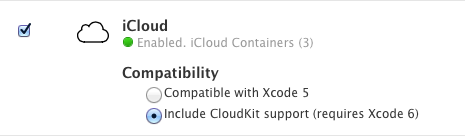

> 导航：[总目录](../../README.md) · [technotes](../../_indexes/technotes.md)

Technical Note TN2351

# Using the iCloud App ID Service Settings with Xcode 5 and Xcode 6

Starting with Xcode 6, there is a new change in the Developer Portal covering the use of iCloud service usage with a developer's App ID. This TechNote describes how to use the iCloud App ID Service Settings when upgrading from Xcode 5 to Xcode 6.

[Introduction](#apple-f4xwc4dqnrsv64tfmyxwi33df52wszbpirkfgnbqgaytiojzgawugsbrfvke4vcbi4yq)[Finding the iCloud Service Setting](#apple-f4xwc4dqnrsv64tfmyxwi33df52wszbpirkfgnbqgaytiojzgawugsbrfvke4vcbi4za)[Adjusting the Settings](#apple-f4xwc4dqnrsv64tfmyxwi33df52wszbpirkfgnbqgaytiojzgawugsbrfvke4vcbi4zq)[Document Revision History](#apple-f4xwc4dqnrsv64tfmyxwi33df52wszbpirkfgnbqgaytiojzgawvezlwnfzws33ojbuxg5dpoj4s2rdpnz2ey2lonncwyzlnmvxhiskel4yq)

## Introduction

Development teams that use iCloud services in their apps should be aware of the relationship between their iCloud compatibility settings and various versions of Xcode.

[Back to Top](#)

## Finding the iCloud Service Setting

The iCloud Setting in Certificates, Identifiers & Profiles:

- Sign in to Certificates, Identifiers & Profiles on the Apple Developer website.
- Click the “Identifiers” link for the platform for which you are developing.
- If this app uses iCloud services, iCloud should be listed as Enabled. Click the Edit button.
- You’ll see an editable list of app services, including iCloud.

__Figure 1__  iCloud Service Settings (example)

[Back to Top](#)

## Adjusting the Settings

- If you select “Compatible with Xcode 5”, iCloud services will only work with Xcode 5, which does not include additional CloudKit functionality.
- If you select “Include CloudKit support (requires Xcode 6)”, you must use Xcode 6 and will have the option to use CloudKit in addition to regular iCloud services. You’ll get the latest entitlements for all iCloud services that are compatible with Xcode 6.

Enabling iCloud from a particular version of Xcode will automatically enable it for the right compatibility. If you are using entitlements specific for Xcode 6, you must select “Include CloudKit support (requires Xcode 6)”.

__Important:__ To ensure that new profile requests coming from Xcode always result in a compatible profile, Xcode can cause this compatibility flag to change based on the Xcode version you are using. When Xcode 5 requests a new or regenerated provisioning profile for an iCloud-enabled App ID, the App ID's compatibility flag will automatically use the old iCloud setting, then generate the requested profiles using that setting. In the process, all existing profiles attached to that App ID will become invalid. When Xcode 6 requests a new or regenerated provisioning profile for an iCloud-enabled App ID, the App ID's compatibility flag will be automatically set to use the new CloudKit setting, and then generate the requested profiles using that setting. In the process, all existing profiles attached to that App ID will become invalid.

All team members members should use the same version of Xcode. If a team has developers using both Xcode 5 and Xcode 6, this flag can be flipped back and forth repeatedly, causing the associated profiles to become invalid every time.

[Back to Top](#)

---

#### Document Revision History

| __Date__ | __Notes__ |
| 2014-09-29 | New document that describes how to use the iCloud App ID Service Settings between Xcode 5 and Xcode 6. |

