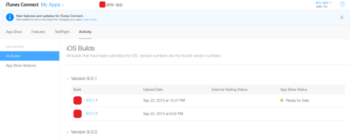
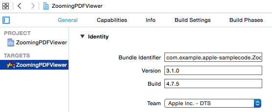
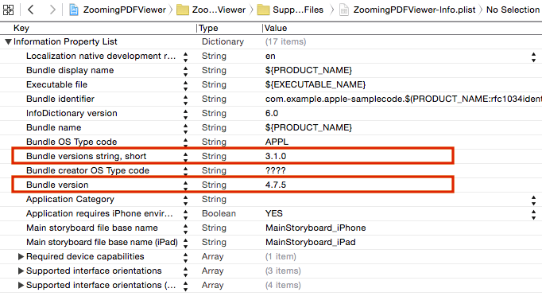
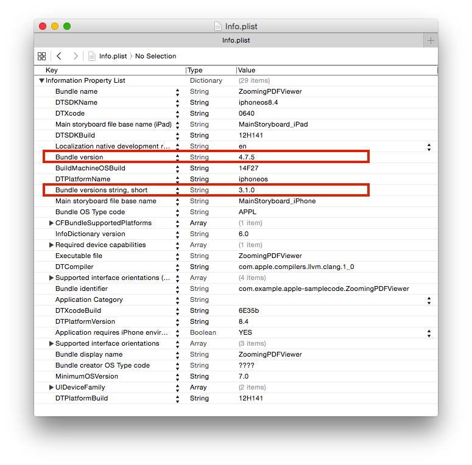
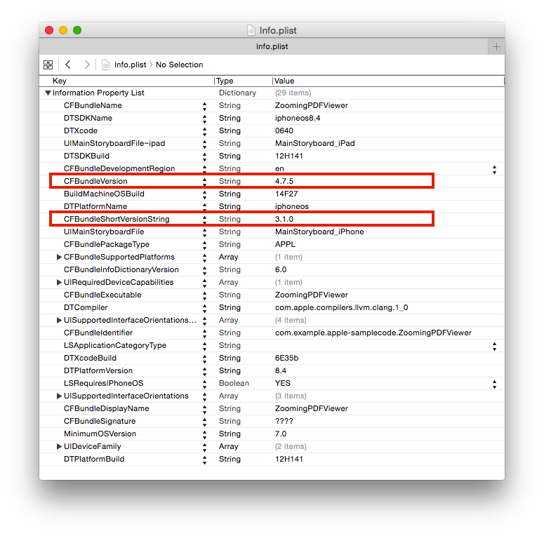

> 导航：[总目录](../../README.md) · [technotes](../../_indexes/technotes.md)


Technical Note TN2420

# Version Numbers and Build Numbers

This document talks about version numbers and build numbers, their proper usage, and how they apply to App Store submissions.

[Introduction](#apple-f4xwc4dqnrsv64tfmyxwi33df52wszbpirkfgnbqgaytmnrqgmwugsbrfveu4vcsj5cfkq2ujfhu4)[Definitions](#apple-f4xwc4dqnrsv64tfmyxwi33df52wszbpirkfgnbqgaytmnrqgmwugsbrfvcekrsjjzeviskpjzjq)[Checking previous version numbers in iTunes Connect](#apple-f4xwc4dqnrsv64tfmyxwi33df52wszbpirkfgnbqgaytmnrqgmwugsbrfvbuqrkdjneu4r27kbjekvsjj5kvgx2wivjfgskpjzpu4vknijcveu27jfhf6skukvheku27inhu4tsfinka)[Where these numbers appear in Xcode and in your app](#apple-f4xwc4dqnrsv64tfmyxwi33df52wszbpirkfgnbqgaytmnrqgmwugsbrfvluqrksivpviscfkncv6tsvjvbekustl5avaucfifjf6skol5megt2eivpuctsel5eu4x2zj5kvex2bkbia)[In each Xcode target's General tab](#apple-f4xwc4dqnrsv64tfmyxwi33df52wszbpirkfgnbqgaytmnrqgmwugsbrfvluqrksivpviscfkncv6tsvjvbekustl5avaucfifjf6skol5megt2eivpuctsel5eu4x2zj5kvex2bkbic2skol5cucq2il5megt2eivpviqksi5cvix2tl5duktsfkjauyx2uifba)[In your sources in the target's .plist file](#apple-f4xwc4dqnrsv64tfmyxwi33df52wszbpirkfgnbqgaytmnrqgmwugsbrfvluqrksivpviscfkncv6tsvjvbekustl5avaucfifjf6skol5megt2eivpuctsel5eu4x2zj5kvex2bkbic2skol5mu6vksl5ju6vksincvgx2jjzpviscfl5kecushivkf6u27l5ieysktkrpumskmiu)[In the Info.plist file in your app](#apple-f4xwc4dqnrsv64tfmyxwi33df52wszbpirkfgnbqgaytmnrqgmwugsbrfvluqrksivpviscfkncv6tsvjvbekustl5avaucfifjf6skol5megt2eivpuctsel5eu4x2zj5kvex2bkbic2skol5keqrk7jfhemt27kbgesu2ul5destcfl5eu4x2zj5kvex2bkbia)[Two naming conventions for version numbers and build numbers](#apple-f4xwc4dqnrsv64tfmyxwi33df52wszbpirkfgnbqgaytmnrqgmwugsbrfvkfot27jzau2skoi5pugt2okzcu4vcjj5hfgx2gj5jf6vsfkjjust2ol5hfktkcivjfgx2bjzcf6qsvjfgeix2okvguerkskm)[How these numbers work together](#apple-f4xwc4dqnrsv64tfmyxwi33df52wszbpirkfgnbqgaytmnrqgmwugsbrfvee6v27kreeku2fl5hfktkcivjfgx2xj5jewx2uj5dukvciivja)[Numbering Conventions](#apple-f4xwc4dqnrsv64tfmyxwi33df52wszbpirkfgnbqgaytmnrqgmwugsbrfvhfktkcivjestshl5bu6tswivhfiskpjzjq)[Examples](#apple-f4xwc4dqnrsv64tfmyxwi33df52wszbpirkfgnbqgaytmnrqgmwugsbrfvhfktkcivjestshl5bu6tswivhfiskpjzjs2rkyifgvatcfkm)[Version number and build number checklist](#apple-f4xwc4dqnrsv64tfmyxwi33df52wszbpirkfgnbqgaytmnrqgmwugsbrfvlekustjfhu4x2okvguerksl5au4rc7ijkustcel5hfktkcivjf6q2iivbuwtcjknka)[WatchKit Apps and App Extensions](#apple-f4xwc4dqnrsv64tfmyxwi33df52wszbpirkfgnbqgaytmnrqgmwugsbrfvlucvcdjbfusvc7ififau27ifheix2bkbif6rkykrcu4u2jj5hfg)[Automatic Management](#apple-f4xwc4dqnrsv64tfmyxwi33df52wszbpirkfgnbqgaytmnrqgmwugsbrfvavkvcpjvaviskdl5guctsbi5cu2rkokq)[Document Revision History](#apple-f4xwc4dqnrsv64tfmyxwi33df52wszbpirkfgnbqgaytmnrqgmwvezlwnfzws33ojbuxg5dpoj4s2rdpnz2ey2lonncwyzlnmvxhiskel4yq)

## Introduction

Version and the build numbers work together to uniquely identify a particular App Store submission for an app. The conventions for how these numbers work together are verified by automatic processes when you submit your app to the App Store, so understanding how these numbers work and how they are intended to be used will help you save time when submitting your app. The following details how these numbers work and the various places that they appear in your Xcode projects.

[Back to Top](#)

## Definitions

For each new version of your app, you will provide a version number to differentiate it from previous versions. The version number works like a name for each release of your app. For example, version 1.0.0 may name the first release, version 2.0.1 will name the second, and so on. When submitting a new release of your app to the App Store, it is normal to have some false starts. You may forget an icon in one build, or perhaps there is a problem in another build. As a result, you may produce many builds during the process of submitting a new release of your app to the App Store. Because these builds will be for the same release of your app, they will all have the same version number. But, each of these builds must have a unique build number associated with it so it can be differentiated from the other builds you have submitted for the release. The collection of all of the builds submitted for a particular version is referred to as the 'release train' for that version.

[Back to Top](#)

## Checking previous version numbers in iTunes Connect

When planning a new release of your app you will need to invent a new version number that has not already been used that is sequentially larger than any previous version numbers. To find out what version numbers have already been used, you can log into iTunes Connect and navigate to 'My Apps' > Select app > 'Activity'. There, you will see a list of all of the previous submissions and their version numbers that looks similar to Figure 1.

__Figure 1__  Previous submissions for an app as shown in iTunes Connect.



As shown in Figure 1, the list provided displays all of the version numbers and the build numbers that have been used in previous submissions for the selected app.

[Back to Top](#)

## Where these numbers appear in Xcode and in your app

There are three main places to look for the version number and build number. For the most part, you will only need to set these values in the general tab in your target's build settings in your Xcode project, but it is useful to know the other places where these values appear for troubleshooting purposes.

### In each Xcode target's General tab

The version number and the build number are displayed as shown in Figure 2 in the general tab for each of the targets in your Xcode project. Normally, this is the only place where you should edit and change these values.

__Figure 2__  Screenshot showing the build and version fields Xcode.



### In your sources in the target's .plist file

The version number and the build number are also displayed in your app's .plist file as the "bundle versions string, short" and the "Bundle version". The key "bundle versions string, short" is paired with the version number and the key "Bundle version" is paired with the build number.

__Figure 3__  Screenshot showing a plist file displayed in Xcode.



__Note:__ Though these values are displayed in your app's .plist in Xcode, you should use the fields in the target's general tab for adjusting these values - the .plist file that appears in your project sources is an input file and many of the values displayed there, including the version number and the build number, are automatically replaced by Xcode when your app is built.

### In the Info.plist file in your app

After your app has been built, you can look inside of your app's bundle and open the app's Info.plist file to inspect the values. Figure 4 shows an Info.plist file from a built app (Note that the Xcode substitution strings visible in Figure 3 have been replaced with their final values).

__Figure 4__  Version and build numbers in an Info.plist file from a built app in human readable format.

[Back to Top](#)

## Two naming conventions for version numbers and build numbers

Note that the names or key values displayed in Figure 4 are displayed in their human readable format. If you right-click (or click while holding the control key) in the display you can select "Show Raw Keys/Values" from the popup menu to see the machine-readable versions of these keys. For example, Figure 5 below shows the Raw Keys/Values view for the Info.plist file shown in Figure 4:

__Figure 5__  Version and build numbers in an Info.plist file from a built app in Raw Key/Value format.



Note that the version number is saved with the key `CFBundleShortVersionString` and the build number is associated with the key `CFBundleVersion`. You will find the version number (`CFBundleShortVersionString`) and build number (`CFBundleVersion`) described in many different places in the documentation and referred to using these key values. In this document, we will continue to refer to these values as the version number and the build number.

[Back to Top](#)

## How these numbers work together

The version number and the build number values work together to uniquely identify the build and release for a particular App Store submission. For each new version of your app, you will provide a new unique version number and you may provide one or more builds (or submissions) each with a different and unique build number together with that same version number. All version numbers used in an app must be unique. You cannot re-use version numbers. Also, as you create new releases, new version numbers must be added in ascending sequential order.

Build numbers provide a way to name each of the submissions you provide for a particular release. As described in the definitions above, the collection of all of the builds that you provide for a particular version of your app is called that version's 'release train'. For iOS apps, build numbers must be unique within each release train, but they do not need to be unique across different release trains. That is to say, for iOS Apps you can use the same build numbers again in different release trains if you want to. However, for macOS apps, build numbers must monotonically increase even across different versions. In other words, for macOS apps you cannot use the same build numbers again in different release trains. And, as you create and submit new builds for any release, the build numbers you assign to them must be in ascending sequential order.

__Important:__ For macOS apps, build numbers must monotonically increase even across different versions. In other words, for macOS apps you cannot use the same build numbers again in different release trains. iOS apps have no such restriction and you can re-use the same build numbers again in different release trains.

It is normal to use the same version number many times over and over again with different Build Numbers when uploading submissions for a particular release of your app.

[Back to Top](#)

## Numbering Conventions

The following definitions have been copied over from the developer documentation where the Info.plist keys are defined. These definitions describe the numbering conventions used and how the version number and build number values are interpreted:

### Examples

The value for a version number or build number must consist only of '.'s and numbers and must begin and end with a number. Each integer value separated by a period is a component of the version. Version numbers and build numbers may have up to three components separated by periods. The total number of characters in your version number or in your build number cannot exceed eighteen characters.

Legal examples:

```
1
1.1
1.1.1
1.10000
1.10000.1
```

Illegal examples:

```
a
1.a
1.
.1
a.1
1.10000.1.5
```

[Back to Top](#)

## Version number and build number checklist

Here are some things you can check when submitting a new build to the App Store. Making sure you have your version number and build number set properly will help you by avoiding having your app automatically rejected for having them improperly configured.

1. For each new version of your app, you need to invent a new version number. This number should be a greater value than the last Version Number that you used. Though you may provide many builds for any particular release of your App, you only need to use one new Version Number for each new release of your App.
2. You cannot re-use version numbers.
3. For every new build you submit, you will need to invent a new build number whose value is greater than the last build number you used (for that same version). For iOS apps, you may re-use build numbers when submitting different versions. For macOS apps, you must chose a new build number for every submission that is unique and has never been used before in any submission you have provided to the App Store (including build numbers used in previous versions of your app).
4. For iOS apps you can re-use build numbers in different release trains, but you cannot re-use build numbers within the same release train. For macOS apps, you cannot re-use build numbers in any release train.

Here is a sample error message you may receive if you try to submit an App without properly configuring the build number:

```
Invalid Pre-Release Build - The build version (CFBundleVersion) '1.6095' in the Info.plist file must be higher than the build version (CFBundleVersion) '1.6096' of the latest build within train version (CFBundleShortVersionString) '1.0.4'.
```

[Back to Top](#)

## WatchKit Apps and App Extensions

App Extensions and their containing apps must use the same build number (`CFBundleVersion`) and version number (`CFBundleShortVersionString`) as used in the other targets in the Xcode project.

[Back to Top](#)

## Automatic Management

It is possible to set up your Xcode project so that it will automatically manage your version and build numbers for you. For more information about how to do that see [Technical Q&A QA1827: Automating Version and Build Numbers Using agvtool](https://developer.apple.com/library/ios/qa/qa1827/_index.html).

[Back to Top](#)

---

#### Document Revision History

| __Date__ | __Notes__ |
| 2017-06-15 | Made corrections in formatting so examples are displayed properly |
| 2017-03-14 | Updated the the document to describe special provisions for macOS version numbers and build numbers. |
| 2015-12-02 | Clarified the special case of version numbers when used with extensions. |
| 2015-10-27 | Reorganized and clarified the special case of build numbers when used with extensions. |
| 2015-10-08 | New document that talks about the Version Numbers and Build Numbers used in App Store submissions. |

