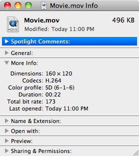

> 导航：[总目录](../../README.md) · [technotes](../../_indexes/technotes.md)


Technical Note TN2227

# Video Color Management in AV Foundation and QTKit

This technote discusses the video color management provided by AV Foundation and QTKit on OS X Lion and Mac OS X v10.6 and how to take advantage of it in your application.

[Introduction](#apple-f4xwc4dqnrsv64tfmyxwi33df52wszbpirkfgnbqgaytcmztguwugsbrfveu4vcsj5cfkq2ujfhu4)[GPU Accelerated, Color Managed Video Pipeline](#apple-f4xwc4dqnrsv64tfmyxwi33df52wszbpirkfgnbqgaytcmztguwugsbrfvdvavk7ifbugrkmivjecvcfirpv6q2pjrhvex2nifhecr2firpvmskeivhv6ucjkbcuyskoiu)['nclc' : A Structured Way to Tag Video Color](#apple-f4xwc4dqnrsv64tfmyxwi33df52wszbpirkfgnbqgaytcmztguwugsbrfvhegtcd)[Working with the 'nclc' tag](#apple-f4xwc4dqnrsv64tfmyxwi33df52wszbpirkfgnbqgaytcmztguwugsbrfvlu6usljfheox2xjfkeqx2ujbcv6x2oingegx27krauo)[Finder 'Get Info' Command shows Color Profiles](#apple-f4xwc4dqnrsv64tfmyxwi33df52wszbpirkfgnbqgaytcmztguwugsbrfvlu6usljfheox2xjfkeqx2ujbcv6x2oingegx27krauolkgjfheirksl5puorkul5eu4rspl5pugt2njvau4rc7knee6v2tl5bu6tcpkjpvauspizeuyrkt)[Add Color Profile Automator Action Makes it Easy to Tag Video Content](#apple-f4xwc4dqnrsv64tfmyxwi33df52wszbpirkfgnbqgaytcmztguwugsbrfvlu6usljfheox2xjfkeqx2ujbcv6x2oingegx27krauolkbircf6q2pjrhvex2qkjhumskmivpucvkuj5gucvcpkjpucq2ujfhu4x2niffuku27jfkf6rkbknmv6vcpl5kecr27kzeuirkpl5bu6tsuivhfi)[How to Programmatically Tag Media with the 'nclc' Tag](#apple-f4xwc4dqnrsv64tfmyxwi33df52wszbpirkfgnbqgaytcmztguwugsbrfvkecr2zj5kveq2pjzkektsu)[Media Creation & Editing](#apple-f4xwc4dqnrsv64tfmyxwi33df52wszbpirkfgnbqgaytcmztguwugsbrfvkecr2zj5kveq2pjzkektsufvgukrcjifpugusfifkest2ol5pv6rkejfkestsh)[Working With Core Image](#apple-f4xwc4dqnrsv64tfmyxwi33df52wszbpirkfgnbqgaytcmztguwugsbrfvkecr2zj5kveq2pjzkektsufvlu6usljfheox2xjfkeqx2dj5jekx2jjvauori)[Capture from Camera](#apple-f4xwc4dqnrsv64tfmyxwi33df52wszbpirkfgnbqgaytcmztguwugsbrfvkecr2zj5kveq2pjzkektsufvbucucukvjekx2gkjhu2x2difgukusb)[Conclusion](#apple-f4xwc4dqnrsv64tfmyxwi33df52wszbpirkfgnbqgaytcmztguwugsbrfvbu6tsdjrkvgskpjy)[Document Revision History](#apple-f4xwc4dqnrsv64tfmyxwi33df52wszbpirkfgnbqgaytcmztguwvezlwnfzws33ojbuxg5dpoj4s2rdpnz2ey2lonncwyzlnmvxhiskel4yq)

## Introduction

QuickTime X provides powerful services for manipulating time-based media, allowing you to add audio and video playback, capture, and encoding capabilities to your application. It offers optimized support for modern codecs, delivers more efficient media playback, and includes a GPU accelerated, color managed video pipeline, all accessible from AV Foundation and QTKit.

[Back to Top](#)

## GPU Accelerated, Color Managed Video Pipeline

Both AV Foundation and QTKit automatically apply color management to video during playback. Using the values stored in the display profile of your Mac, ColorSync creates a color transform that provides a perceptual match between a known broadcast video color space and the specific chromaticity and gamma characteristics of your display. This color transformation is applied to each frame by the GPU as it is played back on screen.

In addition, the AV Foundation framework automatically applies color management to video on both input and output. On input, it will ensure that media is decoded to a pixel buffer that is correctly tagged with a color space describing it. On output, it will perform any necessary color conversion from the colorspace of the source content to that requested of the output.

__Note:__ Broadcast standards-based video is intended to be viewed in a dimly lit viewing environment such as a living room. The color management applied during playback lessens the contrast to preserve the correct tonality when video is viewed in brighter viewing conditions.

[Back to Top](#)

## 'nclc' : A Structured Way to Tag Video Color

For historic reasons, there are many permutations of broadcast video color spaces. Consequently, it is necessary for the author to ensure that QuickTime files are tagged with the appropriate color information describing how the content was authored.

QuickTime movies support the ‘`nclc`’ color tagging mechanism that defines three key video parameters:

- Primaries
- Transfer Function
- Conversion Matrix

These parameters are used by ColorSync to generate one of the following video color spaces:

- HD (Rec. 709)
- SD (SMPTE-C)
- SD (PAL)

Here are the most common examples of '`nclc`' tags and the equivalent `AVVideoColorPropertiesKey` key constants (see Listing 1):

__Table 1__  Common '`nclc`' tags and the equivalent `AVVideoColorPropertiesKey` key constants.

| 'nclc' parameters | Video Signal Format | AVVideoColorPropertiesKey key constants for AVVideoColorPrimariesKey, AVVideoTransferFunctionKey, AVVideoYCbCrMatrixKey |
| 1-1-1 | HD (Rec. 709) | AVVideoColorPrimaries_ITU_R_709_2, AVVideoTransferFunction_ITU_R_709_2, AVVideoYCbCrMatrix_ITU_R_709_2 |
| 6-1-6 | SD (SMPTE-C) | AVVideoColorPrimaries_SMPTE_C, AVVideoTransferFunction_ITU_R_709_2, AVVideoYCbCrMatrix_ITU_R_601_4 |
| 5-1-6 | SD (PAL) | AVVideoColorPrimaries_EBU_3213, AVVideoTransferFunction_ITU_R_709_2, AVVideoYCbCrMatrix_ITU_R_601_4 |

The '`nclc`' tag is part of the `'colr'` image description extension. For detailed information about the '`nclc`' tag and the `'colr'` image description extension, see [QuickTime - Letters to the Ice Floe Dispatch 19, Uncompressed Y'CbCr Video in QuickTime Files](https://developer.apple.com/quicktime/icefloe/dispatch019.html).

__Important:__ Media without a ‘`nclc`’ tag will be color managed by QuickTime X as if it were created in the SMPTE-C color space.

[Back to Top](#)

## Working with the 'nclc' tag

### Finder 'Get Info' Command shows Color Profiles

It is possible to show the color profile for a media file using the Finder Get Info command. Simply select a file in the Finder, then choose File -> Get Info. In the "More Info:" section you will see the color profile information.

__Figure 1__  Finder Get Info Command shows Color Profile Information.



### Add Color Profile Automator Action Makes it Easy to Tag Video Content

There is an Add Color Profile Automator Action that can add an ‘`nclc`’ color tag to existing QuickTime movies.

__Note:__ You can add, but not remove a tag using this Automator Action.

__Figure 2__  The Add Color Profile Automator Action.


You can use the Add Color Profile Automator Action to create an Automator Workflow to add an ‘`nclc`’ color tag to existing QuickTime movies.

__Important:__ The Add Color Profile Automator Action should only be run from within the Automator application.

It is very easy to setup an Automator Workflow using Automator. That is especially important for old content that is untagged, content that is coming from an external source, or anything else that is incorrectly tagged.

For information on using the Automator application to create an Automator Workflow, choose Help in Automator or Help > Mac Help in the Finder and search for “Automator”. For information on creating Automator actions, see [Automator Programming Guide](https://developer.apple.com/documentation/AppleApplications/Conceptual/AutomatorConcepts/index.html#//apple_ref/doc/uid/TP40001450) and [Automator Framework Reference](https://developer.apple.com/documentation/AppleApplications/Reference/AutomatorReference/index.html#//apple_ref/doc/uid/TP40001452).

[Back to Top](#)

## How to Programmatically Tag Media with the 'nclc' Tag

### Media Creation & Editing

When working with AV Foundation, the `AVAssetWriter` object is used to write or transcode media data to a new file of a specified audiovisual container type. You should always explicitly specify the desired output colorspace using the `AVVideoColorPropertiesKey` dictionary. AV Foundation will automatically provide a color-match converting every pixel from the source color space to the destination color space.

__Important:__ Underspecifying the conversion, such as providing an untagged source buffer, may result in a run-time error. Providing a color space that the codec does not accept may also generate an error.

Here's code to specify the video color space when writing media with `AVAssetWriter`:

__Listing 1__  Specifying the video color space when writing media with `AVAssetWriter`.

```objc
#import <Foundation/Foundation.h>
#import <AVFoundation/AVFoundation.h>

NSMutableDictionary *compressionSettings = NULL;
compressionSettings = [NSMutableDictionary dictionary];

/*

Specify the HD output color space for the video color properties
key (AVVideoColorPropertiesKey). During export, AV Foundation
will perform a color match from the input color space to the HD
output color space.

(If you require SD colorimetry, use AVVideoColorPrimaries_SMPTE_C,
AVVideoTransferFunction_ITU_R_709_2, and AVVideoYCbCrMatrix_ITU_R_601_4.)

 */
[compressionSettings setObject:AVVideoColorPrimaries_ITU_R_709_2
          forKey:AVVideoColorPrimariesKey];
[compressionSettings setObject:AVVideoTransferFunction_ITU_R_709_2
          forKey:AVVideoTransferFunctionKey];
[compressionSettings setObject:AVVideoYCbCrMatrix_ITU_R_709_2
          forKey:AVVideoYCbCrMatrixKey];

/* Create settings for encoding the media. */
NSDictionary* videoOutputSettings = [NSDictionary dictionaryWithObjectsAndKeys:AVVideoCodecH264, AVVideoCodecKey,
                                     AVVideoScalingModeResize, AVVideoScalingModeKey,
                                     [NSNumber numberWithInt:1280], AVVideoWidthKey,
                                     [NSNumber numberWithInt:720], AVVideoHeightKey,
                                     compressionSettings, AVVideoColorPropertiesKey,
                                     nil];
/* Create new input to receive sample buffers for writing to the output file. */
AVAssetWriterInput* videoInput = [AVAssetWriterInput assetWriterInputWithMediaType:AVMediaTypeVideo outputSettings:videoOutputSettings];

AVAssetWriter *assetWriter = <#Your AVAssetWriter object#>;
[assetWriter addInput:videoInput];
/* ...begin writing your media */
BOOL success = [assetWriter startWriting];
...
```

An `AVAssetExportSession` object can also be used to write or transcode media data to create a new file of the type described by one of the exporter presets. For example, you can create a movie for use on the iPod, iPhone or Apple TV. To create a movie for use on one of these devices, specify the desired device exporter using the available export presets (`AVAssetExportPresetAppleM4VAppleTV`, `AVAssetExportPresetAppleM4ViPod`, and so on). See the [AVAssetExportSession Class Reference](https://developer.apple.com/library/mac/#documentation/AVFoundation/Reference/AVAssetExportSession_Class/Reference/Reference.html) for more information. See also the [Sample Code 'avexporter'](https://developer.apple.com/samplecode/avexporter/index.html) and [Sample Code 'avmetadataeditor'](https://developer.apple.com/samplecode/avmetadataeditor/index.html) for an example of how to use the `AVAssetExportSession` class.

These exporters all perform a colorimetrically correct export when converting between different color spaces. This means if there's a color space conversion, the video is properly tagged with the '`nclc`' tag.

When working with QTKit, you can use the QTKit `writeToFile`: `withAttributes`: method to export a QTMovie object for use on iPod, iPhone or Apple TV. The QTKit exporters for iPod, iPhone or Apple TV all perform a colorimetrically correct export when converting between HD and SD (in either direction). This means if there's a color space conversion not only is the appropriate transformation used, but the video is properly tagged as well.

For example, if you have Rec. 709 HD source content that you would like to export to Apple TV, the Apple TV exporter's color management will preserve your source correctly -- no conversion is necessary. Similarly, if you export that same source content to iPod or iPhone, a conversion from HD to SD is performed and the color values are adjusted accordingly.

__Important:__ When exporting HD content to SD (or vice versa), not only is the content scaled as appropriate, but a colormatch is also performed from HD's rec.709 colorspace to SD's rec.601.

See [Technical Note TN2188 Exporting Movies for iPod, Apple TV and iPhone](https://developer.apple.com/technotes/tn2007/tn2188.html) Listing 4 for a code snippet showing how to use QTKit to export to iPhone.

### Working With Core Image

When using Core Image along with QuickTime and Visual Contexts you can also set the output color space for the [CIContext](https://developer.apple.com/documentation/GraphicsImaging/Reference/QuartzCoreFramework/Classes/CIContext_Class/Reference/Reference.html) using the [kCIContextOutputColorSpace](https://developer.apple.com/documentation/GraphicsImaging/Reference/QuartzCoreFramework/Classes/CIContext_Class/Reference/Reference.html#//apple_ref/c/data/kCIContextOutputColorSpace) key. Core Image will then perform any required color-matching between the colorspace specified by the pixel buffer's [CGColorspace](https://developer.apple.com/library/mac/#documentation/GraphicsImaging/Reference/CGColorSpace/Reference/reference.html) and the [kCIContextOutputColorSpace](https://developer.apple.com/documentation/GraphicsImaging/Reference/QuartzCoreFramework/Classes/CIContext_Class/Reference/Reference.html#//apple_ref/c/data/kCIContextOutputColorSpace) key (and working colorspace, too).

### Capture from Camera

Currently, when you capture from the screen with AV Foundation there is an automatic color conversion to the HD color space. If you capture from the camera, the camera driver assigns a color tag to the captured frames that describes the color space of the camera.

If you use the `AVCaptureMovieFileOutput` method to save frames captured from the screen to a file, these will be automatically tagged with a HD color profile, and frames captured from the camera will be tagged by the camera driver with a color profile that describes the color space of the camera.

The QTKit Capture architecture will query the camera to determine what color space it is using, and make sure that the '`nclc`' information is used all the way through the capture pipeline. This ensures that previews to the display are correct, as well as any compression and export operations using the device exporters, with the resulting movie tagged appropriately.

[Back to Top](#)

## Conclusion

The AV Foundation and QTKit frameworks automatically apply color management to video during playback. To ensure that the appropriate color management is applied, you must tag your content. The new Automator action makes it easy to tag existing QuickTime movies. You can also use AV Foundation to programmatically tag your content when writing or transcoding media to a file, or QTKit when using the device exporters. In addition, you can specify a color tag when using Core Image with QuickTime and visual contexts.

[Back to Top](#)

---

#### Document Revision History

| __Date__ | __Notes__ |
| 2011-11-02 | New document that describes Video Color Management in AV Foundation and QTKit. |

