> 导航：[总目录](../../README.md) · [technotes](../../_indexes/technotes.md)


# Retired Document

__Important:__
This document may not represent best practices for current development. Links to downloads and other resources may no longer be valid.

Technical Note TN2250

# iOS Code Signing Troubleshooting

__Important:__ This document may not represent best practices for current development. Links to downloads and other resources may no longer be valid.

This document aids in troubleshooting problems relating to iOS code signing, or issues encountered while performing any of the common tasks involving code signing. This guide is intended to supplement the Tools Workflow Guide for iOS, so start there first if you are new to iOS development.

[Code Signing in a nutshell](#apple-f4xwc4dqnrsv64tfmyxwi33df52wszbpirkfgnbqgaydsojtgmwugsbrfvbu6rcfl5jusr2ojfheox2jjzpucx2okvkfgscfjrga)[Signing Certificates](#apple-f4xwc4dqnrsv64tfmyxwi33df52wszbpirkfgnbqgaydsojtgmwugsbrfvbu6rcfl5jusr2ojfheox2jjzpucx2okvkfgscfjrgc2u2ji5hestshl5bukusujfdesq2bkrcvg)[Provisioning Profiles](#apple-f4xwc4dqnrsv64tfmyxwi33df52wszbpirkfgnbqgaydsojtgmwugsbrfvbu6rcfl5jusr2ojfheox2jjzpucx2okvkfgscfjrgc2ucsj5lesu2jj5hestshl5ifet2gjfgekuy)[Common Tasks Involving Code Signing](#apple-f4xwc4dqnrsv64tfmyxwi33df52wszbpirkfgnbqgaydsojtgmwugsbrfvbu6tknj5hf6vcbknfvgx2jjzle6tcwjfheox2dj5cekx2tjfdu4skoi4)[Requirements for Code Signing](#apple-f4xwc4dqnrsv64tfmyxwi33df52wszbpirkfgnbqgaydsojtgmwugsbrfvjekukvjfjektkfjzkfgx2gj5jf6q2pircv6u2ji5hestsh)[Add your iOS Device to your Team Devices List](#apple-f4xwc4dqnrsv64tfmyxwi33df52wszbpirkfgnbqgaydsojtgmwugsbrfvke4vcbi44q)[Create your signing certificates](#apple-f4xwc4dqnrsv64tfmyxwi33df52wszbpirkfgnbqgaydsojtgmwugsbrfvke4vcbi4zde)[Provisioning Profile Refresh](#apple-f4xwc4dqnrsv64tfmyxwi33df52wszbpirkfgnbqgaydsojtgmwugsbrfvke4vcbi4za)[Create your Provisioning Profiles](#apple-f4xwc4dqnrsv64tfmyxwi33df52wszbpirkfgnbqgaydsojtgmwugsbrfvke4vcbi4zdg)[Cases Where Custom Provisioning Profiles are Required](#apple-f4xwc4dqnrsv64tfmyxwi33df52wszbpirkfgnbqgaydsojtgmwugsbrfvke4vcbi4yti)[Keep Your Profile Library Clean](#apple-f4xwc4dqnrsv64tfmyxwi33df52wszbpirkfgnbqgaydsojtgmwugsbrfvke4vcbi4ytk)[Transferring Your Identities](#apple-f4xwc4dqnrsv64tfmyxwi33df52wszbpirkfgnbqgaydsojtgmwugsbrfvke4vcbi4zdi)[Verify Keychain configuration](#apple-f4xwc4dqnrsv64tfmyxwi33df52wszbpirkfgnbqgaydsojtgmwugsbrfvke4vcbi4ytq)[Verify Your Signing Certificates](#apple-f4xwc4dqnrsv64tfmyxwi33df52wszbpirkfgnbqgaydsojtgmwugsbrfvke4vcbi4ytm)[Verify Your Private Keys](#apple-f4xwc4dqnrsv64tfmyxwi33df52wszbpirkfgnbqgaydsojtgmwugsbrfvke4vcbi4yto)[Verify Xcode Project configuration](#apple-f4xwc4dqnrsv64tfmyxwi33df52wszbpirkfgnbqgaydsojtgmwugsbrfvlekusjizmv6wcdj5cekx2qkjhuurkdkrpugt2oizeuovksifkest2o)[Verify Base SDK](#apple-f4xwc4dqnrsv64tfmyxwi33df52wszbpirkfgnbqgaydsojtgmwugsbrfvke4vcbi4ytc)[Verify the iOS Deployment Target](#apple-f4xwc4dqnrsv64tfmyxwi33df52wszbpirkfgnbqgaydsojtgmwugsbrfvke4vcbi4yta)[Verify the Target Architectures](#apple-f4xwc4dqnrsv64tfmyxwi33df52wszbpirkfgnbqgaydsojtgmwugsbrfvke4vcbi43da)[Verify the Device Type Setting](#apple-f4xwc4dqnrsv64tfmyxwi33df52wszbpirkfgnbqgaydsojtgmwugsbrfvke4vcbi43tc)[Verify Building for a Device (not Simulator)](#apple-f4xwc4dqnrsv64tfmyxwi33df52wszbpirkfgnbqgaydsojtgmwugsbrfvlekusjizmv6wcdj5cekx2qkjhuurkdkrpugt2oizeuovksifkest2ofvlekusjizmv6qsvjfgeiskoi5pumt2sl5av6rcfkzeugrk7l5he6vc7kneu2vkmifke6us7)[Defining a Bundle Identifier in Xcode that is compatible with your App ID](#apple-f4xwc4dqnrsv64tfmyxwi33df52wszbpirkfgnbqgaydsojtgmwugsbrfvke4vcbi42q)[Assigning Provisioning Profiles to Build Configurations](#apple-f4xwc4dqnrsv64tfmyxwi33df52wszbpirkfgnbqgaydsojtgmwugsbrfvke4vcbi43q)[Perform Common Tasks](#apple-f4xwc4dqnrsv64tfmyxwi33df52wszbpirkfgnbqgaydsojtgmwugsbrfvke4vcbi4zto)[Steps to run your app on device thru Xcode](#apple-f4xwc4dqnrsv64tfmyxwi33df52wszbpirkfgnbqgaydsojtgmwugsbrfvke4vcbi4zda)[Steps to Test Your Submission Build with Ad Hoc distribution](#apple-f4xwc4dqnrsv64tfmyxwi33df52wszbpirkfgnbqgaydsojtgmwugsbrfvke4vcbi4zta)[Steps to submit your app to the App Store](#apple-f4xwc4dqnrsv64tfmyxwi33df52wszbpirkfgnbqgaydsojtgmwugsbrfvke4vcbi4ytg)[Creating an Application Archive](#apple-f4xwc4dqnrsv64tfmyxwi33df52wszbpirkfgnbqgaydsojtgmwugsbrfvke4vcbi4yte)[Steps to create an Enterprise build for In-House distribution](#apple-f4xwc4dqnrsv64tfmyxwi33df52wszbpirkfgnbqgaydsojtgmwugsbrfvke4vcbi4ztm)[Troubleshooting FAQ](#apple-f4xwc4dqnrsv64tfmyxwi33df52wszbpirkfgnbqgaydsojtgmwugsbrfvke4vcbi43ta)[Configuration Troubleshooting](#apple-f4xwc4dqnrsv64tfmyxwi33df52wszbpirkfgnbqgaydsojtgmwugsbrfvke4vcbi42da)[How do I delete/revoke my certificates and start over fresh?](#apple-f4xwc4dqnrsv64tfmyxwi33df52wszbpirkfgnbqgaydsojtgmwugsbrfvke4vcbi43a)[What does 'Valid Signing Identity Not Found' mean and how do I resolve it?](#apple-f4xwc4dqnrsv64tfmyxwi33df52wszbpirkfgnbqgaydsojtgmwugsbrfvke4vcbi42dalkxjbavix2ej5cvgx27kzauyskel5jusr2ojfheox2jircu4vcjkrmv6tspkrpumt2vjzcf6x2nivau4x2bjzcf6scpk5puit27jfpverktj5gfmrk7jfkf6)[What do I do if I can't see or select my Provisioning Profile in Xcode Build Settings?](#apple-f4xwc4dqnrsv64tfmyxwi33df52wszbpirkfgnbqgaydsojtgmwugsbrfvke4vcbi42dalkxjbavix2ej5pusx2ej5pusrs7jfpugqkol5kf6u2fivpu6us7kncuyrkdkrpu2wk7kbje6vsjkneu6tsjjzdv6ucsj5destcfl5eu4x2yinhuirk7ijkustcel5jukvcujfheou27)[Code Signing Entitlement related issues](#apple-f4xwc4dqnrsv64tfmyxwi33df52wszbpirkfgnbqgaydsojtgmwugsbrfvke4vcbi4ztc)[I'm defining a custom Code Signing Entitlements file in Xcode but do I need it?](#apple-f4xwc4dqnrsv64tfmyxwi33df52wszbpirkfgnbqgaydsojtgmwugsbrfvke4vcbi43dc)[Entitlement related error messages](#apple-f4xwc4dqnrsv64tfmyxwi33df52wszbpirkfgnbqgaydsojtgmwugsbrfvke4vcbi43dm)[How do I enable or disable iCloud?](#apple-f4xwc4dqnrsv64tfmyxwi33df52wszbpirkfgnbqgaydsojtgmwugsbrfvke4vcbi43de)[How do I check the entitlements associated to my Provisioning Profile?](#apple-f4xwc4dqnrsv64tfmyxwi33df52wszbpirkfgnbqgaydsojtgmwugsbrfvke4vcbi43dk)[How do I check which devices are associated to my Provisioning Profile?](#apple-f4xwc4dqnrsv64tfmyxwi33df52wszbpirkfgnbqgaydsojtgmwugsbrfvke4vcbi42di)[How do I confirm my Provisioning Profile is for App Store distribution?](#apple-f4xwc4dqnrsv64tfmyxwi33df52wszbpirkfgnbqgaydsojtgmwugsbrfvke4vcbi4ztk)[How do I login to Xcode with a different team member?](#apple-f4xwc4dqnrsv64tfmyxwi33df52wszbpirkfgnbqgaydsojtgmwugsbrfvke4vcbi43do)[Build Troubleshooting](#apple-f4xwc4dqnrsv64tfmyxwi33df52wszbpirkfgnbqgaydsojtgmwugsbrfvke4vcbi42dc)[How do I resolve the error: Application failed codesign verification?](#apple-f4xwc4dqnrsv64tfmyxwi33df52wszbpirkfgnbqgaydsojtgmwugsbrfvke4vcbi4zte)[What does this signature verification failure reason mean, and how do I resolve it?](#apple-f4xwc4dqnrsv64tfmyxwi33df52wszbpirkfgnbqgaydsojtgmwugsbrfvke4vcbi4zts)[How do I check if my application's signature has been corrupted?](#apple-f4xwc4dqnrsv64tfmyxwi33df52wszbpirkfgnbqgaydsojtgmwugsbrfvke4vcbi4ztq)[How do I check which certificate was used to sign my app?](#apple-f4xwc4dqnrsv64tfmyxwi33df52wszbpirkfgnbqgaydsojtgmwugsbrfvke4vcbi44a)[How do I check the entitlements on my Application's Signature?](#apple-f4xwc4dqnrsv64tfmyxwi33df52wszbpirkfgnbqgaydsojtgmwugsbrfvke4vcbi4ztg)[How do I locate the .app file signed for distribution from within an application archive?](#apple-f4xwc4dqnrsv64tfmyxwi33df52wszbpirkfgnbqgaydsojtgmwugsbrfvke4vcbi43dq)[How do I resolve the CodeSign error: Code signing is required?](#apple-f4xwc4dqnrsv64tfmyxwi33df52wszbpirkfgnbqgaydsojtgmwugsbrfvke4vcbi43ds)[How do I resolve the CodeSign error: CSSMERR_TP_NOT_TRUSTED?](#apple-f4xwc4dqnrsv64tfmyxwi33df52wszbpirkfgnbqgaydsojtgmwugsbrfvke4vcbi4yts)[How do I resolve the CodeSign error: Provisioning profile can't be found?](#apple-f4xwc4dqnrsv64tfmyxwi33df52wszbpirkfgnbqgaydsojtgmwugsbrfvke4vcbi42dclkij5lv6rcpl5ev6usfknhuyvsfl5keqrk7inhuirktjfdu4x2fkjje6us7l5ifet2wjfjust2ojfheox2qkjhumskmivpugqkol5kf6qsfl5de6vkoirpq)[How do I resolve the CodeSign error: Certificate identity appears more than once in the keychain?](#apple-f4xwc4dqnrsv64tfmyxwi33df52wszbpirkfgnbqgaydsojtgmwugsbrfvke4vcbi4zq)[How do I resolve the CodeSign error: iPhone Developer: or iPhone Distribution: ambiguous matches?](#apple-f4xwc4dqnrsv64tfmyxwi33df52wszbpirkfgnbqgaydsojtgmwugsbrfvke4vcbi42dclkij5lv6rcpl5ev6usfknhuyvsfl5keqrk7inhuirktjfdu4x2fkjje6us7l5evascpjzcv6rcfkzcuyt2qivjf6x2pkjpusucij5hekx2ejfjviusjijkviskpjzpv6qknijeuovkpkvjv6tkbkrbuqrktl4)[How do I resolve the CodeSign error: The identity 'iPhone Developer' doesn't match any valid, non-expired certificate/private key pair in the default keychain](#apple-f4xwc4dqnrsv64tfmyxwi33df52wszbpirkfgnbqgaydsojtgmwugsbrfvke4vcbi42dclkij5lv6rcpl5ev6usfknhuyvsfl5keqrk7inhuirktjfdu4x2fkjje6us7l5keqrk7jfcektsujfkfsx27jfieqt2oivpuirkwivge6ucfkjpv6rcpivju4x2ul5gucvcdjbpuctszl5lectcjirpv6tspjzpukwcqjfjekrc7incvevcjizeugqkuivpvausjkzavirk7jncvsx2qifevex2jjzpviscfl5cekrsbkvgfix2livmugscbjfha)[How do I resolve the CodeSign error: The identity 'iPhone Distribution' doesn't match any valid, non-expired certificate/private key pair in the default keychain](#apple-f4xwc4dqnrsv64tfmyxwi33df52wszbpirkfgnbqgaydsojtgmwugsbrfvke4vcbi42dclkij5lv6rcpl5ev6usfknhuyvsfl5keqrk7inhuirktjfdu4x2fkjje6us7l5keqrk7jfcektsujfkfsx27jfieqt2oivpuisktkrjesqsvkreu6ts7l5ce6rktjzpvix2nifkegsc7ifhfsx2wifgesrc7l5he6ts7ivmfasksivcf6q2fkjkesrsjinavirk7kbjesvsbkrcv6s2flfpvaqkjkjpusts7kreekx2eivdecvkmkrpuwrkzineecsko)[Code Sign error: No unexpired provisioning profiles found that contain any of the keychain's signing certificates](#apple-f4xwc4dqnrsv64tfmyxwi33df52wszbpirkfgnbqgaydsojtgmwugsbrfvke4vcbi42dclkdj5cekx2tjfdu4x2fkjje6us7l5he6x2vjzcvqucjkjcuix2qkjhvmsktjfhu4skoi5pvauspizeuyrktl5de6vkoirpviscbkrpugt2okrausts7ifhfsx2pizpviscfl5fukwkdjbausts7knpvgskhjzeu4r27incvevcjizeugqkuivjq)[Run Troubleshooting](#apple-f4xwc4dqnrsv64tfmyxwi33df52wszbpirkfgnbqgaydsojtgmwugsbrfvke4vcbi43dg)[Archiving Troubleshooting](#apple-f4xwc4dqnrsv64tfmyxwi33df52wszbpirkfgnbqgaydsojtgmwugsbrfvke4vcbi42dm)[Validation Troubleshooting](#apple-f4xwc4dqnrsv64tfmyxwi33df52wszbpirkfgnbqgaydsojtgmwugsbrfvke4vcbi42dk)[Installation Troubleshooting](#apple-f4xwc4dqnrsv64tfmyxwi33df52wszbpirkfgnbqgaydsojtgmwugsbrfvke4vcbi42de)[Requirements for app installation](#apple-f4xwc4dqnrsv64tfmyxwi33df52wszbpirkfgnbqgaydsojtgmwugsbrfvke4vcbi43di)[Check the Console Logging for an installation failure root cause](#apple-f4xwc4dqnrsv64tfmyxwi33df52wszbpirkfgnbqgaydsojtgmwugsbrfvke4vcbi42delkdjbcugs27kreekx2dj5hfgt2mivpuyt2hi5eu4r27izhvex2bjzpuststkrauytcbkreu6ts7izaustcvkjcv6uspj5kf6q2bkvjuk)[What does this installation failure root cause mean and how do I resolve it?](#apple-f4xwc4dqnrsv64tfmyxwi33df52wszbpirkfgnbqgaydsojtgmwugsbrfvke4vcbi42dg)[Document Revision History](#apple-f4xwc4dqnrsv64tfmyxwi33df52wszbpirkfgnbqgaydsojtgmwvezlwnfzws33ojbuxg5dpoj4s2rdpnz2ey2lonncwyzlnmvxhiskel4yq)

## Code Signing in a nutshell

Code Signing is the process by which your compiled iOS application is sealed and identified as yours. The following sections describe the two major players in code signing: signing certificates and Provisioning Profiles.

### Signing Certificates

Signing certificates (also referred to as Code Signing Certificates) are issued to each team member of the iOS developer program and they must be properly installed to perform the following development related tasks. The certificate named "iPhone Developer" allows you to run/debug your app on iOS devices through Xcode, and the certificate named "iPhone Distribution" allows testing your submission build with Ad Hoc distribution, submitting your app to the App Store, or creating an Enterprise build for in-house distribution.

Steps within this guide show how to create the iOS certificates, verify they are correctly installed, or transfer them to another machine if you choose to. A Certificate and its Private Key together can be referred to as 'identity' or 'Code Signing Identity'.

__Note:__ Only team admin and agent roles have access to create or manage the iPhone Distribution certificate on the iOS Portal site.

### Provisioning Profiles

Provisioning Profiles work with your signing certificates to enable certain tasks for your app. For example, depending on which profile you choose when code signing your app, it determines whether your app can be run and debugged on your device thru Xcode, submitted to the app store for distribution, or sent to testers through Ad Hoc distribution. Different profiles are needed in each case, and you are responsible for creating them and configuring your Xcode project to use the right ones in each situation. The steps in this guide show you how and when to use provisioning profiles, and to verify they are correctly installed.

__Note:__ Once you have a healthy working code signing configuration set up it is recommended that you follow the steps in section [Transferring Your Identities](#apple-f4xwc4dqnrsv64tfmyxwi33df52wszbpirkfgnbqgaydsojtgmwugsbrfvke4vcbi4zdi) to create a backup of them. This backup can be used to restore your working code signing configuration from hardware failure, or to enable code signing on additional Macs, partitions, or OS X user accounts of your choice.

[Back to Top](#)

## Common Tasks Involving Code Signing

A healthy working code signing configuration is required to perform the following iOS development related tasks:

```
 1) Running Your App on Device Thru Xcode
 2) Testing Your Submission Build with Ad Hoc distribution
 3) Submitting Your App to the App Store
 4) Creating and Installing an Enterprise build for In-House distribution
```

__Figure 1__  Process flowchart highlighting in red the common tasks involving code signing.

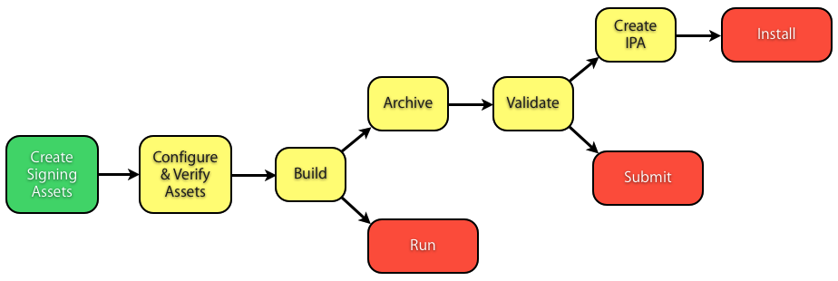

The recommended procedures for these common tasks are below, but before engaging these tasks use the following sections to verify your Xcode Project and Keychain satisfy the requirements for code signing.

[Back to Top](#)

## Requirements for Code Signing

### Add your iOS Device to your Team Devices List

Before you can debug/run your application on your development device through Xcode, your development device must be added to your Team Devices List on the iOS Provisioning Portal. The following steps describe leveraging Xcode to do this for you.

A) If you are a team "Agent" or "Admin" within your developer program, follow these steps: choose the Xcode "Window" menu > Organizer, and click the Devices tab. Right-click the target device under the "DEVICES" section of the left-sidebar, and choose "Add Device to Provisioning Portal". If prompted, enter your developer program credentials into the popup, and click OK.

B) If you are not a team "Agent" or "Admin", follow these steps: choose the Xcode "Window" menu > Organizer, and click the Devices tab. Select the target device under the "DEVICES" section of the left-sidebar. Select and copy to the clipboard the 40-digit hexadecimal "Identifier" string and send that to your team agent or admins and ask that they add it to the "Devices" section of the provisioning portal.

Once your device has beed added to the provisioning portal, perform the steps in section [Provisioning Profile Refresh](#apple-f4xwc4dqnrsv64tfmyxwi33df52wszbpirkfgnbqgaydsojtgmwugsbrfvke4vcbi4za) to allow Xcode to update, download and install your Team Provisioning Profile that includes the newly added Development Device.

### Create your signing certificates

Use Xcode's [Provisioning Profile Refresh](#apple-f4xwc4dqnrsv64tfmyxwi33df52wszbpirkfgnbqgaydsojtgmwugsbrfvke4vcbi4za) feature to automatically create your signing certificates on your behalf. Every iOS Developer Program team member gets an iPhone Developer certificate. Only the team Agent gets an iPhone Distribution certificate.

### Provisioning Profile Refresh

Xcode's Provisioning Profile Refresh feature (also referred to as Automatic Device Provisioning) automates setting you up to run apps on iOS devices thru Xcode in basic development situations. It is useful to know the individual tasks being performed by this feature in the event you wish to utilize those tasks individually. The tasks are:

```
1) Prompts to create and install your "iPhone Developer" certificate if one doesn't already exist in the iOS Portal

2) (for admin or agent roles) prompts to create and install your "iPhone Distribution" certificate if one doesn't already exist in the iOS Portal

3) Creates a Wildcard App ID if one does not already exist in the iOS Portal

4) Creates, or updates with new devices added to the portal, your iOS Team Provisioning Profile and installs that into your profile library

5) Syncs the profile library on your local machine with the profiles on the iOS Portal
```

To invoke Provisioning Profile Refresh, open Xcode's "Window" menu > Organizer > Devices tab > "Provisioning Profile" sidebar under Library and click the Refresh button. The first time refresh is pressed, a prompt appears requesting your team member credentials. It is important to answer positively when asked to create your signing certificates if they are needed. To do that, click "Submit Request" when you are prompted and Xcode will create, download and install the certificate(s).

Additionally, if an iOS development device is connected to your machine while the Refresh button is clicked, Xcode will install the updated iOS Team Provisioning Profile onto your device. The result of invoking Provisioning Profile Refresh should be a quick setup to enable running your app on device through Xcode in basic development situations. To learn more about "non-basic" development situations, see the section titled [Cases Where Custom Provisioning Profiles are Required](#apple-f4xwc4dqnrsv64tfmyxwi33df52wszbpirkfgnbqgaydsojtgmwugsbrfvke4vcbi4yti).

__Note:__ In the case of missing Private Keys for your certificates, Provisioning Profile Refresh can restore your certificate to the keychain, but not the missing private keys. Therefore, see the section titled [Transferring Your Identities](#apple-f4xwc4dqnrsv64tfmyxwi33df52wszbpirkfgnbqgaydsojtgmwugsbrfvke4vcbi4zdi) to restore your Private Keys from backup, or from the mac in which they were created. Alternatively you can follow the steps in section [How do I delete/revoke my certificates and start over fresh?](#apple-f4xwc4dqnrsv64tfmyxwi33df52wszbpirkfgnbqgaydsojtgmwugsbrfvke4vcbi43a) to generate new certificates. Use the section titled [Verify Your Private Keys](#apple-f4xwc4dqnrsv64tfmyxwi33df52wszbpirkfgnbqgaydsojtgmwugsbrfvke4vcbi4yto) to clarify whether or not your private keys are present.

For more information, see [Devices Organizer Help - Obtaining Certificates and Provisioning Profiles](https://developer.apple.com/library/ios/recipes/xcode_help-devices_organizer/articles/obtain_certificates_and_provisioning_profiles.html#//apple_ref/doc/uid/TP40010392-CH19-SW1) in the Tools Workflow Guide for iOS.

- Provisioning Profile Refresh Troubleshooting: If you are receiving the error message:

  ```
  Too few items in Teams
  ```

  Perform the steps in section [How do I login to Xcode with a different team member?](#apple-f4xwc4dqnrsv64tfmyxwi33df52wszbpirkfgnbqgaydsojtgmwugsbrfvke4vcbi43do).

### Create your Provisioning Profiles

Provisioning Profiles are used during the Xcode build process to sign your application. There are different types of provisioning profiles and depending on which one you pick to sign your app it determines where that particular build can be used. Code Signing with a development profile allows your app to run on device through Xcode, and signing with a distribution profile allows you to create distribution builds.

There are different types of distribution profiles and depending on which type you pick to code sign your app it determines whether the app can be submitted to the App Store, installed on company devices, or installed on beta test devices.

In most cases, you are required to create and install these different types of provisioning profiles into Xcode yourself. The previous section explains the case where Xcode creates and installs a basic provisioning profile on your behalf. That profile is called the iOS Team Provisioning Profile and it can be used to run your app on device through Xcode in most development cases. In contrast, now continue to the section [Cases Where Custom Provisioning Profiles are Required](#apple-f4xwc4dqnrsv64tfmyxwi33df52wszbpirkfgnbqgaydsojtgmwugsbrfvke4vcbi4yti).

### Cases Where Custom Provisioning Profiles are Required

Following describes the situations where custom provisioning profiles must be created by you manually.

```
Distribution Profiles
```

Before you can create a distribution build for submission or installation on company or beta test devices, you must create a distribution provisioning profile on the "Distribution" tab of the [iOS Portal site](https://developer.apple.com/ios/manage/provisioningprofiles/index.action) > Provisioning section. Access to the "Distribution" tab is available only to Admin and Agent team members.

```
Sharing Profiles Across Apps
```

Sharing profiles across apps saves you the administration time of creating and maintaining profiles for each app, and that is one of the main benefits of using an Implicit Wildcard App ID. The following bulleted items will help you determine which of your apps can share the same profiles.

- ```
  Explicit App IDs
  ```

  - Apps that require special Application Entitlements (Code Signing Entitlements) require Explicit App IDs.
  - All applications requiring special entitlements are those which utilize any of the following features: Push Notification, Game Center, In-App Purchase, or iCloud. Custom profiles are required in this situation because they are used to transfer the custom entitlements onto the app's signature during the code signing process.
  - You are only required to create custom Development Provisioning Profiles for explicit app IDs.
  - Custom development profiles are created on the provisioning profile on the "Development" tab of the [iOS Portal site](https://developer.apple.com/ios/manage/provisioningprofiles/index.action) > Provisioning section.
  - Although an explicit app ID is not strictly required for all projects, having one, and the related provisioning profiles, gives you finer control over who can build and run each app you create. This is done by choosing which team members are included in the custom development provisioning profile you create for your app.
- ```
  Implicit (Wildcard) App IDs
  ```

  Applications that do not utilize any of the specialized development features listed above are allowed to reuse the same iOS Team Provisioning Profile to run your apps on device through Xcode, and those apps may also reuse the same Distribution Provisioning Profile as long as it is associated to an Implicit Wildcard App ID.

```
Custom Profile Installation and Use in Xcode
```

After you create, [download](https://developer.apple.com/library/ios/#recipes/ProvisioningPortal_Recipes/DownloadingaProvisioningProfile/DownloadingaProvisioningProfile.html#//apple_ref/doc/uid/TP40011211-CH4) and install your custom Provisioning Profiles into Xcode by dragging them onto either the Xcode or iTunes icon on your Dock, you must follow the steps in section [Assigning Provisioning Profiles to Build Configurations](#apple-f4xwc4dqnrsv64tfmyxwi33df52wszbpirkfgnbqgaydsojtgmwugsbrfvke4vcbi43q) to instruct Xcode to use them during the build process.

### Keep Your Profile Library Clean

Xcode automatically imports signing certificates into your Keychain based on the provisioning profiles in your library. You need to manually remove provisioning profiles you are not using, otherwise, Xcode will reimport potentially old or duplicate certificates into the keychain and that can cause build errors.

To clean your profile library, go to the Xcode Window menu > Organizer > Devices tab > Provisioning Profiles section under the Library sidebar. In the center pane, ctrl-click and delete all profiles with status "expired" or "Valid signing identity not found". Profiles with either of these statuses are useless, as they cannot be used to code sign an application, and will likely cause 'duplicate certificate' build errors.

### Transferring Your Identities

Once you have a healthy working code signing configuration set up it is recommended that you follow the steps in section [Safeguarding and Transferring Your Signing and Provisioning Assets](https://developer.apple.com/library/ios/documentation/Xcode/Conceptual/ios_development_workflow/10-Configuring_Development_and_Distribution_Assets/identities_and_devices.html#//apple_ref/doc/uid/TP40007959-CH4-SW8) of the Tools Workflow Guide for iOS to create a backup of them. The backup can be used to restore your working code signing configuration from hardware failure, or to enable code signing on additional Macs, partitions, or OS X user accounts of your choice. The backup (.developerprofile file) once created contains all of the following items:

```
all iPhone Developer certificates for the selected Team
all iPhone Distribution certificates for the selected Team
all Provisioning Profiles in Xcode's Provisioning Profile Library for the selected Team
```

__Note:__ While creating the backup of your identities you will be asked to enter a brand new password. Be sure to remember as you'll be asked to enter that password later to use the backup for its intended purposes.

For more information, see [Devices Organizer Help - Exporting Your Code Signing Assets to Your File System](https://developer.apple.com/library/ios/recipes/xcode_help-devices_organizer/articles/export_signing_assets.html#//apple_ref/doc/uid/TP40010392-CH8-SW1) and

[Devices Organizer Help - Importing Your Code Signing Assets from Your File System](https://developer.apple.com/library/ios/#recipes/xcode_help-devices_organizer/articles/import_signing_assets.html#//apple_ref/doc/uid/TP40010392-CH9-SW1).

[Back to Top](#)

## Verify Keychain configuration

Use this section to verify your signing certificates and their associated Private Keys are properly installed.

### Verify Your Signing Certificates

In Keychain Access, choose "Certificates" in the Category sidebar, then type "iPhone" into the upper-right search field. Select your iPhone Developer or iPhone Distribution certificate and check the header pane for a green check mark and text reading "This certificate is valid" to ensure the certificate is properly installed.

To create your signing certificates, see the section [Provisioning Profile Refresh](#apple-f4xwc4dqnrsv64tfmyxwi33df52wszbpirkfgnbqgaydsojtgmwugsbrfvke4vcbi4za).

### Verify Your Private Keys

In Keychain Access, choose "Certificates" in the Category sidebar, then type "iPhone" into the upper-right search field. Check for Grey Disclosure Triangles to the left of your signing certificates to confirm your Private Keys are present. Xcode cannot code sign your app with your certificate if the private key is missing. To correct the latter situation, you can either import your private key from a backup if you have it using the steps in section [Transferring Your Identities](#apple-f4xwc4dqnrsv64tfmyxwi33df52wszbpirkfgnbqgaydsojtgmwugsbrfvke4vcbi4zdi), or follow the steps in section [How do I delete/revoke my certificates and start over fresh?](#apple-f4xwc4dqnrsv64tfmyxwi33df52wszbpirkfgnbqgaydsojtgmwugsbrfvke4vcbi43a) to generate new ones.

__Figure 2__  Verifying your signing certificates in the login Keychain, Certificates category.

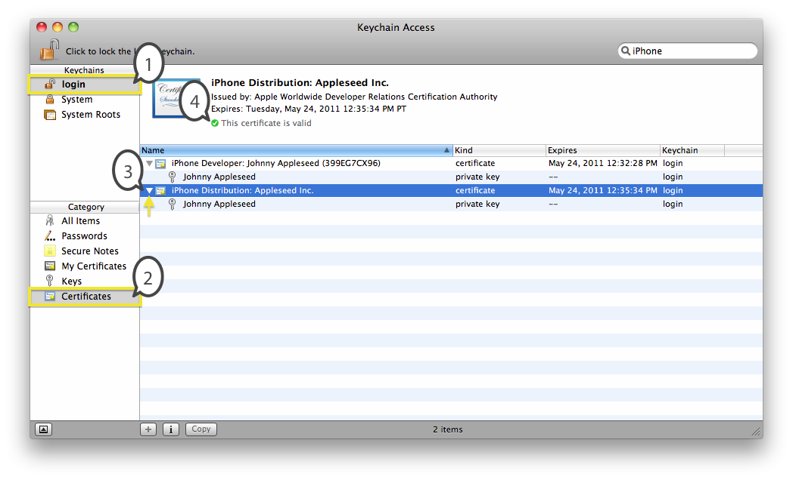

__Note:__ If instead your certificate shows a Red Circle with White 'X' and status "This certificate was signed by an unknown authority", simply download and install the "Apple Worldwide Developer Relations Certification Authority" certificate from the [iOS Portal > Certificates](https://developer.apple.com/ios/manage/certificates/team/index.action) section and link reading "WWDR intermediate certificate", then double-click the downloaded file to install it into the Keychain.

__Note:__ If instead your certificate shows a Blue Circle and White Plus sign, there are Trust problems with your certificate that should be resolved per the steps in section [How do I resolve the CodeSign error: CSSMERR_TP_NOT_TRUSTED?](#apple-f4xwc4dqnrsv64tfmyxwi33df52wszbpirkfgnbqgaydsojtgmwugsbrfvke4vcbi4yts).

[Back to Top](#)

## Verify Xcode Project configuration

This section verifies your Xcode project settings are correct.

### Verify Base SDK

It is recommended that the "Base SDK" setting on your Xcode Project is set to "Latest iOS". The following steps define the Base SDK at the Project level:

1) Choose the Xcode "View" menu > Navigators > Project, and then select your root project folder in the upper left corner, and the Project Editor will appear in the center pane.

2) Click on your project in the "PROJECT" section, then click the "Build Settings" tab.

3) Under the "Architectures" section, set the Base SDK setting to "Latest iOS".

The following steps define the Base SDK at the Target level:

1) Choose the Xcode "View" menu > Navigators > Project, and then select your root project folder in the upper left corner, and the Project Editor will appear in the center pane.

2) Click on your target in the "TARGETS" section, then click the "Build Settings" tab.

3) Under the "Architectures" section, set the Base SDK setting to "Latest iOS".

__Note:__ If you are building to your development device, the Base SDK version number defined on your Xcode project must be greater than or equal to the software version number on your development device; otherwise Xcode cannot initiate a debugging session with the device. In that case, you will need to download and install the latest iOS SDK version that is greater than or equal to your device software version.

__Figure 3__  Selecting the Latest iOS as the Base SDK. The numbers in this figure correspond to the steps above.

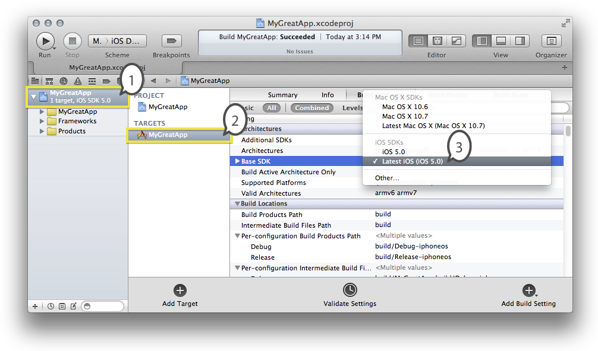

### Verify the iOS Deployment Target

The "iOS Deployment Target" Xcode setting defines the iOS software version your application is built for; it specifies the lowest version of iOS Devices your application will support. For example, the lowest available setting for iPad applications is iOS 3.2.

To verify this setting, choose the Xcode "View" menu > Navigators > Project, and then select your root project folder in the upper left corner. The Project Editor will appear in the center pane. Make sure Deployment Target is set to the intended value in both locations: pick your project under the "PROJECT" section, then click the "Info" tab > iOS Deployment Target. Also click your target under the "TARGETS" section, then click the "Summary" tab > Deployment Target setting.

__Figure 4__  Setting the iOS Deployment Target at the Project level.

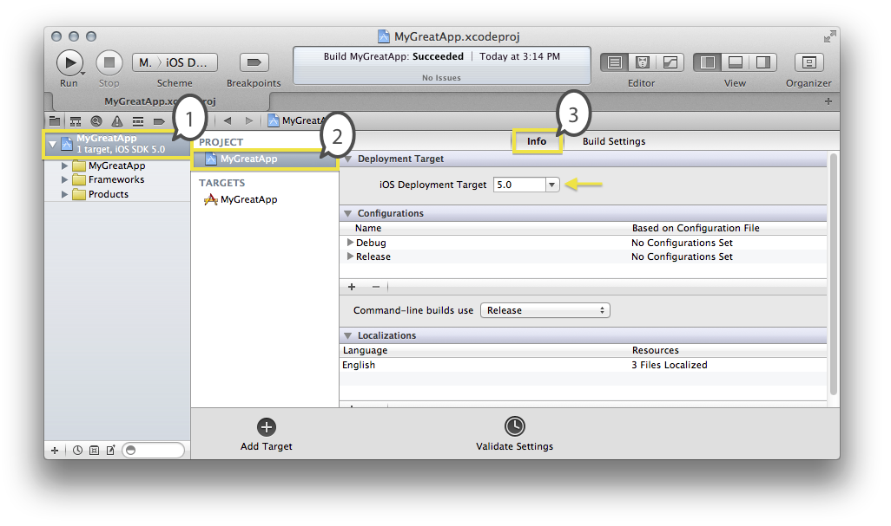

__Figure 5__  Setting the iOS Deployment Target at the Target level.

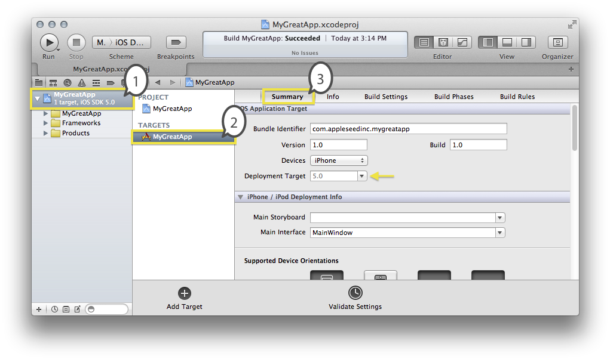

For more information, see [Specifying the Targeted iOS Version](https://developer.apple.com/library/ios/documentation/Xcode/Conceptual/ios_development_workflow/15-Configuring_Applications/configuring_applications.html#//apple_ref/doc/uid/TP40007959-CH19-SW10) in the Tools Workflow Guide for iOS.

### Verify the Target Architectures

You must verify that the target architectures are defined in your build settings according to architectures of the iOS devices you intend your app to support.

If for example, your deployment target is set to iOS 4.2 or lower, then armv6 must be included in addition to armv7. For more information, see the document [QA1760 - iPhone/iPod Touch: application executable is missing a required architecture.](https://developer.apple.com/library/ios/qa/qa1760/)

Additionally, see [Specifying the Targeted Architecture](https://developer.apple.com/library/ios/documentation/Xcode/Conceptual/ios_development_workflow/15-Configuring_Applications/configuring_applications.html#//apple_ref/doc/uid/TP40007959-CH19-SW8) within the Tools Workflow Guide for iOS for more information.

### Verify the Device Type Setting

To ensure your app runs on all the iOS devices you intend your application to support, you must verify the Device Family setting on the Target > Summary tab.

If for example, the Device Type is set to "iPad" the app will not install on iPhone or iPod Touch. For more information, see [Specifying the Device Type](https://developer.apple.com/library/ios/documentation/Xcode/Conceptual/ios_development_workflow/15-Configuring_Applications/configuring_applications.html#//apple_ref/doc/uid/TP40007959-CH19-SW13) within the Tools Workflow Guide for iOS.

### Verify Building for a Device (not Simulator)

For debugging your application on device, or creating a distribution build, make sure "iOS Device" is chosen in the Scheme pop-up selection menu in the upper-left corner of the Xcode toolbar. When a device is connected, it will show that device's name instead of "iOS Device".

__Figure 6__  Selecting the active Run Destination.

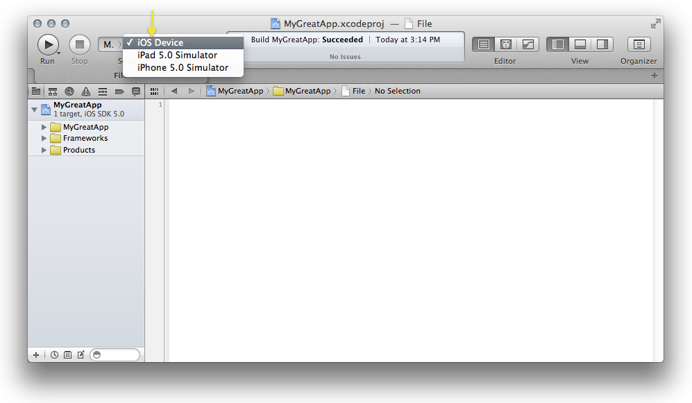

For more information, see [Specifying the Runtime Environment](https://developer.apple.com/library/ios/documentation/Xcode/Conceptual/ios_development_workflow/20-Building_and_Running_Applications/building_and_running_applications.html#//apple_ref/doc/uid/TP40007959-CH6-SW19) > Specifying the Run Destination, within the Tools Workflow Guide for iOS.

### Defining a Bundle Identifier in Xcode that is compatible with your App ID

The Bundle Identifier setting on your app's Xcode Project must be compatible with the App ID associated with your Provisioning Profile. To define the Bundle Identifier in your Xcode project, choose the Xcode "View" menu > Navigators > "Project" option, then select your root project folder in the upper left corner. The Project Editor will appear in the center pane. Select your target in the "TARGETS" section, then click the "Info" tab. Enter your bundle identifier in the "Bundle identifier" field. If a wildcard asterisk character is present in your App ID, replace the asterisk with an appropriate string using reverse-DNS format for the Bundle Identifier defined on your Xcode project.

Here are some example App IDs and compatible corresponding Bundle Identifier values defined in Xcode:

- If your App ID is A1B2C3D4E5.com.domainname.applicationname enter com.domainname.applicationname as your Bundle Identifier.
- If your App ID is A1B2C3D4E5.com.domainname.\* enter com.domainname.ichosethisappname as your Bundle Identifier.
- If your App ID is A1B2C3D4E5.\* enter any string you like using reverse-DNS format as your Bundle Identifier.

__Figure 7__  Defining the Bundle Identifier in the Target 'Info' tab.

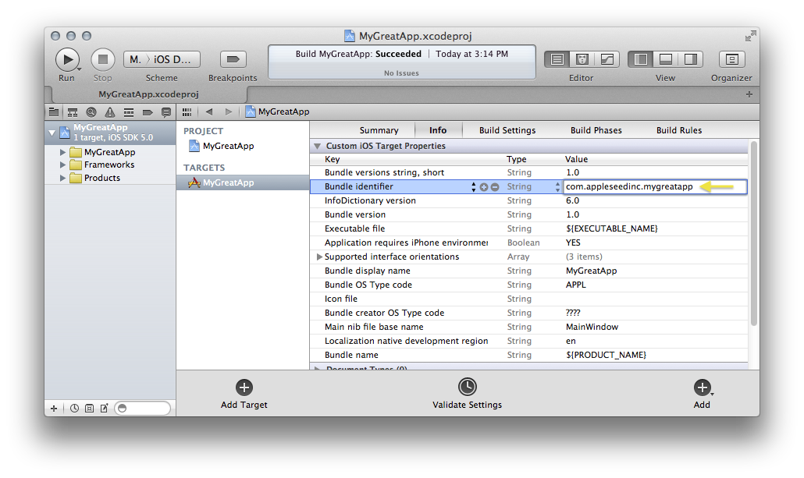

To ensure the Xcode project Bundle Identifier is compatible with the App ID associated with your Provisioning Profiles, perform the following steps. Choose the Xcode "View" menu > Navigators > Project, and then select your root project folder in the upper left corner. The Project Editor will appear in the center pane. Click on your target in the "TARGETS" section, then click the "Build Settings" tab. Scroll down to the "Code Signing Identity" section. If you are building to your development device, click the Value column under "Debug" that is to the right of "Any iOS SDK". In the provisioning profile selection pop-up, check that the current selection reads "For Application Identifiers: " with the intended App ID. If you are building a distribution binary, click the value column under "Release" that is to the right of "Any iOS SDK". In the provisioning profile selection pop-up, check that the current selection reads "For Application Identifiers: " with the intended App ID.

For more information, see [A Bundle ID Uniquely Identifies an App](https://developer.apple.com/library/ios/documentation/General/Conceptual/ApplicationDevelopmentOverview/ConfigureYourProject/ConfigureYourProject.html#//apple_ref/doc/uid/TP40011186-CH6-SW14) and [App IDs Are Used to Match Apps to Services and Development Teams](https://developer.apple.com/library/archive/technotes/tn2250/App IDs Are Used to Match Apps to Services and Development Teams)

### Assigning Provisioning Profiles to Build Configurations

For new projects, Xcode defaults all Code Signing Identities to the 'Developer' Automatic Profile Selector. This allows simple-case projects to be debugged/ran on the development device without change to your Xcode Project configuration. However, you must manually assign Provisioning Profiles to Build Configurations to create builds for App Store or Ad Hoc distribution, and for all other situations covered in section [Cases Where Custom Provisioning Profiles are Required](#apple-f4xwc4dqnrsv64tfmyxwi33df52wszbpirkfgnbqgaydsojtgmwugsbrfvke4vcbi4yti). Here are the steps to assign Provisioning Profiles to Build Configurations in Xcode:

1) Choose the Xcode "View" menu > Navigators > Project, and then select your root project folder in the upper left corner.

2) The Project Editor will appear in the center pane. Click on your target in the "TARGETS" section.

3) Click the "Build Settings" tab.

4) Make sure that both of the following buttons are depressed on the button row immediately below the Build Settings tab: "All" and "Combined".

5) Scroll down to the Code Signing section. Click on the Grey Disclosure Triangle to the left of the "Code Signing Identity" setting to expand and make visible the settings for "Debug", "Release", and "Any iOS SDK".

If you are building to your development device, verify that the Code Signing Identity setting for "Debug" has a child setting named "Any iOS SDK". Set the value of the Any iOS SDK line to "iPhone Developer" under the "Automatic Profile Selector" menu section. Using the Automatic Profile Selector setting allows Xcode to select the right profile for you, which makes your Xcode project easier to share amongst team members.

If instead you are building a distribution binary, verify that the Code Signing Identity setting for "Release" has a child setting named "Any iOS SDK". Set the Value column (that is to the right of the text "Any iOS SDK", under "Release") to the correct "iPhone Distribution" provisioning profile. In most cases, it is recommended that you pick the value "iPhone Distribution" under the "Automatic Profile Selector" section of the pop-up selection menu as this allows Xcode to pick the correct provisioning profile for you. However, in situations where there are two Distribution Provisioning Profiles that are compatible with the Bundle ID defined in your Xcode Project (e.g. an Ad Hoc, and App Store) then you will need to select the Provisioning Profile yourself from the list. Note that you are required to create, download and install Distribution Provisioning Profiles yourself; see the section [Steps to submit your app to the App Store](#apple-f4xwc4dqnrsv64tfmyxwi33df52wszbpirkfgnbqgaydsojtgmwugsbrfvke4vcbi4ytg) for more details.

__Figure 8__  Setting the 'Debug' Code Signing Identity using the 'Automatic Profile Selector' option. This allows Xcode to choose the right provisioning profile for you. The numbers in this figure correspond to the steps above.

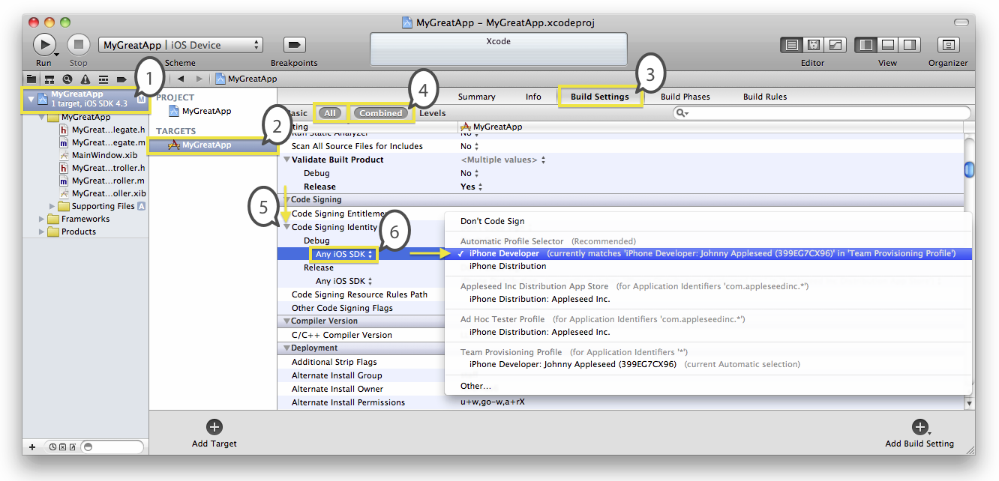

__Figure 9__  Example Code Signing Identity Settings. The 'Debug' Code Signing Identity is set to a Development Provisioning Profile, and the 'Release' Code Signing Identity is set to a Distribution Provisioning Profile. Also note, only the setting for 'Any iOS SDK' is assigned a Provisioning Profile, and every other line is set to the value 'Don't Code Sign.'

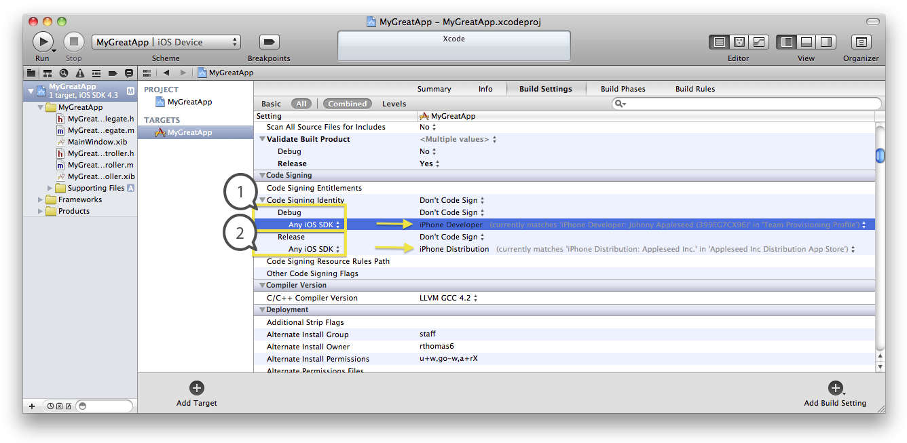[Back to Top](#)

## Perform Common Tasks

Once your Xcode Project and Keychain satisfy the requirements for code signing defined in the previous sections, continue to perform any of the following:

- [Steps to run your app on device thru Xcode](#apple-f4xwc4dqnrsv64tfmyxwi33df52wszbpirkfgnbqgaydsojtgmwugsbrfvke4vcbi4zda)
- [Steps to Test Your Submission Build with Ad Hoc distribution](#apple-f4xwc4dqnrsv64tfmyxwi33df52wszbpirkfgnbqgaydsojtgmwugsbrfvke4vcbi4zta)
- [Steps to submit your app to the App Store](#apple-f4xwc4dqnrsv64tfmyxwi33df52wszbpirkfgnbqgaydsojtgmwugsbrfvke4vcbi4ytg)
- [Creating an Application Archive](#apple-f4xwc4dqnrsv64tfmyxwi33df52wszbpirkfgnbqgaydsojtgmwugsbrfvke4vcbi4yte)
- [Steps to create an Enterprise build for In-House distribution](#apple-f4xwc4dqnrsv64tfmyxwi33df52wszbpirkfgnbqgaydsojtgmwugsbrfvke4vcbi4ztm)

### Steps to run your app on device thru Xcode

1) Connect your device to your development machine and verify that the device is listed under the DEVICES section on the sidebar of the iTunes Application. If your device is not recognized by iTunes, ensure you have a working USB data cable and that the connectors are fastened securely to the device and development machine.

2) If you haven't already done so, indicate to Xcode that your device may be used for development: choose the Xcode "Window" menu > Organizer, and click the Devices tab. Select the device from the left-pane. In the center pane, click the button "Use for Development". This must be done again after upgrading the iOS version on your device.

3) Ensure that the iOS Deployment Target defined on your Xcode Project is less than or equal to the iOS software version installed on your Development Device. To check the software version installed on your device, open the Xcode Window menu > Organizer, click the Devices tab, and select your device from the left-pane. The software version will be shown in the center pane. Follow the steps in section [Verify the iOS Deployment Target](#apple-f4xwc4dqnrsv64tfmyxwi33df52wszbpirkfgnbqgaydsojtgmwugsbrfvke4vcbi4yta) to define your iOS Deployment Target setting in Xcode.

4) Ensure your target device is added to your Devices list on the Provisioning Portal by referring to section [Add your iOS Device to your Team Devices List](#apple-f4xwc4dqnrsv64tfmyxwi33df52wszbpirkfgnbqgaydsojtgmwugsbrfvke4vcbi44q).

5) Ensure that the Base SDK version number defined on your Xcode project is greater than or equal to the software version number on your development device. If it is not, Xcode cannot initiate a debugging session with the device. In that case, you need to download and install the latest iOS SDK version that is greater than or equal to your device software version. See the section [Verify Base SDK](#apple-f4xwc4dqnrsv64tfmyxwi33df52wszbpirkfgnbqgaydsojtgmwugsbrfvke4vcbi4ytc) for information on checking this setting.

6) Verify that your Run Task is set to the Debug Build Configuration. To check this, follow the steps in section [Creating an Application Archive](#apple-f4xwc4dqnrsv64tfmyxwi33df52wszbpirkfgnbqgaydsojtgmwugsbrfvke4vcbi4yte) to bring up the "edit scheme" popup. However, verify the Build Configuration for the Run Task is Debug.

7) Follow the steps in section [Assigning Provisioning Profiles to Build Configurations](#apple-f4xwc4dqnrsv64tfmyxwi33df52wszbpirkfgnbqgaydsojtgmwugsbrfvke4vcbi43q) to verify your iPhone Developer identity (under Automatic Profile Selector) is assigned to your Debug Code Signing Identity.

8) Depending on the iOS version installed on your device Xcode may require that you download an option debugging support package within the Xcode "Preferences" menu > Downloads tab > Components.

9) Invoke the Xcode Product menu > Run.

### Steps to Test Your Submission Build with Ad Hoc distribution

Ad Hoc distribution gives you the ability to enable the app to run on your beta testers' devices who use only iTunes to install the app. Ad Hoc distribution is a very important step in the development process as it is the only way to fully test the actual submission build before submitting the app to the App Store.

__Note:__ Running your app on device through Xcode does not replace Ad Hoc testing because Xcode does not fully test all possible exhibitions of the app. For example, Watchdog timers are suppressed while connected to Xcode's debugger so Ad Hoc testing is the only way to ensure your app is free of issues like [Watchdog crashes](https://developer.apple.com/library/ios/#qa/qa1592/_index.html).

Therefore, to test your submission build on tester devices before it is submitted to the App Store, follow these steps:

1) Confirm that a distribution signing certificate exists in your keychain with its associated private key using section [Verify Your Signing Certificates](#apple-f4xwc4dqnrsv64tfmyxwi33df52wszbpirkfgnbqgaydsojtgmwugsbrfvke4vcbi4ytm). To create your distribution signing certificate, see [Provisioning Profile Refresh](#apple-f4xwc4dqnrsv64tfmyxwi33df52wszbpirkfgnbqgaydsojtgmwugsbrfvke4vcbi4za).

2) Add tester's iOS devices to your team using the steps [linked here](https://developer.apple.com/library/ios/documentation/Xcode/Conceptual/ios_development_workflow/35-Distributing_Applications/distributing_applications.html#//apple_ref/doc/uid/TP40007959-CH10-SW3). Then [Create a distribution provisioning profile](https://developer.apple.com/library/ios/recipes/ProvisioningPortal_Recipes/CreatingaDistributionProvisioningProfile/CreatingaDistributionProvisioningProfile.html#//apple_ref/doc/uid/TP40011211-CH3-SW1) with Distribution Method set to Ad Hoc, if you have not done so already. After making changes such as adding new testers to your team, use [Provisioning Profile Refresh](#apple-f4xwc4dqnrsv64tfmyxwi33df52wszbpirkfgnbqgaydsojtgmwugsbrfvke4vcbi4za) to instruct Xcode to download the updated profile.

3) Assign the Ad Hoc profile to your Release code signing identity similar to the steps described in section [Assigning Provisioning Profiles to Build Configurations](#apple-f4xwc4dqnrsv64tfmyxwi33df52wszbpirkfgnbqgaydsojtgmwugsbrfvke4vcbi43q).

4) Build and create the installable ".ipa" file according to the steps in section [Creating an Application Archive](#apple-f4xwc4dqnrsv64tfmyxwi33df52wszbpirkfgnbqgaydsojtgmwugsbrfvke4vcbi4yte)

__Note:__ While creating updated versions of your Ad Hoc builds during the Testing process, remember to increase your application's "bundle version" Info.plist property for each build. Doing so allows iTunes to recognize the update and properly sync the new .ipa to the test device.

For more information on creating and distributing Ad Hoc builds for Testing, see the iOS Development Workflow Guide section Publishing Application for Testing.

### Steps to submit your app to the App Store

Follow these steps to submit your app to the app store:

1) Ensure that your build is free of issues that can only be tested in Release builds (such as [Watchdog crashes](https://developer.apple.com/library/ios/#qa/qa1592/_index.html), etc) by using the [Steps to Test Your Submission Build with Ad Hoc distribution](#apple-f4xwc4dqnrsv64tfmyxwi33df52wszbpirkfgnbqgaydsojtgmwugsbrfvke4vcbi4zta).

2) Confirm that a distribution signing certificate exists in your keychain with its associated private key using section [Verify Your Signing Certificates](#apple-f4xwc4dqnrsv64tfmyxwi33df52wszbpirkfgnbqgaydsojtgmwugsbrfvke4vcbi4ytm). To create your distribution signing certificate, see [Provisioning Profile Refresh](#apple-f4xwc4dqnrsv64tfmyxwi33df52wszbpirkfgnbqgaydsojtgmwugsbrfvke4vcbi4za).

3) [Create a distribution provisioning profile](https://developer.apple.com/library/ios/recipes/ProvisioningPortal_Recipes/CreatingaDistributionProvisioningProfile/CreatingaDistributionProvisioningProfile.html#//apple_ref/doc/uid/TP40011211-CH3-SW1) with Distribution Method set to App Store, if you have not done so already. To confirm it is properly installed, see [How do I confirm my Provisioning Profile is for App Store distribution?](#apple-f4xwc4dqnrsv64tfmyxwi33df52wszbpirkfgnbqgaydsojtgmwugsbrfvke4vcbi4ztk).

4) Assign your app store profile to your Release code signing identity as pictured in section [Assigning Provisioning Profiles to Build Configurations](#apple-f4xwc4dqnrsv64tfmyxwi33df52wszbpirkfgnbqgaydsojtgmwugsbrfvke4vcbi43q).

5) Build and submit your app according to the steps in section [Creating an Application Archive](#apple-f4xwc4dqnrsv64tfmyxwi33df52wszbpirkfgnbqgaydsojtgmwugsbrfvke4vcbi4yte)

For more information, see [Publishing an App in the App Store](https://developer.apple.com/library/ios/documentation/General/Conceptual/ApplicationDevelopmentOverview/DeliverYourAppontheAppStore/DeliverYourAppontheAppStore.html#//apple_ref/doc/uid/TP40011186-CH8-SW1).

### Creating an Application Archive

The advantage of the Application Archive is it allows you to sign and distribute the same build to the App Store that passed your Ad Hoc tests. It also files away the .dSYM file that is unique to the submitted build so it can be used later for crash log symbolication.

1) before creating an application archive, verify the Scheme "Archive" Task is using your release build configuration, as pictured in the following figures:

__Figure 10__  Click the Scheme menu in the upper left corner of the Xcode Toolbar.

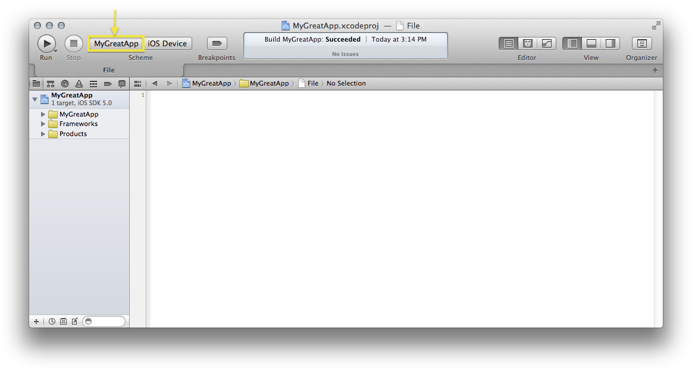

__Figure 11__  Choose 'edit scheme..'

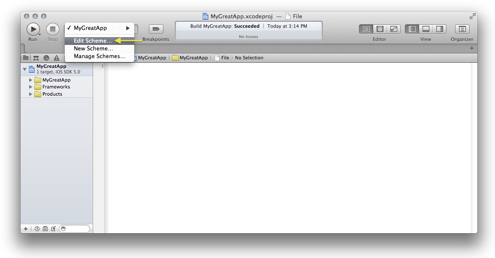

__Figure 12__  In the Edit Scheme popup, click the 'Archive' task in the sidebar, and verify the Build Configuration in the center pane is 'Release'.

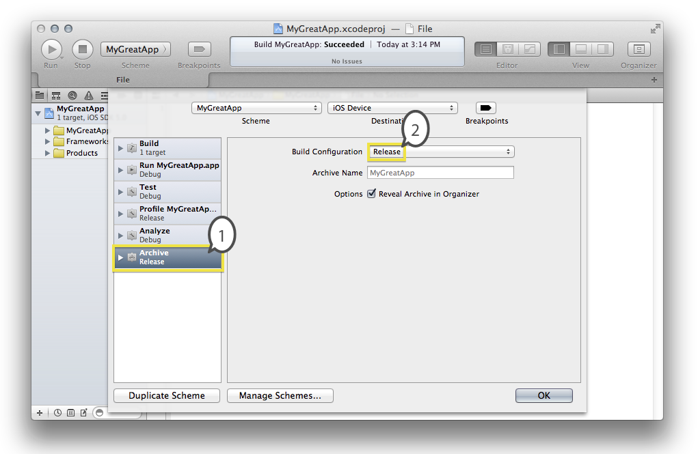

2) build the Application Archive by invoking the Xcode Product menu > Archive. The archives organizer opens up as seen in #1 in the figure below.

__Figure 13__  The Archives Organizer Distribute Flow

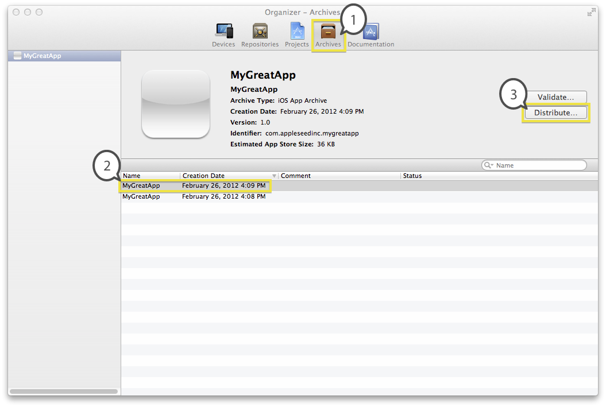

__Figure 14__  Choose the appropriate distribution method

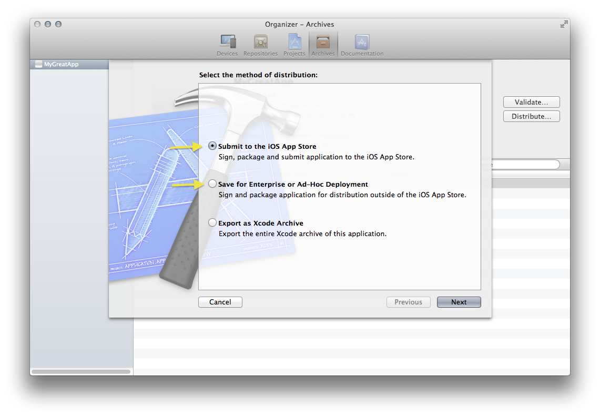

3) Choose the "Submit …" option to submit your app to the store.

__Important:__ For the submission to work you are required to select your App Store Provisioning Profile in the "Code Signing Identity" field during the submission flow.

__Note:__ If your application is not available in the "Application" field, see the "Ready to Upload Your Binary" section of the [iTunes Connect Developer Guide](http://www.apple.com) for steps to prepare iTunes Connect for your binary.

4) Choose the "Enterprise or Ad Hoc" option to create an enterprise build, or a beta application for testers. For the build to install correctly you must supply your Enterprise or Ad Hoc provisioning profile within the "Code Signing Identity" field during this flow. Save the resulting ".ipa" file to disk and share it with your users. The .ipa is installed by dragging it into the Library sidebar in iTunes.

### Steps to create an Enterprise build for In-House distribution

The process of creating an enterprise distribution build is similar to the [Steps to Test Your Submission Build with Ad Hoc distribution](#apple-f4xwc4dqnrsv64tfmyxwi33df52wszbpirkfgnbqgaydsojtgmwugsbrfvke4vcbi4zta), with the exception that the "Distribution Method" chosen while creating your Enterprise Distribution Provisioning Profile on the iOS Portal website will be "In House" instead of "Ad Hoc". And, unlike the Ad Hoc process, enterprise distribution does not require target devices to be pre-registered on the iOS Portal prior to creating the enterprise distribution provisioning profile.

For more information on Enterprise Distribution, see the [Distributing Enterprise Apps for iOS Devices](http://help.apple.com/iosdeployment-apps/) guide.

[Back to Top](#)

## Troubleshooting FAQ

This section answers common code signing questions as they apply to all iOS Developer Programs, and is categorized as follows:

- [Configuration Troubleshooting](#apple-f4xwc4dqnrsv64tfmyxwi33df52wszbpirkfgnbqgaydsojtgmwugsbrfvke4vcbi42da)
- [Build Troubleshooting](#apple-f4xwc4dqnrsv64tfmyxwi33df52wszbpirkfgnbqgaydsojtgmwugsbrfvke4vcbi42dc)
- [Run Troubleshooting](#apple-f4xwc4dqnrsv64tfmyxwi33df52wszbpirkfgnbqgaydsojtgmwugsbrfvke4vcbi43dg)
- [Archiving Troubleshooting](#apple-f4xwc4dqnrsv64tfmyxwi33df52wszbpirkfgnbqgaydsojtgmwugsbrfvke4vcbi42dm)
- [Validation Troubleshooting](#apple-f4xwc4dqnrsv64tfmyxwi33df52wszbpirkfgnbqgaydsojtgmwugsbrfvke4vcbi42dk)
- [Installation Troubleshooting](#apple-f4xwc4dqnrsv64tfmyxwi33df52wszbpirkfgnbqgaydsojtgmwugsbrfvke4vcbi42de)

[Back to Top](#)

## Configuration Troubleshooting

This section addresses common code signing configuration issues.

### How do I delete/revoke my certificates and start over fresh?

Use this section to create new iOS certificates if you are missing your private keys, or all other efforts fail to produce a working code signing configuration.

__Important:__ Members of the Enterprise iOS Developer Program are required to read the section on "Certificate Validation" of the [Distributing Enterprise Apps for iOS Devices](http://help.apple.com/iosdeployment-apps/) guide before revoking your iOS distribution certificate to understand the consequences of doing that.

__Important:__ Members of the Standard iOS Developer Program can be assured that replacing either your developer or distribution certificate will not affect any existing apps that you've published in the iOS App Store, nor will it affect your ability to update those apps.

Notes before beginning:

- Replacing your distribution certificate won't affect your developer certificate or development profiles.
- Similarly, replacing your developer certificate won't affect your distribution certificate or distribution profiles.
- Replace only your development certificate if you are troubleshooting an issue running your app on device through Xcode.
- Replace only your distribution certificate if you are troubleshooting an issue creating, submitting or installing a distribution build.
- After replacing your certificate(s) you are required to update and reinstall any provisioning profiles that were bound to the old certificate.

1) Open up Keychain Access app within /Applications/Utilities and click "All Items" under the Category sidebar. Type "iPhone" into the top-right search bar.

If you are replacing your Developer Certificate, delete your "iPhone Developer: <your_name>" Certificate by right-clicking and choosing "Delete"; if you have multiple "iPhone Developer: <your_name>" certificates, delete them all.

If you are replacing your Distribution Certificate, delete your "iPhone Distribution: <your_name>" Certificate by right-clicking and choosing "Delete"; if you have multiple "iPhone Distribution: <your_name>" certificates, delete them all.

2) Clean out your profile library according to the steps in section: [Keep Your Profile Library Clean](#apple-f4xwc4dqnrsv64tfmyxwi33df52wszbpirkfgnbqgaydsojtgmwugsbrfvke4vcbi4ytk).

3) Log into the [iOS Provisioning Portal](https://developer.apple.com/ios/manage/overview/). Click the Certificates sidebar. Click the DEVELOPMENT tab if you are replacing your Developer Certificate, and pick the the DISTRIBUTION tab if you are replacing your Distribution Certificate. Click Revoke in the Action column.

4) Perform the steps in section [Provisioning Profile Refresh](#apple-f4xwc4dqnrsv64tfmyxwi33df52wszbpirkfgnbqgaydsojtgmwugsbrfvke4vcbi4za). Xcode will prompt to create the new certificates; choose "Submit Request" to allow Xcode to create the certificates.

5) Renew your Provisioning Profile(s). On the [iOS Provisioning Portal](https://developer.apple.com/ios/manage/overview/) click the left-sidebar section "Provisioning". On top of the Provisioning page pick the "DEVELOPMENT" tab if you are replacing your Developer Certificate, or pick the the "DISTRIBUTION" tab if you are replacing your Distribution Certificate. You will see the status of "invalid" for your provisioning profiles. Go into each one and renew them by clicking "Modify". On the "Modify iOS Provisioning Profile" page, the 'Certificate' should already link to the newly created certificate; however, turn on the checkbox next to 'Certificate' if necessary. In order for the "Submit" button to work, something needs to change on the page, so for example, for a Distribution Provisioning Profile, change the Distribution Method from "App Store" to "Ad Hoc" then back to "App Store", and this will allow you to click Submit and invoke the Provisioning Profile update process. Refresh the browser until the profile is available for download. Then install the updated profile by dragging it onto the Xcode icon on your dock.

6) Perform the steps in section [Assigning Provisioning Profiles to Build Configurations](#apple-f4xwc4dqnrsv64tfmyxwi33df52wszbpirkfgnbqgaydsojtgmwugsbrfvke4vcbi43q) to instruct the Xcode build process to use your new Provisioning Profile(s).

7) Retry your build using the steps in section [Perform Common Tasks](#apple-f4xwc4dqnrsv64tfmyxwi33df52wszbpirkfgnbqgaydsojtgmwugsbrfvke4vcbi4zto).

### What does 'Valid Signing Identity Not Found' mean and how do I resolve it?

Examples of this provisioning profile error are:

```
Valid signing identity not found
Xcode could not find a valid private-key/certificate pair for this profile in your keychain
```

Private Keys for your iOS Development related Certificates only exist on the Mac in which they were created. So when moving your project to another Mac, partition, or Mac OS X user account, you'll need to follow the steps in section [Transferring Your Identities](#apple-f4xwc4dqnrsv64tfmyxwi33df52wszbpirkfgnbqgaydsojtgmwugsbrfvke4vcbi4zdi) to transfer your Signing Identities to enable Code Signing in the new location. Doing so should immediately clear up the "valid signing identity not found" errors if the cause of the problem was missing Private Keys or missing iOS Development related Certificates.

If Transferring Your Identities did not resolve the issue, or you're not sure which particular Mac, partition, or Mac OS X user from which to transfer the identities (the one in which the certificates where originally created), you can simply follow the steps in section [How do I delete/revoke my certificates and start over fresh?](#apple-f4xwc4dqnrsv64tfmyxwi33df52wszbpirkfgnbqgaydsojtgmwugsbrfvke4vcbi43a) to generate new Certificates.

### What do I do if I can't see or select my Provisioning Profile in Xcode Build Settings?

If you are unable to select your provisioning profile from the pop-up selection menu in Code Signing Identities build settings (option is Grayed Out), consider the following:

1) Make sure that the "Editor" menu > "Show Values" option is chosen. If instead the Editor > Show Definitions option is chosen, Xcode replaces selection menus with free form text entry which is not desired while defining provisioning profiles for Code Signing Identity build settings.

2) Ensure your "Bundle Identifier" setting on the target > info tab in your Xcode project is compatible with the App ID associated with your profile. See the section [Defining a Bundle Identifier in Xcode that is compatible with your App ID](#apple-f4xwc4dqnrsv64tfmyxwi33df52wszbpirkfgnbqgaydsojtgmwugsbrfvke4vcbi42q).

3) Ensure your signing certificates and their Private Keys are valid and present in the keychain according to the section [Verify Keychain configuration](#apple-f4xwc4dqnrsv64tfmyxwi33df52wszbpirkfgnbqgaydsojtgmwugsbrfvke4vcbi4ytq). If your certificates or private keys are missing, follow the steps in the previously linked section to restore them from backup or to create new ones.

### Code Signing Entitlement related issues

Application entitlements are string values that are bundled with a provisioning profile, and a unique string is used for each custom feature that your application requires, such as: Passbook, iCloud, In-App Purchase, Push Notifications, Game Center. In most cases, you can enable these entitlements within the App ID's section of the Provisioning Portal website, however, some entitlements such as iCloud require your additional configuration in Xcode.

### I'm defining a custom Code Signing Entitlements file in Xcode but do I need it?

If you are defining a custom Code Signing Entitlements file within your Target > Build Settings but aren't sure that you need it, you should remove that configuration by unchecking the "Entitlements" checkbox in the Target > Summary tab of your Xcode project.

Custom Entitlements configuration is only required when using iCloud, or the [keychain-access-groups](https://developer.apple.com/library/ios/documentation/Security/Reference/keychainservices/Reference/reference.html#//apple_ref/c/func/SecItemAdd) entitlement. See [How do I enable or disable iCloud?](#apple-f4xwc4dqnrsv64tfmyxwi33df52wszbpirkfgnbqgaydsojtgmwugsbrfvke4vcbi43de)

If you are unsure whether you need to define a Code Signing Entitlements file you should disable that configuration by unchecking Entitlements on your Target > Summary until you know it's needed.

__Note:__ As of Xcode 4, you are no longer required to define 'get-task-allow' or 'Can be debugged' entitlements in a custom code signing entitlements file. Xcode 4 and up creates the right value of this entitlement for based on the currently active Build Configuration.

### Entitlement related error messages

```
the executable was signed with invalid entitlements
```

This error means the wrong profile was used to sign the app, or, you are defining a Code Signing Entitlements build setting unnecessarily. Ensure you're signing with the right profile using section [Assigning Provisioning Profiles to Build Configurations](#apple-f4xwc4dqnrsv64tfmyxwi33df52wszbpirkfgnbqgaydsojtgmwugsbrfvke4vcbi43q), and also see [I'm defining a custom Code Signing Entitlements file in Xcode but do I need it?](#apple-f4xwc4dqnrsv64tfmyxwi33df52wszbpirkfgnbqgaydsojtgmwugsbrfvke4vcbi43dc).

```
Unable to extract entitlements from application
```

Make sure that the required architectures are present in your application's executable using the steps in section [Verify the Target Architectures](#apple-f4xwc4dqnrsv64tfmyxwi33df52wszbpirkfgnbqgaydsojtgmwugsbrfvke4vcbi43da).

```
The app <app_name> was not installed on <iOS_Device> because the entitlements are not valid.
```

Try disabling the entitlements checkbox on the Target > Summary tab, or, verify that your custom entitlements supplied within your Code Signing Entitlements file are spelled correctly. See [I'm defining a custom Code Signing Entitlements file in Xcode but do I need it?](#apple-f4xwc4dqnrsv64tfmyxwi33df52wszbpirkfgnbqgaydsojtgmwugsbrfvke4vcbi43dc).

### How do I enable or disable iCloud?

- If you intend on using iCloud, see [Configuring iCloud Entitlements](https://developer.apple.com/library/ios/documentation/Xcode/Conceptual/ios_development_workflow/15-Configuring_Applications/configuring_applications.html#//apple_ref/doc/uid/TP40007959-CH19-SW2).
- If you want to turn off iCloud for an app, follow the steps here: [Invalid Code Signing Entitlements - com.apple.developer.ubiquity-kvstore-identifier](https://developer.apple.com/library/ios/technotes/tn2294/_index.html#//apple_ref/doc/uid/DTS40011374-CH1-TNTAG6).

### How do I check the entitlements associated to my Provisioning Profile?

Entitlements are associated with Provisioning Profiles and transferred to your application's signature at Code Sign time. Use the following command to check the entitlements on your profile:

```
security cms -D -i /path/to/AppStoreProfile1.mobileprovision

(drag and drop the .mobileprovision file from Finder to the Terminal window to fill in the file path)
```

Within the command results look for the <key>Entitlements</key> section such as:

```
 <key>Entitlements</key>
    <dict>
        <key>application-identifier</key>
        <string>ABC123DE45.com.appleseedinc.*</string>
        <key>get-task-allow</key>
        <false/>
        <key>keychain-access-groups</key>
        <array>
            <string>ABC123DE45.*</string>
        </array>
    </dict>
```

Consider the example that this profile was used to create the application signature as seen in the section [How do I check the entitlements on my Application's Signature?](#apple-f4xwc4dqnrsv64tfmyxwi33df52wszbpirkfgnbqgaydsojtgmwugsbrfvke4vcbi4ztg). Note the following expected results when comparing entitlements from within the profile, with the entitlements on the signature that is a result of building an application with that profile:

1) the application-identifier entitlement on the signature is fully-qualified to fill in the "\*" portion of that entitlement within the profile.

2) the keychain-access-groups entitlement on the signature is fully-qualified and in most cases will be equal to the fully-qualified application-identifier on the signature.

3) get-task-allow is false, as it should be for distribution profiles. Though this particular entitlement is ignored during App Store ingestion, it must be false for Ad Hoc profiles (and Ad Hoc signatures). If you have a value of true here on the signature it might indicate that you've built your distribution build with the wrong build configuration, "Debug" instead of "Release".

To check the entitlements of a profile that is embedded into your .app bundle as a result of Code Signing process at build time, the command will look similar to:

```
security cms -D -i /path/to/the.app/embedded.mobileprovision

(drag and drop the .mobileprovision file from Finder to the Terminal window to fill in the file path)
```

__Note:__ A relatively common cause of the iTunes installation failure "the app was not installed because the entitlements are not valid" and the submission error "Application failed codesign verification" occurs when the Bundle Seed ID of the "application-identifier" entitlement on the Application's Signature doesn't match the Bundle Seed ID for the application-identifier entitlement within the embedded provisioning profile. To resolve that situation, see the Step #5 in the section titled [How do I resolve the error: Application failed codesign verification?](#apple-f4xwc4dqnrsv64tfmyxwi33df52wszbpirkfgnbqgaydsojtgmwugsbrfvke4vcbi4zte).

### How do I check which devices are associated to my Provisioning Profile?

Devices are associated to Development and Ad Hoc profiles when they're created on the iOS Portal. To verify those devices specified are contained within the resulting profile, use the following command:

```
security cms -D -i /path/to/MyAdHocProfile1.mobileprovision

(drag and drop the .mobileprovision file from Finder to the Terminal  window to fill in the file path)
```

Within the command results look for the <key>ProvisionedDevices</key> section for the device UDIDs associated to the profile, such as:

```
 <key>ProvisionedDevices</key>
    <array>
        <string>abab79177cse660edf75b4affe9d87ef2685ade2</string>
        <string>3436dc195c5432f1c22b5a687adfcd350de3af0a</string>
        <string>04589ca69bbde998a72f320s7148290603bc025c</string>
        <string>8a684993a490ebfdf564ef20d5fa38ebfb31b8d7</string>
        <string>16663b95823sf346fc377c3d31a90bc9fcd61d1d</string>
        <string>2e88a9cb3155fc81577c580b86s74351e3f50d5b</string>
        <string>105404f9945627sa24be595015a7cb5655f096f1</string>
        <string>7ea5s4fe4ee0c8d40a18117c446306663fc0bf73</string>
    </array>
```

### How do I confirm my Provisioning Profile is for App Store distribution?

To ensure that your profile is an App Store profile, use the following terminal command:

```
security cms -D -i /path/to/the.app/embedded.mobileprovision

(drag and drop the .mobileprovision file from Finder to the Terminal window to fill in the file path)
```

Within the command results, the following two criteria confirm your profile is an App Store profile:

- The get-task-allow entitlement will have the value of false
- There is no "<key>ProvisionedDevices<key>" text present

### How do I login to Xcode with a different team member?

Xcode currently caches the portal login information you've entered. To re-login to Xcode with a different team member:

- Open Keychain Access > Passwords category.
- Delete the entries for daw.apple.com and daw2.apple.com
- Retry the Provisioning Profile Refresh process.
[Back to Top](#)

## Build Troubleshooting

This section addresses common code signing build errors or warnings.

### How do I resolve the error: Application failed codesign verification?

Examples of this error follow:

```
Application failed codesign verification. The signature was invalid, or it was not signed with an iPhone Distribution Certificate.

Application failed codesign verification. The signature was invalid, or it was not signed with an Apple Submission Certificate.

Application failed codesign verification. The signature was invalid, contains disallowed entitlements or it was not signed with an iPhone distribution certificate.
```

Following is a numbered list of common causes of failed signature verification:

1) The first step to take is to check the distribution signature for a verification failure root cause that might be provided by the 'codesign' tool. If a root cause is available, and it is one of the known and common reasons documented here then the resolution steps are listed below. Following are two ways to check your signature for a verification failure root cause:

- Check the Xcode Build Log for an 'Application failed codesign verification' Build Warning that may occur as a result of building your app archive via the "Product" menu > Archive option. If a codesign 'root cause' of the signature verification failure is available it can be seen by expanding the build warning by this title by clicking the Disclosure Triangle next to the "Validate" Step in the build log and reviewing that additional text.

  __Note:__ To attain the root cause this way, the "Validate Built Product" Target level build setting must be set to YES for the Release build configuration, and the Release build configuration must be assigned to your Archive task on the Edit Scheme panel.

  Check this signature verification reason against the common reasons listed in the section titled "[What does this signature verification failure reason mean, and how do I resolve it?](#apple-f4xwc4dqnrsv64tfmyxwi33df52wszbpirkfgnbqgaydsojtgmwugsbrfvke4vcbi4zts)".
- Alternatively, you can check for a root cause by executing the Terminal command described in the section titled "[How do I check if my application's signature has been corrupted?](#apple-f4xwc4dqnrsv64tfmyxwi33df52wszbpirkfgnbqgaydsojtgmwugsbrfvke4vcbi4ztq)".

2) The most common reason for failing distribution signature validation is because the app was signed with a developer profile instead of a distribution profile, or the app was built with the wrong build configuration. To consider this potential cause check your settings against the recommendations that follow:

- The Release build configuration must be assigned to your Archive task. To ensure this, select the "Scheme" pop-up menu in the upper-left corner of the Xcode Toolbar, and choose "Edit Scheme". Select the "Archive" task and make sure the Build Configuration is "Release".
- To check that your app is signed with the correct distribution profile, use the steps in section [How do I check which certificate was used to sign my app?](#apple-f4xwc4dqnrsv64tfmyxwi33df52wszbpirkfgnbqgaydsojtgmwugsbrfvke4vcbi44a) and ensure the Authority is "iPhone Distribution". If it is not, continue to next bulleted items to correct the responsible configuration.
- Ensure that the appropriate distribution provisioning profile that you created for this application on the iOS Portal site is assigned to the Release build configuration. To ensure that use the steps in section [Assigning Provisioning Profiles to Build Configurations](#apple-f4xwc4dqnrsv64tfmyxwi33df52wszbpirkfgnbqgaydsojtgmwugsbrfvke4vcbi43q).
- Next, ensure that you are choosing the correct distribution provisioning profile when distributing your app on the Xcode Organizer > Archives tab. To do that, use the sections linked below depending on your distribution method and take special note you're selecting the correct profile on the "Identity" field (Xcode 4-4.2) or "Code Signing Identity" field (Xcode 4.3+) after clicking Submit/Share/Validate or Distribute on the Xcode Organizer > Archives tab.

  [Steps to submit your app to the App Store](#apple-f4xwc4dqnrsv64tfmyxwi33df52wszbpirkfgnbqgaydsojtgmwugsbrfvke4vcbi4ytg)

  [Steps to Test Your Submission Build with Ad Hoc distribution](#apple-f4xwc4dqnrsv64tfmyxwi33df52wszbpirkfgnbqgaydsojtgmwugsbrfvke4vcbi4zta)

  [Steps to create an Enterprise build for In-House distribution](#apple-f4xwc4dqnrsv64tfmyxwi33df52wszbpirkfgnbqgaydsojtgmwugsbrfvke4vcbi4ztm)

  __Note:__ You can confirm whether your profile is an App Store profile using the steps in section [How do I confirm my Provisioning Profile is for App Store distribution?](#apple-f4xwc4dqnrsv64tfmyxwi33df52wszbpirkfgnbqgaydsojtgmwugsbrfvke4vcbi4ztk)

3) Using a beta, pre-release, or "Developer Preview" version of either: Xcode, or Mac OS X can trigger this error. To confirm whether this is the case, use the following steps to check your Mac OS X version and build number. In Lion, use the Apple menu > About This Mac > More Info > System Report > single click on the sidebar "Software" text and look for the "System Version" string. Compare your system version and build number with the latest Mac OS X release available on the Mac App Store. If your version or build is different from those posted in the Mac App Store, install the Mac App Store version. You can do that either thru the link on the Mac App Store, or using the Apple menu > Software Update.

To see the version of Xcode you are using, open the "Xcode" menu > "About Xcode" option. Compare the version and build number with the latest "GM" (non-beta) Xcode release that is available on the [iOS Dev Center](https://developer.apple.com/devcenter/ios/index.action) website. After signing into the iOS Dev Center site with your developer program account credentials, the "beta" tab becomes available if any beta downloads are currently offered. Ensure you are not on the "beta" tab and navigate to the "Downloads" section for the latest GM Xcode release.

4) if you are defining a custom Code Signing Entitlements file within your Target > Build Settings, you might try removing that configuration entirely and rebuilding/resubmitting. More often than not, Code Signing Entitlements are defined unnecessarily. You only need to specify a custom Code Signing Entitlements file if your application is utilizing custom keychain access sharing or iCloud. Otherwise, remove the Code Signing Entitlements configuration from all build configurations on your Xcode project's Target > Build Settings, the rebuild and reattempt your submission/validation.

To ensure the problem is not entitlements related in your case, use the steps in section [How do I check the entitlements on my Application's Signature?](#apple-f4xwc4dqnrsv64tfmyxwi33df52wszbpirkfgnbqgaydsojtgmwugsbrfvke4vcbi4ztg) and ensure there are no unexpected deviations from the example entitlements provided in that section.

5) If you are validating an Application Archive, you must ensure that the profile used to sign the build at Product > Archive time has the same Bundle Seed ID prefix as the Distribution Provisioning Profile you're picking in the "IDENTITY" (or "Code Signing Identity") field distribution flow on the Xcode Organizer > Archives tab. For example, if you did not create the Application Archive using your App Store profile but you will submit that archive to the store, you must ensure that the profile used to sign the App Archive has the same Bundle Seed ID as your App Store profile. To do that, use the steps in section [How do I check the entitlements associated to my Provisioning Profile?](#apple-f4xwc4dqnrsv64tfmyxwi33df52wszbpirkfgnbqgaydsojtgmwugsbrfvke4vcbi43dk). The Bundle Seed ID is the 10-digit alpha-numeric value prefix on the application-identifier entitlement.

### What does this signature verification failure reason mean, and how do I resolve it?

- ```
  test-requirement: failed to satisfy code requirement(s)
  ```

  Typically, this error occurs when the wrong certificate was used to sign your app. For example, this error will occur if the app was signed with a developer profile instead of a distribution profile. See step #2 in the following section to correct the appropriate settings "[How do I resolve the error: Application failed codesign verification?](#apple-f4xwc4dqnrsv64tfmyxwi33df52wszbpirkfgnbqgaydsojtgmwugsbrfvke4vcbi4zte)".
- ```
  a sealed resource is missing or invalid in architecture: armv7
  ```

  Or, it's related error:

  ```
  resource missing: my.app/._.*
  ```

  Following are two options to resolve this issue:

  - The "._" is an AppleDouble file and it can result from copying the Xcode Project folder unzipped onto and back from a non-Mac filesystem. These files are problematic and must be removed using the 'dot_clean' command as shown below. The argument to the dot_clean command is your entire Xcode Project Folder, not the Xcode project file. You can drag your Xcode project folder from the Finder window into the Terminal window to fill in your Xcode project folder's full path into the command line argument, such as:

    ```
    dot_clean /path/to/My_Xcode_Project
    ```

    __Note:__ If Terminal cannot find the dot_clean command, please download the optional Command Line Tools installation from the "Xcode" menu > Preferences > Downloads section in Xcode.

    If the signature failure is fixed after running dot_clean, always be sure to zip your Xcode Project folder before transferring it to other platforms or disk formats, such as flash drives, email, ftp, and external hard disks.
  - Alternatively, this issue may be worked around by making a new project using the latest version of Xcode. Move your code/resources/frameworks to the new project, and reattempt your distribution build validation.
- ```
  Failed to load provisioning profile from: (x)
  ```

  Two slightly different versions of this error follow:

  - If (x) in the above error is a file path that appears to be \*truncated\* then the workaround to this problem is to do anything in your power to \*shorten\* that path, such as setting the "bundle name" Info.plist property to a shorter name. Then reattempt your distribution build validation.
  - If (x) in the above error is a file path that \*does not\* appear to be truncated but you are running on Mac OS X 10.6.x, please update to OS X Lion 10.7.x and download/install the latest version of Xcode.
- ```
  object file format invalid or unsuitable
  ```

  To resolve this error, update to the latest version of Xcode and consider creating a new project in the latest version of Xcode. Alternatively, ensure that your "Executable file" Info.plist property is set to the value: `${EXECUTABLE_NAME}`.
- ```
  cannot find code object on disk
  ```

  This error occurs when signed app bundles are placed on foreign disk formats that do not support Mac OS X resource forks. To resolve the issue please ensure that both the Xcode Project and the Derived Data folder reside on an HFS+ formatted disk. The Derived Data setting is found within Xcode Preferences > Locations.

### How do I check if my application's signature has been corrupted?

__Note:__ This command uses an .app file argument. If needed, see the steps in section [How do I locate the .app file signed for distribution from within an application archive?](#apple-f4xwc4dqnrsv64tfmyxwi33df52wszbpirkfgnbqgaydsojtgmwugsbrfvke4vcbi43dq).

- You can verify that your .app's contents have not changed since the signature was made and that your signature has not otherwise been corrupted with the following Terminal command:

  ```
  codesign --verify -vvvv -R='anchor apple generic and certificate 1[field.1.2.840.113635.100.6.2.1] exists and (certificate leaf[field.1.2.840.113635.100.6.1.2] exists or certificate leaf[field.1.2.840.113635.100.6.1.4] exists)' /path/to/the.app
  ```

  __Important:__ "/path/to/the.app" in the above example represents the file path to the app you're checking. You can drag and drop the .app file from the Finder window into the Terminal window to fill in that file path.
- Your app file's signature is valid in the regard that its contents have not been modified since the signature was made if the command results are:

  ```
  /path/to/the.app: valid on disk
  /path/to/the.app: satisfies its Designated Requirement
  /path/to/the.app: explicit requirement satisfied
  ```
- If you receive a different result, check that message against the common root causes listed in the section titled "[What does this signature verification failure reason mean, and how do I resolve it?](#apple-f4xwc4dqnrsv64tfmyxwi33df52wszbpirkfgnbqgaydsojtgmwugsbrfvke4vcbi4zts)"

### How do I check which certificate was used to sign my app?

__Note:__ This command uses an .app file argument. If needed, see the steps in section [How do I locate the .app file signed for distribution from within an application archive?](#apple-f4xwc4dqnrsv64tfmyxwi33df52wszbpirkfgnbqgaydsojtgmwugsbrfvke4vcbi43dq).

Use the following console command:

```
codesign -dvvv /path/to/MyGreatApp.app

(drag and drop the .app file from Finder to the Terminal window to fill in the file path)
```

Within the command results, look for the "Authority" field:

```
Authority=iPhone Distribution: Appleseed Inc.
```

If instead your distribution build shows the Identity as "iPhone Developer: <your_name>" the wrong certificate was used and your distribution build will fail codesign verfication. To resolve this problem, see the section titled [How do I resolve the error: Application failed codesign verification?](#apple-f4xwc4dqnrsv64tfmyxwi33df52wszbpirkfgnbqgaydsojtgmwugsbrfvke4vcbi4zte).

### How do I check the entitlements on my Application's Signature?

__Note:__ This command uses an .app file argument. If needed, see the steps in section [How do I locate the .app file signed for distribution from within an application archive?](#apple-f4xwc4dqnrsv64tfmyxwi33df52wszbpirkfgnbqgaydsojtgmwugsbrfvke4vcbi43dq).

Entitlements are considered part of the app's signature. To see the entitlements signed with your app, run the console command:

```
codesign -d --entitlements - /path/to/MyGreatApp.app

(drag and drop the .app file from Finder to the Terminal window to fill in the file path)
```

An example of typical command results for an iOS distribution build are:

```xml
Executable=/path/to/MyGreatApp.app/MyGreatApp
??qq?<?xml version="1.0" encoding="UTF-8"?>
<!DOCTYPE plist PUBLIC "-//Apple//DTD PLIST 1.0//EN" "http://www.apple.com/DTDs/PropertyList-1.0.dtd">
<plist version="1.0">
<dict>
    <key>application-identifier</key>
    <string>ABC123DE45.com.appleseedinc.mygreatapp</string>
    <key>get-task-allow</key>
    <false/>
    <key>keychain-access-groups</key>
    <array>
        <string>ABC123DE45.com.appleseedinc.mygreatapp</string>
    </array>
</dict>
</plist>
```

In most cases, those entitlements seen above should be the only entitlements in your App's Signature. Applications using Apple Push Notification or iCloud will add a couple entitlements. Otherwise, extra entitlements than those listed above, or improperly spelled, or formatted versions of those entitlements will likely result in "failed codesign verificaiton" preventing upload to the store, or for Ad Hoc builds produce the iTunes installation error 'the application was not installed because the entitlements are not valid'.

For more information, see the section titled [Code Signing Entitlement related issues](#apple-f4xwc4dqnrsv64tfmyxwi33df52wszbpirkfgnbqgaydsojtgmwugsbrfvke4vcbi4ztc)

### How do I locate the .app file signed for distribution from within an application archive?

- Follow the steps for [Creating an Application Archive](#apple-f4xwc4dqnrsv64tfmyxwi33df52wszbpirkfgnbqgaydsojtgmwugsbrfvke4vcbi4yte).
- Select the app archive in the Xcode Organizer > Archives tab, then click "Distribute > Save for Enterprise or Ad Hoc deployment" (in older versions of Xcode, the button to click is labeled "Share").
- In the resulting pop-up, choose your Ad Hoc profile, or App Store profile, in the "Identity" or "Code Signing Identity" field depending on whether you're testing your submission build with Ad Hoc, or submitting the app to the App Store, respectively.  Save the .ipa file to disk.
- Rename the .ipa created in the previous step to have a .zip file extension, and double click it to decompress the contents. The uncompressed folder will be titled "Payload".
- See the .app file signed for distribution within the ./Payload/Applications folder.

### How do I resolve the CodeSign error: Code signing is required?

An example of this error is:

```
[BEROR]CodeSign error: code signing is required for product type 'Application' in SDK 'iOS 5.0'
```

Use the steps in section [Assigning Provisioning Profiles to Build Configurations](#apple-f4xwc4dqnrsv64tfmyxwi33df52wszbpirkfgnbqgaydsojtgmwugsbrfvke4vcbi43q) to correct your Code Signing Identities configuration and match the steps and figures closely. Specifically, the line reading "Any iOS SDK" must have a provisioning profile assigned to it and cannot be set to "Don't Code Sign".

### How do I resolve the CodeSign error: CSSMERR_TP_NOT_TRUSTED?

The Xcode build error titled "CSSMERR_TP_NOT_TRUSTED" is a common problem that arises when Trust Settings have been mistakenly modified for any of the iOS Development related certificates that follow:

```
iPhone Developer: <your_name>
iPhone Distribution: <your_name>
Apple Worldwide Developer Relations Certification Authority
```

To confirm diagnosis of this error open Keychain Access app > Certificates "Category" and individually select each of the above certificates taking note of the status in the header pane. A Green Circle with White Checkmark indicates a healthy certificate, while a Blue Circle with White Plus sign indicates an unhealthy certificate and cause of the error.

Use the following steps to troubleshoot the issue -

1) Ensure that the Apple Inc. Root Certificate is installed in your keychain. If not, it can be [downloaded here](http://www.apple.com/certificateauthority/).

2) Ensure the Apple Worldwide Developer Relations Certification Authority certificate is installed in your keychain. If not, it can be downloaded from the bottom link on the [Provisioning Portal website > Certificates tab](https://developer.apple.com/ios/manage/certificates/team/index.action) .

3) First try and restore Trust settings to the proper value "Use System Defaults". To do that, double click on that certificate to expand the Trust section, and select "Use System Defaults". If after doing that the Blue Circle with White Plus sign does not automatically change to a Green Circle with White Checkmark, the problem is not yet fixed and you'll need to continue to the following step to resolve the issue.

4) Certificate Trust Settings are inherited from any duplicate certificates that may exist in other keychains. Therefore, if you have multiple copies of these iOS Development related certificates in different Keychains, you'll need to restore the Trust Settings to "Use System Defaults" on all copies of those certificates in all of your Keychains to fully resolve the problem. See the "Keychains" side bar in Keychain Access app for all of the Keychains to check, e.g. "login", "System", "System Roots", and any others.

5) if after restoring the Trust Settings to "Use System Defaults" for all of your iOS Development related certificates the error persists, you'll need to remove/delete all iOS Development related certificates that are still exhibiting the Blue Circle with White Plus sign in the header pane. To do that, follow the remaining steps in this list.

- 5a) For all iOS Development related certificates that still exhibit the Blue Circle with White Plus sign in the header pane, Ctrl-click and delete the certificate. Be sure to delete all copies of this certificate from all Keychains.
- 5b) Reinstall the deleted certificates. If the certificate deleted was the "Apple Worldwide Developer Relations Certification Authority" it can be re-download from the [iOS Portal > Certificates](https://developer.apple.com/ios/manage/certificates/team/index.action) within the "Certificates" sidebar and the link reading "\*If you do not have the WWDR intermediate certificate installed, click here to download now". After it is downloaded, double-click it to install it into the Keychain.
- 5c) If the certificates deleted were either the "iPhone Developer: <your_name>" or "iPhone Distribution: <your_name>" use [Provisioning Profile Refresh](#apple-f4xwc4dqnrsv64tfmyxwi33df52wszbpirkfgnbqgaydsojtgmwugsbrfvke4vcbi4za) to have Xcode download fresh copies of those certificates and install them into your Keychain on your behalf.

After performing the above steps your certificates should show a Green Circle with White Checkmark with status "This certificate is valid" and avoid the CSSMERR_TP_NOT_TRUSTED Xcode build error.

### How do I resolve the CodeSign error: Provisioning profile can't be found?

An example of this error is:

```
[BEROR]Code Sign error: Provisioning profile '1A2B3C4D-5E6F-1A2B-3C4D-5E6F1A2B3C4D' can't be found
```

This means that the Provisioning Profile assigned to either your "Debug" or "Release" Code Signing Identity setting cannot be found in your Provisioning Profile library. This can happen when opening a project on a different machine because provisioning profiles are tied to the Mac OS X user and are not bundled with the Xcode project. This error can occur if you deleted a provisioning profile from your Xcode Library manually but forget to fix the 'dead link' that results within "Code Signing Identity" Build Settings.

This error only surfaces when you have made an \*explicit\* profile selection from the Code Signing Identity profile pop-up selection menu instead of allowing Xcode to choose the right profile for you by using either of the generic options "iPhone Developer" or "iPhone Distribution" under the "Automatic Profile Selector" section of the profile pop-up.

To correct this error:

1) restore the missing provisioning profile into your profile library by downloading it from the iOS Portal, and dragging it onto the Xcode icon on your Dock.

2) update the 'dead profile link' by performing the steps in section [Assigning Provisioning Profiles to Build Configurations](#apple-f4xwc4dqnrsv64tfmyxwi33df52wszbpirkfgnbqgaydsojtgmwugsbrfvke4vcbi43q) to assign a profile that does exist in your library.

3) if Xcode appears to be deleting your provisioning profiles from your Profile Library in error, turn off [Provisioning Profile Refresh](#apple-f4xwc4dqnrsv64tfmyxwi33df52wszbpirkfgnbqgaydsojtgmwugsbrfvke4vcbi4za), then perform step 1) again to restore the missing profile. If this is the case, you are encouraged to file a bug for the problem using [Apple's bug reporter tool](https://developer.apple.com/bugreporter).

### How do I resolve the CodeSign error: Certificate identity appears more than once in the keychain?

Examples of this error are:

```
Code Sign error: Certificate identity 'iPhone Developer: <your_name>' appears more than once in the keychain. The codesign tool requires there only be one.

Code Sign error: Certificate identity 'iPhone Distribution: <your_name>' appears more than once in the keychain. The codesign tool requires there only be one.
```

This error indicates that while searching all keychains, Xcode found more than one signing certificate for the same iOS developer program team member, and it does not know which one to use for code signing.

To resolve the problem, use the following process to ensure that there is only one copy of each certificate type: "iPhone Developer" or "iPhone Distribution" within the entire keychain, for the same team member.

- In Keychain Access, make sure your "View" menu > Show Expired Certificates option is turned ON
- Click the "Certificates" 'Category' and then click through every one of the keychains you have listed in your 'Keychain' sidebar in Keychain Access. If you see any duplicates, even expired certificates, delete those duplicates.
- Click the "Keys" 'Category' in Keychain Access.
- Navigate through every keychain looking for and deleting any "Orphaned Keys" that have the same Common Name as the affected certificate. Orphaned keys are ones that are not bound by a Disclosure Triangle to an iPhone Developer or iPhone Distribution certificate that currently exists in the keychain.
- If you found and removed any extra keys or certificates, please reattempt your build.
- If the issue persists after removing all active or expired duplicate certificates or keys by the same common name, you might try removing \*all\* existing signing certificates and keys and replace them with new ones using the steps in [How do I delete/revoke my certificates and start over fresh?](#apple-f4xwc4dqnrsv64tfmyxwi33df52wszbpirkfgnbqgaydsojtgmwugsbrfvke4vcbi43a).
- Finally, if the error persists even after creating new certificates, please control-click on the affected certificate in Keychain Access, choose "New Identity Preference" and click the 'Certificate' field. If you see duplicate certificates listed in here, this is an known and uncommon issue with Keychain Access. To work around the problem, try the following:

  - Keychain Access > Edit > Keychain List, uncheck "Shared" for the login keychain.
  - If going back into the Keychain List you find the login keychain is still marked as Shared, create a backup of the following files and then remove them if they exist:

    ```
    /Library/Preferences/com.apple.security-common.plist
    ~/Library/Preferences/com.apple.security.plist
    ```
  - Retry your build.

### How do I resolve the CodeSign error: iPhone Developer: or iPhone Distribution: ambiguous matches?

If you're receiving a build error similar to:

```
Build error "iPhone Developer: <your_name> (XYZ123ABC): ambiguous
(matches "iPhone Developer: <your_name> (XYZ123ABC)" in /Library/Keychains/System.keychain and "iPhone Developer: <your_name> (XYZ123ABC)" in /Users/../Library/Keychains/login.keychain)"
```

Follow the steps in the above section [How do I resolve the CodeSign error: Certificate identity appears more than once in the keychain?](#apple-f4xwc4dqnrsv64tfmyxwi33df52wszbpirkfgnbqgaydsojtgmwugsbrfvke4vcbi4zq) to resolve this error.

### How do I resolve the CodeSign error: The identity 'iPhone Developer' doesn't match any valid, non-expired certificate/private key pair in the default keychain

To resolve the error:

```
The identity 'iPhone Developer' doesn't match any valid, non-expired certificate/private key pair in the default keychain
```

Consider the following troubleshooting approach:

- If you have not yet created your iPhone Developer certificate or a Developer Provisioning Profile that can be done by leveraging Xcode's [Provisioning Profile Refresh](#apple-f4xwc4dqnrsv64tfmyxwi33df52wszbpirkfgnbqgaydsojtgmwugsbrfvke4vcbi4za) feature.
- Alternatively, if you are missing your iPhone Developer certificate or its associate Private Key it can cause this error. Use the steps in section [Verify Keychain configuration](#apple-f4xwc4dqnrsv64tfmyxwi33df52wszbpirkfgnbqgaydsojtgmwugsbrfvke4vcbi4ytq) to determine whether that is the case. If so, there are two ways to approach resolving the problem:

  - Restore your signing certificate from a backup or transfer it from the Mac it was created on using the process described in [Transferring Your Identities](#apple-f4xwc4dqnrsv64tfmyxwi33df52wszbpirkfgnbqgaydsojtgmwugsbrfvke4vcbi4zdi).
  - Otherwise, you may create a new certificate using the steps in section [How do I delete/revoke my certificates and start over fresh?](#apple-f4xwc4dqnrsv64tfmyxwi33df52wszbpirkfgnbqgaydsojtgmwugsbrfvke4vcbi43a)

### How do I resolve the CodeSign error: The identity 'iPhone Distribution' doesn't match any valid, non-expired certificate/private key pair in the default keychain

To resolve the error:

```
The identity 'iPhone Distribution' doesn't match any valid, non-expired certificate/private key pair in the default keychain
```

Consider the following troubleshooting approach:

- Use the steps in section [Verify Keychain configuration](#apple-f4xwc4dqnrsv64tfmyxwi33df52wszbpirkfgnbqgaydsojtgmwugsbrfvke4vcbi4ytq) to ensure your iPhone Distribution certificate is installed in your keychain and that it contains its associated private key.
- If you have not yet created your Distribution Provisioning Profile specifically for this app, see the section titled [Cases Where Custom Provisioning Profiles are Required](#apple-f4xwc4dqnrsv64tfmyxwi33df52wszbpirkfgnbqgaydsojtgmwugsbrfvke4vcbi4yti) for steps to do that.
- Ensure you have followed the process of [Defining a Bundle Identifier in Xcode that is compatible with your App ID](#apple-f4xwc4dqnrsv64tfmyxwi33df52wszbpirkfgnbqgaydsojtgmwugsbrfvke4vcbi42q) that is associated to your Distribution Provisioning Profile.

### Code Sign error: No unexpired provisioning profiles found that contain any of the keychain's signing certificates

An example of this error is:

```
No unexpired provisioning profiles found that contain any of the keychain's signing certificates
```

Consider the following situations that can produce this error:

- This error can indicate that your signing certificate is installed and healthy but Xcode cannot find a matching provisioning profile to use. To resolve that situation, see the following section to [Create your Provisioning Profiles](#apple-f4xwc4dqnrsv64tfmyxwi33df52wszbpirkfgnbqgaydsojtgmwugsbrfvke4vcbi4zdg).
- Alternatively, if the provisioning profile you want to build with is in your Xcode profile library, this error indicates that a signing certificate matching that profile does not exist in your keychain. To resolve that problem, you must transfer the signing certificate from the Mac it was created on using the process described in [Transferring Your Identities](#apple-f4xwc4dqnrsv64tfmyxwi33df52wszbpirkfgnbqgaydsojtgmwugsbrfvke4vcbi4zdi)
[Back to Top](#)

## Run Troubleshooting

This section troubleshoots problematic behavior or error messages experienced while attempting to run your application on device through Xcode.

```
Xcode cannot run using the selected device. No provisioned iOS devices are available with a compatible iOS version.
```

- Make sure that you are following the recommended [Steps to run your app on device thru Xcode](#apple-f4xwc4dqnrsv64tfmyxwi33df52wszbpirkfgnbqgaydsojtgmwugsbrfvke4vcbi4zda).
- Make sure to meet the [Requirements for app installation](#apple-f4xwc4dqnrsv64tfmyxwi33df52wszbpirkfgnbqgaydsojtgmwugsbrfvke4vcbi43di).

For other issues encountered while attempting to run on device through Xcode, see [Installation Troubleshooting](#apple-f4xwc4dqnrsv64tfmyxwi33df52wszbpirkfgnbqgaydsojtgmwugsbrfvke4vcbi42de).

[Back to Top](#)

## Archiving Troubleshooting

To troubleshoot problematic behavior or error messages encountered while attempting to archive your application, see [TN2215 - Troubleshooting application archiving in Xcode](https://developer.apple.com/library/ios/technotes/tn2215/_index.html#//apple_ref/doc/uid/DTS40011221).

[Back to Top](#)

## Validation Troubleshooting

- ```
  No identities are available for signing.
  ```

  Xcode checks the bundle ID defined for the Xcode project against the available provisioning profiles installed in the profile library. Xcode will throw this error if you don't have a profile installed with an App ID compatible with the Bundle ID setting on your Xcode project, or if you do not have that profile's associated signing certificate or private key installed in the keychain. Therefore, to resolve this error:

  - See [Defining a Bundle Identifier in Xcode that is compatible with your App ID](#apple-f4xwc4dqnrsv64tfmyxwi33df52wszbpirkfgnbqgaydsojtgmwugsbrfvke4vcbi42q).
  - See the "Distribution Profiles" section of [Cases Where Custom Provisioning Profiles are Required](#apple-f4xwc4dqnrsv64tfmyxwi33df52wszbpirkfgnbqgaydsojtgmwugsbrfvke4vcbi4yti) to ensure you have created a distribution profile and it exists within your Xcode profile library.
  - See [Verify Keychain configuration](#apple-f4xwc4dqnrsv64tfmyxwi33df52wszbpirkfgnbqgaydsojtgmwugsbrfvke4vcbi4ytq) to verify you have created a distribution certificate and both it, and its associated private key, are installed in your keychain.
- For other issues that occur during app submission or archive validation, see [TN2294 - Xcode Validation and Submission Issues for iOS](https://developer.apple.com/library/ios/#technotes/tn2294/_index.html)

[Back to Top](#)

## Installation Troubleshooting

This section aids in troubleshooting problems encountered while installing Ad Hoc or Enterprise builds through iTunes, or while debugging on device through Xcode.

### Requirements for app installation

Make sure the following settings are correct for the particular device you're attempting to install the app on:

- See [App Size Tips](https://developer.apple.com/library/ios/documentation/LanguagesUtilities/Conceptual/iTunesConnect_Guide/18_BestPractices/BestPractices.html#//apple_ref/doc/uid/TP40011225-CH19-SW16) of the iTunes Connect Developer Guide to ensure that the total bundle size limitation for iOS apps is not breached.
- [Verify the iOS Deployment Target](#apple-f4xwc4dqnrsv64tfmyxwi33df52wszbpirkfgnbqgaydsojtgmwugsbrfvke4vcbi4yta) is less than or equal to the iOS version installed on the device.
- [Verify the Target Architectures](#apple-f4xwc4dqnrsv64tfmyxwi33df52wszbpirkfgnbqgaydsojtgmwugsbrfvke4vcbi43da) is set to the proper value.
- [Verify the Device Type Setting](#apple-f4xwc4dqnrsv64tfmyxwi33df52wszbpirkfgnbqgaydsojtgmwugsbrfvke4vcbi43tc) is set to the proper value.
- Ensure that your [UIRequiredDeviceCapabilities](https://developer.apple.com/library/ios/documentation/General/Reference/InfoPlistKeyReference/Articles/iPhoneOSKeys.html#//apple_ref/doc/uid/TP40009252-SW3) Info.plist key is not set to any values that might prevent installation on your target device. For example, requiring armv7 will prevent your app from installing on iPhone 3G or earlier devices that use the armv6 architecture.
- [Add your iOS Device to your Team Devices List](#apple-f4xwc4dqnrsv64tfmyxwi33df52wszbpirkfgnbqgaydsojtgmwugsbrfvke4vcbi44q) and see the section [How do I check which devices are associated to my Provisioning Profile?](#apple-f4xwc4dqnrsv64tfmyxwi33df52wszbpirkfgnbqgaydsojtgmwugsbrfvke4vcbi42di) to ensure the UDID for your target device exists on your provisioning profile.
- See [Assigning Provisioning Profiles to Build Configurations](#apple-f4xwc4dqnrsv64tfmyxwi33df52wszbpirkfgnbqgaydsojtgmwugsbrfvke4vcbi43q) and verify you aren't signing your app with your App Store profile. Apps signed with an app store profile do not run on devices at all until they are approved by Apple. Instead, sign your app with a development or Ad Hoc profile to test the app on device. See the section [How do I confirm my Provisioning Profile is for App Store distribution?](#apple-f4xwc4dqnrsv64tfmyxwi33df52wszbpirkfgnbqgaydsojtgmwugsbrfvke4vcbi4ztk).
- To resolve entitlements related errors, see the section [Code Signing Entitlement related issues](#apple-f4xwc4dqnrsv64tfmyxwi33df52wszbpirkfgnbqgaydsojtgmwugsbrfvke4vcbi4ztc).

### Check the Console Logging for an installation failure root cause

To attain more information about the installation failure, check the console logging that occurs during the installation process. There are two ways to do this:

- Through Xcode: connect the iOS device to your Mac and navigate to the Xcode organizer > Devices tab > "Console" section of Devices sidebar, for the plugged-in device.
- Through the [iPhone Configuration Utility (iPCU)](http://www.apple.com/support/iphone/enterprise/). Run iPCU along with /Applications/Utilities/Console.app, and then perform the install again.

Check the console logging for a root cause and check it against the common reasons listed in section [What does this installation failure root cause mean and how do I resolve it?](#apple-f4xwc4dqnrsv64tfmyxwi33df52wszbpirkfgnbqgaydsojtgmwugsbrfvke4vcbi42dg)

### What does this installation failure root cause mean and how do I resolve it?

Installation failure reason:

```
Could not verify executable at <path_to_the_app>
```

- Ensure that the application is signed using the steps in section [How do I resolve the CodeSign error: Code signing is required?](#apple-f4xwc4dqnrsv64tfmyxwi33df52wszbpirkfgnbqgaydsojtgmwugsbrfvke4vcbi43ds).
- Ensure the application signature is not corrupt using the steps in section [How do I check if my application's signature has been corrupted?](#apple-f4xwc4dqnrsv64tfmyxwi33df52wszbpirkfgnbqgaydsojtgmwugsbrfvke4vcbi4ztq).

```
profile not valid: <hex_identifier>
```

This error typically means that the target device is not included in the profile. Use the steps in section [How do I check which devices are associated to my Provisioning Profile?](#apple-f4xwc4dqnrsv64tfmyxwi33df52wszbpirkfgnbqgaydsojtgmwugsbrfvke4vcbi42di) to confirm whether the particular device UDID is associated to the profile that was used to sign the app, and ensure that UDID matches up with the one displayed for the device by iTunes using the steps in section [Adding User Testing Devices to Your Team](https://developer.apple.com/library/ios/documentation/Xcode/Conceptual/ios_development_workflow/35-Distributing_Applications/distributing_applications.html#//apple_ref/doc/uid/TP40007959-CH10-SW3).

```
entitlements are not valid
```

- Ensure you are following the recommended process for creating Ad Hoc builds using [Steps to Test Your Submission Build with Ad Hoc distribution](#apple-f4xwc4dqnrsv64tfmyxwi33df52wszbpirkfgnbqgaydsojtgmwugsbrfvke4vcbi4zta).
- See the section [Code Signing Entitlement related issues](#apple-f4xwc4dqnrsv64tfmyxwi33df52wszbpirkfgnbqgaydsojtgmwugsbrfvke4vcbi4ztc) to ensure your entitlement configuration is correct, and that you're not using custom entitlement configuration unnecessarily.
- Additionally, ensure that your application's entitlements do not deviate from the expected example values documented in the following section: [How do I check the entitlements on my Application's Signature?](#apple-f4xwc4dqnrsv64tfmyxwi33df52wszbpirkfgnbqgaydsojtgmwugsbrfvke4vcbi4ztg).
[Back to Top](#)

---

#### Document Revision History

| __Date__ | __Notes__ |
| 2012-09-19 | Troubleshooting FAQ reorganization and additions. |
| 2012-02-28 | Guide name reflects that normal setup and processes are covered. Added the enterprise section and significant additions to signature verification failure troubleshooting. |
| 2011-12-19 | Editorial update. |
| 2011-08-12 | Restructured doc as a complete walkthrough from start to finish. |
| 2011-05-23 | Editorial update. |
| 2011-05-18 | Editorial update. |
| 2011-05-17 | Editorial update. |
| 2011-05-06 | Added a number of content sections and walkthroughs to address additional problem points. Updated Figures to display proper Release Identities and the recommended Xcode Target settings tab to define the Bundle ID. |
| 2011-04-04 | Updated screen shots for Xcode 4 and other minor updates |
| 2010-08-31 | Added section on Automatic Device Provisioning. Added Troubleshooting section. Fixed links to the iPhone Developer Program Provisioning Portal. |
| 2010-05-26 | Added screen shots and other minor updates. |
| 2010-04-13 | New document that aids in troubleshooting problems encountered while performing any of the common tasks involving code signing. |

