# 关于 Mac/iOS 平台的符号

## 什么是符号

一个程序的生成可以分解为四个步骤：

1. 预处理：解析宏定义，进行宏替换等；
2. 编译：把预处理完的文件进行一系列词法、语法、语义分析，并且优化后生成相应的汇编代码；
3. 汇编：汇编器将汇编代码生成机器指令，输出目标文件（Object File，所谓的 .o 文件）；
4. 链接：将目标文件组合生成可执行文件。

其中符号就是在链接过程中使用到的。

**链接（linking）** 是将包含了各种代码和数据片段的目标文件收集并组合成为一个单一文件的过程。链接过程中要把多个不同的目标文件之间相互“粘”到一起组合成一个可执行文件，为了使不同目标文件之间能够相互粘合，这些目标文件之间必须有固定的规则。这些规则就是目标文件中的符号表信息。

在链接中，目标文件之间的拼合实际是目标文件之间对函数和变量的地址的引用。比如目标文件 B 要用到目标文件 A 中的函数 “foo”，那么就成目标文件 A **定义**了函数 “foo”，称目标文件 B **引用**了目标文件 A 中的函数 “foo”。定义和引用这两个概念同样适用于变量。每个函数或变量都有自己独特的名字，这样才能避免链接过程中不同变量和函数之间的混淆。我们将函数和变量统称为**符号（Symbol）**，函数名或变量名就是**符号名（Symbol Name）**。

为了目标文件能够被正确的拼合，每一个目标文件中都会有一个相应的**符号表（Symbol Table）**，这个表里面记录了目标文件中所用到的所有符号，每个定义的符号有一个对应的值，叫做**符号值（Symbol Value）**，对于变量和函数来说，符号值就是它们的地址。

为了理解简化，符号有三类：

* **全局符号**：目标文件外可见的符号，可以被其他目标文件引用，或者需要其他目标文件定义；
* **局部符号**：只在目标文件内可见的符号，指只在目标文件内可见的函数和变量；
* **调试符号**：包括行号信息的调试符号信息，行号信息中记录了函数和变量所对应的文件和文件行号。

对于 Mac/iOS 平台，有三类文件包含了符号信息：

* 可执行文件：特指应用的可执行文件，包含了代码和数据，可以直接运行；
* 静态库：包含了代码和数据，是目标文件的集合；链接静态库时，链接器会从静态库中拷贝所需要的代码和数据到目标程序中；
* 动态库：包含了代码和数据，相比于静态库，动态库在被链接时，并没有拷贝代码和数据到目标程序中，只有程序在运行起来时，才会去动态库中找到相应代码。

静态库和动态库都是为了代码重用的目的而设计的；编写完的代码编译后放到静态库或者动态库中，方便其他代码模块调用，从而提高开发效率。


**补充**
> **静态库和动态库的区别🤔**
> 
> **假设静态库 S 和动态库 D 都定义了函数 foo，可执行程序 E 需要引用 foo 函数：**
> 
> 可执行程序 E 引用静态库 S 中的 foo 函数：
> 那么在编译可执行程序 E 时会将静态库中函数 foo 相关的代码数据拷贝到 E 的文件中，E 本身的文件体积增大；E 运行时不再需要静态库 S 的配合，可以单独运行。
> 
> 使用静态库，更新 foo 函数时，可执行程序 E 需要重新编译。
>
> 可执行程序 E 引用动态库 D 中的 foo 函数：
> 在编译可执行程序 E 时会确定动态库 D 中有需要的 foo 函数，E 不会拷贝动态库 D 中的相应代码到自身文件中；E 运行时需要动态库 D 的配合，在 E 运行阶段调用到 foo 函数时，去动态库 D 中找相应的代码执行。
> 
> 使用动态库，更新 foo 函数时，只需要更新动态库 D 即可，不需要重新编译可执行程序 E。
> 
> **假设有另外一个可执行程序 F 和可执行程序 E 同样需要引用 foo 函数：**
> 
> E 和 F 都引用静态库 S，那么 E 和 F 编译完成后都会有对应的 foo 函数代码，foo 函数代码有两份。
> E 和 F 都引用动态库 D，那么 E 和 F 编译完成后，只需要在运行时引用动态库 D 的 foo 函数代码即可执行，foo 函数代码只有动态库 D 中的一份。
>
> 引申1：对于 Mac/iOS 应用，app 程序 和 extension 程序同时引用一个基础库的代码，如果基础库是静态库，那么 app 和 extension 中将会有大量重复代码，增加安装包大小；如果基础库是动态库，那么 app 和 extension 可以共用一个动态库的代码，减小安装包体积。
> 
> 引申2：使用动态库可以为 app 瘦身，因为代码不用拷贝到 app 的可执行文件中。


#### 符号示例

一个动态库的部分代码如下：

```
// GoodObject.h

#import <Foundation/Foundation.h>

@interface GoodObject : NSObject

@end

// GoddObject.m

#import "GoodObject.h"

static int demoX = 1; // 局部符号
int demoY = 2; // 全局符号


static int foofoo() // 局部符号
{
    return demoX + demoY;
}

int foo() // 全局符号
{
    return demoX + demoY;
}

@implementation GoodObject // 全局符号

- (int)addX:(int)x withY:(int)y // Objective-C 不会为方法定义全局链接符号，只会为类定义链接符号
{
    return x + y;
}

- (int)addA:(int)a withB:(int)b
{
    return a + b;
}

- (id)init
{
    self = [super init];
    if (self) {
        foo();
        foofoo();
    }
    return self;
}

@end
```

动态库编译完成后，可以使用 nm 工具查看编译生成的目标文件中的符号信息。

-------

nm 可以直接查看除了调试符号之外的所有符号，包括全局符号和局部符号：
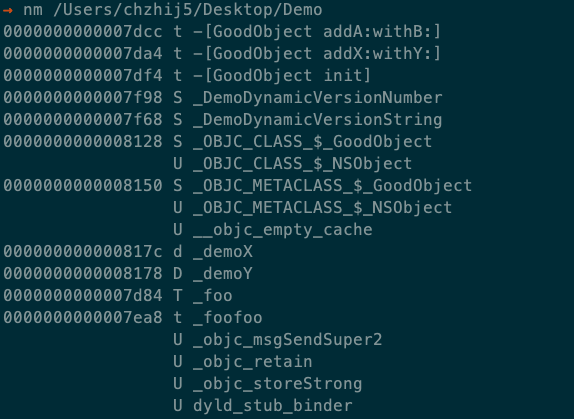

-------

nm -g 可以只查看全局符号（external symbol）：

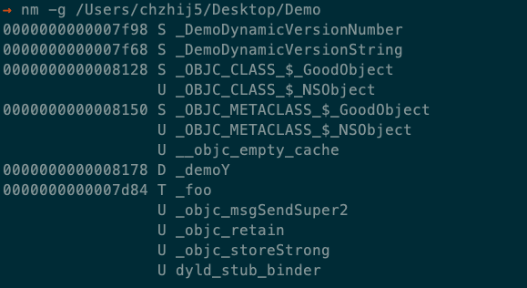

-------

上面两个图中，t、d等小写字母代表符号是局部符号，T、S、D、U 等大写字母代表符号是全局符号；字母代表的具体含义以及 nm 工具的使用说明，可以参看：[man nm](https://linux.die.net/man/1/nm)

## 符号在哪里

Mach-O 是 Mac/iOS 平台上通用的二进制格式（Unix平台的通用二进制格式是 Excutable and Library Format，简称 ELF），关于 Mach-O 的具体格式信息可以参考这一篇：[Parsing Macho-O files](https://lowlevelbits.org/parsing-mach-o-files)。 

Mach-O 中可能保存有调试信息，Mach-O 和 ELF 都采用一个叫 DWARF (Debug With Arbitrary Record Foramt) 的标准调试信息格式。DWARF 调试信息也可以单独用文件保存，叫 dSYM (Debug Symbol File) 文件，格式后缀名称为 .dSYM。

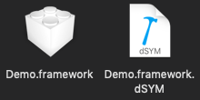

Mac/iOS 平台上的应用可执行文件、动态库、静态库等都是 Mach-O 格式，可以在对应的 Mach-O 格式中找到符号。其中静态库的全局符号、局部符号以及行号信息等保存在静态库对应的二进制文件中；可执行文件和动态库的全局符号、局部符号在动态库对应的二进制文件中，而行号等调试信息都单独存放在 dSYM 文件中。dSYM 文件中也有一份全局符号和局部符号信息的拷贝。

MachOView 可以可视化 Mach-O 以及 dSYM 文件。


静态库的符号信息在 Mach-O 文件中的位置：

* 二进制中的 Symbol Table 存储着全局和局部符号信息；
* 二进制中的 DWARF 存储着符号的行号信息。

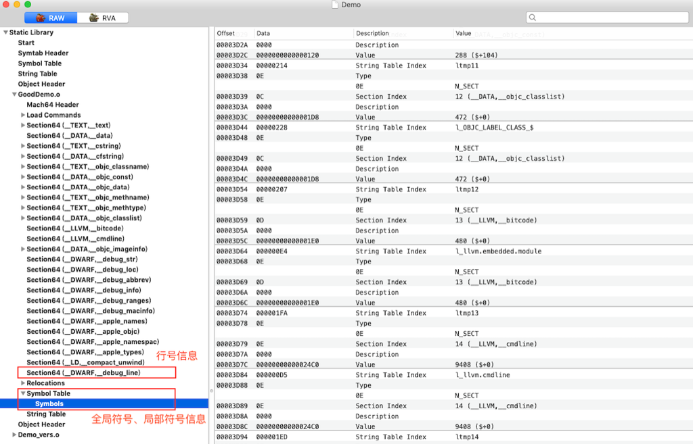

可执行文件和动态库的符号信息在 Mach-O 文件中的位置：

* 二进制和 dSYM 文件中的 Symbol Table 存储着全局和局部符号信息；
* dSYM 文件中的 DWARF 存储着行号信息。

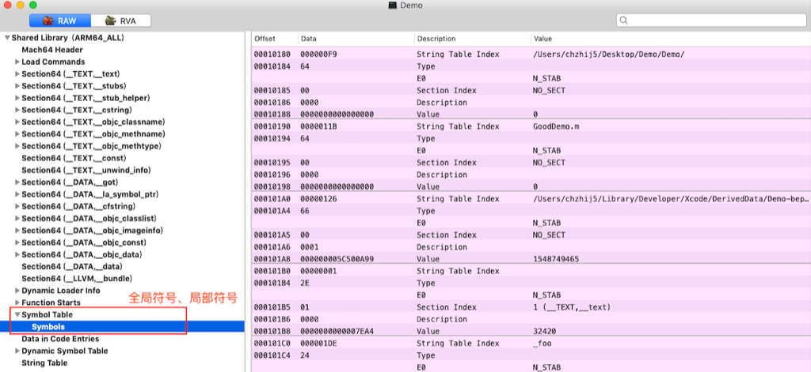

其中对应的调试信息被移动到了 dSYM 文件中，在 dSYM 文件中也有全局、局部符号信息：

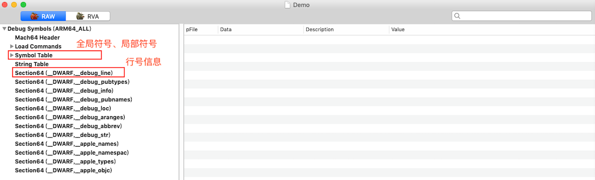

## 符号的作用

* 符号让库文件可以被引用，让目标文件可以相互链接生成可执行文件；
* 符号可以帮助开发者定位问题。

在开发过程中，开发者会依靠崩溃日志去定位问题，而原始的崩溃日志是一堆地址的组合，这些地址对于开发者是没有意义的。我们需要通过符号，翻译出地址对应的函数名以及文件名、文件行号信息。

一份原始的崩溃日志中的堆栈：

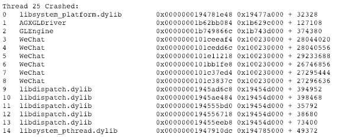

堆栈符号翻译后，可以看到地址对应的函数名以及对应的文件行号：

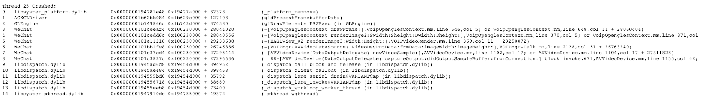

简单讲，符号翻译过程中通过 Symbol Table 解析出地址对应的函数名称，通过 DWAFT 信息解析出地址对应的文件名行号信息。

## 符号的相关配置

Xcode 编译时有几个选项是和符号是相关的。

-------

#### Build Setting -> Debug Infomation Format

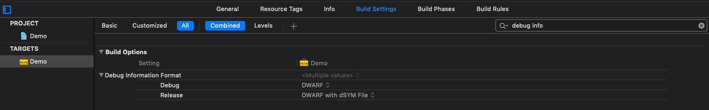

这里有两种选项：DWARF 和 DWARF with dSYM File。 
这配置对于动态库会有影响，设置为 DWARF with dSYM File，在生成动态库的时候会生成相应的 dSYM 文件；如果设置为 DWARF，则 dwarf 段即调试信息没有地方存放将丢失。

-------

#### Build Setting -> Generate Debug Symbols

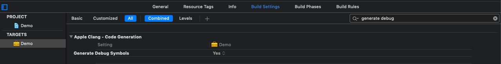

Generate Debug Symbols 为 YES 时在编译生成目标文件时会生成调试信息。

如果设置为 NO，那么 dwarf 段不会生成，也不会有 dSYM 文件生成。
如果设置为 NO，程序调试过程中的断点也不会中断，因为地址已经无法和对应代码行关联起来了。

-------

#### Build Setting -> Deployment

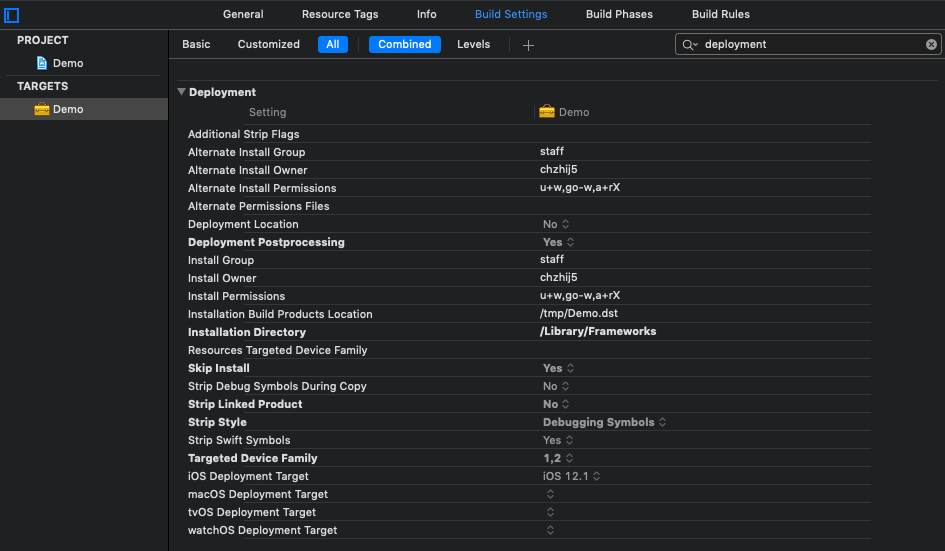

Deployment 中的以下三个配置和符号相关：

* Deployment Postprocessing
* Strip Linked Product
* Strip Style

##### Deployment Postprocessing

在编译生成目标文件之后是否要进行后续处理。如果为 YES，则进行编译完成后的后续处理；如果为 NO，则忽略。**特别强调，**使用 Xcode Archive 进行编译，Deloyment Postprocessing 的值恒为 YES，跟对应 Scheme 设置的值无关。

Strip Linked Product 等都受到这个开关控制，Deplyment Postprocessing 如果为 NO，则不进行裁剪符号的操作。

##### Strip Linked Product

是否裁剪已经链接完成的文件符号；如果为 YES，则进行裁剪；如果为 NO，则不进行裁剪。
裁剪什么级别的符号由 Strip Style 配置决定。

##### Strip Style

在设置为 Strip Linked Product 为 YES 的前提下，配置效果：

* **Debugging Symbols** ：会将调试符号从二进制中删除掉，即去除 DWARF 信息；
* **Non-Global Symbols** ：会将局部符号和调试符号从二进制中删除掉，即去除 DWARF 信息以及部分 Symbol Table 中的信息；
* **All Symbols** ：去除全部符号，即去除 DWARF 中的调试信息以及 Symbol Table 中目标模块定义的全局、局部符号信息。

**注意一：**
	其中，对于动态库和静态库不能去除全部符号(Strip All Symbols)，全局符号是库和其他库链接时沟通的桥梁，失去了全局符号，动态库和静态库就成为了黑盒。如果尝试去除动态库或者静态库的全部符号，会有如下报错：
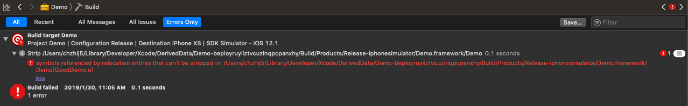

**注意二：**
去除符号的操作对于 dSYM 文件中的符号信息没有影响，所以对于动态库和可执行二进制文件，可以将符号尽可能去除掉减少二进制体积的大小。需要符号进行符号化崩溃日志时，再从 dSYM 文件中找对应符号。

## Xcode 关于符号的推荐配置

#### 对于静态库

#### Debug Infomation Format 

维持默认配置，对静态库无影响。

#### Generate Debug Symbols 

设置为 YES，默认配置就是 YES，这样才能支持断点调试。

#### Deployment

>Deployment Postprocessing 设置为 NO
>Strip Linked Product 设置为 NO
>Strip Style 设置为 Debugging Symbols（由于前面都设置为 NO，Strip Style配置无影响）

这样配置后，静态库的二进制的大小将会大大增加，因为二进制包含了调试信息，也就包含了行号信息，行号信息是特别大的。
静态库的大小并不影响最终安装包二进制的大小，同时调试符号能支持安装包或者链接的动态库生成相应的 dSYM 文件，方便定位静态库中的问题。

-------

#### 对于动态库

#### Debug Infomation Format 

**对于编译提供给外部使用的动态库的 scheme（或者理解为 Release/Distribution）：**

设置成 DWARF with dSYM File，这样在生成动态库的同时也会一并生成 dSYM 文件。

**对于编译开发阶段使用的动态库的 scheme（或者理解为 Debug）：**

对于比较大的动态库，生成 dSYM 文件是一个比较耗时的过程，在平时调试使用的 scheme 可以设置为 DWARF，节省调试时间。

#### Generate Debug Symbols 

设置为 YES，默认配置就是 YES，这样才能支持断点调试。

#### Deployment

**对于编译提供给外部使用的动态库的 scheme（或者理解为 Release/Distribution）：**

> Deployment Postprocessing 设置为 YES
> Strip Linked Product 设置为 YES
> Strip Style 设置为 Non-Global Symbols

这样配置后，动态库的二进制大小只剩全局符号，保证动态库能被其他工程引用，最大减小二进制大小；定位问题时可以使用 dSYM 文件去获取符号。

**对于编译开发阶段使用的动态库的 scheme（或者理解为 Debug）：**

> Deployment Postprocessing 设置为 NO
> Strip Linked Product 设置为 NO
> Strip Style 设置为 Non-Global Symbols（由于前面都设置为 NO，Strip Style 配置无影响）

这样配置后，动态库的二进制会包含全局符号和局部符号信息，这样动态库可以支持在无 dSYM 文件的情况下，自解析出符号（自解析出的符号不包含行号）。

-------

#### 对于可执行文件，即应用 app

#### Debug Infomation Format 

***对于编译外发版本的应用的 scheme（或者理解为 Release/Distribution）：***

对于编译外发版本的 app 的 scheme，设置成 DWARF with dSYM File，这样在生成 app 的同时也会一并生成 dSYM 文件。

***对于编译开发阶段使用的应用的 scheme（或者理解为 Debug）：***

对于比较大的 app，生成 dSYM 文件是一个比较耗时的过程，在平时调试使用的 scheme 可以设置为 DWARF，节省调试时间。

#### Generate Debug Symbols 

设置为 YES，默认配置就是 YES，这样才能支持断点调试。

#### Deployment

***对于编译外发版本的应用的 scheme（或者理解为 Release/Distribution）：***

> Deployment Postprocessing 设置为 YES
> Strip Linked Product 设置为 YES
> Strip Style 设置为 All Symbols

这样子，app中不带任何符号，可以减少安装包的大小同时避免符号泄漏。定位问题时，可以通过 dSYM 文件去获取符号。

***对于编译开发阶段使用的应用的 scheme（或者理解为 Debug）：***

> Deployment Postprocessing 设置为 NO
> Strip Linked Product 设置为 NO
> Strip Style 设置为 All Symbols（由于前面都设置为 NO，Strip Style配置无影响）

这样配置后，app 二进制中带有全局符号和局部符号信息，二进制本身可以支持不使用 dSYM 文件自解析出符号（自解析出的符号不包含行号）。

