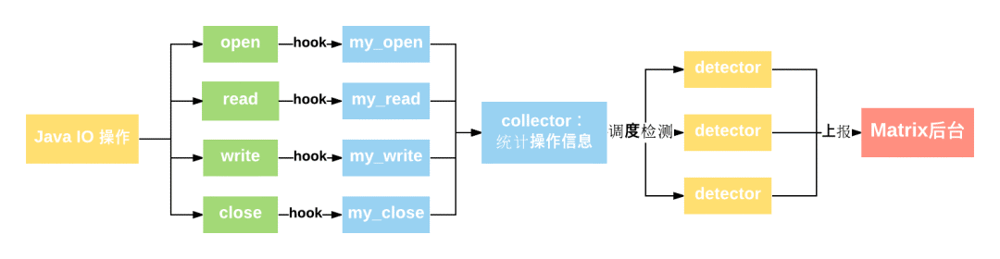
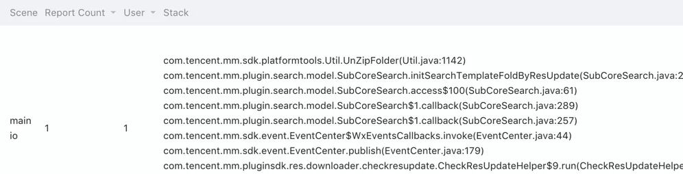
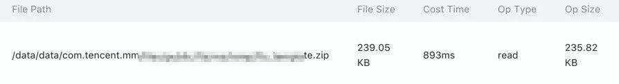
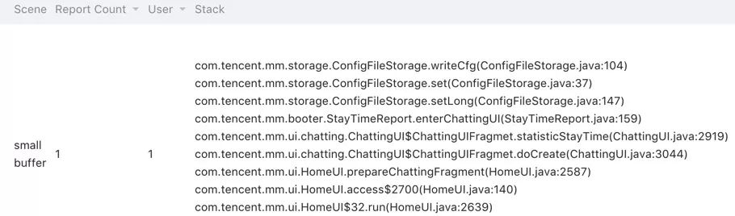
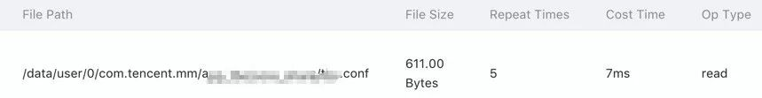
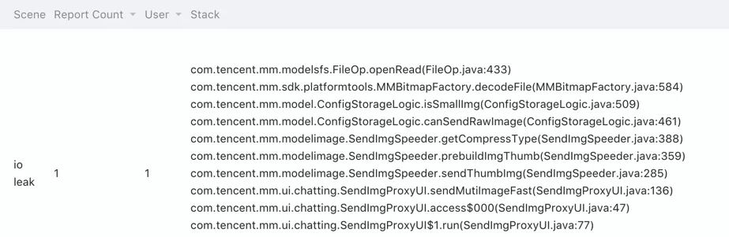
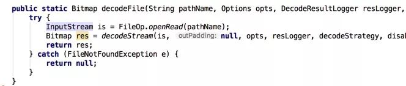

IOCanary 是一个在开发、测试或者灰度阶段辅助发现 I/O 问题的工具，目前主要包括文件 I/O 监控和 Closeable Leak 监控两部分。通过使用 IOCanary ，可以快速发现常见的 I/O 问题，提高开发质量。

## 文件 IO 监控

### 一、原理简述

IOCanary 将收集应用的文件中所有 I/O 信息并进行相关统计，再依据一定的算法规则进行检测，发现问题，将之上报到 Matrix 后台进行分析展示。流程图如下：


### 二、收集文件 IO 操作信息：Hook 方案简介

IOCanary 采用 hook(ELF hook) 的方案收集IO信息，代码无侵入，从而使得开发者可以**无感知接入**。方案主要通过 hook os posix 的四个关键的文件操作接口：

```c
int open(const char *pathname, int flags, mode_t mode);//成功时返回值就是fd
ssize_t read(int fd, void *buf, size_t size);
ssize_t write(int fd, const void *buf, size_t size);
int close(int fd);
```

以上看到，通过 hook 这几个接口，可以拿到大部分关键操作信息。这里举 open 的例子介绍下原理，简单起见，只结合 **Android M** 的代码以及大家最常用的 FileInputStream 分析。关键要找到 posix open 是在哪里被调用。由上往下列了大致的调用关系：  

```java
java : FileInputStream -> IoBridge.open -> Libcore.os.open 
-> BlockGuardOs.open -> Posix.open
                             ↓
jni : libcore_io_Posix.cpp 
static jobject Posix_open(...) {
    ...
    int fd = throwIfMinusOne(env, "open", TEMP_FAILURE_RETRY(open(path.c_str(), flags, mode)));
    ...
}
```

以上看到， android 框架的 FileInputStream ，最终是在 libcore\_io\_Posix.cpp 那里调到了posix的open接口。那么再找它被编到哪个 so ，查阅源码对应的 NativeCode.mk ，得到：

```makefile
LOCAL_MODULE := libjavacore
```

于是只要 hook libjavacore.so 的 open 符号就 ok 了。**找到 hook 目标 so 的目的是把 hook 的影响范围尽可能地降到最小。**
同样， write，read，close 也是大同小异。不同的 Android 版本会有些坑需要填，这里不细述， 目前兼容到Android P。 

由此便可以收集到应用在文件读写时的相关信息：**文件路径、fd、buffer 大小**等，并可以**统计耗时、操作次数**等。基于这些信息，就可以设定一些策略进行检测判断。

### 三、检测场景
接下来结合微信的 case 介绍一下主要检测哪些问题。

#### 3.1 检测主线程 I/O

耗时的 IO 操作不能占据主线程太久。检测条件：  

1. 操作线程为主线程
2. 连续读写耗时超过一定阈值或单次 write\read 耗时超过一定阈值

```
这里不强调任何文件 IO 操作都不能在主线程操作，但如果需要执行较长时间，那么建议还是抛到 Worker 线程执行。
```

我们看下在微信中检测到的例子，如：  




虽然这个 case 的耗时偏大不是必然发生的，但在主线程解压缩文件确实也埋下了卡主线程的隐患。

#### 3.2 读写Buffer过小

Buffer 过小，会导致 read/write 的次数增多，从而影响了性能。检测条件：

1. buffer 小于一定阈值
2. read/write 的次数超过一定的阈值

```
合适大小的 buffer 对 IO 读写效率的提升就不必多说了，一般情况下至少1024 byte 以上。我们来看一个微信 Android 中检测出的典型例子：
```



ConfigFileStorage 是一个提供 key-val 文件存储的工具类，也是很有历史而基本的一个类了。结合栈信息，找到 writeCfg 的实现：  

```java
private Map<Integer, Object> values;

private synchronized void writeCfg() {
...
	fileOut = new FileOutputStream(filePath);
	objOut = new ObjectOutputStream(fileOut);
	objOut.writeObject(values);
	fileOut.flush();
...
}
```

以上看到，主要是使用 ObjectOutputStream 直接把 values（一个map对象）序列化写到文件。但单纯的 ObjectOutputStream ，使用的 buffer 很小，会导致文件操作次数剧烈增加。通常可以通过 BufferedOutputStream 或者 ByteArrayOutputStream 来优化。下面就看下 writeCfg 用 BufferedOutputStream 优化后的数据对比，其中 values 填充了100个随机短字符串：  

| 实现方式                                | 耗时 | buffer大小 | 操作次数 |
| :-------------------------------------- | :--- | :--------- | :------- |
| ObjectOutputStream                      | 14ms | 57         | 309      |
| ObjectOutputStream+BufferedOutputStream | 7ms  | 5949       | 1        |

可以看出，用 BufferedOutputStream 优化，只是简单加几句代码，就有接近50%的优化。

#### 3.3 重复读

如果频繁地读某个文件，证明这个文件的内容很常被用到，可以通过缓存来提高效率。检测条件如下：

1. 同一线程读某个文件的次数超过一定阈值  

```
加一层内存 cache 是最直接有效的办法。最典型的比如图片的加载，如果没有内存 cache ，那么性能影响就比较大了。
```

当然微信 Android 中不会有这种图片加载都没加 cache 的情况。不过还是检测出了一些触发报错的 case ，如重复读取配置：



实际上，重复读的次数不止5次，只是阈值是5，就触发了上报。

## Closeable Leak 监控

### 一、简介及案例

**Closeable Leak 指的是打开资源包括文件、Cursor 等，没有及時 close，引起泄露**。这种问题基本就是因为开发的时候在思考人生了。但惊讶的是在微信 Android 中也检测出一些思考人生的时刻，如：



再看下对应的代码：



一个很基础的方法里，忘记 close 就这么发生了。  
而有了 IOCanary ，就不怕偶尔写代码的时候思考人生了。

### 二、无侵入实现：借StrictMode东风

Android 框架提供的 StrictMode 也支持 Closeable Leak Detect ，框架级的监控自然最合适的，所以决定借 StrictMode 东风。
稍微看下 StrictMode 的源码，发现主要依赖一个工具类 dalvik.system.CloseGuard 来实现。这里依然举 FileInputStream 的例子，看怎么发现没有 close 。

```java
//open
public FileInputStream(File file)...{
    ...
    //CloseGuard
    guard.open("close");
    ...
}
//close
public void close()...{
	...
    guard.close();
    ...
} 
//finalize
protected void finalize() throws IOException {
	...
    if (guard != null) {
        guard.warnIfOpen();
    }
    ...
}      
```

以上看到， GC 准备回收这个 FileInputStream ，会调用 guard.warnIfOpen 。再看下 guard.warnIfOpen 做了什么, 同时还有 guard.close 和 guard.open 。

```java
public void open(String closer) {
	...
    allocationSite = new Throwable(message);
    ...
}

public void close() {
    allocationSite = null;
}

public void warnIfOpen() {
    if (allocationSite == null || !ENABLED) {
        return;
    }
    ...
    REPORTER.report(message, allocationSite);
}
```

看到这里，就清晰了，warnIfOpen 时如果没 close ，就 REPORTER.report 。

到这里大概知道 Closeable Leak 怎么实现了，那怎么利用它呢，再看下 REPORTER ：

```java
//静态变量
private static volatile Reporter REPORTER = new DefaultReporter();
//接口
public static interface Reporter {
        public void report (String message, Throwable allocationSite);
}
```

看到这里， hook 点非常清晰，把 REPORTER 换掉就行了。找到了 hook 点，那么就容易了：

1. 利用反射，把 warnIfOpen 那个 ENABLED 值设为 true
2. 利用动态代理，把 REPORTER 替换成我定义的 proxy

这时，框架层的代码只要发现 closeable leak 问题就会 report 给 IOCanary 了。**当然框架层很多代码都用了 CloseGuard ，就可以发现比如文件资源没 close ， Cursor 没有 close 等等，一下子满足了好多愿望**。

## 小结

本文主要介绍了 Matrix 系统中的 IO 质量监控部分：IOCanary 。小结其优点为：

- 接入简单，代码无侵入
- 性能、泄漏全面监控，对 I/O 质量心中有数
- 兼容到 Android P


