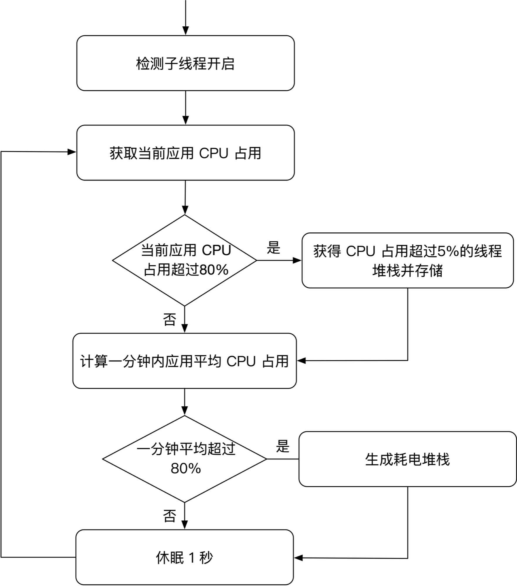
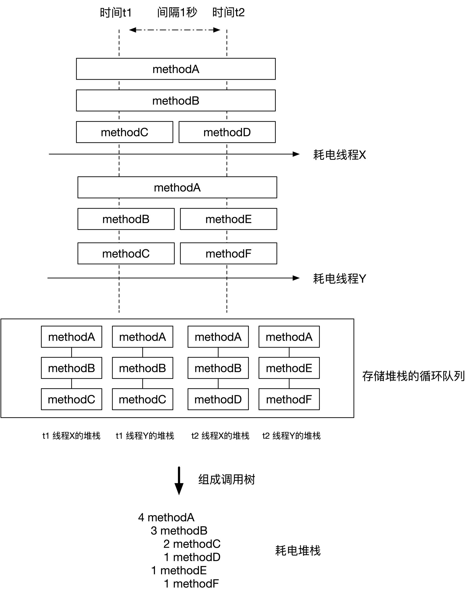
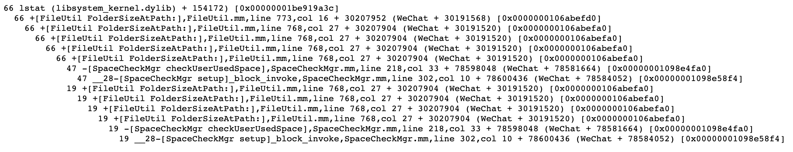

# Matrix-iOS 耗电监控

## 前言

在微信开发过程中，有时会收到一些反馈说，手机使用微信一段时间后就开始发烫了。为了跟进用户的发烫问题，最开始的时候，我们只能通过日志看看用户在这段时间做了些什么操作，努力去复现问题。

会导致手机发烫的原因很多，有可能只是用户在阳光下使用手机；但也有可能真的是微信某个模块代码有问题，导致当前 CPU 占用过高。这很让人头疼。如果能像查卡顿问题一样，有堆栈就好了。

在 WWDC 2018  [What’s New in Energy Debugging](https://developer.apple.com/videos/play/wwdc2018/228/) 苹果推介了 Energy Log 这种日志来查耗电问题。系统定期会获取当前应用的线程堆栈，当应用在前台平均三分钟或者后台平均一分钟内 CPU 占用超过 80%，系统会将收集到的线程堆栈组合成一颗函数调用树形成 Energy Log。

在 “Xcode -> Organizer -> Energy Log” 中可以看到应用上报上来的 Energy Log 数据。这些数据确实暴露了微信的一些代码问题，拿到几份 Energy Log 后，我们能快速地定位出一些耗电场景。但是 Energy Log 日志是 iOS 系统收集的，我们无法对日志做定制化，无法扩展；而且在日常开发过程中，获取 Energy Log 的成本很高。

经 Energy Log 的启发，我们在 Matrix 扩展实现了耗电监控功能，现在 Matrix 也能上报应用的 “Energy Log” —— 耗电堆栈。

## 耗电监控实现

iOS/macOS 的 Mach 内核提供了获取一个线程的使用信息的方法。这些信息记录在 thread_basic_info 结构体中：

```
struct thread_basic_info {
	time_value_t    user_time;      /* user run time */
	time_value_t    system_time;    /* system run time */
	integer_t       cpu_usage;      /* scaled cpu usage percentage */
	policy_t        policy;         /* scheduling policy in effect */
	integer_t       run_state;      /* run state (see below) */
	integer_t       flags;          /* various flags (see below) */
	integer_t       suspend_count;  /* suspend count for thread */
	integer_t       sleep_time;     /* number of seconds that thread
	                                 *  has been sleeping */
};
```

从 thread_basic_info 中可以获得线程的 CPU 占用。当前应用的总 CPU 占用即为每个线程 CPU 占用的累加。

在 iPhone 7 Plus 上测试，获取有十个线程的应用的总 CPU 占用平均耗时是 0.5 毫秒。

当识别出一个线程的 CPU 占用过高，iOS/macOS 平台上可以使用 backtrace() 函数获取到当前线程的堆栈。Matrix 耗电监控的实现就是建立在这个基础上。 

Matrix 耗电监控在应用启动后开启一个检测子线程，检测线程不断去识别出当前应用哪个线程的CPU占用过高，将耗CPU多的线程的堆栈收集起来。当应用CPU占用达到阈值时，耗电监控将收集到的堆栈组合形成耗电堆栈。具体监控流程如下：



一些细节：

1. 为了避免获得的堆栈无意义，只获取占用CPU超过 5% 的线程的堆栈；
2. 获得的耗CPU线程堆栈只存储在内存的循环队列中；
3. 耗电监控默认是当应用平均一分钟内CPU占用超过80%，把循环队列存储的堆栈组合成耗电堆栈。

在 iPhone 7 Plus 下测试，执行 backtrace( ) 获得一个线程的堆栈平均耗时是 50 微秒；在实际应用场景中，应用 CPU 占用过高时，一般最多只有 5 个线程的CPU占用会超过 5%。引入耗电监控几乎不带来性能损耗。


## 耗电堆栈

收集得到的耗 CPU 堆栈是如何组成耗电堆栈呢？如下图所示，将 2 秒内的两个耗 CPU 线程堆栈组合成耗电堆栈的过程：



耗电堆栈中的数字代表堆栈函数被收集到的次数，缩进关系代表函数之间的调用关系。可以认为在耗电堆栈中，函数对应的数字越大，这个函数占用了更多的 CPU。

耗电监控在异步线程生成耗电堆栈。在 iPhone 7 Plus 测试，生成一个耗电堆栈耗时为 17 毫秒，该耗时和堆栈的复杂度有关，仅作为参考。

耗电监控已经在 iOS 微信灰度并上线了一段时间，期间通过耗电堆栈，我们发现了一些耗电场景：

1. 同时上传或者下载多张图片；
2. 同时下载大量微信收藏资源；
3. 进行 Voip 视频通话；
4. 使用微信小游戏；
5. 计算微信占用磁盘空间大小。

其中“计算微信占用磁盘空间大小”这个场景，对应的耗电堆栈如下：



通过这份堆栈，并结合 Xcode 提供的 Instrument 工具，我们分析了这个场景占用 CPU 的具体原因。最近，我们通过缓存文件夹大小的计算结果对这个场景进行了优化。

## 接入耗电监控

Matrix 耗电监控复用了原有卡顿监控的检测线程，相关的配置定义在 WCBlockMonitorConfiguration 中：

* bGetPowerConsumeStack
* powerConsumeStackCPULimit

bGetPowerConsumeStack 设置为 YES ，即能让应用开启耗电监控；
powerConsumeStackCPULimit 设置应用耗电的 CPU 阈值，默认值为 80%。

耗电堆栈作为 WCCrashBlockMonitorPlugin 中的一种日志类型进行上报：

* EDumpType_PowerConsume = 2011

获取耗电堆栈日志和获取前台卡顿日志的方式一致。

## 结尾

耗电监控作为 Matrix 组件的新特性，全部代码已经开源，开源地址：https://github.com/tencent/matrix ，欢迎提出你的 issue 和 PR。


